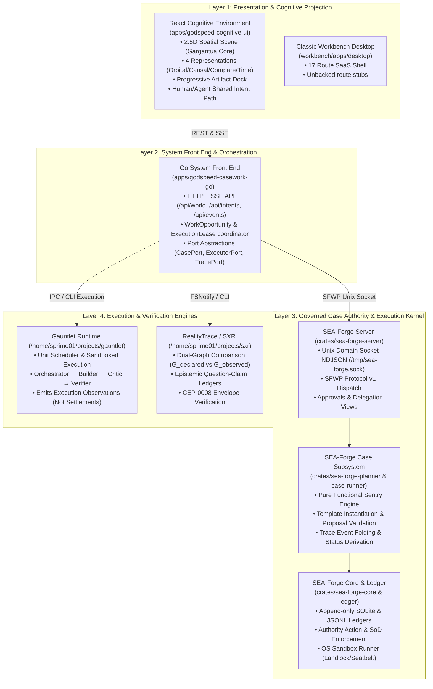
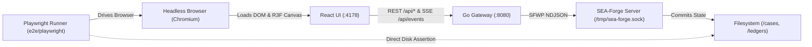

# SEA-Forge End-to-End User Journey, Case Engine & Frontend Contract Mapping Report

**Date:** 2026-09-23  
**Status:** Verified with errata (2026-09-23). Section 0 supersedes the body where they conflict.  
**Target Subsystems:**
- SEA-Forge Case Subsystem & Kernel ([`crates/sea-forge-planner`](file:///home/sprime01/projects/sea-rs/crates/sea-forge-planner), [`crates/sea-forge-case-runner`](file:///home/sprime01/projects/sea-rs/crates/sea-forge-case-runner), [`crates/sea-forge-server`](file:///home/sprime01/projects/sea-rs/crates/sea-forge-server), [`crates/sea-forge-cli`](file:///home/sprime01/projects/sea-rs/crates/sea-forge-cli))
- Canonical Interaction Model ([`.sea/interaction/`](file:///home/sprime01/projects/sea-rs/.sea/interaction/))
- System Interface Contracts ([`.agents/reports/interface-contracts/`](file:///home/sprime01/projects/sea-rs/.agents/reports/interface-contracts/))
- Go System Front End ([`apps/godspeed-casework-go`](file:///home/sprime01/projects/sea-rs/apps/godspeed-casework-go))
- React Cognitive Environment ([`apps/godspeed-cognitive-ui`](file:///home/sprime01/projects/sea-rs/apps/godspeed-cognitive-ui))
- Classic Workbench Desktop ([`workbench/apps/desktop`](file:///home/sprime01/projects/sea-rs/workbench/apps/desktop))

---

## 0. Verification Errata (2026-09-23) — READ FIRST, SUPERSEDES THE BODY

This report was checked against the working tree by five independent verifiers, and the facts that affect the plan were then spot-checked by hand. **The body below has material errors.** Where this section and the body disagree, this section is correct. The wiring plan is [`.agents/plans/2026-09-23-casework-live-wiring-production.plan.yaml`](../plans/2026-09-23-casework-live-wiring-production.plan.yaml).

### 0.0 T09 contract review (2026-09-30; operator and independent architecture approval)

The T09 redesign trigger applies to live execution observations without a measured percentage
and to full grounded Thoth answer disclosures. Existing `execution_trace` objects already
represent run children; that part is an implementation gap. A scoped additive contract proposal
passed independent architecture review at [t09-contract-extension-proposal.md](casework-live-wiring/t09-contract-extension-proposal.md).
The operator approved the surfaced amendment; implementation verification remains pending, and no
proposed public interface is implemented. See `redesign_reviews.T09-contract`
in the decision log. T07/T08 verification continues independently of this decision.

### 0.1 Blocking gaps the report missed

| ID | Gap | Evidence |
|---|---|---|
| **GAP-A** | **Two incompatible UI↔Go contracts.** The UI port (`src/ports/contract.ts`) consumes the spec-04 `CognitiveWorldSnapshot` (`visible_objects`, action intents `APPROVE_HUMAN_TASK`/`REJECT_HUMAN_TASK`/`ESCALATE_OR_OVERRIDE`/`OPEN_ARTIFACT`) from `.agents/reports/interface-contracts/typescript/types.ts`. The Go gateway serves its own projection (`objects`, `surfaces`, `revisions`) with kebab-case intents (`focus-object`, `resolve-object`, `inspect-artifact`, `request-explanation`, `propose-consequence`, `decide-approval`, `persist-artifact`). Those intents match `apps/godspeed-cognitive-ui/contracts/interaction.ts`, not the UI's `src/`. A live HTTP adapter would not work against Go as it stands. | `src/ports/contract.ts:1-45,147-169`; `contracts/interaction.ts:9-17`; `internal/coordinator/coordinator.go:61-69`; `internal/projection/projection.go` |
| **GAP-B** | **The server identity model is one actor per OS uid.** `sea-forge-server` derives the caller from `peer_cred().uid`. It deliberately refuses client-asserted identity. A Go gateway that runs as one uid can act only as one actor, so browser role switching (E2E-J5 operator → R-SO) and multiple users can't work without a security-model change: a gateway principal that is allowed to assert gateway-authenticated end users. That change needs an ADR. | `crates/sea-forge-server/src/identity.rs:14-27,56-62` |
| **GAP-C** | **The SFWP has no mutation verbs for most case operations.** There is no verb for discretionary add, reopen, terminate, advancing or executing an item, completing a human task, or fetching an artifact or evidence. These exist only as CLI commands (`case add-task`, `case reopen`, `resume`, `task complete`, `manager iterate`). Case execution is driven by the CLI; no daemon advances cases. | `crates/sea-forge-server/src/sfwp/mod.rs:107-249`; `crates/sea-forge-cli/src/main.rs:296-318` |
| **GAP-D** | **No real plan templates exist.** `case.entry_options` reads `<root>/templates/*.yaml`, but the repo contains no template YAML files. `audit-pipeline@1.0` does not exist. | `crates/sea-forge-server/src/sfwp/case.rs:70-105`; `crates/sea-forge-planner/src/templates.rs` |
| **GAP-E** | **A working SFWP client already exists in Rust.** The Tauri bridge (`workbench/apps/desktop/src-tauri/src/bridge.rs`: `sfwp_query`, `sfwp_command`, `sfwp_identity`, `sfwp_request_status`) is the reference implementation for framing, `request_id` correlation, and identity-error classes. The Go client should mirror it. | `workbench/apps/desktop/src-tauri/src/bridge.rs:306-525` |

### 0.2 Corrections to specific claims

**SEA-Forge server / SFWP**
- The wire format is **not JSON-RPC 2.0**. It is NDJSON with a serde-tagged enum: `{"verb":"case_list", ...}` (`#[serde(tag="verb", rename_all="snake_case")]`, `crates/sea-forge-server/src/lib.rs:592-595`). Dotted names like `case.list` are logical SFWP names. Phase 1 step 2 of the body is wrong.
- The socket is not `/tmp/sea-forge.sock`. The default is `<root>/.sea-forge/server.sock`, which you can override with `SEA_FORGE_SOCKET` or `SEA_FORGE_ROOT`/`server.yaml` (`config.rs:38,86-92`). The binary takes **no CLI arguments**, so `--socket` does not exist.
- There are 23 SFWP verbs (**TRUE**): `system.hello/describe/get_schema`, `request.get_status`, `events.subscribe/unsubscribe/get_range`, `readiness.get`, `identity.get`, `thoth.ask`, `case.entry_options/preflight/commit/list/get_overview/get_horizon`, `approval.list/decide`, `run.list/get`, `asset.list`, `delegation.preview/list`. There are also legacy verbs: `submit`, `status`, `approve`, `reject`, `agent_list`, `agent_probe`, `delegate`, `cancel_delegation`, `ask`.
- `readiness.inspect` is actually **`readiness.get`**. `case_add_discretionary_work` **does not exist** (see GAP-C).
- **Event streaming exists.** `events.subscribe` (with `from_cursor` replay) is backed by a durable ledger plus a `tokio::broadcast` bus (`lib.rs:104,157,222,1229`). The body understates this. **CORRECTED 2026-10-05 (C-2):** direct relay does not prove durable ordering or restart history: concurrent append tasks publish after completion, while replay order is defined by append ordinal. Live event cursors are exact ULIDs, not the canonical numeric-dot grammar. Public correction proposals remain held for independent review and operator approval; see the decision log and CW-07/09/10. This correction does not authorize contract/runtime changes.
- `approval.decide` does not enforce SoD itself. The server passes the verified actor to the CLI (`run_cli`, `lib.rs:2623-2698,2995`), and the CLI enforces SoD, mints the grant and writes the trace.

**Case engine / CLI**
- `reopen` lives in `crates/sea-forge-cli/src/commands/case.rs:75`, not in `case_engine.rs`. `propose_item` is at L129, not L111.
- These CLI commands **do not exist**: `case submit/list/show`, `approval list/decide`, `cell status`, `readiness`, `admin init-cell`, `capabilities`, `run execute`, `settle`, `evidence list`, and `memory query`. `case reopen` and `case add-task` do exist, and so do the top-level `approve`, `reject`, `export`, `import`, `resume`, `task complete` and `manager iterate`. **No `case terminate` command exists.** `TerminateCase` is only a `CaseAction` variant.
- The real `TraceKind` variants (`crates/sea-forge-core/src/types.rs:501`) are `CaseCreated, RunStarted, PlanCreated, AuthorityEvaluated, WorkspaceCreated, CommandStarted, CommandFinished, ArtifactCaptured, SettlementRecorded, RunHalted, RunFinished, CaseClosed, InternalError, MilestoneAchieved, PlanMutated, CaseFileItemAdded, ItemEnabled, ItemActivated, ItemCompleted, ItemFailed, ItemTerminated, HumanTaskCompleted, CaseReopened, CaseTerminated`. **`ItemStarted` should be `ItemActivated`. `ApprovalDecided` does not exist.**
- `SandboxedTask` is an `ItemKind` variant, not an `Operation`. Landlock is real (`sea-forge-sandbox` `jail.rs`). **Seatbelt does not exist.**
- Gauntlet appears only in `crates/sea-forge-server/examples/journey_gauntlet_bootstrap.rs`. Nothing integrates it with the gateway yet.

**Go System Front End**
- Fixtures are **compiled in** (`fixturedata/northstar.world.json` via `projection/fixture.go`), not loaded from `configs/fixture-serve.json`. That file configures adapters and capabilities. The only adapter is `internal/adapters/fakeauthority`.
- Ports are `Health`, `AuthorityPort{ListCases, Settlement, History}`, `ExecutionPort{Execute}`, `RepositoryPort{Proposal}` and `ArtifactStore{Put, Get}` (`internal/ports/ports.go:40,103-129`). **`CasePort`, `ExecutorPort` and `TracePort` do not exist.**
- Routes are `GET /api/healthz`, `/api/world`, `/api/time`, `/api/events` (SSE, `?last=`, 15 s heartbeat), `/api/artifacts` and `/api/artifacts/{ref}`, plus `POST /api/intents` and `/api/artifacts`. `/api/inbox` and `/api/cases` **do not exist**. The handler line ranges in §7 are wrong: `handleIntent` is at L122-131 and `handleEvents` at L202-256.
- The flags are `-config`, `-serve`, and `-addr` (default `127.0.0.1:4179`). `--socket` and `--port` do not exist. The gateway does not serve the UI build, and CORS is loopback-only.
- There is no Unix socket or SFWP client in Go, and no WorkOpportunity or ExecutionLease coordinator beyond fixture leases.

**Cognitive UI**
- The adapter is **hardcoded** as `LocalContractAdapter` (`src/main.tsx:21`), and there is no `?source=` parameter. `src/adapters/http/` does not exist.
- `CaseDesignPanel` shows "Submit proposal" with `aria-label="Submit disabled: {reason}"`. The quoted text "Template proposals disabled in this build" is not in the code.
- `ExecutionPill` shows only percent progress. It has no 4-second timer.
- `ArtifactDock` does **not** lazy-load 9 chunks. The 9 renderer files exist (Chart, Diff, Graph, Json, Markdown, Table, Text, Timeline, Trace) but are statically imported, so the VAR-006 network assertion in E2E-J6 would fail today.
- The surfaces are `orbital | causal | compare | judgment` (`src/model/types.ts:160`), not "comparison/temporal". Nothing named "Gargantua" exists in this app.
- The UI knows only these action intents: `APPROVE_HUMAN_TASK`, `REJECT_HUMAN_TASK`, `ESCALATE_OR_OVERRIDE`, `OPEN_ARTIFACT`. `BEGIN_WORK`, `ADD_DISCRETIONARY_WORK`, `REOPEN_WORK`, `EXPORT_AUDIT_BUNDLE` and `PROPOSE_CASE` do not exist.
- The Vite dev server is on :4178 (strictPort) and proxies `/api` to `127.0.0.1:4179`, which is correct. The E2E runner is `bun e2e/run.ts` driving `agent-browser`. There is no Playwright.

**Docs / workbench / justfile**
- `.sea/interaction/interaction-model.sea` and the 12 CJ names are correct. The 8 steps are modeled as `IS1..IS8`, and the phase labels in §3 are narrative, not source.
- The interface-contracts files 04 and 08 and `02-JOURNEY-CUBE.md` exist, and their line references are correct.
- The workbench has 17 routes (correct). It talks to the server through the Tauri SFWP bridge (GAP-E).
- ~~The justfile recipes `casework-server-up`, `casework-go-up`, `casework-ui-up` and `casework-e2e-live` **do not exist**. Only `casework-go-check` and `workbench-*` exist.~~ **CORRECTED 2026-09-23 (correction C-1, decision log `casework-live-wiring/decision-log.yaml`):** this claim was wrong even at verification time. `casework-ui-up/down/status` have existed since commit 118761a (2026-09-19), and `casework-go-up/down/status` + `casework-demo-up` were added in commit 44ffadd (2026-09-23, +103 justfile lines) — the same commit that shipped this Section 0 and the wiring plan. Both `casework-go-up` (config `configs/fixture-serve.json`) and `casework-demo-up` boot the FIXTURE stack. Also existing: `casework-ui-check`. Still true: `casework-server-up`, `casework-cell-init`, `casework-stack-down` and `casework-e2e-live` do not exist.

### 0.3 Operator decisions (2026-09-23) and E2E runner change

- **D-1, contract:** the spec-04 `CognitiveWorldSnapshot` (`interface-contracts/typescript/types.ts`) is the single UI↔gateway contract. The Go projection moves to it, and `apps/godspeed-cognitive-ui/contracts/*.ts` is retired or mapped.
- **D-2, identity:** a gateway principal may act `on_behalf_of` allowlisted, gateway-authenticated end users. The ledger records both principals, and SoD compares end users. This needs an ADR that amends `identity.rs`.
- **D-3, execution:** add an explicit `case.advance`/`item.execute` verb plus an opt-in server supervisor. Both call `CaseRunner` in-process, not through the CLI.
- **Dependencies:** a Go OIDC library and `golang.org/x/crypto/argon2` are approved.
- **Browser driver:** **Playwright is replaced by `agent-browser`.** Everywhere §5 and §6 say "Playwright" (`e2e/playwright/`, `playwright.config.ts`, `bun x playwright test`), read the existing agent-browser harness (`e2e/browser.ts`, `ladder.ts`, `run.ts`) extended with a live mode (`bun e2e/run.ts --live`). Use `--session` for each browser user, `network requests|har` for the lazy-chunk assertion, `errors`/`console` for zero-error checks, and `record`/`trace`/`screenshot` for evidence. The live ladder IDs are `L0..L9` and `L-RECOV`, as in plan task T10.

---

## 1. Executive Summary & Diagnostic

### 1.1 The Operational Paradox
SEA-Forge is an enterprise-grade, append-only, sentry-driven, capability-execution kernel. At its core, **users interact with SEA-Forge almost entirely through its Case Management System and CLI**:
1. Operators author, preflight, and commit cases instantiated from parameterized plan templates.
2. The case engine evaluates pure functional sentries against immutable trace events, unlocking plan items deterministically.
3. Operators add discretionary work in flight, supervise human tasks, resolve escalated approvals, and track Separation of Duties (SoD).
4. Executors run within strict Landlock/Seatbelt OS sandboxes or external Gauntlet environments, emitting verifiable execution observations.
5. Authorities evaluate evidence against explicit criteria to record irrevocable settlements, leaving immutable hash-chained ledgers.
6. Operators navigate history, audit discrepancies (RealityTrace/SXR), and reopen terminated or completed cases to adapt work.

**However, the frontend experience currently exposes only a tiny fraction of this operational reality:**
- **The Cognitive UI ([`apps/godspeed-cognitive-ui`](file:///home/sprime01/projects/sea-rs/apps/godspeed-cognitive-ui))**: Features an advanced 2.5D spatial/causal/temporal environment with 4 distinct representations (orbital, causal, comparison, temporal) and an affordance ladder (J0–J9 + RECOVERY). **Critically, it runs exclusively against an in-memory mock contract adapter ([`src/adapters/local/`](file:///home/sprime01/projects/sea-rs/apps/godspeed-cognitive-ui/src/adapters/local/))** serving hardcoded JSON snapshots. It has no live connection to the SEA-Forge kernel.
- **The Go System Front End ([`apps/godspeed-casework-go`](file:///home/sprime01/projects/sea-rs/apps/godspeed-casework-go))**: Designed as the operational bridge (REST + SSE) between the browser and backend daemons, it currently serves static Northstar fixture payloads ([`configs/fixture-serve.json`](file:///home/sprime01/projects/sea-rs/apps/godspeed-casework-go/configs/fixture-serve.json)) and contains stubbed port implementations.
- **The Classic Desktop Workbench ([`workbench/apps/desktop`](file:///home/sprime01/projects/sea-rs/workbench/apps/desktop))**: Migrated around the Gargantua black hole renderer, but many core routes (`/models`, `/memory`, `/capabilities`, `/artifacts`, `/federation`) are explicitly designated as unbacked/unavailable, and `/delegate` offers no commit action.

### 1.2 Purpose of this Blueprint
This report bridges the chasm between backend capability and frontend affordance. It provides:
1. An exhaustive mapping of the **12 Canonical Journeys (`CJ01`–`CJ12`)** across the Case Engine, Go Ports, and Cognitive UI.
2. A definitive inventory of the **8 Critical Seams & Gaps** preventing live end-to-end operation.
3. An executable **Master Playwright E2E Journey Ladder** that a cold agent can implement to trace, verify, and settle the entire software lifecycle from browser clicks down to kernel ledger commits.

---

## 2. System Architecture & Ownership Topology

The GodSpeed casework stack is partitioned into five distinct layers with strict boundaries:



### Layer Ownership Summary
- **Authority over Meaning & Settlement:** Exclusively owned by **SEA-Forge Rust Kernel** ([`crates/sea-forge-core`](file:///home/sprime01/projects/sea-rs/crates/sea-forge-core), [`crates/sea-forge-settlement`](file:///home/sprime01/projects/sea-rs/crates/sea-forge-settlement)).
- **Authority over Execution Observation:** Owned by **Gauntlet** and **SEA-Forge Sandbox**; process completion is *never* settlement.
- **Authority over Discrepancy & Audit:** Owned by **RealityTrace (`sxr`)**; evaluates residuals between declared and observed reality.
- **Authority over Interaction & Projection Assembly:** Owned by **Go System Front End** ([`apps/godspeed-casework-go`](file:///home/sprime01/projects/sea-rs/apps/godspeed-casework-go)).
- **Presentation & Operator Affordance:** Owned by **React Cognitive Environment** ([`apps/godspeed-cognitive-ui`](file:///home/sprime01/projects/sea-rs/apps/godspeed-cognitive-ui)).

---

## 3. The 12 Canonical Journeys: Case Engine & Frontend Mapping

The canonical interaction model in [`.sea/interaction/`](file:///home/sprime01/projects/sea-rs/.sea/interaction/) condenses all 128 observed UX epic stories into 12 Canonical Journeys (`CJ01`–`CJ12`). Every journey traverses the invariant 8-phase skeleton:
$$\text{Context Selection} \to \text{Preflight} \to \text{Authority Resolution} \to \text{Capability Invocation} \to \text{State Effect} \to \text{Evidence Inspection} \to \text{Settlement/Decision} \to \text{Next Affordance}$$

Below is the complete end-to-end mapping from the **Case Engine & CLI** to the **Go Ports** and **Frontend Contracts**:

### CJ01: Establish Trusted Cell Context
- **Intention:** Bind operator identity, verify cell readiness, pin active policy snapshot, and establish cryptographic ledger roots.
- **Case Engine Mechanism:**
  - CLI: `sea-forge cell status`, `sea-forge readiness`, `sea-forge admin init-cell`.
  - Kernel: [`crates/sea-forge-cell`](file:///home/sprime01/projects/sea-rs/crates/sea-forge-cell), [`crates/sea-forge-server/src/sfwp/readiness.rs`](file:///home/sprime01/projects/sea-rs/crates/sea-forge-server/src/sfwp/readiness.rs) (`readiness.inspect`).
  - Evidence: `cell_manifest.json`, policy SHA-256 digest, monotonic ledger stream validation.
- **Go System Port:**
  - `GET /api/healthz` $\to$ `healthBody { Status: "ok", Provenance, LiveCursor }`.
  - [`ports.Health`](file:///home/sprime01/projects/sea-rs/apps/godspeed-casework-go/internal/ports/ports.go#L40) interface.
- **Cognitive UI Surface:**
  - J0 Orientation Scene: Persistent Gargantua Core rendered as deep visual anchor.
  - Perspective badge: `actor_id`, `role`, cell health status phrase.
- **Current Standing:** **Partial**. Mock UI renders Core; Go serves `/api/healthz`; SFWP `readiness.inspect` is implemented in Rust but not wired to Go.

### CJ02: Discover Lawful Affordances
- **Intention:** Probe what actions, cases, templates, and capabilities are currently permitted, reachable, and settleable.
- **Case Engine Mechanism:**
  - CLI: `sea-forge case list`, `sea-forge ask "what can I do?"`, `sea-forge capabilities`.
  - SFWP: `case.list` ([`sfwp/case_views.rs:114`](file:///home/sprime01/projects/sea-rs/crates/sea-forge-server/src/sfwp/case_views.rs#L114)), `case.entry_options` ([`sfwp/case.rs:70`](file:///home/sprime01/projects/sea-rs/crates/sea-forge-server/src/sfwp/case.rs#L70)), `thoth.ask`.
- **Go System Port:**
  - `GET /api/world?cursor=live` $\to$ [`CognitiveWorldSnapshot`](file:///home/sprime01/projects/sea-rs/.agents/reports/interface-contracts/04-REACT-COGNITIVE-ENVIRONMENT-CONTRACT-SPECIFICATION.md#L106).
  - Translates SFWP authority into `visible_objects` and `available_actions` based on caller role.
- **Cognitive UI Surface:**
  - Orbital Representation: System view showing region spheres and case objects.
  - Composer prompt: Contextual inquiry input.
- **Current Standing:** **Partial**. UI renders mock objects; Go serves mock world; SFWP `case.list` and `case.entry_options` implemented in Rust.

### CJ03: Ground Work in Semantic Meaning
- **Intention:** Bind work to verified DomainForge `.sea` domain specifications, proving ontology invariants and rules.
- **Case Engine Mechanism:**
  - CLI: `domainforge validate`, `sea-forge ask --semantic`.
  - Kernel: [`crates/sea-forge-domainforge`](file:///home/sprime01/projects/sea-rs/crates/sea-forge-domainforge), `compute_pack_content_hash`.
  - Evidence: `domain_model_hash` carried in all envelopes and trace events.
- **Go System Port:**
  - `GET /api/artifacts/{ref}` resolving `.sea` model contracts and projection schemas.
- **Cognitive UI Surface:**
  - Causal Representation: Semantic nodes mapped with causal roles (`expected`, `assumption`, `condition`, `dependency`, `consequence`).
- **Current Standing:** **Partial**. DomainForge 0.16.0 models `.sea/interaction/interaction-model.sea`; UI has causal view; live dynamic projection from `.sea` packs is unlanded.

### CJ04: Form & Commit Governed Case
- **Intention:** Select a plan template, provide parameter values, preflight validation constraints, and commit an active case.
- **Case Engine Mechanism:**
  - CLI: `sea-forge case submit --template audit-pipeline@1.0 --param key=val`.
  - SFWP: `case.entry_options` (lists `<root>/templates/*.yaml`) $\to$ `case.preflight` (pure functional dry run via `validate_proposal`) $\to$ `case.commit` (`CaseCommit`).
  - Kernel: Generates `case-<ULID>`, writes `cases/<case_id>/case.json` and `plan.json`, emits `TraceKind::CaseCreated` and `TraceKind::PlanCreated`.
- **Go System Port:**
  - `POST /api/cases` (proposed) or `POST /api/intents` with intent `BEGIN_WORK`.
  - Translates proposal to SFWP `CaseCommit` request with optimistic digest pin.
- **Cognitive UI Surface:**
  - Case Design Panel ([`apps/godspeed-cognitive-ui/src/ui/CaseDesignPanel.tsx`](file:///home/sprime01/projects/sea-rs/apps/godspeed-cognitive-ui/src/ui/CaseDesignPanel.tsx)):
    - Allows stage reordering, evidence toggle, draft saving.
    - **Current Gap:** "Submit" button is explicitly disabled in UI ("Template proposals disabled in this build").
- **Current Standing:** **Disconnected**. Backend engine fully supports template listing, preflight, and commit. UI has design interface but blocks submission.

### CJ05: Navigate & Adapt Live Case
- **Intention:** Inspect case progression, observe sentry triggering, and dynamically adapt the active plan with discretionary tasks.
- **Case Engine Mechanism:**
  - CLI: `sea-forge case show <case_id>`, `sea-forge case add-task <case_id> <item.json>`.
  - SFWP: `case.get_overview`, `case.get_horizon` (folds `case-events.jsonl` into [`HorizonItem`](file:///home/sprime01/projects/sea-rs/crates/sea-forge-server/src/sfwp/case_views.rs#L88)).
  - Kernel: `case_engine::evaluate_sentries`, `validate_proposal`, SoD tracking (`PlanItem.proposed_by`), ledger record `case_plan_mutation`.
- **Go System Port:**
  - `GET /api/world` with folded plan items as [`CognitiveObject`](file:///home/sprime01/projects/sea-rs/.agents/reports/interface-contracts/04-REACT-COGNITIVE-ENVIRONMENT-CONTRACT-SPECIFICATION.md#L77).
  - `POST /api/intents` with intent `ADD_DISCRETIONARY_WORK`.
- **Cognitive UI Surface:**
  - Focused Case View: Orbiting stage facets and work unit spheres.
  - Sentry state: Natural language phrases ("Ready after security review", not "Blocked by Sentry S9").
  - Center chips: "Causal view", "History", "Compare with earlier".
- **Current Standing:** **Partial**. UI has complete visual affordances for navigation and comparison; backend has full mutation logic; Go adapter does not forward mutations to kernel.

### CJ06: Resolve Human Judgment & Approval
- **Intention:** Present escalated policy decisions, security reviews, or manual tasks to entitled human actors with full governance context.
- **Case Engine Mechanism:**
  - CLI: `sea-forge approval list`, `sea-forge approval decide <appr_id> --approve`.
  - SFWP: `approval.list` (reads `approvals.jsonl`), `approval.decide` ([`sfwp/approvals.rs:1-30`](file:///home/sprime01/projects/sea-rs/crates/sea-forge-server/src/sfwp/approvals.rs)).
  - Kernel: Evaluates `ApprovalGovernanceContext`, enforces SoD (proposer $\neq$ approver), mints `ActionGrant` on approve, resumes case sentries.
- **Go System Port:**
  - `GET /api/inbox` (or folded into `available_actions` on cognitive objects).
  - `POST /api/intents` with `APPROVE_HUMAN_TASK` / `REJECT_HUMAN_TASK`.
- **Cognitive UI Surface:**
  - Judgment Panel ([`apps/godspeed-cognitive-ui/src/ui/JudgmentPanel.tsx`](file:///home/sprime01/projects/sea-rs/apps/godspeed-cognitive-ui/src/ui/JudgmentPanel.tsx)):
    - Appears when object requires attention (`AttentionState: requires-judgment`).
    - Presents role-filtered actions, justification input, and impact preview.
- **Current Standing:** **Isolated**. Cognitive UI J8 exercises Judgment Panel with mock authority denial and approval. SFWP approval subsystem is fully implemented in Rust but unwired to Go.

### CJ07: Execute Governed Work
- **Intention:** Dispatch authorized tasks to Landlock sandboxes or Gauntlet runners, enforcing boundaries, timeouts, and token budgets.
- **Case Engine Mechanism:**
  - CLI: `sea-forge run execute`, `sea-forge delegate <agent_task>`.
  - Kernel: [`crates/sea-forge-sandbox`](file:///home/sprime01/projects/sea-rs/crates/sea-forge-sandbox) (OS jail), `Operation::SandboxedTask`, `Operation::AgentTask`.
  - Gauntlet: Headless execution harness ([`gauntlet`](file:///home/sprime01/projects/gauntlet)) emitting execution observations.
- **Go System Port:**
  - `POST /api/intents` (`BEGIN_WORK`).
  - `SSE /api/events` streaming `ExecutionProgressPayload` (`phase: "orchestrator" | "builder" | "critic" | "verifier"`).
- **Cognitive UI Surface:**
  - Execution Pill ([`apps/godspeed-cognitive-ui/src/ui/ExecutionPill.tsx`](file:///home/sprime01/projects/sea-rs/apps/godspeed-cognitive-ui/src/ui/ExecutionPill.tsx)):
    - Displays live progress, elapsed time, phase badge.
  - Execution Panel: Shows streaming output and phase transitions.
- **Current Standing:** **Simulated**. UI J8 animates simulated execution progress over 4 seconds. Backend has real sandbox code and Gauntlet CLI; live streaming IPC is missing.

### CJ08: Monitor, Intervene & Recover
- **Intention:** Monitor running operations, stream real-time phase updates, cancel hung work, or reopen terminated cases.
- **Case Engine Mechanism:**
  - CLI: `sea-forge case reopen <case_id>`, `sea-forge delegate cancel`.
  - Kernel: `case_engine::reopen` authorizes `case_reopen`, appends `TraceKind::CaseReopened`, resets state to `Active`, re-evaluates sentries.
- **Go System Port:**
  - `POST /api/intents` with intent `REOPEN_WORK` or `ESCALATE_OR_OVERRIDE`.
- **Cognitive UI Surface:**
  - RECOVERY suite in E2E ladder: Handles renderer failures, corrupt artifacts, connection drops.
  - History scrubbing: Return to live button.
- **Current Standing:** **Partial**. UI has client-side error boundaries and recovery; backend has CLI `case reopen`; UI has no button to trigger reopen against backend.

### CJ09: Evaluate, Settle & Audit Outcomes
- **Intention:** Evaluate completed execution evidence against immutable criteria, decide settlement standing, and record hash-chained proofs.
- **Case Engine Mechanism:**
  - CLI: `sea-forge settle`, `sea-forge evidence list`, `sxr verify`.
  - Kernel: [`crates/sea-forge-settlement`](file:///home/sprime01/projects/sea-rs/crates/sea-forge-settlement), writes `settlement.json`, appends `TraceKind::SettlementRecorded`.
  - SXR: Computes residuals between $G_{declared}$ and $G_{observed}$ across 9 diagnostic loci.
- **Go System Port:**
  - `GET /api/world` returning `SettlementView` with `Standing: accepted | rejected | escalated`, `Basis`, and `CriteriaRef`.
- **Cognitive UI Surface:**
  - Progressive Artifact Dock ([`apps/godspeed-cognitive-ui/src/ui/ArtifactDock.tsx`](file:///home/sprime01/projects/sea-rs/apps/godspeed-cognitive-ui/src/ui/ArtifactDock.tsx)):
    - Renders diffs, test reports, decision records, traces (expected vs observed).
  - Visual standing: Settled objects become visually quiet.
- **Current Standing:** **Mock-Settled**. UI lazy renderers (9 chunks) successfully render diffs and traces. Kernel settlement engine is complete. Go-to-kernel bridge is unwired.

### CJ10: Reuse Demonstrated Knowledge & Capability
- **Intention:** Promote verified settlement patterns to reusable capabilities, query case memory, and inspect historical precedents.
- **Case Engine Mechanism:**
  - CLI: `sea-forge memory query`, `godspeed-nav` developmental memory promotion.
  - SFWP: `thoth.ask`, `system.describe`.
- **Go System Port:**
  - `GET /api/artifacts/{ref}` for historical case bundles.
- **Cognitive UI Surface:**
  - Comparison representation: Side-by-side snapshot compare (A $\leftrightarrow$ B).
  - Historical temporal view: Rewind time cursor across monotonic epochs.
- **Current Standing:** **UI-Only**. UI comparison operator (J3, J4) compares two snapshots; memory promotion backend is not connected.

### CJ11: Transform & Mature Governed Artifacts
- **Intention:** Progress artifacts from raw execution output $\to$ candidate $\to$ verified $\to$ capitalized asset bundle.
- **Case Engine Mechanism:**
  - Kernel: [`crates/sea-forge-artifact-ip`](file:///home/sprime01/projects/sea-rs/crates/sea-forge-artifact-ip), artifact hashing, digest pinning.
- **Go System Port:**
  - `POST /api/artifacts` (content-addressed storage upload).
- **Cognitive UI Surface:**
  - Progressive disclosure pill: Minimal badge $\to$ Excerpt card $\to$ Full dock.
- **Current Standing:** **Implemented in UI**. Artifact disclosure ladder (J2) verified; backend artifact IP crate exists.

### CJ12: Transfer & Adopt Governed Assets
- **Intention:** Export/import verified case bundles across cell boundaries with cryptographic signature verification.
- **Case Engine Mechanism:**
  - CLI: `sea-forge federation export`, `sea-forge federation import`.
  - SWE_SEED: Federation signing (`ed25519`) and envelope verification.
- **Go System Port:**
  - `POST /api/intents` with `EXPORT_AUDIT_BUNDLE`.
- **Cognitive UI Surface:**
  - Export audit bundle action descriptor on case objects.
- **Current Standing:** **Stubbed in UI**. Desktop Workbench has `/federation` marked unavailable; Cognitive UI has intent descriptor only.

---

## 4. Gap & Seam Analysis: Backend Reality vs Frontend Exposure

Comparing the implemented Rust Case Engine against the Frontend surfaces reveals **8 major operational seams** that must be bridged for full end-to-end usability:

| Seam ID | Capability Area | Implemented Backend Reality | Current Frontend Exposure | Blocking Impact |
|---|---|---|---|---|
| **SEAM-1** | **Dynamic Discretionary Work** | `commands::case::propose_item` & SFWP can inject tasks, run `validate_proposal`, enforce SoD (`proposed_by`), and emit `PlanMutated`. | UI J8 exercises intent `ADD_DISCRETIONARY_WORK`, but connects to local mock. No live UI form to define operation/kind. | User cannot dynamically adapt a live case from the browser. |
| **SEAM-2** | **Approvals Inbox & Decisions** | SFWP `approval.list` & `approval.decide` read/write `approvals.jsonl`, check actor role, evaluate escalation governance, and unblock sentries. | Judgment Panel renders choices from mock data. Desktop Workbench `/inbox` route exists but does not call live SFWP. | Escalated decisions cannot be settled by human operators via UI. |
| **SEAM-3** | **Case Lifecycle (Reopen & Terminate)** | CLI `sea-forge case reopen` authorizes `case_reopen`, clears close reason, appends `CaseReopened`, and resumes engine evaluation. | UI has intent `REOPEN_WORK`, but no button or dialog is wired in focused case view. Closed cases stay dead in UI. | User cannot recover or reopen cases without dropping to terminal CLI. |
| **SEAM-4** | **Live SFWP Unix Socket Bridge** | `sea-forge-server` listens on `/tmp/sea-forge.sock` accepting NDJSON requests for 23 SFWP methods. | Go backend (`apps/godspeed-casework-go`) has no Unix socket client; serves static JSON fixtures from disk. | The entire Cognitive UI is cut off from live kernel casework. |
| **SEAM-5** | **Real-Time Execution Streaming** | Gauntlet CLI and SEA-Forge sandboxes execute tasks and emit exit codes, observations, and logs. | UI execution pill displays simulated 4-second hardcoded timer. Go has no subprocess manager or IPC pipe. | Operator cannot observe real agent or compiler progress in the browser. |
| **SEAM-6** | **Template Preflight & Case Authoring** | SFWP `case.entry_options` lists templates; `case.preflight` performs dry-run validation with digest pins. | Cognitive UI Case Design panel explicitly disables "Submit" button; Desktop Workbench creation form is disconnected. | Operator cannot instantiate a new case from the browser UI. |
| **SEAM-7** | **Sentry Transparency & Visual Unlocking** | Pure functional `evaluate_sentries` evaluates triggers and predicates (`ArtifactExists`, `SettlementStatus`). | UI translates sentries to static notes. When an upstream item finishes, UI does not receive live SSE push to unlock downstream node. | Dynamic visual DAG unblocking does not reflect real-time kernel state. |
| **SEAM-8** | **Epistemic Audit & SXR Discrepancies** | SXR CLI checks residuals ($G_{declared} \leftrightarrow G_{observed}$) across 9 loci and writes CAS evidence. | UI Trace renderer can display expected vs observed diffs, but data is mocked; no live watcher on `.sxr/`. | Auditor cannot see live epistemic discrepancy analysis in the UI dock. |

---

## 5. Master Playwright E2E Journey Ladder

> **Superseded runner (see §0.3):** implement this ladder with **agent-browser** (`bun e2e/run.ts --live`), not Playwright. The journey content still applies, but use the TraceKind names from §0.2.

To ensure the entire user journey is mapped, verified, and genuinely usable, the testing architecture must be unified into a **Playwright End-to-End Suite** (`apps/godspeed-cognitive-ui/e2e/playwright/`). 

Unlike the existing `agent-browser` mock ladder (which tests UI rendering against static fixtures), this Playwright ladder operates against a **live running stack**:
1. SEA-Forge server running with a real cell workspace: `sea-forge-server --socket /tmp/sea-forge-e2e.sock`
2. Go System Front End running as live proxy: `godspeed-casework-go --socket /tmp/sea-forge-e2e.sock --port 4178`
3. React Cognitive Environment served via Vite or production build.



### Ladder Specification

```text
E2E-J0 (Cell Readiness & Orientation)
 └─ E2E-J1 (Template Discovery & Case Instantiation)
     └─ E2E-J2 (Case Navigation & Initial Sentry State)
         ├─ E2E-J3 (Discretionary Task Addition & SoD Check)
         │   └─ E2E-J4 (Sandboxed Task Execution & SSE Streaming)
         │       └─ E2E-J5 (Human Task Parking & Approval Resolution)
         │           └─ E2E-J6 (Settlement Evaluation & Evidence Dock)
         │               └─ E2E-J7 (Case Auto-Completion & Authorized Reopen)
         └─ E2E-J8 (Thoth Epistemic Q&A & Narrative Beats)
E2E-J9 (Full Integrated Production Lifecycle)
E2E-RECOV (Daemon Crash, SSE Resync & Boundary Recovery)
```

#### E2E-J0: Cell Readiness & Orientation
- **Target CJ:** `CJ01`, `CJ02`
- **Actions:**
  1. Navigate browser to `http://localhost:4178/`.
  2. Verify HTTP `200` and `#root` mounting.
  3. Wait for persistent Core canvas to render with WebGL context.
  4. Assert Perspective Pill displays `Actor: operator (R-OP)`, `Cell: live`, and status `Ready`.
- **Backend Verification:**
  - Verify Go `/api/healthz` returned `status: "ok"`.
  - SFWP `readiness.inspect` returned zero blocking failures.
- **Settlement Gate:** Orientation established; Core persistent node initialized.

#### E2E-J1: Template Discovery & Case Instantiation
- **Target CJ:** `CJ04`
- **Actions:**
  1. Click "Design case" chip or open Composer.
  2. Select template `audit-pipeline@1.0`.
  3. Form fields auto-populate parameters (`target_repo`, `compliance_profile`).
  4. Fill valid parameters and click "Preflight Validation".
  5. Verify UI displays "Preflight Passed (Digest: sha256:...)" and activates "Commit Case".
  6. Click "Commit Case".
- **Backend Verification:**
  - SFWP `case.commit` executed.
  - New case directory `<root>/cases/case-<ULID>/` created on disk.
  - `case.json` and `plan.json` written; `case-events.jsonl` contains `TraceKind::CaseCreated`.
- **Settlement Gate:** Browser automatically navigates focus to the newly minted `case-<ULID>`.

#### E2E-J2: Case Navigation & Sentry Unlocking
- **Target CJ:** `CJ05`
- **Actions:**
  1. Select newly created case sphere.
  2. Camera smoothly flies into Local Zoom level.
  3. Verify stage facets are visible (`Preparation`, `Execution`, `Verification`).
  4. Click "Causal view" center chip.
  5. Inspect plan items: Item 1 (`SetupEnvironment`) is `Ready / Enabled`; Item 2 (`RunSecurityScan`) displays `Ready after SetupEnvironment`.
- **Backend Verification:**
  - SFWP `case.get_horizon` returned Item 1 `ExecutionStanding::Enabled` and Item 2 `ExecutionStanding::Pending`.
- **Settlement Gate:** Pure functional sentry dependency structure visually rendered without jargon.

#### E2E-J3: Discretionary Work Addition & SoD Check
- **Target CJ:** `CJ04`, `CJ05`
- **Actions:**
  1. Open Action menu on `Execution` stage facet.
  2. Click "Add Discretionary Task".
  3. Input name: `Penetration Probe`, kind: `SandboxedTask`, command: `sh -c "run-probe"`.
  4. Submit addition.
  5. Verify new node appears in Causal View with badge `Discretionary (Proposed by operator)`.
- **Backend Verification:**
  - SFWP `case_add_discretionary_work` committed `case_plan_mutation` to ledger.
  - `plan.json` updated with unique item ID and `proposed_by: "operator"`.
  - Cycle detection validated DAG acyclic.
- **Settlement Gate:** Dynamic plan mutation visible in UI without page reload.

#### E2E-J4: Sandboxed Task Execution & SSE Streaming
- **Target CJ:** `CJ07`, `CJ08`
- **Actions:**
  1. Hover Item 1 (`SetupEnvironment`) and click action chip `Execute →`.
  2. Execution Pill mounts at bottom center of screen.
  3. Observe live progress bar and status streaming (`Phase: orchestrator` $\to$ `Phase: builder` $\to$ `Phase: verifier`).
  4. Execution finishes; status turns green `Completed (Execution: 0)`.
  5. Observe downstream Item 2 (`RunSecurityScan`) automatically transitions from `Pending` $\to$ `Enabled`.
- **Backend Verification:**
  - Landlock sandbox executed command.
  - `case-events.jsonl` appended `TraceKind::ItemStarted`, `TraceKind::ArtifactCaptured`, and `TraceKind::ItemCompleted`.
  - SSE connection pushed revision cursor update to browser.
- **Settlement Gate:** Real-time event push proves live SSE reactivity without manual browser polling.

#### E2E-J5: Human Task Escalation & Approval Resolution
- **Target CJ:** `CJ06`
- **Actions:**
  1. Advance case until an escalated security gate is hit (`SignOffGate`).
  2. Case state transitions to `AwaitingApproval`.
  3. Node pulses with prominent visual attention (`AttentionState: requires-judgment`).
  4. Click node $\to$ Judgment Panel slides open.
  5. Review Governance Context: Reason `policy_escalation`, Matched Rule `SEC-POL-042`.
  6. Attempt to approve as an unauthorized role $\to$ Verify UI displays `Authority Denied: Missing R-SO role`.
  7. Switch perspective to `Security Officer (R-SO)` $\to$ Input required justification note.
  8. Click `Approve Release`.
- **Backend Verification:**
  - SFWP `approval.decide` committed decision to `approvals.jsonl`.
  - Action grant minted; `TraceKind::ApprovalDecided` appended.
  - Case state returned to `Active`; dependent sentries satisfied.
- **Settlement Gate:** Cryptographic SoD and role-based authority gate verified via UI.

#### E2E-J6: Settlement Evaluation & Evidence Dock
- **Target CJ:** `CJ09`, `CJ11`
- **Actions:**
  1. Item completes execution; standing shows `Execution: Completed`, `Settlement: Unsettled`.
  2. Authority evaluates evidence basis; settlement event committed.
  3. Object updates: standing transitions to `Settlement: Accepted` (Quiet state).
  4. Click `▤ 2 Artifacts` pill on settled object.
  5. Excerpt card previews diff and test summary.
  6. Click Excerpt $\to$ Right-hand Artifact Dock slides open.
  7. Inspect Lazy Renderers: Diff tab displays styled additions/deletions; Trace tab displays SXR expected vs observed graph.
- **Backend Verification:**
  - `settlement.json` verified on disk; basis references exist in CAS.
  - Browser network tab verifies only `diff` and `trace` chunk bundles were fetched (VAR-006).
- **Settlement Gate:** Execution standing and settlement standing proven strictly disjoint; evidence dock verified.

#### E2E-J7: Case Completion & Authorized Reopen
- **Target CJ:** `CJ05`, `CJ08`
- **Actions:**
  1. Final milestone achieved; all required items completed.
  2. Case automatically auto-completes: headline updates to `Case Completed`, `closed_at` recorded.
  3. Select Case object $\to$ Action chip displays `Reopen Case (R-LC required)`.
  4. Operator with `Lifecycle Custodian` role inputs reason `Audit Remediation` and clicks `Reopen`.
  5. Case state resets to `Active`; closed timestamp cleared.
  6. Add a remediation plan item and observe sentry engine re-evaluates.
- **Backend Verification:**
  - `case-events.jsonl` recorded `TraceKind::CaseClosed` then `TraceKind::CaseReopened`.
  - `case.json` state is `Active`.
- **Settlement Gate:** Complete lifecycle closed-loop with recovery and re-activation proven.

#### E2E-J8: Thoth Epistemic Q&A & Narrative Beats
- **Target CJ:** `CJ02`, `CJ10`
- **Actions:**
  1. Click bottom Composer input and enter: `Why did the security gate escalate?`
  2. Agent Narration initiates: Core responds with structured beats.
  3. Beat 1 focuses camera onto `SignOffGate`; caption explains policy escalation.
  4. Beat 2 highlights the policy artifact; excerpt card opens automatically.
  5. Click browser canvas to interrupt narration $\to$ Narration pauses smoothly at current checkpoint.
  6. Click `Continue` $\to$ Narration resumes from checkpoint and concludes in Causal view.
- **Backend Verification:**
  - SFWP `thoth.ask` processed inquiry without granting execution authority.
  - Streaming NDJSON beat protocol cleanly handled by Go SSE bridge.
- **Settlement Gate:** Interruption-safe, evidence-cited agent choreography proven in browser.

#### E2E-J9: Full Integrated Production Lifecycle
- **Target CJ:** `CJ01`–`CJ12`
- **Actions:**
  - Execute entire sequence (J0 through J8) sequentially in a single clean browser session without page reloads, deep links, or devtools injection.
  - Verify zero console errors, zero uncaught promise rejections, and exact spatial camera persistence.
- **Settlement Gate:** Flawless end-to-end integration pass.

#### E2E-RECOV: Fault Injection & Boundary Recovery
- **Target CJ:** `CJ08`
- **Actions:**
  1. Inject corrupted artifact payload $\to$ Verify UI renders localized error card with SHA-256 digest; remaining scene stays interactive.
  2. Kill Go backend daemon mid-execution $\to$ Verify UI displays honest "Connection Interrupted" banner without blanking screen.
  3. Restart Go daemon $\to$ Verify UI automatically resynchronizes state from monotonic event cursor.
  4. Resize window 5 times rapidly; trigger rapid Esc key navigation $\to$ Verify camera matrix remains stable and Core node is never lost.
- **Settlement Gate:** System demonstrates robust fail-closed, self-healing recovery.

---

## 6. Implementation Roadmap for the Cold Agent

To transform this report into working software, the next agent must execute four sequential phases:

### Phase 1: Go SFWP Unix Socket Adapter
**Target Directory:** [`apps/godspeed-casework-go/internal/adapters/sfwp/`](file:///home/sprime01/projects/sea-rs/apps/godspeed-casework-go/internal)
1. Implement a robust Unix Domain Socket client in Go that dials `/tmp/sea-forge.sock`.
2. Implement framing for SFWP v1 NDJSON:
   - Send requests: `{"jsonrpc": "2.0", "id": 1, "method": "...", "params": {...}}`.
   - Parse responses and handle errors cleanly (`SfwpError`).
3. Connect `CasePort` methods in Go to real SFWP handlers:
   - `CasePort.GetOverview` $\to$ `case.get_overview`.
   - `CasePort.GetHorizon` $\to$ `case.get_horizon`.
   - `CasePort.CommitCase` $\to$ `case.commit`.
   - `CasePort.AddDiscretionary` $\to$ `case_add_discretionary_work`.
   - `CasePort.DecideApproval` $\to$ `approval.decide`.
4. Replace static JSON loading in [`apps/godspeed-casework-go/internal/server/server.go`](file:///home/sprime01/projects/sea-rs/apps/godspeed-casework-go/internal/server/server.go) with calls to the SFWP adapter.

### Phase 2: Live HTTP & SSE Adapter for Cognitive UI
**Target Directory:** [`apps/godspeed-cognitive-ui/src/adapters/http/`](file:///home/sprime01/projects/sea-rs/apps/godspeed-cognitive-ui/src/adapters)
1. Create `HttpCaseworkAdapter` implementing [`CaseworkPort`](file:///home/sprime01/projects/sea-rs/apps/godspeed-cognitive-ui/src/ports/contract.ts#L160):
   - `getSnapshot(caseId)` $\to$ `fetch("/api/world?caseId=" + caseId)`.
   - `getSnapshotAt(caseId, cursor)` $\to$ `fetch("/api/world?caseId=" + caseId + "&cursor=" + cursor)`.
   - `dispatchIntent(intent)` $\to$ `fetch("/api/intents", {method: "POST", body: JSON.stringify(intent)})`.
   - `resolveArtifact(ref)` $\to$ `fetch("/api/artifacts/" + encodeURIComponent(ref))`.
   - `subscribeEvents(caseId, sinceCursor, onEvent)` $\to$ Native `EventSource("/api/events?caseId=" + caseId + "&since=" + sinceCursor)`.
2. Add a runtime toggle in [`apps/godspeed-cognitive-ui/src/main.tsx`](file:///home/sprime01/projects/sea-rs/apps/godspeed-cognitive-ui/src/main.tsx):
   - Use URL search param `?source=live` to instantiate `HttpCaseworkAdapter` (defaulting to `local` mock only for isolated unit tests).

### Phase 3: Wire Missing UI Action Handlers
**Target Directory:** [`apps/godspeed-cognitive-ui/src/ui/`](file:///home/sprime01/projects/sea-rs/apps/godspeed-cognitive-ui/src/ui)
1. **Case Design Panel:** Enable the "Submit Proposal" button. Wire it to dispatch `BEGIN_WORK` or `PROPOSE_CASE` with template ref and parameters.
2. **Discretionary Task Addition:** Add a modal or drawer in Focused Case view allowing users to propose an item into an active stage, dispatching `ADD_DISCRETIONARY_WORK`.
3. **Approvals Action:** Ensure pending approvals populate into the Judgment Panel when selecting a blocked item. Wire `APPROVE_HUMAN_TASK` / `REJECT_HUMAN_TASK` with mandatory justification notes.
4. **Case Reopen:** When a case is `Completed` or `Terminated`, surface a prominent `Reopen Case` action descriptor for entitled roles.

### Phase 4: Construct the Unified Playwright Harness
**Target Directory:** [`apps/godspeed-cognitive-ui/e2e/playwright/`](file:///home/sprime01/projects/sea-rs/apps/godspeed-cognitive-ui/e2e)
1. Initialize Playwright configuration (`playwright.config.ts`) targeting standard Chromium/WebKit browsers.
2. Port the existing ladder logic from [`e2e/ladder.ts`](file:///home/sprime01/projects/sea-rs/apps/godspeed-cognitive-ui/e2e/ladder.ts) into Playwright test suites (`test.describe`, `test.beforeAll`, `expect`).
3. Implement the 10 E2E Journeys (`e2e-j0-readiness.spec.ts` through `e2e-j9-integrated.spec.ts`) as detailed in Section 5.
4. Add a `just` recipe in the root [`justfile`](file:///home/sprime01/projects/sea-rs/justfile):
   ```makefile
   casework-e2e-live:
       just casework-server-up
       just casework-go-up
       just casework-ui-up
       cd apps/godspeed-cognitive-ui && bun x playwright test
   ```

---

## 7. Key File & Line Reference Index

For rapid lookup and cross-referencing by the implementing agent:

| Component | File Path | Crucial Line Numbers & Symbols |
|---|---|---|
| **Case Sentry Engine** | [`crates/sea-forge-planner/src/case_engine.rs`](file:///home/sprime01/projects/sea-rs/crates/sea-forge-planner/src/case_engine.rs) | `L10-L29` (`trigger_fired`), `L34-L53` (`predicate_holds`), `L100-L150` (`evaluate_sentries`), `L434-L448` (`can_auto_complete`), `L452-L465` (`required_item_failed`) |
| **Case CLI Commands** | [`crates/sea-forge-cli/src/commands/case.rs`](file:///home/sprime01/projects/sea-rs/crates/sea-forge-cli/src/commands/case.rs) | `L36-L73` (`append_case_event`), `L75-L109` (`reopen`), `L111-L170` (`propose_item` / discretionary add) |
| **SFWP Case Inspect** | [`crates/sea-forge-server/src/sfwp/case.rs`](file:///home/sprime01/projects/sea-rs/crates/sea-forge-server/src/sfwp/case.rs) | `L70-L109` (`entry_options`), `L111-L160` (`preflight` dry-run) |
| **SFWP Case Views** | [`crates/sea-forge-server/src/sfwp/case_views.rs`](file:///home/sprime01/projects/sea-rs/crates/sea-forge-server/src/sfwp/case_views.rs) | `L53-L68` (`ExecutionStanding`), `L72-L83` (`SettlementStanding`), `L88-L112` (`HorizonItem`), `L114-L160` (`list`), `L359-L420` (`get_overview`), `L430-L510` (`get_horizon`) |
| **SFWP Approvals** | [`crates/sea-forge-server/src/sfwp/approvals.rs`](file:///home/sprime01/projects/sea-rs/crates/sea-forge-server/src/sfwp/approvals.rs) | `L76-L99` (`PendingApproval`), `L100-L135` (`list`), `L140-L180` (`decide`) |
| **Go HTTP Server** | [`apps/godspeed-casework-go/internal/server/server.go`](file:///home/sprime01/projects/sea-rs/apps/godspeed-casework-go/internal/server/server.go) | `L58-L68` (`Handler` mux routing), `L99-L130` (`handleWorld`), `L140-L180` (`handleEvents` SSE), `L190-L240` (`handleIntent`) |
| **Go Port Contracts** | [`apps/godspeed-casework-go/internal/ports/ports.go`](file:///home/sprime01/projects/sea-rs/apps/godspeed-casework-go/internal/ports/ports.go) | `L19-L36` (`CaseRef`, `Standing`), `L44-L50` (`CaseSummary`), `L54-L60` (`SettlementObservation`), `L63-L76` (`ExecutionRequest`, `ExecutionObservation`) |
| **Cognitive Port** | [`apps/godspeed-cognitive-ui/src/ports/contract.ts`](file:///home/sprime01/projects/sea-rs/apps/godspeed-cognitive-ui/src/ports/contract.ts) | `L50-L70` (`CognitiveRelationship`, `CognitiveArtifact`), `L109-L143` (`CausalRepresentation`, `ObjectExtensions`), `L160-L172` (`CaseworkPort`) |
| **Affordance Ladder** | [`apps/godspeed-cognitive-ui/e2e/ladder.ts`](file:///home/sprime01/projects/sea-rs/apps/godspeed-cognitive-ui/e2e/ladder.ts) | `L59-L80` (`Journey`, `Ctx` interfaces, dependency blocker resolution) |
| **Journey Cube** | [`.agents/reports/godspeed-cognitive-ui-functional/02-JOURNEY-CUBE.md`](file:///home/sprime01/projects/sea-rs/.agents/reports/godspeed-cognitive-ui-functional/02-JOURNEY-CUBE.md) | `L10-L38` (Ladder dependency graph), `L40-L57` (Journey Cube full matrix) |
| **Missing Seams** | [`.agents/reports/interface-contracts/08-MISSING-SEAMS-AND-EXTENSIONS-CATALOG.md`](file:///home/sprime01/projects/sea-rs/.agents/reports/interface-contracts/08-MISSING-SEAMS-AND-EXTENSIONS-CATALOG.md) | `L17-L51` (Seam 1: Discretionary Work), `L54-L90` (Seam 2: Human Tasks & Approvals), `L93-L113` (Seam 3: Sentry Override) |

---

## 8. Conclusion & Sign-Off

The user was entirely correct to note:
> *"the user basically interact with seaforge through its casemanagement system or cli... as it stands it can do much more than is actually available to the user on the frontend."*

The SEA-Forge case engine is an exceptionally mature, robust, append-only cybernetic runtime. The disconnect is not a lack of backend depth, but rather an unbridged presentation layer. 

By executing the 4-phase implementation plan and running the 10-step Playwright E2E Journey Ladder against live daemons, any cold agent can methodically wire the Go System Front End, connect the React Cognitive UI, and deliver a fully functional, browser-operable, and thoroughly tested casework application for the end user.
