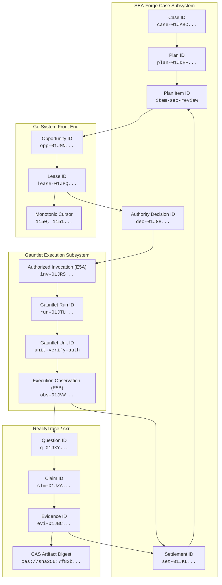

# Architecture Specification & System Ownership Matrix

**Component:** GodSpeed System Front End and Cognitive Environment  
**Location:** `/home/sprime01/projects/sea-rs/.agents/reports/interface-contracts/01-SYSTEM-ARCHITECTURE-AND-OWNERSHIP-MATRIX.md`  
**Standard:** RFC 2119 Normative Specification  
**Version:** 1.0.0  

---

## 1. System Identity and Architectural Boundary

The GodSpeed System Front End and Cognitive Environment provides a unified, typed operational boundary that marries:
1. **SEA-Forge (`sea-rs`)**: Governs purposeful casework, policy authority, sentries, milestones, and operational settlement.
2. **Gauntlet (`gauntlet`)**: Executes difficult, bounded transformations via sandboxed agents and tools, emitting execution observations.
3. **RealityTrace (`sxr`)**: Observes, relates, cryptographic-binds, traces, and versions expectations vs reality ($G_{declared} \leftrightarrow G_{observed}$) without epistemic collapse.
4. **Go System Front End (`apps/godspeed-casework-go`)**: Coordinates operational claims/leases, preflight, projection assembly, SSE streaming, and intent routing across application-owned ports.
5. **React Cognitive Environment (`apps/godspeed-cognitive-ui`)**: Projects the case world for human and agent interaction using a spatial/temporal/progressive artifact grammar—completely free of CMMN jargon, case-engine machinery, or raw transport protocols.

```
+-----------------------------------------------------------------------------------+
|                           SEA-Forge Case Subsystem                                |
|  - Lifecycle (Active/AwaitingApproval/Completed/Terminated)                       |
|  - Plan Items (SandboxedTask, HumanTask, Milestone, Stage, AgentTask)             |
|  - Sentry Trigger & Predicate Evaluation (pure trace-folded)                      |
|  - Policy Authority Engine (Allow / Deny / Escalate)                              |
|  - Append-Only Ledgers & Operational Settlement (Accepted / Rejected / Escalated) |
+------------------------------------------+----------------------------------------+
                                           |
                                           | SFWP / Unix Domain Socket NDJSON
                                           v
+-----------------------------------------------------------------------------------+
|                            Go System Front End                                    |
|  - Application-Owned Ports (CasePort, AuthorityPort, ExecutionPort,               |
|    TraceObservationPort, RepositoryPort, ArtifactEvidencePort)                    |
|  - Operational Claim / Lease State Machine (WorkOpportunity, ExecutionLease)      |
|  - Reconciliation Engine (stale leases, missed events, runtime drift)             |
|  - Cognitive Projection Builder & Monotonic SSE Event Broadcaster                 |
|  - Consequential Interaction Intent Router & Idempotency Store                    |
+---------------------+--------------------+--------------------+-------------------+
                      |                    |                    |
        E5A / E5B     |                    | SXR CLI / Socket   | HTTP + SSE
                      v                    v                    v
+---------------------------+ +------------------------+ +--------------------------+
|      Gauntlet             | |   RealityTrace (sxr)   | | React Cognitive Environ. |
| - Authorized Invocation   | | - G_declared vs        | | - 2.5D Spatial Canvas    |
|   execution               | |   G_observed           | | - Semantic Zoom & Focus  |
| - UnitScheduler &         | | - CEP-0008 envelopes   | | - Role-Aware Affordances |
|   PlannedDispatch         | | - Questions, Thresholds| | - Progressive Artifacts  |
| - Single-writer lock      | | - 9-Locus Diagnostics  | | - Temporal Navigation    |
| - Emits ExecutionObserv.  | | - Dense Hash Chains    | | - Agent Narration        |
+---------------------------+ +------------------------+ +--------------------------+
```

---

## 2. Epistemological Anti-Collapse Invariants

To guarantee that high-level abstractions remain truthful and resilient, the boundary enforces five structural anti-collapse axioms across all layers:

1. **`execution_completion != case_settlement`**:
   A process exit code of 0 or a Gauntlet run status of `completed` is an *observation*, not a settlement. Settlement is an authoritative judgment issued exclusively by SEA-Forge after comparing observed effects against declared settlement criteria.
2. **`representation != reality`**:
   Source code, plans, and `.sea` DSL files are representations of intent. When execution fails to produce the declared state, the system records an explicit residual/discrepancy rather than normalizing or fabricating reality.
3. **`data != evidence`**:
   Raw stdout, exit codes, and test logs are observations. They become evidence only when cryptographically bound to a target claim or question, evaluated under a declared relevance rule and settlement threshold.
4. **`operational_lease != semantic_authority`**:
   A lease granted by the Go front end merely coordinates single-worker exclusivity to prevent concurrent execution races. It confers zero semantic authority to alter case state, approve actions, or bypass policy gates.
5. **`local_projection != authoritative_state`**:
   The React cognitive environment maintains local scene, focus, and camera state. Omission of an object from a projection is visual pruning, never deletion from backend truth. Consequential changes must cross the Go boundary and receive backend authority before taking effect.

---

## 3. Comprehensive System Ownership Matrix

Every entity, field, operation, and event in the architecture has exactly one authoritative owner. Secondary systems consume projections or adapt facts; forbidden roles are strictly barred from fabricating or modifying that concern.

### 3.1 Data & Entity Ownership

| Entity / Data Class | Authoritative Owner | Producers / Adapters | Consumers | Strictly Forbidden Roles |
|---|---|---|---|---|
| **Case Record & State** | SEA-Forge (`sea-forge-core`, `case_dispatch`) | `CaseCommit`, `reopen`, `next_case_actions` | Go Front End, Cognitive UI | Gauntlet cannot alter case state; React cannot mutate locally. |
| **Plan & Plan Items** | SEA-Forge (`sea-forge-planner`) | `CasePlan`, `PlanItem`, `propose_item` | Go Front End, Cognitive UI | Go cannot invent plan items without SEA-Forge ledger mutation. |
| **Authority Decisions & Grants** | SEA-Forge (`sea-forge-authority`) | `PolicyAuthorityEngine` | Go Front End, Gauntlet (`ActionGrant`) | Go and React never decide authority; Gauntlet never self-authorizes. |
| **Approvals & Governance Context** | SEA-Forge (`sfwp::approvals`, `approvals.jsonl`) | Escalating policy evaluations | Go Front End, Cognitive UI Approvers | UI cannot resolve approvals without `approval.decide`. |
| **Work Opportunities & Leases** | Go System Front End (`internal/coordinator`) | `WorkOpportunity`, `ExecutionLease` | Gauntlet executor, Scheduler | Leases never grant semantic authority; SEA-Forge does not track process PIDs. |
| **Execution Observation** | Gauntlet (`gauntlet-ports`, `observer`) | Gauntlet Run Controller | Go Front End, SEA-Forge (E5B) | SEA-Forge does not monitor execution subprocesses directly. |
| **Declared Expectations ($G_{declared}$)**| RealityTrace (`sxr-df`, `sxr-core`) | DomainForge parser adapter | Go Front End, SXR Diagnostics | Cannot be modified during or after an execution attempt. |
| **Observed Evidence ($G_{observed}$)** | RealityTrace (`sxr-verify`, `sxr-ledger`) | SXR evidence derivation engine | Go Front End, Settlement Engine | Raw test output is never admitted directly without derivation rule. |
| **Discrepancies & Attribution** | RealityTrace (`diagnostic_attribution.rs`) | 9-locus diagnostic loop | Go Front End, Cognitive UI | UI cannot guess failure cause; must use diagnostic attribution. |
| **Repository Facts (PR, Commit, CI)** | GitHub | `RepositoryPort` adapter | Go Front End, SEA-Forge (policies)| GitHub PR merge does not settle a case. |
| **Cognitive World Projections** | Go System Front End (`internal/projection`) | Projection Assembly Service | React Cognitive Environment | Projections never mutate source records; omission != deletion. |
| **Scene Layout, Camera & Focus** | React Cognitive Environment (`src/core`, `scene`)| User interaction, Agent directives | React local state | Backend never dictates camera coordinates or CSS transforms. |
| **Cognitive Artifacts** | Artifact / Storage Port (`cas://`, `Store`) | Document, Code, Diff, Table renderers | React UI Progressive Disclosure | Ephemeral by default; durable persistence requires authorized intent. |

### 3.2 Consequential Operations Matrix

| Semantic Action | Owning Engine | Enforcing Gate | Required Actor Role | Consequential Wire Endpoint | Emitted Event / Proof |
|---|---|---|---|---|---|
| **Create / Commit Case** | SEA-Forge | `case_dispatch::submit` / `CaseCommit` | `Operator`, `Developer`, `System` | SFWP `case.commit` | `TraceKind::CaseCreated`, `PlanCreated` |
| **Reopen Case** | SEA-Forge | `commands::case::reopen` | `LifecycleCustodian (R-LC)`, `Operator` | SFWP `case.reopen` / CLI | `TraceKind::CaseReopened` |
| **Add Discretionary Work** | SEA-Forge | `commands::case::propose_item` | `Operator`, `Developer`, `Agent` | SFWP `case.add_discretionary` | `TraceKind::PlanMutated`, `case_plan_mutation` |
| **Decide Approval (Approve/Reject)**| SEA-Forge | `sfwp::approvals::decide` | `SecurityOfficer`, `RiskManager`, etc. | SFWP `approval.decide` | `ApprovalResolved` in `approvals.jsonl` |
| **Authorize Invocation (E5A)** | SEA-Forge | `governed_execution_boundary::emit_authorized_invocation` | SEA-Forge Authority Engine (`Allow`) | Internal SFWP / Convergence Bus | `AuthorizedInvocation` (v1 envelope) |
| **Execute Governed Work** | Gauntlet | `RunController::run_unit` | Gauntlet Single-Writer Lock | `gauntlet run "<intent>"` | `ExecutionObservation` (v1 envelope) |
| **Derive Evidence & Question** | RealityTrace | `sxr evidence derive` | SXR Threshold Evaluator | `sxr evidence derive` | `evidence.derived` (CEP-0008) |
| **Settle Case Work (E6)** | SEA-Forge | `governed_settlement_return::evaluate_operational_settlement` | SEA-Forge Settlement Engine | SFWP `case.settle` | `OperationalSettlement`, `SettlementRecorded` |
| **Claim Execution Lease** | Go Front End | `coordinator::AcquireLease` | Go Coordinator Service | HTTP `POST /api/intents` (`propose-consequence`) | SSE `lease` event (`state: claimed`) |
| **Reconcile Stale Lease** | Go Front End | `coordinator::Reconcile` | Go Reconciliation Engine | Internal background worker | SSE `lease` event (`state: reconciling`) |
| **Persist Ephemeral Artifact** | Artifact Port | `artifactstore::Put` | Authorized User / Agent | HTTP `POST /api/artifacts` | Content-addressed `ArtifactRef` |

---

## 4. Cross-System Identity Correlation Model

The system maintains deterministic end-to-end traceability from the initial case creation down to source-level execution artifacts and settlement records.



### 4.1 Correlation Invariant Rules
1. **Parentage Linking (ENV-I4):** Every `AuthorizedInvocation` (E5A) must cite its `GovernedWorkRequest` parent. Every `ExecutionObservation` (E5B) must cite its `AuthorizedInvocation` parent. Every `OperationalSettlement` (E6) must cite both E5A and E5B events.
2. **Immutable Triple:** The triple `(work_request_id, invocation_id, authority_decision_id)` is minted at authority evaluation and remains invariant across Gauntlet, RealityTrace, and SEA-Forge.
3. **Correlation Key in Go:** The Go System Front End correlates `ExecutionLease` with `opportunity_id` and `plan_item_id`, guaranteeing that if a lease expires while an executor is alive, no duplicate run can be dispatched until reconciliation settles the active PID/run state.
4. **Content-Addressed Evidence Binding:** All evidence citations in SEA-Forge (`SettlementEvent.basis`) and RealityTrace (`evidence.derived`) reference immutable SHA-256 hashes of the exact artifact bytes (`cas://sha256:...`).

---

## 5. Summary of System Architectural Boundaries

1. **SEA-Forge** governs work, verifies policy authority, evaluates sentries, and settles outcomes.
2. **Gauntlet** performs heavy execution transformations under strict containment and emits factual observations.
3. **RealityTrace** enforces cryptographic provenance, compares expected vs observed models, attributes discrepancies across 9 failure loci, and anchors temporal truth.
4. **Go System Front End** acts as the operational conductor: it acquires work opportunities, manages execution leases, reconciles runtime uncertainty, and serves cognitive projections.
5. **React Cognitive Environment** empowers human operators and AI agents to explore, interact, and guide work without ever needing to understand backend case machinery or raw protocols.
