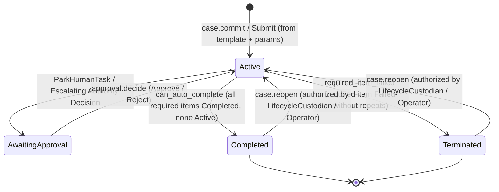

# SEA-Forge Case Subsystem Complete Specification

**Component:** SEA-Forge Case Subsystem Public Operational Surface  
**Location:** `/home/sprime01/projects/sea-rs/.agents/reports/interface-contracts/02-SEA-FORGE-CASE-SUBSYSTEM-SPECIFICATION.md`  
**Governing Standard:** RFC 2119 Normative Specification  
**Version:** 1.0.0  

---

## 1. Scope and Purpose

This specification defines the complete public, operational, and queryable surface of the **SEA-Forge Case Subsystem** for consumption by the Go System Front End and downstream Cognitive Environment. 

The System Front End is designed to operate the case subsystem as a whole—not as a narrow slice. This document details every implemented capability, lifecycle transition, sentry mechanic, discretionary work flow, approval inbox contract, role-based authority boundary, and settlement rule proven by repository source code.

---

## 2. Case Lifecycle Contract

### 2.1 State Machine



### 2.2 Lifecycle Invariants
1. **Creation:** Initiated via SFWP `case.commit` or server request `Submit`. Mints a ULID-backed `case_id` (`case-<ULID>`). Writes `<root>/cases/<case_id>/case.json` and `plan.json`. Emits `TraceKind::CaseCreated` and `TraceKind::PlanCreated`.
2. **Termination:** If a plan item marked `required: true` reaches `ItemStatus::Failed` and has exhausted `max_instances`, `case_engine::next_case_actions` deterministically emits `CaseAction::TerminateCase { blocking_item }`. The case immediately transitions to `CaseState::Terminated` with `close_reason: "required_item_failed: <item_id>"`.
3. **Auto-Completion:** If all items with `required: true` have reached `ItemStatus::Completed`, and no item is in `ItemStatus::Active` or `ItemStatus::Enabled`, the engine emits `CaseAction::CompleteCase`. The case transitions to `CaseState::Completed`, records `closed_at`, and appends `TraceKind::CaseClosed`.
4. **Reopening (`case.reopen`):**
   - Precondition: Case must be in `CaseState::Completed` or `CaseState::Terminated`.
   - Authority: Requires `AuthorityAction::Reserved { resource_type: "case_reopen", resource_id: case_id }`. Entitled roles: `LifecycleCustodian (R-LC)` or `Operator`.
   - Transition: Resets `state` to `CaseState::Active`, clears `close_reason` and `closed_at`, writes updated `case.json`, and appends `TraceKind::CaseReopened`.
   - Downstream Effect: Re-enables sentry evaluation and action scheduling.

---

## 3. Plan & Plan-Item Execution Model

### 3.1 Item Kinds (`ItemKind`)
* `SandboxedTask`: Synchronous, bounded computational transformation carrying `Operation::WriteFile` or `Operation::ExecuteCommand`. Executes within an OS-isolated sandbox (Landlock/Seatbelt).
* `HumanTask`: Work item reserved for human interaction or manual sign-off. When ready, engine emits `CaseAction::ParkHumanTask`, pausing the item until a `HumanTaskCompleted` trace event is received.
* `Milestone`: Pure synchronization and verification gate. Evaluates entry criteria and achieves atomically (`TraceKind::MilestoneAchieved`). **Invariant:** Milestones cannot repeat (`markers.repetition == false`).
* `Stage`: Structural container grouping sub-plans. Nested plan items reference their enclosing stage via `PlanItem.parent_stage`.
* `TimerListener`: Temporal event listener waiting on time-based triggers.
* `UserEventListener`: Event listener awaiting external human/system signals.
* `AgentTask`: Autonomous task carrying `Operation::AgentTask` (specifying `endpoint_ref`, `instruction`, `max_turns`, `token_budget`, `response_schema`, `transcript_retention`). Dispatched to external agent endpoints via ACP/SFWP.

### 3.2 Sentry & Dependency Evaluation
* **Pure Functional Evaluation:** Sentries are evaluated via `case_engine::evaluate_sentries(items, events, workspace_files)`. The engine holds no mutable state; item standing is reconstructed entirely from trace event history.
* **Sentry Trigger (`SentryTrigger`):** Matches on `source` (item ID or `"case"`) and `event` (e.g. `"milestone_achieved"`, `"settlement_status"`, `"plan_mutated"`).
* **Sentry Predicate (`SentryPredicate`):**
  - `ArtifactExists { path }`: Evaluates true if `path` was recorded in an `ArtifactCaptured` trace event in the case workspace.
  - `SettlementStatus { status }`: Evaluates true if a `SettlementRecorded` trace event from `source` matches `status` (`"accepted"`, `"rejected"`, `"escalated"`).
* **Entry Criteria Mode (`EntryCriteriaMode`):**
  - `Any` (default): OR-combination. Item is enabled when at least one sentry is satisfied.
  - `All`: AND-combination. Item is enabled only when every listed sentry is satisfied (used for concurrent branch rollups).
  - Empty Criteria: Items with empty entry criteria are available immediately upon stage or case activation.
* **Item Markers (`ItemMarkers`):**
  - `required: bool`: If true, completion is mandatory for case completion; failure terminates the case.
  - `repetition: bool`: If true, permits retrying up to `max_instances`.
  - `manual_activation: bool`: If true, satisfied criteria transition item to `ItemStatus::Enabled` (`CaseAction::Enable`). It awaits manual user/agent activation before becoming `Active`.

### 3.3 Plan Proposal Validation (`validate_proposal`)
Before any plan is committed or mutated, it passes strict static validation:
1. `items.len() >= 1` and `items.len() <= MAX_PLAN_ITEMS (256)`.
2. All `plan_item_id`s are unique and match alphanumeric/dash syntax.
3. Sentry dependency graph is verified acyclic via iterative DFS cycle detection (`check_satisfiability`).
4. Repetition settings verified: if `repetition == false`, `max_instances == 1`; if `repetition == true`, `max_instances > 1`.
5. Non-sandboxed items forbidden from having operations.
6. Operations validated for path safety (no `..`, absolute paths, or invalid segments).

---

## 4. Discretionary Work & Dynamic Case Adaptation

### 4.1 Concept & Purpose
In complex casework, not all tasks are known in advance. SEA-Forge supports adding **discretionary work items** to a running case without restarting or invalidating existing history.

### 4.2 Add-to-Plan Flow (`commands::case::propose_item`)
1. **Initiation:** An authorized user or agent submits a new `PlanItem` via SFWP `case.add_discretionary` or CLI `sea-forge case add-task`.
2. **Proposal Validation:** The updated plan (existing items + new item) is validated via `validate_proposal`. Cycles or invalid references are rejected immediately.
3. **Authority Check:** Evaluated against `AuthorityAction::Reserved`:
   ```json
   {
     "resource_type": "discretionary_task_add",
     "resource_id": "<case_id>:<plan_item_id>",
     "parameters": { "item": "<plan_item_id>" }
   }
   ```
4. **Ledger Commit:** The updated plan is committed to the case ledger as record kind `case_plan_mutation`.
5. **View Materialization:** The new plan is written atomically to `<root>/cases/<case_id>/plan.json`.
6. **Trace Event:** Appends `TraceKind::PlanMutated` with payload `{"operation": "add_task"}`.
7. **Immediate Sentry Re-evaluation:** The case engine re-evaluates sentries. If the new item's entry criteria are satisfied, it becomes immediately `Available` or `Enabled`.

### 4.3 Separation of Duties (SoD) Invariant
* If a discretionary item is proposed by an AI agent or automated process (e.g. the Thoth manager loop), `PlanItem.proposed_by` is stamped with the proposer's identity (`proposed_by: "agent:<id>"`).
* This field is embedded in the plan's canonical hash. Policy authority rules enforce that the proposing identity cannot approve, resolve escalations, or settle its own proposed item.

---

## 5. Human Tasks, Approvals & Governance Escalation

### 5.1 Human Tasks (`ItemKind::HumanTask`)
* Used for manual execution steps (e.g., physical inspection, customer sign-off, external verification).
* When entry criteria are satisfied, the case engine transitions the item to `ParkHumanTask`.
* A human operator inspects the task instructions, provides input, and marks it completed, emitting `TraceKind::HumanTaskCompleted`.

### 5.2 Approvals Inbox (`sfwp::approvals`)
* **Trigger:** An approval is created when:
  1. A plan item's authority evaluation returns `Verdict::Escalate`.
  2. A settlement evaluation returns `SettlementStatus::Escalated`.
* **Inbox Listing (`approval.list`):**
  - Enumerates pending approvals from `<root>/approvals.jsonl`.
  - Ordered oldest first (queue discipline).
  - Returns `PendingApproval`:
    * `approval_id`, `case_id`, `run_id`, `plan_item_id`, `decision_id`
    * `requested_at`, `expires_at`, `expired: bool`
    * `criteria_ref`, `criteria_sha256`
    * `governance`: `ApprovalGovernanceContext`
* **Governance Context (`ApprovalGovernanceContext`):**
  - `approval_source` & `decision_source`: Pointers to exact ledger entries (`ledger_id`, `entry_id`, `digest`).
  - `reason`: Machine-readable reason for escalation (e.g. `policy_escalation`, `boundary_violation`).
  - `matched_rule`: Specific policy rule that triggered escalation.
  - `policy_refs`: Governing policy documents.
  - `boundary_constraints`: Constraints enforced during escalation.
  - `requester`: Principal requesting the action.
  - `operation_kind`: Operation attempted (`write_file`, `execute_command`, `agent_probe`, etc.).
  - `purpose_context`: Declared business purpose.
  - `evidence_refs`: Evidence attached to the request.
  - `eligible_actors`: Principals entitled to resolve this approval.
* **Approval Decision (`approval.decide` / `ApprovalDecide`):**
  - Parameters: `case_id`, `approval_id`, `decision: "approve" | "reject"`, optional `note`, optional `preconditions`.
  - Effect: Commits resolution to `approvals.jsonl`. On `approve`, an `ActionGrant` is minted and execution unblocks. On `reject`, the item marks `ItemFailed` or `ItemTerminated`.

---

## 6. Role & Authority Model

### 6.1 Actor Roles (`ActorRole`)
SEA-Forge models distinct enterprise roles with strict separation of duties:

| Role Identifier | Role Name | Semantic Scope & Entitlements |
|---|---|---|
| `operator` | Operator | Standard human operator; initiates cases, activates enabled items, reviews progress. |
| `agent` | Agent | Automated software agent; executes bounded tasks within granted sandboxes. |
| `service` | Service | Background daemon or scheduled microservice. |
| `system` | System | Kernel bootstrap and internal lifecycle coordinator. |
| `R-DS` | Data Steward | Authorizes data pipeline mutations, schema evolutions, and dataset access. |
| `R-AG` | Agent Governor | Approves agent deployments, endpoint registrations, and prompt policy changes. |
| `R-LC` | Lifecycle Custodian | Holds exclusive authority to reopen closed cases and authorize case archiving/disposal. |
| `R-SO` | Security Officer | Holds authority to resolve security escalations, sandbox breaches, and credential grants. |
| `R-RM` | Risk Manager | Resolves financial, compliance, and policy exception escalations. |
| `R-DEV` | Developer | Proposes plan items, writes code, and reviews technical diffs. |
| `R-AA` | Automated Agent | Autonomous actor operating under pre-approved policy envelopes. |

### 6.2 Precondition Optimistic Concurrency (`Precondition`)
* All mutating SFWP commands (`case.commit`, `approval.decide`, etc.) accept an optional `Precondition` containing `RecordDigest`s.
* Pins expected file digests (`sha256:...`) or ledger cursors. If on-disk state changed since the client last inspected it, the request fails with `rejected_as_stale`, preventing concurrent write corruption.

---

## 7. Operational Settlement & Evidence

### 7.1 Settlement Evaluation (`SettlementStatus`)
* `Accepted`: All settlement criteria evaluated true against qualifying evidence.
* `Rejected`: One or more criteria failed or contradicted by evidence.
* `Escalated`: Criteria ambiguous or threshold requires human discretionary review.

### 7.2 Evidence Basis (`SettlementEvent.basis`)
* A settlement record commits an explicit list of evidence references (`basis: Vec<String>`).
* References point to cryptographic digests of test reports, artifact hashes, or RealityTrace evidence records (`cas://sha256:...`, `evi:<id>`).
* **Epistemic Invariant:** Settlement cannot occur on empty basis unless criteria explicitly permit zero-evidence assertions.

---

## 8. SFWP (SEA-Forge Wire Protocol) Method Catalog

The complete implemented method catalog exposed over the Unix domain socket:

```
+--------------------------+-------------+-------------------------------------------------------------+
| SFWP Method              | Class       | Description                                                 |
+--------------------------+-------------+-------------------------------------------------------------+
| system.hello             | inspect     | Protocol version handshake & implemented method discovery   |
| system.describe          | inspect     | Method catalog with interaction classes                    |
| system.get_schema        | inspect     | Emits JSON Schema references for all generated DTOs         |
| request.get_status       | inspect     | Correlated request status across client reconnects          |
| events.subscribe         | subscribe   | Live event stream subscription with optional cursor replay  |
| events.unsubscribe       | command     | Unsubscribes connection from live broadcast                |
| events.get_range         | inspect     | Deterministic bounded replay of durable events              |
| readiness.get            | inspect     | Self-model readiness and endpoint configuration projection  |
| identity.get             | inspect     | Discloses actors calling connection is entitled to claim    |
| thoth.ask                | command     | Governed disclosure inquiry into case reasoning/history     |
| case.entry_options       | inspect     | Lists materialized templates under templates/               |
| case.preflight           | inspect     | Authoritative dry-run validation of template + parameters    |
| case.commit              | command     | Protected command creating a new governed case              |
| case.list                | inspect     | Lists all committed cases with state and run counts         |
| case.get_overview        | inspect     | Case header, plan ref, stages, and run settlements          |
| case.get_horizon         | inspect     | Folded trace standing for all plan items (exec + settle)    |
| approval.list            | inspect     | Lists pending approvals awaiting human governance decision  |
| approval.decide          | command     | Resolves an approval (approve or reject)                    |
| run.list                 | inspect     | Lists execution runs for a case                             |
| run.get                  | inspect     | Detailed run record, sandbox, and criteria checks           |
| asset.list               | inspect     | Lists templates, agent endpoints, and extensions            |
| delegation.preview       | inspect     | Previews job contract for an agent delegation               |
| delegation.list          | inspect     | Lists live and committed agent delegations                  |
+--------------------------+-------------+-------------------------------------------------------------+
```

---

## 9. Conclusion

The SEA-Forge Case Subsystem provides an exhaustive, deterministic, append-only substrate for governed work. The Go System Front End maps these exact structures into application-owned ports and translates them into intuitive, role-aware affordances for the Cognitive Environment.
