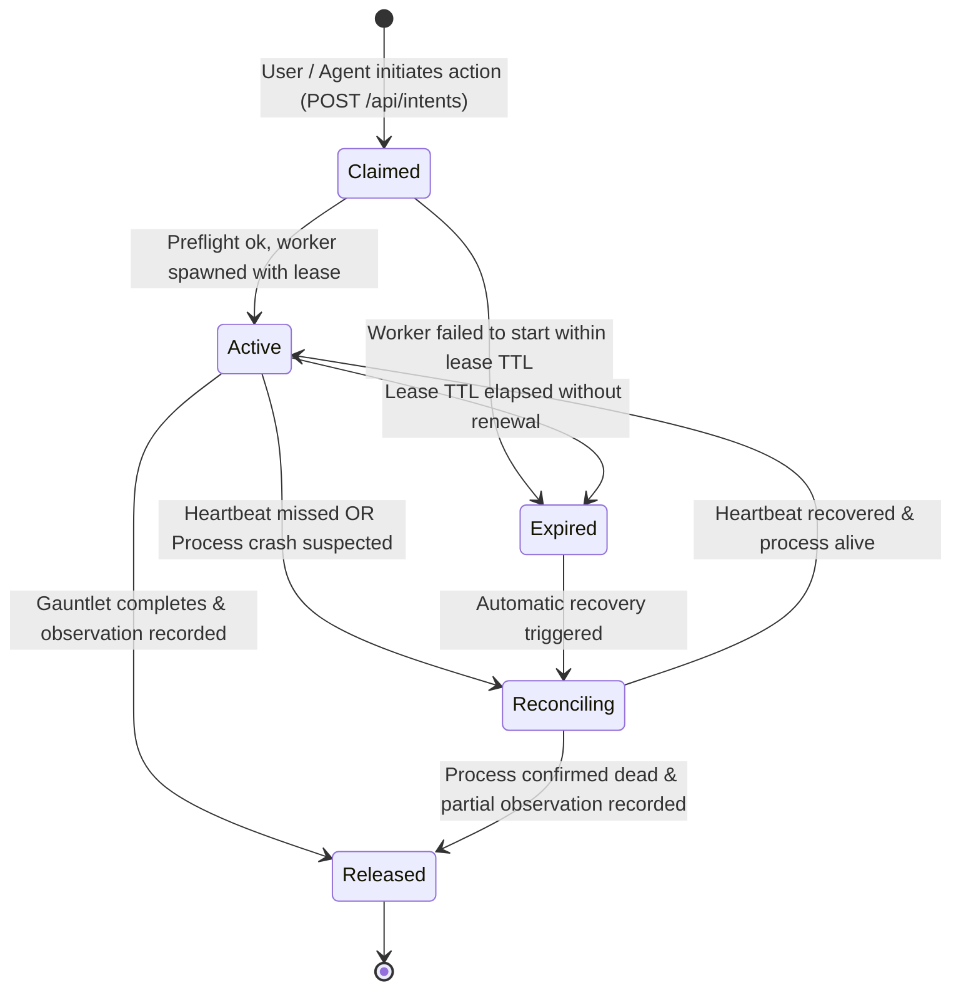

# Go System Front End Ports & Operational Architecture Specification

**Component:** Go System Front End Application Boundary (`apps/godspeed-casework-go`)  
**Location:** `/home/sprime01/projects/sea-rs/.agents/reports/interface-contracts/03-GO-SYSTEM-FRONTEND-PORTS-SPECIFICATION.md`  
**Governing Standard:** RFC 2119 Normative Specification  
**Version:** 1.0.0  

---

## 1. Scope & Architectural Purpose

The Go System Front End coordinates live casework between:
1. **SEA-Forge** (governed case authority, sentry logic, settlement)
2. **Gauntlet** (execution environment, difficult transformations)
3. **RealityTrace / `sxr`** (epistemic audit, trace evidence, dual-graph comparisons)
4. **GitHub** (repository facts)
5. **React Cognitive Environment** (human and agent interactive projection)

Per **REQ-ARCH-001** and **REQ-ARCH-002**, the Go application defines **application-owned ports**. All external provider payloads (SFWP DTOs, Gauntlet run structs, SXR JSON envelopes, GitHub webhooks) are translated at adapter boundaries. Core packages reference only the ports and value types defined in this specification.

---

## 2. Go Application Ports Specification

### 2.1 Case Port (`CasePort`)

The primary port for discovering, querying, and mutating SEA-Forge cases.

```go
package ports

import (
	"context"
	"time"
)

// CaseRef identifies a governed case in application terms.
type CaseRef string

// PlanItemRef identifies a specific work item within a case plan.
type PlanItemRef string

// CaseLifecycleState represents the high-level operational state of a case.
type CaseLifecycleState string

const (
	CaseStateActive           CaseLifecycleState = "active"
	CaseStateAwaitingApproval CaseLifecycleState = "awaiting_approval"
	CaseStateCompleted        CaseLifecycleState = "completed"
	CaseStateTerminated       CaseLifecycleState = "terminated"
)

// ItemExecutionStanding represents progression through execution.
type ItemExecutionStanding string

const (
	ExecutionPending    ItemExecutionStanding = "pending"
	ExecutionEnabled    ItemExecutionStanding = "enabled"
	ExecutionActive     ItemExecutionStanding = "active"
	ExecutionCompleted  ItemExecutionStanding = "completed"
	ExecutionFailed     ItemExecutionStanding = "failed"
	ExecutionTerminated ItemExecutionStanding = "terminated"
)

// ItemSettlementStanding represents governed settlement status.
type ItemSettlementStanding string

const (
	SettlementUnsettled ItemSettlementStanding = "unsettled"
	SettlementAccepted  ItemSettlementStanding = "accepted"
	SettlementRejected  ItemSettlementStanding = "rejected"
	SettlementEscalated ItemSettlementStanding = "escalated"
)

// WorkItemView represents a single plan item projected for the front end.
type WorkItemView struct {
	Ref               PlanItemRef            `json:"ref"`
	Name              string                 `json:"name"`
	ItemKind          string                 `json:"itemKind"` // sandboxed_task, human_task, milestone, stage, agent_task
	ExecutionStanding ItemExecutionStanding  `json:"executionStanding"`
	SettlementStanding ItemSettlementStanding `json:"settlementStanding"`
	ParentStage       *PlanItemRef           `json:"parentStage,omitempty"`
	DependsOn         []PlanItemRef          `json:"dependsOn"`
	Required          bool                   `json:"required"`
	Repeats           bool                   `json:"repeats"`
	ManualActivation  bool                   `json:"manualActivation"`
	LastEventAt       *time.Time             `json:"lastEventAt,omitempty"`
	RunIDs            []string               `json:"runIds"`
}

// CaseDetailView is the complete operational view of a single case.
type CaseDetailView struct {
	Ref          CaseRef            `json:"ref"`
	State        CaseLifecycleState `json:"state"`
	Summary      string             `json:"summary"`
	TemplateRef  string             `json:"templateRef"`
	CreatedAt    time.Time          `json:"createdAt"`
	ClosedAt     *time.Time         `json:"closedAt,omitempty"`
	CloseReason  *string            `json:"closeReason,omitempty"`
	Items        []WorkItemView     `json:"items"`
	Stages       []string           `json:"stages"`
	Settlements  []SettlementView   `json:"settlements"`
	LastEventID  string             `json:"lastEventId"`
	EventsFolded int                `json:"eventsFolded"`
}

// SettlementView models a run's settlement in application terms.
type SettlementView struct {
	RunID          string                 `json:"runId"`
	Standing       ItemSettlementStanding `json:"standing"`
	Basis          []string               `json:"basis"`
	ReviewRequired bool                   `json:"reviewRequired"`
	SettledAt      time.Time              `json:"settledAt"`
}

// CaseCreationProposal holds input for instantiating a case from a template.
type CaseCreationProposal struct {
	TemplateRef   string            `json:"templateRef"`
	Parameters    map[string]string `json:"parameters"`
	ActorID       string            `json:"actorId"`
	Role          string            `json:"role"`
	TimeoutSecs   uint64            `json:"timeoutSecs"`
	Preconditions []RecordDigestPin `json:"preconditions,omitempty"`
}

// DiscretionaryItemProposal holds input for dynamically adding a plan item.
type DiscretionaryItemProposal struct {
	CaseRef          CaseRef           `json:"caseRef"`
	ItemRef          PlanItemRef       `json:"itemRef"`
	Name             string            `json:"name"`
	ItemKind         string            `json:"itemKind"`
	Operations       []OperationSpec   `json:"operations"`
	Required         bool              `json:"required"`
	ManualActivation bool              `json:"manualActivation"`
	ProposedBy       string            `json:"proposedBy"` // SoD tracking
	Preconditions    []RecordDigestPin `json:"preconditions,omitempty"`
}

type OperationSpec struct {
	Kind        string   `json:"kind"` // write_file, execute_command, agent_task
	Path        string   `json:"path,omitempty"`
	ContentHint string   `json:"contentHint,omitempty"`
	Argv        []string `json:"argv,omitempty"`
	Instruction string   `json:"instruction,omitempty"`
	EndpointRef string   `json:"endpointRef,omitempty"`
	MaxTurns    uint32   `json:"maxTurns,omitempty"`
}

// RecordDigestPin enforces optimistic concurrency across SFWP mutations.
type RecordDigestPin struct {
	Ref            string `json:"ref"`
	ExpectedDigest string `json:"expectedDigest"`
}

// CasePort defines the boundary for interacting with the SEA-Forge Case Subsystem.
type CasePort interface {
	Health

	// Discovery & Inspection
	ListCases(ctx context.Context) ([]CaseSummary, error)
	GetCase(ctx context.Context, ref CaseRef) (CaseDetailView, error)
	GetHorizon(ctx context.Context, ref CaseRef) ([]WorkItemView, error)
	ListTemplates(ctx context.Context) ([]TemplateOptionView, error)
	PreflightCase(ctx context.Context, templateRef string, params map[string]string) (PreflightResultView, error)

	// Consequential Operations
	CommitCase(ctx context.Context, proposal CaseCreationProposal) (CaseRef, error)
	ReopenCase(ctx context.Context, ref CaseRef, actorID string, reason string) error
	AddDiscretionaryWork(ctx context.Context, proposal DiscretionaryItemProposal) error
	ActivateItem(ctx context.Context, caseRef CaseRef, itemRef PlanItemRef, actorID string) error
}
```

---

### 2.2 Authority & Governance Port (`AuthorityPort`)

Models the actor perspective, allowed semantic actions, and approval queue.

```go
package ports

import (
	"context"
	"time"
)

// ActorPerspective captures who the caller is and what roles they hold.
type ActorPerspective struct {
	ActorID       string   `json:"actorId"`
	Principal     string   `json:"principal"`
	Roles         []string `json:"roles"` // operator, R-SO, R-LC, R-AG, R-DS, etc.
	CanAdminister bool     `json:"canAdminister"`
}

// ActionCapability describes a semantic action available to this actor.
type ActionCapability struct {
	ActionKind  string            `json:"actionKind"` // begin, review, approve, reject, escalate, add-work, reopen
	TargetRef   string            `json:"targetRef"`
	Label       string            `json:"label"`
	Enabled     bool              `json:"enabled"`
	Reason      string            `json:"reason,omitempty"`
	RequiredRole string           `json:"requiredRole,omitempty"`
	Parameters  map[string]string `json:"parameters,omitempty"`
}

// ApprovalInboxItem represents a pending approval awaiting human decision.
type ApprovalInboxItem struct {
	ApprovalID      string                 `json:"approvalId"`
	CaseRef         CaseRef                `json:"caseRef"`
	RunID           string                 `json:"runId"`
	PlanItemRef     PlanItemRef            `json:"planItemRef"`
	Reason          string                 `json:"reason"`
	MatchedRule     string                 `json:"matchedRule,omitempty"`
	Requester       string                 `json:"requester"`
	OperationKind   string                 `json:"operationKind"`
	PurposeContext  map[string]interface{} `json:"purposeContext"`
	EvidenceRefs    []string               `json:"evidenceRefs"`
	RequestedAt     time.Time              `json:"requestedAt"`
	ExpiresAt       time.Time              `json:"expiresAt"`
	Expired         bool                   `json:"expired"`
	EligibleActors  []string               `json:"eligibleActors"`
	CanResolve      bool                   `json:"canResolve"` // Evaluated for current actor perspective
}

// ApprovalResolution specifies an approve or reject decision.
type ApprovalResolution struct {
	ApprovalID    string            `json:"approvalId"`
	CaseRef       CaseRef           `json:"caseRef"`
	Decision      string            `json:"decision"` // "approve" or "reject"
	Note          string            `json:"note"`
	ActorID       string            `json:"actorId"`
	Preconditions []RecordDigestPin `json:"preconditions,omitempty"`
}

// AuthorityPort mediates authority, permissions, and human governance.
type AuthorityPort interface {
	Health

	// Perspective & Capabilities
	ResolvePerspective(ctx context.Context, connectionPeerUID string) (ActorPerspective, error)
	AllowedActions(ctx context.Context, perspective ActorPerspective, caseRef CaseRef) ([]ActionCapability, error)

	// Approvals Queue
	ListApprovals(ctx context.Context, perspective ActorPerspective, caseRef *CaseRef) ([]ApprovalInboxItem, error)
	DecideApproval(ctx context.Context, resolution ApprovalResolution) error
}
```

---

### 2.3 Execution Port (`ExecutionPort` - Gauntlet Boundary)

Coordinates execution invocations and returns execution observations.

```go
package ports

import (
	"context"
	"time"
)

// ExecutionContract specifies the bounded task dispatched to Gauntlet.
type ExecutionContract struct {
	OpportunityID       string        `json:"opportunityId"`
	CaseRef             CaseRef       `json:"caseRef"`
	PlanItemRef         PlanItemRef   `json:"planItemRef"`
	AuthorizedInvRef    string        `json:"authorizedInvocationRef"` // E5A event ID
	Intent              string        `json:"intent"`
	Timeout             time.Duration `json:"timeout"`
	MaxTurns            uint32        `json:"maxTurns"`
	TokenBudget         uint64        `json:"tokenBudget"`
	WorkspacePath       string        `json:"workspacePath"`
	DomainModelSHA256   string        `json:"domainModelSha256"`
}

// ExecutionObservation models Gauntlet's factual report.
type ExecutionObservation struct {
	OpportunityID       string        `json:"opportunityId"`
	GauntletRunID       string        `json:"gauntletRunId"`
	ExecutionStatus     string        `json:"executionStatus"` // completed, spawn_failed, timed_out, sandbox_violation
	StartedAt           time.Time     `json:"startedAt"`
	FinishedAt          time.Time     `json:"finishedAt"`
	ObservedEffects     []string      `json:"observedEffects"`
	EvidenceRefs        []string      `json:"evidenceRefs"`
	ExitCode            int           `json:"exitCode"`
	RawStdoutDigest     string        `json:"rawStdoutDigest"`
	IsSettlement        bool          `json:"isSettlement"` // ALWAYS FALSE. Preserves anti-collapse invariant.
}

// ExecutionPort connects the Go front end to Gauntlet.
type ExecutionPort interface {
	Health

	// Dispatches a governed execution unit to Gauntlet under an exclusive lease.
	ExecuteUnit(ctx context.Context, contract ExecutionContract) (ExecutionObservation, error)
	
	// Resumes an interrupted Gauntlet run.
	ResumeRun(ctx context.Context, gauntletRunID string) (ExecutionObservation, error)
	
	// Cancels an active in-flight run.
	CancelRun(ctx context.Context, gauntletRunID string, reason string) error
	
	// Queries Gauntlet daemon / state store status.
	RunStatus(ctx context.Context, gauntletRunID string) (string, error)
}
```

---

### 2.4 Trace & Observation Port (`TraceObservationPort` - RealityTrace Boundary)

Binds RealityTrace's cryptographic evidence, dual-graph queries, and 9-locus attribution.

```go
package ports

import (
	"context"
	"time"
)

// TraceCheckpoint represents an immutable point in SXR history.
type TraceCheckpoint struct {
	AppendOrdinal uint64    `json:"appendOrdinal"`
	EntryHash     string    `json:"entryHash"`
	Timestamp     time.Time `json:"timestamp"`
	RecordKind    string    `json:"recordKind"`
}

// ResidualDiscrepancy models an unexpected delta between G_declared and G_observed.
type ResidualDiscrepancy struct {
	ResidualID          string    `json:"residualId"`
	QuestionID          string    `json:"questionId"`
	ClaimID             string    `json:"claimId"`
	DeclaredExpectation string    `json:"declaredExpectation"`
	ObservedReality     string    `json:"observedReality"`
	DiscrepancyMagnitude float64  `json:"discrepancyMagnitude"`
	FailureLocus        string    `json:"failureLocus"` // verifier, environment, execution, declared_model, etc.
	AttributionReason   string    `json:"attributionReason"`
}

// SXRQuestionView models a declared verification inquiry.
type SXRQuestionView struct {
	QuestionID    string   `json:"questionId"`
	ClaimID       string   `json:"claimId"`
	ThresholdKind string   `json:"thresholdKind"` // AllEvidenceSupports, AnyEvidenceContradicts
	EvidenceRefs  []string `json:"evidenceRefs"`
	SettledStatus string   `json:"settledStatus"`
}

// TraceObservationPort communicates with RealityTrace / sxr.
type TraceObservationPort interface {
	Health

	// Ingest & Evidence Queries
	GetQuestions(ctx context.Context, caseRef CaseRef) ([]SXRQuestionView, error)
	GetResiduals(ctx context.Context, caseRef CaseRef) ([]ResidualDiscrepancy, error)
	GetHistoryCheckpoints(ctx context.Context, caseRef CaseRef, since uint64, limit int) ([]TraceCheckpoint, error)
	GetCASObject(ctx context.Context, sha256Digest string) ([]byte, error)
}
```

---

### 2.5 Repository Port (`RepositoryPort` - GitHub Boundary)

Supplies repository-side facts (PRs, commits, CI runs) for software engineering cases.

```go
package ports

import "context"

type RepositoryProposalFact struct {
	Number    int      `json:"number"`
	Title     string   `json:"title"`
	HeadSHA   string   `json:"headSha"`
	BaseRef   string   `json:"baseRef"`
	State     string   `json:"state"` // open, closed, merged
	Merged    bool     `json:"merged"`
	Checks    []string `json:"checks"`
	URL       string   `json:"url"`
}

type RepositoryPort interface {
	Health
	GetProposal(ctx context.Context, proposalID string) (RepositoryProposalFact, error)
}
```

---

### 2.6 Artifact & Evidence Port (`ArtifactEvidencePort`)

Manages progressive disclosure of evidence and ephemeral-to-durable artifact persistence.

```go
package ports

import (
	"context"
)

type DisclosureLevel string

const (
	DisclosureMinimal DisclosureLevel = "minimal"
	DisclosureSummary DisclosureLevel = "summary"
	DisclosureSource  DisclosureLevel = "source"
)

type ArtifactDescriptor struct {
	Ref         string          `json:"ref"`
	Kind        string          `json:"kind"` // document, code_diff, test_report, decision_record, table
	MediaType   string          `json:"mediaType"`
	ByteLength  int64           `json:"byteLength"`
	Level       DisclosureLevel `json:"level"`
	SourceProvenance string     `json:"sourceProvenance"`
}

type ArtifactEvidencePort interface {
	Health
	Resolve(ctx context.Context, ref string, level DisclosureLevel) (ArtifactDescriptor, error)
	ReadPayload(ctx context.Context, ref string, level DisclosureLevel) ([]byte, error)
	PersistDurable(ctx context.Context, ref string, boundObject string, title string) error
}
```

---

## 3. Operational Claim / Lease State Machine

To guarantee that concurrent background workers or human clicks do not duplicate consequential work, the Go application owns the **Execution Lease** lifecycle:



### 3.1 Data Structures
```go
type LeaseState string

const (
	LeaseClaimed     LeaseState = "claimed"
	LeaseActive      LeaseState = "active"
	LeaseReconciling LeaseState = "reconciling"
	LeaseReleased    LeaseState = "released"
	LeaseExpired     LeaseState = "expired"
)

type WorkOpportunity struct {
	OpportunityID string      `json:"opportunityId"`
	CaseRef       CaseRef     `json:"caseRef"`
	PlanItemRef   PlanItemRef `json:"planItemRef"`
	AvailableAt   time.Time   `json:"availableAt"`
}

type ExecutionLease struct {
	LeaseID       string     `json:"leaseId"`
	OpportunityID string     `json:"opportunityId"`
	Holder        string     `json:"holder"` // worker PID or node ID
	State         LeaseState `json:"state"`
	ExpiresAt     time.Time  `json:"expiresAt"`
	RenewedAt     time.Time  `json:"renewedAt"`
	Summary       string     `json:"summary"`
}
```

### 3.2 Invariant Rules
1. **Zero Dual Authority:** Holding an `ExecutionLease` does *not* authorize side effects. Side effects require a SEA-Forge `ActionGrant` minted from an `Allow` decision.
2. **Reconciliation Precedes Retry:** If a lease is in `LeaseReconciling` or `LeaseExpired`, no new lease can be minted for the same `opportunity_id` until the existing process is inspected and confirmed terminated.

---

## 4. Reconciliation Engine

The reconciliation loop runs periodically and on restart:
1. **Stale Lease Sweep:** Scans for active leases whose `ExpiresAt` has passed. Transitions them to `LeaseReconciling`.
2. **PID Liveness Check:** Queries the operating system or executor process table for the recorded worker PID.
3. **Missed Event Recovery:** Connects to SFWP `events.get_range` using the last recorded durable cursor. Replays missed events in predecessor order.
4. **Resync Broadcast:** Emits updated `revision` and `lease` events over SSE to bring connected Cognitive Environment clients into alignment.

---

## 5. Startup Preflight & Blast-Radius Management

Per **REQ-CONFIG-010**, **REQ-CONFIG-011**, and **REQ-CONFIG-012**:
1. At startup, Go checks health on all configured ports (`CasePort`, `AuthorityPort`, `ExecutionPort`, `TraceObservationPort`, `RepositoryPort`, `ArtifactEvidencePort`).
2. If a required port (`CasePort`, `AuthorityPort`) fails, the server halts with exit code 1.
3. If an optional port (e.g. `RepositoryPort` when GitHub is disabled, or `TraceObservationPort`) fails, Go enters **degraded mode**:
   - The primary casework engine operates normally.
   - Projections mark optional features as `unavailable`.
   - The UI displays honest degradation rather than crashing.

---

## 6. HTTP & SSE Transport Wire Endpoints

Served on loopback (`127.0.0.1:4179`):

* `GET /api/healthz`: Health status, live cursor, provenance, and active degradation flags.
* `GET /api/world`: Current authoritative `WorldSnapshot`. Supports `?cursor=<N>` for historical queries.
* `GET /api/time`: `TemporalWindow` of historical progression points.
* `GET /api/events?last=<cursor>`: SSE event stream delivering `hello`, `revision`, `lease`, `observation`, and `settlement` events.
* `POST /api/intents`: Submits a typed `InteractionIntent` (`focus-object`, `resolve-object`, `inspect-artifact`, `propose-consequence`, `decide-approval`, `reopen-case`, `add-discretionary`). Enforces idempotency via `id`.
* `GET /api/artifacts/{ref}?level=minimal|summary|source`: Resolves and streams progressive artifact content.
* `POST /api/artifacts`: Requests durable case persistence for an ephemeral cognitive artifact.
