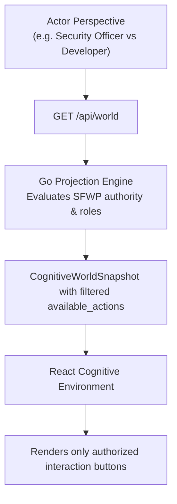
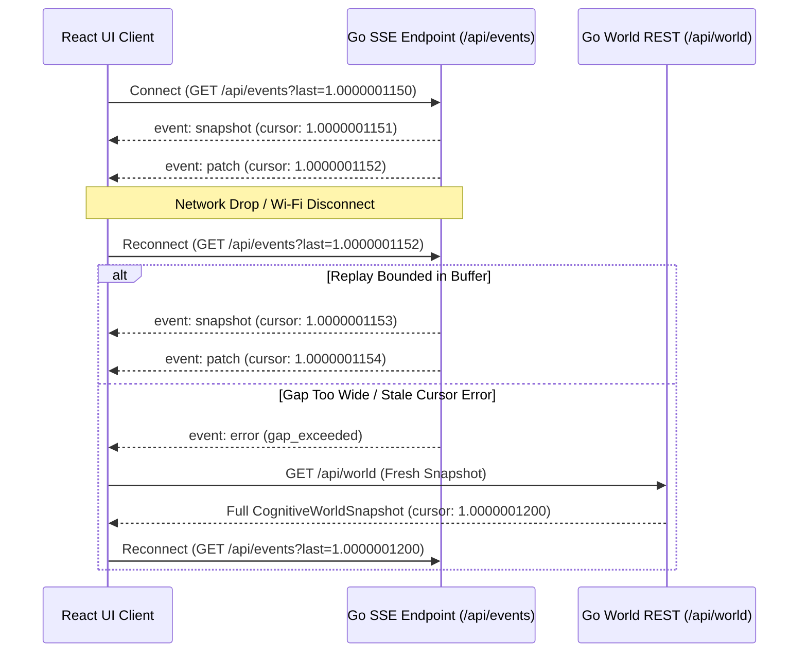

# React Cognitive Environment Contract Specification

**Component:** React Cognitive Environment Public Boundary (`apps/godspeed-cognitive-ui`)  
**Location:** `/home/sprime01/projects/sea-rs/.agents/reports/interface-contracts/04-REACT-COGNITIVE-ENVIRONMENT-CONTRACT-SPECIFICATION.md`  
**Governing Standard:** RFC 2119 Normative Specification  
**Version:** 1.0.0  

---

## 1. Purpose and Guiding Philosophy

The **Cognitive Environment** provides a human-operable and agent-collaborative interface for governed casework. 

### Epistemic and UX Axioms
1. **Zero Case Engine Jargon:** The UI must never display terms like `CMMN`, `Sentry`, `PlanItem`, `ActionGrant`, or `DiscretionaryItem` directly to the user. These machine concepts are translated into natural, human-understandable states:
   - Instead of *“PlanItem W17 blocked by Sentry S9”* $\to$ **“Ready after security review”**
   - Instead of *“Escalated authority decision awaiting approval”* $\to$ **“Needs your approval”**
   - Instead of *“Discretionary planning table entry applicable”* $\to$ **“Available to add if needed”**
   - Instead of *“Item in ItemStatus::Active”* $\to$ **“In progress”**
   - Instead of *“SettlementStatus::Accepted”* $\to$ **“Settled & verified”**
   - Instead of *“Residual computed on G_observed”* $\to$ **“Blocked by unresolved observation”**
2. **2.5D Spatial Grammar:** Work is organized across spatial surfaces and depths rather than endless vertical flat dashboards. Depth reflects hierarchy and focus; transitions preserve orientation.
3. **Semantic Zoom:** Zooming changes *what* is represented (resolution of internal structure), not merely geometric scaling.
4. **Attention Discipline:** Settled or routine objects are visually quiet. Only unresolved conditions requiring human judgment or attention are perceptually prominent.
5. **Shared Human-Agent Surface:** Agents interact through the exact same action vocabulary as human operators. Agents cannot bypass backend authority or mutate local DOM internals directly.

---

## 2. The Cognitive Grammar

The entire environment is composed of six primitive concepts:
1. **Surfaces:** Spatial grouping planes representing an engagement, domain, or phase.
2. **Objects:** Purposeful nodes representing cases, goals, work units, milestones, decisions, or observations.
3. **Relationships:** Contextual directed edges (e.g. `depends-on`, `produces`, `governed-by`, `contradicted-by`).
4. **Focus & Zoom:** The active perceptual anchor and resolution level (`system`, `local`, `detail`).
5. **Artifacts:** Ephemeral or persistent progressive content (documents, code diffs, logs, tables) anchored to objects.
6. **Time & History:** Application-level temporal positioning allowing non-destructive historical inspection.

---

## 3. World Snapshot Contract

The Go System Front End serves projections matching this schema over `GET /api/world` and SSE `revision` events:

```typescript
export type ObjectId = string;

export type ZoomLevel = 'system' | 'local' | 'detail';

export type AttentionState = 'quiet' | 'notable' | 'requires-judgment';

export interface SpatialPosition {
  readonly x: number;
  readonly y: number;
  readonly depth: number;
}

export interface ActionDescriptor {
  readonly id: string;
  readonly label: string;
  readonly intent:
    | 'BEGIN_WORK'
    | 'APPROVE_HUMAN_TASK'
    | 'REJECT_HUMAN_TASK'
    | 'ADD_DISCRETIONARY_WORK'
    | 'REOPEN_WORK'
    | 'ESCALATE_OR_OVERRIDE'
    | 'OPEN_ARTIFACT'
    | 'RESOLVE_SOURCE'
    | 'EXPORT_AUDIT_BUNDLE'
    | 'RESUME_LIVE_STREAM';
  readonly consequential: boolean;
  readonly variant?: 'PRIMARY' | 'SECONDARY' | 'DANGER' | 'WARNING' | 'GHOST';
  readonly requires_justification?: boolean;
}

export interface CognitiveObject {
  readonly id: ObjectId;
  /** Domain kind: engagement, case, work, decision, milestone, observation, artifact */
  readonly kind: string;
  readonly label: string;
  readonly position: SpatialPosition;
  /** Computed salience in [0.0, 1.0] */
  readonly salience: number;
  readonly parentId?: ObjectId | null;
  /** Human-readable status phrase, never backend engine jargon */
  readonly note?: string;
  readonly attention?: AttentionState;
  /** Role-aware actions available to the current user on this object */
  readonly actions: readonly ActionDescriptor[];
}

export interface CognitiveRelationship {
  readonly from: ObjectId;
  readonly to: ObjectId;
  readonly kind: 'depends-on' | 'produces' | 'governed-by' | 'attests' | 'contradicts';
  readonly label?: string;
}

export interface CognitiveSurface {
  readonly id: string;
  readonly label: string;
  readonly objectIds: readonly ObjectId[];
}

export interface CognitiveWorldSnapshot {
  readonly world_id: string;
  readonly case_id: string;
  readonly cursor: string; // <epoch>.<seq> e.g. "1.0000000042"
  readonly timestamp: string; // ISO RFC3339
  readonly perspective: {
    readonly actor_id: string;
    readonly role: string;
    readonly display_name?: string;
  };
  readonly summary: {
    readonly headline: string;
    readonly phase: string;
    readonly status_phrase: string;
    readonly progress_percent?: number;
  };
  readonly visible_objects: readonly CognitiveObject[];
  readonly available_actions: readonly ActionDescriptor[];
  readonly attention_focus: {
    readonly primary_object_id: string;
    readonly salience_rank?: readonly string[];
    readonly narration?: string;
  };
}
```

---

## 4. Role-Aware Interaction Surface

Different enterprise actors receive distinctly projected affordances on the same underlying case:



### 4.1 Interaction Mapping Matrix

| Case Reality | Ordinary Developer / Operator | Security Officer (`R-SO`) | Lifecycle Custodian (`R-LC`) |
|---|---|---|---|
| **Item pending security sign-off** | Note: *"Waiting for security review"*<br/>Actions: `Inspect details` | Note: *"Needs your security review"*<br/>Actions: `Approve`, `Reject`, `Inspect evidence` | Note: *"Awaiting security approval"*<br/>Actions: `Inspect details` |
| **Case completed** | Note: *"Completed"*<br/>Actions: `View report` | Note: *"Completed"*<br/>Actions: `Audit trace` | Note: *"Completed"*<br/>Actions: `Reopen case`, `Archive case` |
| **Discretionary task in template** | Note: *"Available to add if needed"*<br/>Actions: `Add this work` | Note: *"Available to add"*<br/>Actions: `Inspect policy implications` | Note: *"Available to add"*<br/>Actions: `Add this work` |
| **Active Gauntlet run** | Note: *"Running automated tests"*<br/>Actions: `Inspect observations` | Note: *"Running under sandbox"*<br/>Actions: `Cancel execution` | Note: *"In progress"*<br/>Actions: `View status` |

---

## 5. Interaction Intents Classification

Interactions are partitioned into three explicit categories. Local UI operations never hit the network; informational requests fetch data without mutations; consequential interactions cross the Go boundary and require backend authority.

```typescript
export type IntentCategory = 'local_ui' | 'backend_info' | 'consequential_case';

export interface InteractionIntent {
  readonly intent_id: string; // UUID idempotency key
  readonly kind: 'REACT_LOCAL' | 'BACKEND_INFORMATION' | 'CONSEQUENTIAL_CASE';
  readonly action_name: InteractionActionName;
  readonly target_object_id: string;
  readonly case_id: string;
  readonly client_cursor: string;
  readonly actor: {
    readonly actor_id: string;
    readonly role: string;
  };
  readonly parameters?: Readonly<Record<string, unknown>>;
  readonly justification?: string;
}

export type IntentOutcome =
  | {
      readonly status: 'accepted';
      readonly note?: string;
      readonly resultingCursor?: number;
    }
  | {
      readonly status: 'refused';
      readonly reason: 'authority_denied' | 'unavailable' | 'invalid' | 'stale_projection' | 'duplicate_in_flight';
      readonly message: string;
    };
```

---

## 6. Monotonic Event Stream & Recovery Protocol

The environment subscribes to `GET /api/events?last=<cursor>` using Server-Sent Events (SSE).

### 6.1 Event Stream Format
* `event_type: "snapshot"` or `"patch"`: `{ "event_type": "snapshot", "cursor": "1.0000001204", "timestamp": "2026-09-20T10:15:00Z", "payload": <CognitiveWorldSnapshot> }` (emitted on every consequential case, work, or lease state change).
* `event_type: "execution_progress"`: `{ "event_type": "execution_progress", "cursor": "1.0000001205", "timestamp": "2026-09-20T10:15:01Z", "payload": { "run_id": "run-...", "phase": "builder", "progress_percent": 0.5, "log_line": "..." } }`
* `event_type: "settlement_recorded"`, `"lease_expired"`, `"resync_required"`, or `"heartbeat"` use the same envelope with their corresponding typed payload.

### 6.2 Disconnection & Gap Recovery Protocol


### 6.3 Informational Run Trace Observations

`execution_observation` is a typed, informational side channel keyed by real `(run_id, event_id)` identities. Its payload contains a bounded hydration cohort and allowlisted trace metadata only; it MUST NOT include raw trace payloads, command arguments, environment, stdout/stderr, actor identities, or artifact content. Run execution standing and settlement standing remain separate. A command's exit status or code MUST NOT be presented as accepted settlement.

The event cursor copies the latest real case cursor known to the gateway. It MUST NOT create a logical case cursor for a trace row, advance the client's case cursor, or carry an SSE `id:` field. `Last-Event-ID` and `?last=` continue to resume case revisions. The client routes this event before ordinary cursor comparison and leaves its revision cursor unchanged. Captured historical snapshots remain immutable: history shows the run standing captured at that cursor and MUST NOT overlay current observations.

Each SSE connection starts a hydration cohort: one case-scoped `run.list`, up to eight selected case-owned runs, and at most eight initial `run.get` reads. A successful list reports exact counts; a failed or undecodable list reports `unavailable` without counts. Exact run and case ownership is required before projecting a run. At most 16 authority-scoped `(case_id, run_id)` pollers exist per process, with at most two concurrent reads and no more than one poll per second per run. Each run retains at most 1,024 safe frames. The projected initial cohort is capped at 1 MiB. The UI subscription cache is bounded to 32 run keys, 4,096 total frame identities, and 1,024 identities per run; it uses terminal-key LRU and oldest-identity eviction, and does not evict an active run merely to admit another active run.

Candidate order is active first, then pending/enabled, then terminal; within each group use newest finished/started time and run ID as deterministic tie-breakers. Only the first eight candidates are selected. `omitted_run_count` counts listed case-owned candidates not attached due to cohort or poller capacity; unreadable and unavailable `run.get` candidates have separate counts. Read failure dominates capacity-limited state while retaining both exact counts. A complete empty list is `no_runs` only when no run records were unreadable. Existing shared pollers may supply their bounded current buffer; all hydration and poll reads share the two-read concurrency ceiling. Initial per-run frames report exact total, retained, omitted, and truncation values. Poll updates contain only newly observed frame IDs. On UI cache capacity, retain case revisions, drop unseen frames from an unadmittable active run, and issue a typed local capacity notice directing the operator to resubscribe or switch away and back for a fresh bounded cache. Dedupe is guaranteed only while an identity remains cached; replay after eviction may be delivered again.

The SFWP client response-line ceiling is 32 MiB per line, enforced incrementally before JSON decoding. Inspect calls retain their existing one fresh-connection retry. These limits do not bound aggregate transport bytes, upstream run-directory enumeration, kernel journal reads, retries as a total, or the lifetime of an open event stream. In particular, `run.list` still enumerates all run directories internally. These are approved target contract values; runtime enforcement remains pending until its implementation and independent verification are complete.

---

## 7. Progressive Cognitive Artifacts

Artifacts load on-demand through an application-owned registry, avoiding upfront bundle weight:

```typescript
export type DisclosureLevel = 'minimal' | 'summary' | 'source';

export interface CognitiveArtifact {
  readonly ref: string;
  readonly kind: 'code_diff' | 'test_report' | 'decision_record' | 'document' | 'data_table';
  readonly title: string;
  readonly boundObject: ObjectId;
  readonly currentLevel: DisclosureLevel;
  readonly mediaType: string;
  readonly sourceProvenance: string; // e.g. "sxr:cas://sha256:..."
}

export interface ArtifactRendererProps {
  readonly artifact: CognitiveArtifact;
  readonly rawBytes: Uint8Array;
  readonly onClose: () => void;
  readonly onPersist?: () => void;
}
```

* **Minimal:** Pill or badge anchored to the 2.5D object node.
* **Summary:** Card popup showing excerpt, verdict, test counts, or key metadata.
* **Source:** Full-screen or docked precision inspection panel (e.g. syntax-highlighted code diff, virtualized table, rendered markdown).

---

## 8. Agent Narration & Choreography Contract

Agents collaborate with human operators by streaming **narration beats** coupled to **representational directives**:

```typescript
export interface NarrationDirective {
  readonly focus?: ObjectId | null;
  readonly camera?: { readonly target: ObjectId | 'core'; readonly zoom?: ZoomLevel };
  readonly highlight?: readonly ObjectId[];
  readonly annotate?: readonly { readonly target: ObjectId; readonly label: string }[];
  readonly openArtifact?: { readonly ref: string; readonly level: DisclosureLevel };
  readonly temporalStep?: -1 | 1;
}

export interface NarrationBeat {
  readonly index: number;
  readonly thoughtText: string;
  readonly evidenceCitations: readonly string[]; // Cites exact artifact/evidence refs
  readonly directives?: readonly NarrationDirective[];
  /** Optional complete governed Thoth disclosure; it is never itself an authority grant. */
  readonly grounded_answer?: ThothAnswerView;
}

export interface AgentNarrationStream {
  readonly beats: AsyncIterable<NarrationBeat>;
  /** User interaction immediately interrupts agent narration without error */
  interrupt(): void;
}
```

### Invariant:
An agent narration directive can only invoke actions from the UI's declared action vocabulary. It cannot mutate underlying case data directly or execute non-governed side effects.

### 8.1 Grounded Thoth Ask

The authenticated `POST /api/ask` body is exactly `{ kind, subject, purpose?, case? }`; it carries no actor or role. `kind` is one of the nine kernel `QuestionKind` wire values. The route requires a session and CSRF protection, then applies Ask-specific per-session and per-IP limits (defaults: 6/minute with burst 2 per session; 20/minute with burst 4 per IP). It accepts at most 8 KiB of raw body before strict decoding, rejects unknown fields and trailing JSON values, and enforces `purpose` at no more than 500 UTF-8 bytes. JSON Schema character limits do not substitute for that byte check. Omitted purpose retains the kernel default `planning`; an empty purpose is valid. The authenticated effective session actor supplies identity; a browser cannot nominate actor identity.

The route returns the complete `ThothAnswerView`, including claims, exact evidence/settlement/capability references, omitted claim classes, freshness, assurance, limitations, authority notice, and timestamps. Assurance and authority notice remain strings. `denied` and `partial` are governed answer bodies, not transport errors. An answer confers no execution authority. Narration may derive `thoughtText` only from returned template-generated claim statements; empty/denied answers use fixed disposition copy. Citations map only to returned evidence, settlement, and capability-record references. The client MUST NOT invent claims, citations, directives, or general conversational answers; unsupported requests remain honest unsupported answers from the finite typed query surface.
