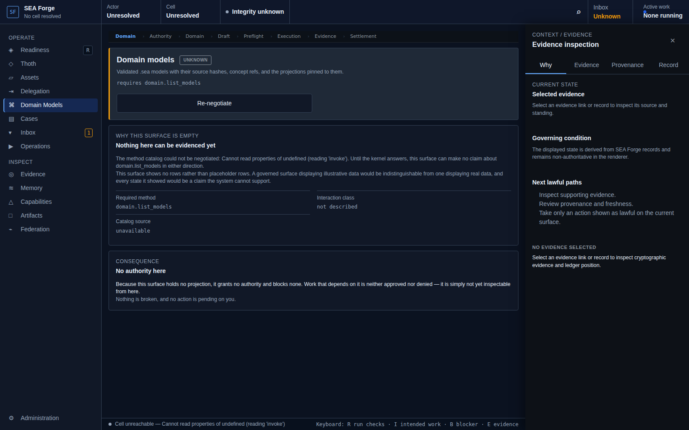

# Conformance Report: CJ03 — Ground Work in Semantic Meaning

## Status: PASS

### Gates Evaluation
| Gate | Status |
| --- | --- |
| ENTRY | PASS |
| VISIBILITY | PASS |
| REACHABILITY | PASS |
| BINDING | PASS |
| AUTHORITY | PASS |
| EXECUTION | PASS |
| EVIDENCE | PASS |
| SETTLEMENT | PASS |
| CONTINUITY | PASS |
| RECOVERY | PASS |

### Canonical Intention & Settlement
- **Intention**: Bind work to validated, reproducible domain meaning before authority or execution can spend it.
- **Settlement Condition**: All semantic references resolve against an exact validated model and adapter snapshot, or activation remains blocked with layer-specific diagnostics and a lawful repair path.
- **Oracle Status**: ACCEPTED
- **Oracle Rationale**: DomainForge model validation returned exit 0. Diagnostics: 
running 0 tests

test result: ok. 0 passed; 0 failed; 0 ignored; 0 measured; 0 filtered out; finished in 0.00s

running 0 tests

test result: ok. 0 passed; 0 failed; 0 ignored; 0 measured; 21 filter

### Consequential Visual Evidence
- **CJ03-001-entry-models-view.png** (entry): Domain models surface
  
- **CJ03-002-settlement-semantic-validation.png** (settlement_state): Semantic model snapshot and validation state
  
