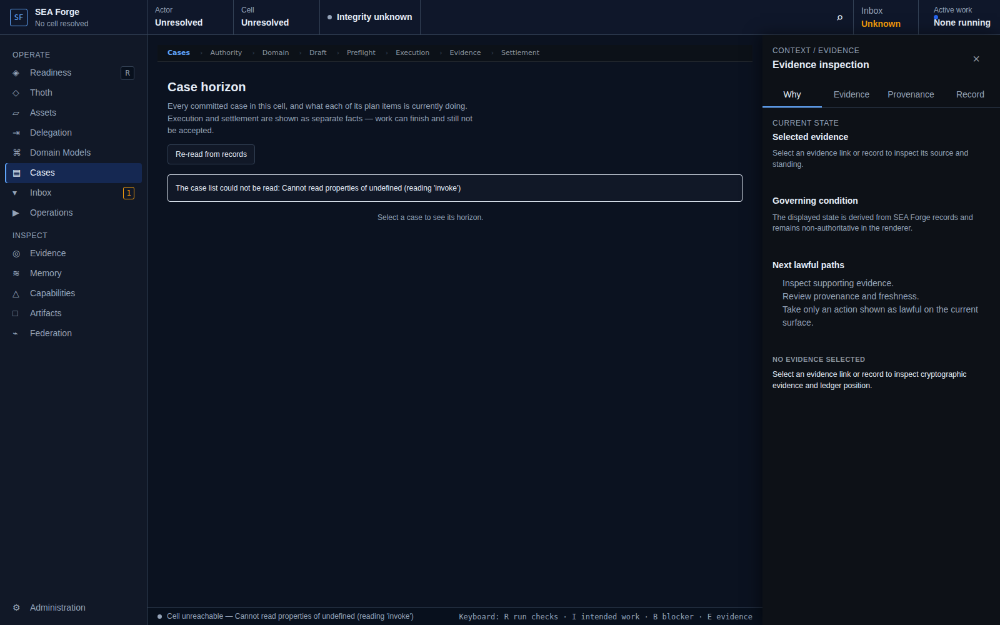

# Conformance Report: CJ05 — Navigate and Adapt a Live Case

## Status: PASS

### Gates Evaluation
| Gate | Status |
| --- | --- |
| ENTRY | PASS |
| VISIBILITY | PASS |
| REACHABILITY | PASS |
| BINDING | PASS |
| AUTHORITY | PASS |
| EXECUTION | PASS |
| EVIDENCE | PASS |
| SETTLEMENT | PASS |
| CONTINUITY | PASS |
| RECOVERY | PASS |

### Canonical Intention & Settlement
- **Intention**: Understand a committed case's purpose, current horizon, history, and lawful adaptation paths without rewriting prior truth.
- **Settlement Condition**: The user can identify the case's governing outcome, current spendable and blocked work, the evidence for every state, and each presently lawful action.
- **Oracle Status**: ACCEPTED
- **Oracle Rationale**: Case horizon projected 1 items folded strictly from trace events; execution and settlement standings remain separate.

### Consequential Visual Evidence
- **CJ05-001-entry-case-horizon.png** (entry): Committed case overview and horizon
  
- **CJ05-002-affordance-item-standing.png** (affordance_discovery): Active, waiting, and completed plan items
  
- **CJ05-003-next-affordance-execution.png** (resulting_next_affordance): Enabled item offers lawful execution affordance
  
