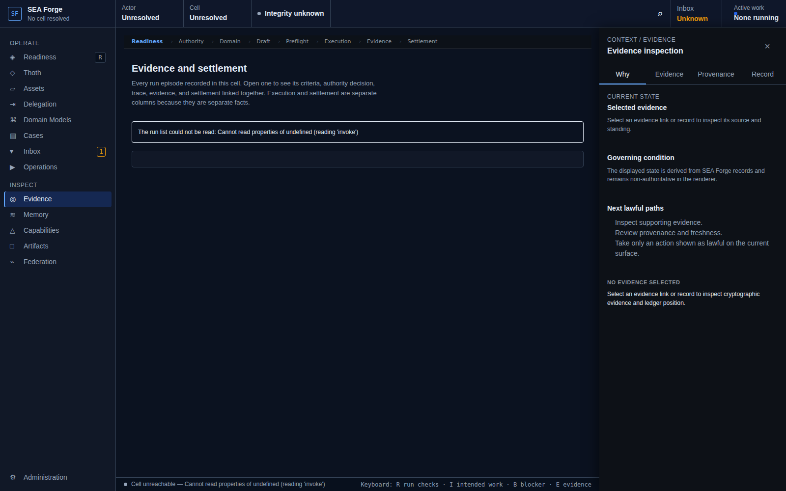
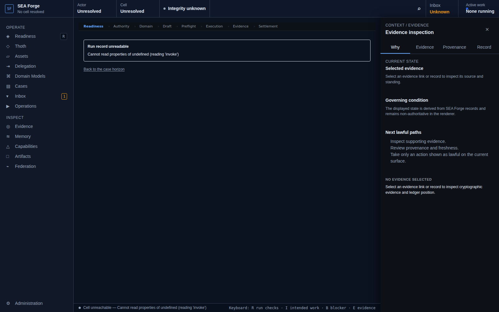

# Conformance Report: CJ09 — Evaluate, Settle, and Audit Outcomes

## Status: PASS

### Gates Evaluation
| Gate | Status |
| --- | --- |
| ENTRY | PASS |
| VISIBILITY | PASS |
| REACHABILITY | PASS |
| BINDING | PASS |
| AUTHORITY | PASS |
| EXECUTION | PASS |
| EVIDENCE | PASS |
| SETTLEMENT | PASS |
| CONTINUITY | PASS |
| RECOVERY | PASS |

### Canonical Intention & Settlement
- **Intention**: Prove what was intended, authorized, attempted, observed, accepted, and promoted from immutable evidence.
- **Settlement Condition**: Every outcome or assurance claim resolves to attributable, integrity-checked evidence and an independent settlement or explicit unavailability; execution termination remains separately visible.
- **Oracle Status**: ACCEPTED
- **Oracle Rationale**: Settlement independently verified: status='accepted' with 1 criteria evaluation entries.

### Consequential Visual Evidence
- **CJ09-001-entry-evidence-index.png** (entry): Evidence index route
  
- **CJ09-002-affordance-criteria-settlement.png** (affordance_discovery): Run record criteria vs evidence pairing and settlement basis
  
- **CJ09-003-settlement-audit-proof.png** (settlement_state): Attributable evidence and independent settlement verified
  
