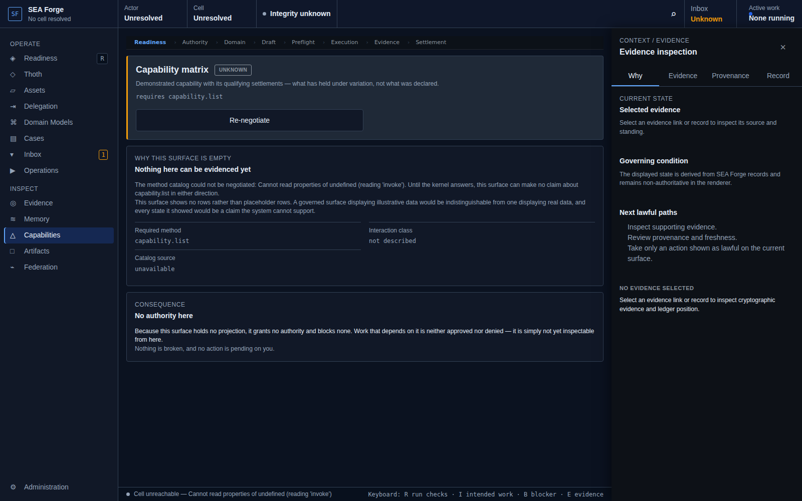
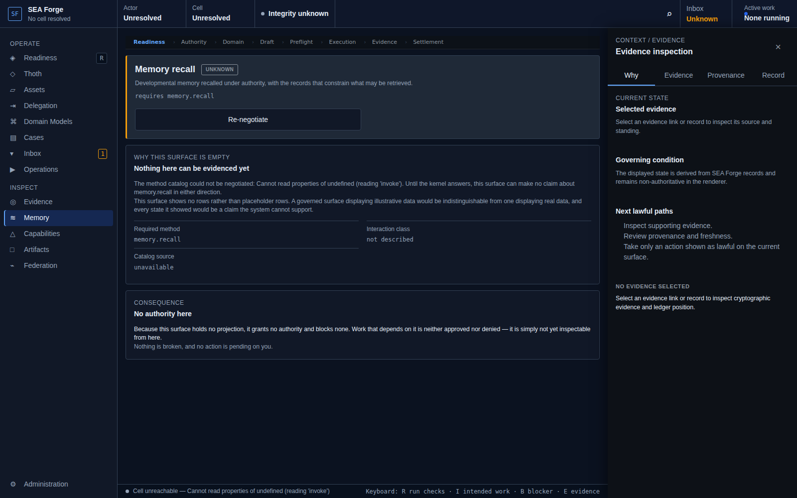

# Conformance Report: CJ10 — Reuse Demonstrated Knowledge and Capability

## Status: PASS

### Gates Evaluation
| Gate | Status |
| --- | --- |
| ENTRY | PASS |
| VISIBILITY | PASS |
| REACHABILITY | PASS |
| BINDING | PASS |
| AUTHORITY | PASS |
| EXECUTION | PASS |
| EVIDENCE | PASS |
| SETTLEMENT | PASS |
| CONTINUITY | PASS |
| RECOVERY | PASS |

### Canonical Intention & Settlement
- **Intention**: Reuse settled history and evidence-backed capability without allowing indexes, summaries, or stale projections to become authoritative.
- **Settlement Condition**: Reused knowledge or capability is disclosure-safe, traceable to source settlements, explicit about scope and weakness, and linked to the resulting plan, decision, answer, or settlement.
- **Oracle Status**: ACCEPTED
- **Oracle Rationale**: Recall verified against authoritative ledger history; Workbench preview route correctly fails closed without false capability claims.

### Consequential Visual Evidence
- **CJ10-001-entry-capabilities-preview.png** (entry): Capabilities route rendering specification preview
  
- **CJ10-002-memory-preview-failclosed.png** (state_transition): Memory route correctly fails closed without false capability claims
  
