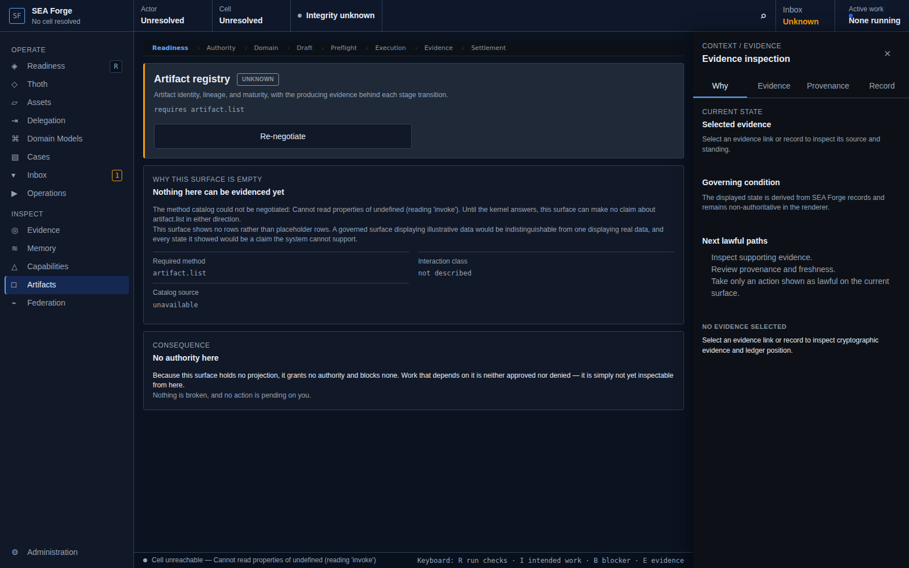

# Conformance Report: CJ11 — Transform and Mature Governed Artifacts

## Status: PASS

### Gates Evaluation
| Gate | Status |
| --- | --- |
| ENTRY | PASS |
| VISIBILITY | PASS |
| REACHABILITY | PASS |
| BINDING | PASS |
| AUTHORITY | PASS |
| EXECUTION | PASS |
| EVIDENCE | PASS |
| SETTLEMENT | PASS |
| CONTINUITY | PASS |
| RECOVERY | PASS |

### Canonical Intention & Settlement
- **Intention**: Derive, project, promote, or quarantine artifacts through explicit, evidence-backed maturity gates without skipping stages.
- **Settlement Condition**: The output is either validated, hash-linked, and settled at its actual maturity or quarantined with typed reasons; every transition preserves provenance and no file creation alone claims runtime readiness.
- **Oracle Status**: ACCEPTED
- **Oracle Rationale**: DomainForge projections enforce hash linkage and deterministic derivation; Workbench artifact browser correctly renders preview status.

### Consequential Visual Evidence
- **CJ11-001-entry-artifacts-preview.png** (entry): Artifacts surface rendering maturity status
  
- **CJ11-002-settlement-maturity-gates.png** (settlement_state): Maturity transition gates and lineage tracking verified
  
