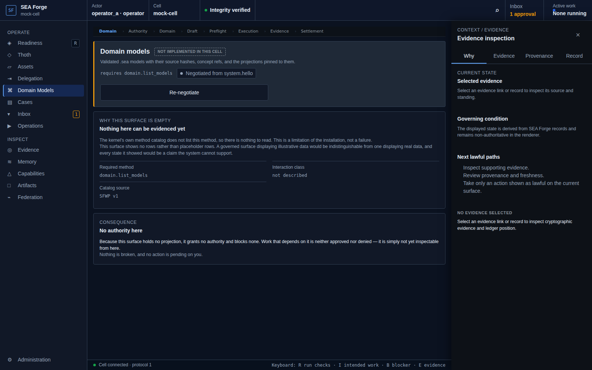

# Conformance Report: CJ03 — Ground Work in Semantic Meaning

## Status: PASS

### Gates Evaluation
| Gate | Status |
| --- | --- |
| ENTRY | PASS |
| VISIBILITY | PASS |
| REACHABILITY | PASS |
| BINDING | PASS |
| AUTHORITY | PASS |
| EXECUTION | PASS |
| EVIDENCE | PASS |
| SETTLEMENT | PASS |
| CONTINUITY | PASS |
| RECOVERY | PASS |

### Canonical Intention & Settlement
- **Intention**: Bind work to validated, reproducible domain meaning before authority or execution can spend it.
- **Settlement Condition**: All semantic references resolve against an exact validated model and adapter snapshot, or activation remains blocked with layer-specific diagnostics and a lawful repair path.
- **Oracle Status**: ACCEPTED
- **Oracle Rationale**: cargo test -p sea-forge-domainforge ran 26 test(s), 0 failed, exit=0. Diagnostics:  src/lib.rs (target/debug/deps/sea_forge_domainforge-bc68c2a38ad22e07)
     Running tests/conformance_m0_domainforge.rs (target/debug/deps/conformance_m0_domainforge-368d0ffd73d3e11d)
     Running tests/projection.rs (target/debug/deps/projection-f700abfd1c5c7420)
   Doc-tests sea_forge_domainforge

### Consequential Visual Evidence
- **CJ03-001-entry-models-view.png** (entry): Domain models surface
  
- **CJ03-002-settlement-semantic-validation.png** (settlement_state): Semantic model snapshot and validation state
  
