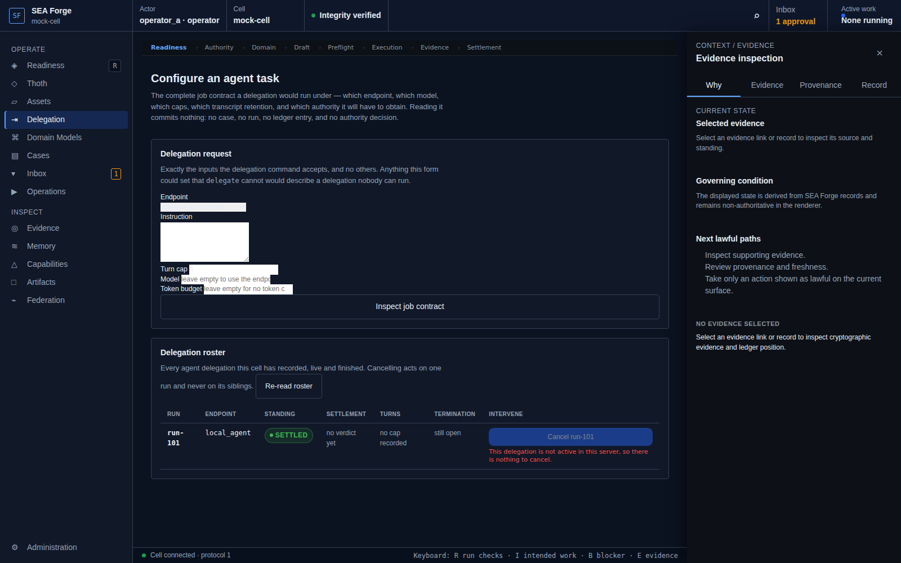

# Conformance Report: CJ07 — Execute Governed Work

## Status: PASS

### Gates Evaluation
| Gate | Status |
| --- | --- |
| ENTRY | PASS |
| VISIBILITY | PASS |
| REACHABILITY | PASS |
| BINDING | PASS |
| AUTHORITY | PASS |
| EXECUTION | PASS |
| EVIDENCE | PASS |
| SETTLEMENT | PASS |
| CONTINUITY | PASS |
| RECOVERY | PASS |

### Canonical Intention & Settlement
- **Intention**: Perform human, command, projection, transition, or agent work only within the exact granted boundary and retain evidence for later settlement.
- **Settlement Condition**: Execution terminates within the granted boundary and leaves complete outcome evidence for settlement, including governed denial or failure; only settlement may accept the work.
- **Oracle Status**: ACCEPTED
- **Oracle Rationale**: Authority decision preceded execution; 1 termination event(s) recorded; 1 evidence artifact(s) hash-verified by recomputation.

### Consequential Visual Evidence
- **CJ07-001-entry-delegation-workbench.png** (entry): Delegation and task configuration workbench
  
- **CJ07-002-settlement-execution-handoff.png** (settlement_state): Execution terminated within boundary, handed to settlement
  
