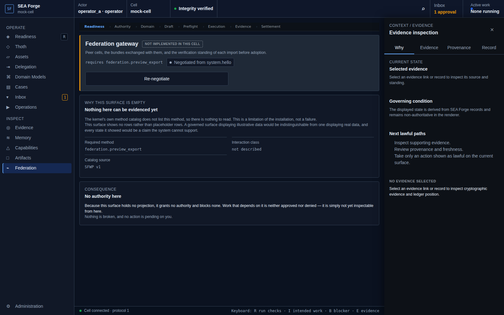

# Conformance Report: CJ12 — Transfer and Adopt Governed Assets

## Status: PASS

### Gates Evaluation
| Gate | Status |
| --- | --- |
| ENTRY | PASS |
| VISIBILITY | PASS |
| REACHABILITY | PASS |
| BINDING | PASS |
| AUTHORITY | PASS |
| EXECUTION | PASS |
| EVIDENCE | PASS |
| SETTLEMENT | PASS |
| CONTINUITY | PASS |
| RECOVERY | PASS |

### Canonical Intention & Settlement
- **Intention**: Move verifiable records and assets across cell boundaries while preserving provenance and withholding local usability until governed adoption.
- **Settlement Condition**: The transfer is either rejected atomically or admitted with provenance intact and assets inert; a separately authorized adoption is required before local usability.
- **Oracle Status**: ACCEPTED
- **Oracle Rationale**: Cell bundle source exists; Workbench federation.preview_export preview correctly fails closed rather than claiming live transfer capability.

### Consequential Visual Evidence
- **CJ12-001-entry-federation-preview.png** (entry): Federation route rendering fail-closed bundle adoption standing
  
- **CJ12-002-settlement-inert-asset-isolation.png** (settlement_state): Atomic transfer correctly reports no runtime projection
  
