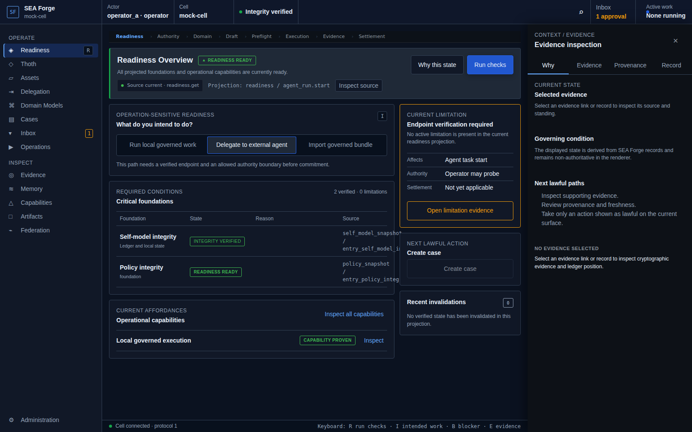
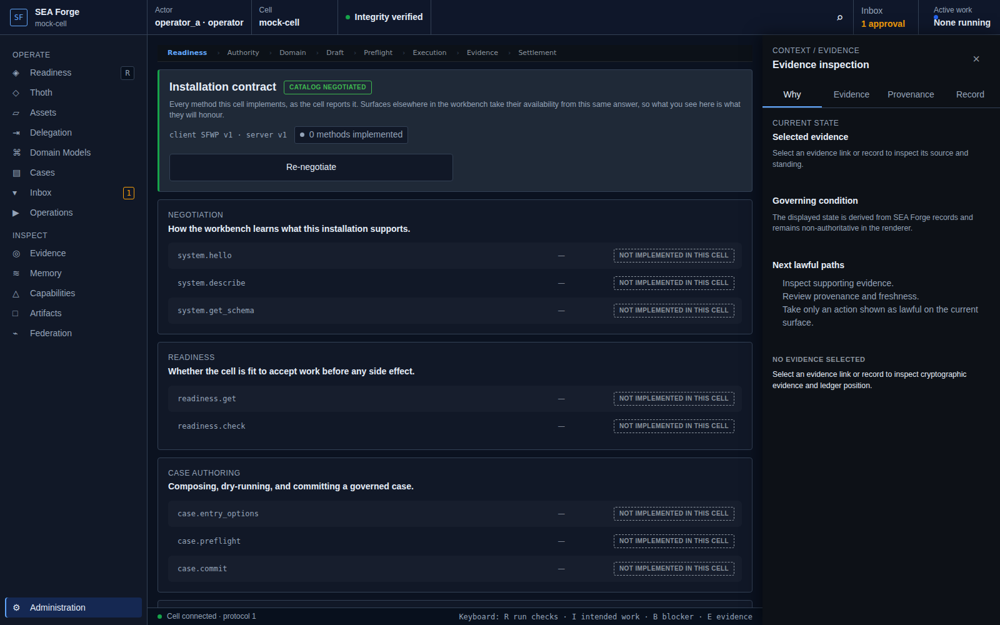

# Conformance Report: CJ01 — Establish Trusted Cell Context

## Status: PASS

### Gates Evaluation
| Gate | Status |
| --- | --- |
| ENTRY | PASS |
| VISIBILITY | PASS |
| REACHABILITY | PASS |
| BINDING | PASS |
| AUTHORITY | PASS |
| EXECUTION | PASS |
| EVIDENCE | PASS |
| SETTLEMENT | PASS |
| CONTINUITY | PASS |
| RECOVERY | PASS |

### Canonical Intention & Settlement
- **Intention**: Enter a cell whose identity, configuration, integrity, semantic self-model, and operation-specific readiness are explicit.
- **Settlement Condition**: The actor is attributable, the governing snapshots and integrity state are explicit, and the cell states whether the intended operation is ready, degraded, stale, or blocked with evidence.
- **Oracle Status**: ACCEPTED
- **Oracle Rationale**: Foundation source records exist on disk; /readiness rendered an explicit classification; /admin rendered attributable identity content.

### Consequential Visual Evidence
- **CJ01-001-entry.png** (entry): Workbench readiness route entry
  
- **CJ01-002-affordance-foundation-inspection.png** (affordance_discovery): Cell foundations and readiness items visible
  
- **CJ01-003-admin-cell-context.png** (state_transition): Cell admin & identity view
  
