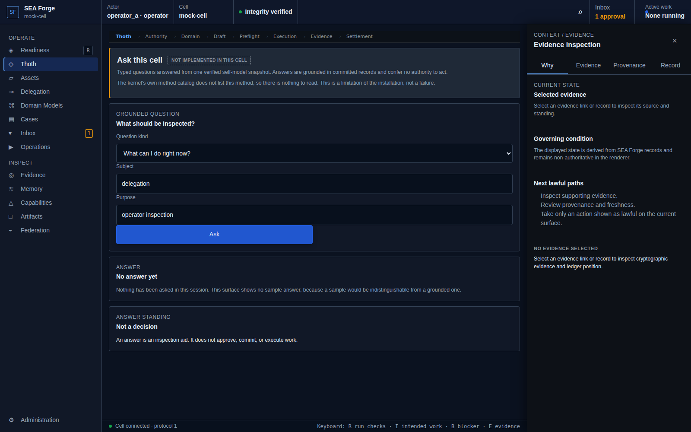
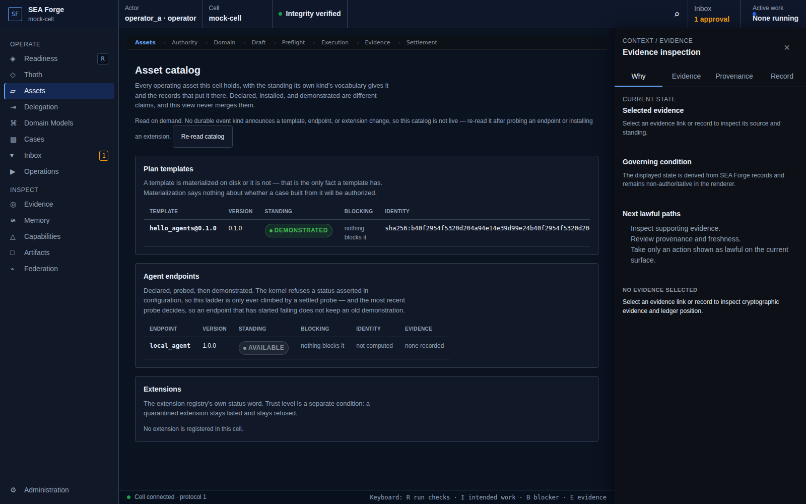
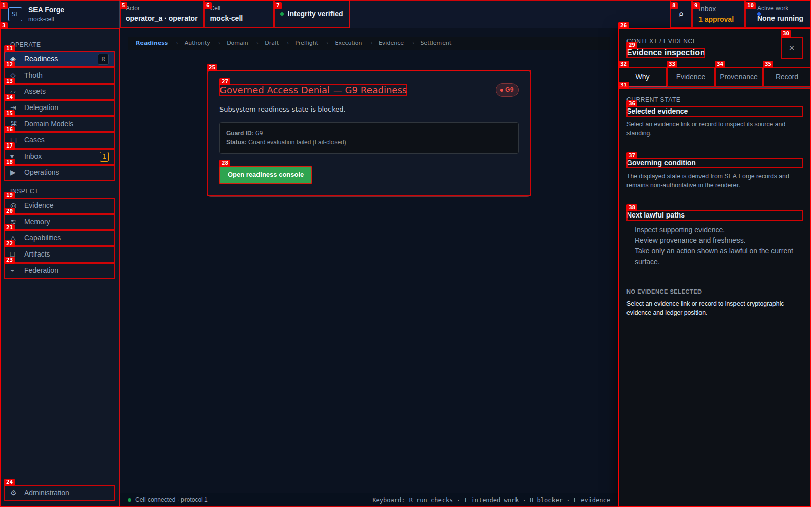

# Conformance Report: CJ02 — Discover Lawful Affordances

## Status: FAIL

### Gates Evaluation
| Gate | Status |
| --- | --- |
| ENTRY | PASS |
| VISIBILITY | PASS |
| REACHABILITY | PASS |
| BINDING | FAIL |
| AUTHORITY | PASS |
| EXECUTION | PASS |
| EVIDENCE | PASS |
| SETTLEMENT | PASS |
| CONTINUITY | PASS |
| RECOVERY | PASS |

### Failure Diagnosis
- **Code**: `INTERFACE_BINDING_GAP`
- **Locus**: BINDING
- **Expected**: PASS / **Observed**: FAIL

### Canonical Intention & Settlement
- **Intention**: Understand what exists, what is usable, what is allowed, and why a path is unavailable in the current actor and cell context.
- **Settlement Condition**: The user receives a source-backed set of currently visible, reachable, permitted, and settleable actions, including explicit blockers, uncertainty, freshness, and limitations.
- **Oracle Status**: ACCEPTED
- **Oracle Rationale**: asset.list returned 2 source-backed asset(s); guard denial surface rendered an explicit blocker for G9.

### Consequential Visual Evidence
- **CJ02-001-entry-thoth.png** (entry): Thoth discovery route
  
- **CJ02-002-affordance-assets-catalog.png** (affordance_discovery): Operating assets, templates, and agent endpoints
  
- **CJ02-003-authority-denial-explanation.png** (authority_boundary): Governed denial surface explaining blocked authority
  
