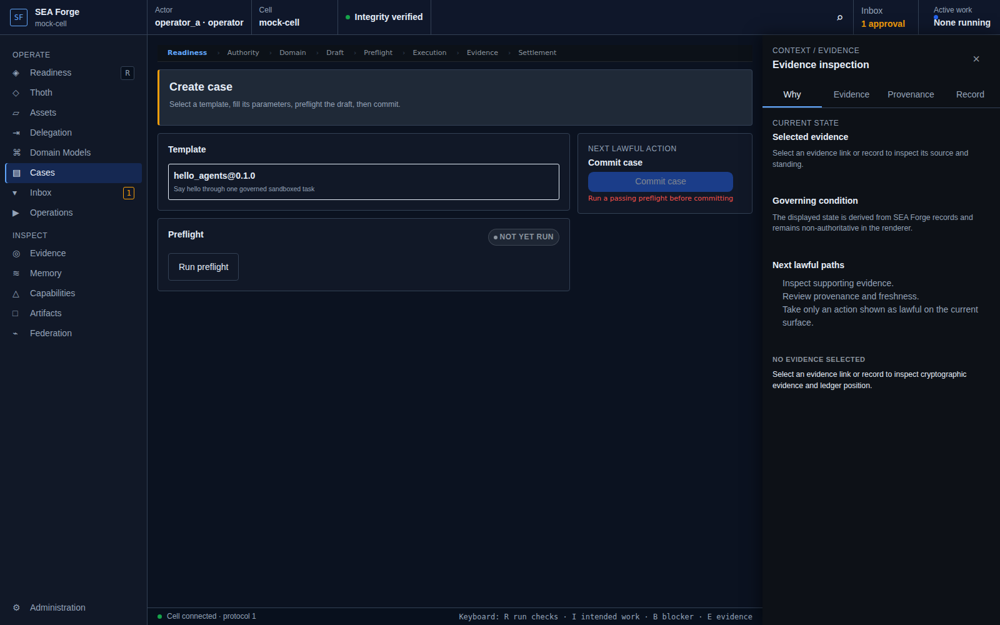
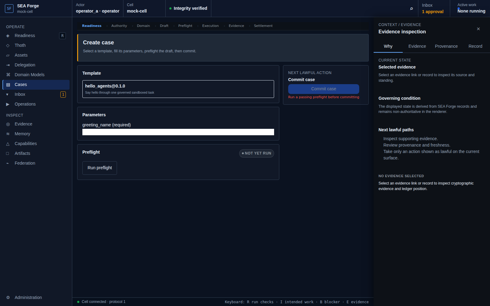
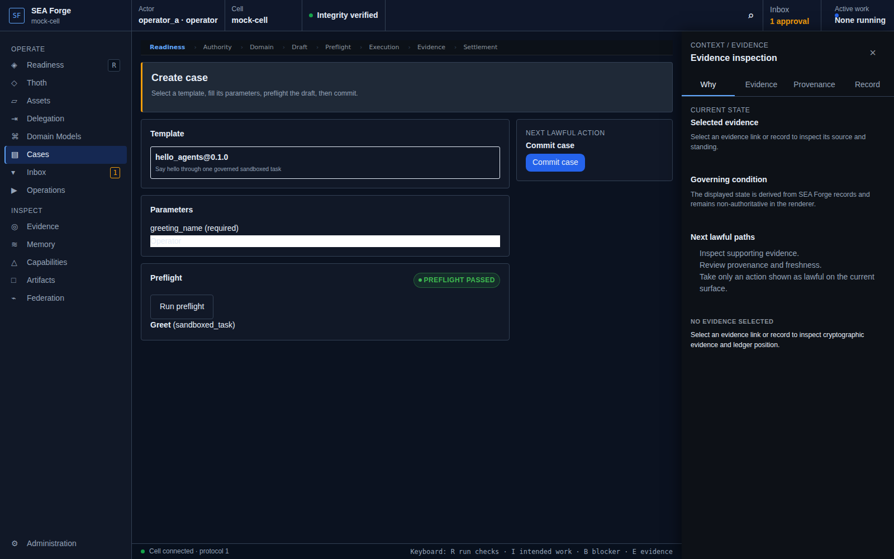
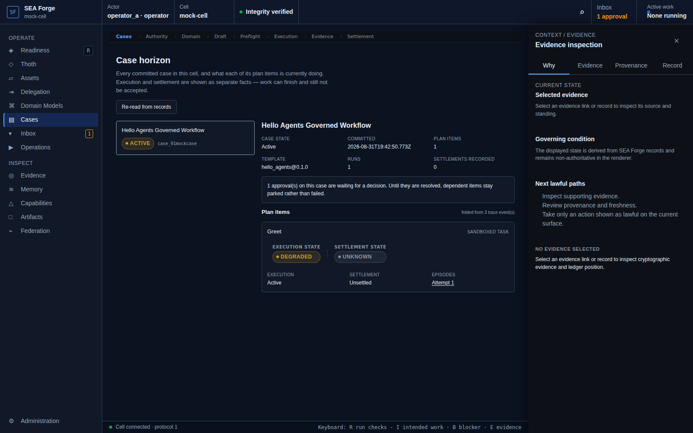

# Conformance Report: CJ04 — Form and Commit a Governed Case

## Status: PASS

### Gates Evaluation
| Gate | Status |
| --- | --- |
| ENTRY | PASS |
| VISIBILITY | PASS |
| REACHABILITY | PASS |
| BINDING | PASS |
| AUTHORITY | PASS |
| EXECUTION | PASS |
| EVIDENCE | PASS |
| SETTLEMENT | PASS |
| CONTINUITY | PASS |
| RECOVERY | PASS |

### Canonical Intention & Settlement
- **Intention**: Turn intent, a template, or an untrusted proposal into a validated, previewed, immutable case plan.
- **Settlement Condition**: The exact accepted plan, parameters, criteria, provenance, configuration digests, and model references are committed before any execution side effect.
- **Oracle Status**: ACCEPTED
- **Oracle Rationale**: Case case_01mockcase committed via 1 observed case.commit call(s); state=active; preflight pinned digest=sha256:b40f2954f5320d2...

### Consequential Visual Evidence
- **CJ04-001-entry-readiness.png** (entry): Case creation workbench entry
  
- **CJ04-002-affordance-template-selection.png** (affordance_discovery): Template selected; parameter form revealed
  
- **CJ04-003-preflight-passed.png** (state_transition): Preflight passed with pinned precondition digest
  
- **CJ04-004-settlement-case-committed.png** (settlement_state): Case committed; navigated to case horizon
  
- **CJ04-005-next-affordance-CJ05.png** (resulting_next_affordance): Committed case horizon, ready for CJ05 to navigate
  
