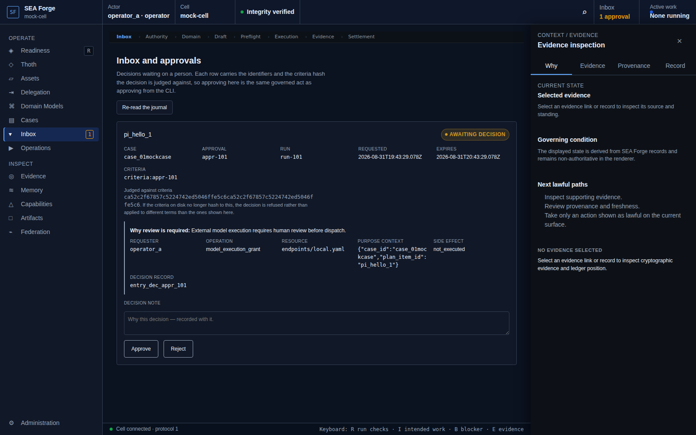
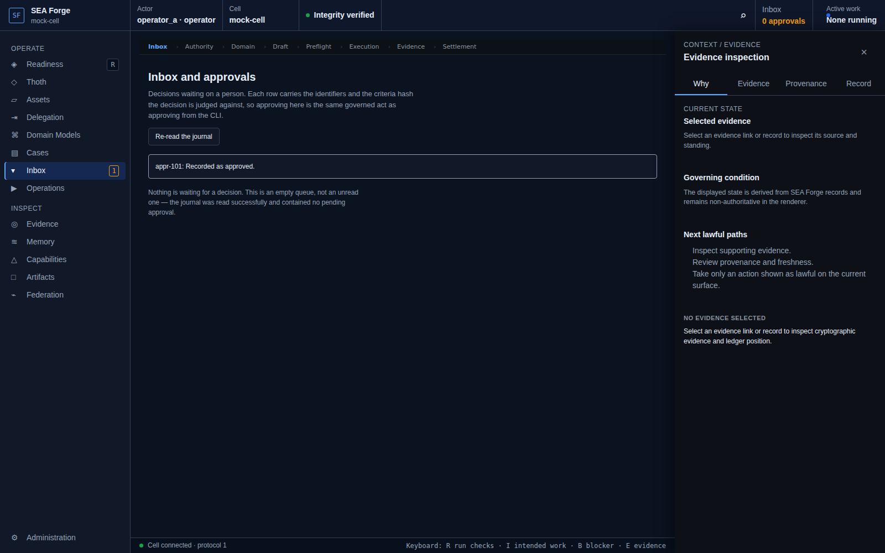

# Conformance Report: CJ06 — Resolve Human Judgment and Approval

## Status: PASS

### Gates Evaluation
| Gate | Status |
| --- | --- |
| ENTRY | PASS |
| VISIBILITY | PASS |
| REACHABILITY | PASS |
| BINDING | PASS |
| AUTHORITY | PASS |
| EXECUTION | PASS |
| EVIDENCE | PASS |
| SETTLEMENT | PASS |
| CONTINUITY | PASS |
| RECOVERY | PASS |

### Canonical Intention & Settlement
- **Intention**: Admit accountable human decisions and work into the governed record through the same authority and evidence fabric as other work.
- **Settlement Condition**: An eligible human decision or contribution is committed with its actor, context, evidence, rationale, and downstream effect, or refusal, denial, or expiry is recorded without unauthorized side effects.
- **Oracle Status**: ACCEPTED
- **Oracle Rationale**: Approval appr-101 decided with verdict='approve' by actor='approver_alice', observed live on the IPC transcript.

### Consequential Visual Evidence
- **CJ06-001-entry-approval-inbox.png** (entry): Approval inbox route
  
- **CJ06-002-authority-approval-boundary.png** (authority_boundary): Separation of duty check and pending decision context
  
- **CJ06-003-settlement-decision-committed.png** (settlement_state): Human decision committed to approvals journal
  
