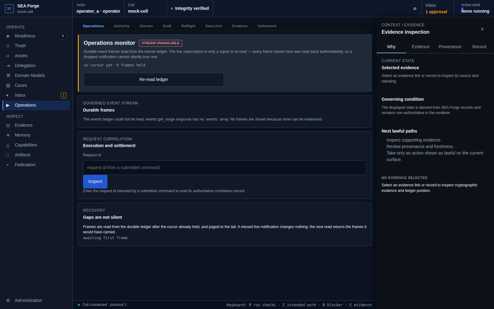
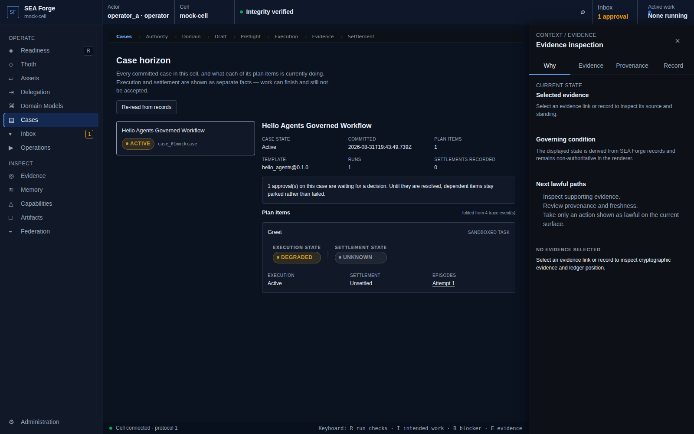

# Conformance Report: CJ08 — Monitor, Intervene, and Recover

## Status: PASS

### Gates Evaluation
| Gate | Status |
| --- | --- |
| ENTRY | PASS |
| VISIBILITY | PASS |
| REACHABILITY | PASS |
| BINDING | PASS |
| AUTHORITY | PASS |
| EXECUTION | PASS |
| EVIDENCE | PASS |
| SETTLEMENT | PASS |
| CONTINUITY | PASS |
| RECOVERY | PASS |

### Canonical Intention & Settlement
- **Intention**: Keep concurrent and interrupted work visible, controllable, and recoverable without changing committed meaning or affecting unrelated work.
- **Settlement Condition**: The operator sees the authoritative operational standing and either completes a scoped intervention or reaches an explicit resume, retry, replan, repair, endpoint, environment, escalation, or terminal decision.
- **Oracle Status**: ACCEPTED
- **Oracle Rationale**: Observed 9 real IPC call(s); stale-precondition recovery attempted, succeeded=True.

### Consequential Visual Evidence
- **CJ08-001-entry-operations-monitor.png** (entry): Operations and event monitor route
  
- **CJ08-002-recovery-stale-repair.png** (recovery): Stale precondition recovery via re-preflight
  
- **CJ08-003-settlement-operational-standing.png** (settlement_state): Authoritative operational standing reconciled
  
