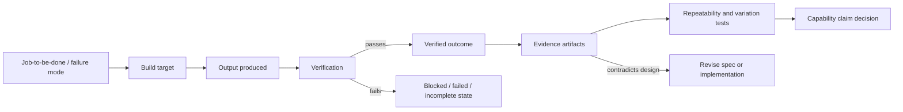
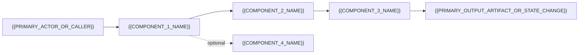
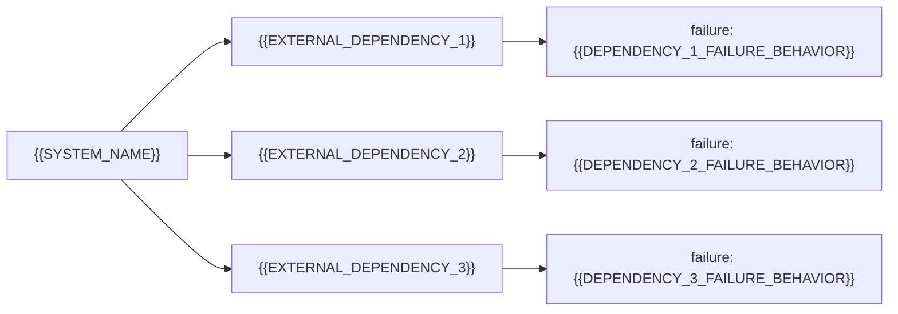
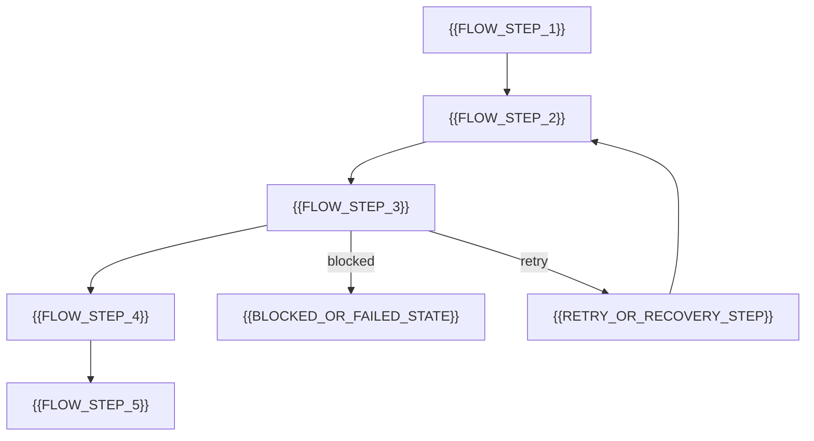
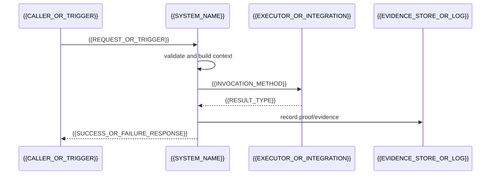
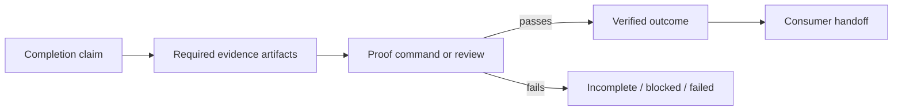
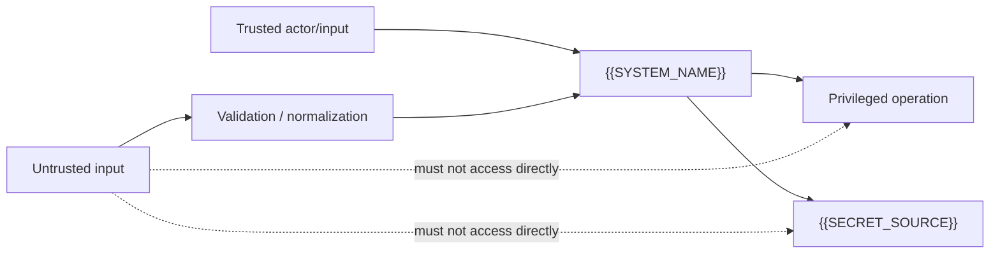

# Agent-Facing Specification Template — Outcome / Capability / Evidence Core

<!--
PURPOSE:
Use this template when asking an agent to create a rigorous implementation specification for a
service, tool, runtime, integration, workflow, subsystem, API, library, or operating process.

This template is intentionally lean. It is not an operating-governance framework. It does not ask the
system to manage long-term learning unless that is explicitly part of the product. It only requires
the spec to state what must be built, what result it must produce, what evidence proves that result,
and what design changes when evidence contradicts expectations.

REMOVE THESE HTML COMMENTS IN THE FINAL GENERATED SPEC unless the user explicitly wants a visible
template.
-->

# {{SPEC_TITLE}}

Status: {{SPEC_STATUS}} {{SPEC_VERSION}}

Scope: {{LANGUAGE_OR_PLATFORM_SCOPE}}

Purpose: {{ONE_SENTENCE_PURPOSE}}

Owner: {{SPEC_OWNER_OR_TEAM}}

## 0. Spec Frame

<!-- KEEP THIS SECTION. It is the quality gate for the whole generated spec. -->

A useful implementation spec MUST let a developer, agent, reviewer, or operator answer these eight
questions without guessing:

1. What should be built?
2. What result should it produce?
3. How will we know the result is real?
4. What capability should get stronger after repeated successful use?
5. What evidence proves the capability claim?
6. What fails safely?
7. What must repeat until reliable?
8. What changes when evidence disagrees with the design?

If the generated spec cannot answer these questions, it is incomplete.

#### Spec Proof Loop



## Normative Language

<!-- KEEP THIS SECTION UNCHANGED. -->

The key words `MUST`, `MUST NOT`, `REQUIRED`, `SHOULD`, `SHOULD NOT`, `RECOMMENDED`, `MAY`, and
`OPTIONAL` in this document are to be interpreted as described in RFC 2119.

`Implementation-defined` means the behavior is part of the implementation contract, but this
specification does not prescribe one universal policy. Implementations MUST document the selected
behavior.

## 1. Problem Statement

<!--
Describe the job-to-be-done/operational failure mode this system exists to solve. Avoid vague claims like
"improve efficiency" unless the inefficiency is tied to observable behavior, cost, risk, delay,
rework, user pain, or system failure.
-->

{{SYSTEM_NAME}} solves {{PROBLEM_SUMMARY}}.

Job-to-be-done:

- When {{PRIMARY_ACTOR_OR_SYSTEM}} needs to {{JOB_CONTEXT_OR_TRIGGER}}, they need {{SYSTEM_NAME}} to {{JOB_TO_BE_DONE}} so that {{DESIRED_OUTCOME_OR_PROGRESS}}.

Current failure mode:

- {{CURRENT_FAILURE_MODE_1}}
- {{CURRENT_FAILURE_MODE_2}}
- {{CURRENT_FAILURE_MODE_3}}

The system is needed because {{WHY_EXISTING_APPROACHES_FAIL}}.

Important boundary:

- {{SYSTEM_NAME}} is {{WHAT_THIS_SYSTEM_IS}}.
- {{SYSTEM_NAME}} is not {{WHAT_THIS_SYSTEM_IS_NOT}}.
- Successful execution means {{SUCCESSFUL_EXECUTION_BOUNDARY}}, not necessarily {{COMMON_FALSE_SUCCESS_BOUNDARY}}.

## 2. Goals and Non-Goals

### 2.1 Goals

<!-- Goals are build targets. Each goal should be testable or reviewable. -->

- {{GOAL_1}}
- {{GOAL_2}}
- {{GOAL_3}}
- {{GOAL_4}}

### 2.2 Non-Goals

<!-- Non-goals prevent scope creep. Include attractive things the system should not try to solve. -->

- {{NON_GOAL_1}}
- {{NON_GOAL_2}}
- {{NON_GOAL_3}}
- {{NON_GOAL_4}}

## 3. Outcome Contract

<!--
This section separates output, verified outcome, and downstream usefulness. Do not collapse these.
An output may exist while the intended outcome is still unproven.
-->

### 3.1 Output Produced

The system MUST produce {{PRIMARY_OUTPUT_ARTIFACT_OR_STATE_CHANGE}}.

Output fields / contents / side effects:

- {{OUTPUT_REQUIREMENT_1}}
- {{OUTPUT_REQUIREMENT_2}}
- {{OUTPUT_REQUIREMENT_3}}

### 3.2 Outcome Verified

The output counts as a verified outcome only when {{OUTCOME_VERIFICATION_CONDITION}}.

Verification signals:

- {{VERIFICATION_SIGNAL_1}}
- {{VERIFICATION_SIGNAL_2}}
- {{VERIFICATION_SIGNAL_3}}

A run MUST NOT be reported as complete when {{FALSE_COMPLETION_CONDITION}}.

### 3.3 Consumer and Handoff

The outcome is consumed by {{OUTCOME_CONSUMER}}.

Handoff is complete when:

- {{HANDOFF_REQUIREMENT_1}}
- {{HANDOFF_REQUIREMENT_2}}
- {{HANDOFF_REQUIREMENT_3}}

If the outcome cannot be verified, the system MUST enter {{BLOCKED_OR_FAILED_STATE}} and expose
{{BLOCKED_EVIDENCE_OR_ERROR_SURFACE}}.

## 4. Capability Claim

<!--
A spec may claim that the system creates a stronger user/team/system capability, but the claim must
be explicit and testable. This is not a long-term governance program. It is a proof requirement.
-->

If repeated use of this system does not produce a transferable team or system capability — for example a pure library, utility function, file format converter, or one-shot transform — write Not applicable and explain why in one sentence.

After repeated successful use, {{CAPABILITY_OWNER}} should be better able to {{CAPABILITY_DELTA}}.

This capability claim is in scope because {{WHY_CAPABILITY_MATTERS_TO_PRODUCT}}.

The capability claim is proven only if:

- {{CAPABILITY_EVIDENCE_1}}
- {{CAPABILITY_EVIDENCE_2}}
- {{CAPABILITY_EVIDENCE_3}}

The capability claim is not proven by:

- {{CAPABILITY_NON_EVIDENCE_1}}
- {{CAPABILITY_NON_EVIDENCE_2}}
- {{CAPABILITY_NON_EVIDENCE_3}}

## 5. Evidence and Claim Discipline

<!--
Use this section to prevent overclaiming. If a behavior is planned but unbuilt, label it as roadmap.
If it works in one demo but not under variation, label it partially proven.
-->

This specification uses four claim levels:

- `Evidence-backed`: supported by implementation, tests, logs, proof commands, reviewable artifacts,
  integration results, or other inspectable evidence.
- `Partially proven`: implemented in meaningful pieces, but not yet proven end-to-end, under
  variation, or in the target environment.
- `Assumption`: required for the design to hold, but not yet proven.
- `Roadmap`: intended or possible future behavior that is not required for current conformance.

Claim table:

| Claim | Level | Required evidence | Current evidence | Gap |
|---|---|---|---|---|
| {{CLAIM_1}} | {{LEVEL}} | {{REQUIRED_EVIDENCE}} | {{CURRENT_EVIDENCE}} | {{GAP}} |
| {{CLAIM_2}} | {{LEVEL}} | {{REQUIRED_EVIDENCE}} | {{CURRENT_EVIDENCE}} | {{GAP}} |
| {{CLAIM_3}} | {{LEVEL}} | {{REQUIRED_EVIDENCE}} | {{CURRENT_EVIDENCE}} | {{GAP}} |

## 6. System Overview

### 6.1 Architecture Pattern

<!--
Choose the pattern that fits. Do not force a polling/orchestration model onto event-driven,
serverless, request/response, batch, or reactive systems.
-->

{{SYSTEM_NAME}} uses the following primary architecture pattern:

- Pattern: {{ARCHITECTURE_PATTERN}}
- Examples: request/response, event-driven, polling daemon, batch job, streaming processor,
  CLI tool, library, serverless function, workflow runner, human-in-the-loop process.
- Reason this pattern fits: {{PATTERN_RATIONALE}}
- Patterns intentionally not used: {{REJECTED_PATTERNS_AND_REASON}}

### 6.2 Main Components

1. `{{COMPONENT_1_NAME}}`
   - Responsibility: {{COMPONENT_1_RESPONSIBILITY}}
   - Inputs: {{COMPONENT_1_INPUTS}}
   - Outputs: {{COMPONENT_1_OUTPUTS}}

2. `{{COMPONENT_2_NAME}}`
   - Responsibility: {{COMPONENT_2_RESPONSIBILITY}}
   - Inputs: {{COMPONENT_2_INPUTS}}
   - Outputs: {{COMPONENT_2_OUTPUTS}}

3. `{{COMPONENT_3_NAME}}`
   - Responsibility: {{COMPONENT_3_RESPONSIBILITY}}
   - Inputs: {{COMPONENT_3_INPUTS}}
   - Outputs: {{COMPONENT_3_OUTPUTS}}

4. `{{COMPONENT_4_NAME}}` OPTIONAL
   - Responsibility: {{COMPONENT_4_RESPONSIBILITY}}
   - Enablement condition: {{COMPONENT_4_ENABLEMENT_CONDITION}}

#### Component Diagram

<!--
Use this diagram only if it makes component boundaries clearer. Replace placeholders with concrete
component names and delete unused nodes. If the system has fewer than two meaningful components,
write Not applicable and explain why.
-->



### 6.3 External Dependencies

- {{EXTERNAL_DEPENDENCY_1}} — used for {{DEPENDENCY_1_PURPOSE}}
- {{EXTERNAL_DEPENDENCY_2}} — used for {{DEPENDENCY_2_PURPOSE}}
- {{EXTERNAL_DEPENDENCY_3}} — used for {{DEPENDENCY_3_PURPOSE}}

Dependency failure behavior is specified in Section 14.

#### Dependency Diagram

<!--
Show only dependencies the implementation calls, stores to, reads from, or relies on for correctness.
Do not include marketing ecosystem diagrams here.
-->



## 7. Core Domain Model

<!--
Define only the objects the implementation must understand.
A domain model is useful when it tells a developer what must be stored, passed, validated,
branched on, reconciled, retried, audited, or exposed for debugging.

Do not fill this section with generic {{FIELD}} placeholders only. Use the entity-selection guide
below to choose concrete entity types for the architecture pattern. Define only the entities that
matter for this system.
-->

### 7.1 Domain Model Scope Rule

The generated spec SHOULD define the smallest set of entities needed to implement the system.

A typical implementation spec defines 3-7 core entities. More than 8 core entities usually means one
of three things:

- the system is genuinely broad and needs a larger model;
- optional extensions are being mixed into the core spec;
- the spec is modeling operations/governance around the system instead of the system itself.

If more than 8 core entities are required, the spec SHOULD explain why or move extension-specific
entities to an appendix.

Each entity definition SHOULD include only fields the implementation must use for at least one of
these purposes:

- identity or correlation;
- lifecycle/state transitions;
- validation or routing;
- execution or persistence;
- idempotency, deduplication, retry, or reconciliation;
- proof/evidence capture;
- observability, debugging, or safe recovery.

### 7.2 Entity Selection Guide

Choose the entity set that fits `{{ARCHITECTURE_PATTERN}}`. Do not copy all examples blindly.

For request/response APIs, common entities include:

- `Request` / `Command` — normalized input accepted by the system;
- `ValidationResult` — structured validation outcome;
- `ExecutionResult` / `Response` — output and status returned to the caller;
- `AuthContext` / `ActorContext` — caller identity and permission context, if relevant;
- `EvidenceRecord` — proof artifact or verification record, if completion claims require evidence.

For event-driven or reactive systems, common entities include:

- `Event` — normalized event envelope;
- `HandlerAttempt` — one attempt to process an event;
- `Subscription` / `Route` — event-to-handler mapping, if configurable;
- `DeadLetterEntry` — failed event record, if retries or replay exist;
- `ProjectionState` — materialized state derived from events, if the system maintains one.

For batch jobs or CLI tools, common entities include:

- `JobInput` — file set, arguments, or input bundle;
- `JobRun` — one execution of the job;
- `Artifact` — generated file, report, patch, export, or transformed output;
- `ProofResult` — proof command or review result;
- `ErrorReport` — structured failure output.

For orchestrator, daemon, worker, or agent-runner systems, common entities include:

- `WorkUnit` — the issue, task, job, event, request, document, or workflow item being processed;
- `RunAttempt` / `OperationAttempt` — one execution attempt for one work unit;
- `LiveSession` / `ActiveExecution` — current executor/session metadata while work is running;
- `RetryEntry` / `DeferredWorkEntry` — scheduled retry, continuation, or lease state;
- `RuntimeState` — authoritative in-memory or persisted control state;
- `Workspace` / `ResourceAllocation` — per-work-unit filesystem, storage, lease, or execution scope.

For libraries/frameworks, common entities include:

- `Public API Contract` — callable surface and parameter model;
- `Adapter` / `Provider` — pluggable implementation boundary;
- `Result` / `Error` — normalized return model;
- `Configuration` — typed options used by the library;
- `Capability` / `FeatureFlag` — enabled behavior surface, if behavior is modular.

### 7.3 Core Entities

<!--
Repeat this subsection for each selected entity.
Do not leave placeholder-only fields in the final generated spec.
-->

#### 7.3.1 {{ENTITY_1_NAME}}

Purpose: {{ENTITY_1_PURPOSE}}

Used by: {{COMPONENTS_THAT_READ_OR_WRITE_ENTITY_1}}

Required fields:

- `id` (string)
  - Stable identity used for lookup, correlation, idempotency, or reconciliation.
- `{{HUMAN_READABLE_ID_FIELD}}` (string)
  - Human-readable identifier used in logs, errors, evidence, and debugging surfaces.
- `status` / `state` (string or enum)
  - Current lifecycle state. Allowed values: {{ENTITY_1_ALLOWED_STATES}}.
- `created_at` (timestamp or null)
  - Creation or first-seen time when available.
- `updated_at` / `last_seen_at` (timestamp or null)
  - Last update time when available.

Domain-specific required fields:

- `{{DOMAIN_FIELD_1}}` ({{TYPE}})
  - {{DOMAIN_FIELD_1_MEANING_AND_VALIDATION}}
- `{{DOMAIN_FIELD_2}}` ({{TYPE}})
  - {{DOMAIN_FIELD_2_MEANING_AND_VALIDATION}}

Optional fields:

- `metadata` (map, OPTIONAL)
  - Extension-specific fields that do not affect core conformance.
- `evidence_ref` / `trace_id` / `correlation_id` (string, OPTIONAL)
  - Link to evidence, trace, or upstream/downstream operation when applicable.

#### 7.3.2 {{ENTITY_2_NAME}}

Purpose: {{ENTITY_2_PURPOSE}}

Used by: {{COMPONENTS_THAT_READ_OR_WRITE_ENTITY_2}}

Required fields:

- `id` or `{{ENTITY_2_ID_FIELD}}` (string)
  - Stable identity or correlation key.
- `{{ENTITY_2_REQUIRED_FIELD_1}}` ({{TYPE}})
  - {{ENTITY_2_FIELD_1_MEANING_AND_VALIDATION}}
- `{{ENTITY_2_REQUIRED_FIELD_2}}` ({{TYPE}})
  - {{ENTITY_2_FIELD_2_MEANING_AND_VALIDATION}}
- `status` / `result` (string or enum)
  - Allowed values: {{ENTITY_2_ALLOWED_STATUSES}}.

Optional fields:

- `error` (object or string, OPTIONAL)
  - Structured error when the entity represents a failed attempt, result, or validation.
- `started_at` / `finished_at` (timestamp, OPTIONAL)
  - Include when duration, timeout, or recovery behavior depends on time.

#### 7.3.3 {{ENTITY_3_NAME}}

Purpose: {{ENTITY_3_PURPOSE}}

Required fields:

- `{{ENTITY_3_REQUIRED_FIELD_1}}` ({{TYPE}})
  - {{ENTITY_3_FIELD_1_MEANING_AND_VALIDATION}}
- `{{ENTITY_3_REQUIRED_FIELD_2}}` ({{TYPE}})
  - {{ENTITY_3_FIELD_2_MEANING_AND_VALIDATION}}

Optional fields:

- `{{ENTITY_3_OPTIONAL_FIELD_1}}` ({{TYPE}}, OPTIONAL)
  - {{ENTITY_3_OPTIONAL_FIELD_1_MEANING}}

#### Domain Diagram

<!--
Use a class diagram when relationships matter for implementation. Delete this block if the entity
list is clearer than a diagram.
-->

```mermaid
classDiagram
  class {{ENTITY_1_NAME}} {
    string id
    string {{HUMAN_READABLE_ID_FIELD}}
    string status
  }
  class {{ENTITY_2_NAME}} {
    string id
    string status_or_result
  }
  class {{ENTITY_3_NAME}} {
    string {{ENTITY_3_REQUIRED_FIELD_1}}
  }
  {{ENTITY_1_NAME}} --> {{ENTITY_2_NAME}} : {{ENTITY_1_TO_ENTITY_2_RELATIONSHIP}}
  {{ENTITY_2_NAME}} --> {{ENTITY_3_NAME}} : {{ENTITY_2_TO_ENTITY_3_RELATIONSHIP}}
```

### 7.4 Orchestrator / Daemon Entity Add-On

<!--
Use this subsection only if the selected architecture pattern is a polling daemon, orchestrator,
worker pool, long-running agent runner, queue worker, or scheduler. Delete it for simple APIs,
libraries, serverless handlers, and one-shot CLI tools unless they actually need these entities.
-->

If `{{SYSTEM_NAME}}` is an orchestrator/daemon-class system, the generated spec SHOULD define these
entities or explicitly explain why they are not needed:

#### WorkUnit

The normalized unit of work the system accepts, claims, processes, and reports on.

Typical fields:

- `id` (string) — stable internal or external ID;
- `identifier` (string) — human-readable key for logs and evidence;
- `title` / `summary` (string, OPTIONAL) — short description;
- `state` / `status` (string) — current external or internal lifecycle state;
- `priority` (integer/string/null, OPTIONAL) — dispatch ordering signal;
- `dependencies` / `blocked_by` (list, OPTIONAL) — blockers or prerequisites;
- `created_at` / `updated_at` (timestamp or null) — ordering and staleness signals.

#### RunAttempt / OperationAttempt

One attempt to process one work unit.

Typical fields:

- `work_unit_id` (string);
- `work_unit_identifier` (string);
- `attempt` (integer or null; null or 0 for first attempt, positive integer for retries);
- `execution_location` / `workspace_path` / `resource_key` (string, OPTIONAL);
- `started_at` / `finished_at` (timestamp or null);
- `status` (string or enum);
- `error` (structured object or string, OPTIONAL);
- `proof_ref` / `evidence_ref` (string, OPTIONAL).

#### LiveSession / ActiveExecution

Current executor/session state while work is running.

Typical fields:

- `session_id` (string);
- `executor_pid` / `remote_execution_id` / `request_id` (string or null);
- `last_event` (string/enum or null);
- `last_event_at` (timestamp or null);
- `last_message` (string or summarized payload, OPTIONAL);
- `progress` (number/string/map, OPTIONAL);
- `usage` / `tokens` / `cost` / `duration` (map, OPTIONAL);
- `step_count` / `turn_count` / `operation_count` (integer, OPTIONAL).

#### RetryEntry / DeferredWorkEntry

Scheduled retry, continuation, lease, or deferred execution record.

Typical fields:

- `work_unit_id` (string);
- `identifier` (string);
- `attempt` (integer);
- `due_at` / `due_at_ms` (timestamp or monotonic time);
- `timer_handle` / `queue_message_id` / `lease_id` (runtime-specific, OPTIONAL);
- `reason` (string or enum);
- `error` (string or structured object, OPTIONAL).

#### RuntimeState

Authoritative control state owned by the scheduler/orchestrator. It may be in-memory, persisted, or
reconstructable from external state, but that choice MUST be documented.

Typical fields:

- `running` (map `work_unit_id -> ActiveExecution` or running entry);
- `claimed` (set of work unit IDs or lease keys);
- `retry_attempts` / `deferred` (map or queue reference);
- `completed` (set/list, OPTIONAL; bookkeeping only unless explicitly used for gating);
- `max_concurrent_operations` (integer, if concurrency exists);
- `totals` / `metrics` (map, OPTIONAL);
- `last_health` / `last_error` (map or null, OPTIONAL).

### 7.5 Identifiers and Normalization

<!--
Normalization rules must be concrete enough to implement without ambiguity. Specify character
classes, replacement characters, case transformation rules, and composition patterns. Example:
"Derive storage key from identifier by replacing any character not in [A-Za-z0-9._-] with _."
Example: "Normalize state for comparison by applying lowercase." Example: "Compose session ID as
<thread_id>-<turn_id>." Vague rules such as "sanitize the identifier" are not acceptable in a
generated spec.
-->

- Use `{{PRIMARY_ID_FIELD}}` for internal identity, lookup, idempotency, and reconciliation.
- Use `{{HUMAN_READABLE_ID_FIELD}}` for logs, display, evidence, and operator debugging.
- Normalize `{{NORMALIZED_FIELD}}` by {{NORMALIZATION_RULE}}.
- Reject, escape, or sanitize `{{UNSAFE_INPUT_CLASS}}` using {{SAFETY_NORMALIZATION_RULE}}.
- If a string becomes a filesystem path, queue key, cache key, URL path, metric label, or command
  argument, the spec MUST define the allowed characters and collision behavior.

## 8. Configuration and Input Contract

<!--
Keep this section compact but implementation-ready. Config bugs are common production failures.
Every spec should define sources, precedence, validation, error classes, reload behavior when
applicable, and input handling.
-->

### 8.1 Configuration Sources and Resolution

Configuration sources, in precedence order:

1. {{CONFIG_SOURCE_1}}
2. {{CONFIG_SOURCE_2}}
3. {{CONFIG_SOURCE_3}}

Resolution rules:

- Explicit runtime configuration MUST take precedence over defaults.
- Environment variables MUST NOT globally override config values unless this spec explicitly says so.
- `$VAR_NAME` or equivalent indirection is resolved only for fields that explicitly allow it.
- Missing OPTIONAL fields receive documented defaults.
- Relative paths resolve relative to {{RELATIVE_PATH_BASE}} unless otherwise specified.
- URI fields MUST NOT be rewritten by filesystem path expansion logic.
- Command fields MUST document whether they are invoked through a shell, tokenized argv, SDK call,
  RPC call, or another invocation mechanism.

### 8.2 Required Config Fields

<!-- This section is intentionally redundant. A developer implementing the config layer must be able to read this section alone without hunting through the document. Do not remove it in the name of DRY. -->

| Field | Type | Required | Default | Validation |
|---|---|---:|---|---|
| `{{CONFIG_FIELD_1}}` | {{TYPE}} | yes | none | {{VALIDATION_RULE}} |
| `{{CONFIG_FIELD_2}}` | {{TYPE}} | no | {{DEFAULT}} | {{VALIDATION_RULE}} |
| `{{CONFIG_FIELD_3}}` | {{TYPE}} | no | {{DEFAULT}} | {{VALIDATION_RULE}} |
| `{{CONFIG_FIELD_4}}` | {{TYPE}} | no | {{DEFAULT}} | {{VALIDATION_RULE}} |

### 8.3 Config Error Classes

The implementation SHOULD expose typed configuration errors rather than only free-text failures.
Use these names unless the project already has a different error taxonomy.

- `missing_config_error`
  - Required config source is absent, unreadable, or not supplied.
- `parse_error`
  - Config syntax cannot be parsed as {{CONFIG_FORMAT}}.
- `schema_error`
  - Parsed config is structurally invalid, has wrong types, or fails required-field validation.
- `unsupported_kind_error`
  - A configured `kind`, adapter, mode, backend, or provider is not supported.
- `missing_credential_error`
  - Required credential is absent after environment/reference resolution.
- `template_parse_error` / `policy_parse_error` (if templates/policies exist)
  - Template or policy cannot be parsed before use.
- `template_render_error` / `policy_evaluation_error` (if templates/policies exist)
  - Template or policy fails at runtime because of unknown variables, invalid functions, unsafe
    interpolation, or evaluation failure.
- `invalid_reload_error` (if dynamic reload exists)
  - New config was detected but rejected; the last known good config remains active.

Error surface requirements:

- Startup config errors MUST be operator-visible.
- Runtime config/preflight errors MUST include an error code, concise message, and recoverability
  hint when possible.
- Error messages MUST NOT print secrets, raw credentials, or excessive config payloads.
- Optional extension config errors MUST NOT break core behavior unless the extension is enabled or
  the extension is required for the current operation.

Dispatch and operation gating:

The generated spec MUST state explicitly which error classes block all new work and which fail only
the affected operation.

- Errors that block all new work: config unreadable, required credentials missing, required adapter
  or mode unsupported. New dispatch or new work is suspended until the error is resolved.
- Errors that fail only the affected operation: template render errors, invalid per-item input,
  single-item validation failure. Other work continues unaffected.

Do not leave this ambiguous. A spec that says only "return an error" without stating the blast
radius is incomplete.

### 8.4 Dynamic Reload Behavior

Dynamic reload is {{REQUIRED_OPTIONAL_OR_NOT_APPLICABLE}} for this system.

Use these defaults:

- For long-running services, daemons, workers, schedulers, or agents, dynamic reload is RECOMMENDED
  when config changes should affect future work without restart.
- For one-shot CLI tools, libraries, short-lived jobs, and serverless handlers, dynamic reload is
  usually NOT APPLICABLE; startup validation is enough unless the system keeps warm state between
  invocations.

If dynamic reload is supported:

- The system MUST detect or defensively re-check config changes according to {{RELOAD_DETECTION_RULE}}.
- On change, the system MUST parse, validate, and build a new effective configuration snapshot before
  applying it.
- Reloaded config applies to {{RELOAD_APPLIES_TO}}, usually future dispatches, future requests,
  future retries, future hook execution, and future executor launches.
- In-flight operations are {{IN_FLIGHT_RELOAD_BEHAVIOR}}.
- Listener/socket/port/backend changes MAY require restart unless live rebind is explicitly
  supported.
- Invalid reloads MUST NOT crash the process. The system MUST keep operating with the last known
  good effective configuration and emit an operator-visible `invalid_reload_error`.

### 8.5 Startup and Preflight Validation

Startup validation:

- The system MUST validate required config before accepting work, starting the main loop, or running
  the primary operation.
- If startup validation fails, the system MUST fail startup or refuse work with an operator-visible
  typed error.

Preflight validation:

- The system SHOULD run a lightweight validation before starting new work.
- Preflight validates only what is needed to safely start the next operation; it is not a full audit
  of all possible behavior.
- If preflight fails in a long-running system, the system MUST skip new work for that cycle/request,
  keep safe cleanup/reconciliation active when applicable, and emit an operator-visible typed error.

Minimum validation checks:

- Config/input can be loaded from the selected source.
- Parsed config has the required map/object/root shape.
- `{{REQUIRED_CONFIG_FIELD_1}}` is present and supported.
- `{{REQUIRED_CONFIG_FIELD_2}}` is present after reference or `$VAR` resolution.
- `{{REQUIRED_CONFIG_FIELD_3}}` is present when required by the selected mode/kind.
- `{{EXECUTOR_OR_INTEGRATION_FIELD}}` is present and non-empty when execution/integration is needed.
- Paths, namespaces, queues, or resource roots are normalized and inside allowed boundaries when
  applicable.

### 8.6 Primary Input Contract

The system accepts {{PRIMARY_INPUT_TYPE}} from {{PRIMARY_INPUT_SOURCE}}.

Required input fields:

- `{{INPUT_FIELD_1}}` ({{TYPE}}) — {{INPUT_FIELD_1_VALIDATION}}
- `{{INPUT_FIELD_2}}` ({{TYPE}}) — {{INPUT_FIELD_2_VALIDATION}}
- `{{INPUT_FIELD_3}}` ({{TYPE}}) — {{INPUT_FIELD_3_VALIDATION}}

Invalid input behavior:

- Missing required fields: {{MISSING_FIELD_BEHAVIOR}}
- Invalid values: {{INVALID_VALUE_BEHAVIOR}}
- Duplicate input: {{DUPLICATE_INPUT_BEHAVIOR}}
- Out-of-scope input: {{OUT_OF_SCOPE_INPUT_BEHAVIOR}}
- Unsafe input: {{UNSAFE_INPUT_BEHAVIOR}}

## 9. Operational Flow and State Model

<!--
If the system has both internal control states and external entity states (for example an
orchestrator's claim states vs a tracker's issue states), define them separately and explicitly note
that they are not the same thing. Use the state model that fits the architecture pattern from
Section 6.1. Do not require retry queues, poll ticks, or proof-pending states unless they actually
exist.
-->

### 9.1 Flow Summary

```text
{{FLOW_STEP_1}}
  → {{FLOW_STEP_2}}
  → {{FLOW_STEP_3}}
  → {{FLOW_STEP_4}}
  → {{FLOW_STEP_5}}
```

#### Flow Diagram



For flows with branches, show each branch as a labeled separate path. A single linear chain that
omits the failure path, the retry path, or the blocked path is incomplete.

### 9.2 States

The system uses the following states for {{STATEFUL_OBJECT_NAME}}:

1. `{{STATE_1}}`
   - Meaning: {{STATE_1_MEANING}}
   - Entry trigger: {{STATE_1_ENTRY_TRIGGER}}
   - Exit trigger: {{STATE_1_EXIT_TRIGGER}}

2. `{{STATE_2}}`
   - Meaning: {{STATE_2_MEANING}}
   - Entry trigger: {{STATE_2_ENTRY_TRIGGER}}
   - Exit trigger: {{STATE_2_EXIT_TRIGGER}}

3. `{{STATE_3}}`
   - Meaning: {{STATE_3_MEANING}}
   - Entry trigger: {{STATE_3_ENTRY_TRIGGER}}
   - Exit trigger: {{STATE_3_EXIT_TRIGGER}}

Note: Distinct terminal states (failed, timed out, stalled, cancelled by policy) MUST be named
separately, not collapsed into a single failed state. Retry logic and log output depend on the
distinction.

### 9.3 Transition Rules

- `{{STATE_A}} → {{STATE_B}}` when {{TRANSITION_CONDITION_1}}.
- `{{STATE_B}} → {{STATE_C}}` when {{TRANSITION_CONDITION_2}}.
- `{{STATE_B}} → {{FAILED_STATE}}` when {{FAILURE_CONDITION}}.
- `{{FAILED_STATE}} → {{RECOVERY_STATE}}` when {{RECOVERY_CONDITION}}.

#### State Diagram

```mermaid
stateDiagram-v2
  [*] --> {{STATE_1}}
  {{STATE_1}} --> {{STATE_2}}: {{TRANSITION_CONDITION_1}}
  {{STATE_2}} --> {{STATE_3}}: {{TRANSITION_CONDITION_2}}
  {{STATE_2}} --> {{FAILED_STATE}}: {{FAILURE_CONDITION}}
  {{FAILED_STATE}} --> {{RECOVERY_STATE}}: {{RECOVERY_CONDITION}}
  {{STATE_3}} --> [*]: {{TERMINAL_CONDITION}}
```

Idempotency rule:

- Reprocessing the same {{PRIMARY_WORK_UNIT}} MUST {{IDEMPOTENCY_BEHAVIOR}}.

### 9.4 Transition Triggers

<!--
Name the events that cause state transitions. Each trigger should specify what state change or side
effect it produces. Do not leave triggers implicit.

For orchestrators and daemons, common triggers include: Poll Tick or Scheduler Tick, Worker Exit
(normal), Worker Exit (abnormal), Executor Update Event, Retry Timer Fired, Reconciliation Refresh,
Stall Timeout, Manual Operator Action.

For request/response systems, triggers are usually the request itself and its outcome: Request
Received, Validation Passed, Validation Failed, Execution Succeeded, Execution Failed, Timeout.

For event-driven systems, triggers are the event types the system subscribes to.

Define only triggers that exist in this architecture.
-->

- `{{TRIGGER_1}}` — {{TRIGGER_1_BEHAVIOR}}
- `{{TRIGGER_2}}` — {{TRIGGER_2_BEHAVIOR}}
- `{{TRIGGER_3}}` — {{TRIGGER_3_BEHAVIOR}}

### 9.5 Important Nuances

<!--
Use this block to surface any behavior that is easy to misimplement because it contradicts a
reasonable assumption.

Examples from real specs:
- A successful executor exit does not mean the work unit is complete. The orchestrator must re-check
  external state before releasing the claim.
- Retry after normal exit is expected, not a sign of failure.
- Continuation turns differ from initial turns: do not re-send the original task prompt.
- A handoff state (for example Human Review) counts as a successful terminal state, not a failure.

If there are no counter-intuitive behaviors, write "None" and omit examples.
-->

- {{NUANCE_1}}
- {{NUANCE_2}}

## 10. Core Behavior Requirements

<!--
Write behavior as implementation requirements. Each requirement must be testable or reviewable. Name
behavior groups after the concern they govern. Common group names include: input validation; dispatch
and scheduling; execution and invocation; state management and idempotency; cleanup and resource
lifecycle; error reporting; observability. Use only the groups that apply to this system. Two anemic
groups that restate the state model are not enough.
-->

### 10.1 {{BEHAVIOR_GROUP_1}}

- The implementation MUST {{REQUIREMENT_1}}.
- The implementation MUST {{REQUIREMENT_2}}.
- The implementation SHOULD {{RECOMMENDATION_1}}.
- The implementation MAY {{OPTIONAL_BEHAVIOR_1}}.

### 10.2 {{BEHAVIOR_GROUP_2}}

- The implementation MUST {{REQUIREMENT_3}}.
- The implementation MUST {{REQUIREMENT_4}}.
- The implementation SHOULD {{RECOMMENDATION_2}}.

### 10.3 Completion Rules

The system MAY claim completion only when all are true:

- {{COMPLETION_RULE_1}}
- {{COMPLETION_RULE_2}}
- {{COMPLETION_RULE_3}}

The system MUST report incomplete, blocked, or failed when:

- {{INCOMPLETE_RULE_1}}
- {{INCOMPLETE_RULE_2}}
- {{INCOMPLETE_RULE_3}}

## 11. Execution / Integration Contract

<!--
Use this section for APIs, subprocesses, queues, agents, external services, databases, file systems,
webhooks, or human review loops. Delete irrelevant subsections only if truly not applicable.
-->

### 11.1 Launch / Invocation / Request Contract

- Invocation method: {{INVOCATION_METHOD}}
- Required parameters: {{REQUIRED_PARAMETERS}}
- Working directory / runtime context, if applicable: {{RUNTIME_CONTEXT}}
- Authentication / authorization requirement: {{AUTH_REQUIREMENT}}
- Timeout: {{TIMEOUT_POLICY}}

### 11.2 Response / Result Contract

The executor or integration returns {{RESULT_TYPE}}.

Success response includes:

- {{SUCCESS_FIELD_1}}
- {{SUCCESS_FIELD_2}}
- {{SUCCESS_FIELD_3}}

Failure response includes:

- `error.code`
- `error.message`
- `error.recoverable` if applicable
- {{FAILURE_FIELD_EXTRA}}

#### Execution / Integration Sequence Diagram (OPTIONAL)

<!--
Use a sequence diagram when call order, handoff, retries, or external side effects are easy to
misunderstand. Delete this block when the request/response contract is sufficient.
-->



### 11.3 External Side Effects

The system may change:

- {{SIDE_EFFECT_1}}
- {{SIDE_EFFECT_2}}
- {{SIDE_EFFECT_3}}

The system MUST NOT change:

- {{FORBIDDEN_SIDE_EFFECT_1}}
- {{FORBIDDEN_SIDE_EFFECT_2}}

## 12. Evidence, Proof, and Observability

### 12.1 Required Evidence Artifacts

For every completed {{PRIMARY_WORK_UNIT}}, the system MUST preserve:

- {{EVIDENCE_ARTIFACT_1}}
- {{EVIDENCE_ARTIFACT_2}}
- {{EVIDENCE_ARTIFACT_3}}

Evidence location / retention:

- Storage: {{EVIDENCE_STORAGE_LOCATION}}
- Retention: {{EVIDENCE_RETENTION_POLICY}}
- Access: {{EVIDENCE_ACCESS_POLICY}}

### 12.2 Proof Commands or Review Procedures

The following proof commands, checks, or review procedures verify the outcome:

```text
{{PROOF_COMMAND_OR_REVIEW_1}}
{{PROOF_COMMAND_OR_REVIEW_2}}
{{PROOF_COMMAND_OR_REVIEW_3}}
```

A proof passes when {{PROOF_PASS_CONDITION}}.

A proof fails when {{PROOF_FAIL_CONDITION}}.

#### Evidence Flow Diagram



### 12.3 Logs, Metrics, and Traces

Required log context:

- `{{LOG_CONTEXT_FIELD_1}}`
- `{{LOG_CONTEXT_FIELD_2}}`
- `{{LOG_CONTEXT_FIELD_3}}`

Required metrics:

- {{METRIC_1}} — {{METRIC_1_REASON}}
- {{METRIC_2}} — {{METRIC_2_REASON}}
- {{METRIC_3}} — {{METRIC_3_REASON}}

Required traces/events:

- {{EVENT_1}}
- {{EVENT_2}}
- {{EVENT_3}}

## 13. Repeatability and Variation Requirements

<!--
This section keeps the capability claim honest without turning the spec into a long-term governance
framework. It defines what must be repeated to prove reliability.
-->

The system MUST be validated beyond one happy path.

Required variation cases:

- {{VARIATION_CASE_1}}
- {{VARIATION_CASE_2}}
- {{VARIATION_CASE_3}}

Required recovery cases:

- {{RECOVERY_CASE_1}}
- {{RECOVERY_CASE_2}}
- {{RECOVERY_CASE_3}}

A capability claim remains unverified until the required variation and recovery cases pass.

## 14. Failure Model and Recovery Strategy

### 14.1 Failure Classes

1. `{{FAILURE_CLASS_1}}`
   - Symptoms: {{FAILURE_1_SYMPTOMS}}
   - Required behavior: {{FAILURE_1_REQUIRED_BEHAVIOR}}

2. `{{FAILURE_CLASS_2}}`
   - Symptoms: {{FAILURE_2_SYMPTOMS}}
   - Required behavior: {{FAILURE_2_REQUIRED_BEHAVIOR}}

3. `{{FAILURE_CLASS_3}}`
   - Symptoms: {{FAILURE_3_SYMPTOMS}}
   - Required behavior: {{FAILURE_3_REQUIRED_BEHAVIOR}}

### 14.2 Safe Failure Requirements

Where the system has distinct lifecycle events or hooks (for example workspace creation, pre-run
preparation, execution, post-run cleanup, teardown), the generated spec MUST specify the failure
behavior for each event separately. Failure semantics often differ: creation-phase failures typically
abort the operation; cleanup-phase failures are typically logged and ignored so cleanup still
proceeds. Collapsing these into a single failure policy is a specification error.

On failure, the system MUST:

- {{SAFE_FAILURE_REQUIREMENT_1}}
- {{SAFE_FAILURE_REQUIREMENT_2}}
- {{SAFE_FAILURE_REQUIREMENT_3}}

On failure, the system MUST NOT:

- {{UNSAFE_FAILURE_BEHAVIOR_1}}
- {{UNSAFE_FAILURE_BEHAVIOR_2}}

### 14.3 Recovery Behavior

Recoverable failures:

- {{RECOVERABLE_FAILURE_1}} → {{RECOVERY_BEHAVIOR_1}}
- {{RECOVERABLE_FAILURE_2}} → {{RECOVERY_BEHAVIOR_2}}

Non-recoverable failures:

- {{NONRECOVERABLE_FAILURE_1}} → {{ESCALATION_OR_STOP_BEHAVIOR_1}}
- {{NONRECOVERABLE_FAILURE_2}} → {{ESCALATION_OR_STOP_BEHAVIOR_2}}

## 15. Security, Safety, and Trust Boundaries

<!--
This is required engineering scope, not a broad governance framework. Keep it specific to the
system being built.
-->

Trust boundary:

- Trusted inputs: {{TRUSTED_INPUTS}}
- Untrusted inputs: {{UNTRUSTED_INPUTS}}
- Trusted actors: {{TRUSTED_ACTORS}}
- Privileged operations: {{PRIVILEGED_OPERATIONS}}

Mandatory safety requirements:

- {{SAFETY_REQUIREMENT_1}}
- {{SAFETY_REQUIREMENT_2}}
- {{SAFETY_REQUIREMENT_3}}

Secret handling:

- Secrets MUST be loaded from {{SECRET_SOURCE}}.
- Secrets MUST NOT be logged, persisted in evidence artifacts, or exposed in error messages.

Authorization requirements:

- {{AUTHORIZATION_REQUIREMENT_1}}
- {{AUTHORIZATION_REQUIREMENT_2}}

#### Trust Boundary Diagram (OPTIONAL)

<!--
Use this diagram when trusted/untrusted boundaries, privileged operations, or credential scopes are
important to implementation safety. Delete it for simple local utilities where the bullet list above
is clearer.
-->



## 16. Reference Algorithms (OPTIONAL — omit this section entirely if no reference algorithm reduces implementation ambiguity for this system)

<!--
Use pseudocode only where it reduces ambiguity. Do not include algorithms for capabilities the
system does not implement.
-->

### 16.1 {{ALGORITHM_1_NAME}}

```text
function {{algorithm_1}}({{inputs}}):
  {{STEP_1}}
  {{STEP_2}}
  {{STEP_3}}
  return {{OUTPUT}}
```

### 16.2 {{ALGORITHM_2_NAME}}

```text
function {{algorithm_2}}({{inputs}}):
  {{STEP_1}}
  {{STEP_2}}
  {{STEP_3}}
  return {{OUTPUT}}
```

## 17. Test and Validation Matrix

### 17.1 Core Conformance Tests

Core conformance tests are REQUIRED for all implementations.

| Area | Test | Expected result | Evidence |
|---|---|---|---|
| Outcome | {{OUTCOME_TEST_1}} | {{EXPECTED_RESULT}} | {{EVIDENCE}} |
| Input validation | {{INPUT_TEST_1}} | {{EXPECTED_RESULT}} | {{EVIDENCE}} |
| Config errors | {{CONFIG_ERROR_TEST_1}} | typed error without secret leakage | {{EVIDENCE}} |
| Startup/preflight validation | {{PREFLIGHT_TEST_1}} | startup/work is blocked safely with operator-visible error | {{EVIDENCE}} |
| Dynamic reload, if applicable | {{RELOAD_TEST_1}} | valid reload applies; invalid reload keeps last known good config | {{EVIDENCE}} |
| State transitions | {{STATE_TEST_1}} | {{EXPECTED_RESULT}} | {{EVIDENCE}} |
| Transition triggers | {{TRIGGER_TEST_1}} | named triggers produce the specified transitions or side effects | {{EVIDENCE}} |
| Dispatch/operation gating | {{GATING_TEST_1}} | global-blocking errors suspend new work; per-item errors fail only the affected operation | {{EVIDENCE}} |
| Failure handling | {{FAILURE_TEST_1}} | {{EXPECTED_RESULT}} | {{EVIDENCE}} |
| Observability | {{OBSERVABILITY_TEST_1}} | {{EXPECTED_RESULT}} | {{EVIDENCE}} |
| Security/safety | {{SECURITY_TEST_1}} | {{EXPECTED_RESULT}} | {{EVIDENCE}} |

### 17.2 Variation and Recovery Tests

| Case | Why it matters | Expected result | Evidence |
|---|---|---|---|
| {{VARIATION_CASE_1}} | {{WHY}} | {{EXPECTED_RESULT}} | {{EVIDENCE}} |
| {{VARIATION_CASE_2}} | {{WHY}} | {{EXPECTED_RESULT}} | {{EVIDENCE}} |
| {{RECOVERY_CASE_1}} | {{WHY}} | {{EXPECTED_RESULT}} | {{EVIDENCE}} |
| {{RECOVERY_CASE_2}} | {{WHY}} | {{EXPECTED_RESULT}} | {{EVIDENCE}} |

### 17.3 Optional Extension Tests

If {{OPTIONAL_EXTENSION_NAME}} is implemented, it MUST pass:

- {{EXTENSION_TEST_1}}
- {{EXTENSION_TEST_2}}
- {{EXTENSION_TEST_3}}

### 17.4 Real Integration Tests

Real integration tests are REQUIRED only when {{REAL_INTEGRATION_CONDITION}}.

- {{REAL_INTEGRATION_TEST_1}}
- {{REAL_INTEGRATION_TEST_2}}

Skipped integration tests MUST be reported as skipped, not passed.

## 18. Implementation Checklist / Definition of Done

An implementation is done only when:

- [ ] The primary output is produced.
- [ ] The outcome verification condition passes.
- [ ] Core domain entities are concrete enough to implement without guessing field meanings.
- [ ] Config sources, precedence, typed error classes, and startup/preflight validation are defined.
- [ ] Dynamic reload behavior is defined as required, optional, or not applicable.
- [ ] Dispatch and operation gating behavior states the blast radius for each relevant error class.
- [ ] Flow branches include success, blocked/failure, and retry/recovery paths when they exist.
- [ ] Transition triggers are named and mapped to concrete state changes or side effects.
- [ ] Important nuances in Section 9.5 are concrete, or the section says `None`.
- [ ] Required evidence artifacts are stored and inspectable.
- [ ] Required proof commands or review procedures pass.
- [ ] Failure modes are handled safely.
- [ ] Required logs, metrics, and traces are emitted.
- [ ] Variation cases pass.
- [ ] Recovery cases pass.
- [ ] Security and trust-boundary requirements pass.
- [ ] Optional extensions are clearly marked as implemented, partial, or not implemented.
- [ ] Evidence-backed, partially proven, assumption, and roadmap claims are separated.
- [ ] A developer can answer all eight questions in Section 0 from the spec alone.

## Appendix A. Agent Instructions for Filling This Template

1. Keep the spec lean. Do not add sections unless they reduce ambiguity for implementation.
2. Define placeholders in context, where they are used.
3. Do not force polling, retries, dashboards, databases, or learning layers into systems that do not need them.
4. Use the Section 7 entity guide to select concrete entities. For orchestrators/daemons, consider work unit, run attempt, live session, retry/deferred entry, runtime state, and workspace/resource allocation; for simpler systems, delete what does not apply.
5. Always define config error classes, dispatch/operation gating blast radius, and startup/preflight validation. Define dynamic reload as required, optional, or not applicable.
6. Section 9.4 transition triggers, Section 9.5 important nuances, and Section 14 failure semantics require concrete content, not placeholders. If none apply, say `None` or `Not applicable` and explain why.
7. If a section or diagram is not applicable, write `Not applicable` and explain why, or delete the optional diagram block when allowed.
8. Prefer one concrete proof command or review procedure over five vague metrics.
9. Keep operating-governance or capability-management frameworks out of the core spec unless the requested product itself is a governance or capability-management system.
10. Use Mermaid diagrams only when they reduce implementation ambiguity. Replace every diagram placeholder with concrete nodes/edges, or remove the optional diagram block.
