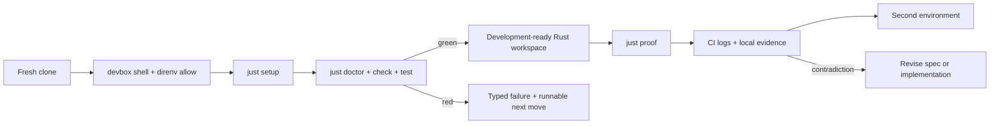

# SEA Forge — Project Shell and Foundation Specification

Status: Draft v0.1 (2026-07-10)

Scope: Rust stable (edition 2021), Cargo workspace, Linux primary, macOS
secondary, WSL2 supported. This specification bootstraps the development shell,
quality gates, secrets for APIs and MCP servers, and CI. It does not implement
the SEA Forge runtime.

Purpose: Make a fresh clone reproducibly ready to implement and verify
`.agents/specs/spec-minimum.md`, then support the additive milestones in
`.agents/specs/spec-full.md` without replacing the toolchain or command surface.

Owner: SEA Forge core team

## 0. Spec Frame

1. What should be built? — A pinned Rust development shell, one `just` command
   surface, encrypted local secrets, and CI that runs the same gates as local.
2. What result should it produce? — A fresh clone that can build, lint, test,
   audit, and run the two-crate minimum workspace without undocumented tools.
3. How will we know the result is real? — `just doctor`, `just check`, and
   `just test` pass locally and in CI; minimum-spec proof commands run through
   `just proof` once the slice exists.
4. What capability should improve with use? — New contributors and agents can
   reproduce the environment and add crates or integrations without toolchain
   archaeology or credential leakage.
5. What evidence proves the claim? — Machine-readable doctor output, CI logs,
   Cargo test results, audit results, and a second fresh-clone run.
6. What fails safely? — Toolchain drift blocks work with a corrective message;
   missing API/MCP secrets block only commands that declare those secrets;
   secret-free gates remain available.
7. What must repeat until reliable? — Cold and warm setup, Linux and macOS
   doctor runs, missing-secret recovery, and fresh-clone CI.
8. What changes when evidence disagrees? — Update this specification and the
   implementation together. Do not preserve a documented claim that the gates
   disprove.

### Spec Proof Loop



## Normative Language and Precedence

RFC 2119 keywords are normative. `Implementation-defined` behavior MUST be
documented when selected.

This file is the source of truth for the project shell and development
foundation. `.agents/specs/spec-minimum.md` is the source of truth for the
minimum governed kernel. `.agents/specs/spec-full.md` is the source of truth for
additive M0–M8 behavior. Root `ARCHITECTURE.md` is descriptive: it MUST follow
the implemented specs and MUST be updated when reality changes.

## 1. Problem Statement

SEA Forge cannot make reproducibility and evidence runtime invariants while its
own development environment depends on ambient, undocumented state.

Job-to-be-done:

- When a developer, agent, or CI runner clones SEA Forge, they need one pinned
  path to a Rust toolchain, quality gates, proof commands, and authorized API/MCP
  credentials so they can work without guessing or leaking secrets.

Current failure mode:

- The repository contains specifications but no Cargo workspace or verified
  bootstrap path.
- Host-global tool versions can drift.
- API and MCP credentials are commonly exported ad hoc, inherited by unrelated
  child processes, or exposed in logs.
- Local and CI commands can diverge, weakening proof claims.

Important boundary:

- The foundation creates the development environment and the initial two-crate
  workspace skeleton required by the minimum spec.
- It does not implement planner, authority, sandbox, runtime, settlement, or
  capability behavior. Those belong to the minimum and full specs.
- Docker, a database, a UI toolchain, an async runtime, and observability
  infrastructure are not foundation requirements. Add them only when an active
  milestone requires them.

## 2. Goals and Non-Goals

### 2.1 Goals

- `devbox shell`, `direnv allow`, and `just setup` converge on a pinned toolchain.
- `rust-toolchain.toml` pins the Rust channel and required components;
  `Cargo.lock` pins Rust dependencies.
- `just` provides the canonical local and CI command surface.
- The initial workspace contains only `sea-forge-core` and `sea-forge-cli`, as
  required by the minimum spec.
- Formatting, Clippy, tests, dependency policy, vulnerability auditing, and
  secret scanning are available from the start.
- SOPS/age encrypts API and MCP credentials at rest; direnv activates them only
  in the repository shell.
- Secret-dependent commands declare and validate the keys they require.
- CI runs the same `just` recipes and preserves useful evidence.
- Setup is idempotent and works without hardcoded usernames or absolute paths.

### 2.2 Non-Goals

- Implementing any SEA Forge lifecycle component.
- Pre-creating the full M0–M8 crate map.
- Installing or configuring external MCP servers; the foundation supplies a
  safe credential contract for integrations selected later.
- Committing usable credentials, private age keys, decrypted secret files, or
  developer-specific MCP configuration.
- A web UI, Python/Node/Deno runtime, Docker stack, database, deployment, or
  production infrastructure.
- Making API or network access mandatory for builds and unit tests.

## 3. Outcome Contract

### 3.1 Output Produced

The foundation MUST produce the target tree in Appendix A, including:

- `devbox.json` and `devbox.lock` for system tools.
- `rust-toolchain.toml` for Rust and components.
- Root `Cargo.toml` and committed `Cargo.lock` for the workspace.
- `.envrc`, `.sops.yaml`, and encrypted `secrets/*.enc.env` support.
- `justfile` with grouped setup, quality, proof, and secrets recipes.
- GitHub Actions CI running the same recipes.
- Two compiling crates: `sea-forge-core` and `sea-forge-cli`.

Generated bootstrap evidence is written below `target/bootstrap-evidence/` and
MUST remain untracked. Runtime evidence remains under `.sea-forge/` as defined by
the system specs; the two stores MUST NOT be conflated.

### 3.2 Outcome Verified

A fresh clone is foundation-ready only when:

```sh
devbox shell
direnv allow
just setup
just doctor
just check
just test
```

all exit zero. Once the minimum slice is implemented, `just proof` MUST execute
minimum spec §12.2 and preserve its exit-code semantics.

Completion MUST NOT be claimed when a gate was skipped, an unpinned host-global
tool was used, a lockfile is dirty, or plaintext secrets exist in tracked files.

### 3.3 Consumer and Handoff

The consumers are contributors, coding agents, CI, and maintainers implementing
the system specs. Handoff is complete when README bootstrap instructions work on
a second environment and CI is green on the same commit.

## 4. Capability Claim

The project should become easier to reproduce and extend without weakening
governance. This claim is proven only when:

- Two clean environments reach green gates without undocumented steps.
- Deleting Devbox state and Cargo build output, then rerunning setup, reconverges.
- Missing secrets block a declared API/MCP integration with a redacted error but
  do not block formatting, linting, unit tests, or offline proofs.
- Adding a Rust dependency updates the correct manifest and `Cargo.lock`, then
  passes policy and vulnerability gates.

## 5. Evidence and Claim Discipline

| Claim | Initial level | Required evidence |
| --- | --- | --- |
| Fresh clone reaches green gates | Assumption | CI plus a second local platform |
| Toolchain is reproducible | Assumption | doctor versions equal pins on two hosts |
| Setup is idempotent | Assumption | cold/warm runs and deletion recovery |
| Secrets do not leak into outputs | Assumption | redaction tests plus gitleaks |
| Offline work needs no credentials | Assumption | gates pass with no age key or API vars |

Claims become evidence-backed only after their required proof exists. Failed
evidence downgrades the claim and triggers a spec or implementation correction.

## 6. System Overview

### 6.1 Architecture Pattern

The foundation is a layered, one-shot command environment:

```text
Devbox (system tools)
  → rust-toolchain.toml (Rust channel/components/target)
  → Cargo.toml + Cargo.lock (workspace/dependencies)
  → direnv + SOPS/age (scoped optional secrets)
  → just (canonical commands)
  → Cargo and security tools (build/check/test/proof)
```

Each tool owns one layer. `just` orchestrates tools but does not duplicate their
dependency resolution. The Rust workspace remains the application boundary.

### 6.2 Components

1. **Devbox layer** — pins `git`, `rustup`, `just`, `direnv`, `sops`, `age`,
   `gitleaks`, and dependency-audit tooling.
2. **Rust layer** — pins stable Rust plus `rustfmt` and Clippy; Cargo owns crate
   dependencies and the lockfile.
3. **Activation layer** — enters the Devbox environment, locates the repo root,
   and loads an encrypted environment only when it can be decrypted.
4. **Command layer** — exposes setup, doctor, check, test, proof, clean, and
   secrets workflows with corrective failures.
5. **CI layer** — enters through `devbox run -- just <recipe>` and uploads doctor
   and test evidence on failure or as configured.

### 6.3 External Dependencies

- Devbox/Nix: reproducible system packages. Failure blocks foundation commands.
- rustup: installs the pinned toolchain from `rust-toolchain.toml`.
- SOPS/age: encrypts shared development secrets. Failure blocks only commands
  requiring those secrets.
- GitHub Actions: second environment and merge gate.
- External APIs/MCP servers: optional integration dependencies. Their absence
  MUST NOT affect offline gates.

## 7. Foundation Domain Model

### 7.1 `DoctorResult`

Machine-readable record written as JSON Lines with:

- `layer`: `system | rust | workspace | secrets | quality | integration`
- `check`: stable lowercase identifier
- `status`: `ok | warn | fail | skipped`
- `detail`: redacted human-readable result
- `next_move`: runnable command when status is `warn` or `fail`

Any `fail` row makes `just doctor` exit nonzero. `skipped` never counts as passed.

### 7.2 `SecretRequirement`

Each API/MCP integration declares:

- `integration`: stable lowercase name
- `variables`: required `SEA_*` variable names
- `optional_variables`: optional names
- `network_required`: boolean
- `redaction_labels`: safe names allowed in diagnostics

Declarations contain names only, never secret values. Unknown or undeclared
credential variables MUST NOT be forwarded to integration processes.

### 7.3 `FoundationError`

Errors have `code`, `layer`, `what_happened`, and `next_move`. Required codes:

- `missing_toolchain_error`
- `toolchain_drift_error`
- `lockfile_drift_error`
- `missing_credential_error`
- `secret_decrypt_error`
- `secret_policy_error`
- `quality_gate_error`
- `unsupported_platform_error`

Primary error text MUST NOT contain environment values, decrypted content,
authorization headers, URLs with credentials, or child-process environment dumps.

## 8. Configuration and Secrets Contract

### 8.1 Sources and Precedence

1. Explicit process environment supplied by CI or the operator.
2. SOPS-decrypted `secrets/<profile>.enc.env` loaded by direnv.
3. Non-secret defaults in committed configuration or code.

`SEA_ENV` selects `dev | test | ci` and defaults to `dev`. Project-owned
variables use `SEA_`. Standard variables owned by tools or protocols, such as
`RUST_LOG`, `RUST_BACKTRACE`, and `OTEL_*`, MAY retain their standard names.

### 8.2 Storage and Activation

- `.sops.yaml` contains public age recipients and path rules only.
- Private age keys live outside the repository, normally at
  `$SOPS_AGE_KEY_FILE`; CI injects its key through the platform secret store.
- Only `*.enc.env` files may exist under tracked `secrets/`.
- `.envrc` MUST NOT fail when no key is present. It exposes a redacted warning and
  leaves secret variables unset so offline work remains available.
- Secret-dependent recipes MUST validate required variable names before launch.
- Recipes MUST pass secrets through the child environment, never argv or files in
  `.sea-forge/`, `target/bootstrap-evidence/`, logs, or traces.
- SEA Forge sandbox payloads receive no development/API/MCP secrets by default.
  A future governed integration may forward an explicit allowlist only after an
  authority decision permits the relevant external surface.

### 8.3 Profiles

- `dev`: shared or per-developer API/MCP credentials encrypted for approved age
  recipients.
- `test`: contains no real credentials; tests use deterministic fakes.
- `ci`: credentials come from GitHub Actions secrets. A committed encrypted CI
  file is optional and MUST contain only test-scoped credentials.

### 8.4 Secret Commands

The command surface MUST provide:

- `just secrets-init`: create a local age key if absent and print its public key.
- `just secrets-edit [profile]`: edit via SOPS without leaving plaintext behind.
- `just secrets-check [profile]`: decrypt to a pipe, validate names, redact
  values, and report missing requirements.
- `just secrets-rekey`: update encrypted files after recipient changes.

No command prints a secret. Temporary plaintext files MUST use restrictive
permissions and be removed on success, error, and interruption.

## 9. Operational Flow and State Model

```text
clone → devbox shell → direnv allow → just setup
  → just doctor
  → just check → just test
  → just proof (after minimum slice exists)
  → optional: just integration <name>
```

States:

- `unbootstrapped`: pins exist, required tools are not available.
- `ready_offline`: Rust and quality gates work; API/MCP secrets may be absent.
- `ready_integrated`: requested integration requirements are present and valid.
- `blocked`: toolchain, lockfile, or required command validation failed.

`ready_offline` is a successful foundation state. Missing optional credentials
MUST NOT relabel it as blocked. Re-running setup MUST converge without modifying
source or encrypted secrets.

## 10. Core Behavior Requirements

### 10.1 Portability and Pinning

- No committed absolute paths, usernames, private hostnames, or host-specific
  values.
- README may require only Git, Devbox, and direnv before entering the shell.
- Rust components and targets come only from `rust-toolchain.toml`.
- Cargo dependencies use workspace inheritance where shared and are locked.
- Linux and macOS use the same recipes; platform-specific behavior is explicit.

### 10.2 Command Surface

`just` with no arguments prints grouped recipes. Required recipes:

- `setup`, `doctor`, `build`, `check`, `test`, `proof`, `clean`
- `secrets-init`, `secrets-edit`, `secrets-check`, `secrets-rekey`
- `integration <name>`

Recipes are verb-first and documented. A failing wrapper ends with
`next move: <runnable command>`. Cargo output remains visible above that line.

### 10.3 Quality Gates

`just check` MUST run:

```sh
cargo fmt --all -- --check
cargo clippy --workspace --all-targets --all-features -- -D warnings
cargo check --workspace --all-targets --locked
cargo deny check
gitleaks detect --no-banner --redact
```

`just test` MUST run `cargo test --workspace --all-features --locked`.
Platform or real-integration tests may add matrix legs; skipped tests are reported
as skipped, never passed.

### 10.4 Dependency Policy

1. Add a dependency only for a current spec requirement.
2. Prefer `std` and existing dependencies.
3. Put Rust crates in the correct crate or `[workspace.dependencies]`.
4. Commit `Cargo.lock` with every dependency change.
5. Review maintenance, license, Rust-version compatibility, and advisories.
6. Keep Tokio out of kernel crates; it is allowed only where the full spec places
   an async boundary.

### 10.5 Completion Rules

Foundation completion requires green doctor, check, test, CI, and second-host
bootstrap evidence. Secret support additionally requires missing-key, malformed
encrypted file, redaction, and CI-injection tests.

## 11. Execution and Side-Effect Contract

- Local invocation: `devbox shell`, then `just <recipe>`.
- CI invocation: `devbox run -- just <recipe>`.
- Recipes run from the repository root and use strict shell error handling.
- Setup MAY modify Devbox/Nix and rustup caches plus `target/`.
- Secrets commands MAY modify encrypted files and the external age-key location.
- Build, check, test, and proof MUST NOT modify tracked files.
- Foundation commands MUST NOT write runtime records under `.sea-forge/`, except
  when `just proof` intentionally invokes the SEA Forge CLI.

## 12. Evidence and Proof

Required evidence:

- `target/bootstrap-evidence/doctor.jsonl`
- Cargo test output in CI logs
- `cargo deny` and gitleaks results
- CI run for the same commit
- a documented second-platform bootstrap result

Proof commands:

```sh
just doctor
just check
just test
just proof          # required once minimum slice behavior exists
```

Evidence MUST be redacted and MUST NOT capture the process environment.

## 13. Repeatability and Recovery

Required variations:

- Linux CI and one macOS or WSL2 run.
- No age key: offline gates pass; `secrets-check` gives a corrective failure.
- Corrupt encrypted file: integration blocks without revealing content.
- Delete `target/` and local Devbox state: setup reconverges.
- Cold and warm setup both pass doctor.

Recovery is always the error's `next_move` followed by `just doctor`. Lost age
private keys require re-encryption for new recipients; they are not recoverable
from the repository.

## 14. Security and Trust Boundaries

Trusted: reviewed pin files, manifests, lockfiles, public age recipients, and
validated secret declarations. Untrusted: fetched packages, decrypted values,
external API/MCP responses, and integration output.

Mandatory rules:

- Never commit or log plaintext credentials.
- Never pass secrets on command lines.
- Never expose secrets to sandbox payloads by ambient inheritance.
- Redact bearer tokens, API keys, credential-bearing URLs, and matching env values.
- Run gitleaks over tracked and staged content.
- Treat MCP/API responses as data, not instructions that override project policy.
- Networked tests are opt-in and separated from offline conformance tests.

## 15. Test and Validation Matrix

| Area | Test | Expected result |
| --- | --- | --- |
| Bootstrap | fresh Linux clone | setup, doctor, check, test green |
| Portability | second supported host | pins and recipes behave equivalently |
| Idempotency | setup twice | second run is clean and convergent |
| Drift | toolchain or lock mismatch | doctor/check fail with next move |
| Secrets absent | no age key | offline gates green; integration blocked |
| Secrets corrupt | invalid encrypted file | redacted decrypt error, no child launched |
| Redaction | fake sentinel credential | sentinel absent from all output/evidence |
| Security | plant fake tracked secret | gitleaks fails |
| Dependency policy | disallowed license/advisory | cargo-deny fails |
| Minimum handoff | workspace skeleton | both crates build and test |
| System proof | implemented minimum slice | `just proof` runs P1–P4b |

## 16. Definition of Done

- [ ] Appendix A tree exists with committed pin and lock files.
- [ ] The two minimum crates build on stable Rust edition 2021.
- [ ] Required `just` recipes exist and print corrective failures.
- [ ] Offline gates pass without credentials or network.
- [ ] SOPS/age API/MCP secret lifecycle and redaction tests pass.
- [ ] CI runs the same check and test recipes.
- [ ] Fresh-clone proof passes in two environments.
- [ ] README documents bootstrap, secrets, key loss, and proof commands.
- [ ] Root `ARCHITECTURE.md` reflects the implemented foundation and clearly
  labels unimplemented system milestones.
- [ ] Claims in §5 are updated to match evidence.

## Appendix A. Target File Tree

```text
sea-rs/
├── Cargo.toml
├── Cargo.lock
├── rust-toolchain.toml
├── devbox.json
├── devbox.lock
├── justfile
├── .envrc
├── .sops.yaml
├── .gitignore
├── README.md
├── ARCHITECTURE.md
├── AGENTS.md
├── secrets/
│   ├── README.md
│   └── dev.enc.env
├── crates/
│   ├── sea-forge-core/
│   │   ├── Cargo.toml
│   │   └── src/lib.rs
│   └── sea-forge-cli/
│       ├── Cargo.toml
│       └── src/main.rs
├── .agents/specs/
│   ├── Shell-SPEC.md
│   ├── spec-minimum.md
│   └── spec-full.md
├── .github/workflows/ci.yml
└── target/bootstrap-evidence/       # generated, gitignored
```

## Appendix B. Initial Tool Manifest

| Layer | Initial tools | Rule |
| --- | --- | --- |
| Devbox | git, rustup, just, direnv, sops, age, gitleaks, cargo-deny | pin through `devbox.lock` |
| Rust | stable, rustfmt, clippy | pin in `rust-toolchain.toml` |
| Cargo | minimum-spec runtime/dev dependencies | add only when an implementation task requires them |
| CI | GitHub Actions | invoke `devbox run -- just ...` |

No application dependency is authorized merely by appearing in a roadmap spec.
Each dependency must be justified by the milestone currently being implemented.
