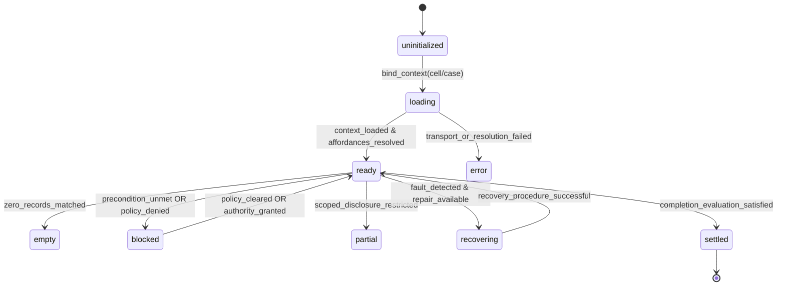

# Atomic UI Model — Renderer Handoff Specification

**Layer**: R4 (Atomic UI IR)  
**Upstream Authority**:
- R1 Interaction Domain Model: [interaction-model.sea](file:///home/sprime01/projects/sea-rs/.sea/interaction/interaction-model.sea)
- R2 Behavioral IR Contract: [contract.yaml](file:///home/sprime01/projects/sea-rs/.agents/specs/behavioral-interaction-proof/contract.yaml)
- R3 Sequential Proof & Catalog: [catalog.yaml](file:///home/sprime01/projects/sea-rs/.agents/specs/behavioral-interaction-proof/catalog.yaml), [proof-report.md](file:///home/sprime01/projects/sea-rs/.agents/specs/behavioral-interaction-proof/proof-report.md)
**Specification Root**: [.agents/specs/atomic-ui-model/](file:///home/sprime01/projects/sea-rs/.agents/specs/atomic-ui-model/)

---

## 1. Executive Summary & Purpose

This handoff specification bridges the verified **Behavioral Interaction Proof (R3)** and any target **Concrete Renderer (R5)** (such as OpenTUI terminal interfaces, Tauri/React desktop apps, or headless CLI environments).

The Atomic UI IR externalizes all interface responsibilities, primitive elements, spatial regions, persistent contexts, and state transitions into a **strictly renderer-neutral representation**. Concrete renderers retain total freedom over layout styling, component frameworks, animations, and typography, but **MUST NOT**:
1. Invent new domain semantics or business logic.
2. Enable or disable actions based on local UI heuristics (all availability must project from `behavioral_ir`).
3. Collapse or conceal critical governance distinctions (identity, provenance hashes, authority boundaries, settlement requirements, or sandbox isolation limits).
4. Omit required accessibility or text-alternative projections.

---

## 2. Deliverables & Directory Layout

All specifications for the Atomic UI Model reside exclusively in this directory:

```text
.agents/specs/atomic-ui-model/
├── atomic-ui-contract.yaml     # Composition levels, 23 primitives vocabulary, validation rules
├── projection-decisions.yaml   # Evaluations and rationale for projection pressures PP01–PP08
├── traceability.yaml           # Full forward and reverse matrix (UI <-> Behavioral <-> Domain)
├── handoff.md                  # This renderer implementation guide & acceptance criteria
└── views/                      # 12 canonical view IR specifications
    ├── cell_readiness_and_context.yaml        # CJ01: Establish Trusted Cell Context
    ├── lawful_affordance_discovery.yaml       # CJ02: Discover Lawful Affordances
    ├── semantic_model_workspace.yaml          # CJ03: Ground Work in Semantic Meaning
    ├── case_formation_and_preflight.yaml      # CJ04: Form Case and Preflight Plan
    ├── case_horizon_and_adaptation.yaml       # CJ05: Navigate Horizon and Adapt Plan
    ├── human_approval_inbox.yaml              # CJ06: Request and Record Human Approval
    ├── governed_execution_console.yaml        # CJ07: Execute Governed Capability
    ├── operational_monitor_and_recovery.yaml  # CJ08: Monitor and Recover Operation
    ├── settlement_and_audit_workbench.yaml    # CJ09: Settle Case and Audit Provenance
    ├── capability_and_memory_reuse.yaml       # CJ10: Promote Capability and Reuse Memory
    ├── artifact_maturity_pipeline.yaml        # CJ11: Advance Artifact Maturity Pipeline
    └── asset_transfer_and_federation.yaml     # CJ12: Transfer Asset Across Federation
```

---

## 3. Core Architectural Invariants

### 3.1 Affordance Projection Rule
UI actions project Behavioral IR affordances. An action button or command item in the UI must **never** become enabled simply because the user has filled in an input field or clicked an element.
- `availability: { source: behavioral_ir }` is mandatory for every action primitive.
- If an action is blocked in the underlying engine, the UI must render it in a disabled/blocked state and display the machine-readable `blocked_reason` (`missing_precondition`, `unauthorized`, `policy_prohibited`, `insufficient_evidence`, `no_settlement_access`).

### 3.2 Consequence and Commitment Rule
Every action in the IR carries a strict `consequence` rating:
- `consequential`: Causes irreversible side-effects, state mutations, cryptographic token spends, capability executions, or legal settlements.
  - **Renderer Obligation**: Must require explicit, non-bypassable operator commitment (e.g. secondary confirmation dialog, key-chord commitment, or explicit prompt review).
- `epistemic`: Read-only, diagnostic, informational, or exploratory inquiry (e.g. searching the catalog, viewing an event log, inspecting an attestation).
  - **Renderer Obligation**: May be executed directly with standard activation (click or enter).

### 3.3 Representation Test Rule
Richer primitives (`graph`, `timeline`, `comparison`, `table`, `inspector`) are **earned**, not assumed. Each view in `views/` only uses richer primitives where justified in `projection-decisions.yaml` (`PP01`–`PP08`). Renderers must preserve these representations or provide their explicitly documented accessible equivalents.

---

## 4. Primitive Translation Matrix

The 23 semantic primitives defined in `atomic-ui-contract.yaml` map to concrete platform elements across our target environments:

| Primitive | Semantic Meaning | Terminal Renderer (OpenTUI) | Desktop Renderer (Tauri + React 19) | CLI / Headless |
| :--- | :--- | :--- | :--- | :--- |
| `identity` | Stable, cryptographic entity ID | Rail label with dim hash prefix | Truncated chip with copy-hash button | Short SHA stdout with `@` prefix |
| `label` | Human-readable descriptor | Bold cyan/white text marker | Form label / typography caption | Uppercase key name |
| `value` | Bound data field content | Formatted terminal text string | Typography body text / code span | Key-value pair value |
| `status` | State indicator with glyph | Glyph marker: `[✓]`, `[!]`, `[x]`, `[·]` | Semantic badge with SVG icon + color | Plain text badge `[READY]`, `[ERR]` |
| `metric` | Quantitative measurement | Highlighted numeric meter / gauge | Progress bar / statistic card | Tabular number with unit |
| `message` | Validation or diagnostic string | Clack-style indented note rail | Alert / callout banner | STDERR or formatted line |
| `evidence_item`| Cryptographic proof receipt | Framed block with digest & signer | Expandable receipt card with signature check | Digest string with attestation link |
| `artifact_reference` | Pointer to immutable file/ledger | Underlined relative path / URI | File chip with preview modal trigger | Path string or URI |
| `action` | Affordance triggering operation | Highlighted select item / hotkey | Primary/Secondary button with commit gate | Subcommand or positional flag |
| `choice` | Selection among options | Interactive single/multi-select prompt | Radio group / Select dropdown / Combobox | Flag with enumeration arguments |
| `input` | Bounded text/parameter entry | Single-line terminal text prompt | Textbox / NumberInput with validator | Positional argument or stdin |
| `command` | Keyboard shortcut / accelerator | Keybinding badge (`[Ctrl+A]`, `[q]`) | Global shortcut hook / Command palette item| CLI alias or subcommand |
| `navigation` | Transition between views/phases | Rail link or step selector prompt | Tab bar / Breadcrumb navigation / Router | Positional subcommand navigation |
| `notification` | Operational alert / signal | Transient terminal message bar | Toast notification / Floating banner | STDERR warning line |
| `collection` | Comparative set of items | Paginated scroll list with rail cursor | Card grid / Virtualized list | Sequential item list with count |
| `tree` | Hierarchical directory/concept | Indented branch list (`├──`, `└──`) | Expandable tree-view component | Indented text dump |
| `table` | Multi-attribute entity matrix | Formatted ASCII/Unicode bordered table | Responsive data table with sorting/filtering| Tab-delimited table / TSV |
| `graph` | Topological DAG of dependencies | Indented topological tree or ASCII DAG | Force-directed SVG or React Flow DAG | DOT graph output or topological order |
| `timeline` | Monotonically ordered event stream | Vertical rail sequence with timestamps | Horizontal/Vertical milestone timeline | Chronological log lines with cursors |
| `progress` | Bounded execution step meter | Terminal progress bar (`[=====>  ] 60%`) | Linear/Circular progress component | Step counter `[3/5]` |
| `inspector` | Side-by-side detail drilldown | Split-screen pane or collapsed panel | Right drawer / Collapsible side pane | `--verbose` flag or inspect subcommand |
| `comparison` | Side-by-side operand diff | 2-column terminal split or unified diff | Side-by-side diff view with highlight | Unified diff format (`---` / `+++`) |
| `workspace` | Multi-region coordinated layout | Fullscreen TUI with focused window panes | Multi-pane grid with resizable docks | N/A (interactive command session) |
| `viewport` | Bounded scrollable buffer | Virtualized terminal buffer with pager | Scrollable container with auto-scroll lock | Paged output (`less` pipe) |

---

## 5. Platform-Specific Renderer Requirements

### 5.1 Terminal UI (OpenTUI / Clack-inspired)

1. **Visual Grammar & Rails**:
   - Every view must follow the Clack vertical rail pattern (`│`, `◇`, `◆`, `└`).
   - Use glyph shapes to communicate state before color (e.g. `◆` for active, `✓` for complete, `!` for blocked/warning, `✕` for error).
   - Collapse completed views into compact transcript summaries when advancing across canonical journeys.

2. **Terminal Dimensions & Responsive Adaptation**:
   - **40 columns (Narrow/Mobile)**:
     - Collapse 2-pane regions into vertical stacks.
     - Primitives like `comparison` must render as unified vertical diffs rather than side-by-side columns.
     - Truncate identity hashes to 8 characters with full view accessible via inspector.
   - **80 columns (Standard)**:
     - Standard 2-pane layout (e.g. Left: item list/table, Right: inspector/receipt).
     - Standard ASCII tables with up to 4 columns.
   - **160 columns (Wide/Operator)**:
     - Full 3-pane layout: Navigation/Header (persistent), Main Workspace (graph/table/comparison), and Live Context Inspector.

3. **Keyboard Interaction & Focus Invariants**:
   - **Navigation**: `j` / `k` or `Down` / `Up` for item cycling; `Tab` / `Shift+Tab` for region focus cycling.
   - **Action Activation**: `Enter` for epistemic actions; `Ctrl+Enter` or explicit confirmation prompt for consequential actions.
   - **Search / Filter**: `/` activates filter input in tables and collections; `Esc` clears filter or backs out of inspector.
   - **Quick Command**: Numbers `1`–`9` for instant affordance selection where indicated by `command` primitives.

---

### 5.2 Desktop GUI (Tauri 2 + React 19 / Workbench)

1. **3-Pane Coordinated Layout**:
   - **Header Region**: Persistent Cell and Case Identity (`PP01`), snapshot SHA-256, active readiness status, and actor attribution.
   - **Center Canvas**: Primary workspace for topological graphs (`PP04`), event timelines (`PP05`), or side-by-side comparison panels (`PP02`, `PP07`).
   - **Right Inspector Panel**: Persistent drawer for evidence receipts, cryptographic signatures, sandbox boundary specs (`PP06`), or bundle manifests (`PP08`).

2. **Graph Visualization (`graph` primitive)**:
   - When rendering case plan DAGs (CJ04/CJ05), nodes must visually reflect milestone states (pending, in-progress, satisfied, violated).
   - Edges must denote dependency relations and sentry gating conditions.
   - Must provide a toggle to a tabular/linear list view to satisfy accessibility obligations.

3. **Side-by-Side Comparison (`comparison` primitive)**:
   - In CJ09 (Settlement & Audit) and CJ11 (Maturity Pipeline), operands must be rendered synchronously side-by-side with synchronized scrolling and visual discrepancy highlights.

---

### 5.3 Headless CLI / REPL (`sea-forge-cli`)

1. **Semantic Subcommands**:
   - Views map directly to command namespaces: e.g. `sea case plan`, `sea approve`, `sea audit settle`.
   - Regions map to structured output flags: `--format=json`, `--format=table`, `--format=yaml`.
2. **Consequential Safety**:
   - Consequential actions require an explicit `--commit` or `--yes` flag when executed non-interactively; otherwise prompt interactively for confirmation.

---

## 6. View State Machine Implementation

Every view in `views/*.yaml` declares a lifecycle state model with conditions bound to backend state. Renderers must implement these 9 states without skipping intermediate governance checks:



### State Display Rules:
- **`loading`**: Display progress or skeleton rails; disable all actions to prevent race conditions.
- **`blocked`**: Action elements must remain visible but non-activatable, accompanied by an explicit message primitive detailing the exact `blocked_reason`.
- **`empty`**: Display a dedicated empty message with an available navigation affordance to return to discovery or creation.
- **`error`**: Display diagnostic error code, failing receipt hash, and available recovery affordances.
- **`settled`**: Render final immutable settlement receipt and seal all inputs against subsequent mutation.

---

## 7. Accessibility & Usability Obligations

Renderers must adhere to these non-negotiable accessibility standards:

1. **Non-Color State Indicators**:
   - Color may only be used for secondary emphasis. The primary indicator of status **must** be a textual label, glyph, or distinct geometric shape (e.g. green circle vs yellow triangle vs red octagon).
2. **Text Alternatives for Visualizations**:
   - Topological graphs (CJ04, CJ05) must include a keyboard-accessible tabular representation of nodes, dependencies, and sentry criteria.
   - Timelines (CJ08) must support keyboard navigation between chronological event items with full screen-reader descriptions.
3. **Deterministic Focus & Tab Order**:
   - Focus traversal must strictly follow reading order: Context Header → Main Workspace / Table → Action Panel → Inspector Drawer.
   - Modal dialogs and drawer inspectors must implement focus trapping and release focus back to the triggering element upon closure.
4. **Reduced Motion**:
   - Animations in graph layouts, transitions, or progress bars must be entirely disabled when `prefers-reduced-motion` is detected.

---

## 8. Behavioral Fidelity Acceptance Criteria

A concrete renderer implementation is accepted if and only if it passes all 12 criteria below:

- [ ] **AC-01 (Upstream Sourcing)**: All view action enablement states are bound directly to the Behavioral IR affordance stream; zero UI-local business rules exist.
- [ ] **AC-02 (Consequence Commitment)**: Every action marked `consequence: consequential` prompts the user for explicit confirmation or requires a deliberate key combination before dispatch.
- [ ] **AC-03 (Blocked Reason Transparency)**: When an affordance is unavailable, the UI displays the exact reason (`missing_precondition`, `unauthorized`, `policy_prohibited`, `insufficient_evidence`, `no_settlement_access`) without hiding the element.
- [ ] **AC-04 (Cryptographic Identity Visibility)**: Cell roots, case identifiers, snapshot hashes, and artifact digests are visible and traceable back to the domain model in every view (`PP01`).
- [ ] **AC-05 (Side-by-Side Settlement)**: CJ09 settlement view presents case criteria and observed run traces simultaneously; no sequential paging is required to verify criteria fulfillment (`PP02`).
- [ ] **AC-06 (Triageable Approval Inbox)**: CJ06 approval inbox allows sorting, filtering, and inspection of pending approvals by expiry time and risk classification (`PP03`).
- [ ] **AC-07 (Topological Dependency Rendering)**: CJ04 and CJ05 display plan structures as navigable DAGs with upstream sentries linked to downstream items (`PP04`), alongside accessible text alternatives.
- [ ] **AC-08 (Causal Event Stream)**: CJ08 displays event sequences ordered monotonically with event cursor tokens and failure diagnostics clearly linked (`PP05`).
- [ ] **AC-09 (Sandbox Boundary Visibility)**: CJ07 displays execution limits (timeout, network deny, filesystem chroot) simultaneously with live console outputs (`PP06`).
- [ ] **AC-10 (Artifact Promotion Verification)**: CJ11 renders source `.sea` model descriptors side-by-side with generated adapter outputs and predecessor transition tokens before promotion (`PP07`).
- [ ] **AC-11 (External Bundle Inspection)**: CJ12 exposes manifest entries, cryptographic signatures, and isolation bounds prior to admitting external federation assets (`PP08`).
- [ ] **AC-12 (Accessibility Conformance)**: All status states have non-color markers, focus order is deterministic, and keybindings are fully operational in headless and terminal modes.

---

## 9. Traceability Reference

For detailed element-level mappings back through the Behavioral IR and Interaction Domain Model, refer to:
- [traceability.yaml](file:///home/sprime01/projects/sea-rs/.agents/specs/atomic-ui-model/traceability.yaml)
- [projection-decisions.yaml](file:///home/sprime01/projects/sea-rs/.agents/specs/atomic-ui-model/projection-decisions.yaml)
- [atomic-ui-contract.yaml](file:///home/sprime01/projects/sea-rs/.agents/specs/atomic-ui-model/atomic-ui-contract.yaml)
