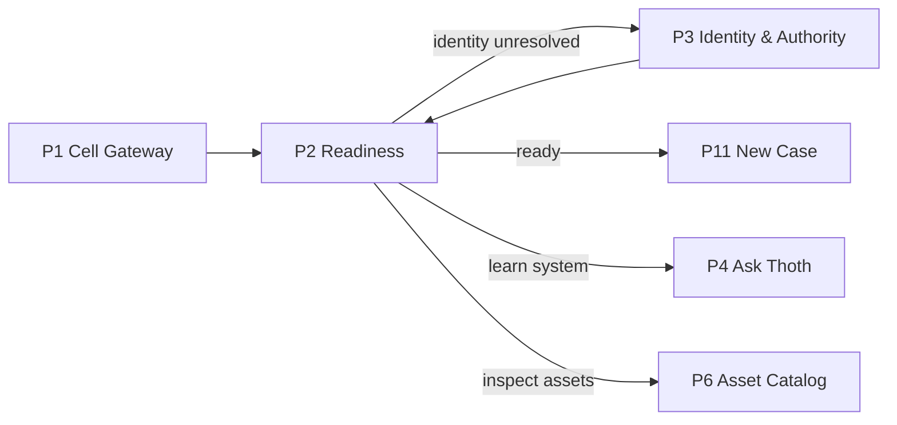
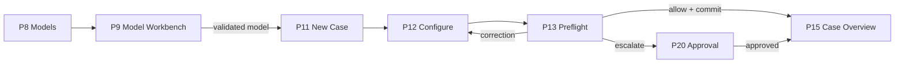
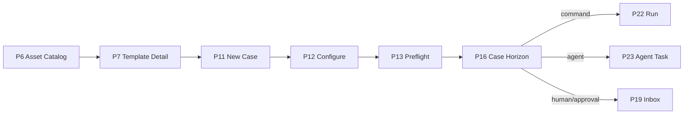
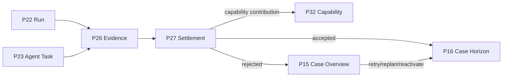
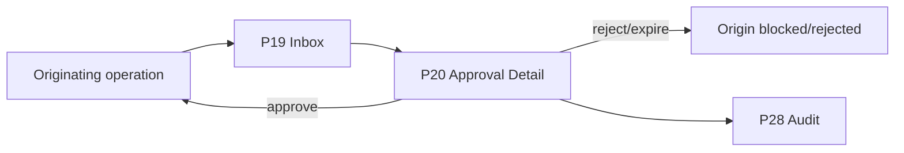
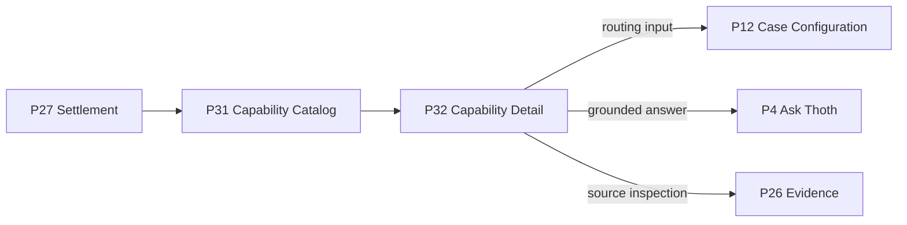
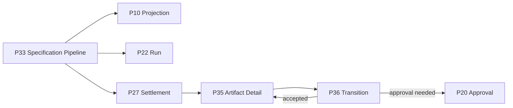
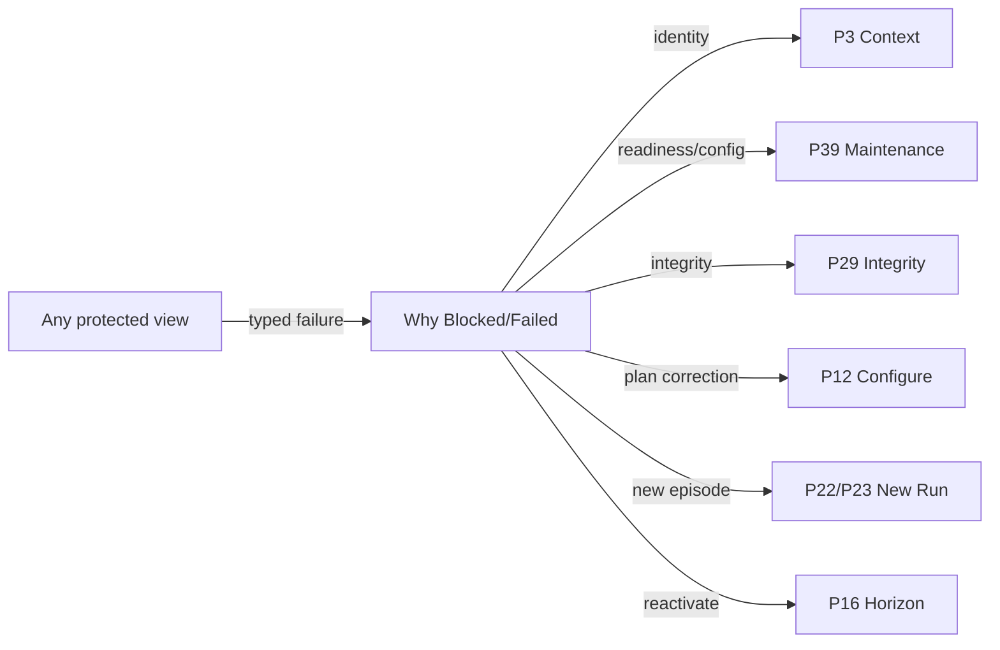

# SEA Forge GUI View Flow and Transition Specification

**Status:** Draft v0.1  
**Inputs:** SEA Forge Governed Workbench UX Epic v0.1 and SEA Forge GUI Atomic Design Breakdown v0.1  
**Purpose:** Sequence the GUI views as governed state transitions, defining what each view receives, what it may change, what it emits, and where the user can lawfully go next.  
**Boundary:** This is an interaction and information-flow specification. It does not prescribe a frontend framework, visual style, API transport, or database implementation.

---

## 0. Core sequencing law

A route transition is not automatically a system-state transition.

```text
View navigation
≠ authority decision
≠ side effect
≠ evidence
≠ settlement
```

A page may display, compose, or request a transition. Only an explicit protected operation, accepted system event, or settlement decision may change authoritative state.

The dominant lifecycle remains:

```text
meaning
→ plan
→ authority
→ execution
→ evidence
→ settlement
→ memory
→ capability
```

The GUI sequences this lifecycle without forcing every user to traverse every page. Experienced users may deep-link or use the command palette, but route guards and state invariants remain identical.

---

# 1. Transition vocabulary

## 1.1 Transition classes

| Class | Meaning | Examples |
|---|---|---|
| `N0 Navigate` | Read-only movement between views | Open case, inspect evidence |
| `M1 Draft` | Reversible, non-authoritative client/workspace draft | Edit case parameters, compose `.sea` |
| `M2 Propose` | Durable proposal with no execution privilege | External plan proposal, Thoth task proposal |
| `M3 Protected operation` | Authority-gated action that may create side effects or authoritative records | Commit case, run command, probe endpoint |
| `M4 Judgment` | Approval, settlement, promotion, or other decision with standing | Approve request, declare settlement |
| `M5 Projection/maintenance` | Rebuildable derived state or integrity/maintenance operation | Rebuild index, validate self-model |
| `E System event` | Event caused by execution or evaluator, not direct page navigation | Run finished, sentry activated |
| `R Recovery` | New governed path after failure; never an edit of failed history | Retry as new run, replan, reactivate |

## 1.2 Route guards

A page or action may require one or more guards:

| Guard | Requirement |
|---|---|
| `G1 Cell` | Active cell context resolves |
| `G2 Identity` | Attributable actor and role resolve |
| `G3 Sponsor` | Automated actor has eligible sponsor where required |
| `G4 Policy` | Applicable policy bundle is loaded and hash-addressed |
| `G5 Integrity` | Required ledger/model integrity is sufficient |
| `G6 Resource` | Requested record or asset exists and is visible |
| `G7 Disclosure` | Retrieval scope is permitted before data access |
| `G8 Compatibility` | Model/template/environment/extension/endpoint versions are compatible |
| `G9 Readiness` | Required subsystem is available or explicitly permitted in degraded mode |
| `G10 Standing` | Actor has approval, settlement, or promotion standing for the decision |

A failed guard does not redirect blindly. The user receives the failed guard, its evidence, and the nearest repair view.

## 1.3 Navigation memory

The shell must preserve:

- active cell;
- actor/role context;
- originating route and action;
- unsaved draft state;
- selected case/run/asset;
- density mode;
- evidence drawer context.

After a corrective detour—such as identity resolution or endpoint repair—the user returns to the original request and must re-run preflight if any governing digest changed.

## 1.4 Immutable-back rule

Browser Back or breadcrumb navigation changes the visible route only. It cannot undo:

- committed cases;
- authority decisions;
- approvals;
- executions;
- cancellations;
- settlements;
- imports;
- artifact transitions;
- administrative changes.

Reversal requires a new governed compensating operation.

---

# 2. Authoritative state machines

## 2.1 Cell and readiness

```text
unselected
→ selected
→ checking
→ ready | ready_degraded | blocked | integrity_halted
```

Explicit maintenance may move:

```text
ready
→ stale
→ validating/rebuilding
→ ready | ready_degraded | blocked
```

A failed rebuild preserves the last verified snapshot as stale; it does not replace it.

## 2.2 Case

```text
draft
→ committed
→ enabled/active/waiting/blocked/parked
→ completed | terminated
```

Non-linear transitions:

```text
completed/rejected stage
→ reactivated
→ active
```

The reducer derives case state from events. The GUI cannot set case state directly.

## 2.3 Run

```text
not_started
→ awaiting_authority
→ awaiting_approval | queued
→ waiting_for_capacity
→ preparing_environment
→ running/streaming
→ succeeded | failed | timed_out | cancelled | interrupted
→ evaluating
→ accepted | rejected | escalated | quarantined
```

Execution and settlement are two visible state tracks.

## 2.4 Approval

```text
pending
→ approved | rejected | expired
```

An approval may unblock an operation, but it cannot make the operation successful.

## 2.5 Thoth question

```text
draft
→ classified
→ disclosure_allowed | disclosure_denied
→ bounded_retrieval
→ answered | denied | internal_error
```

Disclosure decision precedes retrieval.

## 2.6 Artifact maturity

```text
cognitive
--synthesize--> intellectual
--productize--> product
--capitalize--> capital
```

Each edge requires a valid predecessor and stage gate. `derive` changes content/version; `promote` preserves bytes. Attestation is orthogonal.

## 2.7 Federation import

```text
selected
→ verifying
→ rejected/quarantined | imported_isolated
→ reviewed
→ adopted | remains_inert
```

Import never confers local authority or capability.

---

# 3. Global route architecture

```text
/cells
/cells/:cellId/
├── readiness
├── context
├── thoth
│   └── answers/:answerId
├── assets
│   └── :kind/:assetId
├── models
│   └── :modelId/workbench
├── projections/:projectionId
├── cases
│   ├── new
│   │   ├── configure
│   │   └── preflight
│   └── :caseId
│       ├── horizon
│       ├── timeline
│       ├── plan/:planVersion
│       ├── runs/:runId
│       ├── agent-runs/:runId
│       └── manage
├── inbox
├── approvals/:approvalId
├── tasks/:taskId
├── operations
├── evidence
├── settlements/:settlementId
├── audit
├── integrity
├── memory
├── capabilities
│   └── :capabilityId
├── pipelines/:pipelineId
├── artifacts
│   └── :artifactId
│       └── transition
├── federation
├── admin
└── maintenance
```

Record IDs, not display names, are canonical route keys. Friendly names may appear in breadcrumbs.

---

# 4. Primary end-to-end sequences

## 4.1 First-use sequence



Settlement target: a verified cell context and readiness result, not simply reaching the dashboard.

## 4.2 Domain-to-case sequence



## 4.3 Template-to-live-work sequence



## 4.4 Execution-to-settlement sequence



## 4.5 Approval sequence



The approval record resumes only the exact bounded request digest.

## 4.6 Settlement-to-capability sequence



## 4.7 Specification-to-artifact sequence



## 4.8 Failure and recovery sequence



---

# 5. Page transition summary

| Page | Primary input | Authoritative output | Common next views |
|---|---|---|---|
| P1 Cell Gateway | Existing cell path or ID | Active `CellContext` | P2 Readiness Overview. Optional P39 when a detected legacy workspace needs repair before migration. |
| P2 Readiness Overview | Cell context | `ReadinessViewModel`, current `SelfModelSnapshotRef`, blockers, limitations, and spendable next actions. | P3 for identity/authority correction; P4 Ask Thoth; P6 Asset Catalog; P11 New Case; P38 Administration; P39 Maintenance and Debt. |
| P3 Identity and Authority Context | Principal credentials already available to the host, requested actor identity, role, sponsor, case/resource context, optional proposed action. | `ActorContext`, `SponsorRef`, `RoleContext`, `PolicyBundleRef`, optional preflight verdict and boundaries. | Return to origin; common destinations P4, P11, P13, P20, P22, P23, P36, or P37. |
| P4 Ask Thoth | Question kind | `ThothQuestionRecord` | P5 answer detail; P7 target asset; P27 settlement; P29 integrity; P3 context correction; remain P4 for another question. |
| P5 Thoth Answer Detail | Answer ID | Verified answer presentation, replay comparison, exported typed record. | P4, P7, P26, P27, P28, P29. |
| P6 Asset Catalog | Asset type, search query, state, version, compatibility, source, and readiness filters. | Filtered asset collection and selected `AssetRef`. | P7 asset detail; return selected asset to P9/P12/P33/P38. |
| P7 Asset Detail | Asset kind and exact ID/version | Pinned `AssetRef`, readiness explanation, optional protected-operation request. | Return to origin, P12, P23, P31/P32, P38, P39. |
| P8 Domain Models | Search, namespace, version, validation state, source, stale/imported filters. | Selected `DomainModelRef` or creation/import intent. | P9 workbench, P10 projection detail, return to P12/P33. |
| P9 Domain Model Workbench | `.sea` source/files, registry/import configuration, metadata, target namespace/version, optional prior model for comparison. | Draft source | P8, P10, P12, P33. |
| P10 Projection Detail | Validated model/spec ref, target, adapter/version, parameters, optional rebuild request. | `ProjectionRecord`, output artifacts, validation report, rebuild comparison. | P9, P26, P33, P35, origin consumer. |
| P11 New Case | Entry mode: intent, template, external plan, ADLC, ODI-ADLC, sequential agents, concurrent agents, or specification pipeline | `CaseDraft` skeleton and route state for P12. | P12. P6/P8 may be opened as selectors without losing draft. |
| P12 Case Configuration | Template parameters, intent, domain model, environments, evaluators, agent endpoints, limits, criteria, origin refs, owners, stages/options allowed by source. | Fully instantiated but uncommitted `CasePlanDraft`, validation issues, estimated authority/payment burden. | P13; selectors P6/P7/P8/P9; back to P11. |
| P13 Case Preflight | Complete draft, actor context, exact model/template/environment/endpoint/policy/configuration snapshots. | Committed `Case`, `CasePlan`, criteria records, origin links, initial case events | P15/P16 on committed case; P20 on pending approval; P12 on correction; P3 for context correction. |
| P14 Cases | Search, state, owner, actor, template, outcome, date, blocked/approval/settlement filters. | Selected `CaseRef`, filtered collection. | P15 or P11. |
| P15 Case Overview | Case ID | Case summary and selected action request. | P16, P17, P18, P20/P21, P22/P23, P24, P27, P30. |
| P16 Case Horizon | Case ID | Current `AffordanceSet`, selected item/action, activation or mutation request. | P18, P20, P21, P22, P23, P24, P27. |
| P17 Case Timeline | Case ID | Filtered timeline and record navigation. | P18, P20, P22, P23, P27, P28, P29. |
| P18 Plan Detail | Case and plan version | Verified plan view, diff, optional `ReplanProposal` draft. | P12/P13 in replan mode, P9, P7, P16, P27. |
| P19 Approval and Human Task Inbox | Queue type, assignment, case, risk, age, expiry, action surface, state filters. | Selected approval or task ref. | P20 or P21. |
| P20 Approval Detail | Approval ID | `ApprovalDecision` | Origin P13/P16/P22/P23/P24/P36/P37; P28 audit. |
| P21 Human Task Detail | Task instructions, required fields, evidence files/refs, decision or completion note. | Human task completion/rejection event and evidence refs. | P16/P15, P27, next activated item. |
| P22 Run Detail | Run ID | Live execution view, `ExecutionResult`, evidence/artifacts, settlement handoff. | P25, P26, P27, P16, new P22 for retry. |
| P23 Agent Task Detail | Run ID | Dialogue/termination state, transcript evidence, artifacts/proofs, settlement handoff. | P20 for permission, P25, P26, P27, P16, new P23 for retry. |
| P24 Thoth Manager | Case ID, maximum iterations, optional permitted proposal catalog/template scope. | Manager iteration record, classification, proposed agent task or stop/park/escalation. | P20 if approval, P16/P18 for proposal, P23 after activation, P15 when satisfied/parked. |
| P25 Operations Monitor | Case/run/actor/state/event/severity filters | Live operational view and selected control request. | P15/P16/P20/P22/P23/P27/P39. |
| P26 Evidence Explorer | Case, run, criterion, type, producer, artifact, hash, date, verification, disclosure filters. | Evidence collection, verification result, selected evidence ref. | P22/P23/P27/P29/P35. |
| P27 Settlement Detail | Settlement ID | Terminal or pending settlement view | P26, P15/P16, P31/P32, P28. |
| P28 Audit History | Actor, action, resource, case, policy, disposition, event class, date, disclosure/agent/approval filters. | Filtered audit trail and selected record. | P5/P20/P22/P23/P29/P37. |
| P29 Integrity and Ledger | Verification scope, stream, checkpoint pair, record ID, proof action. | Integrity report, inclusion/consistency proof, assurance state, affected-operation list. | P2, P28, P39, originating record. |
| P30 Memory Recall | Query, kind, entity/process/session scope, result filters, limit, optional destination case/plan. | Recall result, selected `MemoryItemRef`s, recall evidence, influence link if attached. | P15/P18/P12, P26, P32. |
| P31 Capability Catalog | Search, state, operation, environment, variation, reliability, regression, routing-ready filters. | Selected `CapabilityRef`, filtered catalog. | P32, return to P12/P16/P4. |
| P32 Capability Detail | Capability ID and optional comparison policy/version. | Capability assessment, promotion explanation, optional routing preflight. | P27/P26/P4/P11/P12/P31. |
| P33 Specification Pipeline | Pipeline/case ID | Stage outputs, projection/contracts/code artifacts, last-mile tasks, acceptance settlement. | P9/P10/P16/P18/P22/P23/P27/P35. |
| P34 Artifact Catalog | Type, maturity, lifecycle, owner, license, source case, attestation, review, date filters. | Selected `ArtifactRef`. | P35, P36, P37. |
| P35 Artifact Detail | Artifact/version ID. | Artifact assessment and optional transition draft. | P36, P26, P27, P33, P37. |
| P36 Artifact Transition | Target transition, derive/promote mode, gate profile, evidence, semantic anchors, ownership/license/review/attestation/reuse/value refs. | Transition request, pending approval, rejected gate report, or `TransitionToken` and target artifact/version. | P20 if approval, P35 target/source detail, P34. |
| P37 Federation Bundles | Export selection or import bundle | Export bundle, import verification report, isolated records/assets, adoption request/decision. | P20 for adoption approval, P7/P35 imported detail, P28/P29 audit, P38. |
| P38 Administration | Selected subsystem: extensions, endpoints, models, environments, policies, server, versions. | Administrative operation request/result and updated derived readiness. | P2, P7, P9, P29, P39. |
| P39 Maintenance and Debt | Debt type filters | Repair action request/result, updated readiness, unresolved debt list. | P2, P22/P23, P20, P29, P38, originating page. |

---

# 6. View contracts

Each contract below follows the same structure so it can later be projected into route guards, frontend state machines, API commands/queries, tests, and analytics.


## P1 — Cell Gateway

**Route:** `/cells`  
**Template:** Workbench / gateway  
**Mutation class:** M3 on create or migrate; M0 on open

### Entry conditions
Application launch without an active cell, explicit cell switch, or deep link whose cell context cannot be resolved.

### Inputs
Existing cell path or ID; new-cell name and root; optional migration source; optional server connection target.

### System reads
Known/recent cells, filesystem accessibility, detected workspace version, migration compatibility, server reachability.

### User decisions and actions
Open a cell; create a cell; preview migration; reconnect to a server; cancel and exit.

### System decisions
Resolve whether the target is new, current, legacy-compatible, incompatible, or unavailable. Never initialize over governed history.

### Outputs
Active `CellContext`; initialization or migration preview; readiness-check request.

### Authoritative mutations
Create cell identity and initial records only after confirmation and authority; migrate by appending migration genesis/compatibility records, never rewriting source history.

### Evidence produced or exposed
Cell initialization or migration record, configuration snapshot, source-version and target-version digests.

### Settlement condition
Cell establishment settles when required root structures, identity, ledger genesis, bundled-model references, and configuration are verifiably present.

### Primary transitions
P2 Readiness Overview. Optional P39 when a detected legacy workspace needs repair before migration.

### Failure and recovery transitions
Remain on P1 with typed path, permission, compatibility, integrity, or connection failure. Offer another path, migration report, or repair route; never partially activate the cell.


## P2 — Readiness Overview

**Route:** `/cells/:cellId/readiness`  
**Template:** Guided explanation / operations  
**Mutation class:** M0 by default; M5 for explicit validate, rebuild, or probe

### Entry conditions
An active cell has been selected or created.

### Inputs
Cell context; optional requested readiness scope such as self-model, policy, ledger, extensions, environments, endpoints, or server.

### System reads
Genesis self-model status, current snapshot, identity resolution, policy bundle, ledger integrity, extension registry, environment contracts, toolchain probes, server status, operational debt.

### User decisions and actions
Validate; rebuild self-model; rerun probes; inspect a degraded item; continue to work; open administration or maintenance.

### System decisions
Classify the installation as ready, ready-with-degradation, blocked, or integrity-halted. Determine which planned operations are affected rather than using one undifferentiated health flag.

### Outputs
`ReadinessViewModel`, current `SelfModelSnapshotRef`, blockers, limitations, and spendable next actions.

### Authoritative mutations
Explicit validation, rebuild, probe, or server-start operations append their own records and may replace only derived/current pointers after verification.

### Evidence produced or exposed
Validation results, probe evidence, snapshot hashes, policy load record, ledger verification result, extension/environment descriptors.

### Settlement condition
A readiness check settles when each checked subsystem has a typed result and evidence. “Ready” is not allowed when a required integrity or authority dependency is unresolved.

### Primary transitions
P3 for identity/authority correction; P4 Ask Thoth; P6 Asset Catalog; P11 New Case; P38 Administration; P39 Maintenance and Debt.

### Failure and recovery transitions
A failed check stays visible with prior last-known-good state preserved. Integrity failure routes to P29/P39; self-model failure disables Thoth and routes to repair; missing identity routes to P3.


## P3 — Identity and Authority Context

**Route:** `/cells/:cellId/context`  
**Template:** Decision / context  
**Mutation class:** M3 for sponsorship or protected role binding; M0 for inspection

### Entry conditions
Readiness identifies unresolved identity, the user opens context explicitly, or a protected action needs a preflight.

### Inputs
Principal credentials already available to the host, requested actor identity, role, sponsor, case/resource context, optional proposed action.

### System reads
Identity bindings, eligible sponsors, role memberships, policy bundle, active cell, case context, applicable authority surfaces.

### User decisions and actions
Select role; request or establish sponsorship; inspect policy; run authority preflight; return to the originating action.

### System decisions
Resolve actor type, accountable sponsor, eligible role, and exact context. Detect conflicts and deny ambiguous fallback.

### Outputs
`ActorContext`, `SponsorRef`, `RoleContext`, `PolicyBundleRef`, optional preflight verdict and boundaries.

### Authoritative mutations
New sponsorship or binding records only through protected operations. Role selection may be session context but must be recorded in subsequent requests.

### Evidence produced or exposed
Identity-resolution audit, sponsorship decision, policy digest, preflight authority decision.

### Settlement condition
Identity establishment settles when one attributable actor context can be used deterministically. A preflight settles as allow, deny, or escalate but confers no execution authority beyond its declared scope/time.

### Primary transitions
Return to origin; common destinations P4, P11, P13, P20, P22, P23, P36, or P37.

### Failure and recovery transitions
Remain on P3 for unresolved/conflicting identity. Denial shows the unavailable role or sponsor condition; escalation links to P19/P20 if an approval record is created.


## P4 — Ask Thoth

**Route:** `/cells/:cellId/thoth`  
**Template:** Guided explanation / workbench  
**Mutation class:** M3 protected disclosure question

### Entry conditions
Active cell, resolved actor context, valid non-stale self-model snapshot, and permission to submit at least one typed question class.

### Inputs
Question kind; capability/operation/projection/environment/failure target; case/resource context; optional permitted historical snapshot.

### System reads
Current disclosure policy, self-model snapshot, bounded graph regions, capability/settlement/evidence records permitted for the question.

### User decisions and actions
Choose a typed question; select target; preview disclosure context; submit; open prior answers.

### System decisions
Classify question, make disclosure decision before retrieval, compile bounded semantic query, produce grounded claims or governed denial.

### Outputs
`ThothQuestionRecord`; `ThothAnswer` or disclosure denial; answer history entry.

### Authoritative mutations
Append question, disclosure decision, bounded query-plan digest, answer/denial, and evidence links. No canonical self-model mutation.

### Evidence produced or exposed
Snapshot ref, policy decision, claim evidence refs, settlement refs, omitted claim classes, answer hash.

### Settlement condition
Question settles as answered or denied. Internal failure is distinct and does not produce a fabricated answer.

### Primary transitions
P5 answer detail; P7 target asset; P27 settlement; P29 integrity; P3 context correction; remain P4 for another question.

### Failure and recovery transitions
Stale/invalid snapshot routes to P2/P39. Disclosure denial remains a successful governed outcome. Unsupported question kind remains P4 with available typed alternatives.


## P5 — Thoth Answer Detail

**Route:** `/cells/:cellId/thoth/answers/:answerId`  
**Template:** Record detail / audit  
**Mutation class:** M0; M5 for explicit replay verification

### Entry conditions
A Thoth answer or denial record exists and is visible to the actor.

### Inputs
Answer ID; optional replay request against the same snapshot/policy state.

### System reads
Question, disclosure decision, bounded query digest, claims, evidence, settlement refs, snapshot, omissions, limitations.

### User decisions and actions
Inspect claim evidence; replay; compare answer; open target records; export machine-readable answer; ask another question.

### System decisions
Verify answer linkage and optional deterministic replay. Preserve restricted omissions.

### Outputs
Verified answer presentation, replay comparison, exported typed record.

### Authoritative mutations
Replay creates a new verification/audit record but does not rewrite the original answer.

### Evidence produced or exposed
Answer hash, replay result, source-record verification, disclosure audit.

### Settlement condition
Replay settles when equality or explained non-equivalence is established from exact snapshot/policy inputs.

### Primary transitions
P4, P7, P26, P27, P28, P29.

### Failure and recovery transitions
Hash mismatch or missing source records routes to P29/P39. A denied claim cannot be opened through evidence navigation.


## P6 — Asset Catalog

**Route:** `/cells/:cellId/assets`  
**Template:** Catalog  
**Mutation class:** M0

### Entry conditions
Active cell; actor has catalog visibility.

### Inputs
Asset type, search query, state, version, compatibility, source, and readiness filters.

### System reads
Template, environment, extension, endpoint, capability, projection, and optional artifact descriptors plus derived readiness.

### User decisions and actions
Search; filter; compare; select; choose an eligible asset for an originating workflow.

### System decisions
Distinguish declared from installed/available/validated/demonstrated and compute unusability reasons without promoting claims.

### Outputs
Filtered asset collection and selected `AssetRef`.

### Authoritative mutations
None. Probe, adoption, installation, or rebuild are separate explicit operations.

### Evidence produced or exposed
Source descriptors, current snapshot, probe/capability/projection refs, freshness.

### Settlement condition
Not applicable to browsing. Any displayed readiness state must be traceable to settled/verified source records.

### Primary transitions
P7 asset detail; return selected asset to P9/P12/P33/P38.

### Failure and recovery transitions
Projection/index failure falls back to authoritative scan with degraded performance. Unauthorized asset classes are omitted before retrieval.


## P7 — Asset Detail

**Route:** `/cells/:cellId/assets/:kind/:assetId`  
**Template:** Record detail  
**Mutation class:** M0; M3/M5 for probe, activate, adopt, or rebuild

### Entry conditions
A visible asset has been selected or deep-linked.

### Inputs
Asset kind and exact ID/version; optional originating workflow.

### System reads
Descriptor, source, compatibility, dependencies, state ladder, evidence, limitations, consumers, configuration digest.

### User decisions and actions
Select for use; probe endpoint; inspect evidence; activate/disable where authorized; open administration; compare versions.

### System decisions
Determine actual usability in the current cell and originating context.

### Outputs
Pinned `AssetRef`, readiness explanation, optional protected-operation request.

### Authoritative mutations
Probe/activate/disable/adopt actions append governed decisions and result records; selection alone is non-mutating.

### Evidence produced or exposed
Descriptor hash, probe evidence, extension registry event, capability records, projection record.

### Settlement condition
Asset operation settles according to its operation-specific criteria; catalog selection itself does not.

### Primary transitions
Return to origin, P12, P23, P31/P32, P38, P39.

### Failure and recovery transitions
Incompatible or unavailable assets remain inspectable but non-selectable with explicit missing affordances.


## P8 — Domain Models

**Route:** `/cells/:cellId/models`  
**Template:** Catalog  
**Mutation class:** M0

### Entry conditions
Active cell and permission to view domain models.

### Inputs
Search, namespace, version, validation state, source, stale/imported filters.

### System reads
Domain model descriptors, source hashes, import graph summary, validation and projection status.

### User decisions and actions
Open model; create/import source; compare versions; choose model for case or projection.

### System decisions
Classify model as valid, invalid, stale, imported, superseded, or quarantined.

### Outputs
Selected `DomainModelRef` or creation/import intent.

### Authoritative mutations
None until source is submitted or an import/adoption action occurs.

### Evidence produced or exposed
Validation refs, source digests, adapter/DomainForge versions.

### Settlement condition
Browsing has no settlement; model state must derive from completed validation records.

### Primary transitions
P9 workbench, P10 projection detail, return to P12/P33.

### Failure and recovery transitions
Missing derived index falls back to source model registry. Invalid models remain inspectable and cannot be bound to new execution.


## P9 — Domain Model Workbench

**Route:** `/cells/:cellId/models/:modelId/workbench`  
**Template:** Workbench  
**Mutation class:** M1 draft; M3/M5 on submit, validate, pin, or project

### Entry conditions
Create/edit/import intent or selection of an existing model version.

### Inputs
`.sea` source/files, registry/import configuration, metadata, target namespace/version, optional prior model for comparison.

### System reads
Parser/validator capabilities, import registry, existing concept IDs, active DomainForge adapter/version, referenced source model.

### User decisions and actions
Edit/select source; resolve imports; validate; inspect concepts; compare drift; pin version; launch projection.

### System decisions
Parse, construct semantic graph, validate references/policies/units/imports, compute source digest, detect drift and ambiguity.

### Outputs
Draft source; `ValidationResult`; validated `DomainModelRef`; concept index; drift report; projection request.

### Authoritative mutations
Draft state is local/recoverable. Accepted model/version and validation records are appended only after explicit submit. Existing model identity is never silently replaced.

### Evidence produced or exposed
Source hashes, validation violations, import resolutions, adapter/version, graph digest.

### Settlement condition
Model validation settles when parsing, graph construction, semantic checks, and required imports complete with typed results. Validity is not inferred from parse success alone.

### Primary transitions
P8, P10, P12, P33.

### Failure and recovery transitions
Remain P9 with exact syntax/semantic/import/projection layer errors. Previously valid version remains usable unless explicitly deprecated/quarantined.


## P10 — Projection Detail

**Route:** `/cells/:cellId/projections/:projectionId`  
**Template:** Record detail / pipeline  
**Mutation class:** M5 on create or rebuild

### Entry conditions
Projection request created from P9/P33 or existing projection opened.

### Inputs
Validated model/spec ref, target, adapter/version, parameters, optional rebuild request.

### System reads
Source record, target limitations, adapter descriptor, prior projection record and output artifacts.

### User decisions and actions
Review limitations; run/rebuild; verify output; inspect/quarantine failures; use output downstream.

### System decisions
Authorize projection, invoke deterministic adapter, validate output, calculate hashes, compare rebuild.

### Outputs
`ProjectionRecord`, output artifacts, validation report, rebuild comparison.

### Authoritative mutations
Append projection and evidence records; update derived current pointer only after successful verification.

### Evidence produced or exposed
Source hash, adapter/version, parameters, output hash, validation and execution evidence.

### Settlement condition
Accepted when declared projection/output criteria pass; rejected/quarantined when mapping or output verification fails.

### Primary transitions
P9, P26, P33, P35, origin consumer.

### Failure and recovery transitions
Quarantine invalid output and retain prior valid projection. Missing target toolchain routes to P2/P7/P39.


## P11 — New Case

**Route:** `/cells/:cellId/cases/new`  
**Template:** Workbench entry  
**Mutation class:** M1 draft only

### Entry conditions
User selects New Case from global navigation, a template/model/capability proposes a new case, or a deep link carries an entry source.

### Inputs
Entry mode: intent, template, external plan, ADLC, ODI-ADLC, sequential agents, concurrent agents, or specification pipeline; optional preselected assets.

### System reads
Eligible templates, models, environments, endpoints, actor context, current readiness and capability state.

### User decisions and actions
Choose entry mode; select source; provide initial purpose/desired outcome; continue or cancel.

### System decisions
Determine required configuration sections and whether the chosen source is usable.

### Outputs
`CaseDraft` skeleton and route state for P12.

### Authoritative mutations
Local draft only; no case ID with authoritative standing until commit.

### Evidence produced or exposed
None beyond optional draft telemetry; no governance claim.

### Settlement condition
Not applicable.

### Primary transitions
P12. P6/P8 may be opened as selectors without losing draft.

### Failure and recovery transitions
Remain P11 with unavailable source explanation. Preserve draft when identity/readiness correction routes to P2/P3.


## P12 — Case Configuration

**Route:** `/cells/:cellId/cases/new/configure`  
**Template:** Workbench  
**Mutation class:** M1 draft

### Entry conditions
A `CaseDraft` exists with chosen entry source.

### Inputs
Template parameters, intent, domain model, environments, evaluators, agent endpoints, limits, criteria, origin refs, owners, stages/options allowed by source.

### System reads
Asset details, semantic concept index, authority preflight data, capability records, compatibility constraints.

### User decisions and actions
Configure; add/remove allowed plan items; bind criteria/origins; select delegates; save draft; continue to preflight.

### System decisions
Validate field types, semantic refs, template expansion, environment compatibility, delegation bounds, criteria completeness, and obvious unsatisfiable dependencies.

### Outputs
Fully instantiated but uncommitted `CasePlanDraft`, validation issues, estimated authority/payment burden.

### Authoritative mutations
Draft revisions only. No execution or authoritative plan mutation.

### Evidence produced or exposed
Draft validation diagnostics; no durable settlement evidence unless user explicitly stores a governed proposal artifact.

### Settlement condition
Configuration is complete when all required fields resolve; this is not case settlement.

### Primary transitions
P13; selectors P6/P7/P8/P9; back to P11.

### Failure and recovery transitions
Stay P12 and localize issue to parameter, semantic ref, environment, agent, criterion, or topology. Do not defer detectable errors to execution.


## P13 — Case Preflight

**Route:** `/cells/:cellId/cases/new/preflight`  
**Template:** Decision / review  
**Mutation class:** M3 on commit

### Entry conditions
CasePlanDraft passes configuration validation.

### Inputs
Complete draft, actor context, exact model/template/environment/endpoint/policy/configuration snapshots.

### System reads
Authority evaluators, readiness, capability requirements, sentry satisfiability, criteria provenance, SoD constraints.

### User decisions and actions
Review plan; inspect blockers; return to edit; request approvals where pre-authorization is supported; commit case.

### System decisions
Compile immutable plan and criteria hashes, evaluate creation/activation authority, identify escalations, and ensure no stale dependency changed since P12.

### Outputs
Committed `Case`, `CasePlan`, criteria records, origin links, initial case events; or denial/escalation report.

### Authoritative mutations
On allow, append canonical case/plan/criteria/events. On denial, append decision but no case activation. On escalation, append pending approval and park commit request.

### Evidence produced or exposed
Authority decisions, configuration snapshots, hashes, validation and preflight evidence.

### Settlement condition
Case creation settles when the committed records verify and initial case state is deterministically reduced. Denial/escalation are also governed outcomes.

### Primary transitions
P15/P16 on committed case; P20 on pending approval; P12 on correction; P3 for context correction.

### Failure and recovery transitions
No partial case. Hash drift returns P12/P13 with changed dependency; integrity failure routes P29/P39.


## P14 — Cases

**Route:** `/cells/:cellId/cases`  
**Template:** Catalog  
**Mutation class:** M0

### Entry conditions
Active cell and case visibility.

### Inputs
Search, state, owner, actor, template, outcome, date, blocked/approval/settlement filters.

### System reads
Case records and rebuildable summaries from ledger events.

### User decisions and actions
Open case; create new; inspect blocked/active/recent; switch density.

### System decisions
Build current case state from authoritative events, not mutable status fields.

### Outputs
Selected `CaseRef`, filtered collection.

### Authoritative mutations
None.

### Evidence produced or exposed
Source case/event refs and projection freshness.

### Settlement condition
Not applicable.

### Primary transitions
P15 or P11.

### Failure and recovery transitions
If case projection is stale/missing, rebuild or authoritative scan; integrity issues route P29.


## P15 — Case Overview

**Route:** `/cells/:cellId/cases/:caseId`  
**Template:** Record detail / operational hub  
**Mutation class:** M0; M3 via explicit actions

### Entry conditions
Existing visible case.

### Inputs
Case ID; optional anchor to item, milestone, approval, run, or settlement.

### System reads
Case plan, current reducer state, desired outcome, milestones, open approvals, active/blocked items, latest settlements, capability/memory effects.

### User decisions and actions
Open horizon/timeline/plan; add discretionary item; replan; reopen/terminate; invoke Thoth manager; inspect evidence.

### System decisions
Compute current affordances and explain why each primary action is or is not available.

### Outputs
Case summary and selected action request.

### Authoritative mutations
Only explicit add/replan/reopen/terminate/manage actions append events and authority records.

### Evidence produced or exposed
Current-state source events, plan version, latest settlement and milestone refs.

### Settlement condition
Case completion display requires case completion conditions and accepted settlement/milestone facts; page view itself has none.

### Primary transitions
P16, P17, P18, P20/P21, P22/P23, P24, P27, P30.

### Failure and recovery transitions
Reducer inconsistency or missing records routes P29/P39. Blocked state exposes P16 and Why Blocked rather than generic failure.


## P16 — Case Horizon

**Route:** `/cells/:cellId/cases/:caseId/horizon`  
**Template:** Live operations / board  
**Mutation class:** M0; M3 via item activation/mutation/control

### Entry conditions
Existing case with readable plan and state.

### Inputs
Case ID; filters by stage, state, actor, item kind; optional selected plan item.

### System reads
Plan, sentries, case events, approvals, capability/environment availability, concurrency, settlements.

### User decisions and actions
Inspect item; start enabled work when user initiation is required; add discretionary item; resolve blocker; open run/approval/human task; cancel active run.

### System decisions
Classify items into spendable now, active, awaiting authority/approval, blocked, future, and settled. Evaluate sentries from events, never drag-and-drop status mutation.

### Outputs
Current `AffordanceSet`, selected item/action, activation or mutation request.

### Authoritative mutations
Activation, cancellation, discretionary addition, or replan append governed events. Merely moving a card visually is prohibited.

### Evidence produced or exposed
Sentry evaluation, authority decision, activation event, blocker explanation.

### Settlement condition
Item state changes settle through the corresponding operation/run/human task and reducer event, not board interaction alone.

### Primary transitions
P18, P20, P21, P22, P23, P24, P27.

### Failure and recovery transitions
Unsatisfiable or stale plan routes P18/replan. Capacity wait remains visible. Authority denial leaves item blocked with exact path.


## P17 — Case Timeline

**Route:** `/cells/:cellId/cases/:caseId/timeline`  
**Template:** Audit / operations  
**Mutation class:** M0

### Entry conditions
Existing case.

### Inputs
Case ID; event filters; time range; grouping mode.

### System reads
Ledgered case events, plan mutations, approvals, runs, settlements, milestones, configuration snapshots.

### User decisions and actions
Filter; expand event; open related record; compare episodes; export timeline.

### System decisions
Order events by authoritative append order and display causal/correlation links separately from wall-clock time.

### Outputs
Filtered timeline and record navigation.

### Authoritative mutations
None.

### Evidence produced or exposed
Every row is itself linked to source record/inclusion state.

### Settlement condition
Not applicable.

### Primary transitions
P18, P20, P22, P23, P27, P28, P29.

### Failure and recovery transitions
Fork/integrity inconsistency routes P29; missing derived timeline falls back to ledger scan.


## P18 — Plan Detail

**Route:** `/cells/:cellId/cases/:caseId/plan/:planVersion`  
**Template:** Record detail / audit  
**Mutation class:** M0; M3 to propose replan

### Entry conditions
Committed plan version exists.

### Inputs
Case and plan version; optional stage/item/criterion anchor.

### System reads
Immutable plan, stages, sentries, milestones, criteria snapshots, origins, bindings, limits, authorship.

### User decisions and actions
Inspect; compare plan versions; verify criteria; propose replan; open referenced model/assets.

### System decisions
Resolve all references and flag any current drift without rewriting the committed plan.

### Outputs
Verified plan view, diff, optional `ReplanProposal` draft.

### Authoritative mutations
Replan creates a new governed proposal/version path; original plan remains immutable.

### Evidence produced or exposed
Plan/criteria hashes, source refs, validation result, mutation provenance.

### Settlement condition
A replan settles only after authority and commit create a new active plan version.

### Primary transitions
P12/P13 in replan mode, P9, P7, P16, P27.

### Failure and recovery transitions
Broken refs or hash mismatch route P29/P39; drift offers revalidation/replan rather than silent rebinding.


## P19 — Approval and Human Task Inbox

**Route:** `/cells/:cellId/inbox`  
**Template:** Catalog / operations  
**Mutation class:** M0

### Entry conditions
Actor has at least one inbox-visible role or opens global inbox.

### Inputs
Queue type, assignment, case, risk, age, expiry, action surface, state filters.

### System reads
Pending approvals, ACP permissions, plan mutation requests, artifact transitions, adoption requests, human tasks.

### User decisions and actions
Select item; claim/assign if supported; batch navigation only—no blind batch approval.

### System decisions
Prioritize without changing authority and expose expiry/impact.

### Outputs
Selected approval or task ref.

### Authoritative mutations
Assignment/claim only if explicitly governed; browsing none.

### Evidence produced or exposed
Queue items resolve to source requests and decision context.

### Settlement condition
None for browsing.

### Primary transitions
P20 or P21.

### Failure and recovery transitions
Expired items remain inspectable and route to origin state. Projection failure falls back to source request scan.


## P20 — Approval Detail

**Route:** `/cells/:cellId/approvals/:approvalId`  
**Template:** Decision  
**Mutation class:** M4

### Entry conditions
Pending or historical approval visible to actor.

### Inputs
Approval ID; decision note; approve/reject action.

### System reads
Requesting actor/sponsor, exact action/resource/boundaries, policy/evaluator reasons, evidence, expiry, SoD rules, downstream consequence.

### User decisions and actions
Approve; reject; abstain/return; inspect source case/run/artifact/import.

### System decisions
Verify approver authority, freshness, SoD, expiry, and unchanged request digest; apply decision to only the bounded request.

### Outputs
`ApprovalDecision`; resumed/denied originating operation; updated inbox state.

### Authoritative mutations
Append immutable decision and resulting case/run/permission/transition events. Never edit the request.

### Evidence produced or exposed
Approver identity, note, request digest, policy refs, decision audit.

### Settlement condition
Approval decision settles as approved, rejected, or expired. It is an input to work settlement, not proof that the work succeeded.

### Primary transitions
Origin P13/P16/P22/P23/P24/P36/P37; P28 audit.

### Failure and recovery transitions
Unauthorized/SoD/expired/stale decision is rejected without affecting origin. Changed request requires a new approval.


## P21 — Human Task Detail

**Route:** `/cells/:cellId/tasks/:taskId`  
**Template:** Workbench / decision  
**Mutation class:** M3/M4

### Entry conditions
Human plan item is enabled/active and assigned or visible to actor.

### Inputs
Task instructions, required fields, evidence files/refs, decision or completion note.

### System reads
Plan item, criteria, authority, origin, case state, required evidence schema.

### User decisions and actions
Submit evidence; complete; reject/escalate if task permits; save draft.

### System decisions
Validate evidence and actor authority; append task outcome; reevaluate sentries.

### Outputs
Human task completion/rejection event and evidence refs.

### Authoritative mutations
Append evidence and task event. Draft inputs remain non-authoritative until submit.

### Evidence produced or exposed
Submitted artifacts/notes, actor, timestamps, criterion links.

### Settlement condition
Task settles against its declared criteria or explicit human-decision basis; mere form submission is not enough.

### Primary transitions
P16/P15, P27, next activated item.

### Failure and recovery transitions
Validation failure stays P21. Authority loss/expiry parks task and routes P3/P20 as applicable.


## P22 — Run Detail

**Route:** `/cells/:cellId/cases/:caseId/runs/:runId`  
**Template:** Live operations / record detail  
**Mutation class:** M3 control; system appends execution events

### Entry conditions
Non-agent run episode exists.

### Inputs
Run ID; optional cancel/retry/inspect action.

### System reads
Plan item, authority decisions, sandbox/environment, queue state, trace, stdout/stderr, artifacts, evaluators, settlement state.

### User decisions and actions
Monitor; cancel; inspect boundary/evidence; retry as new episode after terminal state; open settlement.

### System decisions
Dispatch only after allow, enforce sandbox/environment/limits, capture evidence, initiate settlement evaluation.

### Outputs
Live execution view, `ExecutionResult`, evidence/artifacts, settlement handoff.

### Authoritative mutations
Append run/trace/evidence/settlement records. Cancel and retry are new governed operations; retry creates a new run.

### Evidence produced or exposed
Authority request/decision, sandbox trace, outputs, hashes, evaluator results, resource/timing data.

### Settlement condition
Run is complete only when settlement status is terminal. Execution `succeeded` may coexist with settlement `evaluating` or `rejected`.

### Primary transitions
P25, P26, P27, P16, new P22 for retry.

### Failure and recovery transitions
Denied/escalated authority shows no side effects; sandbox/environment/timeout/interruption preserve evidence and produce rejected/escalated settlement basis.


## P23 — Agent Task Detail

**Route:** `/cells/:cellId/cases/:caseId/agent-runs/:runId`  
**Template:** Live operations / record detail  
**Mutation class:** M3 control and permission requests; system appends dialogue events

### Entry conditions
Agent-task run exists.

### Inputs
Run ID; cancel; permission decision route; optional transcript access request.

### System reads
Endpoint/config snapshot, provider/model, instruction digest, limits, continuation identity, turn/token use, transcript summary, permission requests, SWE_SEED artifacts, settlement.

### User decisions and actions
Monitor; cancel; open permission; inspect transcript/proofs; retry as new episode; open settlement.

### System decisions
Enforce endpoint and secret authority, dialogue limits, ACP permission mediation, transcript retention, evidence capture, independent criteria evaluation.

### Outputs
Dialogue/termination state, transcript evidence, artifacts/proofs, settlement handoff.

### Authoritative mutations
Append dialogue summary, permission requests/decisions, transcript evidence, run and settlement records. Never treat agent narration as state mutation.

### Evidence produced or exposed
Endpoint/config digest, prompt/instruction digest, transcript hash, permission audits, SWE_SEED route/proof artifacts.

### Settlement condition
Delegation settles only against plan criteria. Termination reason is separate from settlement result.

### Primary transitions
P20 for permission, P25, P26, P27, P16, new P23 for retry.

### Failure and recovery transitions
Endpoint error, disconnect, turn cap, cancellation, or permission denial preserves partial evidence and yields typed result. No provider fallback.


## P24 — Thoth Manager

**Route:** `/cells/:cellId/cases/:caseId/manage`  
**Template:** Workbench / operations  
**Mutation class:** M3 proposal loop

### Entry conditions
Existing case, eligible sponsor, manager capability available, and iteration grant requested.

### Inputs
Case ID, maximum iterations, optional permitted proposal catalog/template scope.

### System reads
Case file, plan, trace/settlement history, current affordances, manager catalog, authority context.

### User decisions and actions
Start iteration; inspect classification/proposal; submit proposal for authority; stop; resume within grant.

### System decisions
Classify satisfied/progressing/stalled/blocked deterministically, select only declared proposal sources, create bounded discretionary proposal, decrement grant.

### Outputs
Manager iteration record, classification, proposed agent task or stop/park/escalation.

### Authoritative mutations
Append manager iteration and proposal provenance. Accepted proposal follows normal plan mutation; Thoth cannot settle it.

### Evidence produced or exposed
Input case snapshot, classification reasons, catalog/template version, proposal digest, iteration count.

### Settlement condition
Each manager iteration settles as proposal, no-action/satisfied, blocked, or grant-exhausted. Proposed work settles separately.

### Primary transitions
P20 if approval, P16/P18 for proposal, P23 after activation, P15 when satisfied/parked.

### Failure and recovery transitions
Unavailable model/manager capability or integrity problem routes P2/P39. Iteration cap parks/escalates; no unbounded continuation.


## P25 — Operations Monitor

**Route:** `/cells/:cellId/operations`  
**Template:** Live operations  
**Mutation class:** M0; M3 via scoped controls

### Entry conditions
Server connected or one-shot operations accessible; actor can view at least one case/run.

### Inputs
Case/run/actor/state/event/severity filters; optional live subscription cursor.

### System reads
Ledger/event stream, active and parked runs, capacity semaphore, pending approvals, interruption recovery state.

### User decisions and actions
Filter; open case/run/approval; cancel scoped run; resume eligible case; acknowledge notification.

### System decisions
Present ordered events and distinguish waiting for capacity, authority, approval, dependency, or recovery.

### Outputs
Live operational view and selected control request.

### Authoritative mutations
Cancel/resume actions append governed events; acknowledgements are UI state unless policy makes them records.

### Evidence produced or exposed
Source event IDs, subscription cursor, control decisions.

### Settlement condition
Monitor has none; controlled operations settle in their origin records.

### Primary transitions
P15/P16/P20/P22/P23/P27/P39.

### Failure and recovery transitions
Connection loss shows last confirmed cursor and stale state, never fake live status. Recovery routes to P39 or run detail.


## P26 — Evidence Explorer

**Route:** `/cells/:cellId/evidence`  
**Template:** Catalog / audit  
**Mutation class:** M0

### Entry conditions
Actor has authority to search at least one evidence scope.

### Inputs
Case, run, criterion, type, producer, artifact, hash, date, verification, disclosure filters.

### System reads
Evidence records and content-addressed artifacts permitted by scope.

### User decisions and actions
Search; verify hash; open run/settlement/artifact; export allowed records.

### System decisions
Constrain retrieval by authority before search and distinguish missing, restricted, invalid, and quarantined evidence.

### Outputs
Evidence collection, verification result, selected evidence ref.

### Authoritative mutations
Verification may append audit evidence; browsing none.

### Evidence produced or exposed
Evidence records are the subject; verification record links calculated digest to stored descriptor.

### Settlement condition
Verification settles pass/fail; evidence existence alone does not settle the originating work.

### Primary transitions
P22/P23/P27/P29/P35.

### Failure and recovery transitions
Hash mismatch routes P29/P39. Restricted content is omitted, not fetched then redacted.


## P27 — Settlement Detail

**Route:** `/cells/:cellId/settlements/:settlementId`  
**Template:** Record detail / audit  
**Mutation class:** M0; M4 only where an authorized pending declaration/review action exists

### Entry conditions
Settlement event exists or run has entered evaluation.

### Inputs
Settlement ID; optional declaration/review action if current state permits.

### System reads
Criteria snapshots, origins, evidence, evaluator outputs, declarations, standing, reliability, basis, case/run effects.

### User decisions and actions
Inspect criterion matrix; verify refs; submit eligible declaration; open evidence; open capability effect.

### System decisions
Compute or display criterion outcomes, exclude invalid/self-declared evidence, resolve settlement state under policy.

### Outputs
Terminal or pending settlement view; qualifying contribution summary.

### Authoritative mutations
Authorized settlement declarations/reviews append records. Final resolution appends settlement and case events; historical record is immutable.

### Evidence produced or exposed
Criteria/evidence/declaration refs, policy snapshot, reliability weights, basis.

### Settlement condition
This page represents settlement itself: accepted, rejected, escalated, or quarantined with non-empty basis.

### Primary transitions
P26, P15/P16, P31/P32, P28.

### Failure and recovery transitions
Missing provenance, hash mismatch, no standing, or evaluator unavailability prevents false acceptance and routes to correction/escalation.


## P28 — Audit History

**Route:** `/cells/:cellId/audit`  
**Template:** Catalog / audit  
**Mutation class:** M0

### Entry conditions
Actor has audit visibility.

### Inputs
Actor, action, resource, case, policy, disposition, event class, date, disclosure/agent/approval filters.

### System reads
Authority audits, approvals, disclosure decisions, ACP permissions, mutations, configuration snapshots.

### User decisions and actions
Search; correlate; open source record; export allowed machine records.

### System decisions
Preserve source ordering and scope; never infer permission from prior allow.

### Outputs
Filtered audit trail and selected record.

### Authoritative mutations
None except explicit verification/export audit if required.

### Evidence produced or exposed
Audit records and inclusion state.

### Settlement condition
Not applicable.

### Primary transitions
P5/P20/P22/P23/P29/P37.

### Failure and recovery transitions
Integrity issues route P29. Restricted audit payloads are omitted by class.


## P29 — Integrity and Ledger

**Route:** `/cells/:cellId/integrity`  
**Template:** Audit / maintenance  
**Mutation class:** M0 verification; M5 for checkpoint/witness actions when supported

### Entry conditions
Explicit audit, readiness/integrity alert, or record verification deep link.

### Inputs
Verification scope, stream, checkpoint pair, record ID, proof action.

### System reads
Ledger entries, chains, MMR commitments, signatures, witness receipts, quarantine and fork state.

### User decisions and actions
Verify ledger; generate inclusion proof; compare checkpoints; inspect invalid stream; open repair guidance.

### System decisions
Perform read-only verification and classify assurance. Never repair by rewriting history.

### Outputs
Integrity report, inclusion/consistency proof, assurance state, affected-operation list.

### Authoritative mutations
Verification records may append to audit stream; checkpoint/witness operations append new commitments, not edits.

### Evidence produced or exposed
Calculated hashes, signatures, witness receipts, proof artifacts.

### Settlement condition
Verification settles as valid, invalid, pending, degraded, or fork detected for declared scope.

### Primary transitions
P2, P28, P39, originating record.

### Failure and recovery transitions
Invalid/forked required integrity halts affected work and routes P39; last verified history remains identifiable.


## P30 — Memory Recall

**Route:** `/cells/:cellId/memory`  
**Template:** Workbench / governed search  
**Mutation class:** M3 protected recall; M5 rebuild index

### Entry conditions
Actor can request memory recall and a case/planning context may be supplied.

### Inputs
Query, kind, entity/process/session scope, result filters, limit, optional destination case/plan.

### System reads
Authority policy, memory source records, rebuildable FTS index and freshness.

### User decisions and actions
Submit recall; inspect sources; attach selected memory refs to a plan/work context; rebuild index if authorized.

### System decisions
Authorize before retrieval, use index or authoritative fallback scan, rank without changing source truth.

### Outputs
Recall result, selected `MemoryItemRef`s, recall evidence, influence link if attached.

### Authoritative mutations
Append recall request/result/evidence and influence links; index rebuild changes derived state only.

### Evidence produced or exposed
Scope decision, query digest, source records, index version/freshness.

### Settlement condition
Recall settles when permitted result set is produced or denied. Relevance does not promote memory to capability.

### Primary transitions
P15/P18/P12, P26, P32.

### Failure and recovery transitions
Stale/missing index falls back safely. Unauthorized scopes are excluded before retrieval.


## P31 — Capability Catalog

**Route:** `/cells/:cellId/capabilities`  
**Template:** Catalog  
**Mutation class:** M0; M5 rebuild projection

### Entry conditions
Active cell and capability visibility.

### Inputs
Search, state, operation, environment, variation, reliability, regression, routing-ready filters.

### System reads
Capability source observations, qualifying settlements, promotion-policy snapshots, rebuildable projection.

### User decisions and actions
Search; compare; open capability; select as requirement/routing input; rebuild view.

### System decisions
Display ladder and blockers without equating attempts with capability.

### Outputs
Selected `CapabilityRef`, filtered catalog.

### Authoritative mutations
Rebuild derived projection only; selection none.

### Evidence produced or exposed
Source settlement/declaration refs, policy snapshot, freshness.

### Settlement condition
Projection rebuild settles deterministically; browsing none.

### Primary transitions
P32, return to P12/P16/P4.

### Failure and recovery transitions
Projection failure falls back to source calculation or marks unavailable; never defaults to demonstrated.


## P32 — Capability Detail

**Route:** `/cells/:cellId/capabilities/:capabilityId`  
**Template:** Record detail / audit  
**Mutation class:** M0; M5 rebuild

### Entry conditions
Capability ref selected or linked from Thoth/settlement/routing.

### Inputs
Capability ID and optional comparison policy/version.

### System reads
Attempt observations, qualifying settlements, declarations, variation, recovery, reliability, regressions, burden, policy snapshots.

### User decisions and actions
Inspect promotion; open sources; compare versions; use in case routing; ask Thoth; rebuild.

### System decisions
Explain achieved state and missing conditions; compute routing consequence for supplied context without silently authorizing work.

### Outputs
Capability assessment, promotion explanation, optional routing preflight.

### Authoritative mutations
Rebuild only derived projection; no manual status edit.

### Evidence produced or exposed
All source records and promotion policy.

### Settlement condition
Capability promotion is a derived governed result supported by qualifying settlements; detail view itself none.

### Primary transitions
P27/P26/P4/P11/P12/P31.

### Failure and recovery transitions
Missing/invalid source downgrades or quarantines claim according to policy and routes P29/P39.


## P33 — Specification Pipeline

**Route:** `/cells/:cellId/pipelines/:pipelineId`  
**Template:** Pipeline / live operations  
**Mutation class:** M3 through case operations

### Entry conditions
Specification-pipeline case created or existing pipeline opened.

### Inputs
Pipeline/case ID; source ADR/PRD/SDS/SEA refs; optional stage control action.

### System reads
Case plan, stages, source/output digests, environment/evaluator bindings, quarantine, runs, settlements.

### User decisions and actions
Inspect stages; start enabled stage; open source/output/run; rework failed stage; approve progression where required.

### System decisions
Activate stages through sentries, validate each output, block propagation of rejected/quarantined artifacts.

### Outputs
Stage outputs, projection/contracts/code artifacts, last-mile tasks, acceptance settlement.

### Authoritative mutations
All stage execution, evidence, settlement, and reactivation are normal case/run records.

### Evidence produced or exposed
Input/output digests, adapter/tool versions, validation, runs, criteria.

### Settlement condition
Each stage settles independently; pipeline completion requires final acceptance criteria and case completion.

### Primary transitions
P9/P10/P16/P18/P22/P23/P27/P35.

### Failure and recovery transitions
Rejected stage reactivates appropriate prior stage or remediation; invalid output quarantined.


## P34 — Artifact Catalog

**Route:** `/cells/:cellId/artifacts`  
**Template:** Catalog  
**Mutation class:** M0

### Entry conditions
Artifact visibility.

### Inputs
Type, maturity, lifecycle, owner, license, source case, attestation, review, date filters.

### System reads
Artifact descriptors, versions, lineage, transition tokens, identity assurance.

### User decisions and actions
Search; compare; open; select for transition/use/export.

### System decisions
Keep type, content version, lifecycle, maturity, and attestation as separate facets.

### Outputs
Selected `ArtifactRef`.

### Authoritative mutations
None.

### Evidence produced or exposed
Descriptor and lineage refs.

### Settlement condition
Not applicable.

### Primary transitions
P35, P36, P37.

### Failure and recovery transitions
Missing projection falls back to artifact records. Invalid descriptors quarantine item from transition.


## P35 — Artifact Detail

**Route:** `/cells/:cellId/artifacts/:artifactId`  
**Template:** Record detail / audit  
**Mutation class:** M0

### Entry conditions
Artifact selected or linked from evidence/pipeline.

### Inputs
Artifact/version ID.

### System reads
Bytes/hash, descriptor, owner/license/review, source case/run/evidence, lineage, maturity, attestation, transitions.

### User decisions and actions
Verify identity; inspect lineage; open evidence; initiate transition; export/share if allowed.

### System decisions
Verify content identity and determine eligible transitions/gate gaps.

### Outputs
Artifact assessment and optional transition draft.

### Authoritative mutations
None until explicit verify/transition/export operation.

### Evidence produced or exposed
Hash verification, descriptor, transition tokens, source evidence.

### Settlement condition
Verification settles pass/fail; artifact maturity is not changed by viewing.

### Primary transitions
P36, P26, P27, P33, P37.

### Failure and recovery transitions
Hash mismatch quarantines transition affordance and routes P29/P39.


## P36 — Artifact Transition

**Route:** `/cells/:cellId/artifacts/:artifactId/transition`  
**Template:** Decision / workbench  
**Mutation class:** M3/M4

### Entry conditions
Artifact has at least one eligible next stage or user requests gate preview.

### Inputs
Target transition, derive/promote mode, gate profile, evidence, semantic anchors, ownership/license/review/attestation/reuse/value refs.

### System reads
Artifact identity/lineage, stage rules, SoD, authority, required approval and evidence.

### User decisions and actions
Preview gate; add evidence; choose derive/promote; submit; approve only if separately eligible.

### System decisions
Validate predecessor, no teleportation, byte-change implications, gate satisfaction, SoD, and capitalization rules.

### Outputs
Transition request, pending approval, rejected gate report, or `TransitionToken` and target artifact/version.

### Authoritative mutations
Append request/approval/evidence/token; derive creates new artifact version, promote preserves content identity.

### Evidence produced or exposed
Gate profile/version, source/target hashes, approval, evidence refs, semantic anchors.

### Settlement condition
Transition accepted only when gate and authority settle; rejection preserves source unchanged.

### Primary transitions
P20 if approval, P35 target/source detail, P34.

### Failure and recovery transitions
Missing gate evidence stays P36; invalid predecessor/mode is denied; content hash drift requires restart.


## P37 — Federation Bundles

**Route:** `/cells/:cellId/federation`  
**Template:** Workbench / catalog  
**Mutation class:** M3/M5

### Entry conditions
Actor has export/import visibility.

### Inputs
Export selection or import bundle; destination/source cell; inclusion/exclusion options; adoption request.

### System reads
Record/artifact dependencies, source cell IDs, hashes, signatures, compatibility, secret references, local conflicts.

### User decisions and actions
Preview export; export; import/verify; inspect isolated assets/history; request adoption; reject/quarantine.

### System decisions
Verify bundle atomically, exclude secret values, isolate imported history/assets, prevent local capability inflation and activation.

### Outputs
Export bundle, import verification report, isolated records/assets, adoption request/decision.

### Authoritative mutations
Export audit; import appends isolated records only after full verification; adoption is a separate authority event.

### Evidence produced or exposed
Bundle manifest, hashes, source cell, verification, import/adoption audit.

### Settlement condition
Export/import/adoption each settle independently. Import success does not confer authority or capability.

### Primary transitions
P20 for adoption approval, P7/P35 imported detail, P28/P29 audit, P38.

### Failure and recovery transitions
Any tamper/incompatibility leaves local cell unchanged and quarantines bundle/report.


## P38 — Administration

**Route:** `/cells/:cellId/admin`  
**Template:** Administration / catalog  
**Mutation class:** M3/M5

### Entry conditions
Administrative visibility.

### Inputs
Selected subsystem: extensions, endpoints, models, environments, policies, server, versions.

### System reads
Descriptors, configs, registry state, compatibility, snapshots, current and in-flight configuration refs.

### User decisions and actions
Register/install/adopt/activate/disable/upgrade; configure endpoint refs; validate; open maintenance.

### System decisions
Validate compatibility, authority, immutable config digests, and snapshot invalidation; preserve in-flight launch snapshots.

### Outputs
Administrative operation request/result and updated derived readiness.

### Authoritative mutations
Append registry/config/policy operation records; mark self-model stale where required; never rewrite in-flight snapshots.

### Evidence produced or exposed
Actor, old/new descriptors and hashes, authority, validation, result.

### Settlement condition
Each admin change settles with verified registry/config state; UI display is not proof.

### Primary transitions
P2, P7, P9, P29, P39.

### Failure and recovery transitions
Invalid reload preserves last-known-good. Incompatibility/quarantine remains inspectable with rollback/new-version path.


## P39 — Maintenance and Debt

**Route:** `/cells/:cellId/maintenance`  
**Template:** Maintenance / operations  
**Mutation class:** M3/M5 via explicit repair/rebuild/resolution actions

### Entry conditions
Explicit maintenance, readiness issue, integrity issue, or operational-debt notification.

### Inputs
Debt type filters; selected stale snapshot, unsettled run, expired approval, quarantine, failed probe, version skew, interrupted work.

### System reads
All relevant source records and repair affordances.

### User decisions and actions
Rebuild derived store; validate; reprobe; resume/settle interrupted run; resolve expiry; inspect quarantine; open upgrade path.

### System decisions
Classify debt, price affected capabilities/operations, present only bounded repair actions, preserve historical evidence.

### Outputs
Repair action request/result, updated readiness, unresolved debt list.

### Authoritative mutations
Repairs append records or rebuild derived state; no deletion/rewriting of authoritative failures.

### Evidence produced or exposed
Before/after state, repair tool/version, authority, verification result.

### Settlement condition
Each maintenance action settles independently. Debt closes only when the affected invariant verifies, not when the warning is dismissed.

### Primary transitions
P2, P22/P23, P20, P29, P38, originating page.

### Failure and recovery transitions
Failed repair preserves prior verified state and remains open with evidence; broader halt if required integrity remains invalid.


---

# 7. Cross-view transition contracts

## 7.1 Action request envelope

Every protected GUI action must compile to one typed request carrying at least:

```text
request_id
cell_id
actor_id
role_context
sponsor_ref, when required
action
resource
case_id / run_id / plan_item_id, when applicable
exact boundaries
input/configuration digests
policy_bundle_ref
source_view
originating_record_refs
requested_at
```

The UI must display the material boundaries before submission.

## 7.2 Action response envelope

The interface consumes:

```text
authority_decision
operation_status
created_record_refs
evidence_refs
settlement_ref, when terminal
next_allowed_actions
blocked_reason
freshness / projection status
```

A server response that lacks a typed decision or state must not be converted into a confident UI status.

## 7.3 Optimistic UI boundary

Optimistic updates are allowed only for non-authoritative presentation state:

- drawer open/closed;
- local draft edits;
- filter selection;
- list sorting;
- notification acknowledgement when not governed.

Do not optimistically display:

- approval;
- case commitment;
- run cancellation;
- settlement acceptance;
- capability promotion;
- artifact transition;
- import/adoption;
- extension activation;
- integrity verification.

These states appear only after the corresponding record is committed and returned.

## 7.4 Event-driven refresh

Live pages subscribe by durable cursor. On reconnect:

1. show the last confirmed event;
2. mark live state stale;
3. fetch authoritative events after the cursor;
4. reduce state;
5. clear stale indication only after continuity verifies.

A websocket or stream is delivery, not truth.

## 7.5 Deep-link behavior

A deep link must:

1. resolve cell;
2. resolve actor/disclosure scope;
3. verify record visibility;
4. load authoritative identity/state;
5. load derived convenience views with freshness labels;
6. open the requested anchor.

If a guard fails, preserve the intended route and return after correction.

---

# 8. Modal and drawer transitions

## 8.1 Dialog contract

A mutating dialog has these phases:

```text
closed
→ composing
→ validating
→ preflight
→ submitting
→ committed | denied | escalated | failed
```

Closing before submission discards or saves only a draft. Closing after commitment does not undo the event.

## 8.2 Evidence drawer

The evidence drawer is contextual and read-only by default. It receives a record/ref from the active page and can transition to P26, P27, P28, or P29 without losing origin.

## 8.3 Why-state drawers

`Why This State`, `Why Blocked`, `Why Denied`, and `Why Escalated` must provide:

- source records;
- governing rule/criterion;
- failed or satisfied condition;
- affected operation;
- next lawful action;
- route to correction.

They must not invent remediation where the source records provide none.

---

# 9. Transition tests

Every view requires tests at four levels.

## 9.1 Route tests

- guard passes and page loads;
- each failed guard routes to the correct repair surface;
- origin route is restored after repair;
- unauthorized deep links do not retrieve protected data.

## 9.2 State tests

- navigation does not mutate authoritative state;
- command submission creates the expected request;
- response records reduce to the displayed state;
- stale projections are labeled and never override source records.

## 9.3 Failure tests

- deny, escalate, error, timeout, cancellation, and integrity failure remain distinct;
- partial side-effect status is visible;
- retry creates a new episode;
- failed rebuild preserves prior verified state.

## 9.4 Evidence tests

- every terminal status links to its source records;
- execution success cannot render as accepted before settlement;
- agent output cannot render as proof without criterion/evidence linkage;
- capability state cannot exceed qualifying settlements;
- imported records cannot inflate local capability.

---

# 10. Sequence settlement criteria

This view-flow specification is ready for wireframing and implementation projection when:

1. all 39 page families have explicit entry conditions, inputs, outputs, mutations, evidence, settlement, and next routes;
2. no route entry itself changes authoritative state;
3. all protected transitions pass through the common authority envelope;
4. every terminal operational state can open its evidence and settlement;
5. all correction detours can return to the originating intent without reusing stale digests;
6. live-state reconnect behavior preserves event continuity;
7. deep links respect cell, identity, disclosure, integrity, and compatibility guards;
8. retry, replan, reactivation, and repair always create new governed history;
9. the primary sequences can be represented as frontend state machines without inventing backend states.

A downstream artifact is a **screen-level wireframe and interaction specification** for the primary settlement path
(`sea-forge-primary-path-screen-wireframe-interaction-spec-v0.1.md`, which already exists and is authoritative).
This view-flow transition spec is NOT a prerequisite for that wireframe — the wireframe is the authoritative
screen-level contract and this document describes the view-to-view transitions that connect its screens. The
primary settlement path the wireframe should cover is:

```text
P2 Readiness
→ P11 New Case
→ P12 Configuration
→ P13 Preflight
→ P15/P16 Case
→ P22 or P23 Execution
→ P27 Settlement
→ P32 Capability
```

That artifact should define region hierarchy, component placement, progressive disclosure, empty/loading/error states, keyboard paths, and responsive behavior.
