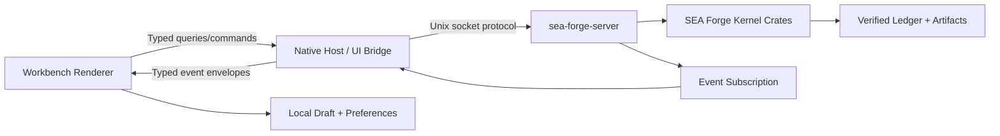

# SEA Forge Workbench Frontend Architecture and Component Contract

**Status:** Draft v0.1  
**Purpose:** Project the SEA Forge UX epic, atomic UI inventory, view-transition specification, and primary-path wireframes into an implementation-ready frontend architecture.  
**Primary implementation target:** Desktop workbench communicating with the existing SEA Forge server and kernel contracts.  
**Scope:** Route modules, frontend layers, state ownership, typed view models, query/command/event boundaries, component contracts, fixtures, tests, and implementation gates.  
**Non-goal:** Redefining SEA Forge authority, case reduction, settlement, capability promotion, ledger integrity, self-model semantics, or agent orchestration in the frontend.

---

# 0. Architecture contract

The frontend is a governed client, not a second implementation of SEA Forge.

```text
SEA Forge kernel/server
= source records, authority, reducers, execution, evidence, settlement

Workbench bridge
= typed transport, capability negotiation, request correlation

Frontend feature layer
= route orchestration, drafts, view state, projection freshness

Component system
= rendering, accessibility, interaction intents

Local client storage
= drafts and preferences only
```

The following logic MUST remain outside the renderer:

- authority evaluation;
- identity binding and sponsor eligibility;
- sentry evaluation;
- case-state reduction;
- settlement evaluation;
- declaration standing;
- capability promotion;
- ledger verification;
- disclosure-policy enforcement;
- semantic validation as final authority;
- sandbox enforcement;
- agent permission grants;
- artifact maturity gates;
- import trust and adoption;
- source-record mutation.

The frontend MAY perform:

- reversible draft editing;
- client-side schema and completeness hints;
- form dependency display;
- formatting and sorting;
- view filtering;
- keyboard navigation;
- local preference persistence;
- non-authoritative payment/readiness previews clearly labeled as estimates;
- optimistic updates for presentation-only state.

Core invariant:

```text
Frontend interpretation may improve visibility.
It may not create truth.
```

---

# 1. Source hierarchy and decision status

## 1.1 Canonical source hierarchy

Implementation decisions in this document must preserve, in order:

1. SEA Forge minimum kernel invariants;
2. full-system authority, case, evidence, settlement, memory, environment, projection, artifact, and federation contracts;
3. Genesis Self-Model, ADLC/ODI, and Thoth disclosure contracts;
4. governed agent connectivity, delegation, and orchestration contracts;
5. the numbered UX epic;
6. the atomic GUI breakdown;
7. the view-flow and transition specification;
8. the primary-path wireframe specification.

When a renderer convenience conflicts with a source invariant, the renderer convenience is rejected.

## 1.2 Normative versus recommended choices

### Normative

- generated or shared wire contracts derive from canonical Rust/server contracts;
- the frontend does not read `.sea-forge/` records directly during normal operation;
- protected actions go through the common command boundary;
- queries and event subscriptions remain disclosure- and authority-aware;
- authoritative state is not optimistically mutated;
- event order follows durable cursor/ordinal, not timestamp;
- drafts cannot be mistaken for committed plans;
- all terminal operational states link to evidence and settlement;
- source truth and derived view state remain distinguishable.

### Recommended reference profile

The following is a practical reference, not a kernel requirement:

```text
Desktop host:       Tauri-style native shell
Renderer:           TypeScript component application
UI architecture:    feature modules + atomic design system
Server connection:  native bridge to SEA Forge Unix socket
Live updates:       cursor-based event subscription
Contracts:          generated TypeScript from canonical Rust schemas
Component lab:      Storybook-compatible isolated states
Testing:            Rust contract tests + frontend unit/component/E2E tests
```

A web, Qt, native Rust, or other frontend may replace this profile if it preserves the contracts in this document.

---

# 2. System architecture

## 2.1 Runtime topology



Rules:

- The native host must not bypass `sea-forge-server` by editing run/case files.
- Direct filesystem access is limited to user-selected source imports/exports and local draft support.
- The bridge may expose platform capabilities, but every governed SEA Forge operation still enters through the server authority fabric.
- The event stream accelerates updates; queries against source-backed views remain the recovery path.

## 2.2 Frontend layers

```text
app-shell
├── host adapters
├── contract types
├── query/command/event clients
├── route guards
├── feature modules
│   ├── readiness
│   ├── case-authoring
│   ├── case-operations
│   ├── execution
│   ├── agent-delegation
│   ├── settlement
│   ├── capability
│   ├── evidence
│   └── administration
├── design system
│   ├── foundations
│   ├── atoms
│   ├── molecules
│   ├── organisms
│   └── templates
├── local draft/preferences
└── testing fixtures
```

## 2.3 Logic placement matrix

| Concern | Kernel/server | UI bridge | Feature layer | Component |
|---|---:|---:|---:|---:|
| Authority verdict | Owns | Transports | Displays | No |
| Disclosure before retrieval | Owns | Transports scoped response | Requests typed scope | No |
| Case reducer | Owns | Transports view | Subscribes/refetches | No |
| Sentry activation | Owns | Transports cause | Displays “why activated” | No |
| Settlement | Owns | Transports | Displays matrix/consequence | No |
| Capability promotion | Owns | Transports | Displays ladder/gaps | No |
| Draft editing | No | No | Owns | Emits edits |
| Client validation hints | Final validation only | Optional schema support | Owns hints | Displays |
| Navigation | No | No | Owns | Emits navigation intent |
| Filters/sorting | May support server-side | Transports | Owns selection | Emits changes |
| Formatting | No | No | Owns adapters | Displays |
| Evidence verification | Owns | Starts/transports | Displays progress/result | No |
| Event-gap recovery | Supplies source query | Tracks cursor | Refetches/reduces | Displays stale |
| Accessibility | No | No | Defines behavior | Owns semantics |

---

# 3. Repository and package layout

> **Non-binding recommendation.** The layout below is a suggested monorepo
> projection pending workspace inspection against the actual repository. It
> is NOT an established or normative directory contract. The only binding
> rule in this section is that architectural boundaries (UI contracts, UI
> client, UI state, UI components, host bridge) MUST remain visible in
> module ownership and tests, regardless of where the files physically live.
> Replace the `apps/`, `packages/`, and `crates/sea-forge-ui-bridge/` paths
> below with the verified repository-derived locations before treating any
> path as canonical. The current `crates/` workspace already exists; a
> frontend monorepo layout has not been landed and may end up single-package.

A recommended monorepo projection:

```text
apps/
  sea-forge-workbench/
    src/
      app/
        AppRoot.tsx
        routes.ts
        route-guards.ts
        shell/
        shortcuts/
        density/
      features/
        readiness/
        case-authoring/
        case-operations/
        execution/
        agent-task/
        settlement/
        capability/
        evidence/
        approvals/
        thoth/
        assets/
        domain-models/
        administration/
      pages/
      test/
    e2e/

packages/
  sea-forge-ui-contracts/
    src/generated/             # generated; never handwritten source truth
    src/view-models/
    src/commands/
    src/events/
    src/ids/
  sea-forge-ui-client/
    src/query-client.ts
    src/command-client.ts
    src/event-client.ts
    src/request-correlation.ts
    src/error-normalization.ts
  sea-forge-ui-state/
    src/machines/
    src/drafts/
    src/cache/
    src/navigation-memory/
  sea-forge-ui-components/
    src/foundations/
    src/atoms/
    src/molecules/
    src/organisms/
    src/templates/
  sea-forge-ui-fixtures/
    src/builders/
    src/scenarios/
    src/records/
  sea-forge-ui-testkit/
    src/fake-transport/
    src/fake-event-stream/
    src/accessibility/
    src/assertions/

crates/
  sea-forge-ui-bridge/
    src/
      lib.rs
      host_commands.rs
      unix_socket_client.rs
      event_subscription.rs
      file_dialogs.rs
      protocol_negotiation.rs
      error_mapping.rs
```

Alternative single-package implementations are allowed, but boundaries must remain visible in module ownership and tests.

## 3.1 Generated-code rule

`packages/sea-forge-ui-contracts/src/generated/` is a rebuildable projection from canonical server/Rust wire schemas.

It MUST include a generation manifest:

```text
source crate versions
schema versions
generator version
parameters
output digest
generated_at
```

Hand editing generated types is prohibited.

## 3.2 No duplicate-enum rule

The renderer must not independently recreate canonical enums such as:

- authority disposition;
- execution state;
- settlement state;
- capability state;
- integrity state;
- plan item kind;
- operation kind;
- evidence kind;
- failure class.

Display labels and icons may be mapped locally, but exhaustive compilation/tests must fail when a new canonical variant lacks a presentation mapping.

---

# 4. Canonical frontend contract types

The code below is TypeScript-shaped pseudocode. Exact serialization follows the server schema.

## 4.1 Branded identifiers

```ts
type Brand<T, B extends string> = T & { readonly __brand: B };

type CellId = Brand<string, "CellId">;
type CaseId = Brand<string, "CaseId">;
type PlanId = Brand<string, "PlanId">;
type PlanItemId = Brand<string, "PlanItemId">;
type RunId = Brand<string, "RunId">;
type ApprovalId = Brand<string, "ApprovalId">;
type EvidenceId = Brand<string, "EvidenceId">;
type SettlementId = Brand<string, "SettlementId">;
type CapabilityId = Brand<string, "CapabilityId">;
type ArtifactId = Brand<string, "ArtifactId">;
type RecordId = Brand<string, "RecordId">;
type RequestId = Brand<string, "RequestId">;
type EventCursor = Brand<string, "EventCursor">;
type Sha256 = Brand<string, "Sha256">;
```

IDs are opaque. UI code may validate shape for early error display but cannot derive authority or record meaning from prefixes alone.

## 4.2 Source-backed view envelope

```ts
interface ViewEnvelope<T> {
  schemaVersion: string;
  data: T;

  source: {
    recordRefs: RecordRef[];
    sourceCellId: CellId;
    authoritativeAsOf: string;
  };

  projection?: {
    kind: string;
    descriptorRef: RecordRef;
    version: string;
    rebuiltAt?: string;
    outputDigest: Sha256;
  };

  freshness: {
    state: "current" | "stale" | "unknown";
    invalidatedBy?: RecordRef;
    lastVerifiedAt?: string;
  };

  integrity: IntegritySummary;
  cursor?: EventCursor;
  limitations: ViewLimitation[];
}
```

`ViewEnvelope` ensures every substantial page can display source, freshness, and integrity without feature-specific reinvention.

## 4.3 Record references

```ts
interface RecordRef {
  id: RecordId;
  kind: string;
  version: string;
  digest?: Sha256;
  displayLabel?: string;
}
```

A `displayLabel` is convenience only. Navigation and retrieval use typed ID plus kind.

## 4.4 Actor context

```ts
interface ActorContextView {
  actorId: string;
  displayName: string;
  actorType: "human" | "service" | "automated_agent";
  activeRole?: string;
  sponsorRef?: RecordRef;
  identitySource: string;
  resolutionState: "resolved" | "conflicting" | "unresolved";
}
```

## 4.5 Protected command envelope

```ts
interface ProtectedCommand<P> {
  schemaVersion: string;
  requestId: RequestId;
  command: string;
  payload: P;

  context: {
    cellId: CellId;
    actorId: string;
    role?: string;
    sponsorRef?: RecordRef;
    caseId?: CaseId;
    runId?: RunId;
    planItemId?: PlanItemId;
    sourceRoute: string;
  };

  expected: {
    policyBundleDigest?: Sha256;
    resourceDigest?: Sha256;
    planDigest?: Sha256;
    configurationDigest?: Sha256;
    viewCursor?: EventCursor;
  };

  submittedAt: string;
}
```

The `expected` block prevents a stale screen from submitting against silently changed governing inputs.

## 4.6 Command result

```ts
// CommandDisposition MUST cover every state-machine outcome explicitly —
// clients must not infer these from failed/error text. Each value is a
// first-class disposition the run/case state machine can produce.
type CommandDisposition =
  | "committed"                // durable record written, terminal success
  | "denied"                   // authority rejected before any side effect
  | "escalated"                // authority punted to a human/approval flow
  | "accepted_for_processing"  // durable request/run exists, not completion
  | "failed"                   // executed but did not accept (nonzero exit, etc.)
  | "cancel_requested"         // operator cancel accepted, cancellation pending
  | "submission_unknown"       // request id not found on post-failure status query
  | "confirmed_not_received"   // no durable record after acknowledged submit
  | "expired"                  // request/approval TTL elapsed before completion
  | "quarantined";             // stage/item quarantined by integrity gate

interface CommandResult<T = unknown> {
  requestId: RequestId;
  disposition: CommandDisposition;
  result?: T;

  authorityDecisionRefs: RecordRef[];
  createdRecordRefs: RecordRef[];
  evidenceRefs: RecordRef[];
  settlementRef?: RecordRef;
  approvalRef?: RecordRef;

  nextActions: NextAction[];
  error?: GovernedError;
  cursor?: EventCursor;
}
```

`accepted_for_processing` is not completion. It means a durable request/run exists and must be followed by query/events.

## 4.7 Event envelope

```ts
interface EventEnvelope<E = unknown> {
  schemaVersion: string;
  eventId: RecordId;
  cursor: EventCursor;
  ordinal: number;
  streamId: string;
  cellId: CellId;
  caseId?: CaseId;
  runId?: RunId;
  eventType: string;
  occurredAt: string;
  payload: E;
  sourceRecordRefs: RecordRef[];
  integrity: IntegritySummary;
}
```

The client orders by cursor/ordinal. `occurredAt` is display metadata.

## 4.8 Governed error

```ts
interface GovernedError {
  class:
    | "configuration"
    | "identity"
    | "authority"
    | "disclosure"
    | "model"
    | "plan"
    | "integrity"
    | "sandbox"
    | "environment"
    | "endpoint"
    | "acp"
    | "evidence"
    | "settlement"
    | "compatibility"
    | "transport"
    | "internal";

  code: string;
  title: string;
  explanation: string;

  sideEffectState:
    | "none"
    | "prevented"
    | "partial"
    | "completed_before_rejection"
    | "unknown";

  sourceRefs: RecordRef[];
  evidenceRefs: RecordRef[];
  nextActions: NextAction[];
  retryPolicy: "never" | "after_correction" | "new_episode" | "query_request_status";
}
```

A transport error must not overwrite a known governed disposition.

## 4.9 Next action

```ts
interface NextAction {
  id: string;
  label: string;
  kind:
    | "navigate"
    | "query"
    | "protected_command"
    | "approval"
    | "recovery";
  route?: string;
  command?: string;
  enabled: boolean;
  disabledReason?: string;
  authoritySummary?: string;
  impactSummary?: string;
}
```

Where feasible, “next lawful paths” should be server-supplied or server-validated rather than invented from generic client heuristics.

---

# 5. Client interfaces

## 5.1 Query client

```ts
interface QueryClient {
  query<TQuery, TView>(
    name: string,
    query: TQuery,
    options?: {
      signal?: AbortSignal;
      expectedCellId?: CellId;
      minimumIntegrity?: string;
      // Authorization context. These fields MUST be part of every cache key
      // so a role/privilege change, an actor switch, or a narrower disclosure
      // scope cannot reuse a response cached under a different context. When
      // the transport session is the source of truth for these, the session
      // invariant (and its enforcement) is documented per integration.
      actor?: string;
      role?: string;
      sponsor?: string;
      disclosureScope?: "own" | "entity" | "any";
      disclosureDigest?: string;
    }
  ): Promise<ViewEnvelope<TView>>;
}
```

Queries:

- are read-only from the user's perspective;
- may still be protected operations, such as memory recall or Thoth disclosure;
- may produce audit/evidence records when required;
- must never retrieve broadly before disclosure;
- **cache responses under a key that includes the full authorization context
  (`actor`, `role`, `sponsor`, `disclosureScope`, `disclosureDigest`)** so a
  cached view from one context is never served to another. The same rule
  applies to every retrieval/inspection surface (§5.x retrieval client,
  evidence drawer) — role or privilege changes invalidate the cache entry.

## 5.2 Command client

```ts
interface CommandClient {
  execute<TPayload, TResult>(
    command: ProtectedCommand<TPayload>,
    options?: { signal?: AbortSignal }
  ): Promise<CommandResult<TResult>>;

  getRequestStatus(
    cellId: CellId,
    requestId: RequestId
  ): Promise<CommandResult>;
}
```

If a connection fails after submission, the UI must query `requestId` status before offering resubmission.

## 5.3 Event client

```ts
interface EventClient {
  subscribe(
    request: {
      cellId: CellId;
      caseId?: CaseId;
      runId?: RunId;
      after?: EventCursor;
      eventClasses?: string[];
    },
    handlers: {
      onEvent(event: EventEnvelope): void;
      onGap(gap: EventGap): void;
      onStale(reason: string): void;
      onError(error: GovernedError): void;
    }
  ): SubscriptionHandle;
}
```

### 5.3.1 Cursor replay / snapshot-plus-subscription (no-gap invariant)

Events that occur between view loading and `subscribe()` MUST NOT be lost.
The client implements one of:

1. **Atomic snapshot-plus-subscription**: the server returns a point-in-time
   snapshot and begins the subscription in one round trip, with a cursor
   pinned to the snapshot's tail. The client renders the snapshot, then
   applies only events whose `cursor > snapshot.tail`.
2. **Durable cursor replay**: the client persists its last-processed
   `EventCursor` durably (per `cellId`/view). On (re)load it issues
   `subscribe({ after: persistedCursor })`. If the server can replay from
   that cursor, events are delivered via `onEvent`. If the cursor has
   expired (events pruned, retention boundary crossed), the server signals
   `onGap` with `kind: "cursor_expired"` and the client must discard
   derived state and re-snapshot.

A gap detected at runtime (out-of-order ordinal, cursor skip) MUST trigger
`onGap`. The client MUST treat `onGap` as "derived state may be
inconsistent" and re-snapshot before trusting any view built from the
event stream.

## 5.4 Host client

```ts
interface HostClient {
  selectFiles(options: FileSelectionOptions): Promise<SelectedFile[]>;
  selectDirectory(options: DirectorySelectionOptions): Promise<SelectedDirectory | null>;
  saveExport(options: ExportOptions): Promise<ExportResult>;
  revealLocalPath(pathRef: string): Promise<void>;
}
```

Host access returns file references, not silent file contents, unless the user explicitly selected content for import.

---

# 6. State ownership

## 6.1 State classes

| State class | Owner | Persistence | Authority |
|---|---|---|---|
| Canonical records | SEA Forge ledger/server | Durable | Authoritative |
| Server read model | Server/projection | Rebuildable | Derived |
| Query cache | Frontend client | Ephemeral | Derived/stale-capable |
| Event-reduced live view | Frontend from source events | Ephemeral | Derived |
| Case/model drafts | Frontend local draft store | Local/reversible | Non-authoritative |
| UI preferences | Frontend | Local | Presentation only |
| Dialog state | Component/feature | Ephemeral | Presentation only |
| Submission correlation | Client + server | Until terminal result | Operational |
| Raw secrets | Secret provider | Never renderer persistence | Restricted |

## 6.2 Query cache rules

The cache:

- is keyed by cell, actor/disclosure context, query name, and parameters;
- stores the full `ViewEnvelope`, not only data;
- marks state stale when an invalidation event arrives;
- may show last verified content while refetching;
- cannot silently merge views produced under different actor/disclosure contexts;
- is cleared or partitioned on cell/role switch.

## 6.3 Local draft store

Draft keys:

```text
cell_id
actor_id
draft_kind
draft_id
source_asset_digest
```

Draft metadata:

```ts
interface LocalDraftEnvelope<T> {
  draftId: string;
  kind: string;
  cellId: CellId;
  actorId: string;
  sourceDigests: Record<string, Sha256>;
  data: T;
  createdAt: string;
  updatedAt: string;
  authoritative: false;
}
```

Rules:

- no credential values;
- no authority tokens;
- no canonical “committed” status;
- explicit “saved locally” language;
- stale source digest detected before preflight;
- deletion does not affect SEA Forge history;
- storage encryption is recommended for domain/plan drafts.

## 6.4 View state

View state may include:

- active tab;
- selected card;
- filters;
- expanded evidence;
- density mode;
- scroll anchor;
- board/list/graph preference.

It must not include a manually editable copy of canonical case or run status.

---

# 7. Route modules and guards

## 7.1 Route module contract

```ts
interface RouteModule<TParams, TView> {
  id: string;
  match: string;
  requiredGuards: RouteGuard[];

  load(context: RouteLoadContext<TParams>): Promise<ViewEnvelope<TView>>;
  subscribe?(context: RouteSubscriptionContext<TParams>): SubscriptionHandle;
  deriveActions(view: ViewEnvelope<TView>): NextAction[];
  mapError(error: unknown): RouteFailureState;
}
```

## 7.2 Guard result

```ts
type RouteGuardResult =
  | { status: "pass" }
  | {
      status: "repair_required";
      guard: RouteGuard;
      explanation: string;
      repairRoute: string;
      evidenceRefs: RecordRef[];
    }
  | {
      status: "denied";
      guard: RouteGuard;
      explanation: string;
      evidenceRefs: RecordRef[];
    };
```

Failed guards preserve:

- intended route;
- query parameters;
- source action;
- local draft;
- governing digests.

## 7.3 Primary-path route table

| Page | Module | Required guards | Initial query | Subscription |
|---|---|---|---|---|
| P2 Readiness | `readiness-route` | G1 cell | `readiness.get` | cell invalidations |
| P11 New Case | `new-case-route` | G1, G2, G4, minimum G5 | `case.entry_options` | asset/readiness invalidations |
| P12 Configuration | `case-config-route` | P11 draft + G1/G2 | asset/model queries | draft dependency invalidations |
| P13 Preflight | `case-preflight-route` | valid draft, G1–G5, G8/G9 | `case.preflight` | policy/asset invalidations |
| P15 Case Overview | `case-overview-route` | G1, G2, G5, G6, disclosure | `case.get_summary` | case stream |
| P16 Case Horizon | `case-horizon-route` | same | `case.get_horizon` | case/run/approval streams |
| P22 Run Detail | `run-detail-route` | G1, G2, G5, G6 | `run.get` | run stream |
| P23 Agent Task | `agent-run-route` | G1, G2, G5, G6/G7 | `agent_run.get` | run + permission stream |
| P27 Settlement | `settlement-route` | G1, G2, G5, G6/G7 | `settlement.get` | settlement/declaration stream |
| P32 Capability | `capability-route` | G1, G2, G5, G6/G7 | `capability.get` | capability invalidations |

---

# 8. Feature state machines

State machines here govern client interaction and request correlation. Canonical lifecycle state still comes from the server.

## 8.1 Readiness page machine

```text
idle
→ loading
→ displaying_current
→ displaying_stale
→ checking
→ displaying_current | displaying_degraded | blocked | integrity_halted
```

Events:

```text
LOAD
CHECK_REQUESTED
CHECK_ACCEPTED
EVENT_INVALIDATED
QUERY_REFRESHED
CHECK_FAILED
OPEN_REPAIR
```

Constraints:

- `CHECK_ACCEPTED` does not mean ready;
- last verified result remains visible during checking;
- integrity halt disables mutating next actions.

## 8.2 New-case draft machine

```text
empty
→ editing_purpose
→ selecting_entry
→ draft_ready
→ configuring
```

Events:

```text
PURPOSE_CHANGED
ENTRY_RECOMMENDED
ENTRY_SELECTED
DRAFT_SAVED
CONTINUE
DISCARD
```

No server mutation occurs unless the user explicitly stores a governed plan proposal.

## 8.3 Configuration machine

```text
loading_dependencies
→ editing
→ validating_section
→ editing_with_issues
→ complete
→ source_stale
```

Parallel regions:

```text
draft persistence: clean | dirty | saving | saved | save_failed
dependency state: current | checking | stale | unavailable
validation: unknown | valid | errors | warnings
```

## 8.4 Preflight machine

```text
idle
→ requesting_preflight
→ ready_to_commit
→ warnings_present
→ blocked
→ stale
→ committing
→ committed | denied | escalated | submission_unknown | failed
```

`submission_unknown` requires `getRequestStatus(requestId)` before another commit attempt.

## 8.5 Case overview/horizon machine

```text
loading
→ live
→ stale
→ resynchronizing
→ live | integrity_error
```

Selection and filters are parallel view state.

## 8.6 Run-detail machine

```text
loading
→ following
→ stale
→ terminal_execution
→ settlement_evaluating
→ terminal_settlement
```

Control region:

```text
control_idle
→ cancel_submitting
→ cancel_requested
→ cancel_confirmed | cancel_denied | submission_unknown
```

Retry region is enabled only from terminal settlement and creates a separate request/new route.

## 8.7 Agent-task machine

Parallel regions:

```text
dialogue:
  connecting | streaming | awaiting_permission | disconnected | terminated

budget:
  within_limits | near_binding_limit | exhausted

transcript:
  summary_loading | summary_available | access_denied | full_available | invalid

settlement:
  unsettled | evaluating | accepted | rejected | escalated

control:
  idle | cancelling | cancelled | cancel_failed
```

No client transition from `agent_claimed_complete` to accepted exists.

## 8.8 Settlement machine

```text
loading
→ pending
→ terminal_accepted | terminal_rejected | terminal_escalated | quarantined
```

Optional judgment region:

```text
not_eligible | eligible | submitting_declaration | declaration_committed | declaration_denied
```

## 8.9 Capability machine

```text
loading
→ current
→ stale
→ rebuilding
→ current | degraded | quarantined
```

Starting a next proof path emits navigation to P11 with a preselected source; it does not mutate capability.

---

# 9. Query contracts

Exact wire names may differ, but the semantic boundaries are normative.

## 9.1 Readiness queries

```ts
type GetReadinessQuery = {
  cellId: CellId;
  intendedOperation?: {
    operationKind: string;
    resourceRef?: RecordRef;
  };
};

interface ReadinessView {
  overall:
    | "ready"
    | "ready_degraded"
    | "blocked"
    | "integrity_halted"
    | "stale";

  snapshotRef?: RecordRef;
  policyBundleRef?: RecordRef;
  integrity: IntegritySummary;

  foundations: ReadinessItem[];
  capabilities: ReadinessItem[];
  currentAffordances: NextAction[];
  otherPossibilities: BlockedPossibility[];
  recentInvalidations: ReadinessInvalidation[];
}
```

## 9.2 Case entry options

```ts
interface CaseEntryOptionsView {
  recommended: EntryOption[];
  all: EntryOption[];
  assetSnapshotDigest: Sha256;
  limitations: ViewLimitation[];
}
```

The server may provide deterministic eligibility. Any model-generated recommendation is labeled and never auto-selected.

## 9.3 Preflight query

```ts
interface CasePreflightRequest {
  draft: CasePlanDraftWire;
  expectedDigests: {
    model: Sha256;
    template?: Sha256;
    environments: Sha256[];
    endpoints: Sha256[];
    policyBundle: Sha256;
  };
}

interface CasePreflightView {
  contractSummary: CaseContractSummary;
  workBurden: WorkBurdenSummary;
  authorityBurden: AuthorityBurdenSummary;
  settlementBurden: SettlementBurdenSummary;
  checks: PreflightCheck[];
  commitEligibility:
    | "ready"
    | "ready_with_warnings"
    | "blocked"
    | "escalation_expected";
  immutableCommitDigest: Sha256;
}
```

## 9.4 Case horizon query

```ts
interface CaseHorizonView {
  caseRef: RecordRef;
  planRef: RecordRef;
  state: string;
  desiredOutcome: string;

  regions: {
    spendableNow: PlanItemView[];
    active: PlanItemView[];
    awaiting: PlanItemView[];
    blocked: PlanItemView[];
    future: PlanItemView[];
    settled: PlanItemView[];
  };

  milestones: MilestoneView[];
  attention: AttentionItem[];
  sourceCursor: EventCursor;
}
```

## 9.5 Run query

```ts
interface RunDetailView {
  runRef: RecordRef;
  planItemRef: RecordRef;

  executionState: string;
  settlementState: string;

  boundary: AuthorityBoundaryView;
  environment: EnvironmentExecutionView;
  traceSummary: TraceSummary;
  outputChannels: OutputChannelDescriptor[];
  evidence: EvidenceRefView[];
  evaluatorProgress: EvaluatorProgress[];
  settlementPreview?: SettlementPreview;
  retryLineage: RecordRef[];
  nextActions: NextAction[];
}
```

## 9.6 Agent-run query

```ts
interface AgentRunDetailView extends Omit<RunDetailView, "outputChannels"> {
  dialogueState: string;
  terminationReason?: string;

  endpoint: AgentEndpointView;
  session: AgentSessionView;
  instruction: InstructionContractView;
  budget: AgentBudgetView;

  turns: AgentTurnSummary[];
  pendingPermission?: ApprovalRequestSummary;
  harnessProof: HarnessProofView[];
  transcript: TranscriptEvidenceView;
}
```

## 9.7 Settlement query

```ts
interface SettlementDetailView {
  settlementRef: RecordRef;
  runRef?: RecordRef;
  state: string;
  plainExplanation: string;

  expectedOutcome: string;
  observedOutcome: string;
  reliability: ReliabilityView;

  criteria: CriterionSettlementRow[];
  declarations: SettlementDeclarationView[];
  consequences: SettlementConsequenceView;
  eligibleJudgments: NextAction[];
  recoveryActions: NextAction[];
}
```

## 9.8 Capability query

```ts
interface CapabilityDetailView {
  capabilityRef: RecordRef;
  currentState: string;
  claimSummary: string;

  ladder: CapabilityLadderStep[];
  evidenceStrength: EvidenceStrengthView;
  variationCoverage: VariationCoverageView;
  recovery: RecoveryCoverageView;
  orchestrationBurden: BurdenTrendView;
  promotion: PromotionExplanationView;
  sourceSettlements: SettlementSummary[];
  nextProofPaths: ProofPathView[];
}
```

---

# 10. Command contracts

## 10.1 Readiness check

```ts
interface RunReadinessCheckPayload {
  intendedOperation?: string;
  includeProbes: boolean;
  checkScopes: string[];
}
```

Result creates a check/run record and returns a request/run ref. The final readiness state may arrive later through events/query.

## 10.2 Commit case

```ts
interface CommitCasePayload {
  preflightDigest: Sha256;
  draftDigest: Sha256;
  plan: CasePlanDraftWire;
}
```

Server requirements:

- rerun or verify relevant preflight conditions;
- compare expected digests;
- create case, plan, criteria, origins, and initial events atomically from the user's perspective;
- return denied/escalated without partial activated case.

## 10.3 Start plan item

```ts
interface StartPlanItemPayload {
  caseId: CaseId;
  planItemId: PlanItemId;
  expectedCaseCursor: EventCursor;
  expectedPlanDigest: Sha256;
}
```

The server reevaluates sentries and authority. “Spendable now” is not a client-granted permit.

## 10.4 Cancel run

```ts
interface CancelRunPayload {
  runId: RunId;
  reason?: string;
  expectedExecutionState: string;
}
```

The result is `cancel_requested`, not immediate cancellation.

## 10.5 Retry run

```ts
interface RetryRunPayload {
  priorRunId: RunId;
  reason: string;
  inputOverrides?: Record<string, unknown>;
  expectedPlanDigest: Sha256;
}
```

Retry creates a new run ID and links lineage.

## 10.6 Approval decision

```ts
interface DecideApprovalPayload {
  approvalId: ApprovalId;
  requestDigest: Sha256;
  decision: "approve" | "reject";
  note?: string;
}
```

The server validates standing, SoD, expiry, and request freshness.

## 10.7 Settlement declaration

```ts
interface SubmitSettlementDeclarationPayload {
  settlementId: SettlementId;
  criterionRefs: RecordRef[];
  disposition: "accept" | "reject" | "escalate";
  basis: string[];
  evidenceRefs: RecordRef[];
  expectedSettlementDigest: Sha256;
}
```

The frontend never constructs reliability weight or standing; the server resolves them.

---

# 11. Event handling and live consistency

## 11.1 Subscription lifecycle

For a live route:

1. load source-backed view;
2. record returned cursor;
3. render;
4. subscribe after cursor;
5. apply known event adapters;
6. on unsupported/new event, mark relevant view stale and refetch;
7. on cursor gap, pause local reduction and refetch;
8. verify continuity before clearing stale state.

## 11.2 Event adapter registry

```ts
interface EventAdapter<TView> {
  supports(event: EventEnvelope): boolean;
  apply(view: TView, event: EventEnvelope): TView | "refetch_required";
}
```

Adapters may update display summaries but cannot invent new lifecycle states. Canonical state fields in events must be generated from server reducers or source events.

## 11.3 Unsupported-event rule

A new server event variant not understood by the current UI results in:

```text
View may be stale.
A newer event type was recorded.
Refreshing authoritative state…
```

It must not be ignored silently.

## 11.4 Out-of-order protection

If `event.ordinal <= current.ordinal`, treat as duplicate unless integrity/source refs conflict.

If `event.ordinal > current.ordinal + expectedGap`, call `onGap`.

Do not reorder by timestamp.

## 11.5 Reconnect states

```text
live
→ connection_lost
→ stale_last_confirmed
→ reconnecting
→ catching_up
→ live
```

If catch-up cannot verify continuity, route to authoritative refetch or integrity inspection.

---

# 12. Component contract principles

## 12.1 Presentational components emit intents

A component must not import the command client directly.

Bad:

```ts
function CancelButton({ runId }) {
  return <button onClick={() => commandClient.cancel(runId)} />;
}
```

Required:

```ts
interface CancelRunButtonProps {
  state: "enabled" | "disabled" | "submitting";
  disabledReason?: string;
  onRequestCancel(): void;
}
```

The feature controller owns request construction and correlation.

## 12.2 Components receive typed display models

Components should receive view-specific values that already preserve canonical distinctions.

Bad:

```ts
status: string
```

Better:

```ts
interface DualStateView {
  execution: ExecutionStateView;
  settlement: SettlementStateView;
}
```

## 12.3 Disabled-state contract

Every disabled protected control must supply:

```ts
disabledReason: string
repairAction?: NextAction
```

A disabled action with no explanation fails the design contract.

## 12.4 Source/freshness contract

Substantial organisms receive:

```ts
sourceMeta: {
  freshness: "current" | "stale" | "unknown";
  sourceRefs: RecordRef[];
  projectionRef?: RecordRef;
  integrity: IntegritySummary;
}
```

---

# 13. Key component interfaces

## 13.1 `GovernedStatusPill`

```ts
interface GovernedStatusPillProps {
  domain:
    | "availability"
    | "governance"
    | "execution"
    | "settlement"
    | "case"
    | "integrity"
    | "capability";
  value: string;
  assurance?: string;
  explanation?: string;
  sourceRefs?: RecordRef[];
  size?: "compact" | "normal";
}
```

Requirements:

- icon + text;
- no color-only meaning;
- unknown variant renders safely;
- new unmapped canonical variant fails exhaustive test.

## 13.2 `DualStateIndicator`

```ts
interface DualStateIndicatorProps {
  execution: {
    value: string;
    explanation: string;
  };
  settlement: {
    value: string;
    explanation: string;
  };
  sticky?: boolean;
  onOpenSettlement?(): void;
}
```

Must never collapse states into a combined success flag.

## 13.3 `SourceFreshnessBadge`

```ts
interface SourceFreshnessBadgeProps {
  freshness: ViewEnvelope<unknown>["freshness"];
  projection?: ViewEnvelope<unknown>["projection"];
  onInspectSource(): void;
  onRefresh?(): void;
}
```

## 13.4 `ProtectedActionButton`

```ts
interface ProtectedActionButtonProps {
  label: string;
  impact: string;
  authoritySummary?: string;
  state: "enabled" | "disabled" | "submitting" | "committed";
  disabledReason?: string;
  destructive?: boolean;
  onRequest(): void;
}
```

The button emits a request intent. It does not display committed until a source-backed result is received.

## 13.5 `WhyStatePanel`

```ts
interface WhyStatePanelProps {
  stateLabel: string;
  explanation: string;
  ruleRefs: RecordRef[];
  evidenceRefs: RecordRef[];
  satisfiedConditions: ConditionView[];
  failedConditions: ConditionView[];
  nextActions: NextAction[];
}
```

## 13.6 `AuthorityBoundaryPanel`

```ts
interface AuthorityBoundaryPanelProps {
  decisionState: string;
  action: string;
  resource: string;
  boundaries: BoundaryEntry[];
  decisionRefs: RecordRef[];
  compact?: boolean;
}
```

Sensitive credential values are impossible in `BoundaryEntry`; only references/status are accepted.

## 13.7 `EvidenceReferenceList`

```ts
interface EvidenceReferenceListProps {
  evidence: EvidenceRefView[];
  disclosureState: "full" | "summary_only" | "restricted";
  onOpen(ref: RecordRef): void;
  onVerify?(ref: RecordRef): void;
}
```

## 13.8 `AvailabilityLadder`

```ts
interface AvailabilityLadderProps {
  steps: Array<{
    key: string;
    label: string;
    state: "achieved" | "current" | "blocked" | "not_reached";
    evidenceRefs: RecordRef[];
    blocker?: string;
  }>;
}
```

Used for asset readiness and capability maturity. Labels must remain domain-specific.

## 13.9 `PlanItemCard`

```ts
interface PlanItemCardProps {
  item: PlanItemView;
  region:
    | "spendable"
    | "active"
    | "awaiting"
    | "blocked"
    | "future"
    | "settled";
  selected: boolean;
  primaryAction?: NextAction;
  onSelect(id: PlanItemId): void;
  onAction(action: NextAction): void;
}
```

No drag event can mutate authoritative state.

## 13.10 `CaseHorizonBoard`

```ts
interface CaseHorizonBoardProps {
  horizon: CaseHorizonView;
  displayMode: "board" | "list" | "graph";
  selectedItemId?: PlanItemId;
  onSelectItem(id: PlanItemId): void;
  onAction(action: NextAction): void;
  onDisplayModeChange(mode: "board" | "list" | "graph"): void;
}
```

The graph is optional and read-only unless a separate governed proposal is explicitly initiated.

## 13.11 `ExecutionOutputViewer`

```ts
interface ExecutionOutputViewerProps {
  channels: OutputChannelDescriptor[];
  selectedChannel: string;
  stale: boolean;
  onChannelChange(id: string): void;
  onSearch(query: string): void;
  onExport?(id: string): void;
}
```

The viewer labels output as execution evidence.

## 13.12 `AgentBudgetPanel`

```ts
interface AgentBudgetPanelProps {
  turns: BudgetMeasure;
  tokens: BudgetMeasure;
  time: BudgetMeasure;
  bindingLimit: string;
  nearLimit: boolean;
}
```

## 13.13 `AgentTurnList`

```ts
interface AgentTurnListProps {
  turns: AgentTurnSummary[];
  disclosureState: "structured" | "summary_only" | "restricted";
  pendingPermission?: ApprovalRequestSummary;
  onOpenPermission?(approvalId: ApprovalId): void;
}
```

Do not use a casual chat visual metaphor as the only representation.

## 13.14 `CriterionSettlementMatrix`

```ts
interface CriterionSettlementMatrixProps {
  rows: CriterionSettlementRow[];
  selectedCriterionId?: string;
  onSelectCriterion(id: string): void;
  onOpenEvidence(ref: RecordRef): void;
  density: "guided" | "operational" | "audit";
}
```

Unknown and excluded are first-class results.

## 13.15 `CapabilityPromotionPanel`

```ts
interface CapabilityPromotionPanelProps {
  state: string;
  policyRef: RecordRef;
  satisfied: PromotionCondition[];
  missing: PromotionCondition[];
  excluded: PromotionCondition[];
  nextProofPaths: ProofPathView[];
  onStartProofPath(path: ProofPathView): void;
}
```

A proof path event navigates to case creation. It cannot promote capability directly.

---

# 14. Page controller contracts

## 14.1 Controller responsibilities

A page controller:

- runs route guards;
- loads a `ViewEnvelope`;
- owns the feature state machine;
- manages query cancellation;
- subscribes and detects gaps;
- maps server next actions into UI actions;
- constructs protected command envelopes;
- tracks `requestId`;
- handles submission-unknown recovery;
- preserves originating intent;
- provides immutable props to page components.

It does not:

- evaluate authority;
- finalize settlement;
- assign capability states;
- read canonical files directly;
- embed secret values;
- change server state from event rendering.

## 14.2 Readiness controller

```ts
interface ReadinessController {
  state: ReadinessMachineState;
  view?: ViewEnvelope<ReadinessView>;
  intendedOperation?: string;

  setIntendedOperation(value?: string): void;
  runChecks(options: ReadinessCheckOptions): Promise<void>;
  openAction(action: NextAction): void;
  refresh(): Promise<void>;
}
```

## 14.3 Case-authoring controller

```ts
interface CaseAuthoringController {
  draft: LocalDraftEnvelope<CaseDraft>;
  options?: ViewEnvelope<CaseEntryOptionsView>;
  validation: DraftValidationState;
  sourceFreshness: DraftDependencyFreshness;

  selectEntry(option: EntryOption): void;
  updateDraft(patch: CaseDraftPatch): void;
  validateSection(section: string): Promise<void>;
  requestPreflight(): Promise<void>;
  commit(preflightDigest: Sha256): Promise<void>;
}
```

## 14.4 Run controller

```ts
interface RunController {
  state: RunPageMachineState;
  view?: ViewEnvelope<RunDetailView>;

  requestCancel(reason?: string): Promise<void>;
  requestRetry(input: RetryInput): Promise<void>;
  refresh(): Promise<void>;
  openEvidence(ref: RecordRef): void;
  openSettlement(): void;
}
```

## 14.5 Agent-run controller

Extends run controller with:

```ts
openPermission(id: ApprovalId): void;
requestTranscriptAccess(): Promise<void>;
openHarnessProof(ref: RecordRef): void;
```

## 14.6 Settlement controller

```ts
interface SettlementController {
  view?: ViewEnvelope<SettlementDetailView>;
  state: SettlementPageMachineState;

  submitDeclaration(input: DeclarationInput): Promise<void>;
  openRecovery(action: NextAction): void;
  openCapabilityEffect(): void;
}
```

---

# 15. Draft validation and preflight separation

## 15.1 Client validation

Client validation exists to reduce user or implementation burden before server preflight.

It may detect:

- required fields;
- local type/schema errors;
- obvious duplicate entries;
- missing origin selection;
- invalid numeric limit;
- stale selected asset from a received invalidation;
- unsupported component combination from negotiated capability metadata.

It must label its result:

```text
Draft check
Not authoritative preflight
```

## 15.2 Server preflight

Only the server can establish:

- semantic resolution against canonical model;
- final compatibility;
- authority outcome;
- sentry satisfiability under canonical semantics;
- SoD;
- exact immutable criteria;
- current policy/configuration digests;
- operation-specific readiness.

## 15.3 Digest chain

```text
draft data
→ client draft digest
→ server preflight
→ preflight digest
→ commit command with expected digests
→ server revalidation
→ committed plan digest
```

If any governing digest changes, commit is rejected as stale and P13 returns to review.

---

# 16. Permission-aware data loading

## 16.1 Retrieval contract

The renderer sends the narrowest typed query possible.

Bad:

```text
Fetch entire self-model and hide restricted claims.
```

Required:

```text
AskCapability(capability_ref, current_context)
→ disclosure decision
→ bounded retrieval
→ answer/view
```

## 16.2 Component-level disclosure states

Components must support:

```text
visible
summary_only
restricted
omitted
unknown
```

Restricted content is not represented as an empty successful dataset.

## 16.3 Cache isolation

Cache keys include:

- cell;
- actor;
- role;
- sponsor context where material;
- query class;
- resource scope;
- policy/disclosure digest if supplied.

Switching roles cannot reuse a more privileged cached response.

---

# 17. Request correlation and duplicate prevention

## 17.1 Submission states

```text
not_submitted
→ submitting
→ response_received
```

Transport interruption adds:

```text
submitting
→ submission_unknown
→ querying_request_status
→ response_received | confirmed_not_received
```

The UI may offer resubmit only after `confirmed_not_received` or a new request ID and explicit user intent.

## 17.2 Double-click protection

Disabling the button after click is not sufficient. The command includes a stable `requestId`, and the server must support status resolution/idempotent recognition for the operation.

## 17.3 Commit/cancel/approval safety

High-impact commands display:

- request digest;
- affected resource;
- expected current state;
- impact;
- evidence preservation behavior.

---

# 18. Error presentation

## 18.1 Error hierarchy

```text
Governed outcome:
  denied
  escalated
  expired

Operational failure:
  endpoint
  environment
  sandbox
  timeout
  interruption

Integrity/semantic failure:
  model
  ledger
  evidence
  compatibility

Transport/client failure:
  disconnected
  malformed response
  unsupported version
```

A governed denial must not be styled as a broken application.

## 18.2 Error boundary policy

Feature error boundaries may catch renderer failures, but must preserve:

- current route;
- request ID;
- last source-backed view;
- event cursor;
- safe export of diagnostic client logs.

They must not claim that the SEA Forge operation failed unless the server says so.

## 18.3 Unsupported protocol/version

The bridge negotiates:

```text
server protocol version
record schema versions
supported query/command/event classes
UI minimum/maximum compatibility
```

On unsupported version:

- block affected operations;
- permit safe inspection where readable;
- show upgrade path;
- never coerce unknown enums to a known permissive state.

---

# 19. Storybook and fixture architecture

## 19.1 Fixture principles

Fixtures use typed builders and must represent source-linked states, not screenshots alone.

```ts
const runSucceededSettlementEvaluating =
  runDetailBuilder()
    .execution("succeeded")
    .settlement("evaluating")
    .withEvidence(...)
    .withSourceRefs(...)
    .build();
```

Builders must reject invalid combinations unless the fixture is explicitly marked as an integrity/error scenario.

## 19.2 Foundation stories

- every status variant;
- unknown/unmapped variant;
- current/stale/unknown freshness;
- local/tamper-evident/witnessed/invalid integrity;
- guided/operational/audit density;
- keyboard focus and reduced motion.

## 19.3 Readiness stories

- new cell, never checked;
- checking in ordered phases;
- ready;
- ready with unrelated degradation;
- selected operation blocked;
- stale prior-ready snapshot;
- integrity halted;
- self-model invalid;
- last-known-good config retained after reload failure.

## 19.4 Case-authoring stories

- no entry selected;
- recommended entry;
- unavailable template;
- local draft restored;
- configuration valid;
- errors/incomplete/unavailable/warning together;
- endpoint becomes stale;
- preflight ready;
- preflight warning;
- escalation required;
- commit submission unknown;
- digest drift invalidates commit.

## 19.5 Case horizon stories

- mixed six-region board;
- no spendable, active exists;
- approval-only wait;
- stalled/unsatisfiable;
- capacity wait;
- completed/satisfied;
- reactivated stage;
- event stream stale;
- unknown plan-item kind safely rendered.

## 19.6 Run stories

Cross product, sampled meaningfully:

| Execution | Settlement |
|---|---|
| running | unsettled |
| succeeded | evaluating |
| succeeded | accepted |
| succeeded | rejected |
| failed | rejected |
| cancelled | rejected |
| interrupted | escalated |

Additional:

- authority denied/no side effects;
- sandbox violation;
- environment preparation failure;
- cancellation requested;
- submission unknown;
- output stream unavailable;
- retry lineage.

## 19.7 Agent stories

- connecting;
- streaming;
- pending permission;
- permission denied, dialogue continues;
- turn cap;
- endpoint error/no fallback;
- disconnect with continuation eligible;
- transcript summary only;
- transcript access denied;
- SWE_SEED proof complete;
- agent claims complete, settlement pending;
- agent terminated, settlement rejected.

## 19.8 Settlement stories

- pending independent declaration;
- accepted with one qualifying observation;
- rejected despite execution success;
- unknown criterion;
- excluded self-declaration;
- quarantined evidence;
- reliability below threshold;
- remediation activated.

## 19.9 Capability stories

- attempted;
- demonstrated;
- proven;
- degraded after regression;
- quarantined;
- missing variation;
- missing recovery;
- next possible test but not spendable;
- next spendable proof path;
- routing allow in staging/escalate in production.

---

# 20. Test architecture

## 20.1 Test pyramid

```text
Rust/server conformance
        ↓
generated-contract tests
        ↓
frontend state-machine tests
        ↓
component interaction/accessibility tests
        ↓
route integration tests with fake bridge
        ↓
desktop E2E against real server fixture cell
```

## 20.2 Contract tests

Must prove:

- generated TS types match server schemas;
- all enum variants have display mappings;
- query/command names and payloads negotiate;
- unknown future variants fail safe;
- record references round-trip;
- digests are opaque and preserved;
- event cursor/ordinal types do not serialize as timestamps.

## 20.3 State-machine tests

For every machine:

- all transitions are explicit;
- invalid transitions are rejected;
- submission unknown does not permit blind duplicate;
- stale event invalidates commit/action where required;
- terminal source states cannot be changed by navigation;
- retry creates a new run route/ref.

## 20.4 Component tests

Examples:

- `DualStateIndicator` never displays “complete” from execution state alone;
- disabled `ProtectedActionButton` always exposes reason;
- `CriterionSettlementMatrix` distinguishes unknown from pass;
- `PlanItemCard` drag emits presentation reorder only;
- `AgentTurnList` permission action opens approval intent;
- `SourceFreshnessBadge` exposes invalidation cause;
- status is understandable without color.

## 20.5 Route integration tests

- deep link resolves cell/identity/disclosure;
- failed guard preserves intended route;
- role switch partitions cache;
- event gap triggers refetch;
- unsupported event marks stale;
- P13 commit with stale digest returns review;
- P22 cancellation affects only selected run;
- P23 denial does not automatically cancel;
- P27 rejected settlement exposes source-supported recovery;
- P32 proof path returns through P11/P12/P13.

## 20.6 End-to-end proof scenarios

### E2E-1 Happy command path

```text
ready
→ configure/commit case
→ start command
→ execution succeeds
→ settlement accepted
→ capability gains qualifying observation
```

### E2E-2 Command false-success correction

```text
execution succeeds
→ criterion fails
→ settlement rejected
→ remediation sentry activates
```

### E2E-3 Approval escalation

```text
preflight escalates
→ authorized approver accepts exact digest
→ case commits
```

### E2E-4 Agent permission denial

```text
agent requests write
→ approval denied
→ agent continues within grant
→ termination recorded
→ settlement evaluated independently
```

### E2E-5 Integrity halt

```text
ledger verification fails
→ mutating actions disabled
→ integrity/maintenance route
→ repair does not rewrite history
```

### E2E-6 Submission ambiguity

```text
commit sent
→ connection drops
→ UI queries request status
→ existing committed case opened
→ no duplicate case
```

### E2E-7 Stale preflight

```text
preflight ready
→ policy digest changes
→ commit blocked
→ diff/review
→ new preflight
```

## 20.7 Accessibility tests

- automated semantic checks;
- keyboard-only completion of the primary path;
- focus return after dialogs/detours;
- live announcement throttling;
- no color-only state;
- matrix/table header semantics;
- graph alternative list;
- reduced-motion support;
- 200% zoom without state loss.

## 20.8 Visual regression

Capture all high-risk combinations:

- status pills;
- dual-state headers;
- stale overlays;
- denial/escalation/error distinctions;
- criterion result variants;
- six-region horizon board;
- narrow viewport operational views;
- audit density with long IDs/hashes.

---

# 21. Frontend observability

## 21.1 Client diagnostic events

Allowed examples:

```text
route_guard_failed
view_loaded
view_marked_stale
event_gap_detected
request_submission_unknown
draft_validation_failed
protected_action_requested
evidence_drawer_opened
recovery_path_selected
```

Do not record:

- secret values;
- full prompt/transcript;
- restricted evidence content;
- unredacted domain source;
- approval notes unless already governed and explicitly referenced.

## 21.2 Correlation

Client diagnostics include:

- UI session ID;
- route ID;
- cell ID;
- request ID;
- source record IDs where permitted;
- event cursor;
- frontend version;
- bridge/server protocol versions.

Client logs are diagnostic evidence only if explicitly captured and governed; they are not automatic settlement evidence.

---

# 22. Performance budgets

Budgets should preserve operational clarity rather than chase arbitrary animation speed.

Recommended initial targets:

| Interaction | Target |
|---|---:|
| Shell first useful render from local context | < 1.5 s typical |
| Route skeleton | < 200 ms after navigation |
| Cached source-backed view render | < 100 ms |
| Query response state visible | immediately with observable progress |
| Event-to-visible update | < 500 ms typical after receipt |
| Filter/sort on 1,000 local rows | < 100 ms |
| Virtualized log/turn rendering | 50,000 entries without full DOM |
| Keyboard action feedback | < 100 ms |
| Evidence drawer open | < 150 ms when metadata cached |

A slow authoritative operation must show phase progress, request ID, and cancellation semantics rather than fake responsiveness.

---

# 23. Security and privacy boundaries

- Renderer receives no raw secret values.
- Credential references use opaque IDs and status.
- Transcript/evidence content is requested only after disclosure decision.
- Browser-style devtools in production builds must be governed by deployment policy.
- File import uses explicit user selection and content limits.
- Export requires an explicit destination and records the governed export where required.
- Cache and draft stores are scoped by cell/actor.
- Role switch clears privileged in-memory content not permitted in the new context.
- Clipboard actions for restricted data are separately controlled where policy requires.
- External links never include raw record payloads or secret-bearing query strings.

---

# 24. Implementation slices

## UI-M0 — Contract projection and fake transport

Build:

- generated UI contract pipeline;
- branded IDs;
- `ViewEnvelope`;
- query/command/event interfaces;
- fake transport/event stream;
- enum exhaustiveness tests.

Gate:

- canonical variants compile;
- unknown variants fail safe;
- no handwritten duplicate enums.

## UI-M1 — Design-system foundations and shell

Build:

- status/freshness/integrity components;
- application shell;
- route memory;
- density modes;
- evidence drawer;
- keyboard infrastructure.

Gate:

- accessible without color;
- source/freshness visible;
- shell works with fake views.

## UI-M2 — Readiness

Build:

- P2 controller/machine;
- operation-sensitive readiness;
- stale/blocked/integrity states;
- repair navigation.

Gate:

- readiness cannot overstate stale/blocked cell;
- source records accessible;
- intended-operation changes result.

## UI-M3 — Case authoring and preflight

Build:

- P11/P12/P13;
- local draft store;
- typed selectors;
- validation taxonomy;
- digest/preflight/commit correlation.

Gate:

- draft cannot appear committed;
- stale dependency blocks commit;
- submission ambiguity cannot duplicate case.

## UI-M4 — Case overview and horizon

Build:

- P15/P16;
- live event cursor;
- board/list views;
- blocker explanations;
- start/add/replan intents.

Gate:

- board does not mutate status;
- spendable logic comes from server;
- event gap refetches.

## UI-M5 — Command execution

Build:

- P22;
- dual-state header;
- boundary/evidence/output;
- scoped cancellation;
- retry lineage.

Gate:

- command success cannot render as accepted;
- cancel waits for source event;
- authority denial shows no side effects.

## UI-M6 — Agent delegation

Build:

- P23;
- dialogue/termination/settlement regions;
- permissions;
- budgets;
- transcript evidence;
- SWE_SEED proof.

Gate:

- permission denial ≠ cancellation;
- agent claim ≠ settlement;
- no fallback;
- transcript access disclosure-gated.

## UI-M7 — Settlement

Build:

- P27;
- criterion matrix;
- declarations;
- reliability/standing;
- consequence and recovery.

Gate:

- unknown ≠ pass;
- rejected false-success path proven;
- SoD respected.

## UI-M8 — Capability

Build:

- P31/P32;
- ladder;
- variation/recovery/burden;
- promotion explanation;
- next proof path.

Gate:

- one settlement cannot over-promote;
- regressions visible;
- proof path routes through case preflight.

## UI-M9 — Real bridge and desktop E2E

Build:

- native host bridge;
- Unix socket negotiation;
- event subscription;
- file dialogs/exports;
- real fixture cell E2E.

Gate:

- primary path and six failure scenarios green;
- protocol mismatch fails closed;
- no direct canonical-file mutation.

---

# 25. Technical-debt prohibitions

The following shortcuts create unacceptable debt:

1. **Frontend-owned case status**
   - creates a second reducer.

2. **One generic `status` field**
   - collapses execution, settlement, integrity, and capability.

3. **Direct JSONL/file reads from renderer**
   - bypasses disclosure, compatibility, and server semantics.

4. **Handwritten copies of Rust enums**
   - drift and fail-open rendering.

5. **Generic REST mutation client**
   - loses exact protected-command semantics and correlation.

6. **Optimistic approval/cancellation/settlement**
   - invents authoritative state.

7. **Chat-first agent screen**
   - makes transcript narration appear primary.

8. **Color-only governance states**
   - inaccessible and semantically weak.

9. **Silent event ignore**
   - hides version skew.

10. **Retry on transport exception**
    - can duplicate governed operations.

11. **Client-calculated capability promotion**
    - bypasses settlement reliability and policy snapshots.

12. **Broad-fetch-then-redact**
    - violates disclosure-before-retrieval.

Any implementation introducing one of these requires explicit architecture review and a corrective migration plan.

---

# 26. Traceability matrix

| UX screen | Feature module | Controller/machine | Main organisms | Primary contracts |
|---|---|---|---|---|
| P2 Readiness | readiness | readiness machine | Readiness Console | `readiness.get/check` |
| P11 New Case | case-authoring | entry draft machine | Case Creation Workbench | `case.entry_options` |
| P12 Configuration | case-authoring | configuration machine | Case Creation Workbench, Plan Inspector | asset/model queries |
| P13 Preflight | case-authoring | preflight machine | Plan Inspector, Decision Template | `case.preflight/commit` |
| P15 Overview | case-operations | live case machine | Case Overview organisms | `case.get_summary` |
| P16 Horizon | case-operations | live horizon machine | Case Horizon Board | `case.get_horizon`, start/mutate |
| P22 Run | execution | run machine | Execution Console | `run.get/cancel/retry` |
| P23 Agent Task | agent-task | agent machine | Agent Task Console | `agent_run.get`, permissions |
| P27 Settlement | settlement | settlement machine | Criterion Settlement Matrix | `settlement.get/declare` |
| P32 Capability | capability | capability machine | Capability Inspector | `capability.get/rebuild` |

---

# 27. Architecture settlement criteria

This frontend architecture is ready to become an implementation specification when:

1. the server exposes or can project all required query/command/event contracts;
2. canonical Rust schemas can generate frontend contract types;
3. the native bridge can communicate through the existing governed server surface;
4. each primary-path page maps to one feature controller and explicit state machine;
5. drafts, query cache, event-reduced state, and canonical state have separate owners;
6. all protected actions use request IDs, expected digests, and status recovery;
7. live views recover from cursor gaps and unsupported events;
8. components emit intents rather than invoking transport;
9. Storybook fixtures cover all meaningful governed states;
10. the E2E suite proves false-success correction, escalation, permission denial, integrity halt, stale preflight, and duplicate prevention;
11. no frontend path can grant authority, accept settlement, promote capability, or rewrite history by itself.

The next artifact should be a **unified GUI implementation specification and task plan** that:

```text
maps these UI milestones to the SEA Forge repository
identifies existing server contracts versus missing UI bridge contracts
defines concrete file/module additions
sequences vertical implementation slices
specifies conformance tests per slice
prevents speculative backend duplication
```
