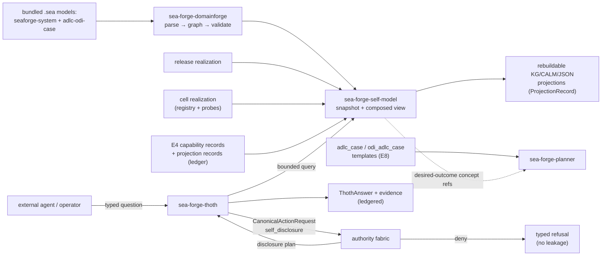

# SEA Forge — ADLC/ODI Semantic Seeding, Genesis Self-Model, and Thoth Governed Epistemic Interface

Status: Draft v0.1

Scope: Rust (stable, edition 2021), Linux primary / macOS secondary. Extends the `spec-full.md` workspace with two new crates and three new extension capabilities. Kernel crates stay synchronous; nothing in this spec adds an async kernel dependency.

Purpose: Give SEA Forge (a) a shipped, versioned semantic representation of itself and of the Agentic Development Lifecycle (ADLC) / Outcome-Driven Innovation (ODI) methodology it hosts, so no installation starts semantically empty; (b) built-in ADLC/ODI case templates so agent-development work runs as governed cases with outcome-provenanced settlement criteria; and (c) Thoth, an internal governed agent that is the only interface through which other actors may ask SEA Forge about itself — answering with evidence-linked, disclosure-controlled, authority-conferring-nothing claims.

Owner: SEA Forge core team

Prerequisite: **`spec-full.md` implemented and green through M8** (the `.agents/plans/2026-07-11-spec-full-implementation.md` plan complete, P1–P4b and all milestone gates unchanged). This spec never redefines kernel types, the ledger, the authority fabric, record formats, or fail-closed rules — it extends them. Where this spec is silent, `spec-full.md` governs; where both are silent, `spec-minimum.md` governs.

Companion inputs: `.agents/specs/adlc_odi_seaforge_case_kg_seed.sea` (the existing ADLC/ODI/case-substrate ontology seed), the DomainForge semantic boundary (`spec-full.md` §7.0a), plan templates (E8), settlement-criteria provenance (M2c `OriginRef`/`SettlementCriteriaRecord`), capability records (E4), and governed memory (E7).

## 0. Spec Frame

1. What should be built? — Three extension capabilities in milestone order: **E11 Genesis Self-Model** (bundled canonical `.sea` self-model plus the ADLC/ODI ontology seed, validated through DomainForge, realized per release and per installation, projected rebuildably), **E12 ADLC/ODI case templates** (built-in versioned plan templates that encode the ADLC control loop and ODI outcome provenance using only existing kernel elements), and **E13 Thoth** (a typed, authority-gated question/answer protocol over the self-model, implemented as the internal crates `sea-forge-self-model` and `sea-forge-thoth`).
2. What result should it produce? — A fresh installation that can answer, through Thoth, "what is SEA Forge, what can it do here, what has it proven, and what may I know about that" with grounded, evidence-linked claims; and agent-development work that runs as ADLC-shaped cases whose settlement criteria carry ODI desired-outcome provenance.
3. How will we know the result is real? — Milestone gates in §17. A milestone that cannot pass spec-minimum proofs P1–P4b and all spec-full milestone gates unchanged has broken the kernel and MUST be rejected.
4. What capability should get stronger after repeated use? — The demonstrated-self layer: every settled projection, template instantiation, and Thoth disclosure updates the evidence-backed capability view, so Thoth's answers about "what this installation has actually demonstrated" become more complete and never more confident than the ledger supports.
5. What evidence proves the capability claim? — Self-model snapshots hash-linked to release + DomainModelRef; realization overlays hash-linked to extension registry, environment contracts, and toolchain probes; every material Thoth claim linked to snapshot + evidence + settlement refs; deterministic replay of the same question against the same snapshot.
6. What fails safely? — An invalid, missing, or hash-drifted self-model halts self-model consumers (Thoth answers `unknown`/denied, never guesses); disclosure-policy absence denies disclosure; a restricted question is refused without leaking the restricted facts; Thoth claims never confer execution authority; Thoth cannot settle or promote its own claims.
7. What must repeat until reliable? — §13/§17: denial-without-leakage tests, declared-vs-demonstrated distinction tests, snapshot-replay determinism, and ADLC template reactivation (non-waterfall) scenarios.
8. What changes when evidence disagrees with the design? — §5 claim table. Notably: if typed questions prove too rigid for real agent consumers, the protocol grows new typed question kinds — it never falls back to raw graph query exposure.

## Normative Language

RFC 2119 keywords as in `spec-minimum.md`. `Implementation-defined` likewise.

## 1. Problem Statement

SEA Forge governs capability claims for everything except itself, and it hosts agent-development work without a shipped representation of the lifecycle that work follows.

Job-to-be-done:

- When an agent (or operator) needs to plan work with SEA Forge, it needs to know what the system is, which operations exist, what authority they require, which projections/toolchains are actually realizable in this installation, and what has genuinely been demonstrated — without inferring all of that from CLI help, Rust types, and docs (the fragmented folklore SEA Forge exists to eliminate).
- When a team develops an agentic product, they need the ADLC's seven phases and ODI's outcome measurement to run as a governed case — sentry-activated, evidence-settled, reactivatable — not as a checklist with agent branding.

Current failure modes (of the M8-complete system, honestly stated):

- The system ships semantically empty: DomainForge can build knowledge graphs of client domains, but SEA Forge has no graph of itself. An agent asking "can this installation project TLA+?" gets no governed answer.
- Capability declarations and capability evidence are conflated by every consumer that reads docs instead of `CapabilityRecord`s: "supported" in a README reads the same as "proven under variation" in the ledger.
- The ADLC/ODI ontology exists (`adlc_odi_seaforge_case_kg_seed.sea`) but nothing loads, validates, versions, or projects it; ODI desired outcomes have no standard mapping onto the M2c settlement-criteria provenance that already exists to carry exactly that meaning.
- Any future "ask the system about itself" surface built ad hoc would make the LLM prompt the security boundary (retrieve-everything-then-redact), which the authority fabric exists to prevent.

Important boundaries:

- **The canonical self-model belongs to SEA Forge, not to Thoth.** Thoth is a policy-governed interpreter and one component *inside* the model. Otherwise Thoth would both make claims about the system and define what is true about it — circular self-certification.
- **Self-knowledge confers no authority.** A Thoth answer describing an operation is never permission to perform it; execution still requires the normal authority → sandbox → evidence → settlement path.
- **ODI and ADLC are semantic content, not kernel law.** No new kernel record types are minted for them: desired outcomes are settlement criteria with origin provenance; products are artifact-catalog entries at the `product` stage; observed outcomes are trace/settlement inputs; repeated reliable effect is a `CapabilityRecord`. Opportunity scoring (importance/satisfaction ranking, valuation) stays outside the kernel per spec-full §2.4.

## 2. Goals and Non-Goals

### 2.1 Goals

- G1 **Genesis Self-Model (E11)**: SEA Forge MUST ship with a versioned canonical `.sea` system model (`godspeed.seaforge.system`) representing its identity, architecture, crate/component responsibilities, extension ABI, first-party extensions, protected operations and authority surfaces, case-management semantics, trace/evidence/settlement distinctions, sandbox and environment semantics, projection capabilities (including per-target limitations such as the Cedar permissive-baseline caveat), artifact/capability lifecycle, failure and escalation modes, and assurance levels. The existing `adlc_odi_seaforge_case_kg_seed.sea` ships alongside it as the methodology seed. On init or upgrade, both MUST validate through the M0 DomainForge adapter and produce rebuildable projections; validation failure is a typed halt of self-model consumers, never a silent degrade.
- G2 **Three-view separation**: the self-model MUST keep *declared* (canonical ontology + release realization), *observed* (installation/cell realization: installed extensions, available toolchains, environment contracts, degraded/missing components), and *demonstrated* (evidence-backed capability projection from ledgered `CapabilityRecord`s, `SettlementDeclaration`s, and `ProjectionRecord`s) as distinct, separately sourced layers. A declared capability MUST NOT be reported as demonstrated; the graph MUST represent absence and uncertainty (`unsupported | not_installed | disabled_by_policy | unavailable_in_environment | implemented_unvalidated | validated_not_activated | activated_not_proven | proven_narrow_variation | degraded | deprecated | quarantined`).
- G3 **Rebuildability**: every self-knowledge projection (KG/Turtle, CALM, JSON snapshot) is a rebuildable projection per the existing ProjectionRecord ABI (spec-full §7.0b) — never a second source of truth. A bundled pre-generated projection MUST carry source-model hash, DomainForge version, adapter version, parameters, output hash, and release ID, and MUST be verified or regenerated before use.
- G4 **ADLC case templates (E12)**: built-in versioned plan templates (E8 machinery) MUST encode the ADLC as a case: containment stages (Frame → Form → Build → Activate or the ODI-extended seven-stage shape), sentry-driven activation, milestone-recorded settled progress, and reactivation paths (rejected simulation reactivates design; drift evidence activates remediation) so the lifecycle is a replayable control loop, not a waterfall. Discretionary items remain the governed path for newly discovered work.
- G5 **ODI outcome provenance**: templates and plan proposals MUST be able to bind a settlement criterion to an ODI desired-outcome via the existing M2c `OriginRef` mechanism (a new `OriginRefKind` for desired-outcome references into the validated seed model, carried as DomainForge concept refs). ODI analysis (importance/satisfaction/opportunity computation) runs as ordinary sandboxed plan items whose results settle as evidence; the kernel never ranks opportunities.
- G6 **Thoth typed protocol (E13)**: other actors never query the self-model directly. They submit typed questions (`AskCapability`, `AskOperationRequirements`, `AskAuthorityRequirements`, `AskProjectionSupport`, `AskEnvironmentStatus`, `AskFailureExplanation`, `AskEvidenceForClaim`, `AskAvailableAffordances`, `AskWhyDenied`) to Thoth. Each question is a protected SEA Forge operation: classified, authority-checked against a new `self_disclosure` policy surface, answered from a bounded semantic query, and evidenced.
- G7 **Disclosure before retrieval**: the disclosure decision constrains the semantic query itself (permitted claim classes, permitted graph regions) *before* retrieval. Thoth MUST NOT retrieve broadly and rely on the answer generator to redact. Prompt text is never the security boundary.
- G8 **Grounded answers**: every material Thoth response is machine-readable (`ThothAnswer`), carries claim-status distinctions (`declared | installed | available | validated | demonstrated | degraded | unsupported | unknown`), links every claim to its self-model snapshot, evidence, and settlement refs, states omitted claim classes and limitations, and explicitly states that knowledge confers no execution authority. The same question against the same snapshot replays deterministically.
- G9 **No self-certification**: Thoth is an `R-AA` actor under the existing identity rules (sponsor required for privileged operations). It MAY submit evidence but MUST NOT act as settlement authority for its own claims, promote its own capability records, or mutate the canonical self-model.

### 2.2 Non-Goals

- An LLM-powered conversational layer over the Thoth protocol. The first version is typed questions → typed answers; a conversational surface is a later client of the protocol (roadmap), and when it arrives the LLM is a *presenter* of grounded claims, never a claim source.
- Autonomous Thoth planning, task decomposition, or tool execution (the Hermes-derived agent loop). Reverse-engineering Hermes Agent's core is a roadmap activity; this spec ships the constitutional substrate (protocol, disclosure, grounding) that any such loop must run inside. Hermes assumptions that MUST be rejected on arrival: tool visibility = authority, retrieval = permission to disclose, ungoverned transcript memory, agent-owned execution, tool return = settlement.
- Direct graph-query access for external agents (SPARQL endpoints, raw KG reads). The KG projection files exist for tooling; the *governed answer surface* is Thoth only.
- Customer-editable base graph. Clients overlay (customer domain model, project/case models) via DomainForge import/namespace semantics; they never rewrite `godspeed.seaforge.system` or the release realization.
- ODI market-research tooling, opportunity-scoring algorithms, importance/satisfaction survey machinery, or any valuation. Sandboxed plan items + evidence + settlement govern those computations; their content is out of scope (spec-full §2.4 boundary with CognitiveOS/GodSpeed-Agent stands).
- Inference-aggregation disclosure budgets (detecting reconstruction of restricted facts across many individually-permitted questions). Roadmap: the per-question disclosure evidence trail this spec requires is the substrate such analysis needs; the analyzer itself is future work.
- A Thoth network service. Thoth is an internal crate + first-party extension reached through the existing CLI and `sea-forge-server` Unix-socket surfaces; no new listener.
- New kernel record kinds for ADLC phases or ODI concepts. Semantic roles project through existing elements (criteria, artifacts, evidence, settlement, capability).
- Multi-tenant disclosure isolation beyond the existing entity/process/case scoping. Cross-tenant claims are simply a denied claim class until federation (E6) matures.

## 3. Outcome Contract

### 3.1 Output Produced

Everything in spec-full §3.1, plus:

- `models/seaforge-system@<version>.sea` (bundled, read-only at runtime) — the canonical Genesis Self-Model; `models/adlc-odi-case@<version>.sea` — the methodology seed (content: the current `adlc_odi_seaforge_case_kg_seed.sea`, versioned and namespaced). Both are release artifacts with recorded SHA-256; installations reference, never edit, them.
- `.sea-forge/self-model/snapshots/<snapshot_id>.json` — immutable `SelfModelSnapshot` records: DomainModelRef of the validated canonical model + seed, release realization digest, cell realization digest, capability-projection digest, created_at. Ledgered in a `self_model.v1` envelope.
- `.sea-forge/self-model/realization/release.json` — release realization: crate versions, record schema versions, built-in extensions, projection targets with per-target limitations, supported platform classes, bundled templates/environments/models. Generated at build/release time, hash-pinned.
- `.sea-forge/self-model/realization/cell.json` — installation realization: installed/active extensions (from the extension registry), environment contracts present, toolchain probe results (e.g. `tla2tools: unavailable`), sandbox classes available on this host, degraded/missing components. Rebuildable from registry + probes; probe runs are evidenced.
- `.sea-forge/self-model/projections/` — rebuildable KG/CALM/JSON projections of the composed self-model. Each payload is an ordinary `ProjectionRecord` (spec-full §7.0b) with `projection_kind: kg | calm | self_model_snapshot`, carried in a `self_model.v1` envelope.
- `<source-owned built-in template assets>/adlc_case@<version>.yaml` and `<source-owned built-in template assets>/odi_adlc_case@<version>.yaml` — built-in E8 templates (E12). The built-in installer materializes pinned runtime copies under `<root>/templates/`; no tracked template belongs under `.sea-forge/`.
- `.sea-forge/thoth/questions.jsonl` and `.sea-forge/thoth/answers.jsonl` — append-only compatibility views of ledgered `ThothQuestion` / `ThothAnswer` records; the ledger remains authoritative.
- `.sea-forge/authority/policy-bundles/…` gains the `self_disclosure` surface (§8.2).

### 3.2 Outcome Verified

Per milestone gates in §17. Globally: P1–P4b and every spec-full milestone gate MUST pass unchanged at every milestone of this spec. Every new record kind satisfies the P2-style cross-linkage proof. A Thoth answer MUST NOT be emitted while its snapshot fails hash verification.

### 3.3 Consumer and Handoff

Consumers: external agents and operators (Thoth protocol via CLI `sea-forge ask …` and the server socket), case planners instantiating ADLC/ODI templates, downstream KG tooling reading the rebuildable self-model projections, and future conversational/UI clients of the Thoth protocol. Handoff completes per spec-full §3.3; `sea-forge ask` exits 0 (answered), 4 (disclosure denied — a successful governance outcome), or 1 (internal error, including self-model integrity failure).

## 4. Capability Claim

After repeated use, agents and operators should be better able to (a) plan against what this installation can actually do — `sea-forge ask capability <name>` instead of docs-folklore — with declared/observed/demonstrated never conflated, (b) run agent-development efforts as ADLC cases whose progress is committed events → sentries → settlement → milestones rather than status-field edits, (c) trace any settlement criterion in an ODI-templated case back to the desired-outcome concept that justified it, and (d) trust that what Thoth refuses to disclose stays undisclosed even under adversarial questioning.

Proven only if:

- Self-model snapshots and all projections rebuild byte-identically (modulo `rebuilt_at`) from bundled models + realization sources + ledger records.
- Thoth answers about a capability with accepted-but-unproven observations report `validated` or lower, never `demonstrated`; a capability whose toolchain probe fails reports `unavailable_in_environment` even though it is declared.
- At least one denial is exercised end-to-end: a restricted question class is refused, the refusal names only the claim class denied, and a transcript diff proves no restricted fact appeared in any output channel.
- An ADLC-templated case demonstrates non-waterfall reactivation: a rejected simulation settlement re-enables a design plan item via sentry, with the full event chain in the ledger.
- An ODI-templated case's criteria records resolve, via `OriginRef`, to desired-outcome concept refs in the validated seed model, and `verify_plan_criteria` passes.

Not proven by: the seed file existing in the repo; a bundled Turtle file; Thoth answering questions no policy restricts; one green template instantiation; documentation.

## 5. Evidence and Claim Discipline

| Claim | Level | Required evidence | Current evidence | Gap |
|---|---|---|---|---|
| The M8 substrate already carries ADLC/ODI semantics without new kernel types | Evidence-backed (by spec + implementation) | E12 gate: templates instantiate to ordinary CasePlans; criteria carry OriginRefs | E8 templates, M2c OriginRef/SettlementCriteriaRecord, sentries, milestones, discretionary items all implemented and green | wire desired-outcome OriginRefKind + build the templates |
| The `.sea` seed parses and validates through domainforge-core 0.13.0 | Evidence-backed | M9 gate: `load_validate` green on both bundled models via the M0 library adapter | `domainforge 0.13.0` CLI (workspace build): `validate --format human` ⇒ "Validation succeeded: 0 violations total"; `parse --ast --format json` ⇒ exit 0; `project --format kg` ⇒ Turtle emitted. Run 2026-07-14 against seed sha256 `2ea06fc9c59d28fac9b9d47f18c4787b2ffb740b0527513a70556cf91dcbffc5` | **Closed by M9 (2026-07-17):** both bundled models (`models/seaforge-system@0.1.0.sea`, `models/adlc-odi-case@0.1.0.sea`) pass the in-process `load_validate`; seed hash pinned as `SEED_MODEL_SHA256` in the release realization; T9.1 green. |
| Declared/observed/demonstrated separation prevents capability inflation | Assumption grounded in E4's threat model | M9/M11 tests: declared-only capability never answered above `installed`; probe failure downgrades to `unavailable_in_environment` | E4 already refuses promotion without qualifying declarations | extend the same discipline to self-description |
| Typed questions cover real agent planning needs | Assumption | M11 dry run: an external agent plans a projection task using only Thoth answers | none | if too rigid: add question kinds; never expose raw graph query |
| Disclosure-before-retrieval is enforceable at the semantic query layer | Assumption | M11 gate: bounded query provably touches only permitted regions (query plan recorded as evidence) | authority fabric + memory-recall scoping (E7) prove the pattern at record level | implement claim-class → graph-region binding |
| Deterministic replay of answers is achievable | Evidence-backed (by pattern) | M11 replay test | all existing projections are deterministic by ABI rule | keep answer generation pure over (question, snapshot, policy) |
| Hermes Agent core is a suitable base for a later Thoth loop | Roadmap | — | reference only | not required for conformance of this spec |
| Inference-aggregation leakage is a real risk needing budgets | Roadmap | disclosure evidence trail exists (this spec) | none | analyzer is future work; evidence substrate ships now |

## 6. System Overview

### 6.1 Architecture Pattern

- Pattern: unchanged (library kernel + one-shot CLI + optional Tokio server). The two new crates are synchronous kernel-side libraries; the server exposes Thoth over the existing Unix-socket NDJSON protocol as new request kinds, driven on `spawn_blocking` like runs.
- Patterns rejected: a Thoth daemon/service (no new listener); an embedded triple-store or SPARQL engine (bounded typed queries over the DomainForge in-memory graph + realization JSON suffice; revisit only if a measured query workload fails); LLM-in-kernel (spec-full non-goal stands).

### 6.2 Main Components

| Crate | New/extended | Content (milestone) |
|---|---|---|
| `sea-forge-self-model` | new | bundled-model loading + hash verification, DomainForge validation via `sea-forge-domainforge`, release/cell realization assembly, `SelfModelSnapshot`, composed-view accessor, bounded semantic query primitives, capability-projection join against E4 records (M9) |
| `sea-forge-thoth` | new | typed question/answer protocol types, question classification, disclosure planning, bounded query execution via `sea-forge-self-model`, grounded-claim assembly, answer envelope, replay (M11). Protocol types live in a `protocol` module; split into `sea-forge-thoth-protocol` only when an external consumer needs the types without the engine (ponytail: one crate until then) |
| `sea-forge-planner` | extended | `OriginRefKind::DesiredOutcome` handling; template params for outcome concept refs (M10) |
| `sea-forge-authority` | extended | `self_disclosure` policy surface: claim-class grants per role/actor, default deny (M11) |
| `sea-forge-domainforge` | extended | namespace-overlay composition (system model + seed + future client overlays) within existing `SeaSourceSet` semantics (M9) |
| `sea-forge-cli` | extended | `sea-forge self-model validate|rebuild|show`, `sea-forge ask <question-kind> [args]` (M9/M11) |
| `sea-forge-server` | extended | `ask` request kind on the existing socket protocol (M11) |

#### Component Diagram



### 6.3 External Dependencies (beyond spec-full)

None. `domainforge-core` (pinned per spec-full §6.3), the ledger, E8 templates, and E4 records already provide every mechanism this spec composes. Toolchain probes shell out only to already-declared environment-contract commands under the existing sandbox rules.

## 7. Core Domain Model — extensions only

All spec-full entities stand. New/extended records are ledgered per §7.0c. Existing v0.2 records remain v0.2; E11's new self-model records and self-model projection envelopes use `schema: self_model.v1` (§7.7).

### 7.1 SelfModelSnapshot (E11)

- `schema: self_model.v1`, `snapshot_id` (`smsnap_` + ULID-derived), `release_id`, `created_at`.
- `system_model_ref` (DomainModelRef — the validated `godspeed.seaforge.system` source set).
- `seed_model_refs` (array of DomainModelRef — `godspeed.adlc_odi_case` and future seeds).
- `release_realization_sha256`, `cell_realization_sha256`.
- `capability_projection_sha256` — hash of the canonical demonstrated-self join (sorted capability names → status/evidence refs) at snapshot time.
- `snapshot_hash` — hash of canonical `{system_model_ref.semantic_model_sha256, seed refs, three realization/projection hashes, release_id}`.

A snapshot is created on first-root initialization, on detected release upgrade, on extension install/adopt/disable, and on demand (`sea-forge self-model rebuild`). One shared initialization service and one extension-registry mutation service own these triggers for both CLI and server. A failed rebuild records `self_model_error`, preserves the prior snapshot as verifiable but stale, and never rolls back a committed extension mutation. Thoth answers always name exactly one snapshot. A stale snapshot (any source hash drifted) is `freshness: stale`; answering from it is permitted only with `freshness` disclosed, and rebuild is required before `assurance` above `local_tamper_evident` may be claimed.

### 7.2 Realization records (E11)

**ReleaseRealization**: `release_id`, `kernel_version`, `record_versions`, `crates` (name → version), `built_in_extensions` (descriptor refs), `projection_targets` (array of `{target, adapter_ref, limitations[], required_toolchain[]}`), `bundled_templates`, `bundled_environments`, `bundled_models` (`{uri, sha256}`), `generated_at`. Generated at release-build time; installations verify, never regenerate, it.

**CellRealization**: `cell_id` (E6 field), `active_extensions` (from registry, with status), `environments_present`, `toolchain_probes` (array of `{tool, required_by, probe_command_ref, result: available|unavailable|version_mismatch, evidence_ref}`), `sandbox_classes_available`, `degraded_components`, `probed_at`. Rebuildable from the extension registry plus evidenced probe runs; probes are ordinary authority-checked executions.

### 7.3 Claim model (E13)

**ClaimStatus** (enum, total order for capping): `unknown < unsupported < declared < installed < available < validated < demonstrated`; orthogonal flags `degraded`, `deprecated`, `quarantined`, `disabled_by_policy`, `unavailable_in_environment`, `proven_narrow_variation`. Derivation is fixed: `declared` from the canonical model; `installed` requires the release/cell realization; `available` additionally requires toolchain probes green and not disabled; `validated` requires at least one accepted ProjectionRecord/settlement for the capability in this cell; `demonstrated` requires an E4 `CapabilityRecord` at `demonstrated` or better, cited by ref. Status is always computed as the *minimum* the evidence supports; missing evidence caps, never elevates.

**ClaimClass** (disclosure vocabulary): `identity | architecture | declared_capability | installed_capability | demonstrated_capability | authority_requirements | environment_status | failure_condition | security_implementation | customer_private | credential_bearing | policy_thresholds`. The last four default to deny for every actor; there is no built-in rule that allows them.

**GroundedClaim**: `claim_id`, `claim_class`, `subject` (concept ref or capability name), `status` (ClaimStatus + flags), `statement` (string, generated deterministically from typed fields — never free-form model output), `snapshot_ref`, `evidence_refs`, `settlement_refs`, `capability_record_ref` (nullable), `limitations` (array; e.g. the Cedar baseline caveat carried from the release realization), `authored_by` (immutable actor identity when Thoth authors the claim).

### 7.4 ThothQuestion / ThothAnswer (E13)

**ThothQuestion**: `question_id` (`thq_` + ULID-derived), `kind` (enum: `ask_capability | ask_operation_requirements | ask_authority_requirements | ask_projection_support | ask_environment_status | ask_failure_explanation | ask_evidence_for_claim | ask_available_affordances | ask_why_denied`), `subject` (typed per kind), `actor_id`, `process_id`, `case_id` (nullable — case-scoped questions may unlock case-scoped claims), `purpose` (string ≤ 500), `asked_at`.

**DisclosurePlan** (evidence, not a persisted view): `question_id`, `authority_decision_ref`, `permitted_claim_classes`, `permitted_regions` (sorted concept-ref/namespace patterns the bounded query may touch), `omitted_claim_classes`.

**ThothAnswer**: `answer_id` (`tha_` + ULID-derived), `question_id`, `disposition` (enum: `answered | partial | denied`), `claims` (array of GroundedClaim; empty when denied), `omitted_claim_classes`, `snapshot_ref`, `freshness` (`current | stale`), `assurance` (ledger assurance vocabulary from spec-full §7.0c), `limitations`, `authority_notice` (fixed string: answers confer no execution authority), `answered_at`. Denials carry only `kind`, the denied claim classes, and `ask_why_denied` eligibility — no subject-derived detail beyond what the question itself contained.

### 7.5 ODI provenance (E12)

**OriginRefKind** gains `desired_outcome`: an `OriginRef` whose `reference` is a canonical DomainForge concept ref and whose additive typed `domain_model_ref` field is REQUIRED for this kind and absent for legacy kinds. It names a Desired Outcome Criterion entity in a validated seed/client model. The bound source/model hash covers the concept/model tuple. `SettlementCriteriaRecord.origin_refs` MAY include any number of these; `verify_item_criteria` extends to check model hash, concept membership, and expected class through a resolver at plan-commit time. No other criteria semantics change: a desired-outcome ref explains *why* a criterion exists; the criterion's checks still decide settlement.

**Templates**: `adlc_case@0.1.0` encodes stages Frame (preparation/hypothesis, scope, `ProblemFramed` milestone), Form (design, simulation, `DevelopmentAuthorized`), Build (implementation, continuous evaluation, `ReleaseCandidateAccepted`), Activate (controlled deployment, production observation, `ActivationSettled`) with reactivation sentries (e.g. the named simulation's `settlement_status: rejected` re-enters design via repetition markers) and a discretionary-item slot. `odi_adlc_case@0.1.0` prepends job-framing and outcome-discovery/selection stages and parameterizes desired-outcome concept refs. E8 template items therefore carry entry/exit criteria, parent stage, and dependencies; instantiation projects them byte-for-byte to a CasePlan. Sentry predicates evaluate the event from their named source, not any matching event in the case. Both are ordinary E8 templates: zero privilege, full schema validation, deterministic instantiation.

### 7.6 Identifiers

New prefixes: `smsnap_`, `thq_`, `tha_` follow the spec-full ULID-backed record rules. All other ID grammar unchanged.

### 7.7 Self-model record compatibility

`SelfModelSnapshot`, `ReleaseRealization`, `CellRealization`, and self-model projection records are new record kinds with `schema: self_model.v1`; this is an additive record family, not a global v0.2-to-v0.3 migration. The latter projection records carry an existing `ProjectionRecord` payload but use the `self_model.v1` envelope as their ledger type boundary.

`ProjectionKind` gains `kg` and `self_model_snapshot`. Because existing readers use a closed enum, an older binary MUST inspect the record type/schema before deserializing the payload. It MUST skip an unsupported `self_model.v1` record with an explicit unsupported-record result while preserving ledger verification and replay of supported records. It MUST NOT attempt to decode a new projection kind into an old enum, fail mid-replay, or treat the record as verified content it can interpret. Federation/import negotiates this record schema before transfer. M9 proves both new variants against an old-reader fixture; no global record-version bump is authorized by this spec.

## 8. Configuration and Input Contract

### 8.1 Sources and Resolution

Unchanged precedence (CLI flags > defaults). New flags: `sea-forge ask --purpose <text> --case <case_id>`; `sea-forge self-model rebuild [--probe]`. Bundled model paths are compiled-in release constants, overridable only by a `--system-model <path>` developer flag that forces assurance to `local_tamper_evident` and marks every derived snapshot `developer_override: true`.

### 8.2 Required Config Fields — `self_disclosure` policy surface

Added to the AuthorityPolicyBundle `sources` as a first-class surface (spec-full §7.0 list gains `self_disclosure`):

```yaml
policy_surfaces:
  self_disclosure:
    mode: deny-by-default
    grants:
      - name: agents-may-plan
        actor_role: agent
        claim_classes: [identity, architecture, declared_capability,
                        installed_capability, demonstrated_capability,
                        authority_requirements, environment_status]
      - name: operators-see-failures
        actor_role: operator
        claim_classes: [failure_condition]
```

Validation: unknown claim classes are `schema_error`; a grant naming `security_implementation`, `customer_private`, `credential_bearing`, or `policy_thresholds` is a `schema_error` unless it also sets `explicit_high_risk: true` and names a compensating control (mirrors the degraded-operation rule). Absent surface ⇒ every question denies. Fail-open modes are schema errors, as everywhere in the fabric.

### 8.3 Config Error Classes

Spec-full classes apply. New: `self_model_error` (bundled model missing, hash mismatch, DomainForge validation failure, snapshot-source drift) — blocks self-model consumers and `ask`; runs and all other work proceed unaffected.

### 8.4 Dynamic Reload

Server: disclosure policy reloads with the existing bundle reload (last-known-good on invalid). Snapshots never reload implicitly; `rebuild` is explicit or event-driven per §7.1.

### 8.5 Startup and Preflight

First-root initialization occurs only when the installation manifest is absent. Upgrade occurs only when the manifest's release ID or supported schema set changes. Both enter the same initialization service: verify bundled model hashes against the release realization → `load_validate` both models → assemble/verify realizations → write snapshot → (optionally) rebuild projections. Extension install, adopt, and disable enter one registry-mutation service that commits the mutation, marks the current snapshot stale, and requests the same rebuild. Any failure: typed `self_model_error`, exit 1 for self-model commands; other subsystems and the committed registry mutation remain intact. Retrying is safe and never rewrites an immutable snapshot.

### 8.6 Primary Input Contract

`sea-forge ask <kind> <subject> [--purpose <text>] [--case <id>]`. Unknown kind: usage error, exit 2. Well-formed question whose class is denied: governed refusal, exit 4 (a passing governance outcome, mirroring spec-minimum §9.5). Question strings are data; subjects are validated against the typed per-kind schema before any authority call.

## 9. Operational Flow and State Model

### 9.1 Flow Summary (Thoth question)

```text
parse typed question → classify (kind → candidate claim classes)
  → CanonicalActionRequest {resource_type: self_disclosure,
       parameters: {kind, claim_classes, subject_digest, snapshot_ref, freshness_requirement}}
  → authority decision (ledgered)
  → deny ⇒ ThothAnswer{disposition: denied} + evidence → exit 4
  → allow ⇒ DisclosurePlan (permitted classes ∩ candidate classes, permitted regions)
  → bounded semantic query over snapshot (query plan recorded as evidence)
  → claim derivation (status = min supported by evidence; join E4/projection records for demonstrated)
  → ThothAnswer assembly (deterministic) → ledger commit → views → exit 0
```

ADLC/ODI case flow is the existing M2 case loop; this spec adds no new case states.

### 9.2 States (of a question)

`received → classified → authority_decided → (denied | planned) → queried → answered`. All terminal records ledgered; no state is resumable (questions are cheap; re-ask).

### 9.3–9.5 Rules, Triggers, Nuances

- Classification is total: every kind maps to a fixed candidate claim-class set at compile time; there is no "unclassified question" path (malformed input never reaches authority).
- **A denial is not an error.** It produces a complete evidence chain and exits 4.
- `ask_why_denied` answers only from the denial's own recorded decision (reason codes, denied classes) — never by re-running the underlying query.
- Snapshot selection: newest non-stale snapshot; if all are stale, answer with `freshness: stale` disclosed or refuse if policy requires freshness (`require_fresh_snapshot: true` per grant, implementation-defined default false).
- Case-scoped questions (`--case`) may add case-region permissions only when the actor already passes the existing case-read authority for that case; Thoth never widens case access.

## 10. Core Behavior Requirements

### 10.1 Self-model integrity (E11)

- The implementation MUST verify bundled model bytes against release-realization hashes before every `load_validate`; mismatch is `self_model_error`, never a warning.
- Composition (system model + seeds + overlays) MUST go through DomainForge namespace semantics; the composed DomainModelRef covers all sources (spec-full §7.0a rules apply unchanged).
- Realization and capability-projection joins MUST read only ledger-verified records; an unverifiable ledger scope excludes its records from the demonstrated view (capping status) rather than failing the snapshot.
- All self-model projections go through the ProjectionRecord ABI: deterministic, validated, quarantining, rebuildable, settled.
- The release realization is generated from explicit release metadata or `SOURCE_DATE_EPOCH`; wall-clock build time is not an input to its hash. Cargo build scripts may write only to `OUT_DIR`; installations verify the release realization and never regenerate it.

### 10.2 Claim derivation (E13)

- Status MUST be computed by the fixed ladder in §7.3; each rung's justification is an explicit ref (realization entry, probe evidence, ProjectionRecord, CapabilityRecord). A claim missing a rung's ref MUST NOT report that rung.
- Statements are template-generated from typed fields. Free-form text generation is prohibited in this spec's scope.
- Limitations recorded in the release realization for a target MUST propagate into every claim about that target (the Cedar permissive-baseline caveat is the canonical example).
- Absence is first-class: a question about an undeclared capability answers `unsupported`, with the snapshot ref proving the search space, not an error.

### 10.3 Disclosure enforcement (E13)

- The permitted-regions set MUST be applied inside the query executor (the query cannot construct results from non-permitted regions), and the executed query plan MUST be committed as evidence so the boundary is auditable.
- Denied claim classes are named in the answer *as classes only*. The implementation MUST NOT vary denial messages by restricted content (no oracle behavior: asking about two different restricted subjects yields byte-identical denial shapes apart from IDs/timestamps).
- Thoth's own operations are the most-governed path: every question is a protected action; Thoth has no bypass, no ambient reads, and its identity binding requires a sponsor for any grant beyond the default agent classes.
- A Thoth-authored claim carries immutable `authored_by` provenance. Settlement declaration and capability-promotion inputs bind that provenance and MUST reject the same actor as declarer or promoter. Re-labeling, copying, or replaying a claim cannot remove the binding.

### 10.4 ADLC/ODI templates (E12)

- Template instantiation, validation, and provenance follow E8/M2c with the additive E8 control-flow vocabulary in §7.5. The templates MUST pass instantiation-determinism and forbidden-substitution gates. Parameters remain forbidden in IDs, names, item kinds, sentry event kinds, sentry source IDs, and sandbox classes.
- Desired-outcome OriginRefs MUST resolve against a validated model at plan-commit time; unresolvable refs are `criteria_provenance_error` before authority (fail before side effects).
- Reactivation is expressed entirely in source-bound sentries/repetition markers; the implementation MUST NOT add engine state to support it. A settlement from one item MUST NOT satisfy a predicate bound to another item.

### 10.5 Completion Rules

A milestone of this spec is complete only when its §17 gate passes, all prior gates (both specs) pass unchanged, and `cargo fmt`/`clippy -D warnings`/`test --workspace`/`just proof`/`just no-async-kernel` are green.

## 11. Execution / Integration Contract

### 11.1 Invocation

- `sea-forge self-model validate` — verify + `load_validate` + report; exit 0/1.
- `sea-forge self-model rebuild [--probe]` — new snapshot (+ probe runs); exit 0/1.
- `sea-forge self-model show [--json]` — composed view summary from newest snapshot.
- `sea-forge ask <kind> <subject> [--purpose] [--case] [--json]` — one question; exit 0/4/1/2.
- Server socket: `{"op":"ask", "question": ThothQuestion}` → `ThothAnswer` NDJSON reply, same governance path as CLI.
- `sea-forge run --template adlc_case@0.1.0 --param …` — existing E8 surface.

### 11.2 Response Contract

`--json` emits the full `ThothAnswer`; human output renders claims as `subject: status (assurance, freshness) — statement [refs]` lines plus the authority notice. Machine consumers MUST rely only on the JSON shape.

### 11.3 External Side Effects

Probe executions (sandboxed, evidenced). Nothing else: Thoth performs no writes outside `.sea-forge/` records and no network.

## 12. Evidence, Proof, and Observability

### 12.1 Required Evidence Artifacts

Per question: ledgered question, authority decision, disclosure plan + query plan evidence, answer. Per snapshot: validation evidence for each model, realization digests, probe evidence refs. Per template case: everything M2/M2c already requires, plus resolvable desired-outcome OriginRefs.

### 12.2 Proof Commands

```text
sea-forge self-model validate                      # models parse+validate, hashes match
sea-forge self-model rebuild && sea-forge ledger verify
sea-forge ask ask_projection_support tla --json    # declared-but-unavailable case
diff <(ask …) <(ask …)                             # replay determinism (same snapshot; IDs/timestamps normalized)
sea-forge ask ask_capability <restricted> --json   # exit 4, denial shape check
jq over answers.jsonl                              # every claim ref resolves
```

### 12.3 Logs, Metrics, Traces

Question lifecycle emits ordinary trace events in the acting scope's stream. No new metrics system; counts are derivable from the ledger.

## 13. Repeatability and Variation Requirements

- V1: same question, same snapshot, 10× — identical claims (modulo IDs/timestamps).
- V2: same question across a snapshot change (extension disabled between) — status visibly downgrades; old answer remains reproducible against the old snapshot.
- V3: ADLC template case with simulation rejected twice then accepted — design item re-activates twice via repetition, case completes; full chain replayable from the ledger.
- V4: adversarial denial probing — N differently-worded restricted questions yield structurally identical denials; transcript scan finds zero restricted tokens.
- V5: probe flap (toolchain removed, re-added) — environment status tracks probes with evidence, never caches availability across snapshots.

## 14. Failure Model and Recovery Strategy

### 14.1 Failure Classes

- `self_model_error` — bundled model missing/drifted/invalid. Blast radius: self-model commands + `ask`; runs unaffected.
- `disclosure_denied` — governed refusal; not a failure of the system.
- `snapshot_stale` — sources drifted since snapshot; answers disclose staleness or refuse per policy.
- `probe_error` — a probe command fails to execute; the probed tool records `unavailable` with the failure evidence (fail toward less capability, never more).
- `criteria_provenance_error` — desired-outcome ref unresolvable (existing M2c class, new trigger).

### 14.2 Safe Failure Requirements

Every class above fails closed toward *less claimed capability and less disclosure*. No failure path may substitute a default answer, elevate a claim status, or emit restricted content in an error message. A dead server mid-question leaves only ledgered partial records; re-asking is safe.

### 14.3 Recovery

`self-model rebuild` recovers from staleness/drift; quarantined projections follow the existing ledger quarantine rules; no repair rewrites history.

## 15. Security, Safety, and Trust Boundaries

- **Trust boundary**: external agents ↔ Thoth protocol. Everything past the typed-question parse is kernel-governed. The self-model and its projections are inside the boundary; only ThothAnswers cross it.
- Semantic disclosure control is *claims-based*, not file-RBAC: the unit of protection is a claim class, enforced pre-retrieval (§10.3). The four high-risk classes (`security_implementation`, `customer_private`, `credential_bearing`, `policy_thresholds`) are deny-by-default with schema-level friction to grant.
- Thoth identity: role `R-AA`, sponsor required for privileged grants. Thoth may not declare settlement or promote capability for a claim it authored. The check compares immutable authorship provenance at both the settlement and promotion boundary; it is not a role-only or advisory rule.
- Knowledge ≠ authority is structural, not advisory: `ThothAnswer` carries no grant material, and nothing in the runtime accepts an answer as an authorization input.
- The bundled models are release-signed content (hashes in the release realization, committed to the ledger at init); tampering surfaces as `self_model_error` before any answer.
- Prompt-injection surface: none in this spec's scope (no LLM). The typed protocol is the seam that keeps a future LLM presenter outside the security boundary.

## 16. Reference Algorithms

### 16.1 Claim-status derivation

```text
fn derive_status(subject, snapshot) -> ClaimStatus:
  s = unknown
  if subject in snapshot.system_model:            s = declared
  if subject in release_realization
     and registry_status(subject) == active:      s = installed   # disabled/quarantined ⇒ flag, cap at declared
  if all probes for subject available:            s = available
  if ∃ accepted ProjectionRecord/settlement
     for subject in this cell:                    s = validated
  if capability_record(subject).status
     ∈ {demonstrated, proven}:                    s = demonstrated  # cite the record
  apply flags (degraded, deprecated, narrow_variation, …)
  return s   # each rung's justification ref recorded on the claim
```

### 16.2 Disclosure resolution

```text
candidate_classes = classes_for(question.kind)            # compile-time table
decision = authority(CanonicalActionRequest{self_disclosure, candidate_classes, actor, case})
if decision != allow: return denied(candidate_classes)    # class names only
permitted = decision.granted_classes ∩ candidate_classes
regions  = regions_for(permitted, question.subject, case_scope)
plan     = DisclosurePlan{permitted, regions}             # committed as evidence
results  = bounded_query(snapshot, regions)               # executor cannot exceed regions
claims   = derive_claims(results, permitted)
return answered(claims, omitted = candidate_classes − permitted)
```

## 17. Test and Validation Matrix

### 17.1 Core Conformance — M9 (E11, Genesis Self-Model)

- T9.1: bundled `seaforge-system` and `adlc-odi-case` models verify hashes and pass `load_validate`; snapshot created with all five digest fields in a `self_model.v1` envelope; ledgered. First initialization, detected upgrade, and each registry mutation create or request the correct snapshot lifecycle transition without rewriting an old snapshot.
- T9.2: one-byte model tamper ⇒ `self_model_error` before validation; `ask` refuses; runs unaffected.
- T9.3: KG/CALM/JSON self-projections rebuild byte-identically (modulo `rebuilt_at`) and carry full ProjectionRecord provenance; bundled pre-generated projection with wrong output hash is regenerated, not trusted.
- T9.4: disabling an extension then `rebuild` ⇒ new snapshot; composed view reflects `disabled_by_policy`; old snapshot still verifies.
- T9.5: cell realization with a failing toolchain probe records `unavailable` + probe evidence.
- T9.6: an old-reader fixture skips unsupported `self_model.v1` records carrying each new projection kind (`kg`, `self_model_snapshot`) before payload deserialization; it continues to verify and replay supported records.
- Gate: P1–P4b + all spec-full gates unchanged.

### 17.2 Core Conformance — M10 (E12, ADLC/ODI templates)

- T10.1: `adlc_case@0.1.0` instantiation is byte-deterministic; passes existing E8 gates.
- T10.2: rejected simulation settlement re-enables the design item via a source-bound sentry (V3 scenario); a rejection from another item cannot satisfy it; ledger replay reproduces activation order.
- T10.3: `odi_adlc_case@0.1.0` criteria records carry `desired_outcome` OriginRefs with required `domain_model_ref`, resolving into the validated seed model; `verify_plan_criteria` green; hash changes when the outcome ref or model ref changes.
- T10.4: unresolvable desired-outcome ref ⇒ `criteria_provenance_error` before authority, no side effects.
- T10.5: discretionary item added mid-case is authority-checked and evidenced (existing M2 behavior exercised through the template).

### 17.3 Core Conformance — M11 (E13, Thoth)

- T11.1: permitted `ask_capability` on a demonstrated capability ⇒ `demonstrated` with CapabilityRecord ref; on an attempted-only capability ⇒ ≤ `validated`, never `demonstrated`.
- T11.2: declared-but-toolchain-missing target (e.g. TLA+) ⇒ `declared` + `unavailable_in_environment` + probe evidence ref.
- T11.3: restricted class question ⇒ exit 4; denial names classes only; transcript scan proves zero restricted-fact leakage; two different restricted subjects yield structurally identical denials.
- T11.4: replay determinism — same question + snapshot ⇒ identical claims (V1).
- T11.5: `ask_why_denied` answers from the recorded decision without re-query.
- T11.6: answer contains the authority notice; a contrived attempt to feed a ThothAnswer where a grant is required fails to compile / is rejected at the type level.
- T11.7: Thoth attempting to declare settlement or promote capability on a claim carrying its `authored_by` identity ⇒ SoD deny; copied or relabeled provenance cannot bypass the check.
- T11.8: absent `self_disclosure` surface ⇒ every question denied.
- T11.9: stale snapshot ⇒ `freshness: stale` disclosed, or refusal under `require_fresh_snapshot`.
- T11.10: server-socket `ask` follows the identical governance path (decision + evidence ledgered) as CLI.

### 17.4 Real Integration Test

- R1: one human/agent dry run: plan a `domain-rust` projection task using only Thoth answers (capability, requirements, authority, environment), then execute it through the normal pipeline; record whether any needed fact was unobtainable via the protocol (feeds the G6 rigidity claim in §5).

---

## Milestone order and dependencies

| Milestone | Delivers | Depends on |
|---|---|---|
| M9 | `sea-forge-self-model`, bundled models, snapshots, realizations, self-projections, `self-model` CLI | spec-full M0 (DomainForge adapter, ledger), M5 (ProjectionRecord ABI), M7 (environment contracts, for probes) |
| M10 | `desired_outcome` OriginRefKind, `adlc_case` + `odi_adlc_case` templates | M9 (seed model validated); spec-full M2a–M2c |
| M11 | `sea-forge-thoth`, `self_disclosure` surface, `ask` CLI + server op | M9; spec-full M0 (authority), M3 (server), M4a (capability records for demonstrated claims) |

Roadmap (explicitly not in scope, seams named): Hermes-derived agent loop inside `sea-forge-thoth` (behind the typed protocol); conversational LLM presenter (client of the protocol); `sea-forge-thoth-protocol` crate split (when an external consumer needs types only); inference-aggregation disclosure budgets (over the per-question evidence trail); client domain-model overlays and the projection package split (`ontology.sea` / `case-protocol.sea` / `case-domain.sea` / `case-cell.sea`) for downstream targets.
