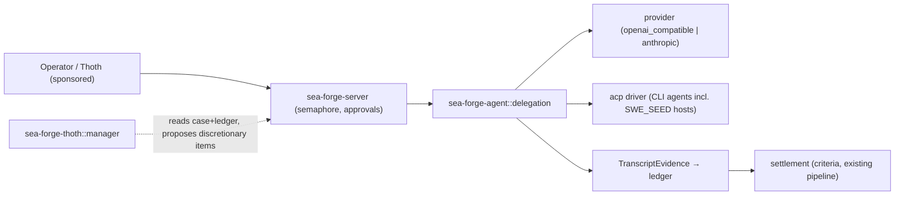

# SEA Forge — Governed Agent Connectivity, Delegation, and Thoth Orchestration

Status: Draft v0.1

Scope: Rust (stable, edition 2021), Linux primary / macOS secondary. Extends the `spec-full.md` workspace with one new adapter crate and four new extension capabilities. Kernel crates stay synchronous; async lives only in the server/adapter layer (the `no-async-kernel` invariant of `spec-full.md` is preserved).

Purpose: Give SEA Forge the ability to employ model-backed agents as governed labor — any OpenAI-API- or Anthropic-API-compatible agent over HTTP, and any ACP-speaking CLI agent (including SWE_SEED-harnessed hosts such as Claude Code and Codex) — with every delegation authority-gated, evidenced, cancellable, and settlement-judged; and give Thoth a bounded manager loop so it can orchestrate many such agents at once through the existing governed plan-mutation path.

Owner: SEA Forge core team

Prerequisite: **`spec-adlc-thoth-minimum.md` implemented and green through M11** (which itself requires `spec-full.md` green through M8). This spec never redefines kernel types, the ledger, the authority fabric, record formats, or fail-closed rules — it extends them. Where this spec is silent, `spec-adlc-thoth-minimum.md` governs; then `spec-full.md`; then `spec-minimum.md`.

Companion inputs: `.agents/reports/2026-07-14-sk-goose-t3code-capability-delta-audit.md` (capability delta audit; Dossiers 1–4 are the acquisition rationale for E14–E17), the reserved `external_api` authority surface (`spec-minimum.md` §7.3.4), plan templates (E8), the case engine (M2a), approvals and `max_concurrent_runs` (M3), settlement declarations and `SweSeedTransport` (M4a), Thoth and the `self_disclosure` surface (E13).

Resolved decisions (owner-supplied, 2026-07-14):

- **ACP is adopted** as the protocol for CLI-resident agents. E17 is a committed capability, not a spike; its first gate still validates permission-mapping fidelity before broad rollout.
- **SWE_SEED's interface shape** (inspected at `~/projects/SWE_SEED`, commit `a55d14b`, branch `deploy-prep`): SWE_SEED is a CLI harness (`swe-seed` clap CLI, no network surface of its own) that projects policy/hooks/skills into host coding agents (Claude, Codex, OpenCode, GitHub Copilot, Antigravity, CI) via `swe-seed sync --host`, and emits route/trace/proof artifacts under `.agent-harness/`. Therefore an "SWE_SEED instance" is a **host coding agent driven via ACP (E17) with the harness projected in**; its trace/proof artifacts are harvested as evidence, and its settlement declarations continue to arrive through the existing M4a `SweSeedTransport`. SWE_SEED is unlocked by E17, not E14.
- **Transcript retention + summarized-mode verification** (owner decision, accepted 2026-07-17): summarized mode retains a **sealed, encrypted canonical transcript** outside the public `full` artifact surface, verifies it before any crypto-shredding, and exposes only the deterministic summary by default. This resolves the prior contradiction (a digest cannot be recomputed after its input bytes are discarded) while preserving genuine hash verification without making the full transcript broadly visible. M13 implements the sealed-transcript commitment; data-minimization is weaker than full crypto-shredding but auditability is preserved.

## 0. Spec Frame

1. What should be built? — Four extension capabilities in milestone order: **E14 AgentProvider seam** (a `complete`/`stream` provider trait with OpenAI-compatible and Anthropic-compatible implementations in a new adapter crate, plus a one-call governed `agent_probe` operation, activating the reserved `external_api` authority surface), **E15 governed `agent_task` delegation** (a new plan-item/operation kind whose execution is a dialogue with an agent endpoint, run as an ordinary governed run: turn-capped, cancellable, parallel under the existing server semaphore, transcript-evidenced, independently settled), **E16 orchestration topologies** (`sequential_agents`, `concurrent_agents` E8 templates plus the Thoth manager loop: bounded iterations of read-case → propose-discretionary-`agent_task` → await settlement), and **E17 ACP driver** (an ACP client adapter that drives CLI agents, mapping ACP permission requests onto SEA approvals and ACP sandbox modes onto `SandboxClass`, with continuation identity linking successive episodes to one external session).
2. What result should it produce? — A case plan can delegate work to N heterogeneous agents (HTTP-API agents and ACP CLI agents, including SWE_SEED-harnessed hosts) concurrently; each delegation leaves inspectable transcript evidence and settles on criteria, never on agent narration; Thoth can drive a whole case forward by proposing delegations under authority.
3. How will we know the result is real? — Milestone gates in §17. A milestone that cannot pass P1–P4b and all prior milestone gates (M0–M11) unchanged has broken the kernel and MUST be rejected.
4. What capability should get stronger after repeated use? — The installation's demonstrated ability to complete cases using delegated agent labor: capability records (E4) for `agent_task`-backed operations climb the attempted < demonstrated < proven ladder exactly like sandboxed work, and Thoth's answers about "what agents this installation can employ, and with what track record" grow from the same evidence.
5. What evidence proves the capability claim? — Transcript evidence (or content-addressed full transcripts) hash-linked into runs; settlement records with the new bases; ledger-replayable ordering of parallel delegations; ACP permission grants recorded as approval decisions; SWE_SEED proof artifacts cross-linked to the delegating run.
6. What fails safely? — A denied `agent_task` performs no network I/O and no child-process spawn; an unreachable or misbehaving endpoint yields a typed error and settlement `rejected` with transcript-so-far preserved; cancellation settles `rejected` with basis `cancelled`, never vanishes; an ACP disconnect settles the run rejected; credentials never enter ledger payloads, evidence, or errors; there is never provider fallback (an endpoint failure is a fact to record, not a routing decision to hide).
7. What must repeat until reliable? — §13: parallel dispatch under the semaphore, cancellation mid-dialogue, turn-cap breach, denial-without-side-effects, redaction, ACP permission→approval mediation, and manager-loop stall handling.
8. What changes when evidence disagrees with the design? — §5 claim table. Notably: if the ACP permission model proves lossy against SEA authority semantics (gate T16.3), E17 narrows to an allow-listed subset of ACP request kinds rather than weakening authority; if sentry-chain coordination proves insufficient for a real topology, the template vocabulary grows — an actor/message runtime is never introduced.

## Normative Language

RFC 2119 keywords as in `spec-minimum.md`. `Implementation-defined` likewise.

## 1. Problem Statement

SEA Forge solves governed execution — plan, authority, sandbox, trace, evidence, settlement — but through M11 it cannot *employ* a model-backed agent: no crate can speak to an LLM endpoint or drive a coding-agent CLI. The capability delta audit verified this absence workspace-wide; the only external-agent seam is `SweSeedTransport` (settlement declarations inbound, no task dialogue outbound).

Job-to-be-done:

- When an operator (or Thoth, acting as a sponsored R-AA actor) needs multi-agent labor applied to a case, they need SEA Forge to delegate instruction packets to SWE_SEED instances and/or any OpenAI-/Anthropic-API-compatible or ACP-speaking agent, in parallel and under authority, so that the case advances on settled evidence instead of on agent self-reports.

Current failure mode:

- Agent work happens outside the fabric entirely (a human runs Claude Code by hand), so it produces no trace, no evidence, and no settlement.
- There is no way to run N agents concurrently against one case, cancel one, and keep the rest.
- Thoth (M11) can answer questions but cannot act on a stalled case; there is no governed loop that turns its reading of the case file into proposed work.

The system is needed because ungoverned orchestrators exist (goose, semantic-kernel, t3code) but all three treat agent narration as progress; SEA Forge's corrective — settlement as the sole success arbiter — must extend to delegated work or the governance boundary ends where the agents begin.

Important boundary:

- This system is a governed delegation and orchestration layer over existing kernel machinery.
- It is not an agent framework: no conversation store as truth, no actor/message runtime, no LLM participation in kernel decisions, no prompt-layer safety in place of authority.
- Successful execution means a delegation's run settled on its criteria with transcript evidence preserved, not that the agent said it finished.

## 2. Goals and Non-Goals

### 2.1 Goals

- G1 **AgentProvider seam (E14)**: a new adapter crate `sea-forge-agent` MUST define a provider contract (`complete`, `stream`) over a typed message/tool vocabulary, with exactly two built-in implementations: `openai_compatible` (base URL + credential ref + request-shape mapping) and `anthropic`. Every provider call, including `agent_probe`, is a protected operation gated by the `external_api` authority surface (reserved since v0.1, activated here, deny-by-default). Typed errors; no inter-provider fallback.
- G2 **Endpoint registry (E14)**: agent endpoints are declared in configuration as **AgentEndpoint** entries and surfaced to the fabric as `ExtensionDescriptor`s of kind `runtime_adapter`, so registration, compatibility, and disclosure (via Thoth `AskAvailableAffordances`) reuse existing machinery.
- G3 **Governed delegation (E15)**: `agent_task` MUST be an additive `PlanItem` kind and `Operation` kind. Executing one is an ordinary run: authority-checked per delegation, turn-capped by a grant boundary, executed through E14 (or E17), transcript-evidenced, and settled on the item's criteria. Agent output is untrusted input (`spec-full.md` §8.6); an agent's claim of success is never a settlement input with standing (extending the M4a self-declaration rejection to delegated work).
- G4 **Parallelism and cancellation (E15)**: `sea-forge-server` owns case scheduling and dispatches each ready executable item as a run episode under the existing `max_concurrent_runs` semaphore — no new pool. The one-shot CLI uses the same episode-dispatch service with effective concurrency one. Any in-flight delegation MUST be cancellable (operator command or sentry decision) without affecting sibling runs; cancellation settles `rejected` with basis `cancelled`.
- G5 **Transcript evidence (E15)**: every delegation MUST preserve dialogue evidence per the retention design selected in §7.4. Both modes retain a deterministic structural summary and the SHA-256 of the redacted canonical transcript. `full` stores the transcript as a content-addressed artifact file. The selected summarized-mode design MUST make the claimed verification property true; mode is set globally and overridable per endpoint and per plan item (most specific wins).
- G6 **Topology templates (E16)**: built-in E8 templates `sequential_agents@0.1.0` (chain of `agent_task` items linked by source-bound sentries on each predecessor's settlement) and `concurrent_agents@0.1.0` (N parallel `agent_task` items plus an all-success rollup milestone) MUST instantiate to ordinary CasePlans. E8 gains only the typed deterministic list/repeat and explicit all-of control vocabulary needed for these templates; it adds no actor runtime.
- G7 **Thoth manager loop (E16)**: Thoth MUST run a bounded, deterministic manager iteration against a case: read the case file and trace ledger (its progress ledger — no second ledger), classify the case as satisfied/progressing/stalled/blocked, and propose the next `agent_task` only from a versioned manager proposal catalog or a case-declared discretionary-item template. Iteration count is a grant boundary; exhaustion parks the case and escalates through existing approval machinery. Thoth remains an R-AA actor: it proposes, it never settles or promotes work it proposed. Immutable `proposed_by` provenance enforces that separation.
- G8 **ACP driver (E17)**: an ACP client adapter MUST drive CLI-resident agents (Claude Code, Codex, and SWE_SEED-harnessed hosts) as `agent_task` executors: spawn/attach with continuation identity, surface ACP permission requests as SEA approval requests (never auto-grant beyond the run's grant), map the session's sandbox posture from the run's `SandboxClass`, and treat session transcripts identically to E15 evidence.
- G9 **SWE_SEED integration (E17)**: when the delegate is an SWE_SEED-harnessed host, the adapter MUST harvest SWE_SEED trace/proof artifacts (route decision, `ProofStarted`/`ProofCompleted` outputs) from the workspace as evidence cross-linked to the delegating run, and settlement declarations arriving via the M4a `SweSeedTransport` MUST be correlatable to that run.

### 2.2 Non-Goals

- No actor or message-passing runtime; the case engine (sentries, milestones, discretionary items) is the coordination substrate.
- No conversation store as a source of truth; transcripts are evidence, the ledger is truth.
- No LLM participation in kernel decisions (authority, settlement, classification); the model only ever produces untrusted payloads.
- No provider catalog beyond the two API shapes plus ACP; no OAuth flows, local inference, or provider fallback/routing logic.
- No group-chat topology, MCP surface import, cron scheduler, or checkpoint/diff review UX (audit §8 rejected/deferred list); revisit only when a real case needs them.
- No autonomous unbounded Thoth: every manager loop is sponsored, iteration-capped, and case-scoped.

## 3. Outcome Contract

### 3.1 Output Produced

- `crates/sea-forge-agent/` — the adapter crate: provider trait, `openai_compatible` + `anthropic` implementations, governed `agent_probe`, ACP client driver, endpoint registry glue. The only workspace location where an HTTP client and async executor for agent dialogue may appear outside `sea-forge-server`.
- Activated `external_api` authority surface rules in `sea-forge-authority` with exact-action boundaries: endpoint ID, immutable descriptor/config digest, provider kind, normalized destination, model, request limits, and credential reference (never value), plus `max_turns`, `token_budget`, and `max_manager_iterations` where applicable. Credential resolution separately consumes `secret_access`.
- Additive kernel vocabulary in `sea-forge-core`: `Operation::AgentProbe` (M12); `Operation`/`PlanItem` kind `agent_task` (M13); settlement bases `cancelled`, `turn_cap_exceeded`, `agent_endpoint_error`; and immutable authorship/proposal provenance needed for SoD.
- Source-owned built-in template assets for `sequential_agents@0.1.0` and `concurrent_agents@0.1.0`, installed as pinned copies under `<root>/templates/`.
- Per delegation: a `TranscriptEvidence` record (and, in `full` mode, `.sea-forge/artifacts/transcripts/<sha256>.jsonl`), ledger-committed.
- CLI: `sea-forge agent probe <endpoint>`, `sea-forge agent list`, `sea-forge run cancel <run-id>`, `sea-forge case manage <case-id> --iterations N` (Thoth manager loop).

### 3.2 Outcome Verified

The output counts as a verified outcome only when a delegation's run settles on its declared criteria with transcript evidence verified according to the retention design selected in §7.4, and replaying the ledger reproduces the dispatch/settlement ordering of any parallel batch.

A run MUST NOT be reported as complete when the agent asserted success but criteria evaluation did not pass, when transcript evidence is missing or hash-mismatched, or when an ACP permission was exercised without a recorded approval decision.

### 3.3 Consumer and Handoff

Consumed by: case operators (via CLI/server), Thoth (manager loop reads settlements; `AskAvailableAffordances`/`AskCapability` disclose endpoints and their track record), capability promotion (E4), and downstream plan items gated by sentries on delegation settlements. Handoff is complete when the settlement record, transcript evidence ref, and (for SWE_SEED) harvested proof artifacts are all reachable from the run record. Unverifiable outcomes park the item in the existing blocked path with a typed error.

## 4. Capability Claim

After repeated use, an installation should be better able to complete multi-agent cases with predictable cost and audit: operators reuse topology templates instead of hand-built plans, and Thoth's manager loop resolves stalls without human replanning.

Proven only by: (a) the same topology template instantiated across ≥3 distinct cases with settled rollups; (b) capability records for `agent_task` operations reaching `demonstrated` through the ordinary promotion rules; (c) a stalled case advanced to settlement by manager-loop proposals alone.

Not proven by: transcript volume, agent self-reports, or successful probes without settled case work.

## 5. Evidence and Claim Discipline

| Claim | Level | Required evidence | Current evidence | Gap |
|---|---|---|---|---|
| AgentProvider seam confines HTTP/async to the adapter crate; every provider call is exact-action authorized | Proven (M12) | T12.1–T12.6 green; T12.5 automated boundary gate | `sea-forge-agent` crate (af94ff0, c6aebb6); `Operation::AgentProbe` + `AuthorityAction::AgentProbe` bind endpoint_ref + descriptor_config_sha256 + scheme/host/port/path/model/limits + credential_ref + prompt_sha256; `external_api` allow_hosts enforced; DNS-rebinding-safe pinning + no-proxy + no-redirect + HTTPS-only; `secret_access` mediated before credential resolution; `Zeroizing<String>`; 19-crate kernel inventory forbids tokio/reqwest/hyper/etc (`just no-async-kernel` green on 2026-07-24); CLI `agent list\|probe` | none |
| Agent endpoints are declared config, not asserted status; a registry mutation marks the self-model snapshot stale | Proven (M12) | config cannot assert `probed`/`demonstrated`; descriptor change requires a version bump | `AgentEndpointConfig.status` rejected on load; immutable `runtime_adapter` registration (idempotent same-version+hash, rejects same-version hash change, versioned upgrade replaces); `register_endpoint` calls `mark_current_stale` when a snapshot exists; 4 extension + 3 server-config + 1 server-stale tests | none |
| Endpoint failures yield typed subcodes and never fall back | Proven (M12) | T12.6: unreachable/4xx/5xx/redirect/schema-invalid/oversize settle rejected with typed `error_class`, one connection each | server conformance_m12 error-taxonomy tests (c6aebb6) | none |
| The server semaphore suffices as the delegation concurrency cap | Proven (portable M13) | M13 gate: N parallel `agent_task` runs respect `max_concurrent_runs` | `t13_2_server_semaphore_caps_concurrent_delegations` and `t13_2_mixed_episodes_share_server_cap` prove agent-only and mixed sandboxed/agent load under the shared cap; ledger replay reproduces persisted ordering | none |
| Sentry chains suffice for sequential/concurrent topologies (no actor runtime needed) | Partially proven | M14 gate: both templates settle end-to-end incl. rollup | M14 code-complete: `sequential_agents@0.1.0`/`concurrent_agents@0.1.0` settle end-to-end under `entry_criteria_mode: All` and chained settlement-accepted sentries (T14.1–T14.3, `conformance_m14.rs`); a rejected branch parks the case via the existing reducer with zero new termination logic | stub agent endpoints prove scheduler/rollup mechanism only; prove with real agent latencies (M16 real integration) |
| ACP's permission model maps losslessly onto SEA authority/approvals | Proven for the portable ACP v1 fixture | T16.3: every ACP request kind exercised in a session maps to a recorded SEA decision; no unmapped grant | `known_kinds_are_exhaustive_per_schema_v1`, `t16_3_every_v1_tool_kind_maps_and_unknown_kind_denies`, and durable allow/deny approval tests are green | exercise the same mapping against a configured real ACP host once per release |
| SWE_SEED instances are reachable as ACP-driven hosts with harvestable proofs | Partially proven | M16 gate: one SWE_SEED-harnessed host completes a delegation with proof artifacts cross-linked | portable harvest, commit-mismatch rejection, production `CommandSweSeedTransport` ingress, and immediate/startup/read-time late-declaration reconciliation are green and run-correlated | configured real SWE_SEED-projected ACP host release test remains unrun |
| Summarized transcripts are verifiable for settlement audit | Proven (portable M13) | summarized mode retains a sealed, encrypted canonical transcript, verified before crypto-shredding | full/summarized modes share redacted canonical bytes and digest; sealed round-trip, tamper, missing key/ciphertext, restart, and crypto-shred tests are green | none |

## 6. System Overview

### 6.1 Architecture Pattern

- Pattern: adapter crate + server-owned episode scheduler over an existing governed run pipeline. Delegations are ordinary run episodes whose executor is an agent dialogue instead of an argv command.
- Reason: the current server semaphore caps whole CLI subprocesses and cannot cap concurrently active items inside one case. `sea-forge-server` therefore owns ready-item scheduling and holds the one existing semaphore per episode; it invokes synchronous planner/kernel services through `spawn_blocking`. The one-shot CLI reuses the same episode-dispatch service with effective concurrency one.
- Patterns intentionally not used: actor runtime (SK), session-store-as-truth (goose), event-sourcing stack (t3code — the ledger already is one, stronger), background worker pool (server semaphore suffices).

### 6.2 Main Components

1. `sea-forge-agent::provider` — the `AgentProvider` trait + `openai_compatible`/`anthropic` implementations and the one-call `agent_probe` service. Inputs: typed packet, endpoint snapshot, separately authorized credential reference. Outputs: typed completion/stream events, probe evidence, typed errors.
2. `sea-forge-agent::acp` — ACP client driver. Inputs: endpoint config (argv or attach target), run grant (sandbox class, boundaries), durable approval record. Outputs: session events, permission requests (surfaced as approvals), continuation identity, transcript.
3. `sea-forge-agent::delegation` — executes an `agent_task` run: builds the instruction packet from PlanItem params, drives the provider/ACP loop under turn/token caps and the cancellation signal, emits `TranscriptEvidence`, returns a typed result for criteria evaluation. Never judges success itself.
4. `sea-forge-thoth::manager` — the manager loop (E16): reads case file + ledger, applies the deterministic judgment table, and proposes catalog/template-backed discretionary `agent_task` items via the existing planner path. R-AA constraints are enforced structurally.



### 6.3 External Dependencies

- HTTP client (an owner-approved, pinned implementation selected when M12 enters scope) — E14 provider calls. Confined to `sea-forge-agent`; failure ⇒ typed `agent_endpoint_error`, run rejected.
- ACP protocol implementation (an owner-approved, pinned crate or minimal client over the published schema, selected when M16 enters scope) — E17 sessions. Failure/disconnect ⇒ run rejected, transcript-so-far preserved.
- Child-process management (existing sandbox machinery) — spawning CLI agents under a jail-class grant. Failure ⇒ existing sandbox failure semantics.

This spec selects neither package nor version. Adding a dependency, HTTP/async strategy, URL parser, secret-handling library, or ACP implementation requires a later owner approval of the exact versions and features; no such dependency belongs to M9–M11.

## 7. Core Domain Model — extensions only

All kernel types from prior specs are unchanged; everything here is additive under v0.2 compatibility rules.

### 7.1 AgentEndpoint (E14/E17)

Purpose: a declared, registry-visible way to reach one agent. Used by: config loader, extension registry, authority checks, delegation executor, Thoth disclosure.

- `id` (string) — stable key, `[a-z0-9_-]{1,64}`; identifies the endpoint but is never a sufficient grant boundary by itself.
- `kind` (enum) — `openai_compatible | anthropic | acp`.
- `descriptor_ref` (string) — the `ExtensionDescriptor` (kind `runtime_adapter`) registered for this endpoint.
- `base_url` (string, required for HTTP kinds) — normalized absolute URL. Production endpoints require HTTPS; HTTP is permitted only for explicit loopback test/development configuration. `argv` (list, required for `acp` kind) — tokenized, validated, and never shell-invoked.
- `credential_ref` (string or null) — name of an environment variable or secret-store key; the resolved value is `credential_bearing` and MUST never appear in records, logs, or errors.
- `default_model` (string, optional), `transcript_retention` (enum override, optional), `status` (enum: `declared | probed | demonstrated`) — status is derived only from settled evidence, never asserted by config, mirroring the E13 claim ladder.
- `descriptor_config_sha256` — hash of the canonical descriptor and executable endpoint configuration. Every exact external action binds this hash, normalized scheme/host/port/path, provider kind, model, and limits so a config reload cannot repoint an already-authorized call.

### 7.2 AgentProbe (E14)

`agent_probe` is a one-call diagnostic executable operation, not an `agent_task`. It uses the provider adapter but creates the ordinary intent → plan → exact authority decision → evidence → settlement chain. A schema-valid response may settle accepted; denial, credential failure, and endpoint failure leave typed evidence and no fallback. It exists in M12 so T12.1–T12.2 do not depend on M13's multi-turn delegation vocabulary.

### 7.3 agent_task PlanItem parameters (E15)

Purpose: what a delegation says to do. Used by: planner validation, delegation executor, criteria evaluation.

- `endpoint_ref` (string) — must resolve to a registered AgentEndpoint; authority-checked against the grant's `endpoint_ref` boundary.
- `instruction` (string) — the task packet; rendered into the initial user message (HTTP kinds) or session prompt (ACP). Untrusted content rules apply to anything interpolated in.
- `max_turns` (integer ≥1) — required; also bounded above by the grant's `max_turns`.
- `token_budget` (integer, optional), `response_schema` (JSON schema, optional — schema-valid final output becomes a named evidence field), `transcript_retention` (enum, optional override).

### 7.4 TranscriptEvidence (E15) — blocked retention decision

Purpose: the audit record of one delegation dialogue. Used by: evidence pipeline, settlement audit, Thoth `AskEvidenceForClaim`.

- `run_id`, `endpoint_ref`, `turns_used` (integer), `termination` (enum: `completed | turn_cap_exceeded | cancelled | endpoint_error | acp_disconnect`).
- `transcript_sha256` (string) — SHA-256 of the canonical JSONL transcript (JCS-canonicalized messages, one per line), always present regardless of retention mode.
- `summary` (string, bounded ≤ implementation-defined size) — always present; deterministic structural summary (turn count, tool calls made, final-message excerpt), not model-generated.
- `artifact_ref` (string, in `full` mode) — content-addressed transcript artifact path.
- `harvested_refs` (list, E17/SWE_SEED) — hashes+paths of harvested proof/trace artifacts.

Redaction rule: credential values and any string matching the M0 sentinel-redaction patterns are redacted from transcript content *before* hashing and storage; the hash commits to the redacted canonical form.

The former summarized-mode rule retained only a summary and digest while requiring later digest recomputation. That is not verifiable. Before M13 implementation, the owner MUST select and record one of: (a) a sealed/encrypted canonical transcript retained outside the public `full` artifact surface and verified before crypto-shredding; (b) a separately verifiable commitment/proof structure; or (c) a narrower assurance claim in summarized mode that verifies ledger integrity of the recorded digest but not transcript recomputation. Until then, no implementation may claim summarized transcript hash verification or M13 completion.

### 7.5 DelegationRun state and control (E15)

A delegation reuses the existing run lifecycle; additive fields on the run record: `agent_endpoint_ref`, `cancellation_requested_at` (timestamp or null), `continuation_key` (string or null, E17 — links successive episodes to one external ACP session). An append-only control request binds case, run episode, item, requester, authority decision, and ordinal. In-memory cancellation handles and approval channels are projections of that durable state. A cancellation/completion race has exactly one ledgered terminal winner; restart recovers from durable state rather than assuming a live handle exists.

### 7.6 ManagerIteration (E16)

Purpose: one auditable step of the Thoth manager loop. Used by: `sea-forge-thoth::manager`, ledger, escalation.

- `case_id`, `iteration` (integer, 1-based), `snapshot_refs` (case-file version + ledger head consulted), `proposal_source_ref` (versioned catalog or case-declared template) and its hash.
- `judgment` (enum: `satisfied | progressing | stalled | blocked`) with `rationale_claim_refs` (grounded-claim refs per E13 — the judgment must cite evidence, not narrate).
- `action` (enum: `none | propose_item | escalate`) and `proposed_item_ref` (discretionary item id, when applicable). A proposed item carries immutable `proposed_by` identity into settlement and capability-promotion checks.
- Recorded to the ledger whether or not the proposal is granted; a denied proposal is an outcome, not an error.

## 8. Configuration and Input Contract

### 8.1 Sources and Resolution

Precedence: per-plan-item params → per-endpoint config → `[agent]` section of the existing server/CLI config file → built-in defaults. Environment variables are read only through `credential_ref` indirection and only after the exact external action has been authorized; resolution separately consumes `secret_access`. Relative paths resolve against the `.sea-forge/` root. `argv` fields are tokenized argv, never shell, and ACP children receive a minimal explicit environment rather than the parent environment.

### 8.2 Required Config Fields

| Field | Type | Required | Default | Validation |
|---|---|---:|---|---|
| `agent.endpoints[].id` | string | yes | none | `[a-z0-9_-]{1,64}`, unique |
| `agent.endpoints[].kind` | enum | yes | none | `openai_compatible \| anthropic \| acp` |
| `agent.endpoints[].base_url` / `argv` | string / list | kind-dependent | none | normalized HTTPS URL (or explicit loopback test URL) / non-empty validated argv; exactly the one matching `kind` |
| `agent.endpoints[].credential_ref` | string | no | none | resolvable at preflight for HTTP kinds |
| `agent.transcript_retention` | enum | no | `summarized` | `summarized \| full` |
| `agent.default_max_turns` | integer | no | 16 | ≥1; per-item value may not exceed grant boundary |
| `thoth.manager.max_iterations_default` | integer | no | 8 | ≥1; bounded above by grant |

### 8.3 Config Error Classes

Standard taxonomy from `spec-minimum.md` §8.3 applies: `missing_config_error`, `parse_error`, `schema_error`, `unsupported_kind_error` (unknown endpoint kind), `missing_credential_error` (unresolvable `credential_ref` at preflight). Blast radius: a broken *endpoint entry* fails only work referencing that endpoint (typed, operator-visible) — other endpoints and all non-agent work continue; an unparseable `[agent]` section blocks only `agent_task` dispatch, never sandboxed runs.

### 8.4 Dynamic Reload

Follows the server's existing reload posture: reloaded endpoint config applies to future dispatches; in-flight delegations keep the config they launched with. Invalid reload keeps last-known-good with `invalid_reload_error`.

### 8.5 Startup and Preflight

Startup validates the `[agent]` section shape if present (absence is valid — installations without agent connectivity lose nothing). Per-dispatch preflight snapshots the endpoint descriptor/config, confirms it is registered, validates destination safety, and obtains an exact `external_api` grant. It then obtains `secret_access` before resolving an HTTP credential. The action binds endpoint ID, descriptor/config hash, normalized destination, provider kind, model, limits, and credential reference. Preflight failure parks the item with a typed error; no network I/O, secret read, or spawn occurs.

### 8.6 Primary Input Contract

Inputs are `agent_task` plan items (validated at plan acceptance: §7.2 fields) and manager-loop invocations (`case_id`, iteration cap). Invalid items are rejected at planning time, not at dispatch. Duplicate dispatch of the same item follows existing run-idempotency rules. Agent responses are untrusted: schema-validated when `response_schema` is set, size-bounded (implementation-defined cap, typed `agent_endpoint_error` on breach), and never interpolated into privileged operations.

## 9. Operational Flow and State Model

### 9.1 Flow Summary

```text
plan accepted (agent_task items validated)
  → server-owned reducer identifies ready item → exact preflight + authority check
  → server semaphore slot per run episode → delegation loop (provider or ACP; turns counted; cancellation polled;
     ACP permission requests → approval requests)
  → termination (completed | turn_cap_exceeded | cancelled | endpoint_error | acp_disconnect)
  → TranscriptEvidence committed (+ harvested SWE_SEED proofs, E17)
  → criteria evaluation → settlement (accepted | rejected + basis)
  → downstream sentries fire / manager iteration observes
```

Branches: denial ⇒ parked, zero side effects. Endpoint error mid-dialogue ⇒ transcript-so-far committed, settled rejected (`agent_endpoint_error`). Cancellation ⇒ durable control request, best-effort abort (HTTP: drop request; ACP: session cancel then SIGTERM per sandbox rules), then `rejected/cancelled`. ACP approval awaited creates a durable permission-request record and suspends the live session under a bounded timeout. Grant/deny returns through the approval ID when the session survives; crash/disconnect rejects the episode with partial transcript, and a later episode resumes only through a ledgered `continuation_key`.

### 9.2–9.3 States and Transitions

Delegations reuse the existing run state machine; the only additive terminal distinctions are the settlement bases `cancelled`, `turn_cap_exceeded`, `agent_endpoint_error` (each a distinct named outcome, not collapsed into generic failure). Manager loop states: `iterating → (proposal granted | proposal denied | judgment satisfied) → done`, or `iteration cap reached → case parked + escalation`. Idempotency: re-dispatching a settled item follows existing rules (new run, prior settlement immutable); replaying the ledger reproduces dispatch order.

### 9.4 Transition Triggers

- Sentry fired — activates an `agent_task` item exactly like any other kind.
- Cancellation requested (CLI/server op) — appends a control request; the delegation loop observes its projected handle between turns and during streaming.
- ACP permission request — appends a durable permission-request record; grant/deny is recorded and returned to the live session when possible; deny ⇒ the agent's action is refused inside the session (session continues; the run settles on criteria as usual).
- Turn/token boundary reached — terminates the dialogue, `turn_cap_exceeded`.
- Manager iteration tick — one read→judge→act cycle; never a background daemon, always an invoked, granted operation.

### 9.5 Important Nuances

- An agent that says "done" has produced *input to criteria evaluation*, nothing more; settlement may still reject.
- `turn_cap_exceeded` is not necessarily failure of the underlying goal — criteria may still evaluate the produced artifacts and settle accepted; the basis records *why the dialogue ended*, settlement records *whether the outcome held*.
- ACP deny-inside-session differs from run cancellation: a denied permission leaves the session alive; only cancellation or termination ends it.
- For SWE_SEED hosts, the *harness's* proof artifacts (not the host agent's chat) are the primary evidence; the transcript is corroboration.
- Thoth's manager judgment `satisfied` does not settle anything — it merely stops proposing; settlement authority remains where M4a put it.
- The manager's judgment is deterministic: completed case ⇒ satisfied; unresolved approval/required authority/terminal dependency block ⇒ blocked; active or enabled work/new settlement progress ⇒ progressing; otherwise unmet outcome ⇒ stalled. It cannot invent free-form task content.

## 10. Core Behavior Requirements

### 10.1 Authority and Isolation (E14/E15)

- Every provider call and ACP session MUST execute under an exact `external_api` grant; endpoint ID alone is insufficient. The grant binds endpoint descriptor/config hash, normalized scheme/host/port/path, provider kind, model, limits, and credential reference. Denial MUST prevent all network I/O and process spawn (proven by test, not by review).
- HTTP destinations MUST reject private, loopback, link-local, multicast, and metadata-service addresses except explicit loopback test configuration; connection must be DNS-rebinding-safe. Redirects are disabled unless each target receives a new exact grant, and credentials never cross origins. Inherited proxy settings are ignored unless explicitly configured and granted.
- The HTTP client and async executor MUST NOT appear in kernel crates; `cargo deny`-style checks (existing dependency-boundary gate mechanism) MUST enforce the crate boundary.
- Credentials MUST be resolved only after both `external_api` and `secret_access` authorization, held only in provider memory, and redacted from every persisted or logged surface. ACP children do not inherit credentials or the parent environment by default.

### 10.2 Delegation Execution (E15)

- The implementation MUST count turns and enforce `max_turns`/`token_budget` inside the loop, not post-hoc.
- The implementation MUST commit `TranscriptEvidence` for every terminated delegation, including failures and cancellations (transcript-so-far).
- The server MUST dispatch parallel `agent_task` and sandboxed run episodes through the existing semaphore and MUST NOT introduce a second concurrency mechanism. The CLI has effective concurrency one.
- The implementation MUST NOT retry a failed endpoint call against a different endpoint (no fallback).

### 10.3 Topologies and Manager Loop (E16)

- Templates MUST instantiate deterministically to plain CasePlans. Typed list/repeat expansion has bounded cardinality and stable item IDs; rollups use explicit all-of success semantics. Sentries bind their predicate to the named source event.
- The manager loop MUST record a `ManagerIteration` for every cycle, cite grounded claims for its judgment, propose only through the discretionary-item path from a versioned catalog or case-declared template, and stop at the iteration boundary with escalation.
- Thoth MUST NOT hold settlement authority or capability-promotion authority over items it proposed; immutable `proposed_by` provenance makes the SoD check structural.

### 10.4 ACP Sessions (E17)

- Every ACP permission request MUST map to a recorded SEA decision (approval or policy rule); an unmapped request kind MUST be denied with a typed error, never passed through.
- Session sandbox posture MUST derive from the run's `SandboxClass`; the adapter MUST NOT accept a session-proposed escalation.
- `continuation_key` MUST link resumed sessions to the same case lineage in the ledger.
- ACP request-kind support is pinned to a documented protocol/schema version. Every supported kind is exercised in the fidelity sweep; unsupported or malformed kinds deny before action. Spawn/attach targets are validated, tokenized, and run under the grant's sandbox with a minimal explicit environment.

### 10.5 Completion Rules

Complete only when: run settled, `TranscriptEvidence` committed and verified according to the selected §7.4 retention design, (E17) all exercised permissions have recorded decisions, (SWE_SEED) harvested proof refs resolve. Incomplete/blocked/failed whenever any of these is absent — regardless of what the agent reported.

## 11. Execution / Integration Contract

- Invocation: HTTP kinds — JSON request per the endpoint's API shape (OpenAI chat-completions or Anthropic messages), pinned request shapes with contract tests against recorded fixtures; ACP — child process (tokenized argv) or attach, ACP handshake, session per delegation episode. Timeout: per-turn and whole-run timeouts are grant/config boundaries (implementation-defined defaults, documented).
- Result: typed `DelegationOutcome { termination, turns_used, final_output?, evidence_ref }`; failure carries `error.code` (`agent_endpoint_error` subcodes: `unreachable | http_4xx | http_5xx | schema_invalid | oversize | acp_disconnect`), `error.message` (redacted), `error.recoverable`.
- Side effects allowed: network I/O to the declared endpoint; child processes and file writes only inside the run's sandbox/workspace; approval requests. Forbidden: writes outside the workspace, credential persistence, ledger writes from inside `sea-forge-agent` (evidence goes through the existing pipeline).

## 12. Evidence, Proof, and Observability

Required artifacts per delegation: `TranscriptEvidence` (always), retention evidence required by the §7.4 owner decision, harvested SWE_SEED proofs (when applicable), settlement record with basis. Storage/retention follows existing evidence store and ledger rules; public `full` transcripts are content-addressed under `.sea-forge/artifacts/transcripts/` and subject to §7.0c crypto-shredding. Proof commands:

```text
cargo test -p sea-forge-agent                         # contract, denial, redaction, cancellation suites
sea-forge agent probe <local-test-endpoint> && sea-forge verify  # fixture-backed probe evidence chains + ledger verification
sea-forge ledger replay --case <id>                   # reproduces parallel dispatch/settlement ordering
```

A proof passes when the gate's expected records exist, hashes verify, and replay is deterministic; it fails on any missing record, hash mismatch, or nondeterministic replay. Required log context: `run_id`, `endpoint_ref`, `turns_used`, `termination`. Required metrics: delegations by termination basis; approval-mediated permissions count; manager iterations per case. Required events: dispatch, each approval decision, termination, settlement — all already ledger events; no new telemetry channel.

## 13. Repeatability and Variation Requirements

Variation: (1) N=5 mixed sandboxed and agent run episodes with `max_concurrent_runs`=2 — server ordering replayable, cap never exceeded; (2) same template against both an HTTP endpoint and an ACP endpoint; (3) after the §7.4 choice, all retention modes on the same delegation — identical `transcript_sha256` and the selected verification property; (4) oversize/garbage agent output — typed rejection, no crash, no unredacted spill; (5) endpoint config swap, redirect, private-address/DNS-rebinding attempt, and denied secret access — zero forbidden I/O or secret read.

Recovery: (1) endpoint dies mid-stream — transcript-so-far committed, rejected `agent_endpoint_error`, siblings unaffected; (2) cancel one of three parallel runs — cancelled settles `rejected/cancelled`, other two settle normally, rollup sentry behaves per its condition; (3) server restart during cancellation or ACP approval — durable control/permission state yields one terminal outcome or a linked successor episode; (4) ACP disconnect and resume — `continuation_key` links the successor episode; (5) manager loop hits iteration cap on an unresolvable case — case parks, escalation recorded, no runaway.

## 14. Failure Model and Recovery Strategy

1. `agent_endpoint_error` (unreachable/4xx/5xx/schema/oversize) — fail the affected run only; typed, recoverable=true for transport, false for schema; no fallback, no automatic retry (retry is a plan-level decision via existing mechanisms).
2. `authority_denied` — park before any side effect; existing denial semantics; recovery = new grant, not code path.
3. `acp_session_failure` (spawn failure, protocol error, disconnect) — run rejected, transcript-so-far preserved, child process reaped per sandbox teardown rules (teardown failures logged, never blocking).
4. `manager_loop_exhaustion` — case parked + escalation; explicitly not an error state of Thoth.

Phase separation: preflight failures abort with zero side effects; mid-dialogue failures preserve evidence; teardown/harvest failures are logged and reduce the run to `rejected` with whatever evidence was captured — they never destroy captured evidence. On failure the system MUST NOT: silently retry against another endpoint, discard partial transcripts, or leave an untracked child process.

## 15. Security, Safety, and Trust Boundaries

- Trusted: config file, authority policy, ledger, grants, approval decisions. Untrusted: everything an agent produces (messages, tool-call requests, ACP permission requests, files written in its workspace), everything SWE_SEED artifacts contain (evidence to verify, not instructions to obey).
- Privileged operations: activating `external_api` rules, approving ACP permissions, settlement. The model/agent can request; only the fabric grants.
- Secrets: via `credential_ref` indirection only; `secret_access` is authorized after the exact external action and before resolution. Values are never logged, persisted, or passed to ACP children by default; redaction precedes hashing (§7.4), including streaming chunk boundaries. A leaked-looking string in agent output is redacted by the M0 sentinel pass.
- Prompt injection stance: the prompt is never the security boundary (inherited from E13). A hostile agent may say anything; it cannot exceed its grant, its sandbox class, or its approval decisions. Tests MUST include a hostile-transcript case (agent requests out-of-grant action; nothing happens beyond a recorded denial).
- Thoth SoD: manager-loop proposals carry immutable `proposed_by`; settlement and promotion structurally exclude that identity, including copied or replayed proposal records.

## 16. Reference Algorithms

### 16.1 Delegation loop (E15)

```text
function run_delegation(item, grant, endpoint, cancel):
  e = snapshot_and_validate(endpoint)           # normalized destination; SSRF/DNS/redirect policy
  require exact_external_api(grant, e)          # ID + descriptor hash + destination + provider/model/limits/ref
  credential = if e.is_http:
    require_secret_access_then_resolve(grant, e.credential_ref)
  else: none                                    # ACP has no ambient credential or inherited environment
                                                # no network, secret read, or spawn before required decisions
  transcript = []; turns = 0
  msg = build_instruction_packet(item)
  loop:
    if durable_control(item.run_episode).cancel_requested: return terminate(cancelled, transcript)
    if turns >= min(item.max_turns, grant.max_turns): return terminate(turn_cap_exceeded, transcript)
    resp = executor.complete_or_stream(e, credential, transcript + [msg]) # provider or ACP; exact authority-gated
    on error e: return terminate(agent_endpoint_error(e), transcript)
    transcript += [msg, resp]; turns += 1
    if resp.is_final or schema_satisfied(item.response_schema, resp): return terminate(completed, transcript)
    msg = next_turn_input(resp)                 # tool results, continuation — all sandbox-mediated

function terminate(reason, transcript):
  t = redact(canonicalize(transcript))
  commit TranscriptEvidence{ sha256(t), summary(t), retention_evidence(selected_retention_design, t), reason }
  return DelegationOutcome{ reason, evidence_ref }   # settlement happens downstream, on criteria
```

### 16.2 Manager iteration (E16)

```text
function manager_iterate(case_id, grant, i):
  require i <= grant.max_manager_iterations else park_and_escalate(case_id)
  view = read(case_file(case_id), ledger_head())          # governed reads (E13 disclosure rules apply)
  j = judge(view)                                          # cites grounded claims; deterministic given view
  record ManagerIteration{case_id, i, view.refs, j}
  match j:
    satisfied → return done
    stalled | progressing_with_gap → propose_discretionary_agent_task(...)  # may be denied; denial recorded
    blocked → escalate(case_id)
```

## 17. Test and Validation Matrix

### 17.1 Core Conformance — M12 (E14, AgentProvider seam)

| # | Test | Expected | Status |
|---|---|---|---|
| T12.1 | `agent probe` against local stub (both API shapes) | ordinary intent → plan → exact authority → evidence → settlement chain; schema-valid response settles accepted | green (server conformance_m12; provider_contract pins both shapes) |
| T12.2 | probe without `external_api` grant, then with denied `secret_access` | denied; instrumented stub proves zero connections and credential fixture proves zero secret reads | green (two server tests assert zero connections + zero reads) |
| T12.3 | credential redaction sweep | key absent from every record, log, error, transcript | green (sweep over persisted probe artifacts) |
| T12.4 | contract fixtures (recorded request/response per shape) | pinned request shapes match byte-for-byte | green (provider unit + integration tests pin JSON body, path, auth headers) |
| T12.5 | dependency boundary | HTTP client/async absent from all kernel crates (automated check) | green (`just no-async-kernel`, 19 kernel crates on 2026-07-24) |
| T12.6 | endpoint error taxonomy (unreachable, 4xx, 5xx, oversize, redirect, schema-invalid) | typed subcodes; settled rejected; no fallback attempted | green (6 server tests assert typed error_class + one connection) |

### 17.2 Core Conformance — M13 (E15, governed delegation)

| # | Test | Expected | Status |
|---|---|---|---|
| T13.1 | two-item case: `agent_task` → sentry-gated `sandboxed_task` | chain settles end-to-end; downstream saw only settled evidence | green (CLI routes `agent_task` through server; server settlement event unlocks downstream sandboxed task) |
| T13.2 | 5 mixed sandboxed and agent episodes, server semaphore=2 | server-owned scheduler respects one shared cap; ledger replay reproduces ordering | green: semaphore cap proven for concurrent agent delegations (`t13_2_server_semaphore_caps_concurrent_delegations`); mixed sandboxed+agent dispatch under the shared cap (`t13_2_mixed_episodes_share_server_cap`) and ledger-replay ordering (`t13_2_replay_matches_persisted_order`, `sea-forge ledger replay --case`) both proven. Replay applies only to cases created after the additive ordinal change; pre-ordinal cases are not replayable via this command (no migration). |
| T13.3 | cancel one of three in flight; restart during cancel or ACP approval | durable control/permission state yields exactly one terminal outcome or ledger-linked successor; siblings settle normally | green for HTTP: cancel-one-of-three and restart recovery both produce exactly one rejected/cancelled settlement; ACP successor recovery is M16 scope |
| T13.4 | turn-cap breach | `turn_cap_exceeded`; criteria still evaluated against produced artifacts | green (server conformance_m13: token_budget breach → turn_cap_exceeded, transcript evidence committed) |
| T13.5 | agent asserts success, criteria fail | settled rejected (narration has no standing) | green (`agent_output_must_contain` literal criterion rejects missing output) |
| T13.6 | selected retention design | same redacted canonical `transcript_sha256`; selected §7.4 verification property is demonstrated | green (full-mode redacted transcript artifact persisted; recomputed hash matches recorded `transcript_sha256`) |
| T13.7 | hostile transcript (out-of-grant request) | recorded denial; no side effect; run continues/settles on criteria | green (`AgentToolCall` model; delegation loop records `tool_request_denied` per call, no execution, dialogue settles on criteria) |

### 17.3 Core Conformance — M14 (E16a, topology templates)

| # | Test | Expected | Status |
|---|---|---|---|
| T14.1 | `sequential_agents@0.1.0` instantiation ×2 | deterministic identical plans with bounded typed expansion and stable IDs; chain settles in order | green: `t14_1_sequential_agents_instantiation_is_deterministic_and_settles_in_order` |
| T14.2 | `concurrent_agents@0.1.0` with rollup | explicit all-of rollup fires only when all N named branches settle successfully | green: `t14_2_concurrent_agents_rollup_fires_only_when_all_n_branches_settle` |
| T14.3 | one branch rejected, plus an unrelated rejected settlement | rollup does not fire; a sentry accepts only its named source event; no partial-success leak | green: `t14_3_one_branch_rejected_plus_unrelated_rejection_rollup_never_fires` |

M14 code gate passed (`crates/sea-forge-planner/tests/conformance_m14.rs`, 12/12,
plus full workspace regression). Stub agent endpoints prove the sentry/rollup
scheduling mechanism only — the spec §5 "real agent latencies" claim (row
above, §5) stays open until M16 real integration.

### 17.4 Core Conformance — M15 (E16b, Thoth manager loop)

| # | Test | Expected | Status |
|---|---|---|---|
| T15.1 | stalled case, one iteration | deterministic classification and `ManagerIteration` recorded; versioned-catalog/case-template discretionary `agent_task` proposed, granted | green: `t15_1_stalled_case_one_iteration_proposes_and_records` |
| T15.2 | proposal without authority | denied; denial recorded as the iteration's outcome; loop continues or escalates | green: `t15_2_proposal_without_authority_is_denied_and_recorded` |
| T15.3 | iteration cap reached | case parked; escalation through approvals; no further proposals | green: `t15_3_iteration_cap_reached_parks_and_escalates_without_further_proposals` |
| T15.4 | SoD | immutable `proposed_by` identity structurally excluded from settling or promoting items it proposed; copied/replayed records cannot bypass it | green: `t15_4_proposer_cannot_resolve_its_own_proposed_items_approval` |
| T15.5 | judgment grounding | every judgment cites resolvable claim refs; a judgment without evidence refs is rejected at record time | green: `t15_5_every_judgment_cites_nonempty_resolvable_claim_refs` |

M15 code gate passed (`crates/sea-forge-cli/tests/conformance_m15.rs`, 10/10, plus full
workspace regression). T15.1's proposed item is granted and added to the plan through
the existing discretionary-item path; it is not additionally dispatched/settled inside
`manager iterate` itself — dispatch follows the ordinary case-runner path on the next
invocation, same as any other discretionary item (§7.6 "the manager loop... proposes
only through the discretionary-item path" does not require it to also drive execution).
T15.4's SoD gate lives in `approve.rs::resolve()`: an actor cannot resolve an approval
for a plan item whose `proposed_by` equals that actor, checked before the existing
requester-based check runs — independent of it, so relabeling/replaying the approval
record cannot bypass the `proposed_by` binding (it is part of the plan's canonical hash).

### 17.5 Core Conformance — M16 (E17, ACP driver)

| # | Test | Expected | Status |
|---|---|---|---|
| T16.1 | ACP session vs local goose (or equivalent ACP server), read-only task, jail grant | task completes; transcript evidence committed | green portable equivalent (`conformance_m16` scripted ACP v1 fixture); real compatible-host test ignored/skipped pending operator argv/env |
| T16.2 | ACP permission request | surfaced as SEA approval; grant and deny both exercised and recorded; deny leaves session alive | green (`t16_2_permission_allow_and_deny_are_recorded_and_session_survives`, durable-resolution wake, timeout, duplicate-resolution, restart recovery) |
| T16.3 | permission-mapping fidelity sweep | every request kind observed maps to a recorded decision; unmapped kind ⇒ typed denial (this gate is the ACP-adoption validation; lossy ⇒ §0.8 narrowing) | green portable ACP v1 fixture sweep; unknown kind has a recorded `deny_unmapped` decision |
| T16.4 | sandbox posture | session runs under the run's `SandboxClass`; escalation attempt refused | green (`jail` Landlock child rejects `/tmp` write, permits workspace write, and refuses `session/set_mode`) |
| T16.5 | disconnect + resume | first episode rejected with partial transcript; resumed episode linked by `continuation_key` | green (`session/load` capability-gated successor episode, durable continuation record, restart recovery) |
| T16.6 | SWE_SEED end-to-end | delegation to an SWE_SEED-projected host; route/proof artifacts harvested and cross-linked; `SweSeedTransport` declaration correlated to the run | portable harvest and late declaration reconciliation green (immediate production ingress, startup, and read-time triggers; exact run/verifier/hash matching; idempotent rebuild); real projected-host release proof remains skipped pending operator configuration |
| T16.7 | protocol/version rejection | unsupported or malformed ACP request kind is denied before action; no lossy fallback | green (`t16_7_unsupported_protocol_version_rejects_before_prompt`) |

### 17.6 Regression (every milestone)

P1–P4b and all M0–M11 gates unchanged; `cargo test --workspace` green; T12.5 dependency boundary and the source-owned-template check re-run.

**M12 gate (2026-07-20) — GREEN.** `devbox run -- just context-check`, `just check` (fmt, clippy `-D warnings` workspace/all-targets/all-features, cargo-deny licenses+bans+sources), `just test` (**408 tests, 0 failed, 0 platform skips**), `just proof` (P1–P4b), and `just no-async-kernel` (18 kernel crates, 13 forbidden deps) all passed. T12.1–T12.6 green. Tracked `.sea-forge/**` still 0 files.

**Task 19 cumulative portable gate (2026-07-24) — GREEN.** Every focused
Task 1–18 gate passed after correcting Task 9's stale zero-match filter from
`prerequisite` to `predecessor`. The workspace all-features suite,
minimum P1–P4b, and the 19-crate no-async/HTTP boundary passed. The real ACP
and real SWE_SEED tests remain ignored because operator host configuration is
absent; the Seatbelt network case was skipped on Linux. These release/platform
claims remain unproved.

### 17.7 Real Integration

Required once per release against one real hosted endpoint (operator-supplied credential) and one real CLI agent: skipped runs reported skipped, never passed.

## Milestone order and dependencies

| Milestone | Delivers | Depends on |
|---|---|---|
| M12 | E14 provider seam, `external_api` activation, `agent probe` | M0–M11 green + owner-approved dependency selection |
| M13 | E15 `agent_task` delegation: parallel, cancellable, transcript-evidenced | M12 + selected §7.4 retention design |
| M14 | E16a topology templates | M13 |
| M15 | E16b Thoth manager loop | M14 + E13 (Thoth) |
| M16 | E17 ACP driver + SWE_SEED integration | M13 (may proceed parallel to M14–M15) |

## 18. Implementation Checklist / Definition of Done

- [x] `sea-forge-agent` crate exists; HTTP/async confined to it (T12.5 automated). *(M12 — af94ff0, c6aebb6)*
- [x] `external_api` and `secret_access` surfaces activated deny-by-default with exact endpoint descriptor/config/destination/provider/model/limits/credential-reference boundaries. *(M12)*
- [x] `agent_task` kind additive; settlement bases `cancelled`/`turn_cap_exceeded`/`agent_endpoint_error` present. *(M13)*
- [x] Owner-selected §7.4 retention/commitment design implemented; redaction-before-hash and its claimed verification property proven. *(M13 — sealed canonical transcript, T13.6)*
- [x] Server-owned ready-item dispatch uses the existing semaphore per run episode; CLI concurrency is one; cancellation settles from durable control state, never vanishes. *(M13 — T13.2, `sea-forge-case-runner` + `case_dispatch.rs`)*
- [x] Both source-owned topology templates install as pinned runtime copies and instantiate deterministically; source-bound sentries and all-of rollup gate proven. *(M14 — T14.1–T14.3)*
- [x] Manager loop bounded, evidence-grounded, SoD-enforced, escalating on exhaustion. *(M15 — T15.1–T15.5)*
- [x] ACP permission→approval mapping validated (T16.3) or scope narrowed per §0.8. *(M16 portable fixture)*
- [x] SWE_SEED portable slice green (T16.6): hash-validated proof harvest and later run-bound `SweSeedTransport` declaration reconciliation pass; real host evidence remains release-gated.
- [x] All portable M12–M16 gates pass; P1–P4b and M0–M11 remain green. Real-host release gates are explicitly excluded and unproved.
