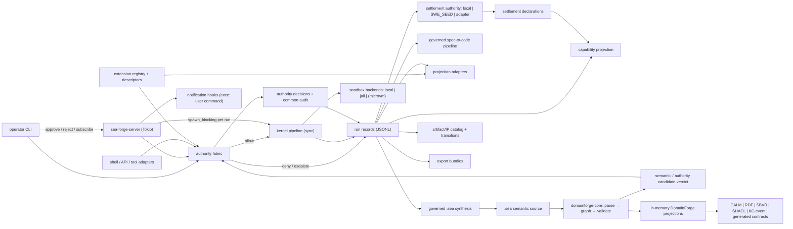

# SEA Forge — Extended Full System Specification

Status: Draft v0.2

Scope: Rust (stable, edition 2021), Linux primary / macOS secondary. Tokio async where stated. Multi-crate workspace.

Purpose: Grow the minimum vertical slice (`spec-minimum.md`) into the full governed capability substrate: a unified authority fabric, pluggable sandboxes with OS-level enforcement, DomainForge-backed `.sea` semantic loading and validation, a CMMN-subset case engine (cases, stages, sentries, milestones, discretionary items), versioned plan templates, an operator approval loop, a long-running server, independently declared and reliability-weighted settlement, governed semantic memory, environment contracts with evaluator-based and batch verification, first-class spec-to-code and DomainForge projection pipelines, artifact-to-IP promotion, and SeaCell federation readiness.

Owner: SEA Forge core team

Architecture decision: `docs/decisions/ADR-001-domainforge-semantic-boundary.md`.

Prerequisite: **`spec-minimum.md` implemented and green.** This spec never redefines the kernel types, lifecycle, ID grammar, record formats, authority hashes, audit record shape, or fail-closed rules — it extends them. Authority is not an extension capability; it is the invariant substrate for every extension. Where a section here is silent, the minimum spec governs. Corrections R1–R10 from `build-report-review.md` apply throughout.

## 0. Spec Frame

1. What should be built? — The kernel workspace of the build report, populated by graduating the minimum slice's modules into crates, hardening the authority fabric into a policy-gateway-compatible runtime, and adding ten extension capabilities (E1–E10 below) in milestone order.
2. What result should it produce? — The same governed run record as the slice, now for: long-lived cases with sentry-activated plan items, untrusted commands under OS-level jails, operator-approved escalations and discretionary planning, concurrent cases via a server, spec-to-code projections, artifact-to-IP transitions, and machine-consumable capability/projection outputs.
3. How will we know the result is real? — Each milestone has its own conformance gate (§17); a milestone that cannot pass the *minimum* spec's proofs P1–P4b unchanged has broken the kernel and MUST be rejected.
4. What capability should get stronger after repeated use? — Capability memory becomes queryable: operators and downstream generators can ask "what has this system demonstrated under which variation, recovery, and settlement reliability," and get a tamper-evident, fork-detectable, externally verifiable evidence-linked answer. A local hash alone never justifies a tamper-proof claim (§7.0c).
5. What evidence proves the capability claim? — `CapabilityRecord`s promote capability-attempt observations only from qualifying `SettlementDeclaration`s and record variation, recovery, orchestration burden, regressions, and reliability weight (§7.2.1/§7.3); spec-to-code and artifact-to-IP claims retain their hash-linked proof chains; all projections rebuild byte-identically from source records.
6. What fails safely? — Everything in the minimum spec, plus: invalid or stale DomainForge models fail before planning or execution; identity resolution failures escalate; a missing, malformed, forked, truncated, or unanchored-required integrity ledger halts affected work before side effects; required DomainForge/policy-gateway/OPA/GovernedSpeed evaluators that are missing or unavailable deny or escalate, never allow; jail violations kill the run and settle `rejected`; unapproved escalations expire to `rejected`; a dead server leaves resumable, self-describing run directories.
7. What must repeat until reliable? — §13/§17.2 per milestone; especially jail-violation tests and approval-expiry tests.
8. What changes when evidence disagrees with the design? — §5 claim table; notably, if Landlock proves impractical for the workload, the sandbox backend contract (§11.2) is the isolation seam and a MicroVM backend replaces it without kernel changes.

## Normative Language

RFC 2119 keywords as in the minimum spec. `Implementation-defined` likewise.

## 1. Problem Statement

The minimum slice proves the lifecycle for one trusted command in one process. The full system exists because real governed work is not like that:

Job-to-be-done:

- When an operator or agent needs SEA Forge to run *untrusted* or *multi-step* work, possibly *concurrently*, with humans approving escalations, they need the same governed lifecycle to hold — authority before side effects, evidence for everything, settlement over exit codes — under isolation strong enough that the guarantee survives a hostile payload.

Current failure mode (of the slice, honestly stated):

- Process-level sandboxing: a hostile child escapes trivially (documented limitation, minimum spec §15).
- One node, one run, no operator loop: `escalate` dead-ends instead of routing to a human.
- Envelopes accumulate but nothing consumes them: capability memory is write-only.

Important boundary:

- The full system is still a substrate — not an agent framework. Agents/LLMs are *callers* (they submit intents and plans) and *payloads* (they run inside sandboxes); they are never trusted components of the kernel.
- Successful execution still means settlement acceptance, now potentially including a human approval as a settlement input.
- DomainForge owns `.sea` syntax, semantic graph construction, concept identity,
  semantic validation, and deterministic projections from a validated graph.
  SEA Forge owns action authorization, isolation, side effects, evidence, and
  settlement. A DomainForge result informs SEA Forge; it never bypasses or
  replaces SEA Forge's final authority decision.

## 2. Goals and Non-Goals

### 2.1 Authority invariant — before the ten extension capabilities

Full SEA Forge MUST keep one authority fabric across CLI, server, shell, API, tool adapters, generators, and artifact/IP commands:

- Canonical action requests use the minimum spec's CAM-compatible shape: actor, action, resource, context, evidence, and deterministic hashes.
- Identity onboarding resolves the actor before any protected action. Automated agents (`R-AA`) require a human or service sponsor for privileged actions.
- Policy bundles are hash-addressed and may be composed from file, command, API, git commit, PR merge, prompt-risk, memory-recall, spec-pipeline, artifact-transition, attestation, approval, deployment, secret, and policy-mutation surfaces.
- Every protected ingress route calls the authority mediator before execution. Missing, unreachable, undecidable, or unsupported authority paths fail closed (`deny` or `escalate`) and still emit evidence.
- The common governance verdict model normalizes candidate results using disposition precedence `deny > boundary > allow > degraded > escalate`; the most restrictive result wins when engines disagree.
- DomainForge, OPA, and GovernedSpeed are semantic, policy, or risk evaluators,
  not owners of SEA Forge authority. The policy gateway / authority service owns
  the final decision and audit record; evaluator "pass" or fail-open modes are
  invalid for action gating.
- Every decision emits the common audit shape `{engine, disposition, subject, reason, evidence_refs, recorded_at}` and is linkable from run evidence, case events, approvals, capability memory, spec pipeline records, and artifact transition tokens.

### 2.2 Core / first-party extension / plugin boundary

SEA Forge MUST distinguish what must be baked into the kernel from what can be installed later:

| Bucket | Must be present from the beginning | Rationale |
|---|---|---|
| Kernel invariants | versioned canonical record encoding, ULID record identity, append ordinals, per-stream hash chains, Merkle-Mountain-Range commitments, signed/witnessed checkpoints, trace/evidence/settlement/envelope records, capability append, authority fabric, artifact descriptors, extension descriptors, projection refs, projection purity rules, and compatibility/version-skew reading | These define the durable truth model. Retrofitting them later would re-key history or create bypass paths. |
| Kernel extension ABI | `ExtensionDescriptor`, `ProjectionRef`, `ProjectionAdapter`, `RuntimeAdapter`, `EventSink`, `SandboxBackend`, `Evaluator`, `ArtifactAttestor`, and import/export descriptor shapes | Plugins can vary, but their contracts, authority surface, determinism requirements, and evidence outputs must be stable before plugins exist. |
| First-party extensions | DomainForge semantic adapter, jail sandbox, case engine, server/approval loop, capability projection, governed semantic memory, spec-to-code and DomainForge projection pipeline, templates/environments/evaluators, SeaCell bundles, artifact-to-IP | These are SEA Forge capabilities that share kernel state and proof gates. They ship as milestones, not third-party plugins. |
| Later plugins/adapters | UI clients, chat/Slack/GitHub adapters, alternate KG backends, additional projection targets, additional runtime adapters, notification channels, NATS/EventSink, MicroVM sandbox, egress proxy, vector-memory index, EnvHub importers, RL reward exporters, public marketplace bridges | They can be added without changing kernel records if they obey the extension ABI and authority fabric. |

Plugins/add-ons MUST NOT own truth. They may read source records, request authority, produce evidence, emit projections, or call external systems through adapters. Any state they need to persist must be either rebuildable from source records plus descriptor versions, or captured as evidence/artifact records with settlement.

DomainForge compatibility rule: `.sea` is the semantic source language.
DomainForge parses it into the canonical in-memory semantic graph and projects
that graph to CALM, RDF, SBVR, SHACL, KG events, manifests, generated contracts,
and other supported targets. SEA Forge MAY synthesize a `.sea` source artifact
from governed records, but that synthesis is a separate operation; DomainForge
MUST parse and validate the result before downstream projection. The first-party
adapter MUST use the `domainforge-core` library, preserve concept IDs and
semantic refs, declare input/output schemas, write quarantine records for
rejected mappings, and settle on semantic and output validation rather than file
creation.

### 2.3 Goals — the ten extension capabilities

- E1 **Hardened pluggable sandboxes**: `ExecutionSandbox` backends — `local` (from the slice), `jail` (Landlock on Linux / Seatbelt on macOS; Shepherd's pattern), later `microvm` (CubeSandbox's pattern) — selected per run by authority-checked policy. Untrusted argv0s MUST only be allowed on `jail` or stronger.
- E2 **CMMN-subset case engine** (review §6): work is organized as long-lived Cases, not one-shot runs. A `CasePlanModel` contains Stages and PlanItems whose activation is driven by **sentries** — event-condition rules evaluated over the trace/case-file ledger SEA Forge already emits — rather than a prescribed sequence (`depends_on` survives only as sugar compiling to an entry criterion). Milestones are first-class, entry-criteria-gated achievements generalizing settlement; a case completes by its auto-complete condition (all `required` items completed, none active), not by reaching the end of a list. Discretionary items make runtime plan mutation a governed act: adding a task mid-case is an authority-checked operation with evidence. Adopted element subset and exclusions per review §6 (notation, DMN decision tasks, and CaseTask are out; CaseTask is roadmap). Knowledge work is case-shaped — activities partly known in advance, order unknowable at start — which is SEA Forge's actual workload.
- E3 **Operator interface and escalation loop**: `sea-forge-server` (Tokio) + event subscription; `escalate` verdicts become pending approvals that a human resolves via CLI (`sea-forge approve|reject <run_id> <decision_id>`) within a TTL (AgentPet's hooks→daemon→notify pattern, minus the pet).
- E4 **Settlement integrity and capability memory**: `SettlementAuthority` adapters issue reliability-weighted `SettlementDeclaration`s with explicit standing and independence; `CapabilityRecord` promotes attempt observations only after qualifying repetition, variation, and recovery. `sea-forge capability list|show` remains a rebuildable projection, never a second source of truth. SWE_SEED is the first external settlement-authority adapter.
- E5 **Governed spec-to-code and generator pipelines**: SEA Forge owns the whole governed execution chain, not the semantic implementation: ADR → PRD → SDS → synthesized or authored SEA source → DomainForge AST/semantic graph → manifest → DomainForge-generated contracts → handwritten last-mile adapter/runtime → acceptance evidence. Each stage is a case plan item with authority, deterministic input/output digests, quarantine for invalid records, and settlement. Generated zones stay projections; runtime readiness requires the last-mile proof path. `sea-forge project <case_id..>` first synthesizes or selects `.sea`, validates it through the M0 DomainForge semantic adapter, then invokes DomainForge's in-memory projections. It is one instance of the larger spec-to-code invariant.
- E6 **Federation readiness (SeaCell)**: every persisted record already carries `version` + IDs; this milestone adds a `cell_id` field, an export bundle format, and an `EventSink` trait with a JSONL implementation — NATS or another bus is a later adapter behind that trait, not a dependency.
- E7 **Governed semantic memory** (Memori delta, review §5): capability memory becomes a read/write loop — typed `MemoryItem`s extracted from envelopes and traces, attribution-scoped (entity × process × session, Memori's model), indexed in a rebuildable SQLite FTS projection, and recalled under authority: recall is an `Operation`, scope rules gate who may read whose memory, and every recall emits evidence so a settled run shows which memories informed it. Memori proves the memory mechanics; the authority/evidence wrapping is SEA Forge's addition.
- E8 **Plan templates** (Archon delta, review §7 D6): named, versioned, parameterized CasePlanModel definitions in YAML (`.sea-forge/templates/<name>@<version>.yaml`), instantiated per case via `sea-forge run --template <name>@<version> --param k=v`. The template is the durable process asset — "what Dockerfiles did for infrastructure" — and completes CMMN's design-time/run-time distinction: template = design time, case = run time. Instantiation output is an ordinary CasePlan that passes full schema validation and per-operation authority; templates confer zero privilege by themselves.
- E9 **Environment contracts and evaluators** (AEnvironment delta, review §7 D7/D8): an `EnvironmentSpec` (`name@version`) declares a sandbox's *content* — the commands/tools it provides and the `Evaluator`s it ships — orthogonal to its isolation class. Settlement criteria can reference `evaluator: <env>.<name>` instead of only exit-code/artifact checks, and batch criteria score record collections. Evaluators produce verification inputs; they do not acquire standing to declare settlement. Environments are local artifacts first; a shareable hub and reward export for RL training are roadmap seams, not scope.
- E10 **Artifact-to-IP pipeline**: every work product starts as a content-addressed artifact and may progress only by governed transitions: `cognitive` → `intellectual` → `product` → `capital`. Each transition emits a TransitionToken, validates stage gates, binds ownership/license/review status, records semantic anchors where required, and optionally promotes `ifl:hash` to an attested `ifl:token`. Capitalization requires human approval and evidence of reuse or quality; no artifact may teleport across stages.

### 2.4 Non-Goals

- Building a UI (web or desktop). The operator surface is CLI + machine-readable event stream; a UI is a future client of E3's contracts.
- Reproducing CubeSandbox's cluster control plane (CubeMaster/Cubelet multi-node scheduling). Single-host server only; multi-host arrives with federation, if ever.
- LLM-based planning inside the kernel. An LLM MAY produce a `Plan` *proposal* externally; the kernel validates it like any untrusted input (§8.6).
- Agent personality/gamification (AgentPet's product surface — review C1).
- Distributed transactions, exactly-once delivery, or byzantine tolerance in federation. Export/import of signed-by-hash bundles only.
- KV-cache-aware agent replay (Shepherd's research contribution). Trace replay here means re-execution comparison, not model-state restoration.
- A hosted memory cloud, embeddings, or a vector database. Memori itself is SQL-native and beats vector-first systems on LoCoMo at a fraction of the tokens; SEA Forge follows: SQLite FTS first, Postgres adapter as roadmap, vectors only if FTS measurably fails a real recall workload.
- Automatic LLM-conversation interception inside sandboxes (Memori delta D5). Roadmap only: it composes with the future egress-proxy layer (CubeSandbox's pattern) — captured turns would enter as trace events. Do not build a client-wrapper SDK.
- CMMN as *notation*: no diagram rendering, no XML/CMMN-DI interchange, no planning-table UI. SEA Forge adopts CMMN's execution semantics (review §6), not its drawing standard. Also excluded: DecisionTask/DMN (authority is the decision layer) and CaseTask (case-invokes-case — roadmap once a real composition need appears).
- An EnvHub-style public registry for environments or templates (AEnvironment's EnvHub). Local artifact stores first; federation bundles (E6) MAY carry templates/environments between cells — that is the sharing mechanism.
- RL-trainer integration (AEnvironment/AReaL's use case). Scored settlements are exportable as reward signals by construction; the export adapter is roadmap.
- A visual workflow builder, chat UI, or Slack/Telegram/GitHub adapters (Archon's product surface). The server's Unix-socket event stream is the adapter seam; adapters are future clients, not substrate.
- A public IP marketplace, financial valuation engine, royalty system, or legal title transfer. E10 records internal maturity, ownership, license, review, attestation, and reuse evidence; external legal/commercial processes remain outside SEA Forge.
- Payment estimation, affordance ranking, and horizon selection. SEA Forge MAY
  record observed cost/burden evidence, but CognitiveOS owns pricing and path
  valuation, while GodSpeed-Agent owns developmental routing and horizon changes.

## 3. Outcome Contract

### 3.1 Output Produced

Everything in minimum spec §3.1, per execution episode — run directories move under their case (`.sea-forge/cases/<case_id>/runs/<run_id>/`, M0 migration §7.1), the case directory adds `case.json` + `case-events.jsonl`, and settlement/artifacts gain `plan_item_id` scoping — plus:

From M0 onward, v0.2 JSON/JSONL files under run and case directories are
compatibility/materialized views of verified ledger entries. They MAY be rebuilt
from the ledger and are never authoritative to overwrite it. The legacy v0.1
layout remains readable and is committed by migration genesis entries.

- `.sea-forge/capabilities/` — rebuildable `CapabilityRecord` projection (E4).
- `.sea-forge/capabilities/policies/<sha256>.json` — immutable promotion-policy snapshots referenced by capability projections (E4).
- `.sea-forge/settlement/declarations.jsonl` — append-only `SettlementDeclaration` source records issued by configured settlement authorities (E4); local/weak declarations and qualifying/strong declarations share the same typed format.
- `.sea-forge/memory/items.jsonl` — extracted `MemoryItem`s (source of truth) and `.sea-forge/memory/index.sqlite` — FTS index, rebuildable from `items.jsonl` (E7).
- `.sea-forge/approvals.jsonl` — approval requests and resolutions (E3).
- `.sea-forge/authority/policy-bundles/<policy_bundle_hash>.json` — canonical validated authority bundle snapshots, including identity, role, SoD, file, API, git, PR, prompt, spec-pipeline, artifact-transition, attestation, deployment, secret, and policy-mutation surfaces.
- `.sea-forge/authority/decisions.jsonl` — append-only mirror of final authority decisions across all ingress paths.
- `.sea-forge/authority/audit.jsonl` — common governance audit records normalized from DomainForge / policy gateway / OPA / GovernedSpeed / local engines.
- `.sea-forge/authority/opaque-constraints.json` — bounded-undecidability constraints created when policy engines cannot resolve a conflict; matching actions halt/escalate before other rules run.
- `.sea-forge/ledgers/<ledger_id>/entries.jsonl` — append-only ledger entries; the v0.2 source of truth for every persisted SEA Forge application source record and security-relevant artifact commitment (§7.0c).
- `.sea-forge/ledgers/<ledger_id>/checkpoints.jsonl` — signed stream checkpoints with Merkle-Mountain-Range roots and consistency proof material (§7.0c).
- `.sea-forge/ledgers/global-checkpoints.jsonl` — signed global checkpoints committing every active stream root in a deterministic order (§7.0c).
- `.sea-forge/ledgers/witness-receipts.jsonl` — independently signed checkpoint-anchor receipts; a local checkpoint without the required receipts is not externally verifiable (§7.0c).
- `.sea-forge/ledgers/quarantine/` — retained invalid tails, fork candidates, and failed verification inputs; repair never silently deletes or rewrites them (§7.0c).
- `.sea-forge/extensions/registry.json` — installed/built-in extension descriptors, their versions, capabilities, schema hashes, authority surfaces, and trust level.
- `.sea-forge/extensions/descriptors/<extension_id>@<version>.json` — immutable descriptor snapshots referenced by runs and projections.
- `.sea-forge/spec-pipelines/<pipeline_id>/` — spec-to-code run records: stage manifests, input/output hash chains, generated-zone diffs, last-mile gap reports, acceptance proof references, and quarantine files for rejected projection records (E5).
- `.sea-forge/projections/<projection_id>/projection.json` — projection record with adapter descriptor, inputs, outputs, validation result, quarantine refs, and settlement ref.
- `.sea-forge/projections/<projection_id>/outputs/` — governed `.sea`
  synthesis outputs and DomainForge-produced CALM, RDF, SBVR, SHACL, KG-event,
  manifest, generated-contract, or implementation-defined outputs (E5), plus
  `quarantine/<stage>.jsonl` for filtered-out records with provenance.
- `.sea-forge/artifacts/catalog.jsonl` — content-addressed work-product descriptors from the minimum spec, extended with stage history (E10).
- `.sea-forge/artifacts/transitions.jsonl` — append-only TransitionTokens for cognitive→intellectual→product→capital movement (E10).
- `.sea-forge/ip/capital/<artifact_id>.json` — rebuildable intellectual-capital projection for artifacts that passed capitalization (E10).
- `.sea-forge/templates/<name>@<version>.yaml` — plan templates (E8); immutable once referenced by a case (new content = new version).
- `.sea-forge/environments/<name>@<version>.yaml` — environment contracts (E9); same immutability rule.
- `.sea-forge/export/<bundle_id>.tar` — federation bundles (E6); MAY include templates and environments.

### 3.2 Outcome Verified

Per milestone gates in §17. Globally: minimum-spec proofs P1–P4b MUST pass unchanged at every milestone (kernel non-regression), and every new record kind MUST satisfy the same cross-linkage proof style as P2.

A run MUST NOT be reported complete while any node's settlement is missing or any approval is unresolved (pending approvals hold the run in `awaiting_approval`, §9).

### 3.3 Consumer and Handoff

Consumers: operators (CLI + event stream), downstream generators/spec-to-code runners (E5), artifact/IP governance surfaces (E10), other cells (E6), and the capability query surface (E4). Handoff completes per the minimum spec, extended with exit code 5 = `awaiting_approval` (run parked, resumable).

## 4. Capability Claim

After repeated use, operators and downstream systems should be better able to (a) route new intents to proven capabilities, (b) refuse work the system has never safely demonstrated — using `sea-forge capability show <name>` instead of tribal knowledge — (c) let new runs be informed by prior runs' facts, decisions, and outcomes through governed recall, without hand-carrying context (E7), (d) regenerate code from authority and know exactly where generated contracts stop and handwritten runtime proof begins (E5), and (e) know which artifacts are raw notes, structured knowledge, product deliverables, or reusable capital with evidence (E10).

Proven only if:

- Capability records reproduce byte-identically from raw envelopes plus settlement declarations and promotion-policy snapshots (`sea-forge capability rebuild` diff-clean).
- Raw counts distinguish accepted / rejected / escalated observations, while promotion uses only qualifying declarations and records reliability weight, declared variation coverage, recovery, regressions, and orchestration burden.
- At least one routing decision is exercised in tests: `require_proven` denies a capability with accepted observations that has not met the configured `proven` promotion threshold, citing the consulted record and policy hash.
- Spec-to-code pipeline records reproduce the generated-contract manifest and last-mile gap status from the same inputs; a generated contract alone never upgrades the proof classification above `generated-contract`.
- Artifact capital records are rebuildable from `catalog.jsonl` + `transitions.jsonl`; every capital artifact has a complete transition chain from its initial stage and a human-approved capitalization token.

Not proven by: envelope accumulation alone; one accepted run; repeated identical runs; a self-declaration by the acting agent; generated files under `src/gen`; dashboards; documentation.

## 5. Evidence and Claim Discipline

| Claim | Level | Required evidence | Current evidence | Gap |
|---|---|---|---|---|
| Kernel lifecycle survives all ten extensions | Assumption | P1–P4b green at every milestone | slice-level only (once minimum ships) | build milestones |
| Landlock/Seatbelt jails can enforce ReadOnly/ReadWrite roots for arbitrary child processes | Evidence-backed (by reference) | Shepherd does exactly this in production alpha | verified in review §1 | port the pattern to Rust (`landlock` crate exists; Seatbelt via `sandbox-exec` profile) |
| MicroVM backend is achievable behind `ExecutionSandbox` | Roadmap | CubeSandbox demonstrates the runtime model | reference only | not required for conformance of this spec |
| JSONL remains sufficient at server concurrency | Assumption | R-jsonl test (§17.2) at 8 concurrent runs | none | if it fails: per-run files already isolate writes; only `capabilities.jsonl` and `approvals.jsonl` are shared — move those two behind a single writer task |
| Yjs-style collaborative state is needed | Rejected | — | Traycer needs it for co-editing UIs; SEA Forge has no co-editing surface | none — deliberate omission |
| Approval-over-CLI is a sufficient operator surface | Partially proven | E3 tests + one human dry run | AgentPet shows notification-driven supervision works | run the dry run |
| Unified authority can cover file/API/git/PR/prompt/tool/spec/artifact surfaces without a second gate | Evidence-backed (by repo authority model) | M0 authority gate: onboarding, deterministic decision hashes, file/API/git/PR/prompt/shell fixtures, fail-closed gateway/OPA behavior, common audit trail, conflict precedence, opaque constraints | SEA repo already has policy-gateway `/policy/authority/evaluate`, CAM-shaped requests, file/API/git/PR/prompt policy fixtures, GovernedSpeed verdict normalization, and fail-closed edge mediators | wire as the first kernel crate seam and forbid bypass surfaces |
| A signed, witnessed append-only ledger detects alteration, deletion, reordering, truncation, and forks without claiming impossible local tamper-proofness | Assumption | M0 integrity-ledger gate: per-stream chain/MMR verification, signed global checkpoints, independent witness receipts, inclusion/consistency proofs, crash recovery, and adversarial tamper fixtures | Current v0.1 hashes individual artifacts and uses append-only JSONL, but does not chain, sign, or externally anchor the history | implement `sea-forge-ledger` before other full-spec state grows; treat missing required witness receipts as a governed halt |
| DomainForge can supply canonical `.sea` semantics without owning SEA Forge side effects or final authority | Evidence-backed (by DomainForge public Rust API) | M0 gate: real SEA fixture parses and validates through `domainforge-core`, stable semantic refs are recorded, invalid semantics cause no side effects, and DomainForge authority results normalize fail-closed | DomainForge exposes parser → AST → Graph → validation, typed authority traces/decisions, and in-memory deterministic projection sinks | add the first-party library adapter at M0; keep projection execution at M5 |
| Plugin/add-on features can be delayed without re-keying records | Assumption | M0 extension descriptor validation + M5 ProjectionRecord rebuild proof | DomainForge projection contracts already map DSL to CALM/RDF/SBVR/SHACL and existing KG writer uses projection-event + DLQ semantics | implement the registry/ABI before optional plugins; keep plugin state rebuildable or evidenced |
| SQLite FTS recall is sufficient (no embeddings) | Evidence-backed (by reference) | E7 recall tests on realistic envelope volumes | Memori achieves 81.95% LoCoMo accuracy SQL-natively at ~5% of full-context tokens | validate on SEA Forge's own data shape |
| Deterministic extraction yields useful MemoryItems without an LLM | Assumption | E7 extraction tests: items are deduplicated, provenance-linked, and recall-relevant | none | if too shallow: LLM-assisted extraction as untrusted proposals (§8.6 pattern), never in-kernel |
| Sentries over the existing trace ledger suffice as the case engine (no separate workflow engine) | Assumption | M2 sentry-replay determinism + the full M2 gate | the ledger and event kinds already exist from the slice; CMMN semantics are event-condition rules by definition | if predicate needs outgrow `if`-parts: extend the predicate vocabulary, never add hidden engine state |
| Versioned templates make agent processes repeatable across projects | Evidence-backed (by reference) | M2 template gate: same template + params ⇒ identical CasePlan | Archon demonstrates the model in production use | instantiation determinism test |
| Declarative evaluators cover most settlement needs beyond exit/artifact checks | Assumption | M7 gate: demo evaluator + batch threshold settle correctly | AEnvironment (`@register_reward`) and DataFlow (eval operators) both converge on this shape | if declarative predicates are too weak: evaluators become sandboxed commands whose exit/stdout is the score — same governance, more power |
| Independent, reliability-weighted settlement reduces manufactured capability | Assumption grounded in the Genesis threat model | M4a tests reject post-hoc criteria and self-declaration, discount gameable/low-attribution feedback, and prevent non-qualifying declarations from promotion | minimum v0.1 proves only kernel-local verification | ship the declaration protocol before capability promotion; compare regressions under local versus external declarations |
| Repetition under declared variation and recovery is sufficient for `proven` promotion | Assumption | M4a promotion/contraction tests plus at least one real varied workload | minimum variation tests prove kernel behavior, not durable capability | keep thresholds policy-versioned and expose evidence rather than claiming universal calibration |
| Spec-to-code can be governed as ordinary case work rather than a separate control plane | Evidence-backed (by repo invariant) | M5 gate: ADR/PRD/SDS/SEA/AST/IR/manifest/codegen/last-mile chain hash-linked and deterministically replayed | SEA repo already uses spec-first generator-first and last-mile routes | wire as case-plan items; keep generated zones read-only |
| Artifact-to-IP progression prevents provenance loss | Partially proven | M8 gate: no-teleportation, TransitionToken hash chain, stage gate validation, capitalization approval | ProjectCase artifact pipeline defines cognitive→intellectual→product→capital and TransitionTokens | implement catalog/projection and IFL attestation adapter |

## 6. System Overview

### 6.1 Architecture Pattern

- Pattern: library kernel + one-shot CLI (unchanged) + **optional resident server** (Tokio) that runs the same pipeline concurrently and exposes an event stream. The CLI works fully without the server; the server adds concurrency, approvals routing, and subscriptions.
- Async boundary (review R2 resolved): `sea-forge-server`, the event stream, and approval TTL timers are async (Tokio). The kernel crates stay synchronous; the server drives each run on `spawn_blocking` (or a worker thread pool). Kernel traits do NOT become `async fn` — the seam is at the server, not in the domain. This keeps the kernel testable without a runtime and is revisited only if a sandbox backend is inherently async (MicroVM control APIs may force a small async adapter in `sea-forge-runtime`; isolate it there).
- Patterns rejected: event-bus-first design (premature; `EventSink` trait keeps the door open), microservices (single host), database-first storage (JSONL + rebuildable projections until proven insufficient).

### 6.2 Main Components — crate graduation map

The kernel crates from the report are populated by moving the minimum slice's modules (mechanical per review R1). Two pipeline crates are added because spec-to-code and artifact-to-IP are not UI conveniences; they are governed lifecycle capabilities with their own persistence and proof rules.

| Crate | From slice module | Extension content (milestone) |
|---|---|---|
| `sea-forge-core` | ids/types/errors | `cell_id` field, bundle types (M6) |
| `sea-forge-ledger` | — (new) | canonical encoding, monotonic ULID generation, stream append ordinals, chain/MMR construction, checkpoint signing, witness verification, proofs, migration, and recovery (M0) |
| `sea-forge-domain` | domain.rs | intent vocabulary registry; plan-proposal validation (M2); recall consultation at plan time (M4b) |
| `sea-forge-domainforge` | — (new) | first-party `domainforge-core` adapter: `.sea` parse/Graph/validation, semantic-model refs, DomainForge authority-verdict normalization (M0); concept-ref validation in plans (M2); in-memory projection dispatch (M5) |
| `sea-forge-authority` | authority.rs | CAM request/decision model, identity onboarding, policy bundle snapshots, RBAC/SoD, file/API/git/PR/prompt/shell governance, policy-gateway client, GovernedSpeed/OPA verdict adapters, conflict precedence, opaque constraints, sandbox-class rules, `require_proven` rules, approval TTL policy (M0–M3) |
| `sea-forge-planner` | planner.rs | case plans (stages/sentries/milestones/markers), `depends_on`→sentry compilation, plan-proposal ingestion, discretionary-item validation, plan templates (E8) (M2) |
| `sea-forge-sandbox` | sandbox.rs | `SandboxBackend` enum + `jail` backend (M1); `EnvironmentSpec` contracts (E9, M7); `microvm` (roadmap) |
| `sea-forge-runtime` | runtime.rs | per-backend executor selection (M1) |
| `sea-forge-trace` | trace.rs | `EventSink` trait; live tail (M3) |
| `sea-forge-evidence` | evidence.rs | unchanged + approval evidence kind (M3) |
| `sea-forge-settlement` | settlement.rs | approval-input criteria; per-item kernel-local verification, milestone achievement, case rollup (M2, M3); `SettlementAuthority` adapters and declarations (M4a); evaluator references + batch thresholds as verification inputs (E9, M7) |
| `sea-forge-capability` | capability.rs | promotion-aware `CapabilityRecord` projection + rebuild + query over envelopes/declarations/policy snapshots (M4a); `MemoryItem` extraction, SQLite FTS index, governed recall (M4b, E7) |
| `sea-forge-extension` | slice descriptor types | extension registry, descriptor validation, projection adapter ABI, install/adopt records, compatibility checks (M0, M5+) |
| `sea-forge-interface` | — (new) | operator event subscription, notification hooks, approve/reject commands (M3) |
| `sea-forge-spec-pipeline` | — (new) | ADR/PRD/SDS/SEA/AST/IR/manifest/codegen/last-mile stage records, deterministic replay, generated-zone guard, gap/proof classification (M5) |
| `sea-forge-artifact-ip` | — (new) | artifact catalog, TransitionTokens, no-teleportation validation, pre-mint/attested identity binding, capital projection (M8) |
| `sea-forge-cell` | — (new) | bundle export/import, `cell_id` management (M6) |
| `sea-forge-cli` | cli crate | new subcommands per milestone |
| `sea-forge-server` | — (new) | Tokio daemon: run queue, concurrency limit, Unix-socket API (M3) |

#### Component Diagram



### 6.3 External Dependencies (beyond minimum spec)

- A reviewed ULID implementation or a small audited internal implementation — v0.2 persisted records use monotonic, CSPRNG-backed ULIDs. Failure to obtain secure randomness is a typed integrity failure; time order never substitutes for a stream append ordinal.
- Ed25519 signing implementation and protected signer interface — signs stream and global checkpoints. Private keys MUST remain outside `.sea-forge/`, workspace artifacts, trace payloads, and ordinary process environments. Failure to sign a required checkpoint halts the affected ledger before side effects.
- Independent witness/anchor adapter transport — obtains signed receipts over global checkpoint hashes. A production policy declares `min_witnesses >= 1`; no receipt means `integrity_pending` or `ledger_integrity_error`, never a stronger assurance label.
- `domainforge-core` — first-party semantic library, with default features off
  and an exact reviewed version recorded in `Cargo.lock` (initial conformance
  target: `0.13.0`). Enable only required features; `signing` is REQUIRED when
  a configured DomainForge authority path accepts facts whose trust contract
  requires cryptographic signatures. The built-in adapter MUST call library
  APIs for parsing, validation, authority evaluation, and in-memory projection;
  it MUST NOT invoke the `domainforge` CLI as an untracked side-effect path.
  Parse, validation, feature, or version incompatibility fails closed before
  execution and is recorded as typed evidence. The minimum v0.1 crates remain
  dependency-free from DomainForge until M0 implementation begins.
- `tokio` — server runtime only. Failure: server won't start; CLI-only operation unaffected.
- `landlock` crate (Linux) / `sandbox-exec` profile generation (macOS) — jail backend. Failure at jail setup: run refuses to execute (fail closed), settles `rejected` with basis `jail_unavailable` — it MUST NOT fall back to `local` silently.
- `rusqlite` — memory FTS index (M4b) only. Failure: recall falls back to the `items.jsonl` linear scan (§10.5); never blocks a run.
- `tar` (crate) — export bundles. Failure: typed export error; no partial bundle left behind.
- Unix domain socket (std/tokio) — server API. Failure: client CLI reports server-unavailable; one-shot mode still works.
- Settlement-authority adapter transport (first: SWE_SEED) — receives immutable
  declaration requests and returns signed/hash-addressed declarations. Failure:
  typed integrity failure, zero qualifying capability weight, and no fallback
  from strong to local.

## 7. Core Domain Model — extensions only

All minimum-spec entities stand. New/extended (kept additive; every change bumps record `version` to "0.2"):

### 7.0 AuthorityFabric (M0 prerequisite)

**IdentityBinding** extends the minimum shape with: `identity_id`, `principal`, `roles` (array of `R-DS | R-AG | R-LC | R-SO | R-RM | R-DEV | R-AA | implementation-defined`), `source`, `binding_resolution`, `sponsor`, `issued_at`, `expires_at`, and `identity_binding_hash`. Automated agents with role `R-AA` MUST include a non-agent sponsor for privileged operations.

**AuthorityPolicyBundle**:

- `bundle_id`, `policy_bundle_hash`, `policy_bundle_version`, `loaded_at`.
- `sources`: array of `{surface, path, sha256}`. Required first-class surfaces: `authority_hooks`, `identity_map`, `domain_model`, `file_access`, `api_allowlist`, `git_commit`, `pr_merge`, `prompt_risk`, `memory_recall`, `spec_pipeline`, `artifact_transition`, `attestation`, `approval`, `settlement_authority`, `capability_promotion`, `deployment`, `secret_access`, `policy_mutation`, `evidence_mutation`.
- `roles` and `permissions`: RBAC grants for the role names above.
- `sod_rules`: separation-of-duty rules. Required rules: proposer != approver in production, semantic-debt requester != acceptor, break-glass requester != approver and approver has `R-SO`, key generator != key approver, capitalization requester != approver.
- `policy_engine_refs`: candidate evaluators (`local`, `domainforge`, `opa`,
  `governedspeed`, implementation-defined) and their fail modes. Action-gating
  evaluators MUST be fail-closed; fail-open/pass modes are schema errors.

**CanonicalActionRequest** is the minimum spec `AuthorityRequest`, extended only by optional fields. It MUST be the one wire shape for file writes, shell commands, API calls, git commits, PR merges, recalls, spec pipeline stages, artifact transitions, approvals, settlement-authority trust changes and declarations, deployments, secret access, policy mutation, and evidence mutation.

**AuthorityDecision** extends the minimum shape with:

- `candidate_verdicts`: array of GovernanceVerdict records from local rules,
  DomainForge, policy gateway, OPA, GovernedSpeed, or other engines.
- `winning_source` and `precedence_reason`.
- `approval_request_id` when `outcome: escalate` created a human approval.
- `opaque_constraint_id` when the decision halted inside a bounded-undecidability region.

**GovernanceVerdict**:

- `engine` (`local | domainforge | policy-gateway | opa | governedspeed | implementation-defined`).
- `disposition` (`deny | boundary | allow | degraded | escalate`).
- `subject` (action/resource identity), `reason`, `evidence_refs`, `recorded_at`.
- Resolver precedence is fixed: `deny > boundary > allow > degraded > escalate`. Missing required evidence resolves to `deny`; all-escalate conflicts create or reference an opaque constraint and halt as `escalate`.

**AuthorityAuditRecord** is the common audit shape from `GovernanceVerdict` plus `decision_id`, `case_id`, `run_id`, `policy_bundle_hash`, `action_request_hash`, and `identity_binding_hash`.

**OpaqueConstraint**:

- `constraint_id`, `target` (`resource_type`, `resource_id` or namespace pattern), `created_by_decision_id`, `reason`, `created_at`, `expires_at` (optional).
- Any matching action MUST halt before ordinary policy evaluation and return `escalate` with required step `resolve-governance-ambiguity`.

### 7.0a DomainForge semantic boundary (M0 contract; M2/M5 use)

`sea-forge-domainforge` is a first-party adapter around the canonical
`domainforge-core` Rust library. It is not part of `sea-forge-core`, and the
minimum kernel does not depend on it. Its public contract is synchronous and
side-effect-free:

```text
load_validate(SeaSourceSet) -> DomainModel
evaluate(DomainModel, CanonicalActionRequest, TrustedFacts) -> GovernanceVerdict
project(DomainModel, ProjectionRequest) -> SortedMap<RelativePath, Bytes>
```

**SeaSourceSet** contains one entry `.sea` source and any namespace-registry or
imported `.sea` files, each with workspace-relative URI and SHA-256. The adapter
MUST use DomainForge's namespace-aware parser. Absolute paths, unresolved
imports, source-hash changes, syntax errors, semantic validation errors, and
unsupported DomainForge versions fail before plan execution. The adapter
descriptor MUST declare finite limits for source count, aggregate bytes, import
depth, AST nodes, and parser work; exceeding any limit is `domain_model_error`,
not a reason to retry with weaker validation.

**DomainModel** is an in-memory derived view, not a second persisted truth. Each
governed consumer records a **DomainModelRef** containing:

- `source_refs`: sorted non-empty array of `{uri, sha256}` covering the entry
  source, namespace registry, and resolved imports.
- `domainforge_version`, `adapter_descriptor_sha256`, and
  `parse_options_sha256` (canonical hash of namespace/profile/parser options).
- `semantic_model_sha256`: SHA-256 of canonical
  `{domainforge_version, adapter_descriptor_sha256, parse_options_sha256,
  source_refs}`. This identifies the exact validated semantic input without
  depending on an unstable serialization of DomainForge's in-memory Graph.
- `concept_refs`: sorted array of canonical DomainForge concept IDs actually
  consulted by the plan, authority evaluation, or projection.
- `validation_evidence_refs`: non-empty refs proving parse and semantic
  validation results.

The plan, DomainForge candidate verdict, projection record, and semantic
envelope MUST reference the same `DomainModelRef` when they concern the same
world model. A source or version change creates a new ref; no run silently
rebinds to a different world.

`CasePlan`, `CanonicalActionRequest`, and `SemanticEnvelope` each gain optional
`domain_model_ref` and sorted `concept_refs` fields in v0.2. The fields are
REQUIRED when the plan or action is scoped to a `.sea` world and absent for
unbound legacy work. DomainForge `GovernanceVerdict` evidence resolves the same
ref rather than embedding a second copy of the model.

DomainForge authority normalization is fixed:

| DomainForge result | SEA Forge candidate disposition |
|---|---|
| `Reject` or `Deny` | `deny` |
| `Escalate` | `escalate` |
| `Allow` | `allow` |
| `NotApplicable` | no candidate; `deny` if policy requires DomainForge for the surface |

The adapter MUST preserve the DomainForge trace as evidence and include the
consulted `DomainModelRef`. SEA Forge then combines this candidate with hard
boundaries and all other configured engines using §7.0 precedence. DomainForge
never emits the final SEA Forge `AuthorityDecision`.

Projection MUST use DomainForge's in-memory artifact sink or equivalent public
library API. The adapter returns bytes and relative paths; only SEA Forge may
authorize and materialize them. The built-in path MUST NOT let DomainForge write
the workspace, invoke external tools, or access the network directly.

### 7.0b Extension and projection ABI (M0 contract, M5+ use)

The minimum spec defines `ExtensionDescriptor` and `ProjectionRef`. Full spec persists and enforces them.

**ExtensionRegistry** (`.sea-forge/extensions/registry.json`):

- `version`, `updated_at`.
- `extensions`: array of `{extension_id, version, descriptor_sha256, trust_level, status}`.
- `trust_level` (enum: `built_in | first_party | workspace | imported | quarantined`).
- `status` (enum: `active | disabled | quarantined | superseded`).

**ExtensionInstallRecord** (`extensions/descriptors/<extension_id>@<version>.json` plus evidence):

- `descriptor` (ExtensionDescriptor from the minimum spec).
- `installed_by`, `installed_at`, `source_uri`, `source_sha256`.
- `authority_refs`, `evidence_refs`, `settlement_ref`.
- `compatibility`: `{ min_kernel_version, max_kernel_version, required_record_versions, required_authority_surfaces }`.
- `adopted_from_bundle_id` (optional; imported extensions are inert until adopted by authority-checked command).

**ProjectionAdapter** is an extension kind with this stable contract:

- Inputs: source records by typed ref (`run_id`, `case_id`, `evidence_id`, `artifact_id`, `envelope_id`, `memory_id`, `pipeline_stage_id`), plus descriptor version.
- Outputs: one or more files/events with `{projection_kind, output_uri, output_sha256}` and optional quarantine JSONL.
- Required methods: `plan`, `project`, `validate`, `explain`, `rebuild`.
- Required properties: deterministic output for same inputs and descriptor version; no network or external write unless authority grants that resource class; validation failure produces `status: quarantined` or `rejected`, not a partial success.

**ProjectionRecord** (`.sea-forge/projections/<projection_id>/projection.json`):

- `projection_id`, `projection_kind` (`sea | calm | rdf | sbvr | shacl | kg_event | manifest | generated_contract | memory_index | capability_record | capital_record | implementation-defined`).
- `adapter_ref` (`extension_id@version`), `case_id`, `run_id`, and optional
  `domain_model_ref` (REQUIRED for a DomainForge projection).
- `source_refs` (non-empty), `input_hash`, `output_refs`, `quarantine_refs`.
- `validation`: `{ status, validator_ref, basis }`.
- `authority_refs`, `evidence_refs`, `settlement_ref`, `created_at`.
- `rebuild_hash`: hash of canonical `{adapter_ref, domain_model_ref, source_refs, descriptor_sha256, input_hash, output_refs}`.

DomainForge integration requirements:

- A `.sea` synthesis adapter converts governed SEA Forge records or authored
  specifications into SEA DSL source. It is distinct from the DomainForge
  adapter and MUST NOT label unvalidated output as a DomainForge model.
- DomainForge MUST parse and semantically validate every synthesized or authored
  `.sea` source before it becomes a `DomainModelRef` or feeds another
  projection. The minimum v0.1 JSON stub is a conformance fixture, not valid
  DomainForge SEA syntax and MUST NOT enter this path.
- Domain-code projections preserve SEA DSL annotations, including CQRS
  annotations where flows are emitted and `@read_model` where a query
  projection is declared.
- CALM projection maps entities/resources/flows/policies to architecture nodes, relationships, and controls.
- RDF/KG projection preserves `conceptId`/semantic refs when present and produces stable IRIs from canonical IDs.
- SBVR projection preserves policy modality and quantifiers.
- SHACL projection validates graph integrity and carries failure messages into quarantine records.
- KG event projection follows the existing projection-event pattern: event type, event ID/hash, payload with evidence/spec node IDs, relationship, timestamp, and source evidence.
- Every DomainForge output is a derived view of the `.sea` source set through a
  pinned DomainForge version and adapter descriptor. `.sea` owns semantic truth;
  SEA Forge's append-only case/run/authority/evidence/settlement records own
  governance truth.

### 7.0c Integrity ledger and record identity (M0 prerequisite)

#### Assurance claim and scope

The integrity ledger makes SEA Forge history **tamper-evident,
fork-detectable, and externally verifiable** when policy requires independent
witness receipts. It does not claim that bytes controlled by a single attacker
are absolutely tamper-proof. A local, unsigned, or unwitnessed root detects
only changes relative to a previously retained trusted checkpoint; it MUST NOT
be labeled externally verified or tamper-proof.

Every v0.2 persisted SEA Forge application source record becomes exactly one
ledger entry,
including case events, plans, authority decisions/audits, trace events,
evidence, settlements/declarations, envelopes/capability observations, memory
items, approvals, extension descriptors, projection/pipeline records,
artifact-catalog records, transition tokens, policy snapshots, configuration
snapshots, migration records, and witness receipts. Artifacts themselves remain
content-addressed files; the ledger commits their URI, content hash, declared
role, and metadata hash. It MUST NOT place raw secrets, credentials, private
keys, or sensitive payloads in a ledger merely to satisfy this scope. Ledger
protocol objects are the terminal integrity layer rather than recursively ledgered
application records: an entry is self-committing through `entry_hash`; stream
and global checkpoints are chained and signed; and witness receipts are signed
commitments to a global checkpoint. Their verifier treats each as a typed,
canonical protocol object, so omitting a recursive wrapper cannot create an
uncommitted mutable record.

Legacy v0.1 run directories and JSONL files remain immutable compatibility
evidence. M0 imports them losslessly through a migration genesis record; it
does not rewrite their IDs, record bytes, or historical meaning.

#### Canonical encoding and domain-separated hashes

Ledger-source records use UTF-8 JSON Canonicalization Scheme (RFC 8785), with
the following profile: NFC-normalized strings; integers only where JSON number
semantics are required; fixed-scale decimal strings for non-integer quantities;
sorted arrays whenever the semantic type is a set; and no NaN, infinity, or
implementation-defined float representation. Each persisted record declares
`canonicalization: jcs-nfc-v1` and `hash_algorithm: sha256-v1`. Future changes
require a new named algorithm/profile and an explicit migration; they MUST NOT
silently reinterpret existing bytes.

Hashes are domain-separated SHA-256 values over canonical objects:

```text
payload_hash = SHA-256("sea-forge/payload/v1\0" || canonical_payload)
entry_hash   = SHA-256("sea-forge/ledger-entry/v1\0" || canonical_entry_without_entry_hash)
stream_root  = SHA-256("sea-forge/mmr-root/v1\0" || canonical_mmr_state)
global_root  = SHA-256("sea-forge/global-root/v1\0" || canonical_sorted_stream_roots)
```

The canonical entry includes `payload_hash`, so a content hash cannot be reused
as an authority decision, artifact commitment, or checkpoint by type confusion.

#### ULIDs and ordering

Every new v0.2 ledger entry has `entry_ulid`: a 26-character Crockford Base32
ULID generated from a CSPRNG and monotonic within a process for equal or
regressing wall-clock timestamps. Every new persisted record also carries that
entry ULID as `record_ulid`. Existing typed IDs such as `run_*`, `case_*`,
`plan_*`, and `apr_*` remain stable semantic references and are never re-keyed.
ULIDs provide globally unique, time-local identity; they do **not** define
consensus order or integrity.

Each ledger stream assigns a gap-free `append_ordinal: u64` under a single
stream writer. The ordinal, not a timestamp or ULID, is the authoritative order
for chaining, inclusion, replay, and consistency proofs. Clock rollback,
concurrent ULID generation, duplicate ULID detection, or secure-RNG failure
fails closed as `ledger_integrity_error`.

#### Ledger streams and entries

A `ledger_id` identifies one append-only stream. At minimum, M0 provides one
stream per case and dedicated global streams for authority/configuration,
approvals, settlement declarations, capability/memory, extensions/projections,
artifact/IP, and federation. A run's trace and evidence entries append to its
case stream; their `run_id` and typed record IDs remain payload fields. No
global total order is implied across streams.

**LedgerEntry** (`ledgers/<ledger_id>/entries.jsonl`):

- `version`, `ledger_id`, `entry_ulid`, `record_ulid`, `append_ordinal`,
  `record_kind`, and typed `subject_refs`.
- `canonicalization`, `hash_algorithm`, `payload_hash`, and the canonical
  payload or a content-addressed payload reference.
- `previous_entry_hash` (`null` only at genesis), `entry_hash`, and
  `mmr_leaf_index`.
- `committed_at`, `writer_identity_ref`, and `authority_refs` where the record
  resulted from a protected action.

The writer validates `previous_entry_hash`, ordinal continuity, and duplicate
ULIDs before append. It serializes one record, writes it once, flushes and
durably syncs the file, then durably syncs its parent directory before exposing
the entry to readers or dependent streams. A process may buffer MMR nodes, but
it MUST NOT report an entry committed until its source entry is durable.

Each stream is both a previous-hash chain and an append-only Merkle Mountain
Range (MMR). The chain makes deletion, reordering, and predecessor substitution
immediately detectable; the MMR supplies logarithmic inclusion and consistency
proofs without rebuilding a whole tree on every append. An MMR leaf commits the
entry hash and append ordinal. Entries may never be inserted between committed
ordinals.

#### Checkpoints, signatures, and independent witnesses

**LedgerCheckpoint** (`ledgers/<ledger_id>/checkpoints.jsonl`) records:

- `checkpoint_ulid`, `ledger_id`, `first_ordinal`, `last_ordinal`,
  `entry_count`, `mmr_root`, `previous_checkpoint_hash`, and `checkpoint_hash`.
- `signing_algorithm: ed25519`, `signing_key_id`, `signature`, and
  `created_at`.
- optional `recovery_of`.

Every checkpoint signs its canonical content excluding `signature`. A global
checkpoint deterministically sorts `{ledger_id, last_ordinal, mmr_root,
checkpoint_hash}` for every active stream, hashes that set, chains to the prior
global checkpoint, signs it, and becomes the only object submitted to witnesses.
Witnesses return typed, independently signed receipts over
`global_checkpoint_hash`, signer identity, receipt time, and receipt hash.
Their keys and standing are policy snapshots; receipts from the acting entity,
the local signer, or an untrusted witness do not satisfy independence
requirements. Receipts reference the checkpoint they witness; they cannot be
included in that same checkpoint and are committed in the witness stream and a
subsequent global checkpoint.

Policy defines checkpoint cadence, required signer key classes, and
`integrity_ledger.min_witnesses`. Development may use a signed local checkpoint
with assurance `local_tamper_evident`. Production policy MUST require at least one
independent witness for assurance `externally_verified`. If a required witness
is unavailable, new affected side effects halt or remain `integrity_pending`;
SEA Forge MUST NOT relabel a local root as externally verified.

#### Verification, recovery, and privacy

`sea-forge ledger verify` verifies canonical payload hashes, ULID uniqueness,
ordinal continuity, predecessor links, MMR roots, checkpoint chains,
signatures, witness standing, global-root coverage, and artifact commitments.
`sea-forge ledger prove <entry_ulid>` emits an inclusion proof; `sea-forge
ledger consistency <checkpoint_a> <checkpoint_b>` emits an append-only
consistency proof. Both proofs verify without loading unrelated payloads.

At startup, before privileged execution, SEA Forge verifies every stream from
its most recent trusted global checkpoint. A malformed entry, missing ordinal,
chain break, invalid signature, witness mismatch, rollback, or fork writes the
observed bytes to ledger quarantine, emits `ledger_integrity_failed` evidence
when possible, and halts the affected scope. It never silently repairs,
rewrites, or truncates committed history. Recovery may discard only an
uncheckpointed, incomplete final write after preserving it in quarantine and
recording a signed recovery checkpoint that names the discarded bytes.

Hashes do not conceal data. Sensitive values remain out of ledger payloads; the
ledger commits approved ciphertext or redacted metadata where needed. Retention
uses tombstone entries and, where authorized, crypto-shredding of separately
stored encryption keys. It never rewrites a historical ledger entry to erase a
value.

#### Migration and compatibility

`sea-forge migrate` creates one or more `legacy_import` genesis entries that
commit the byte SHA-256, path, size, and legacy record version of every v0.1
source file. It then creates and signs an initial global checkpoint. Imported
records have assurance `legacy_digest_only`; they cannot be claimed as
historically witnessed. New v0.2 views may reference legacy typed IDs, but all
new writes use ledger entries and ULIDs. A byte-identical rebuild from verified
entries reproduces every rebuildable view; no view is authority to overwrite
the ledger.

### 7.1 Extended entities (E2 case engine)

**Case** (from the slice) gains: `stages`, reopen support (`completed/terminated → active` is an authority-checked operator operation, evidenced), and multi-episode `run_ids`. The case directory grows to `.sea-forge/cases/<case_id>/` containing `case.json`, the case-level event log `case-events.jsonl`, and `runs/` (run directories move under their case; the slice's flat layout is migrated in M0 by a one-shot `sea-forge migrate` command).

**PlanItem** gains: `item_kind` (enum: `sandboxed_task | human_task | milestone | stage | timer_listener | user_event_listener`), `sandbox_class` (enum: `local | jail | microvm`; sandboxed_task only), `parent_stage` (item id or null = case plan root), `markers`: `{ required: bool (default false), repetition: bool (default false), manual_activation: bool (default false) }`, `entry_criteria` / `exit_criteria` (arrays of Sentry). Repetition subsumes the retry concept: a `repetition` item re-instantiates when its entry sentry fires again, bounded by `max_instances` (u32, default 1; repetition requires > 1).

**Sentry** (new): `{ "on": { "source": <plan_item_id or "case">, "event": <trace event kind | "milestone_achieved" | "case_file_item_added"> }, "if": <optional predicate over the case file: { "artifact_exists": <path> } | { "settlement_status": ... }> }`. A sentry is satisfied when its `on` event has occurred and its `if` predicate holds at that moment. Entry criteria are OR-of-sentries (any one satisfies, per CMMN); an empty list means "available at stage activation" (the slice's degenerate rule, unchanged).

**Milestone**: a PlanItem of `item_kind: milestone` — no operations; when its entry criteria are satisfied it emits `milestone_achieved` (a new trace event kind) and an evidence record. The slice's implicit "settlement accepted = case milestone" becomes an explicit default milestone the planner generates.

**HumanTask**: a PlanItem whose activation creates an operator work item (E3 machinery); it completes when the operator resolves it (`sea-forge task complete <case_id> <item_id> [--note]`), which is authority-checked and evidenced like an approval.

**AuthorityDecision** gains: `sandbox_class_granted` (the class the rule permits — execution on a weaker class than granted is a kernel bug and MUST panic in debug, refuse in release).

**SettlementCriteria** gains: `require_approval` (bool) — when true, settlement cannot be `accepted` without a resolved approval.

### 7.2 ApprovalRequest (new; persisted to `approvals.jsonl`)

- `version`, `approval_id` (`apr_` + 4-digit seq global), `run_id`, `decision_id` (the escalated AuthorityDecision).
- `requested_at`, `expires_at` (RFC 3339; TTL from policy, default 24h).
- `status` (enum: `pending | approved | rejected | expired`).
- `resolved_by` (actor_id or null), `resolved_at` (or null), `note` (string, OPTIONAL).

Resolution appends a *new* line with the same `approval_id` (append-only log; latest line wins; a resolved/expired approval MUST NOT be re-resolved).

### 7.2.1 SettlementAuthority / SettlementDeclaration (new; E4/M4a)

The minimum `SettlementEvent` remains the kernel-local result of evaluating a
claim against criteria declared before execution. A `SettlementAuthority`
consumes that event plus its source plan, authority decisions, trace, evidence,
and verifier output. It returns a `SettlementDeclaration`; it never executes the
work being judged.

Required trait boundary (language-neutral signature):

```text
declare(SettlementDeclarationRequest) -> SettlementDeclaration
```

Built-in adapters:

- `local` verifies record hashes and criteria timing inside SEA Forge. It has no
  independence from the local kernel deployment and therefore emits `strength:
  local`; it is useful for development and migration but cannot satisfy a
  strong-settlement policy.
- `swe_seed` is the first external adapter. It submits the claim, predeclared
  proof obligation, and immutable evidence manifest to SWE_SEED and records its
  signed/hash-addressed response. The acting agent cannot configure, impersonate,
  or write this adapter's trust material.
- Future adapters implement the same descriptor and authority surface. Installing
  or trusting one is an authority-checked policy mutation, never a plugin-local
  decision.

**SettlementDeclarationRequest**:

- `settlement_ref`, `run_id`, `case_id`, `plan_item_id`.
- `claim_manifest_sha256`: canonical hash of the minimum `SettlementEvent`, its
  `SettlementCriteria`, authority decisions, and evidence manifest.
- `criteria_ref`, `criteria_sha256`, `criteria_declared_at`, `execution_started_at`
  — `criteria_declared_at` MUST precede execution; otherwise no qualifying
  declaration can be issued.
- `verifier_ref` (`extension_id@version` or built-in descriptor),
  `verifier_sha256`, and verifier evidence refs.
- `acting_entity_id` and requested settlement strength (`local | strong`).

**SettlementDeclaration** (append-only in
`.sea-forge/settlement/declarations.jsonl`):

- `version`, `declaration_id` (`sdec_` + 6 hex), `settlement_ref`, `run_id`,
  `case_id`, `plan_item_id`, and `claim_manifest_sha256`.
- `status` (`accepted | rejected | escalated`) — MUST agree with the referenced
  minimum event unless the authority downgrades `accepted` to `rejected` for an
  integrity failure; declarations never upgrade an event.
- `strength` (`local | strong`) and `qualifies_for_capability` (bool).
- `criteria_ref`, `criteria_sha256`, `criteria_declared_at`.
- `verifier_ref`, `verifier_sha256`, `verification_evidence_refs`.
- `declarer`: `{ actor_id, authority_ref, role, standing_basis }`.
- `independence`: `{ acting_entity_id, independent: bool, basis }`.
- `reliability`: `{ feedback_delay_ms, attribution_confidence, gaming_exposure,
  hidden_debt_blindness, weight, basis }`. Confidence, exposure, blindness, and
  weight are fixed-scale decimal strings in `[0,1]`; higher exposure/blindness
  reduce weight.
- `variation_tags` (sorted map of declared dimension to value),
  `disruption_tags` (sorted array), and `orchestration_burden` (fixed-scale
  decimal string in `[0,1]` or null).
  These are evidence-backed observations, not values inferred by the capability
  projection.
- `issued_at`, `source_evidence_refs`, `adapter_attestation_ref` (nullable for
  local declarations), and `declaration_hash` over canonical declaration content
  excluding only `declaration_hash`.

A declaration qualifies for capability promotion iff all are true: referenced
records and hashes validate; criteria predate execution; status is `accepted`;
strength is `strong`; declarer standing is trusted by the snapshotted policy;
`independent` is true; required reliability dimensions are present; weight meets
the policy minimum; and every variation/disruption/burden tag cites source
evidence. Missing or malformed integrity inputs fail closed to
`qualifies_for_capability: false` and emit evidence. They do not erase the
minimum event.

An integrity-valid strong declaration with status `rejected` never increments
`declaration_count` or `accepted_weight`, but its reliability weight increments
`regression_weight` and may contract an existing capability. `escalated`
declarations remain raw governance observations and contribute neither accepted
nor regression weight until resolved. Thus failure evidence affects confidence
without being mislabeled as qualifying success.

Evaluators are evidence-producing verifiers, not settlement authorities. An
evaluator may be written by the acting agent; that fact increases gaming
exposure and MAY reduce weight to zero. Only a separately trusted authority can
issue a strong declaration. Settlement declarations are immutable source
records; indexes and capability records are rebuildable projections.

### 7.3 CapabilityRecord (new; projection under `.sea-forge/capabilities/<name>.json`)

**CapabilityPromotionPolicy** (immutable JSON under
`.sea-forge/capabilities/policies/<sha256>.json`):

- `version`, `name`, `capability_pattern`, and `policy_sha256` over canonical
  content excluding only `policy_sha256`.
- `min_declarations`, `min_total_weight`, `min_reliability_weight`, and
  `max_regression_weight`.
- `required_variation_dimensions` (non-empty sorted array) and
  `min_distinct_values_per_dimension` (integer `>= 2`).
- `required_disruptions` (non-empty sorted array).
- `require_burden_reduction` (MUST be true for `proven` or `metabolized`) and
  `min_confidence` (`0..1`).
- optional `metabolized` thresholds, which MUST be strictly stronger than the
  `proven` thresholds and require `current_burden == 0` under the policy's
  measurement contract.

The policy snapshot MUST define how each variation dimension, disruption, and
burden value maps to evidence. A tag absent from that mapping is invalid rather
than implementation-defined. Status ordering is `attempted < demonstrated <
proven < metabolized`.

- `version`, `capability_name` (= `attempted_capability`), `first_seen`, `last_seen`.
- `counts`: `{accepted, rejected, escalated}` (u64 each) over raw envelopes;
  these are observations, not promotion evidence.
- `status` (`attempted | demonstrated | proven | metabolized`).
- `promotion_policy_ref` and `promotion_policy_sha256`.
- `qualifying`: `{declaration_count, total_weight, accepted_weight,
  regression_weight}`.
- `variation`: `{required_dimensions, covered_values, coverage_ratio}`. Repeated
  declarations with identical dimension/value maps increase counts but not
  coverage.
- `recovery`: `{required_disruptions, recovered_disruptions, recovery_ratio}`.
- `orchestration`: `{baseline_burden, current_burden, reduction}`; null inputs
  cannot satisfy a policy requiring reduced orchestration burden.
- `confidence` (`0..1`), derived deterministically from qualifying weight,
  coverage, recovery, and regressions using the snapshotted promotion policy.
- `contraction_reasons` (sorted array from `regression | authority_revoked |
  evidence_invalidated | policy_changed | reliability_below_threshold`).
- `evidence_sample` (array of ≤ 10 `{run_id, settlement_status,
  declaration_id, weight}` most recent; declaration fields are null for raw-only
  observations).
- `rebuilt_at` (RFC 3339).

Default v0.2 promotion policy: `demonstrated` requires one qualifying declaration;
`proven` requires at least three qualifying declarations, total weight `>= 2.4`,
all declared variation dimensions represented by at least two distinct values,
all required disruption tags recovered, regression weight `< 0.5`, and positive
orchestration-burden reduction backed by evidence; `metabolized`
requires a policy-defined higher threshold and evidence that deliberate
orchestration is no longer required. Deployments SHOULD override thresholds
only through a versioned, hash-addressed policy snapshot. There is no implicit
promotion from raw counts.

Confidence arithmetic is fixed for v0.2:

```text
reliability_ratio = accepted_weight / (accepted_weight + regression_weight)
burden_factor = 1 when baseline_burden > current_burden, otherwise 0
confidence = reliability_ratio * coverage_ratio * recovery_ratio * burden_factor
```

If the denominator is zero, `reliability_ratio` is zero. Every input is clamped
to `[0,1]` before multiplication. Counts and weights use exact decimal strings
in source records and fixed-point integer arithmetic at six decimal places in
the projection; binary floating-point MUST NOT affect rebuild output.

Status is recomputed, not monotonic. Regression, revoked declarer standing,
invalidated evidence, or a changed promotion policy can contract a record; the
reason MUST be recorded. Invariant: derivable purely from `capabilities.jsonl`,
`settlement/declarations.jsonl`, and referenced promotion-policy snapshots;
`sea-forge capability rebuild` regenerates all records and MUST be byte-identical
modulo `rebuilt_at`.

### 7.4 SeaCell / bundle (new, M6)

- `cell_id`: `cell_<8 hex>`, generated once, stored at `.sea-forge/cell.json`; stamped on all *new* records from M6 on (absent = local legacy, valid).
- Export bundle: tar of selected run directories + a `manifest.json` (`bundle_id`, `cell_id`, run_ids, per-file sha256). Import verifies hashes, places runs under `.sea-forge/imported/<cell_id>/runs/`, and MUST NOT merge them into local `capabilities.jsonl` (imported evidence is inspectable, not claimable).

### 7.5 MemoryItem / RecallRequest (new, E7/M4b)

**MemoryItem** (persisted to `memory/items.jsonl`):

- `version`, `memory_id` (`mem_` + 6 hex), `kind` (enum: `fact | decision | outcome | preference`).
- `statement` (string, ≤ 1000 chars) — the durable content, e.g. raw observation
  `"attempt generate_and_validate_sea_model was accepted under policy default"`
  or, only from a qualifying projection, `"capability
  generate_and_validate_sea_model is proven under promotion policy <hash>"`.
- `attribution` (`entity_id`, `process_id`, `session_id`) — inherited from the source envelope; the scoping keys (Memori's model).
- `provenance`: `{ run_ids: [..], evidence_refs: [..] }` — REQUIRED, non-empty; a MemoryItem without provenance is invalid by construction (memory is evidence-backed or it is not memory).
- `dedup_key` (string) — normalized statement hash; re-extraction of the same fact updates `last_confirmed_at` and appends the new run to provenance rather than duplicating.
- `created_at`, `last_confirmed_at` (RFC 3339).

Extraction (M4b) is deterministic: a fixed rule set over envelopes and settlement bases (e.g., one `outcome` item per capability × result, one `decision` item per approval resolution). LLM-assisted extraction, if ever added, produces *proposals* validated like plans (§8.6) — never trusted writes.

**RecallRequest** — a new Operation kind, `{ "kind": "recall_memory", "query": <string>, "scope": { "entity_id": .., "process_id": opt, "kinds": opt }, "limit": <u32 ≤ 50> }` — evaluated by authority like any operation (§8.2 scope rules). Recall results are recorded as an EvidenceRecord of new kind `recall` whose `metadata.memory_ids` lists what was returned, so the run's record shows exactly which memories informed it.

### 7.6 PlanTemplate / EnvironmentSpec / Evaluator (new; E8/E9)

**PlanTemplate** (YAML, `.sea-forge/templates/<name>@<version>.yaml`):

- `name` (`[a-z0-9_-]+`), `version` (semver string), `description`.
- `parameters`: map of `name → { type: string|int|bool|path, required: bool, default? }`. Substitution sites use `${param}` and are allowed only in operation payload values and criteria values — never in `kind`, `argv[0]`, IDs, or sentry structure (a template cannot smuggle in an unreviewable shape).
- `plan`: a CasePlan body (items, stages, sentries, milestones, markers) with `${param}` placeholders.
- Instantiation (`sea-forge run --template name@version --param k=v`): resolve params (typed, missing-required is an input error), substitute, then treat the result exactly like a plan proposal (§8.6) — full schema validation, path/charset rules, sentry satisfiability, per-operation authority. Same template + same params MUST yield an identical CasePlan (determinism gate). The instantiated plan records `template_ref: name@version` for provenance; the minimum slice's demo plan becomes built-in template `sea_model_demo@0.1.0`.

**EnvironmentSpec** (YAML, `.sea-forge/environments/<name>@<version>.yaml`):

- `name`, `version`, `description`.
- `base`: sandbox template inputs (files/setup materialized into the workspace at prepare time).
- `provides.commands`: list of argv0 basenames this environment supplies. Policy `execute_command` rules MAY match on `environment: name@version` instead of enumerating argv0s; the effective allow-list is then the intersection of the environment's `provides.commands` and the rule — the environment declares content, policy still decides permission, and sandbox class still decides isolation (three orthogonal axes).
- `evaluators`: map of `name → Evaluator`.
- A PlanItem MAY set `environment: name@version`; prepare fails closed (`environment_unavailable`) if the spec is missing or hash-changed since first use.

**Evaluator** (declared inside an EnvironmentSpec, referenced from SettlementCriteria):

- Declarative form: `{ kind: predicate, checks: [ <artifact_exists | stdout_contains | json_path_equals | regex_match ...> ] }` → pass/fail.
- Command form: `{ kind: command, argv: [...], score_from: exit|stdout_float }` → runs *inside the same sandbox/episode* under the same authority as any command; its stdout/exit becomes a score in [0,1].
- **SettlementCriteria** gains: `evaluator: <env>.<name>` (optional, combines AND with existing checks) and batch fields: `records: <workspace-relative jsonl path>`, `per_record_evaluator`, `min_pass_ratio: <0..1>`. Batch settlement: `accepted` iff pass-ratio ≥ threshold; failing records MUST be written to `quarantine/<plan_item_id>.jsonl` with `{record, score, evidence_ref}` — filtered, never silently dropped (DataFlow's discipline, review §7 D8/D9).

### 7.7 Identifiers

Minimum-spec typed-ID grammar remains valid for legacy references. Every v0.2
application source record has the `record_ulid` required by §7.0c; every ledger
entry has the corresponding `entry_ulid`. New semantic IDs remain: `apr_NNNN`, `sdec_`
plus 6 lowercase hex, `mem_` plus 6 lowercase hex, `cell_` plus 8 lowercase
hex, `bundle_<UTC stamp>_<6 hex>`, `pipe_<UTC stamp>_<6 hex>`, `stage_<2
digits>`, `art_` plus 6 lowercase hex, and `tt_<UTC stamp>_<6 hex>`. They name
domain objects; ULIDs name immutable record versions. `capability_name` doubles
as a filename and MUST match `[a-z0-9_]+` (enforced at planner construction
since it derives from `PlanItem.name`).

### 7.8 SpecPipelineRun / SpecPipelineStage (new, E5/M5)

**SpecPipelineRun** (persisted under `.sea-forge/spec-pipelines/<pipeline_id>/pipeline.json`):

- `version`, `pipeline_id`, `case_id`, `run_id`, `context_id` (for `docs/specs/<ctx>`).
- `domain_model_ref` (required once the SEA stage is accepted; null only for
  earlier authoring stages).
- `route` (enum: `spec_authoring | generator_authoring | regeneration | last_mile | full_spec_to_runtime`).
- `authority_refs`, `evidence_refs`, `settlement_ref` — the pipeline is governed work and links like any run.
- `stages` (ordered array of SpecPipelineStage).
- `proof_classification` (enum: `authority-only | generated-contract | focused-slice | live-dev-proof | release-gate-proof | enterprise-shippable`).

**SpecPipelineStage**:

- `stage_id`, `kind` (enum: `adr | prd | sds | sea | ast | ir | manifest | generated_contract | semantic_fixture | last_mile_adapter | runtime_wiring | acceptance_proof`).
- `inputs` / `outputs` (arrays of `{path, sha256, generated: bool}`).
- `command` (tokenized argv array or null for manual authoring stages).
- `status` (enum: `pending | accepted | rejected | quarantined | skipped`).
- `quarantine_ref` (path or null) — rejected records are retained with provenance, never silently dropped.
- `settlement_basis` (array of strings).

Invariants:

- Direct edits to `src/gen`, AST, IR, manifest, and generated semantic fixture outputs are invalid operations. A generated diff must be caused by a spec or generator stage, then replayed.
- `generated_contract` proves only generated contracts. The classification cannot exceed `generated-contract` until `last_mile_adapter`, `runtime_wiring`, and `acceptance_proof` stages are accepted.
- Regeneration is deterministic: same inputs and generator version produce byte-identical generated outputs or the pipeline settles `rejected` with basis `nondeterministic_projection`.

### 7.9 ArtifactCatalogRecord / TransitionToken (new, E10/M8)

**ArtifactCatalogRecord** (append/update projection from run evidence, persisted as JSONL):

- `artifact_id`, `current_stage` (`cognitive | intellectual | product | capital`).
- `artifact_type`, `name`, `version`, `content_sha256`, `pre_mint_identity`.
- `attested_identity` (`ifl:token:<ledger>:<seq>` or null).
- `owner`, `license`, `review_status`.
- `semantic_refs` (array; required before `capital`).
- `source_evidence_refs`, `source_run_ids`, `transition_token_ids`.
- `quality_score` (0..1 or null), `reuse_count` (u64), `updated_at`.

**TransitionToken** (`transitions.jsonl`):

- `transition_token_id`, `artifact_id`, `from_stage`, `to_stage`.
- `actor_id`, `approver_id` (null except transitions whose policy requires approval).
- `input_identity`, `output_identity` (usually same pre-mint identity unless content changed during transformation).
- `evidence_refs`, `case_id`, `run_id`.
- `stage_gate_results` (array of `{gate, status, basis}`).
- `ifl_logged` (bool), `attestation_ref` (token URI or null).
- `created_at`, `transition_hash` (hash of canonical token payload).

No-teleportation invariant: every transition except initial cataloging MUST reference the immediately preceding stage for the same artifact. The only legal stage edges are `cognitive→intellectual`, `intellectual→product`, and `product→capital`. A content-changing transform creates a new artifact record linked by `derived_from`, not an in-place identity rewrite.

## 8. Configuration and Input Contract — extensions

### 8.1 Sources and precedence

Minimum spec + server config file `.sea-forge/server.yaml` (only read by the server): `max_concurrent_runs` (default 4), `socket_path` (default `.sea-forge/server.sock`), `notify_command` (optional argv array; executed — never shelled — with a JSON event on stdin, AgentPet-hook style), `approval_ttl_hours` (default 24).

### 8.1a Integrity ledger policy (M0)

The policy bundle gains `integrity_ledger`:

```yaml
integrity_ledger:
  canonicalization: jcs-nfc-v1
  hash_algorithm: sha256-v1
  checkpoint_max_entries: 256
  checkpoint_max_age_secs: 300
  min_witnesses: 0                 # production policy MUST set >= 1
  required_for_side_effects: false # production policy SHOULD set true
  signer_key_refs: ["key://integrity/current"]
  witness_refs: []
  legacy_assurance: legacy_digest_only
```

The schema rejects unknown canonicalization/hash algorithms, zero or duplicate
signer keys, a production `min_witnesses: 0`, any witness that is also the
acting entity or local signer, and any policy that claims
`externally_verified` while `min_witnesses` is zero. Checkpoint age and entry
limits are hard maxima, not advisory timers. Key material is referenced by
opaque key IDs only; the policy, ledger, trace, evidence, and environment never
contain private key bytes.

### 8.2 Policy file additions (policy `version: "0.2"`, backward compatible: 0.1 policies load with defaults)

- `identity_map` and `authority_hooks` sources are REQUIRED in governed environments. Missing identity for a protected actor escalates to onboarding; it never falls back to ambient OS/user identity.
- `roles`, `permissions`, and `sod_rules` define RBAC and separation of duties. Implementations MUST ship the role names `R-DS`, `R-AG`, `R-LC`, `R-SO`, `R-RM`, `R-DEV`, and `R-AA`; additional roles are allowed when namespaced.
- `policy_engines[]` declares candidate engines (`local`, `domainforge`, `opa`,
  `governedspeed`, implementation-defined), endpoint/config refs, supported
  surfaces, and fail mode. `domainforge` additionally declares the required
  `DomainModelRef` or source-set selector. Any engine used for action gating MUST
  declare `fail_mode: closed`; `pass` and `open` modes are schema errors for
  action gating even if they remain valid for advisory evaluation outside the
  authority path.
- `surfaces.file`, `surfaces.external_api`, `surfaces.git_commit`, `surfaces.pr_merge`, `surfaces.prompt_risk`, `surfaces.shell_cmd`, `surfaces.extension_install`, `surfaces.projection_execute`, `surfaces.policy_mutation`, `surfaces.evidence_mutation`, `surfaces.secret_access`, and `surfaces.deployment` are first-class policy namespaces. Adding a future protected action requires adding a surface rule and mediator mapping, not a second authorization stack.
- `rules[].sandbox_class` (default `local`) — the class granted; `execute_command` allow-rules for any argv0 *not* in the trusted-binary list (implementation-defined, at minimum the `sea-forge` binary itself) MUST specify `jail` or `microvm`; a 0.2 policy granting `local` to an untrusted argv0 is a `schema_error`.
- `settlement_authorities[]` declares adapter descriptors, trust anchors,
  permitted declarer roles, and whether an adapter may issue `strong`
  declarations. `local` is always limited to `local`. A missing or unhealthy
  required external authority fails closed for strong settlement; it never
  falls back to local while retaining strong status.
- `settlement.required_strength` (`local | strong`, default `local` for migrated
  0.1 policies), `settlement.min_reliability_weight` (`0..1`, default `0.8` for
  strong), and `settlement.promotion_policy_ref` (required when
  `require_proven` is used).
- `rules[].require_proven` (bool, default false) — deny unless the target
  capability's rebuilt record has status at least `proven` under the referenced
  promotion-policy hash. Accepted observation counts alone never satisfy it.
- `rules[].operation_kind: recall_memory` rules (M4b) with `memory_scope`: `own` (requester's `entity_id` only — the default when no rule matches is still deny, so absent rules mean no recall at all), `entity: <id>` (a named entity's memory), or `any`. Cross-entity recall MUST require an explicit rule; there is no implicit sharing.
- `rules[].operation_kind: run_spec_pipeline` rules (M5) with optional `context_id`, `route`, and `max_proof_classification`. A rule may allow `regeneration` without allowing `last_mile` or release proof.
- `rules[].operation_kind: install_extension | adopt_extension | run_projection` rules (M0/M5) with `extension_kind`, `trust_level`, `projection_kind`, and schema-hash constraints. Imported extensions default to disabled until an authority-checked adopt command accepts them.
- `rules[].operation_kind: transition_artifact_stage` rules (M8) with required `from_stage`, `to_stage`, optional `requires_approval`, and optional `license_allowlist`. Capitalization rules MUST set `requires_approval: true`.
- `rules[].operation_kind: attest_artifact_identity` rules (M8) with `ledger` and requester/approver role constraints. Absence of an attestation rule means artifacts remain pre-mint only.
- `escalation.ttl_hours`, `escalation.on_expire` (fixed: `rejected`).
- `integrity_ledger.required_for_side_effects` applies to every operation that
  can write a workspace or `.sea-forge/`, execute a command, call a network
  service, mutate git/PR state, install an extension, or transition an artifact.
  Before such an operation, the current global checkpoint and its required
  witness receipts MUST verify. An ordinary read/inspect command may report
  `integrity_pending`, but it MUST display the assurance level and never claim
  a verified history.
- Required ledger protocol appends, checkpoints, witness submissions, and
  recovery/quarantine writes are not user-facing side effects for this setting:
  they are the trusted writer's narrowly scoped means of establishing the
  prerequisite. They remain subject to §7.0c durability, signing, and
  verification rules and MUST NOT provide a bypass for any other filesystem or
  network action.

### 8.3 Config error classes

Minimum-spec classes, plus: `unsupported_sandbox_class_error` (class named in policy not compiled/available on this host — blocks all work, because silently degrading isolation is the one unacceptable fallback), `domain_model_error` (missing/incompatible DomainForge library or required feature, resource-limit breach, unresolved imports, source-hash drift, parse failure, semantic validation failure, or invalid concept ref; blocks the affected plan before side effects), `ledger_integrity_error` (invalid canonicalization, duplicate ULID, ordinal gap, chain/MMR/checkpoint/signature/witness failure, rollback, fork, required checkpoint/witness outage, or unsafe recovery; blocks affected side effects), `authority_engine_config_error` (action-gating engine is fail-open/pass, missing, cannot be health-checked, or requires cryptographic fact verification without DomainForge's `signing` feature), `settlement_authority_config_error` (a required strong authority is untrusted, missing, unhealthy, or configured with invalid standing/reliability rules), `settlement_integrity_error` (post-hoc criteria, invalid source hashes, self-declaration, missing reliability dimensions, or insufficient standing; preserves the minimum event but blocks qualifying promotion), `identity_config_error` (governed environment lacks identity map or required sponsor semantics), `server_config_error` (blocks server start; CLI unaffected).

Blast radius table: policy errors block all new runs (server keeps in-flight runs); `server.yaml` errors block the server only; per-run input errors fail only that run.

### 8.4 Dynamic reload

REQUIRED for the server (M3): policy and `server.yaml` are re-read between run dispatches (defensive re-check, no inotify needed). New config applies to future dispatches only; in-flight runs keep their snapshot. Invalid reload ⇒ keep last-known-good + operator-visible `invalid_reload_error` event. One-shot CLI: not applicable (unchanged).

### 8.5 Startup/preflight

Server startup additionally verifies: socket path bindable, sandbox classes referenced by policy are available on this host (probe Landlock ABI / `sandbox-exec` presence once at startup), `notify_command` argv0 exists if configured, configured integrity signer/witness references and the latest required checkpoint verify, and the configured DomainForge adapter version matches every active descriptor and policy reference.

### 8.6 Plan-proposal input (M2)

`sea-forge run --plan <file.json>` accepts an externally produced CasePlan (e.g., LLM-generated). It is untrusted input: it MUST pass full §7 schema validation, §7.5 path/charset rules, sentry satisfiability (§10.2), and then the normal per-operation authority gate. If the proposal carries a `DomainModelRef` or DomainForge concept refs, SEA Forge MUST reload the hash-pinned source set, validate it through `sea-forge-domainforge`, and resolve every referenced concept before authority evaluation. A proposal is never executed on trust; rejection reasons are typed (`plan_schema_error`, `plan_cycle_error`, `domain_model_error`, plus ordinary authority denials).

## 9. Operational Flow and State Model — extensions

### 9.1 Flow (case engine + approvals)

```text
intent or plan-proposal → verify required global checkpoint/witness receipts → resolve/validate referenced DomainForge model → case created (or reopened) → plan validated → authority for the CURRENT plan
  (every operation of every non-discretionary item, up front; discretionary additions re-run authority
   for the added item before it can activate)
  → any deny on a required item → item unavailable; if the case can never auto-complete, case terminates rejected
  → any escalate → ApprovalRequest → item (and case) state awaiting_approval
  → case loop (the engine):
      evaluate sentries against the ledger after every event
      → item entry criteria satisfied (or empty at stage activation)
          → manual_activation ? enabled (operator must start it) : active
      → active sandboxed_task → run created (one execution episode) → sandbox(class) → execute
          → ledger-committed trace/evidence → kernel-local SettlementEvent
          → SettlementAuthority declaration → capability-attempt observation
          → milestone events → sentries re-evaluated
      → active human_task → operator work item → resolution → completed
      → timer/user event listeners fire → sentries re-evaluated
      → exit criterion satisfied on an item/stage/case → terminate that scope
      → repetition items re-instantiate on re-satisfied entry criteria (≤ max_instances)
  → append/checkpoint/witness the case state and required global root
  → case auto-complete: all required items completed, no active/enabled items, no pending approvals
      → case completed; else it stays active (a waiting case is a normal state, not a failure)
```

### 9.2 New/changed states

Case states: `active | awaiting_approval | completed | terminated` (+ reopen transition, authority-checked). PlanItem lifecycle (CMMN subset): `available → enabled (manual) | active → completed | terminated | failed`; `skipped` is expressed as `terminated` via exit criterion or unreachable entry criterion at case close. Run states: unchanged from the minimum spec — a run is one execution episode of one active sandboxed item.

`awaiting_approval` is a **successful hold, not a failure** (nuance): one-shot mode exits 5 and a later `sea-forge resume <case_id>` re-enters the engine after resolution; server mode parks the case and resumes on the approval event or expiry timer. Likewise an `active` case with nothing currently executable is parked, not failed — that is what case management *is*.

### 9.3 Transition triggers (additions)

- Any appended trace/case event — re-evaluates sentries (the engine's single dispatch rule; this is why the typed ledger from the slice is the load-bearing asset).
- `milestone_achieved` — satisfies dependent sentries; may complete the case.
- Approval resolved / TTL fired — releases or terminates the awaiting item.
- Human task resolved — completes the item, re-evaluates sentries.
- Operator adds a discretionary item (`sea-forge case add-task`) — authority evaluates it, then it joins the sentry evaluation set; the addition itself is evidenced.
- Timer event listener fired (server) / user event raised (CLI or socket) — re-evaluates sentries.
- Reload tick (between dispatches) — swaps config snapshot.
- Completion of the minimum per-run commit sequence — constructs the immutable
  declaration request from the predeclared criteria and evidence manifest. The
  configured authority appends the declaration outside the immutable run
  directory and emits case-level `settlement_declared` or
  `settlement_integrity_failed`. Minimum run traces still end at `case_closed`,
  and `capabilities.jsonl` remains their final commit write.
- Ledger checkpoint due, global checkpoint due, or witness receipt received —
  verifies and appends the corresponding integrity records before any policy
  requires their assurance level. These are ledger events, never side logs.

### 9.5 Important nuances

- Authority is evaluated for the whole *current* plan before anything activates, and again for each discretionary addition before that item can activate — governed plan evolution, never incremental privilege discovery inside a running item.
- A repetition instance is a new run (execution episode) under the same plan item; artifacts live under `runs/<run_id>/` per instance and the item's trace records `instance` numbers.
- An `active` case with unsatisfied sentries and no runnable items is parked indefinitely — correct behavior, surfaced to the operator via E3, never auto-terminated except by an exit criterion or explicit operator termination (authority-checked).
- Sentry evaluation is deterministic and replayable: it reads only the ledger, so replaying the ledger reproduces every activation decision.
- Imported (federated) evidence never counts toward local capability records (§7.4).
- Jail unavailability is a rejection, never a downgrade (§6.3).
- A case may use a kernel-local `accepted` event to advance operational sentries
  when policy permits local settlement. Capability promotion is separate and
  consumes only qualifying strong declarations; a promotion failure never
  rewrites the historical event.
- Under a strong-required full-spec policy, the execution episode may finish
  while its containing case remains active or parked. The case closes only after
  a qualifying declaration arrives. This adds a case-level gate without
  reopening or mutating the minimum run directory.
- A v0.2 source record is visible to rebuilders only after its ledger entry is
  durable. A side-effecting operation requiring integrity assurance is eligible
  only after its prerequisite global checkpoint and witness receipts verify.

## 10. Core Behavior Requirements — extensions

### 10.0 Authority fabric (M0, all milestones)

- Every protected action enters through one mediator before the kernel, sandbox, runtime, generator, memory recall, artifact/IP command, shell adapter, server route, or external API/git adapter can execute. Direct calls to lower layers are bugs.
- Protected action classes are at least: file write/delete, shell command, sandbox execution, outbound API call, git commit, PR merge, extension install/adopt/disable, projection execution, spec/projection mutation, generated-zone mutation, memory recall, approval resolution, settlement-authority trust mutation, settlement declaration, human-task completion, case reopen/terminate, discretionary task add, evidence mutation, policy mutation, identity minting, secret access, deployment/rollback, artifact transition, and IFL attestation.
- File authority is deny-by-default. Generated outputs, AST/IR/manifest files, generated semantic fixtures, `.git`, env/secret material, and governance policy paths are hard boundaries unless a more specific governed operation owns the mutation path.
- API authority is deny-by-default by host/protocol. Internal, loopback, link-local, metadata, private-network, and unrecognized hosts deny or escalate by policy; no raw HTTP client gets a private bypass.
- Git/PR authority is explicit: commits touching protected governance paths deny unless a human-controlled policy-change route is active; PR merges require validation evidence, branch checks, conflict state, and changed-path policy.
- Prompt-risk and GovernedSpeed verdicts may contribute candidate verdicts, but they do not override action authority. The final decision is the policy-gateway/authority-service decision after precedence resolution.
- When policy engines disagree, normalize to GovernanceVerdict and apply `deny > boundary > allow > degraded > escalate`. Missing required evidence fails closed as `deny`; all-escalate ambiguity creates or references an OpaqueConstraint and halts as `escalate`.
- A denied or escalated decision is a successful governance outcome, not an internal error. It MUST produce authority evidence, audit records, settlement basis, and operator-visible next steps.
- Future protected surfaces are added by extending the resource class enum, policy bundle schema, mediator mapping, and conformance tests. They MUST NOT introduce a parallel permission system.
- When an action is scoped to a `.sea` world, the authority request MUST carry
  its `DomainModelRef` and the canonical concept refs affected by the action.
  Missing, stale, unresolved, or semantically invalid refs deny before any side
  effect. Free-text names MUST NOT substitute for canonical concept IDs.

### 10.0a Integrity ledger (M0, all milestones)

- Every application source record that would otherwise be persisted to a run directory,
  JSONL file, policy snapshot, or full-spec store MUST first become a valid
  `LedgerEntry`. Compatibility files and indexes are views; they are never a
  second mutable source of truth.
- Before an operation covered by `required_for_side_effects`, verify the latest
  trusted global checkpoint, every active stream it commits, and the required
  independent witness receipts. A local signature is not an independent witness.
- For each such operation, append the intent/plan snapshot, identity binding,
  policy snapshot, canonical action request, and final authority decision; then
  force a stream and global checkpoint and obtain the required witness receipts
  **before** the side effect begins. Execution evidence, settlement, and case
  transition are committed afterward and cannot retroactively make an
  unauthorized or unwitnessed action acceptable.
- Every execution, authority decision, evidence capture, settlement, approval,
  declaration, projection, artifact transition, policy/configuration change,
  extension action, and ledger recovery MUST be committed to the appropriate
  stream before a later record may cite it.
- The ledger writer is the sole component allowed to allocate an append ordinal,
  entry ULID, predecessor hash, MMR leaf index, or checkpoint. Other crates
  submit typed records and receive immutable refs; they MUST NOT reconstruct
  hashes independently.
- Checkpoint signing and witness submission occur after the source entries are
  durable. Witness receipts are appended as entries in the witness stream and
  then covered by a later global checkpoint; a receipt never retroactively
  changes the root it witnessed.
- The system MUST surface an assurance value on every inspect, recall,
  capability, export, and projection result: `legacy_digest_only`,
  `local_tamper_evident`, `checkpoint_signed`, or `externally_verified`.
  Higher labels require all lower guarantees plus their specified signer and
  witness proofs.
- `sea-forge ledger verify`, `sea-forge ledger prove`, and `sea-forge ledger
  consistency` are read-only commands. They use argv-free local verification;
  no verification command may repair, truncate, re-sign, or anchor history.

### 10.1 Sandbox hardening (E1, M1)

- The jail backend MUST enforce: filesystem writes limited to the workspace (Landlock ruleset / Seatbelt profile computed from the workspace root), no network unless the rule grants `network: true` (default false; Landlock v4+ TCP restrictions where available, else document the gap on macOS).
- A jail violation surfaces as the child's syscall failure; the run settles `rejected` with basis `jail_violation` when the violation is detectable, else via ordinary settlement criteria.
- Backend selection: exactly the `sandbox_class_granted` of the decision — never weaker (§7.1).

### 10.2 Case engine (E2, M2)

- Sentry evaluation MUST be a pure function of the case ledger (trace + case events + milestone achievements + case-file predicates over evidence/artifacts); no hidden state.
- `depends_on` in ingested plans MUST be compiled to entry sentries (`on: <item> milestone_achieved`) at validation time; sentry-reference cycles that can never fire are construction errors (static check: the "on" graph must be satisfiable).
- Each activation of a sandboxed item MUST create a distinct run (episode) with the full slice pipeline — per-episode authority echo, trace, evidence, settlement.
- Repetition MUST cap at `max_instances`; each instance gets a fresh workspace; the item fails when an instance fails and no repetition budget remains, unless an exit criterion says otherwise.
- Failure of a `required` item that renders auto-complete unsatisfiable MUST terminate the case as `rejected` with the blocking item cited in the settlement basis; non-required item failure leaves the case `active`.
- Discretionary items (`sea-forge case add-task <case_id> --item <json>`) MUST pass full schema validation and authority *before* joining the plan; the addition emits a `plan_mutated` trace event and an evidence record naming the operator.
- Case reopen and operator termination are authority-checked operations (`case_reopened` / `case_terminated` events, evidenced).
- Plans bound to a DomainForge world MUST resolve every entity, resource, flow,
  policy, metric, or projection reference against the validated `DomainModel`
  before sentry evaluation or authority. The plan snapshot records the exact
  `DomainModelRef`; a changed `.sea` source requires a new plan or an
  authority-checked replan operation.

### 10.3 Operator loop (E3, M3)

- `sea-forge approve|reject <run_id> <approval_id> [--note ..]` MUST append a resolution and emit an operator evidence record (kind `approval`) — approvals are evidence, not chat.
- The server MUST push events (JSONL over the Unix socket; `sea-forge watch` tails them) and MUST invoke `notify_command` (if set) on: `awaiting_approval`, `run_finished`, `run_failed`. Notification failure is logged and ignored (never blocks the run).
- Resolution by an actor whose role lacks an `approve` rule in policy MUST be refused (approving is itself an authority-checked operation).
- Human tasks (E2) surface through the same channel: `sea-forge tasks` lists enabled/active human tasks and pending approvals across open cases; completing one is authority-checked and evidenced, and re-triggers sentry evaluation in that case.

### 10.4 Settlement integrity and capability memory (E4, M4)

- After each minimum `SettlementEvent`, SEA Forge MUST construct the declaration
  request from persisted, hash-verified records. The acting process supplies no
  mutable narrative input to this step.
- A configured `strong` policy MUST receive a qualifying declaration before the
  observation can affect capability promotion. Authority outage, self-declaration,
  post-hoc criteria, insufficient standing, or sub-threshold reliability leaves
  the raw event inspectable and contributes zero qualifying weight.
- `capability rebuild` MUST be a pure function of `capabilities.jsonl`,
  `settlement/declarations.jsonl`, and promotion-policy snapshots (§7.3 invariant).
- Promotion and contraction MUST use the exact snapshotted policy and source
  declaration hashes. Wall-clock order may select a policy snapshot but MUST NOT
  enter confidence arithmetic.
- `require_proven` denial MUST cite the capability record consulted in the decision's `reason`.

### 10.4a DomainForge semantic integration and projection (M0/M2/M5)

- M0 loads and validates real `.sea` through `domainforge-core` and records the
  resulting `DomainModelRef`; the v0.1 JSON stub never enters this path.
- M2 validates all plan concept refs against the pinned model before authority
  or case activation. DomainForge semantic or authority evaluation produces a
  candidate `GovernanceVerdict`; SEA Forge remains the final decision owner.
- `sea-forge project` is a governed projection-adapter invocation. It MUST be deterministic given the same `DomainModelRef`, input records, DomainForge version, and adapter descriptor version, MUST validate its output before accepting, and MUST record the projection itself as a run (plan = project operation, settlement = output validates).
- A governed `.sea` synthesis stage MUST complete before DomainForge loading
  when no authored `.sea` source exists. Successful file creation is not
  semantic acceptance: DomainForge parse plus graph validation are mandatory.
- The built-in DomainForge adapter MUST project the validated graph through
  in-memory library APIs. CALM and RDF are REQUIRED M5 targets; SBVR, SHACL,
  KG-event, CMMN, domain-code, and other DomainForge targets MAY be enabled when
  their validators and proof gates are configured. Enabled outputs from one
  source model share the same `DomainModelRef` but have distinct
  `ProjectionRecord`s when their validation or settlement can differ.
- SEA Forge authorizes and writes every returned artifact. DomainForge CLI
  execution, direct filesystem writes, external-tool invocation, and network
  delivery are outside the built-in adapter and require separately governed
  operations.
- Rejected mappings or invalid outputs go to quarantine with source and concept
  provenance. Additional projection targets are plugins, but they MUST use
  `ExtensionDescriptor`, `ProjectionAdapter`, and `ProjectionRecord`; they MUST
  NOT write directly to generated zones, KG endpoints, or external systems
  without authority and evidence.
- Projection adapters that call a remote service (for example a KG projection endpoint) MUST use retry + DLQ semantics and record degraded/failed delivery as evidence. A remote delivery failure may not invalidate a local deterministic projection unless policy marks delivery as required.

### 10.5 Governed semantic memory (E7, M4b)

- Extraction MUST run as the final pipeline step of every settled run (after the envelope append), be deterministic, deduplicate via `dedup_key`, and never fail the run (extraction errors are logged operator-visibly; the run's settlement stands).
- `index.sqlite` MUST be a pure projection of `items.jsonl`: `sea-forge memory rebuild` regenerates it; queries fall back to a linear `items.jsonl` scan when the index is missing or stale (slower, never wrong).
- Recall paths:
  - `sea-forge recall` (slice command) upgrades to query the FTS index and gains `--kind`; its CLI contract from the minimum spec is preserved.
  - **In-case recall**: a plan item MAY include `recall_memory` operations; they pass authority like everything else, execute when the item activates, expose results to the item's episode via a workspace file `recalled/<plan_item_id>.jsonl`, and emit `recall` evidence (§7.5).
  - **Plan-time consultation** (`sea-forge-domain`): the planner MAY consult memory to parameterize a plan; when it does, it MUST inject the same `recall_memory` operation into the plan so the consultation is authority-checked and evidenced — the planner gets no private read channel.
- Recall responses MUST be token/size-budgeted: `limit` capped at 50 items, each item's `statement` already capped at 1000 chars (Memori's lesson: small relevant slices beat full history).
- Imported (federated) memory items are stored under `imported/` scoping and MUST NOT be returned by recall unless a policy rule grants `memory_scope: entity: <foreign>` explicitly (mirrors §7.4's capability isolation).

### 10.6 Templates, environments, and generator pipelines (E5/E8/E9)

- Template and environment files MUST be treated as immutable once referenced: the first use records their SHA-256; a hash mismatch on later use is `template_changed_error` / `environment_unavailable` (fail closed — bump the version instead).
- Template instantiation MUST be deterministic and MUST NOT bypass any validation applied to plan proposals; `template_ref` provenance appears in the plan, the envelope, and capability records (so capability counts can be grouped by template).
- Evaluators run under the same authority, sandbox, and evidence rules as any operation; an evaluator's score is recorded in the settlement `basis` (`evaluator_score:<env>.<name>=<value>`). Evaluator success is verification evidence, not settlement standing; the declaration authority separately assesses its provenance and gaming exposure.
- Generator pipelines (E5) MUST be expressed as ordinary case plans whose stages are generate/evaluate/filter/refine items — no separate pipeline engine. Quarantine files are evidence artifacts; a refine stage's entry sentry is typically `on: case_file_item_added if quarantine non-empty`.
- `sea-forge template list|show` and `sea-forge env list|show` expose the local stores; import of templates/environments from federation bundles places them under `imported/` and requires an explicit `sea-forge template adopt` (authority-checked) before they are instantiable.

### 10.7 Spec-to-code pipeline (E5, M5)

- The canonical stage order is ADR → PRD → SDS → authored or synthesized SEA
  source → DomainForge AST → DomainForge semantic graph/IR → manifest →
  DomainForge-generated contracts → last-mile adapter/runtime → acceptance
  proof. A pipeline may start at a later stage only when all prior stage outputs
  already exist and validate by hash, schema, `DomainModelRef`, and pinned
  DomainForge version.
- Generated-zone outputs (`src/gen`, AST, IR, manifests, generated semantic fixtures) MUST be read-only to operators. A requested direct edit to those paths is a denied `run_spec_pipeline` operation with basis `generated_zone_direct_edit`.
- Pipeline settlement MUST distinguish proof levels:
  - `authority-only`: ADR/PRD/SDS/SEA authority changed but no regenerated output is claimed.
  - `generated-contract`: regeneration and determinism passed, but no production runtime path consumed the generated contract.
  - `focused-slice` or stronger: handwritten last-mile code outside generated zones imported the generated contract, a real runtime surface invoked it, and an acceptance command passed.
- Last-mile gaps are not generator failures unless a generated contract is missing required governance fields. If identity, case linkage, authority, evidence, settlement, ownership, license, or review status is absent from the contract, the pipeline routes back to the spec/generator stage and settles `rejected` until fixed.
- Every accepted stage writes evidence for its command, inputs, outputs, and digest chain. A stage whose output fails validation is quarantined with full provenance and does not feed downstream stages.

### 10.8 Artifact-to-IP pipeline (E10, M8)

- Initial cataloging reads `ArtifactDescriptor`s from run evidence and appends/updates `catalog.jsonl`; it MUST NOT invent artifacts from plain stdout/stderr evidence.
- Stage transition commands (`sea-forge artifact synthesize|refine|capitalize`) are ordinary case operations. They require authority, evidence, settlement, and a TransitionToken.
- Stage gates:
  - `cognitive→intellectual`: content exists, source evidence resolves, and the output has structured/citable form.
  - `intellectual→product`: documentation/consumer-facing completeness and quality threshold pass.
  - `product→capital`: semantic anchoring, license/review approval, human approval, and reuse/value evidence pass.
- No-teleportation is mandatory: a transition whose `from_stage` is not the artifact's current stage is rejected before any transform executes.
- IFL attestation is optional per policy. If available and authorized, promotion from `ifl:hash` to `ifl:token` is evidence. If unavailable, the transition may still settle accepted only when the policy allows pre-mint operation; the degraded mode is explicit in the TransitionToken.
- Capital records under `.sea-forge/ip/capital/` are rebuildable projections from catalog + transitions. They are not a second source of truth and do not claim external legal transfer.

### 10.9 Completion rules

A case completes (exit 0 in one-shot mode) only when its auto-complete condition holds (§9.1), the closing settlement rollup is written, and every item whose policy requires strong settlement has a qualifying strong declaration. Local settlement may complete items only when the snapshotted policy permits it. Exit codes: 0 case completed, 3 case terminated rejected, 4 escalated-and-rejected/expired, 5 awaiting approval or parked active (case open, nothing runnable now — resumable), 1 internal, 2 input.

## 11. Execution / Integration Contract

### 11.1 Server API (M3)

Unix domain socket, newline-delimited JSON requests/responses (no HTTP until a remote client exists): `submit {intent|plan}`, `status <run_id>`, `approve/reject <approval_id>`, `subscribe` (stream). Auth: socket file permissions (0600). Timeout: per-request 10s except `subscribe`.

### 11.2 Sandbox backend contract (the isolation seam)

```rust
pub trait ExecutionSandbox {
    fn class(&self) -> SandboxClass;
    fn prepare(&self, spec: &SandboxSpec) -> Result<SandboxHandle, SandboxError>;
    fn execute(&self, h: &SandboxHandle, req: &ExecutionRequest) -> Result<ExecutionResult, SandboxError>;
    fn collect_artifacts(&self, h: &SandboxHandle, paths: &[RelPath]) -> Result<Vec<ArtifactRef>, SandboxError>;
    fn destroy(&self, h: SandboxHandle) -> Result<(), SandboxError>;
}
```

Checkpoint/restore (CubeSandbox's snapshot pattern) is deliberately **not** in the trait yet — no consumer exists; add it with the microvm backend (Roadmap), as an extension trait.

### 11.3 External side effects

May change: everything under `.sea-forge/`; workspace contents; whatever an *allowed, jailed* command legitimately does inside its workspace. MUST NOT change: paths outside granted roots (now OS-enforced for jailed runs); network endpoints unless granted; imported bundles (read-only).

## 12. Evidence, Proof, and Observability

Minimum spec §12 holds per node. Additions: approval and settlement-declaration records are evidence; every declaration resolves its claim, criteria, verifier, authority, and evidence refs; `sea-forge watch` output is a projection of `trace.jsonl` (never a separate truth); server logs carry `run_id` + `node_id` + component.

Key proof commands (per milestone, abbreviated):

```text
M0: authority and DomainForge semantic gate before remaining crate growth
    - migrate a v0.1 root → legacy_import genesis entries commit every legacy source file's bytes/path/size/hash;
      old IDs remain resolvable; imported history reports legacy_digest_only rather than a stronger assurance.
    - append 1,000 mixed records across two case streams and global streams → unique monotonic entry ULIDs,
      gap-free append ordinals, valid predecessor links/MMR roots, byte-identical rebuild, and a valid inclusion
      proof for first/middle/last entries plus a consistency proof between two checkpoints.
    - alter one byte, delete/reorder/duplicate a middle entry, truncate after a signed checkpoint, substitute a
      prior stream root, or present two valid successors to one checkpoint → ledger verify rejects with a typed
      integrity reason; no side effect starts under required_for_side_effects.
    - replace the complete local ledger and its local root with a self-consistent fork → independent witness
      receipt mismatch detects the substitution. A valid local-only checkpoint reports local_tamper_evident,
      never externally_verified.
    - required_for_side_effects action → plan, identity, policy, request, and final authority decision are
      included in a witnessed pre-action global checkpoint before command start; unavailable witness leaves
      no command_started event or external side effect.
    - kill the process during entry append, checkpoint write, and witness-receipt append → recovery retains any
      incomplete tail in quarantine, resumes from the last trusted checkpoint, writes a signed recovery record,
      and never creates a hidden ordinal gap or silently drops bytes.
    - concurrent writers and a simulated wall-clock rollback → no duplicate ULIDs; stream order follows only
      append ordinal. Secure-RNG failure or duplicate ULID halts before an entry is exposed.
    - attempt to ledger a secret sentinel, a private key, and a low-entropy sensitive value → redaction/ciphertext
      policy rejects plaintext and bare-hash forms; approved ciphertext commitment verifies without disclosure.
    - rotate/revoke a signing key and a witness key → old checkpoints remain verifiable under their snapshotted
      key refs; new checkpoints reject revoked/untrusted keys; signing material never appears in records or logs.
    - onboard/resolve identities for local human, service, and R-AA-with-sponsor; unresolved identity escalates.
    - evaluate same CanonicalActionRequest twice against same policy bundle → identical decision fields and hashes.
    - validate built-in ExtensionDescriptors and an empty extension registry; descriptor authority surfaces map to policy surfaces.
    - generated-zone file write, unknown API host, private-network API host, protected governance git commit,
      PR merge without required checks, dangerous shell command, and prompt-risk case all fail closed with evidence.
    - parse and validate a real multi-file DomainForge `.sea` fixture through `domainforge-core` → stable
      DomainModelRef and concept refs; invalid syntax, unresolved import, semantic error, source-hash drift,
      or unsupported DomainForge version → domain_model_error before side effects.
    - evaluate fixed DomainForge Allow/Deny/Escalate/Reject/NotApplicable fixtures → normalized candidate
      verdicts and evidence refs match §7.0a; a required NotApplicable result denies.
    - DomainForge/OPA/GovernedSpeed unavailable during action gating → deny/escalate, never allow or pass.
    - conflicting candidate verdicts resolve by `deny > boundary > allow > degraded > escalate`.
    - all-escalate ambiguity writes/reuses an OpaqueConstraint; matching action halts before ordinary policy.
    - `.sea-forge/authority/decisions.jsonl` and `audit.jsonl` reproduce the per-run authority records.
M1: run an intent whose command attempts a write outside the workspace under jail class
    → write fails at the OS, settlement rejected; the same test under `local` class MUST be
      impossible to configure for an untrusted argv0 (schema_error).
M2: case with items A (required), B (required, entry sentry: on A milestone_achieved, repetition max 2),
    C (entry sentry: on B milestone_achieved), M (milestone on C); make B fail twice
    → A completes, B two instances (two runs) then failed, C never activates, case terminates rejected
      citing B; every activation decision reproducible by replaying the ledger.
    Second copy: add C-equivalent as a discretionary item mid-case under a policy that allows it
    → plan_mutated evidenced, item activates when its sentry fires; under a policy without the rule → denied, evidenced.
    Bind a plan to the M0 DomainModelRef → every concept ref resolves before authority; change the `.sea`
    source or use an unknown concept ID → plan rejected with domain_model_error and nothing activates.
M3: escalate rule → exit 5; `sea-forge approve` → `resume` → accepted. Second copy: let TTL expire → rejected.
M4a: 5 mixed runs → raw `capability show` counts match. Then submit:
    - accepted local declaration → observed but zero qualifying weight;
    - strong declaration whose criteria timestamp follows execution → integrity failure;
    - declaration whose declarer is the acting entity → integrity failure;
    - strong declarations with gameable feedback or low attribution confidence → weight below threshold;
    - three qualifying declarations spanning every required variation dimension and a declared disruption recovery
      → status proven only when total weight, coverage, recovery, regression, and burden thresholds pass.
    Repeat one variation value three times → counts rise but coverage does not. Add a qualifying regression,
    revoke declarer standing, and change the policy snapshot in separate copies → status contracts with the exact reason.
    `rebuild` from envelopes + declarations + promotion policies is byte-identical; `require_proven` denies every
    accepted-but-not-proven copy and cites the consulted record/policy hash.
M4b: runs under two entities → extraction produces deduplicated, provenance-linked items; a plan with
     `recall_memory` scoped `own` returns only the requester's items and leaves `recall` evidence naming them;
     the same plan requesting the other entity's scope with no cross-entity rule → denied, run rejected,
     denial evidenced; `memory rebuild` then delete index → identical recall results via fallback scan.
M2 (templates): instantiate the same template twice with the same params → byte-identical CasePlans, both
    carrying template_ref; a template whose ${param} lands in argv[0] or an operation kind → schema_error at
    template load, never at run time.
M5: run a full spec-to-code pipeline over a small context → ADR/PRD/SDS/synthesized SEA/DomainForge AST/
    semantic graph/manifest/generated contracts hash-link in order; DomainForge parses and validates the
    synthesized `.sea`; direct generated-zone edit request is denied; regeneration is
    byte-identical; last-mile gap status prevents proof classification above `generated-contract`
    until a real adapter/runtime/acceptance proof stage passes. Also run `project` over 2 cases through
    the built-in `sea-forge-domainforge` adapter → CALM and RDF outputs derive from the same DomainModelRef,
    validate, and rebuild byte-identically. Every additional enabled DomainForge target has its own validated
    ProjectionRecord; failing records appear in quarantine with provenance, never silently disappear; the
    projection case itself has a full case record. Prove the built-in path performs no DomainForge-owned
    filesystem write, network call, CLI invocation, or external-tool execution.
M7: an item with `environment: demo_env@0.1.0` and `evaluator` criteria → evaluator score appears in the
    settlement basis; batch criteria with min_pass_ratio 0.8 over a 10-record file with 2 planted failures
    → accepted + 2 quarantined; with 3 failures → rejected; policy matching on `environment:` grants exactly
    the intersection of provides.commands and the rule; tampered environment file → environment_unavailable,
    nothing executes.
M6: export 2 runs → import on a fresh root → hashes verify; local capability counts unchanged.
M8: catalog the minimum demo `model.sea` artifact, synthesize/refine/capitalize it through governed
    transitions → every edge has a TransitionToken, no-teleportation rejects skipped stages, capitalization
    requires approval + semantic anchors, and the capital projection rebuilds byte-identically from
    catalog/transitions. Repeat with IFL service unavailable under a policy that requires attestation →
    rejected before capitalization; under a pre-mint-only policy → accepted with degraded-mode evidence.
Always: minimum-spec P1–P4b unchanged.
```

## 13. Repeatability and Variation Requirements

- Concurrency: 8 simultaneous `submit`s through the server → 8 complete, uncorrupted run dirs; `capabilities.jsonl` has 8 valid lines (the shared-file writer test; see §5 JSONL claim).
- Ledger: verify inclusion proof for an entry without loading unrelated payloads;
  verify a consistency proof across checkpoint rotation; replace every local
  ledger file with a self-consistent older fork → independent witness receipt
  rejects it before a required side effect.
- Ledger retention: tombstone a permitted encrypted payload → historical root
  remains valid, plaintext remains absent, and a verifier can distinguish a
  valid retention action from rewritten history.
- Kill the server mid-run → run dir is self-describing; `sea-forge resume` either resumes (awaiting_approval) or settles rejected with basis `interrupted`; restart lists the orphan via `sea-forge runs --unsettled`.
- Jail probe on a host without Landlock → policy referencing `jail` fails preflight with `unsupported_sandbox_class_error`; nothing runs.
- Approval race: approve and expire near-simultaneously → exactly one resolution wins (append-order); the loser is a no-op with an operator-visible message.
- Strong-settlement outage: make the configured external authority unavailable
  after a kernel-local acceptance → the event remains inspectable, no qualifying
  declaration or capability weight appears, and a strong-required case cannot
  complete. Restore the authority and resume with the same immutable claim
  manifest → exactly one declaration is appended.

## 14. Failure Model — additions

1. `jail_setup_failure` — refuse to execute, settle rejected, basis `jail_unavailable`. Never downgrade.
2. `approval_expiry` — settle rejected, basis `authority_escalate_expired`; notification emitted.
3. `item_failure` — per §10.2: repetition budget consumed, then the item fails; required-item failure terminates the case as rejected with the item cited, non-required failure leaves the case active; all instance evidence retained.
4. `server_crash` — in-flight runs leave valid partial records (kernel flush-per-record already guarantees this); recovery is operator-driven via `resume`/`runs --unsettled`; the server MUST NOT auto-resume executions on restart (a human decides — executions may have had side effects).
5. `domain_model_failure` — invalid syntax/semantics, unresolved import,
   source-hash drift, unsupported DomainForge version, or invalid concept ref
   rejects the affected plan before authority grants execution; no workspace or
   projection output is written.
6. `ledger_integrity_failure` — duplicate ULID, ordinal gap, predecessor-chain
   break, invalid MMR root/proof, checkpoint/signature failure, missing required
   witness receipt, rollback, or fork. Preserve observed bytes in ledger
   quarantine, emit `ledger_integrity_failed` when possible, and halt affected
   side effects. Never repair by deleting, rewriting, or re-signing history.
7. `ledger_crash_recovery` — retain an incomplete uncheckpointed tail in
   quarantine; resume only from the latest trusted checkpoint after a signed
   recovery entry names the discarded bytes. A crash cannot create a hidden
   ordinal gap or a silently accepted tail.
8. `import_verification_failure` — reject the whole bundle atomically; no partial import.
9. `settlement_authority_failure` — preserve the minimum event, emit
   `settlement_integrity_failed`, and contribute zero qualifying capability
   weight. A policy requiring strong settlement MUST report the item incomplete
   or rejected; it MUST NOT relabel a local declaration as strong.

Phase separation per template: prepare-phase failures abort the node; execute-phase failures flow to settlement; collect/teardown failures are logged, the node settles on available evidence, and `destroy` failures never mask the settlement result.

## 15. Security, Safety, and Trust Boundaries

Extends minimum spec §15:

- Untrusted: sandboxed payloads (now genuinely untrusted once jailed), authored
  or synthesized `.sea` sources and namespace registries, plan proposals (§8.6),
  imported bundles, witness receipts until their signer and standing verify, and anything arriving on the server socket beyond the
  operator's own uid (socket is 0600 precisely so this set is empty).
- Privileged: jail construction, approval resolution, policy editing (outside the system), settlement-authority trust material and declaration signing, ledger checkpoint signing, witness standing/key rotation, ledger recovery authorization, and bundle import.
- Manufactured settlement is a primary threat: the acting agent may influence
  outputs, tests, evaluator code, or evidence timing. Criteria hashes, immutable
  evidence manifests, independent declarer standing, and reliability weighting
  are separate controls; passing one never substitutes for another.
- The graduation rule (restated as the load-bearing invariant): **an argv0 outside the trusted-binary list MUST NOT be allow-listed on `local` class.** This single rule is what lets the slice ship soft and the full system harden without a flag day.
- Secrets: if/when env injection lands, follow CubeSandbox's vault pattern — secrets resolved outside the sandbox, injected at the egress/proxy layer, never written to workspace, trace payloads, or evidence. Until such a layer exists, policies MUST NOT reference secrets at all.
- Ledger hashes are commitments, not encryption. Low-entropy sensitive values
  MUST NOT appear as unhashed or merely hashed ledger payloads. The ledger may
  commit approved ciphertext and redacted metadata; retention/deletion uses
  tombstones and separately controlled crypto-shredding, never history rewrite.

## 17. Test and Validation Matrix

### 17.1 Core conformance per milestone

| Milestone | Gate (all REQUIRED) |
|---|---|
| M0 integrity ledger + authority fabric + DomainForge semantic adapter + extension ABI + crate graduation | workspace builds as the graduated kernel crates plus pipeline crates, `sea-forge-ledger`, and `sea-forge-domainforge`; minimum-spec suite green unchanged; integrity, authority, and DomainForge M0 gates in §12 pass; every v0.2 application source record has a ULID/chained/MMR-committed ledger entry; signed global checkpoints and required witness receipts verify; real `.sea` parse/semantic validation and authority normalization fail closed; extension registry/descriptors validate; no ingress bypasses the mediator; `sea-forge migrate` imports flat legacy runs losslessly into genesis commitments without re-keying them |
| M1 jail backend | §12 M1 proofs; jail-violation, no-downgrade, unavailable-class tests |
| M2 case engine | §12 M2 proofs; unsatisfiable-sentry rejection; proposal schema/authority tests; DomainModelRef and concept-ref validation before activation; repetition + required-item semantics; sentry-replay determinism; discretionary-item authority; parked-case-is-not-failure test; reopen is authority-checked |
| M2 templates (E8) | §12 M2 template proofs; instantiation determinism; substitution-site restrictions enforced at load; missing-required-param is input error; template_ref provenance in plan + envelope |
| M3 server + approvals | §12 M3 proofs; reload (valid + invalid) tests; notify-failure-ignored test; unauthorized-approver refused |
| M4a settlement integrity + capability memory | §12 M4a proofs; post-hoc criteria and self-declaration rejected; standing/independence/reliability enforced; identical repetition gives no variation credit; recovery contributes only with evidence; promotion and contraction deterministic; rebuild purity; require_proven deny-with-citation |
| M4b governed recall (E7) | §12 M4b proofs; extraction determinism + dedup; scope enforcement (own/entity/any, default deny); recall-as-evidence linkage; index-fallback equivalence; extraction failure never fails the run |
| M5 spec-to-code + generator pipelines + DomainForge projections | §12 M5 proofs; separate `.sea` synthesis and DomainForge validation; generated-zone direct-edit denial; ADR/PRD/SDS/SEA/DomainForge-AST/semantic-graph/manifest/codegen hash-chain; regeneration determinism; generated-contract classification ceiling until last-mile proof; pipeline-as-ordinary-case-plan test; in-memory adapter/no-direct-side-effect proof; quarantine completeness; projection-as-governed-case test; ProjectionRecord rebuild hash stable |
| M6 federation prep | §12 M6 proofs; import isolation (no capability leakage); hash-tamper rejection; imported templates/environments require explicit adopt |
| M7 environments + evaluators (E9) | §12 M7 proofs; environment immutability (hash pin); three-axis independence test (content/permission/isolation each vary independently); evaluator-under-authority test; batch threshold + quarantine semantics |
| M8 artifact-to-IP (E10) | §12 M8 proofs; catalog from work-product descriptors only; no-teleportation; TransitionToken hash chain; capitalization approval; semantic-anchor gate; IFL required/degraded policy behavior; capital projection rebuild purity |

### 17.2 Variation and recovery

The four operational cases of §13 plus the M4a settlement-integrity variations
in §12, each with expected result and evidence as stated there. Skipped platform
tests (e.g., Seatbelt cases on Linux CI) MUST report as skipped, not passed.

### 17.4 Real integration tests

Required only for: Landlock (Linux CI with a recent kernel), Seatbelt (macOS runner), an independent witness service when policy requires `externally_verified` integrity, a real SWE_SEED declaration when policy requires the `swe_seed` authority, IFL attestation when a policy requires `ifl:token`, and — when/if built — the MicroVM backend on KVM-capable hardware (per CubeSandbox's own x86_64+KVM requirement).

## 18. Implementation Checklist / Definition of Done

- [ ] M0–M8 gates green in order; minimum-spec P1–P4b green after every milestone.
- [ ] Integrity-ledger M0 proves canonical encoding, ULID uniqueness, append
  ordinal continuity, predecessor chains, MMR inclusion/consistency proofs,
  signed global checkpoints, independent witness receipts, fork/rollback and
  crash-tail detection, key rotation, redaction/ciphertext handling, and
  lossless legacy genesis import before any later milestone writes source state.
- [ ] Authority M0 proves identity onboarding, deterministic hashes, file/API/git/PR/prompt/shell fail-closed behavior, engine-unavailable fail-closed behavior, conflict precedence, opaque constraints, and common audit mirroring before M1 sandbox hardening starts.
- [ ] DomainForge M0 proves real `.sea` parse and semantic validation, stable
  DomainModelRef construction, concept-ref resolution, fail-closed authority
  normalization, and zero side effects on invalid models before M1 starts.
- [ ] Extension ABI M0 proves descriptor validation, authority-surface mapping, projection-ref compatibility, and disabled-by-default imported extensions before optional plugins are allowed.
- [ ] M8 artifact-to-IP gate green before any artifact is reported as reusable capital.
- [ ] No policy can grant an untrusted argv0 the `local` class (schema-level test exists).
- [ ] Kernel crates contain no Tokio dependency (enforced via `cargo tree` check in CI).
- [ ] All records at version 0.2 remain readable by 0.1 readers where fields are additive; a version-skew test exists.
- [ ] M4a proves criteria predate execution, declarer standing and independence,
  complete reliability weighting, and immutable claim/evidence hashes before any
  declaration qualifies for capability promotion.
- [ ] `capability rebuild` purity test is green from envelopes, settlement
  declarations, and promotion-policy snapshots; accepted counts alone never
  produce `proven`.
- [ ] Capability promotion requires declared variation, disruption recovery,
  and reduced orchestration burden; regression, revoked standing, invalidated
  evidence, or policy change contracts status with an evidence-linked reason.
- [ ] Spec-to-code pipeline can replay a small context deterministically and refuses proof upgrades until generated contracts reach real runtime acceptance.
- [ ] M5 keeps `.sea` synthesis separate from DomainForge consumption; every
  synthesized source validates through the pinned `domainforge-core`, CALM and
  RDF projections pass, each enabled target has a validated ProjectionRecord,
  and only SEA Forge materializes returned in-memory artifacts.
- [ ] Artifact catalog and capital projections rebuild from JSONL sources; no capital record exists without a complete transition chain.
- [ ] Server crash-recovery drill (§13) executed and documented once against a real run.
- [ ] Every §0 question answerable from this spec + the minimum spec.

## Appendix A. Milestone order and rationale

M0 integrity ledger + authority fabric + DomainForge semantic adapter + extension ABI + graduation + case-directory migration → M1 jail (the security debt of the slice is retired only after the integrity, authority, and semantic-world gates are non-bypassable) → M2 case engine (E2 — CMMN-subset semantics over verified ledger entries, with DomainModelRef/concept validation before activation; the biggest milestone, sequenced before the server because sentry evaluation must be correct single-threaded before it runs concurrently) → M3 server/approvals (unblocks `escalate` and human tasks — the operator half of the case model) → M4a settlement declarations + capability promotion (the first consumer of envelopes; declaration integrity must exist before any projection can call an observation proven) → M4b governed semantic memory (E7 — the Memori delta: extraction, FTS index, authority-scoped recall; sequenced after M4a so memory can distinguish raw outcomes from qualifying capability) → M5 spec-to-code + generator pipelines + DomainForge projections (the ADR→PRD→SDS→authored/synthesized SEA→DomainForge AST/semantic graph→manifest→codegen→last-mile chain and DataFlow's generate→evaluate→filter→refine shape as ordinary case plans; MAY consume MemoryItems once M4b lands; uses the *declarative* Evaluator form, which ships with M5 itself) → M6 federation prep (cheap, additive; imported extensions remain disabled until adopted) → M7 environment contracts (E9 — EnvironmentSpec packaging, command-form evaluators, batch policy matching; sequenced after M5 because M5 only needs declarative evaluators, but M7 MAY be pulled forward if a workload needs environment-scoped allow-listing sooner) → M8 artifact-to-IP (E10 — catalog, TransitionTokens, IFL attestation adapter, capitalization projection). E8 plan templates land inside M2 with the planner work. MicroVM backend, NATS transport, in-sandbox LLM-conversation capture (Memori delta D5, via the egress proxy), alternate DomainForge/KG backends, additional projection targets, an EnvHub-style registry, RL reward export, public IP marketplace, and chat/Slack/GitHub adapters remain plugins behind their respective seams (`ExecutionSandbox`, `EventSink`, the proxy layer, `ProjectionAdapter`, federation bundles, scored settlements, capital projections, the server socket) — build them when a workload demands them, not before.
