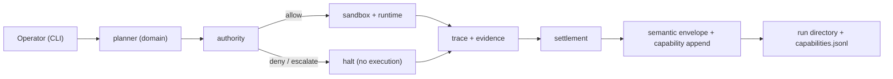
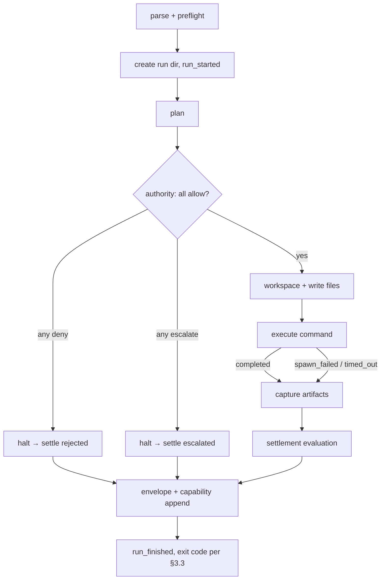

# SEA Forge — Minimum Vertical Slice Specification

Status: Draft v0.1

Scope: Rust (stable toolchain, edition 2021), Linux/macOS. Synchronous, single-process. No Tokio, no server, no UI.

Purpose: Prove that one operator intent can travel the full governed lifecycle — plan → authority → sandboxed execution → trace → evidence → settlement → semantic envelope — and leave a complete, inspectable run directory behind. The slice also proves that authority is a first-class, fail-closed fabric from the first run: actions are normalized into a canonical request, evaluated against a hashable policy bundle and identity binding, and recorded in a common audit/evidence shape. Generated work products are born with content identity, provenance, ownership, license, review, and maturity metadata. Extension and projection references are present in the record model from day one, so later DomainForge projections, adapters, and plugins are continuations of the same kernel rather than add-ons.

Owner: SEA Forge core team

Companion documents: `build-report.md` (research), `build-report-review.md` (corrections R1–R10 referenced below), `spec-full.md` (extended system).

## 0. Spec Frame

A useful implementation spec MUST let a developer, agent, reviewer, or operator answer these eight questions without guessing:

1. What should be built? — A two-crate Rust workspace (`sea-forge-core`, `sea-forge-cli`) implementing one governed run pipeline.
2. What result should it produce? — A case record plus a run directory under `.sea-forge/runs/<run_id>/` containing plan, authority decision, trace, evidence, settlement, and semantic envelope, all cross-linked by ID; work-product evidence carries a deterministic pre-mint identity and artifact governance descriptor.
3. How will we know the result is real? — The proof commands in §12.2 pass; the conformance tests in §17 pass.
4. What capability should get stronger after repeated use? — Every run appends a `SemanticEnvelope` to `.sea-forge/capabilities.jsonl`; that file is the system's capability memory v0.
5. What evidence proves the capability claim? — `capabilities.jsonl` grows by exactly one valid, cross-linked record per run, including denied and failed runs; every captured work product can be re-identified from its canonical descriptor and file hash.
6. What fails safely? — Any unclassifiable operation is denied (fail closed); any denial or execution failure still produces trace, evidence, and settlement records.
7. What must repeat until reliable? — The variation and recovery cases in §13/§17.2.
8. What changes when evidence disagrees with the design? — See §5 claim table; any `Assumption` that fails downgrades the design per the stated gap.

## Normative Language

The key words `MUST`, `MUST NOT`, `REQUIRED`, `SHOULD`, `SHOULD NOT`, `RECOMMENDED`, `MAY`, and `OPTIONAL` in this document are to be interpreted as described in RFC 2119.

`Implementation-defined` means the behavior is part of the implementation contract, but this specification does not prescribe one universal policy. Implementations MUST document the selected behavior.

## 1. Problem Statement

SEA Forge solves the problem that agent-driven work executes side effects without a governing record of what was intended, what was permitted, what actually happened, and whether the outcome was accepted.

Job-to-be-done:

- When an operator needs an agentic system to perform work with side effects, they need SEA Forge to interpret the intent, check authority *before* execution, execute in an isolated workspace, and record trace/evidence/settlement, so that every action is auditable, reviewable, and fail-closed.

Current failure mode:

- Agent frameworks execute first and log incidentally; logs are not evidence.
- "Exit code 0" is treated as "done" even when the organizational outcome failed.
- Permissions are implicit (prompt text, ambient credentials), so nothing can be audited or denied deterministically.

The system is needed because existing tools (CubeSandbox, Traycer, Shepherd, AgentPet) each solve one layer — isolation, orchestration memory, reversible traces, operator visibility — but none provides a single governed lifecycle with authority ahead of execution and settlement behind it.

Important boundary:

- SEA Forge is a governed capability-execution kernel oriented toward case management: work is organized as cases (CMMN framing — knowledge work with partly-unpredictable order), and each execution is an episode within a case. This slice implements the degenerate single-episode case; the case *engine* is full-spec.
- SEA Forge is not an agent framework, a sandbox wrapper around CubeSandbox, an observability dashboard, or a desktop assistant.
- Successful execution means the settlement evaluator accepted the outcome against declared criteria, not merely that the sandboxed command exited zero.

## 2. Goals and Non-Goals

### 2.1 Goals

- G1: `sea-forge run --intent "<known intent>"` produces a complete run directory (§3.1) with all six record kinds.
- G2: No protected action executes before an `AuthorityDecision::Allow` exists for it (§10.2). Every decision is deterministic from `(policy_bundle_hash, action_request_hash, identity_binding_hash)` and recorded as evidence.
- G3: Denied, escalated, and failed runs still produce trace, evidence, and settlement records (§14).
- G4: All on-disk records are versioned, serde-serializable JSON/JSONL, deterministic apart from timestamps and run IDs.
- G5: The module layout mirrors the 14-crate map in `build-report.md` so any module can later graduate to its own crate mechanically (review R1).
- G6: Capability memory is readable, not just writable: every envelope carries attribution (entity × process × session, review R11 — Memori delta D2), and `sea-forge recall` retrieves matching envelopes from `capabilities.jsonl` (review R12, delta D1).
- G7: Generated work products are not anonymous files. Every work product captured as evidence MUST include an `ArtifactDescriptor` with deterministic pre-mint identity (`ifl:hash:<sha256>`), stage, producer, owner, license, review status, source case/run, and evidence digest. This is the minimum invariant that lets the full artifact-to-IP pipeline promote artifacts without re-keying history.
- G8: The authority layer is born extensible. The slice only executes file-write and command operations, but the canonical authority vocabulary, policy bundle hash, audit record, and default-deny behavior MUST already support adding API, git, PR merge, prompt-risk, policy, evidence, spec-projection, and artifact-transition surfaces without introducing a second gate.
- G9: Extension compatibility is born with the kernel. The slice MUST define stable `ExtensionDescriptor` and `ProjectionRef` shapes, and every `SemanticEnvelope` MUST include `extension_refs` and `projection_refs` arrays, even when empty. Future plugins/adapters can add capabilities only by producing governed projection/adapter records that link back to these fields.

### 2.2 Non-Goals

- LLM-backed planning (planner is deterministic pattern matching; see R11/G11 in review).
- MicroVM, container, Landlock/Seatbelt, or any OS-level jail (full spec).
- Server, daemon, operator UI, notifications, approvals loop (full spec).
- Concurrency: exactly one run per process invocation; no locking (review G9).
- Checkpoint/restore of sandboxes.
- NATS/event-bus federation, SeaCell, dynamic plugin loading, adapter installation, and DomainForge projection beyond the stub `.sea` format in §11. The slice still defines extension/projection descriptor fields so those capabilities can arrive without record migration.
- The full ADR → PRD → SDS → SEA → AST → IR → manifest → generated-code → last-mile runtime pipeline. The slice only proves one generated `.sea` work product and the identity/provenance fields that the full pipeline consumes.
- Artifact promotion beyond initial work-product capture: cognitive → intellectual → product → capital transitions, TransitionTokens, IFL attestation, valuation, and capitalization approvals are full-spec. The slice records enough metadata for those transitions to be valid later.
- Async runtime: this slice is synchronous by explicit decision (review R2).
- Networked policy gateway, external OPA service, GovernedSpeed prompt/output runtime, GitHub merge adapter, outbound API executor, and human approval server are full-spec integrations. The slice still records authority data in the same canonical shape those integrations consume; there is no later migration from "local permission check" to "real authority."
- Semantic memory extraction, SQL/FTS-indexed memory store, authority-gated recall, LLM-conversation capture (full spec E7 — Memori delta D3–D5). The slice's recall is a plain scan of `capabilities.jsonl`.
- The CMMN case engine (stages, sentries, milestones as first-class records, discretionary items, case reopening, multi-episode cases — full spec E2, review §6). The slice creates a *degenerate* case: one plan, one item with empty `entry_criteria`, one run, closed at settlement. The Case/CasePlan/PlanItem ontology ships now so no stored record ever needs re-keying.
- Plan templates, environment contracts, and evaluator-based/batch settlement (full spec E8/E9, review §7 — Archon/AEnvironment/DataFlow deltas). The slice's hardcoded demo plan is conceptually the first built-in template; making templates user-definable artifacts is full-spec. These are additive (`template_ref`, `environment`, `evaluator` fields default to null/absent on old records), so deferring them re-keys nothing.

## 3. Outcome Contract

### 3.1 Output Produced

The system MUST produce, for every invocation of `sea-forge run` (including denials and failures):

```text
.sea-forge/cases/<case_id>.json   # Case record (review R15)
.sea-forge/runs/<run_id>/
  plan.json                # CasePlan
  authority.json           # Vec<AuthorityDecision>
  trace.jsonl              # TraceEvent per line
  evidence.jsonl           # EvidenceRecord per line
  settlement.json          # SettlementEvent
  semantic-envelope.json   # SemanticEnvelope
  workspace/               # sandbox working dir (retained)
  artifacts/               # copied evidence artifacts (stdout.txt, stderr.txt, generated files)
```

and MUST append the run's `SemanticEnvelope` as one line to `.sea-forge/capabilities.jsonl`.

Output requirements:

- Every record carries `version: "0.1"` and the owning `run_id`.
- Every cross-reference uses the typed ID grammar in §7.5.
- `artifacts/` files referenced from `evidence.jsonl` MUST exist and match their recorded SHA-256.
- Work-product artifacts referenced from `evidence.jsonl` MUST include the `ArtifactDescriptor` metadata in §7.3.8 and MUST appear in `semantic-envelope.json.artifact_refs`.

### 3.2 Outcome Verified

The output counts as a verified outcome only when the proof commands in §12.2 pass on a fresh run directory.

Verification signals:

- `settlement.json` status is one of `accepted | rejected | escalated` and its `basis` array is non-empty.
- Every `evidence_ref` and `authority_decision` ID in `semantic-envelope.json` resolves to a record in the same run directory.
- `trace.jsonl` contains, in order, at minimum: `case_created`, `run_started`, one `authority_evaluated` per operation, then either (`command_started`, `command_finished`) or `run_halted`, then `settlement_recorded`, `run_finished`, `case_closed`.
- The case record at `.sea-forge/cases/<case_id>.json` exists, references the run, and its `state` agrees with the settlement status (`completed` ⇔ `accepted`).

A run MUST NOT be reported as complete when the settlement evaluator has not executed, even if the sandboxed command succeeded.

### 3.3 Consumer and Handoff

The outcome is consumed by (a) the operator reading CLI output and the run directory, and (b) future SEA Forge components reading `capabilities.jsonl`.

Handoff is complete when:

- The CLI prints run ID, authority decision(s), execution status, settlement status, and the run directory path, then exits with code 0 (settled `accepted`), 3 (`rejected`), 4 (`escalated`/denied), or 1 (internal error).
- The run directory passes §12.2 proofs.

If the outcome cannot be verified, the system MUST exit nonzero and the run directory MUST contain a `settlement.json` with status `rejected` or `escalated` and a machine-readable `basis`.

## 4. Capability Claim

After repeated successful use, the SEA Forge system (and its operators) should be better able to answer "what capabilities have been attempted, under what authority, with what results" without reading logs — by querying `capabilities.jsonl`.

This capability claim is in scope because capability memory is the substrate later components (planner improvements, DomainForge projection, SeaCell federation) consume.

The capability claim is proven only if:

- After N runs (mixed allowed/denied/failed), `capabilities.jsonl` contains exactly N valid envelopes.
- Each envelope's `capability_delta.result` correctly distinguishes accepted, rejected, escalated/denied outcomes.
- `jq` over the file alone can reconstruct the outcome distribution (no other file needed).
- `sea-forge recall <query>` returns exactly the envelopes whose capability name or intent summary matches, filtered correctly by `--entity`/`--process` (read side of the loop; Memori delta D1/D2).

The capability claim is not proven by:

- The existence of the file.
- Passing unit tests that never exercise denial or failure paths.
- Human-readable CLI output.

## 5. Evidence and Claim Discipline

Claim levels: `Evidence-backed`, `Partially proven`, `Assumption`, `Roadmap` (definitions per template).

| Claim | Level | Required evidence | Current evidence | Gap |
|---|---|---|---|---|
| The full lifecycle composes end-to-end in Rust | Assumption | §17.1 conformance suite green | none (pre-implementation) | Build it |
| A process-level workspace sandbox is adequate for slice one | Assumption | §17 security tests pass (path escape blocked) | Shepherd demonstrates OS-jail is achievable later | If inadequate, pull Landlock forward from full spec |
| JSONL append is a sufficient store | Evidence-backed (by reference) | CubeSandbox uses JSONL audit logs in production | verified in review §1 | none for this slice |
| Deterministic planner covers the demo intent | Evidence-backed once §17 passes | intent→plan mapping test | none | Build it |
| Settlement ≠ exit code catches real false-successes | Partially proven | variation case V2 (§13) | design argument only | Run V2 |

## 6. System Overview

### 6.1 Architecture Pattern

- Pattern: one-shot CLI pipeline (batch job) over a library core.
- Reason: one intent → one run → exit. No resident state, no polling, no server. Synchronous `std::process` execution; **no async runtime** (review R2 — Tokio arrives with `sea-forge-server` in the full spec).
- Patterns intentionally not used: daemon/orchestrator (nothing to schedule), event bus (single process; the JSONL trace *is* the event record), microservice split (no network boundary exists yet).

### 6.2 Main Components

Workspace layout (review R1 — two crates, modules mirror the future 14-crate map):

```text
Cargo.toml                  # [workspace] members = ["crates/sea-forge-core", "crates/sea-forge-cli"]
crates/
  sea-forge-core/
    src/
      lib.rs
      ids.rs                # ID grammar (§7.5)
      types.rs              # all core structs/enums (§7)
      errors.rs             # error enums (§8.3, §14)
      domain.rs             # intent → operation vocabulary   (future sea-forge-domain)
      planner.rs            # DeterministicPlanner            (future sea-forge-planner)
      authority.rs          # PolicyAuthorityEngine           (future sea-forge-authority)
      sandbox.rs            # LocalWorkspaceSandbox           (future sea-forge-sandbox)
      runtime.rs            # ProcessExecutor                 (future sea-forge-runtime)
      trace.rs              # JsonlTraceRecorder              (future sea-forge-trace)
      evidence.rs           # JsonlEvidenceWriter             (future sea-forge-evidence)
      settlement.rs         # RuleBasedSettlementEvaluator    (future sea-forge-settlement)
      capability.rs         # capabilities.jsonl appender     (future sea-forge-capability)
      pipeline.rs           # run_intent() orchestration
  sea-forge-cli/
    src/
      main.rs               # clap arg parsing, exit codes
      commands/run.rs       # `sea-forge run`
      commands/validate.rs  # `sea-forge validate` (hidden; §11)
      commands/inspect.rs   # `sea-forge inspect <run_id>` (pretty-print records)
      commands/recall.rs    # `sea-forge recall <query>` (§10.6; read side of capability memory)
```

1. `planner` (with `domain`)
   - Responsibility: map an intent string to a `CasePlan` of `PlanItem`s whose operations use the normalized vocabulary in §7.3.4. Domain interpretation for this slice *is* the planner's pattern table (review G11).
   - Inputs: `Intent`. Outputs: `CasePlan` or `PlannerError::UnknownIntent`.

2. `authority`
   - Responsibility: evaluate every `Operation` in the plan against a YAML policy file **before any execution**. Default deny.
   - Inputs: canonical `AuthorityRequest` (actor + action + resource + context + evidence + identity binding). Outputs: `AuthorityDecision`.

3. `sandbox` + `runtime`
   - Responsibility: create `workspace/` under the run directory, enforce the path-safety rule (§16.1), execute one command via `std::process::Command` with timeout, capture stdout/stderr/exit code/timing.
   - Inputs: `ExecutionRequest`. Outputs: `ExecutionResult`.

4. `trace` + `evidence` + `settlement` + `capability`
   - Responsibility: append `TraceEvent`s at every lifecycle transition; copy artifacts and write `EvidenceRecord`s with SHA-256 plus `ArtifactDescriptor` metadata for work products; evaluate `SettlementClaim` → `SettlementEvent`; write `SemanticEnvelope` and append it to `capabilities.jsonl`.

#### Component Diagram



### 6.3 External Dependencies

- `serde` + `serde_json` — record serialization. Failure: compile-time only.
- `serde_yaml` (or `serde_yml`) — policy file parsing. Failure: typed `policy_parse_error`, run refuses to start (§8.3).
- `clap` — CLI parsing. Failure: usage error, exit 2.
- `sha2` — artifact hashing. Failure: internal error, exit 1.
- `chrono` or `time` — RFC 3339 timestamps. Failure: compile-time only.
- OS `std::process` — command execution. Failure: `ExecutionResult` with `spawn_failed` error, run settles `rejected`.

No network dependencies. No database. No async runtime.

## 7. Core Domain Model

### 7.1–7.2 Scope

This is a batch/CLI system; entities follow the CLI-tool guide (JobInput≈Intent/Plan, JobRun≈Run, Artifact/ProofResult≈Evidence/Settlement). Nine entities are defined — one over the guideline of eight — because the brief's lifecycle names each stage explicitly and collapsing any two (e.g., evidence into trace) is exactly the failure mode the report warns against (report §"technical debt to avoid", review R9).

### 7.3 Core Entities

All entities: `#[derive(Serialize, Deserialize, Clone, Debug, PartialEq)]`, plus `Eq` where no floats. All carry `version: String` ("0.1") when persisted as a top-level record.

#### 7.3.1 Intent

Purpose: normalized operator request. Used by: planner, envelope.

- `intent_id` (string, `int_` + 6 hex) — identity.
- `summary` (string, non-empty, ≤ 500 chars) — raw operator text.
- `actor_id` (string) — who asked (the *entity*, in Memori's attribution terms); default `operator_local`; CLI flag `--entity`.
- `process_id` (string) — which program/agent submitted the intent; default `cli`; CLI flag `--process`. Charset for both: `[a-z0-9_-]+`, ≤ 64 chars (review R11 — attribution is schema-level from day one because retrofitting it re-keys every stored envelope).
- `created_at` (RFC 3339 UTC string).

#### 7.3.2 Case / CasePlan / PlanItem

Purpose: the case is the primary unit of work (CMMN framing, review R15); the case plan is its authority-checkable content; a run is one execution episode within the case. Used by: pipeline, authority, envelope.

Case (persisted at `.sea-forge/cases/<case_id>.json`):

- `version`, `case_id` (string, `case_<UTC yyyymmddTHHMMSSZ>_<6 hex>`).
- `intent` (Intent, embedded — the case's founding intent).
- `state` (enum: `active | completed | terminated`). Slice lifecycle: created `active` at run start; `completed` when settlement is `accepted`; `terminated` (with `close_reason`: `rejected | escalated`) otherwise. Reopening and multi-episode cases are full-spec (E2); the slice case is deliberately degenerate: one plan, one item, one run, closed at settlement.
- `plan_ref` (plan_id), `run_ids` (array; slice one always length 1).
- `close_reason` (string or null), `created_at`, `closed_at` (RFC 3339 or null).

CasePlan (persisted as `plan.json` in the run directory):

- `plan_id` (string, `plan_` + 2-digit seq within case; slice one always `plan_01`).
- `case_id`, `run_id`, `intent_id` (strings).
- `items` (array of PlanItem, length ≥ 1; slice one produces exactly 1).

PlanItem:

- `plan_item_id` (string, `item_` + 2-digit seq).
- `name` (string) — e.g. `generate_and_validate_sea_model`.
- `operations` (array of Operation, §7.3.4, length ≥ 1).
- `entry_criteria` (array; MUST be empty in the slice = "activate at case start". In the full spec this becomes a CMMN sentry list; the field exists now so stored plans never need re-keying — same rationale as attribution, review R15/R16).
- `settlement_criteria` (SettlementCriteria, §7.3.8) — semantically, the condition for this item's milestone; the slice has exactly one implicit milestone, whose achievement completes the case.

#### 7.3.3 Actor / Context

Purpose: authority inputs. Used by: authority, trace, envelope.

Actor: `actor_id` (string), `role` (enum string: `operator | agent | system`).
Context: `run_id`, `working_root` (absolute path string of the workspace), `hostname` (string), `started_at` (RFC 3339).

IdentityBinding (embedded in authority decisions and in the decision hash input):

- `principal` (string) — resolved principal name; for the slice this is `actor.actor_id`.
- `actor_type` (enum: `human | agent | service | system`) — derived from Actor.role.
- `binding_resolution` (enum: `exact | local-default | unresolved`) — `unresolved` MUST yield `escalate` with required step `complete-onboarding`; it MUST NOT silently allow.
- `identity_binding_source` (string) — policy/config path or literal `local-slice-default`.
- `sponsor` (string or null) — REQUIRED for privileged automated-agent actions in full spec; null is valid in the slice for the local operator.

#### 7.3.4 Operation / Resource

Purpose: the normalized side-effect vocabulary authority evaluates. Planner output MUST use these — never raw shell strings (report "technical debt" rule 1).

Operation (tagged enum, serde `{"kind": ..., ...}`):

- `{ "kind": "write_file", "path": <workspace-relative path>, "content_hint": <string> }`
- `{ "kind": "execute_command", "argv": [<string>, ...], "cwd": <workspace-relative path or "."> }`

Minimum executable resource classes (derived from operations by the authority module, not stored separately on disk):

- `{ "kind": "path", "value": <workspace-relative path> }`
- `{ "kind": "command", "value": <argv[0]> }`

Reserved authority resource classes:

- `file` — filesystem write/read/delete policy; generated zones and declared-reality paths are protected from day one.
- `shell_cmd` — command classification; dangerous commands deny, infrastructure-sensitive commands escalate.
- `external_api` — outbound API allow-list/deny-list policy; default deny.
- `git_commit` — autonomous commit policy; governance policy paths are protected.
- `github_pr` — PR merge policy; required checks, branch class, changed paths, and conflict state are authority inputs.
- `prompt_risk` — prompt/content risk policy; regulated or bias-sensitive prompts escalate.
- `policy_file`, `evidence_record`, `spec_projection`, `artifact_transition`, `identity_binding` — governance mutation surfaces that full-spec operations will activate.

The slice planner MUST only construct `write_file` and `execute_command`. Authority MUST nevertheless store decisions using the reserved resource-class vocabulary and MUST return `escalate` with reason `unsupported_action_surface` for a well-formed but unimplemented reserved class. Malformed or unknown operation kinds MUST be denied with reason `unclassified` (fail closed, review R7).

#### 7.3.5 AuthorityRequest / AuthorityDecision

Purpose: the gate. Used by: authority, pipeline, trace, evidence, envelope.

AuthorityRequest (canonical action model v0.1, stored in decision metadata as `action_request`):

- `schema_version` (`cam.v1`).
- `action_id` (string, `act_` + 6 hex), `correlation_id` (run ID for slice), `timestamp_utc`.
- `actor`: `actor_id`, `actor_type`, optional `principal`.
- `action`: `tool_name` (`sea-forge-cli` in slice), `operation`, `resource_type` (one of the resource classes above), `resource_id`, `parameters` (JSON object).
- `context`: `repo` (optional), `branch` (optional), `environment` (`local-slice`), `workspace_root`, `source_platform` (`cli`), `channel` (`cli`).
- `evidence`: `identity_binding_source`, `tool_trace_ref`, `payload_hash`.

AuthorityDecision:

- `decision_id` (string, `auth_` + 2-digit seq).
- `run_id`, `plan_item_id`, `action_id`, `correlation_id` (strings).
- `operation` (Operation, echoed).
- `outcome` / `verdict` (enum: `allow | deny | escalate`; both names serialize for v0.1 compatibility).
- `normalized_disposition` (enum: `allow | deny | escalate | boundary | degraded`) — in the slice this is equal to outcome except future conflict-resolution evidence may normalize `boundary` and `degraded`.
- `matched_rule` (string or null) — rule name from policy; null with verdict `deny` means default-deny fired.
- `reason_codes` (array of strings) — machine-readable; `"unclassified"` and `"unsupported_action_surface"` are reserved per §7.3.4.
- `reason` (string) — human-readable summary derived from reason codes.
- `policy_refs` (array of strings) — e.g. `local-policy:<rule>`, `file-access-policy:deny`, `api-allowlist:default`.
- `required_next_steps` (array of strings) — e.g. `complete-onboarding`, `require-human-approval`, `extend-authority-policy`.
- `identity_binding` (IdentityBinding).
- `determinism`: `policy_bundle_hash`, `action_request_hash`, `identity_binding_hash` (all `sha256:<64 hex>`).
- `audit_record`: common governance audit record with keys `{engine, disposition, subject, reason, evidence_refs, recorded_at}`.
- `decided_at` (RFC 3339).

#### 7.3.6 ExecutionRequest / ExecutionResult

Purpose: runtime contract. Used by: sandbox, runtime, trace, evidence.

ExecutionRequest: `plan_item_id`, `operation` (must be `execute_command`), `timeout_secs` (u64, default 60), `env` (map, default: minimal — `PATH` and `HOME` only; nothing inherited beyond these).

ExecutionResult:

- `status` (enum: `completed | spawn_failed | timed_out`).
- `exit_code` (i64 or null — null unless `completed`).
- `stdout_path`, `stderr_path` (strings, relative to run dir: `artifacts/stdout.txt`, `artifacts/stderr.txt`).
- `started_at`, `finished_at` (RFC 3339).

Note `completed` means "the process ran and exited" — including nonzero exits. Success/failure is settlement's job.

#### 7.3.7 TraceEvent

Purpose: append-only timeline. Used by: trace recorder, proofs, future replay.

- `version` ("0.1").
- `event_id` (string, `tev_` + zero-padded 4-digit monotonic seq per run, starting `tev_0001`). ← required; fixes review C2.
- `run_id`, `plan_item_id` (string or null for run-level events).
- `kind` (enum: `case_created | run_started | plan_created | authority_evaluated | workspace_created | command_started | command_finished | artifact_captured | settlement_recorded | run_halted | run_finished | case_closed`).
- `actor_id` (string).
- `timestamp` (RFC 3339).
- `payload` (JSON object; kind-specific, MAY be empty `{}`).

#### 7.3.8 EvidenceRecord / SettlementClaim / SettlementEvent

ArtifactDescriptor (embedded in `EvidenceRecord.metadata.artifact` for `kind: artifact` records whose URI is a work product rather than stdout/stderr):

- `artifact_id` (`art_` + 6 hex).
- `artifact_type` (enum: `sea_model | generated_contract | evidence_file | other`; the demo `model.sea` is `sea_model`).
- `stage` (enum: `cognitive | intellectual | product | capital`; the demo `model.sea` is `intellectual`; pure evidence files MAY omit `stage`).
- `producer` (`entity_id`, `process_id`, `run_id`, `plan_item_id`).
- `owner` (string; default `Intent.actor_id`).
- `license` (string; default `internal-unlicensed` until a policy assigns a stronger value).
- `review_status` (enum: `draft | reviewed | approved | capitalized`; the slice emits `draft`).
- `source_refs` (array of evidence IDs or empty for generated-from-plan constants).
- `content_sha256` (file-byte hash, same digest as the EvidenceRecord's `sha256`).
- `pre_mint_identity` (`ifl:hash:<sha256>`) computed from canonical JSON of `{artifact_type, stage, owner, license, review_status, content_sha256, source_refs}` with sorted keys, compact separators, and NFC normalization. No timestamp, host, path, or environment data may enter this identity.

EvidenceRecord:

- `version`, `evidence_id` (`evi_` + 4-digit seq), `run_id`.
- `kind` (enum: `artifact | authority_decision | execution_result`).
- `uri` (string; run-dir-relative path for `artifact`, e.g. `artifacts/stdout.txt`; for non-file kinds, the referenced record ID).
- `sha256` (string or null; REQUIRED for `artifact`, null otherwise).
- `source_event_id` (string, a valid `tev_` ID in this run).
- `metadata` (map, OPTIONAL). For work-product artifacts this MUST include `artifact: ArtifactDescriptor`. For stdout/stderr evidence files it MAY include `artifact_role: "execution_evidence"` instead.

SettlementCriteria (declared on PlanItem; inputs to evaluation):

- `require_exit_zero` (bool).
- `required_artifacts` (array of workspace-relative paths).
- `stdout_must_contain` (string or null).

SettlementClaim (assembled by pipeline; not persisted separately):

- `run_id`, `plan_item_id`, `criteria` (SettlementCriteria), `execution` (ExecutionResult or null if halted), `authority_verdicts` (array).

SettlementEvent (persisted as `settlement.json`):

- `version`, `settlement_id` (`set_01`), `run_id`.
- `status` (enum: `accepted | rejected | escalated`).
- `basis` (array of strings, non-empty; from the closed vocabulary: `authority_allow`, `authority_deny`, `authority_escalate`, `exit_zero`, `exit_nonzero`, `spawn_failed`, `timed_out`, `required_artifact_present:<path>`, `required_artifact_missing:<path>`, `stdout_match`, `stdout_mismatch`).
- `review_required` (bool; true iff status `escalated`).
- `settled_at` (RFC 3339).

#### 7.3.9 SemanticEnvelope

Persisted as `semantic-envelope.json` and appended to `capabilities.jsonl`.

- `version`, `run_id`, `case_ref` (case_id).
- `intent` (Intent, embedded).
- `plan_ref` (plan_id).
- `authority_decisions` (array of decision_ids).
- `evidence_refs` (array of evidence_ids).
- `settlement_ref` (settlement_id).
- `capability_delta`: `{ "attempted_capability": <PlanItem.name>, "result": <"accepted"|"rejected"|"escalated"> }`.
- `attribution`: `{ "entity_id": <Intent.actor_id>, "process_id": <Intent.process_id>, "session_id": <case_id> }` — the recall filter keys (review R11). The case is the session boundary (review R19); in this slice one case = one run, so the distinction is invisible but the key is already right.
- `artifact_refs` (array of `{evidence_id, artifact_id, pre_mint_identity}` for every work product captured in the run). This makes capability memory usable as an artifact/IP index without scanning `evidence.jsonl`.
- `extension_refs` (array of ExtensionDescriptor IDs; empty in the slice). This makes envelopes forward-compatible with plugin, adapter, and projection work without changing the envelope shape later.
- `projection_refs` (array of ProjectionRef; empty in the slice except a future full-spec DomainForge projection may reference the demo `model.sea`). Projections are derived, governed views of evidence or artifacts; they are never a second source of truth.

#### 7.3.10 ExtensionDescriptor / ProjectionRef

These types are defined in the slice for compatibility; the slice does not dynamically load extensions.

ExtensionDescriptor:

- `extension_id` (string, `ext_` + 6 hex or reverse-DNS plugin ID).
- `kind` (enum: `projection_adapter | runtime_adapter | sandbox_backend | event_sink | memory_index | evaluator | artifact_attestor | ui_client | notification_adapter | import_export_adapter`).
- `name`, `version`, `provider`.
- `capabilities` (array of operation/resource classes the extension may request).
- `authority_surface` (string; MUST map to a §7.3.4 reserved authority resource class or full-spec addition).
- `input_contract` and `output_contract` (schema URI/path + sha256).
- `deterministic` (bool). Projection adapters MUST be deterministic; non-deterministic adapters may only produce evidence, never generated source truth.
- `installed_at` (RFC 3339 or null for built-in descriptors).

ProjectionRef:

- `projection_id` (`proj_` + 6 hex).
- `projection_kind` (enum: `sea | calm | rdf | sbvr | shacl | manifest | kg_event | capability_record | memory_index | capital_record | implementation-defined`).
- `source_refs` (non-empty array of evidence IDs, artifact IDs, envelope IDs, or pipeline stage IDs).
- `adapter_ref` (ExtensionDescriptor ID or built-in adapter name).
- `output_uri` (run-relative path or `.sea-forge/` projection path).
- `output_sha256`.
- `status` (enum: `accepted | rejected | quarantined | degraded`).
- `settlement_ref` (settlement ID or null when embedded in another run's settlement).

Compatibility invariant: adding a plugin/add-on MUST add or reuse an `ExtensionDescriptor`, produce `ProjectionRef` or evidence records, and pass authority before mutating any workspace, `.sea-forge/`, generated zone, graph, or external service. Plugins MUST NOT introduce hidden state that cannot be rebuilt from source records plus descriptor versions.

### 7.5 Identifiers and Normalization

- `run_id`: `run_<UTC yyyymmddTHHMMSSZ>_<6 lowercase hex from OS RNG>`; `case_id`: same grammar with `case_` prefix. Allowed chars therefore `[a-z0-9_TZ]`; safe as directory/file names with no further escaping.
- Sequenced IDs (`tev_`, `evi_`): zero-padded 4-digit monotonic per run, assigned by the recorder/writer at append time. `auth_`, `item_`, `plan_`, `set_`: 2-digit.
- Workspace-relative paths in operations and criteria: MUST NOT begin with `/`, MUST NOT contain `..` segments after lexical normalization, and MUST match `[A-Za-z0-9._/-]+`. Violations are planner construction errors; authority defensively denies them.
- Comparisons of `basis` vocabulary strings and enum values are exact and case-sensitive; serde enums use `snake_case` renaming.

## 8. Configuration and Input Contract

### 8.1 Configuration Sources and Resolution

Precedence (highest first):

1. CLI flags (`--policy <path>`, `--root <path>`, `--timeout <secs>`, `--entity <id>`, `--process <id>`).
2. Defaults: policy `./sea-forge-policy.yaml`; root `./.sea-forge`; timeout 60; entity `operator_local`; process `cli`.

No environment-variable configuration in this slice. No config file beyond the policy file. Relative paths resolve against the process working directory. Commands are invoked as tokenized argv via `std::process::Command` — never through a shell.

### 8.2 Required Config Fields (authority policy bundle)

The policy file is a single-file `AuthorityPolicyBundle` in the slice. Full spec may split it into `file-access-policy`, `api-allowlist`, `git-commit-policy`, `pr-merge-policy`, `prompt-risk-policy`, identity maps, and authority hooks; the bundle hash contract is the same. The slice policy file is YAML with this shape:

```yaml
version: "0.1"
default: deny            # informational; deny is hardcoded regardless
identity:
  source: local-slice-default
  allow_unresolved: false
policy_surfaces:
  file:
    mode: deny-by-default
    deny_write:
      - "**/src/gen/**"
      - "docs/specs/**/*.ast*.json"
      - "docs/specs/**/*.ir.json"
      - "docs/specs/**/*.manifest.json"
      - "docs/specs/**/fixtures/semantic/*.semantic.fixture.yaml"
      - ".git/**"
      - ".env*"
      - "**/*secret*"
  external_api:
    mode: deny-by-default
    allow_hosts: []
  git_commit:
    protected_paths:
      - "config/governance/**"
      - ".github/workflows/**"
  github_pr:
    default: escalate
  prompt_risk:
    default: allow-with-risk-escalation
rules:
  - name: allow-model-write
    verdict: allow       # allow | deny | escalate
    actor_role: operator # matches Actor.role
    operation_kind: write_file
    path_prefix: ""      # "" = any workspace-relative path
  - name: allow-self-validate
    verdict: allow
    actor_role: operator
    operation_kind: execute_command
    argv0: sea-forge     # exact match on argv[0] basename
```

| Field | Type | Required | Default | Validation |
|---|---|---:|---|---|
| `version` | string | yes | none | must equal "0.1" |
| `identity.source` | string | no | `local-slice-default` | non-empty when present |
| `identity.allow_unresolved` | bool | no | `false` | MUST remain false unless a full-spec onboarding adapter defines the semantics |
| `policy_surfaces` | map | no | built-in defaults above | recognized keys: `file`, `external_api`, `git_commit`, `github_pr`, `prompt_risk`; unknown keys are `schema_error` |
| `rules` | list | yes | none | may be empty (⇒ everything denied) |
| `rules[].name` | string | yes | none | non-empty, unique |
| `rules[].verdict` | enum | yes | none | `allow\|deny\|escalate` |
| `rules[].actor_role` | string | yes | none | one of §7.3.3 roles |
| `rules[].operation_kind` | string | yes | none | one of §7.3.4 kinds |
| `rules[].path_prefix` | string | no | `""` | only meaningful for `write_file` |
| `rules[].argv0` | string | no | none | only meaningful for `execute_command`; REQUIRED for `execute_command` rules with verdict `allow` |

Rule matching: first rule where all present fields match wins. No match ⇒ deny with `matched_rule: null`. Surface policies are evaluated before explicit allow rules where they express hard boundaries. In v0.1 this means:

- File writes matching `policy_surfaces.file.deny_write` MUST deny even if a later allow rule matches.
- Unknown outbound API hosts, git commits touching protected paths, and PR merges without required evidence are reserved surfaces and MUST deny or escalate if such an operation reaches authority, even though the slice has no executor for them.
- Authority itself has no `pass`, `bypass`, or fail-open mode. If the policy bundle cannot be loaded, parsed, hashed, or evaluated, no run starts.

`policy_bundle_hash` is the SHA-256 of canonical JSON for the validated bundle, including defaulted `policy_surfaces`. `action_request_hash` and `identity_binding_hash` use the same canonical JSON rules. Hashes MUST be stable across map key ordering and YAML formatting changes.

### 8.3 Config Error Classes

- `missing_config_error` — policy file absent/unreadable at resolved path.
- `parse_error` — not valid YAML.
- `schema_error` — parsed YAML fails §8.2 validation (wrong version, bad verdict, missing field, unknown policy surface, `identity.allow_unresolved: true`, `allow`+`execute_command` rule without `argv0`).
- `unsupported_kind_error` — `operation_kind` not in §7.3.4 vocabulary.

Error surface: printed to stderr with class name, message, and file path; no run directory is created; exit code 1.

Blast radius: **all four classes block all work** — the run never starts. There are no per-item config errors in this slice (one run, one policy load, no reload).

### 8.4 Dynamic Reload Behavior

Not applicable. One-shot CLI; the policy is read once at startup. Startup validation is sufficient.

### 8.5 Startup and Preflight Validation

Before creating the run directory, the CLI MUST verify, in order:

1. Policy file loads and passes §8.2 validation.
2. `--intent` is non-empty after trimming and ≤ 500 chars.
3. The root directory (`.sea-forge/`) exists or can be created; `runs/` likewise.
4. The planner recognizes the intent (else typed `UnknownIntent` error, exit 2, no run directory — an unknown intent is an input error, not a governed denial).

### 8.6 Primary Input Contract

The system accepts one intent string from `sea-forge run --intent "<text>"`.

- Missing `--intent`: clap usage error, exit 2.
- Empty/whitespace-only or > 500 chars: typed input error, exit 2.
- Unknown intent pattern: `UnknownIntent` listing supported patterns, exit 2.
- Duplicate input: allowed; every invocation creates a new run (run IDs make reruns distinct; idempotency is per-run-directory, §9.3).
- Unsafe input: the intent string is data only — it is never interpolated into shell, paths, or argv. Only the planner's fixed pattern table converts it to operations.

## 9. Operational Flow and State Model

### 9.1 Flow Summary

```text
parse intent → preflight (§8.5) → create case record + run dir → emit case_created, run_started
  → plan (plan.json, plan_created)
  → authority per operation (authority.json, authority_evaluated × N, evidence per decision)
  → if any verdict ≠ allow: run_halted → settlement (rejected|escalated) → envelope → exit
  → create workspace (workspace_created) → materialize write_file operations
  → execute command (command_started/command_finished) → capture artifacts + work-product identity metadata (artifact_captured, evidence)
  → settlement (settlement_recorded) → envelope → capability append
  → close case (state per §7.3.2, case_closed) → run_finished emitted before case_closed → exit
```

#### Flow Diagram



There is no retry path in this slice: any failure settles and terminates (retries are a full-spec orchestrator concern).

### 9.2 States (of the Run)

1. `preflight` — validating config/input. Entry: process start. Exit: run dir created, or typed error exit.
2. `planned` — plan.json written. Entry: planner success.
3. `authorized` — all operations allowed. Entry: last `authority_evaluated` with all-allow.
4. `halted` — at least one deny/escalate. Entry: first non-allow verdict (remaining operations are still evaluated and recorded, but nothing executes).
5. `executed` — command finished, spawn-failed, or timed out. Entry: `command_finished` or execution error.
6. `settled_accepted` / `settled_rejected` / `settled_escalated` — terminal states, named separately because exit codes and `review_required` differ.

### 9.3 Transition Rules

- `preflight → planned` when policy+intent validate and plan.json is written.
- `planned → authorized` when every operation's verdict is `allow`.
- `planned → halted` when any verdict is `deny` or `escalate` (escalate wins over deny for the settlement status if both occur: report status `escalated`, since a human could still unblock it).
- `authorized → executed` when the runtime returns any ExecutionResult (including failures).
- `executed → settled_*` per §10.4.
- `halted → settled_rejected` (all-deny) or `settled_escalated` (any escalate).

Idempotency rule: re-running the same intent MUST create a new run directory and MUST NOT modify any prior run directory. Within a run, every run-directory file is written exactly once (JSONL files are append-only during the run and never rewritten). The case record is the sole lifecycle exception: it is first written `active`, then atomically replaced once at closure with its terminal state; after `case_closed` it is immutable.

### 9.4 Transition Triggers

- Request received (CLI invocation) — starts preflight.
- Validation passed — creates run dir, emits `run_started`.
- Authority verdict computed (per operation) — emits `authority_evaluated` + an `authority_decision` EvidenceRecord.
- Process exit / spawn error / timeout fired — emits `command_finished` with status, triggers artifact capture.
- Settlement computed — emits `settlement_recorded`, writes `settlement.json`.
- Envelope written — appends to `capabilities.jsonl`, emits `run_finished`.

### 9.5 Important Nuances

- **A zero exit code does not settle the run as accepted.** Settlement re-checks required artifacts and stdout content. A command that exits 0 but produces no `model.sea` settles `rejected`.
- **`ExecutionResult.status: completed` includes nonzero exits.** Distinguish process-level failure (spawn/timeout) from work-level failure (exit code) — they produce different `basis` entries.
- **Denied runs are successful runs of the governance system.** A denial with full evidence is a passing acceptance test, not an error path to be minimized. Exit code 4 signals "governed halt," not "crash."
- **All operations get authority decisions even after the first deny** — the operator should see the complete decision surface, not just the first refusal.

## 10. Core Behavior Requirements

### 10.1 Planning and Domain Interpretation

- The planner MUST recognize the demo intent pattern: any intent string containing (case-insensitive) both `generate` and `.sea model` (or matching the exact demo sentence) maps to the plan in §11.
- The planner MUST emit only §7.3.4 operation kinds and MUST validate workspace-relative paths per §7.5 at construction.
- The planner MUST NOT invoke any network or LLM.
- The planner SHOULD keep its pattern table in one function (`domain.rs::interpret`) so the future `sea-forge-domain` crate boundary is clean.

### 10.2 Authority Gating

- The implementation MUST evaluate every operation of every task node before *any* operation executes (two-phase: decide-all, then execute).
- The implementation MUST default-deny: no matching rule ⇒ `deny`, `matched_rule: null`.
- The implementation MUST resolve identity before policy evaluation. `binding_resolution: unresolved` yields `escalate`, reason `identity_unresolved`, and required step `complete-onboarding`; it never allows by default.
- The implementation MUST deny with reason `unclassified` any malformed or unknown operation it cannot map to §7.3.4 vocabulary (defense in depth; the planner should have prevented it). A well-formed reserved resource class without a slice executor yields `escalate`, reason `unsupported_action_surface`, and required step `extend-authority-policy`.
- The implementation MUST compute and persist `policy_bundle_hash`, `action_request_hash`, and `identity_binding_hash` on every decision. Re-evaluating the same canonical request against the same validated bundle and identity binding MUST produce the same `outcome`, `reason_codes`, `policy_refs`, and `required_next_steps`.
- The implementation MUST apply hard surface boundaries before allow rules. Direct generated-zone writes, `.git` writes, secret/env writes, protected governance-path git commits, unknown API hosts, and unsupported PR merges MUST NOT be made allowable by a generic rule.
- The implementation MUST write every decision to `authority.json`, emit an `authority_evaluated` trace event, and write an `authority_decision` EvidenceRecord — for allow, deny, and escalate alike (Evidence rule from the brief).
- Every authority decision MUST also include a common audit record with keys `{engine, disposition, subject, reason, evidence_refs, recorded_at}`. The slice may store it inline in `authority.json`; full spec may additionally mirror it into a governance audit trail.
- The implementation MUST NOT let the sandbox/runtime modules see the policy file; they receive only allowed `ExecutionRequest`s. (Prevents the runtime becoming policy-bearing by accident — report failure mode 2.)
- Authority is distinct from sandboxing. Sandboxing constrains execution after authority; it MUST NOT be treated as a substitute for policy evaluation.

### 10.3 Sandboxed Execution

- The implementation MUST create the workspace at `<run_dir>/workspace/` and run the command with `cwd` inside it.
- The implementation MUST apply the path-safety algorithm (§16.1) to every `write_file` target and to artifact collection paths.
- The implementation MUST pass a minimal environment (§7.3.6) and MUST NOT inherit the parent environment wholesale.
- The implementation MUST enforce the timeout by killing the child process and recording `timed_out`.
- The implementation MUST capture stdout and stderr to `artifacts/stdout.txt` / `artifacts/stderr.txt` (streaming to file, not buffered in memory unboundedly).
- Implementation-defined capture behavior: because stdout/stderr are streamed directly
  to their final `artifacts/` paths, evidence capture hashes those files in place and
  MUST NOT copy or rewrite them. Workspace work products such as `model.sea` are
  copied once into `artifacts/` before hashing.

### 10.4 Settlement Rules

The evaluator computes status from the claim:

- `escalated` iff any authority verdict was `escalate` (execution never ran).
- `rejected` iff any of: any verdict `deny`; `status` ∈ {`spawn_failed`,`timed_out`}; `require_exit_zero` and exit ≠ 0; any `required_artifacts` entry missing from the workspace; `stdout_must_contain` set and not found in stdout.
- `accepted` otherwise.
- `basis` MUST enumerate every contributing check using the §7.3.8 vocabulary — both the passes and the failures.

### 10.5 Capability Recall (read side)

`sea-forge recall <query> [--entity <id>] [--process <id>] [--result accepted|rejected|escalated] [--limit N]`:

- The implementation MUST scan `.sea-forge/capabilities.jsonl` line by line, tolerating (and reporting to stderr, not failing on) unparseable lines.
- A line matches when `<query>` is a case-insensitive substring of `capability_delta.attempted_capability` OR `intent.summary`, AND every supplied filter flag matches the envelope's `attribution`/`capability_delta.result` exactly.
- Output: matching envelopes as JSONL on stdout, newest first (file order reversed), default limit 10. Exit 0 with matches, exit 3 with none (scriptable), exit 1 on IO error.
- Recall MUST be read-only: no run directory, no trace, no envelope. (Nuance: in the full spec recall becomes an authority-checked, evidence-emitting operation — E7. In this slice all memory belongs to the sole local operator, so ungoverned read is acceptable and keeping it ungoverned keeps the slice small.)

### 10.6 Artifact Identity and Governance Metadata

- The implementation MUST classify `model.sea` as a work product and emit an `ArtifactDescriptor` in its artifact EvidenceRecord metadata.
- The implementation MUST compute the work-product `pre_mint_identity` deterministically from the canonical descriptor payload in §7.3.8. Re-running the same demo intent may create different run IDs, but `model.sea`'s `content_sha256` and `pre_mint_identity` MUST be identical.
- Descriptor identity MUST NOT include timestamps, absolute paths, hostnames, run IDs, actor display names, or environment variables. Runtime provenance (`producer`) is stored in the descriptor but excluded from the pre-mint hash input so content identity remains portable.
- A captured file without a descriptor MUST be treated as execution evidence only. It MUST NOT be promoted, recalled as a reusable artifact, or counted as intellectual/product/capital output by future commands.
- No IFL service call occurs in the slice. Attestation from `ifl:hash` to `ifl:token` is a full-spec artifact-to-IP transition.

### 10.7 Completion Rules

The system MAY claim completion (exit 0) only when: settlement status is `accepted`; all six record files exist; the envelope was appended to `capabilities.jsonl`.

The system MUST report incomplete/blocked/failed when: settlement is `rejected` (exit 3) or `escalated` (exit 4); or an internal error prevented settlement (exit 1, and the trace MUST contain the last successful lifecycle event so the failure point is inspectable).

## 11. Execution / Integration Contract

The demo slice has exactly one external execution: the self-hosted validator (review R4 — removes the nonexistent `dfg` dependency).

### 11.1 The stub `.sea` format and validator

- A stub `.sea` file is a JSON document with required top-level keys: `"domain"` (non-empty string), `"entities"` (array, ≥ 1 element, each an object with a non-empty `"name"` string).
- `sea-forge validate <file>` (hidden subcommand): reads the file, checks the shape above, prints exactly `sea-forge: model valid` to stdout and exits 0 on success; prints `sea-forge: model invalid: <reason>` to stderr and exits 1 on failure. Deterministic, no network, no config.

### 11.2 The demo plan

Intent: `"Generate and validate a simple DomainForge .sea model"` →

CasePlan (1 item, `generate_and_validate_sea_model`, `entry_criteria: []`):

1. Operation `write_file`: path `model.sea`, content = the fixed stub model `{"domain": "demo", "entities": [{"name": "Sample"}]}` (exact bytes defined in one constant in `planner.rs`).
2. Operation `execute_command`: argv `[<current_exe path>, "validate", "model.sea"]`, cwd `.`. The pipeline resolves `std::env::current_exe()` at plan-materialization time; the *policy* matches on argv0 basename `sea-forge` (§8.2).

SettlementCriteria: `require_exit_zero: true`, `required_artifacts: ["model.sea"]`, `stdout_must_contain: "sea-forge: model valid"`.

ArtifactDescriptor for `model.sea`: `artifact_type: sea_model`, `stage: intellectual`, `owner: <Intent.actor_id>`, `license: internal-unlicensed`, `review_status: draft`, `source_refs: []`, and deterministic `pre_mint_identity` per §7.3.8.

### 11.3 Invocation contract

- Invocation: tokenized argv via `std::process::Command`; never a shell.
- Working directory: the run workspace.
- Auth: none (local process).
- Timeout: `--timeout` (default 60s); on expiry, kill and record `timed_out`.

### 11.4 External Side Effects

The system may change: files under `.sea-forge/` (run dirs, `capabilities.jsonl`) and the policy file location if the user passes `--policy` to a new path (read-only — it never writes policy).

The system MUST NOT change: any path outside `.sea-forge/` and the workspace; the parent environment; anything over the network (the slice makes no network calls at all).

## 12. Evidence, Proof, and Observability

### 12.1 Required Evidence Artifacts

For every run: `trace.jsonl`, `evidence.jsonl` (≥ 1 record per authority decision + 1 per captured artifact + 1 for the execution result when execution ran), `settlement.json`, `semantic-envelope.json`, and the `artifacts/` files with matching SHA-256.

Storage: the run directory. Retention: indefinite (no cleanup in this slice; `sea-forge` never deletes run dirs). Access: local filesystem permissions.

### 12.2 Proof Commands

```bash
# P1: happy path end-to-end
sea-forge run --intent "Generate and validate a simple DomainForge .sea model" ; echo "exit=$?"
# passes when exit=0 and the printed run dir contains all six records + artifacts/

# P2: records are valid JSON and cross-linked
RUN=.sea-forge/runs/<run_id>
jq -e '.settlement_ref' $RUN/semantic-envelope.json
jq -e --arg id "$(jq -r .settlement_id $RUN/settlement.json)" \
   'select(.settlement_ref == $id)' $RUN/semantic-envelope.json

# P3: artifact hashes verify
jq -r 'select(.kind=="artifact") | [.uri, .sha256] | @tsv' $RUN/evidence.jsonl \
  | while IFS=$'\t' read -r uri hash; do
      echo "$hash  $RUN/$uri" | sha256sum -c -
    done

# P3b: generated work product carries stable pre-mint identity metadata
jq -e 'select(.kind=="artifact" and .uri=="artifacts/model.sea")
  | .metadata.artifact.pre_mint_identity
  | test("^ifl:hash:[a-f0-9]{64}$")' $RUN/evidence.jsonl
jq -e '.artifact_refs[] | select(.pre_mint_identity | test("^ifl:hash:[a-f0-9]{64}$"))' \
  $RUN/semantic-envelope.json

# P3c: extension/projection slots exist for future adapters
jq -e '(.extension_refs | type == "array") and (.projection_refs | type == "array")' \
  $RUN/semantic-envelope.json

# P4: denial is governed, not broken (with an empty-rules policy)
sea-forge run --policy deny-all.yaml --intent "Generate and validate a simple DomainForge .sea model"; echo "exit=$?"
# passes when exit=4 is NOT required — expected exit=3 (all-deny ⇒ rejected); no workspace command ran;
# authority.json shows verdict deny with matched_rule null

# P4b: authority determinism and surface boundaries
jq -e 'all(.[]; .determinism.policy_bundle_hash|test("^sha256:[a-f0-9]{64}$"))' $RUN/authority.json
jq -e 'all(.[]; .audit_record.engine and .audit_record.disposition and .audit_record.subject)' $RUN/authority.json
sea-forge run --policy permissive.yaml --intent "TEST_ONLY: write generated zone"; echo "exit=$?"
# expected exit=3; authority reason_codes include file_policy_deny or generated_zone_denied;
# no file under **/src/gen/** is written
```

A proof passes when its stated condition holds; it fails otherwise. P1–P4b together are the definition-of-done gate.

### 12.3 Logs, Metrics, and Traces

Required log context on every stderr diagnostic line: `run_id`, component (module name), error class. Required trace events: the `kind` list in §7.3.7 — each MUST appear at its §9.1 position. Metrics: none in this slice (a one-shot CLI's metrics are its run records).

## 13. Repeatability and Variation Requirements

Required variation cases:

- V1: same intent run twice → two distinct run dirs; `capabilities.jsonl` gains two lines; artifact SHA-256 and pre-mint identity of `model.sea` identical across runs (fixed content ⇒ fixed identity).
- V2 (false-success): a policy/plan variant whose command exits 0 but does not produce `model.sea` → settlement `rejected` with `required_artifact_missing:model.sea` in basis. (Implement via a test-only intent pattern or direct library-level test against the pipeline.)
- V3: policy with an `escalate` rule for `execute_command` → run halts, settlement `escalated`, `review_required: true`, exit 4, no child process spawned.
- V4: same canonical AuthorityRequest evaluated twice against the same policy bundle and identity binding → identical `outcome`, `reason_codes`, `policy_refs`, `required_next_steps`, and determinism hashes.
- V5: direct write to a generated zone or secret/env path under an otherwise permissive rule → `deny`, hard-boundary reason code, no filesystem mutation.

Required recovery cases:

- R1: command exits nonzero → settlement `rejected`, stderr preserved as evidence, exit 3.
- R2: command sleeps past timeout → `timed_out`, child killed (verify no orphan), settlement `rejected`.
- R3: kill -9 the CLI mid-execution → the partial run directory contains valid JSONL up to the last flushed event (each append is flushed); no other run directory or `capabilities.jsonl` corruption. `capabilities.jsonl` simply lacks the envelope — acceptable, because the envelope is the *last* write.

## 14. Failure Model and Recovery Strategy

### 14.1 Failure Classes

1. `config_failure` (§8.3 classes) — Symptoms: stderr message before any run dir exists. Required behavior: exit 1 (or 2 for input errors), create nothing.
2. `governed_halt` (deny/escalate) — Symptoms: `run_halted` trace event, no `command_started`. Required behavior: full evidence + settlement + envelope; exit 3/4.
3. `execution_failure` (spawn_failed, timed_out, nonzero exit) — Symptoms: `command_finished` with failure payload. Required behavior: capture whatever stdout/stderr exists, settle `rejected`, exit 3.
4. `internal_error` (IO failure writing records, hash failure, serialization bug) — Symptoms: stderr diagnostic with run_id. Required behavior: best-effort final trace event, exit 1; never delete the partial run dir.

### 14.2 Safe Failure Requirements per lifecycle phase

- Run-dir/workspace creation failure: abort before any trace exists; exit 1 (nothing to clean).
- Pre-execution failure (planner/authority IO): abort; the partial run dir stands as its own diagnostic.
- Execution failure: never aborts the pipeline — it flows into settlement (§10.4).
- Post-execution failure (evidence/settlement/envelope IO): log to stderr and exit 1; do not attempt to rewrite or repair earlier records.
- Cleanup: there is no cleanup phase — workspaces are retained by design (they are evidence).

On failure the system MUST NOT: delete or rewrite any already-written record; write outside `.sea-forge/`; report exit 0.

### 14.3 Recovery Behavior

Recoverable (by the operator, not automatically): governed halts → adjust policy and re-run (new run); execution failures → fix the command/plan and re-run. Non-recoverable in-process: everything — this slice never retries; each invocation is a fresh run. This is deliberate (§9.1).

## 15. Security, Safety, and Trust Boundaries

Trust boundary:

- Trusted inputs: the policy file, the planner's fixed pattern table and model constant, the `sea-forge` binary itself.
- Untrusted inputs: the intent string (treated as opaque data), the child process's outputs (stdout/stderr are captured bytes, never parsed as commands), and any file the child creates in the workspace.
- Trusted actors: the local operator invoking the CLI.
- Privileged operations: filesystem writes (workspace only) and process spawning (allow-listed argv0 only).

Mandatory safety requirements:

- Fail closed: default-deny; `unclassified` denies; escalate halts (review R3/R7).
- Path safety per §16.1 on every write target and artifact copy.
- Child processes get the minimal env of §7.3.6; the parent's env (which may hold credentials) is not forwarded.
- No shell interpolation anywhere; argv arrays only.

Secret handling: this slice loads no secrets. If a future policy adds env injection, secrets MUST NOT appear in trace payloads, evidence metadata, or error messages — reserve `payload.env` redaction from day one by never logging the `env` map.

Authorization requirements: covered by §10.2 (authority-before-execution, evidence for every decision).

Known accepted limitation (documented, not hidden): `LocalWorkspaceSandbox` is a *process-level* sandbox — a malicious child can write outside the workspace because there is no OS jail. Acceptable because slice-one children are the trusted `sea-forge validate` binary only, and the authority layer only allow-lists it. OS-level enforcement (Landlock/Seatbelt) is the first hardening milestone in `spec-full.md` and MUST land before any untrusted command is ever allow-listed.

## 16. Reference Algorithms

### 16.1 Path safety check (for write_file targets and artifact copies)

```text
function safe_join(workspace_root, rel_path):
  reject if rel_path is absolute
  reject if rel_path contains a ".." segment (lexical check, before touching the FS)
  reject if rel_path fails charset [A-Za-z0-9._/-]+
  candidate = workspace_root.join(rel_path)
  create parent directories of candidate as needed (inside root by construction above)
  canonical_parent = canonicalize(candidate.parent())   # resolves symlinks
  canonical_root  = canonicalize(workspace_root)
  reject unless canonical_parent starts_with canonical_root
  return candidate
```

### 16.2 Settlement evaluation

```text
function settle(claim):
  basis = []
  if any verdict == escalate: return (escalated, basis=[authority_escalate], review_required=true)
  if any verdict == deny:     return (rejected,  basis=[authority_deny])
  basis += [authority_allow]
  e = claim.execution
  if e.status == spawn_failed: return (rejected, basis + [spawn_failed])
  if e.status == timed_out:    return (rejected, basis + [timed_out])
  ok = true
  if criteria.require_exit_zero:
    basis += [exit_zero if e.exit_code == 0 else exit_nonzero]; ok &&= e.exit_code == 0
  for p in criteria.required_artifacts:
    present = workspace has p
    basis += [required_artifact_present:p if present else required_artifact_missing:p]; ok &&= present
  if criteria.stdout_must_contain != null:
    m = stdout contains needle
    basis += [stdout_match if m else stdout_mismatch]; ok &&= m
  return (accepted if ok else rejected, basis)
```

## 17. Test and Validation Matrix

### 17.1 Core Conformance Tests (required; `cargo test`, integration-heavy per the report)

| Area | Test | Expected result | Evidence |
|---|---|---|---|
| Outcome | `intent_to_settlement`: demo intent, permissive policy | exit 0; all six records; settlement `accepted` | run dir + P1/P2 |
| Outcome | `semantic_envelope_links_records` | every ref in envelope resolves in-run | P2 assertions in test |
| Authority | `authority_denies_side_effect`: deny-all policy | no child spawned; denial EvidenceRecord; settlement `rejected`; exit 3 | authority.json, trace has no `command_started` |
| Authority | `escalate_halts`: escalate rule | no child spawned; settlement `escalated`; `review_required: true`; exit 4 | settlement.json |
| Authority | `unclassified_denied`: hand-built plan with unknown op kind fed to authority | verdict deny, reason `unclassified` | decision record |
| Authority | `authority_decision_is_deterministic`: same canonical request + bundle + identity | identical outcome/reasons/policy refs/next steps and stable hashes | authority.json |
| Authority | `authority_audit_record_shape`: allow, deny, escalate decisions | audit record has common governance keys and evidence refs | authority.json + evidence.jsonl |
| Authority surfaces | `generated_zone_write_denied`: permissive generic write rule plus generated-zone target | hard deny, no file mutation | authority reason codes + FS state |
| Authority surfaces | `reserved_api_git_pr_surfaces_fail_closed`: hand-built external API, git commit, and PR merge requests | unknown API denied, protected git path denied, PR merge escalates/denies without required evidence | decision records |
| Input validation | empty intent / >500 chars / unknown pattern | exit 2, no run dir | stderr, FS state |
| Config errors | missing policy, bad YAML, bad schema, bad kind | typed class name on stderr, exit 1, no run dir, no secret/content dump | stderr |
| Preflight | unwritable `.sea-forge` root | refused before run dir creation | stderr |
| State transitions | trace event order matches §3.2 for accepted and halted runs | exact kind sequence | trace.jsonl |
| Failure handling | `execution_failure_becomes_evidence`: command exits 1 | settlement `rejected`, basis has `exit_nonzero`, stderr.txt preserved | evidence.jsonl |
| Failure handling | timeout kills child | `timed_out` basis; no orphan process | ExecutionResult + `ps` check in test |
| Observability | every record deserializes back into its Rust type (round-trip) | serde round-trip equality | unit tests |
| Security | `path_escape_blocked`: `../x`, absolute path, bad charset, symlink-out | all rejected by `safe_join` before FS write | unit tests on §16.1 |
| Security | child env is minimal | child sees only PATH/HOME (+explicit env) | test child echoes env |
| Determinism | `artifact_hash_stable`: two runs of demo intent | identical `model.sea` sha256 | evidence records |
| Determinism | `artifact_identity_stable`: two runs of demo intent | identical `model.sea` `pre_mint_identity`; envelope `artifact_refs` resolve | evidence + envelope |
| Extension compatibility | `envelope_extension_projection_slots_exist` | `extension_refs` and `projection_refs` are arrays, empty in the slice | semantic-envelope.json |
| Extension compatibility | `extension_descriptor_contract_validates` | sample built-in projection descriptor maps to known authority surface and schema hashes | unit test |
| Recall | `recall_matches_attribution`: 3 runs with differing `--entity`/`--process`, then recall with each filter combination | exactly the matching envelopes, newest first; exit 3 on no match | recall stdout vs capabilities.jsonl |
| Recall | `recall_read_only`: recall creates no run dir and appends nothing | FS unchanged after recall | FS snapshot diff |
| Case lifecycle | `case_record_agrees_with_settlement`: run accepted / rejected / escalated variants | case `state` is `completed` / `terminated(rejected)` / `terminated(escalated)`; `run_ids` lists the run; `case_created` first and `case_closed` last in trace | cases/<case_id>.json + trace.jsonl |

### 17.2 Variation and Recovery Tests

| Case | Why it matters | Expected result | Evidence |
|---|---|---|---|
| V2 false-success (§13) | proves settlement ≠ exit code — the core thesis | `rejected` with `required_artifact_missing` | settlement.json |
| V1 double run | run isolation + capability memory | 2 dirs, 2 envelope lines | FS + capabilities.jsonl |
| R2 timeout | resource safety | child killed, settled `rejected` | trace + process table |
| R3 kill -9 mid-run | append-only durability | valid JSONL prefix, no corruption elsewhere | jsonl re-parse |

### 17.3 Optional Extension Tests

None — this slice has no optional extensions. Anything optional lives in `spec-full.md`.

### 17.4 Real Integration Tests

Not applicable beyond §17.1 — the "integration" (child process) is exercised by the conformance suite itself, since the validator ships in the same binary. No external service exists to integrate with.

## 18. Implementation Checklist / Definition of Done

- [ ] Workspace builds with the two-crate layout of §6.2 (`cargo build --workspace`).
- [ ] All §7 types compile with the stated derives and serde `snake_case` enums.
- [ ] `sea-forge validate` behaves exactly per §11.1.
- [ ] `sea-forge run` demo intent passes proof P1; P2–P4 pass.
- [ ] All §17.1 conformance tests green; §17.2 variation/recovery green.
- [ ] Denied/escalated/failed runs leave complete evidence (spot-check trace/evidence/settlement on each).
- [ ] `capabilities.jsonl` accumulates one envelope per run of any outcome, each carrying a complete `attribution` block and `case_ref`.
- [ ] `model.sea` EvidenceRecord includes an `ArtifactDescriptor`; the envelope includes its `{evidence_id, artifact_id, pre_mint_identity}`; repeated demo runs produce the same pre-mint identity.
- [ ] Every run belongs to a case; the case record's `state` always agrees with the settlement.
- [ ] `sea-forge recall` behaves per §10.5 and its two conformance tests pass.
- [ ] `sea-forge inspect <run_id>` pretty-prints the six records (convenience; 30 lines, no new logic).
- [ ] No code path invokes a shell, the network, or writes outside `.sea-forge/`.
- [ ] README in the workspace root states the §15 known limitation verbatim.
- [ ] A developer can answer all eight §0 questions from this spec alone.

## Appendix A. Build order for the implementing agent (dependency-explicit)

1. `sea-forge-core`: `ids.rs`, `types.rs`, `errors.rs` + serde round-trip unit tests. (No dependencies.)
2. `trace.rs` + `evidence.rs` (JSONL append, flush-per-record, SHA-256). Depends on 1.
3. `authority.rs` (policy load/validate, rule matching, default deny). Depends on 1. Unit tests incl. `unclassified`.
4. `domain.rs` + `planner.rs` (pattern table, demo plan constant, path validation). Depends on 1.
5. `sandbox.rs` (`safe_join`, workspace creation, `write_file` materialization) + `runtime.rs` (spawn, timeout, capture). Depends on 1, 2.
6. `settlement.rs` (§16.2) + `capability.rs` (envelope append). Depends on 1.
7. `pipeline.rs::run_intent()` wiring 2–6 in §9.1 order. Depends on all above.
8. `sea-forge-cli`: `validate` subcommand first (needed by the demo plan), then `run`, then `recall` (§10.5, reads only `capability.rs` output), then `inspect`. Depends on 7.
9. Integration test suite (§17) against the built binary via `assert_cmd` or equivalent.

Each step MUST compile and pass its own tests before the next begins.
