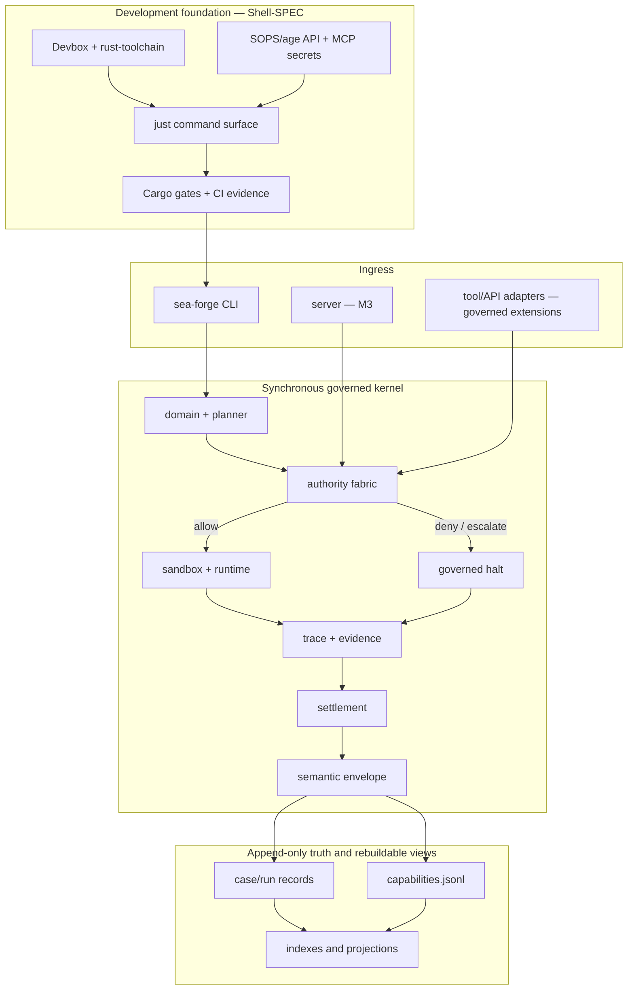

# SEA Forge Architecture

Status: intended architecture, pre-implementation  
Last reviewed: 2026-07-10

This document is the living map of SEA Forge: how the development foundation,
minimum governed kernel, and full-system milestones fit together. It explains
boundaries and rationale; it does not replace the specifications.

## Sources of Truth

The specifications are normative when they reflect the implementation:

1. `.agents/specs/Shell-SPEC.md` — development shell, toolchain, secrets, CI,
   and initial workspace foundation.
2. `.agents/specs/spec-minimum.md` — kernel types, lifecycle, persistence,
   authority, evidence, settlement, and minimum conformance.
3. `.agents/specs/spec-full.md` — additive M0–M8 evolution after the minimum
   slice is implemented and green.

If code and a spec disagree, investigate before changing either. Update the
implementation to meet a still-valid requirement, or update the spec and this
document in the same change when evidence shows the design must change. Never
edit this file to conceal drift.

Current state: the `Shell-SPEC.md` development foundation is implemented —
Devbox, pinned Rust toolchain, `just` command surface, SOPS/age secrets, CI,
and the two-crate workspace skeleton build and test green. The minimum
governed kernel (§2.2) and full-system milestones (§2.3) remain planned until
their files and conformance evidence exist.

## 1. System at a Glance

SEA Forge is a governed capability-execution kernel organized around cases. It
accepts an intent, creates a typed plan, decides authority before side effects,
executes allowed work in a constrained workspace, records trace and evidence,
settles the declared outcome, and appends a semantic capability envelope.



The CLI remains usable without the server. The server adds concurrency,
approvals, and event subscriptions; it does not introduce a second pipeline.

## 2. Architecture Layers

### 2.1 Development foundation

Implemented per `Shell-SPEC.md`. One tool per ownership layer:

- Devbox pins system tools.
- `rust-toolchain.toml` pins stable Rust, rustfmt, and Clippy.
- Cargo manifests and `Cargo.lock` own Rust dependencies.
- direnv activates repository-scoped settings.
- SOPS/age encrypts optional API and MCP credentials.
- `just` exposes the canonical local and CI commands.
- `scripts/check-agent-context.sh` keeps the active handoff coupled to project
  changes without depending on an agent vendor or CI provider.

Offline build, lint, test, and minimum conformance must not need credentials or
network access. Network integrations explicitly declare required variables and
receive only that allowlist. Development secrets never flow into SEA Forge
sandbox payloads through ambient environment inheritance.

Bootstrap evidence belongs under `target/bootstrap-evidence/`; governed runtime
records belong under `.sea-forge/`. Their purposes and trust models differ.

### 2.2 Minimum governed kernel

The current implementation target is a stable-Rust, edition-2021 workspace:

```text
crates/
  sea-forge-core/
    ids.rs          typed identifier grammar
    types.rs        persisted domain records
    errors.rs       typed failure taxonomy
    domain.rs       fixed intent vocabulary
    planner.rs      deterministic intent → plan
    authority.rs    identity + policy decisions, default deny
    sandbox.rs      safe workspace materialization
    runtime.rs      argv execution, timeout, output capture
    trace.rs        append-only lifecycle events
    evidence.rs     evidence records and artifact hashes
    settlement.rs   outcome evaluation independent of exit code
    capability.rs   envelope append and read-only recall
    pipeline.rs     lifecycle orchestration
  sea-forge-cli/
    main.rs
    commands/{run,validate,inspect,recall}.rs
```

The kernel is synchronous and single-process. It creates one degenerate,
single-episode case per invocation. The layout intentionally mirrors future
crate boundaries so graduation is mechanical rather than a rewrite.

### 2.3 Full-system evolution

After the minimum proofs pass, the full spec graduates modules and adds
capabilities in order:

| Milestone | Architectural change | Boundary preserved |
| --- | --- | --- |
| M0 | authority fabric, extension ABI, crate graduation | one authority mediator; minimum records remain readable |
| M1 | Landlock/Seatbelt jail backend | `ExecutionSandbox`; no silent class downgrade |
| M2 | CMMN-subset case engine and templates | each activated item runs the same governed episode |
| M3 | Tokio server, approvals, subscriptions | async at server edge; kernel remains synchronous |
| M4a | capability records and rebuild | JSONL remains truth; views are projections |
| M4b | governed semantic memory and recall | recall is authority-scoped and evidenced |
| M5 | spec-to-code pipelines and projections | pipelines are ordinary cases; generated zones protected |
| M6 | federation bundles | imported capabilities stay isolated until adopted |
| M7 | environment contracts and evaluators | evaluators use authority, sandbox, evidence, settlement |
| M8 | artifact-to-IP transitions | no transition without evidence and a hash-linked token |

The minimum P1–P4b proofs remain green after every milestone. Roadmap items such
as MicroVMs, NATS, additional projection targets, public marketplaces, and chat
adapters enter only through the named seams when a workload requires them.

## 3. Load-Bearing Invariants

1. **Authority precedes side effects.** Normalize every protected action and
   decide all operations before executing any of them. Unknown means deny.
2. **One authority fabric.** CLI, server, shell, API, MCP, projections, git, and
   extensions cannot introduce parallel permission systems.
3. **Identity precedes policy.** Unresolved identity escalates; privileged agents
   require the sponsorship required by policy.
4. **Authority and isolation are distinct.** Policy decides whether work may run;
   the sandbox constrains work after permission. Neither substitutes for the other.
5. **Settlement is not process success.** Exit zero is evidence, not acceptance.
   Required artifacts and evaluator criteria determine the outcome.
6. **Failure still produces governance records.** Denial, escalation, timeout,
   and execution failure leave trace, evidence, settlement, and an envelope.
7. **History is append-only.** A repeated intent creates a new run. Existing run
   directories and JSONL truth are not rewritten.
8. **Views are rebuildable.** SQLite indexes, capability summaries, projections,
   and capital records derive from append-only source records.
9. **Generated artifacts are governed.** Generated zones are never hand-edited;
   work products carry stable identity, provenance, ownership, license, review,
   maturity, case, run, and evidence metadata.
10. **Secrets follow least exposure.** API/MCP credentials stay encrypted at
    rest, redacted in output, absent from argv/evidence, and excluded from sandbox
    environments unless an explicit authority decision permits an allowlist.

## 4. Runtime and Data Flow

### 4.1 Minimum run

```text
parse input + preflight
  → create case and run directory
  → deterministic planning
  → resolve identity and decide every operation
  → any deny/escalate: halt without execution
  → all allow: create workspace, materialize writes, execute argv
  → capture stdout, stderr, work products, hashes, and evidence
  → evaluate settlement criteria
  → write semantic envelope and append capability memory
  → close case and return the settlement-specific exit code
```

The sandbox/runtime never reads policy. It receives allowed execution requests.
Intent is always data; only the deterministic planner converts recognized intent
patterns into typed operations.

### 4.2 Persisted records

```text
.sea-forge/
  cases/<case_id>.json
  runs/<run_id>/
    plan.json
    authority.json
    trace.jsonl
    evidence.jsonl
    settlement.json
    semantic-envelope.json
    workspace/
    artifacts/
  capabilities.jsonl
```

Every cross-reference resolves, every artifact hash verifies, and every top-level
record carries its schema version and run identity. Full-system migrations may
change directory organization only through an explicit, hash-verified migration.

### 4.3 Server-era flow

At M3, `sea-forge-server` accepts requests on a local Unix socket, routes each
episode through the same authority fabric and synchronous pipeline, and emits a
live projection of trace events. Tokio is confined to the server, subscription,
and approval-timer boundary; it does not spread through domain traits.

## 5. Major Interfaces and Seams

| Seam | Owns | Must not own |
| --- | --- | --- |
| domain interpreter | intent vocabulary | shell execution or policy |
| planner | typed case plans | hidden side effects |
| authority fabric | identity, policies, deterministic decisions | execution |
| `ExecutionSandbox` | isolation class, prepare/execute/collect/destroy | authority policy |
| trace/evidence writers | append-only facts and artifacts | settlement decisions |
| settlement evaluator | claim checks and basis | rewriting evidence |
| `EventSink` | event delivery/projection | source-of-truth state |
| `ProjectionAdapter` | deterministic governed projections | direct generated-zone mutation |
| secret requirement | integration credential names/allowlist | credential values or policy bypass |

New capabilities should extend these seams. If a change requires a second
authority engine, private recall channel, mutable projection source, or weaker
sandbox fallback, the design is wrong.

## 6. Failure Model

Failures are typed and have bounded blast radius:

- Foundation/toolchain drift blocks development commands with a runnable next move.
- Missing API/MCP credentials block only the requested integration.
- Invalid input or configuration fails before a run directory is created when
  the minimum spec requires preflight failure.
- Authority deny/escalate halts all execution but completes governance recording.
- Spawn failure, nonzero exit, timeout, missing artifact, or false success settles
  rejected with every contributing basis recorded.
- Full-system policy-engine or jail unavailability fails closed; there is no
  fallback to a weaker decision or isolation class.
- Rebuildable-index failure degrades query performance, not record correctness.

## 7. Testing Strategy

| Layer | Proves | Typical command/evidence |
| --- | --- | --- |
| Foundation | pins, shell, secrets, idempotency | `just doctor`, CI evidence |
| Unit | pure IDs, parsing, policy, safe paths, settlement | focused `cargo test -p ... <name>` |
| Integration | complete run lifecycle and child execution | workspace integration tests |
| Conformance | normative minimum behavior | `just proof`, P1–P4b |
| Milestone | additive full-spec guarantees | current M0–M8 §12/§17 gate |
| Platform | real Landlock/Seatbelt behavior | Linux/macOS CI; explicit skips |
| Security | no secret/path/authority bypass | gitleaks, cargo-deny, negative tests |

Tests assert both results and forbidden side effects. A denial test must prove no
child ran; a redaction test must prove the sentinel secret never appears; a
rebuild test must compare byte-stable output with source records.

## 8. Extension Recipes

### Add a Rust dependency

1. Tie it to a current spec requirement and reject `std` or existing options.
2. Add it to the owning crate or root workspace dependencies.
3. Commit the lockfile change with the implementation.
4. Run focused tests, `just check`, and `just test`.
5. Confirm its license, advisories, Rust-version support, and async impact.

### Add an API or MCP integration

1. Define the canonical authority surface and typed request/response boundary.
2. Add a `SecretRequirement` containing variable names only.
3. Forward only declared variables; never inherit the development environment.
4. Treat remote responses as untrusted data and record governed evidence.
5. Add missing-secret, deny, timeout, redaction, and offline-fallback tests.

### Add a sandbox backend

1. Implement the full-spec `ExecutionSandbox` contract.
2. Advertise the exact isolation class it can enforce.
3. Refuse preparation when that class is unavailable; never downgrade silently.
4. Add path, network, escape, collection, teardown, and platform tests.

### Add a projection

1. Register a valid extension descriptor and authority surfaces.
2. Produce a deterministic `ProjectionRecord` linked to source records.
3. Validate output before acceptance; quarantine rejected mappings with provenance.
4. Prove rebuilding from append-only sources yields the same digest.

## 9. Decision Log

| Decision | Rationale | Rejected alternative | Revisit when |
| --- | --- | --- | --- |
| Rust stable, edition 2021 | required by both system specs | nightly-only features | a normative spec revision requires a newer edition |
| Devbox + rust-toolchain + Cargo | one owner per dependency layer | ambient host tools; polyglot bootstrap | Devbox cannot support a required platform |
| `just` as command surface | identical, discoverable local/CI recipes | duplicated shell and CI logic | the surface cannot remain coherent below roughly 20 recipes |
| SOPS/age for API/MCP secrets | encrypted, auditable, multi-recipient files | plaintext `.env`; credentials in config | an approved secret manager becomes required |
| synchronous kernel | deterministic, simple minimum pipeline | Tokio throughout | an inherently async kernel seam is proven necessary |
| JSON/JSONL truth | inspectable, append-only, rebuildable | database-first persistence | measured scale or concurrency invalidates the model |
| optional Unix-socket server | local concurrency and approvals without remote API | HTTP/microservices first | a remote client is an active requirement |
| module-to-crate graduation | proves the lifecycle before crate proliferation | full crate graph on day one | never; graduation begins only after minimum proof |

## 10. Known Tensions and Review Triggers

- **Devbox versus platform-native Rust setup:** Devbox improves reproducibility but
  adds Nix weight. Revisit only with measured setup or platform failures.
- **Shared encrypted dev secrets:** convenient for integrations but increases
  recipient-management risk. Prefer scoped, revocable development credentials;
  never place production credentials in repository-managed files.
- **Process sandbox in the minimum slice:** sufficient only to prove lifecycle,
  not hostile-payload isolation. M1 retires this known security debt.
- **JSONL concurrency:** intentionally simple for one-shot runs. The server must
  prove its locking and crash recovery before concurrent writers are trusted.
- **Spec freshness:** specs are authoritative only while maintained. Any change to
  behavior, schema, proof, or boundary updates its owning spec and this map.
- **Full-system breadth:** M0–M8 is a roadmap, not permission to implement features
  out of order. Evidence from the current milestone decides what advances.

## 11. Maintenance Rules

- Update this document with architectural changes, not routine code movement.
- Record expensive-to-reverse choices in an ADR when implementation begins.
- Link to tests and concrete files once they exist; remove “planned” language only
  after the corresponding gate passes.
- Keep generated diagrams and examples consistent with the normative record names.
- When this document conflicts with a current spec, the spec wins and the conflict
  must be corrected before completion is claimed.
