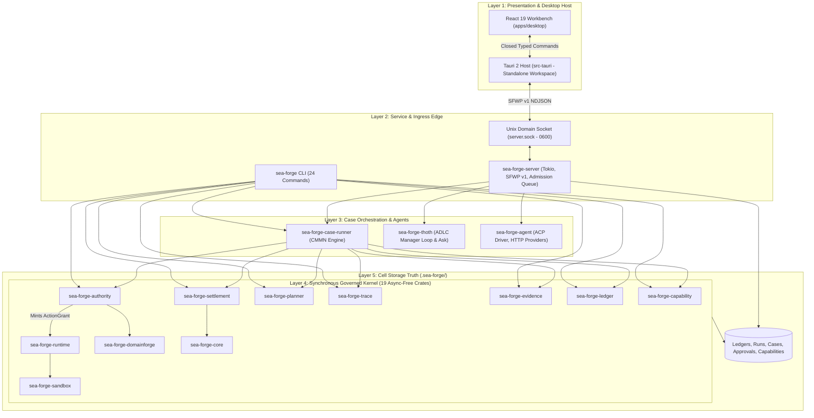
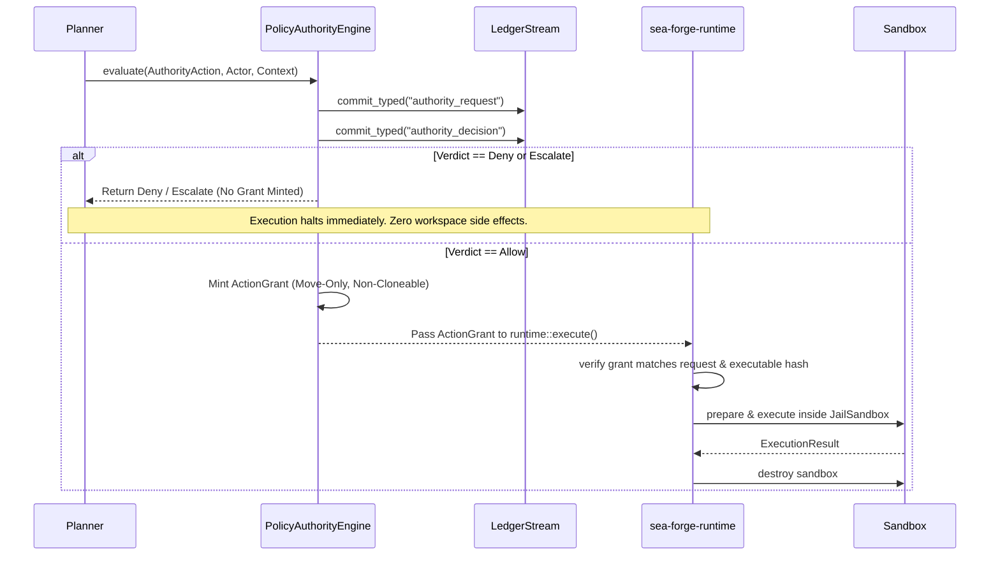

# SEA Forge Canonical Architecture

> **The architectural specification of the SEA Forge governed capability-execution kernel.**  
> Governs: Crates M0–M16 · SFWP v1 · Tauri Desktop Host · React Workbench

---

## 1. System Overview

**SEA Forge** is a local, governed execution product designed around **cases**. It translates intent into typed plans, enforces deterministic pre-execution authority across all side effects, isolates execution within constrained operating-system sandboxes, captures cryptographic append-only trace and evidence, settles declared outcomes independently of process exit status, and metabolizes verified results into reusable capability memory.

### Status & Authority

* **Normative Source of Truth:** Implementation code and conformance test suites (`just proof`, `just ci`, `just crate-test <crate>`) are authoritative.
* **Architecture State:** The workspace contains **22 Rust crates**, a standalone **Tauri 2 Cargo workspace**, and a **Bun workspace** (`workbench/`).
* **Platforms:** Linux is the primary target (utilizing Landlock ABI v1–v6); macOS is secondary (utilizing Seatbelt `sandbox-exec`).

---

## 2. Five Architectural Layers

SEA Forge is structured into five distinct, strictly governed architectural layers:



### Layer 1: Presentation & Desktop Host (`workbench/`)
* **React 19 Renderer:** Pure view layer. Owns route navigation, reversible form drafts, TanStack queries, XState workflow state machines, and G1–G9 guard evaluations. It has zero access to the filesystem, network sockets, or raw SQL.
* **Tauri 2 Host (`src-tauri`):** A **deliberately standalone Cargo workspace**. It owns the Unix domain socket client connection, supervises the local server process, maintains a durable event cursor in `app_data_dir/sfwp-cursor.json`, and exposes a closed enum bridge (`SfwpQuery` and `SfwpCommand`) to the frontend.

### Layer 2: Service & Ingress Edge
* **`sea-forge-server`:** Long-running application service listening on an owner-only Unix domain socket (`0600`). Implements SFWP v1, connection rate-limiting, an 8-waiter admission queue, request correlation for idempotency, and live event broadcasts.
* **`sea-forge-cli`:** Canonical scriptable CLI providing 24 subcommands (`run`, `runs`, `case`, `task`, `approve`, `reject`, `resume`, `ledger`, `recall`, `inspect`, `migrate`, `project`, `self-model`, `ask`, `agent`, etc.).

### Layer 3: Case Orchestration & Agents
* **`sea-forge-case-runner`:** Extracted synchronous lifecycle primitives executing CMMN-subset case plans, managing stage transitions, and evaluating sentry triggers.
* **`sea-forge-thoth`:** ADLC orchestration engine driving the Thoth manager iteration loop (judgment, item proposals, and Separation of Duties [SoD]) and answering domain queries (`thoth.ask`).
* **`sea-forge-agent`:** Governed transport adapters for LLM providers (Anthropic, OpenAI-compatible) and the local Agent Client Protocol (ACP) driver. Brokered tool calls and ChaCha20Poly1305 encrypted sealed transcripts.

### Layer 4: Synchronous Governed Kernel (19 Async-Free Crates)
* Contains pure, deterministic Rust logic. Enforces that no network access or async executor can compromise deterministic governance.
* **Core Crates:** `sea-forge-core`, `sea-forge-domain`, `sea-forge-planner`, `sea-forge-authority`, `sea-forge-sandbox`, `sea-forge-runtime`, `sea-forge-trace`, `sea-forge-evidence`, `sea-forge-settlement`, `sea-forge-capability`, `sea-forge-ledger`, `sea-forge-domainforge`, `sea-forge-spec-pipeline`, `sea-forge-cell`, `sea-forge-artifact-ip`, `sea-forge-self-model`, `sea-forge-extension`.

### Layer 5: Cell Storage Truth (`.sea-forge/`)
* Append-only JSONL files and integrity ledgers. Holds authoritative state for cases, runs, authority decisions, approvals, and capability memory. Rebuildable views (such as SQLite FTS indexes or active policy mirrors) are strictly derived projections.

---

## 3. Load-Bearing Architectural Invariants

| ID | Formulation | Architectural Meaning & Consequence |
|---|---|---|
| **AUTH-01** | **Authority Precedes Every Side Effect** | No process may be spawned and no directory (`workspace/`, `artifacts/`) may be created before an `Allow` verdict commits to the ledger. Denied runs create only governance audit records. |
| **AUTH-02** | **One Authority Fabric** | CLI, server, desktop Workbench, and external agents share identical policy engines and rule definitions. No secondary permission system exists. |
| **DOM-01** | **Settlement Is Independent of Exit Status** | Process exit code 0 is merely one piece of evidence (`require_exit_zero`). Settlement acceptance requires non-empty basis proofs meeting all pre-committed criteria. |
| **DOM-02** | **Every Activation Is an Episode** | Every sandboxed task execution produces a complete set of 6 records: `plan.json`, `authority.json`, `trace.jsonl`, `evidence.jsonl`, `settlement.json`, `semantic-envelope.json`. |
| **DOM-03** | **DomainForge Candidate Precedes Authority** | Domain-bound plans resolve a hash-pinned `.sea` model before authority evaluation. DomainForge generates candidate semantics; SEA Forge decides final authority. |
| **BUILD-01** | **Synchronous Kernel Boundary** | 19 kernel crates forbid async runtimes (`tokio`) and HTTP clients (`reqwest`). Tokio lives exclusively in `sea-forge-server`, `sea-forge-agent`, and the Tauri host. |
| **DATA-01** | **History Is Append-Only; Views Are Rebuildable** | Source of truth is append-only JSONL and hash-chained ledgers. SQLite databases and JSON caches can be deleted and reconstructed deterministically. |
| **DATA-02** | **Canonical Run Locator** | Every run is resolvable across flat (`<root>/runs/<id>`) and case-owned (`<root>/cases/<case>/runs/<id>`) layouts through one unified resolver (`run_views::run_dir`). |
| **DATA-03** | **Request IDs Are Idempotency Keys** | A repeated request ID returns the stored terminal outcome without re-executing side effects. Changed payloads with existing IDs fail closed. |
| **GEN-01** | **Generated Zones Are Protected** | Generated code zones (`src/gen/`) are never hand-edited. Unchecked modifications are rejected by planner and authority guards. |
| **OPS-01** | **Fail-Closed Configuration** | Invalid `server.yaml` blocks server startup. Configuration reload swaps an atomic snapshot affecting future dispatches only; the cell root is immutable. |

---

## 4. Detailed Architectural Views

### 4.1 Logical Architecture & The ActionGrant Seam

The central security mechanism in SEA Forge is the separation between **Authority** and **Execution**:



`ActionGrant` cannot be cloned or serialized (`crates/sea-forge-authority/src/lib.rs:69-87`). It embeds the authorized action, workspace boundaries, granted TCP ports, timeout, and the cryptographic hash of the executable binary. The runtime verifies that the binary on disk matches the grant's hash before spawning, closing time-of-check-to-time-of-use (TOCTOU) races.

### 4.2 Runtime Architecture & Cell Topology

A running SEA Forge deployment consists of local processes bound to one cell root:

```text
Host Environment
├── sea-forge-server Process (PID A)
│   ├── Binds <cell_root>/server.sock (mode 0600)
│   ├── Holds exclusive flock on <cell_root>/server.sock.lock
│   ├── Request Admission Semaphore (active permits = max_concurrent_runs, wait queue = 8)
│   └── SFWP v1 Dispatcher (spawn_blocking for kernel tasks)
│
├── Workbench Desktop App (PID B)
│   ├── Tauri Host Subprocess
│   │   ├── Connects to <cell_root>/server.sock
│   │   ├── Runs reconnect & event loop
│   │   └── Persists cursor in sfwp-cursor.json
│   └── WebKit / WebView Renderer Subprocess
│       └── React 19 UI communicating via typed Tauri IPC
│
└── Sandboxed Children (PIDs C1..Cn)
    ├── Spawned by server or CLI
    ├── Bound by Landlock ABI v1–v6 (Linux) or Seatbelt (macOS)
    └── Working directory restricted to <run_dir>/workspace
```

### 4.3 Data Architecture: Truth vs. Projections

SEA Forge maintains a strict separation between immutable truth and rebuildable projections:

| Storage Role | Paths | Characteristics | Recovery Mechanism |
|---|---|---|---|
| **Authoritative Truth** | `.sea-forge/ledgers/`<br>`.sea-forge/cases/*/case-events.jsonl`<br>`.sea-forge/runs/*/{trace,evidence}.jsonl`<br>`.sea-forge/approvals.jsonl`<br>`.sea-forge/capabilities.jsonl` | Append-only, hash-chained, signed with Ed25519, flushed with `sync_data()`. Never mutated in place. | Primary source of truth. Validated by cryptographic Merkle proofs. |
| **Materialized Views** | `.sea-forge/authority/active-policy.json`<br>`.sea-forge/authority/decisions.jsonl`<br>`.sea-forge/authority/audit.jsonl` | Aggregated views materialized directly by `LedgerStream::materialize_view()`. | Rebuilt by reading all ledger entries in sequence (`pipeline::rebuild_authority_mirrors`). |
| **Search Indexes** | `.sea-forge/memory/sqlite.db` | SQLite FTS5 search index derived from `capabilities.jsonl` and `items.jsonl`. | Rebuilt from scratch via `sea-forge recall --rebuild`. |
| **SFWP View Projections** | In-memory query results (`readiness.get`, `case.get_horizon`, `asset.list`) | Ephemeral projections generated dynamically by folding event streams. | Regenerated on every SFWP query; consistent with durable event cursor. |

### 4.4 Trust and Security Boundaries

1. **Host-to-Server Boundary (Unix Domain Socket):**
   * Socket file permissions are set to `0600` (owner-only access).
   * Peer UID verification ensures that requests originate from the same operating-system user.
2. **Renderer-to-Host Boundary (Tauri IPC):**
   * The React renderer communicates via a closed enum bridge (`SfwpQuery` / `SfwpCommand`).
   * Generic IPC string commands and direct socket calls from the webview are strictly forbidden.
3. **Kernel-to-Child Boundary (OS Jail Sandbox):**
   * Children run under Landlock (Linux) with `LANDLOCK_ACCESS_FS_READ` / `WRITE` restricted exclusively to `workspace/` and `artifacts/`.
   * Outbound network access is fail-closed (`NetworkPosture::Denied`). Explicit TCP ports are allowed only if granted by policy. UDP and raw sockets are completely blocked.
4. **Credential Boundary (Secret Isolation):**
   * Development secrets (`.enc.env`) are encrypted at rest with SOPS and age.
   * Ambient environment variables are stripped. Children receive only explicitly declared variables (defaulting to `PATH` and `HOME`). Secrets never flow into argv, trace files, or evidence logs.

---

## 5. Architectural Subsystem Directory

For in-depth specifications of individual components, consult the subsystem guides:

* [Kernel & Synchronous Pipeline](file:///c:/Users/sprim/projects/sea-rs/docs/subsystems/kernel-pipeline.md)
* [Authority Fabric & Policy Engine](file:///c:/Users/sprim/projects/sea-rs/docs/subsystems/authority-fabric.md)
* [Sandboxing & Runtime Execution](file:///c:/Users/sprim/projects/sea-rs/docs/subsystems/sandbox-runtime.md)
* [Settlement, Evidence & Artifact Hashing](file:///c:/Users/sprim/projects/sea-rs/docs/subsystems/settlement-evidence.md)
* [Integrity Ledger & Cryptographic MMR](file:///c:/Users/sprim/projects/sea-rs/docs/subsystems/integrity-ledger.md)
* [Capability Memory & SQLite Indexing](file:///c:/Users/sprim/projects/sea-rs/docs/subsystems/capability-memory.md)
* [DomainForge Semantic Boundary](file:///c:/Users/sprim/projects/sea-rs/docs/subsystems/domainforge-boundary.md)
* [Server & Wire Protocol (SFWP v1)](file:///c:/Users/sprim/projects/sea-rs/docs/subsystems/server-sfwp.md)
* [Thoth Orchestration & Autonomous Agents](file:///c:/Users/sprim/projects/sea-rs/docs/subsystems/thoth-agent.md)
* [Workbench Desktop & Tauri Host](file:///c:/Users/sprim/projects/sea-rs/docs/subsystems/workbench-desktop.md)
* [Spec-to-Code Pipelines & IP Transitions](file:///c:/Users/sprim/projects/sea-rs/docs/subsystems/spec-pipeline-ip.md)
