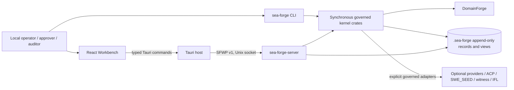

# Architectural Truth

Date: 2026-07-27  
Branch and commit inspected: `frontend` at `8361f25ff0bbfc13c56c96ccb82161f317b4d0e6`

## Authority Of This Document

This is a reconciliation of accepted decisions, current specifications, source,
tests, and history. It does not supersede a normative specification or ADR.
Where those sources disagree, `CONTRADICTIONS_AND_DECISIONS.md` records the
disposition.

The repository defines the following scope-local precedence. It does not define
one global ordering among every additive draft and accepted ADR:

1. The current user request.
2. The nearest `AGENTS.md`; `workbench/AGENTS.md` governs `workbench/`.
3. `.github/copilot-instructions.md`.
4. The normative specification for the affected scope: `Shell-SPEC.md` owns the
   development foundation, `spec-minimum.md` owns the kernel, and
   `spec-full.md` owns additive M0-M8 behavior. Later drafts constrain only the
   implemented capability or product requirement under adjudication.
5. Accepted ADRs govern their named decisions and are not displaced by an
   unrelated draft proposal.
6. For Workbench semantics, the frontend source hierarchy in
   `sea-forge-workbench-frontend-architecture-component-contract-v0.1.md:72-87`.
7. Executable contracts and current implementation where higher sources leave
   behavior implementation-defined.

Evidence: `AGENTS.md:31-46`, `.github/copilot-instructions.md:3-8`,
`.agents/specs/Shell-SPEC.md:54-63`, and the frontend contract cited above.
Plans, status files, README text, architecture summaries, memories, graphs, and
Pass 1 reports are evidence, not authority.

## Product Boundary

### Product And Users

SEA Forge is a local governed capability-execution product. It accepts operator
intent or a plan, decides authority before execution, isolates work, records
trace and evidence, settles declared outcomes, and makes accepted results
inspectable and reusable. The Workbench is a client of that product, not a
second kernel.

Supported roles come from the UX epic: operator/case owner, approver or human
task assignee, domain or plan author, agent sponsor, auditor/reviewer, cell
administrator, and external agent/integration
(`sea-forge-governed-workbench-ux-epic-v0.1.md:34-42`). The first usable product
must serve a local operator, approver, and auditor. External agents are optional
execution adapters, not a prerequisite for local command work.

### Required Journey

The completion journey is the epic's observable outcome, not every proposed API
verb:

```text
open or initialize one cell
-> verify cell, identity, policy, model, integrity, and runtime readiness
-> discover currently spendable affordances
-> choose or define a domain, template, criteria, environment, and executor
-> preflight and commit a governed case
-> authorize and execute command, human, projection, transition, or agent work
-> monitor, approve, cancel, resume, or recover
-> inspect source-linked evidence and settlement
-> reuse accepted results as memory, capability, projection, or artifact
```

Evidence: the UX epic at `:7-31` and `:601-618`. The 123-entry SFWP catalog is
explicitly `target-unmapped`; entries may be mapped, merged, renamed, or rejected
(`sea-forge-workbench-api-method-catalog-v0.1.yaml:1-10`). It is not a completion
counter.

### Required Surfaces And Interfaces

| Surface | Required role |
|---|---|
| `sea-forge` CLI | Scriptable one-shot lifecycle, administration, inspection, migration, and recovery. Existing commands remain compatibility commitments. |
| SEA Forge Workbench | Primary local operator, approver, and auditor experience. Preview-only routes do not count as completed journeys. |
| Tauri host | Native trust boundary. Owns local socket transport, event cursor, and draft files; exposes only closed typed commands. |
| `sea-forge-server` | Long-running application service, authority ingress, case orchestration, event stream, and projections. |
| SFWP v1 | Versioned NDJSON protocol over an owner-only Unix socket. Rust wire types are canonical. |
| `.sea-forge/` store | Governance truth, case/run records, ledgers, requests, sealed material, and rebuildable projections. |
| DomainForge adapter | Side-effect-free `.sea` parse, graph, validation, identity, and candidate authority evidence. |
| Agent/ACP/SWE_SEED adapters | Optional external execution and declaration adapters under the same authority and settlement rules. |

### What Usable Means

A developer can use the minimum CLI lifecycle from a source checkout today.
The full product is usable only when a clean supported host can install one
versioned distribution, start the Workbench and its matching local service,
complete the required journey without source-tree knowledge, restart without
losing committed truth, and inspect failures with a lawful next action.

Green unit tests, a renderer build, a compiled Tauri host, or an isolated socket
smoke does not establish this outcome.

### Local And External Boundaries

The kernel, CLI, server, Workbench, filesystem records, SQLite projection,
DomainForge, Landlock/Seatbelt, and local command execution can run locally.
Linux is primary and macOS secondary (`spec-full.md:5`). The current Unix-socket
server does not establish Windows support.

External infrastructure is required only when selected policy or workload needs
it: model-provider HTTPS endpoints, ACP tools, a SWE_SEED host, an independent
witness, or IFL attestation (`spec-full.md:1900-1907`). Offline build, tests, and
local governed command work must not require those services.

### Minimum Deployable Or Distributable Form

The repository requires a packaged Workbench tested against a real server, but
does not decide whether that server is a Tauri sidecar or a separately installed
local service. The smallest evidence-supported artifact set is:

1. A Linux Workbench package and a version-matched `sea-forge-server` binary,
   installed and started through one documented local procedure.
2. A matching CLI binary archive for scripting and recovery.
3. One cell root and socket-path contract shared by desktop, server, and CLI.
4. macOS packaging after the same journey passes with Seatbelt evidence.

Choosing sidecar supervision versus a separately installed service changes
deployment configuration and service lifecycle, so it is user-required before
implementation. Either choice must preserve the SFWP process boundary and make
the documented installation usable without source-tree assumptions. Containers,
Kubernetes, and remote HTTP are out of scope because no current requirement
needs them.

## Actual System Context



The server and CLI are edge adapters around synchronous kernel crates. Tokio and
HTTP remain outside the 19-crate synchronous kernel gate. The standalone Tauri
Cargo workspace prevents desktop runtime dependencies from entering that gate
(`ADR-004:31-43`, `justfile:111-146`).

## Containers And Components

| Container/component | Owns | Must not own |
|---|---|---|
| React renderer | Routes, reversible drafts, view state, validation hints, accessible interaction | Authority, identity binding, reduction, settlement, ledger verification, source-record writes |
| Tauri host | Closed bridge, selected lifecycle integration, socket connection, event cursor, app-data drafts | Generic backend invocation, policy decisions, direct `.sea-forge/` mutation |
| SFWP server | Protocol negotiation, request identity, actor context, dispatch, events, projections, startup/recovery | A second authority engine or weaker execution path |
| Case runner/orchestration | Case reduction, sentries, episode scheduling, recovery | Hidden state or exit-code settlement |
| Authority/runtime/sandbox | Canonical request, final verdict, exact grant, isolation, argv execution | Fail-open fallback or ambient environment inheritance |
| Trace/evidence/settlement/capability | Complete episode records and outcome qualification | Treating process completion or narration as proof |
| Ledger/store | Append-only governance truth and durable views | Mutable projections as truth |
| DomainForge adapter | `.sea` semantics and candidate evaluation | Final SEA Forge authority or direct side effects |
| Generated contract pipeline | Rust schema to JSON Schema to TS/AJV | Hand-maintained duplicate wire types |

## Current Versus Completion Architecture

| Concern | Current truth | Completion architecture |
|---|---|---|
| CLI minimum | Full minimum lifecycle and P1-P4b proof exist. | Preserve unchanged as a compatibility and recovery path. |
| Desktop startup | Tauri connects to a socket; it neither installs nor starts the server (`src-tauri/src/lib.rs:59-115`). | Distribute a matching server and implement the owner-selected local lifecycle; expose service health and recovery. |
| Root/socket config | Desktop defaults to `$HOME/.sea-forge/server.sock`; server defaults to CWD-relative `.sea-forge/server.sock` (`src-tauri/src/lib.rs:41-50`, `server/config.rs:21-32`). | One resolved absolute cell root determines config, records, and socket. |
| Startup safety | Invalid `server.yaml` logs a warning and uses defaults (`server/src/main.rs:20-30`). Required preflight is absent. | Invalid config blocks startup; sandbox, policy, integrity, DomainForge, notify, and socket preflight run before accepting work. |
| Case sandbox episode | Creates directories before authority, stores below `cases/<case>/runs`, and accepts on exit zero (`case_dispatch.rs:513-607`). | Every episode uses the same authority -> trace -> evidence -> settlement -> capability pipeline and canonical run locator. |
| Run inspection | Reads only `<root>/runs/<run_id>` (`run_views.rs:352-367`). | One canonical locator/schema makes every case-linked run inspectable after restart. |
| Identity | Shell guard context is fabricated and protected actions default to `operator_local` (`router.tsx:38-64`). | Host-resolved actor, role, sponsor, policy, and cell context reach every protected request and record. |
| Recovery | Request status is durable, but duplicate IDs can re-execute and the UI loses the ID on transport failure. | Server-enforced idempotency and a client-generated ID retained before send. |
| Config reload | Reloaded config is discarded (`server/src/lib.rs:1455-1461`). | Atomic last-known-good snapshot applies to future dispatches; invalid reload emits a typed event. |
| Frontend scope | Several routes are live; others are labeled previews. Guards are mostly mock G1. | Only source-backed, identity-aware routes enter the primary journey; previews remain clearly non-operational or are removed. |
| Contracts | Rust-to-schema drift is gated; TS and token drift scripts are not part of routine gates. | One generation command and CI gate verify all committed projections. |
| E2E | Playwright drives Vite with mocked Tauri IPC (`playwright.config.ts:3-9`). | Packaged Tauri -> real host -> real server -> real records journey on a temporary cell. |
| Release | Rust CI excludes Workbench; Tauri packaging is unrun; crates.io publishes only core and CLI despite CLI's 19 internal dependencies. | CI builds supported bundles and binary archives; registry publishing is either given full dependency closure or removed from the supported install claim. |

## Integrated Runtime Path

```text
documented installation selects/creates one cell root
-> Workbench starts or reconnects through the selected local service lifecycle
-> server validates configuration, identity sources, policy, integrity,
   DomainForge, sandbox availability, and socket ownership
-> SFWP hello negotiates version and implemented capabilities
-> readiness reports source-backed state and lawful corrective actions
-> host-resolved actor submits a stable request ID
-> server performs idempotency and stale-precondition checks
-> planner validates plan, criteria provenance, and DomainForge references
-> final authority decision commits before any workspace or process effect
-> exact ActionGrant enters the selected sandbox/runtime
-> trace and evidence append during execution
-> settlement evaluates committed criteria and evidence, never exit alone
-> case/run/approval/capability records commit and events publish
-> Workbench refetches rebuildable projections by durable cursor
-> restart reconstructs inspectable state and marks orphaned work explicitly
```

## Data Flow

Authored intent, templates, `.sea` sources, and actor context enter through CLI
or SFWP. Canonical Rust types validate them. DomainForge returns a pinned semantic
model and candidate verdict without side effects. The authority mediator commits
the final decision and mints an exact grant. Runtime outputs become trace,
evidence, settlement, declaration, and capability records. Append-only ledgers
and canonical run records are truth; JSON views, SQLite indexes, generated TS,
and UI query caches are rebuildable projections.

Client drafts and the event cursor live in Tauri app data. They are not governed
truth and must never be presented as committed plans or complete history.

## Control And Authority Flow

The renderer may request, preview, and display. The Tauri host authenticates the
local installation context and transports typed requests. The server resolves
identity and routes every protected ingress through one authority mediator.
Only a committed allow decision can mint the non-cloneable grant consumed by the
runtime. DomainForge, agent providers, ACP, approvals, and settlement authorities
contribute typed evidence or candidate decisions; none can bypass final SEA Forge
authority or self-declare settlement.

Socket mode `0600` is sufficient only for the accepted single-operator local
deployment (`spec-full.md:1594-1599`). A remote or multi-user deployment would
require a new authentication and authorization contract and is not inferred.

## Technology Constraints

- Stable Rust 1.92.0, edition 2021, locked Cargo dependencies.
- Synchronous kernel; Tokio/HTTP only in approved edges.
- Linux primary, macOS secondary; Landlock/Seatbelt fail closed.
- Tauri 2 + React 19 + Bun development workspace; Bun is not shipped.
- SFWP v1 NDJSON over a Unix socket; no HTTP until a remote client exists.
- DomainForge `domainforge-core = 0.15.0` exact-pinned and side-effect-free.
- Filesystem/JSONL governance truth with ledger commitments; SQLite is a
  rebuildable capability projection.
- Rust wire contracts generate committed JSON Schema and TypeScript/AJV output.
- No new dependency, schema, policy precedence, ID grammar, or public interface
  change without the repository's approval process.

## Completion Architecture

Completion is incremental, not a rewrite:

1. Obtain the owner's sidecar-versus-local-service decision, then unify
   installation, cell root, socket, server lifecycle, and startup safety.
2. Replace the case sandbox shortcut with the existing full lifecycle services;
   do not build a second pipeline.
3. Make one run identity and locator valid across CLI, cases, server projections,
   restart recovery, and Workbench links.
4. Resolve actor context at the host/server boundary and bind it into authority,
   approvals, requests, and records.
5. Add server idempotency and request timeouts before expanding protected UI
   commands.
6. Complete the representative journey as vertical SFWP/host/UI slices:
   readiness and identity; case and criteria; execution and run record;
   approvals/recovery; evidence/settlement; reuse.
7. Gate all generated projections and the standalone Tauri boundary in CI.
8. Package and test the real distribution on Linux, then macOS.

## Explicitly Rejected Assumptions

- Passing existing tests means the product is complete.
- A Vite renderer plus a compiled Tauri host is a working desktop product.
- Every target-catalog method must be implemented before release.
- Every designed route is current scope or live behavior.
- Process exit zero is settlement acceptance.
- `request_id` correlation already provides idempotency.
- Filesystem socket permissions establish a multi-user identity model.
- The frontend may infer identity, authority, readiness, or settlement.
- The DomainForge integration is still a stub; it directly uses
  `domainforge-core = 0.15.0` (`sea-forge-domainforge/Cargo.toml:10-15`).
- `working/face/` is an untracked product architecture. It is tracked historical
  material but absent from the current authority hierarchy.
- Windows, containers, Kubernetes, hosted services, a remote HTTP API, and a
  public marketplace are required by the current substrate.
