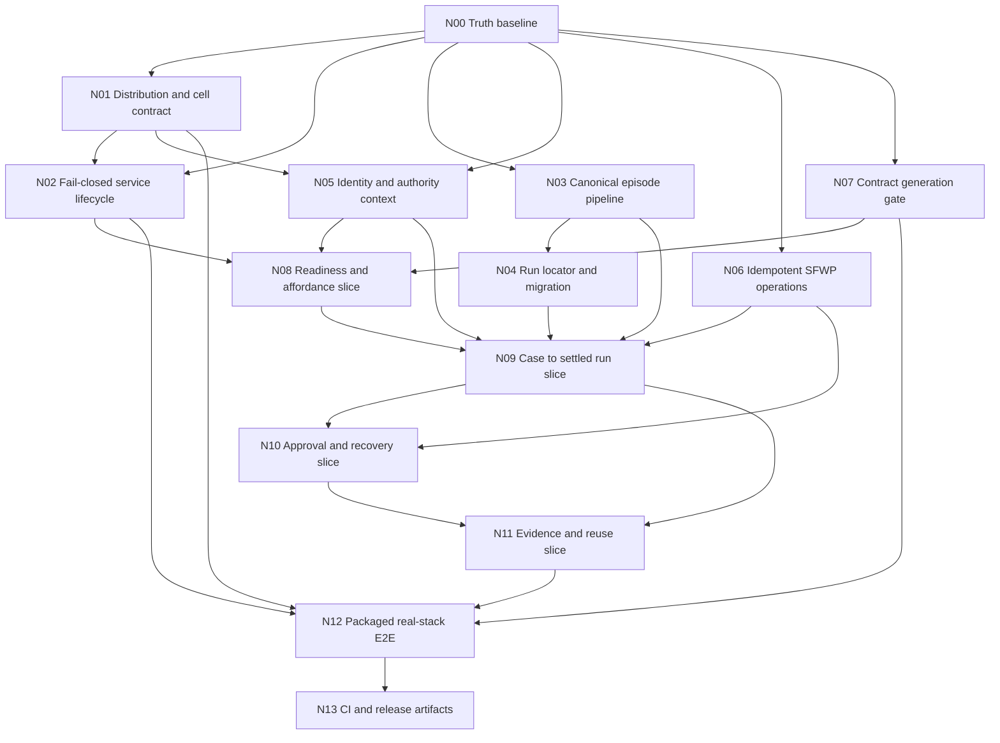

# Execution DAG

This DAG packages completion work; it does not authorize implementation. Nodes
favor vertical journeys after the governance and runtime chokepoints are fixed.

## Graph



## Nodes

### N00 - Freeze The Truth Baseline

- **Outcome:** Current specifications, ADRs, behavior, stale summaries, supported
  platforms, and completion claim levels are explicit and reference one commit.
- **Dependencies:** None.
- **Affected layers:** Documentation, architecture, planning.
- **Owning paths:** `docs/execution/`, later `README.md`, `ARCHITECTURE.md`,
  `AGENTS.md`, applicable ADR clarifications.
- **Forbidden paths:** Product source, generated zones, persisted schemas.
- **Acceptance evidence:** This Pass 2 set; stale top-level claims corrected in a
  later docs-only package; no unresolved precedence ambiguity.
- **Parallelization class:** Foundational sequential.
- **Merge-conflict risk:** Medium; top-level docs and `.agents/CURRENT_STATUS.md`
  are shared hot files.
- **Integration checkpoint:** Architecture owner confirms package nodes preserve
  `ARCHITECTURAL_INVARIANTS.md`.

### N01 - Decide And Define One Distribution And Cell Contract

- **Outcome:** Owner selects Tauri sidecar or separately installed local service;
  the selected Linux Workbench/server/CLI artifact set then uses one absolute
  cell root, one socket path, version negotiation, and explicit platform policy.
- **Dependencies:** N00.
- **Affected layers:** Packaging, Tauri host, server config, CLI, installation.
- **Owning paths:** `workbench/apps/desktop/src-tauri/`,
  `crates/sea-forge-server/src/config.rs`, release scripts/docs, Tauri config.
- **Forbidden paths:** Renderer authority logic, kernel lifecycle semantics,
  containers/remote API.
- **Acceptance evidence:** Recorded owner decision; clean-host setup/start smoke;
  desktop/server discover same root/socket; no Bun in Workbench bundle.
- **Parallelization class:** Foundational sequential; packaging spike may run in
  parallel with N03 after the contract is fixed.
- **Merge-conflict risk:** High in Tauri config and server config.
- **Integration checkpoint:** Packaged hello/readiness against an empty temporary
  cell.

### N02 - Make Service Lifecycle Fail Closed

- **Outcome:** Invalid config blocks startup; required preflight runs; reload
  atomically applies last-known-good config; ordinary requests time out without
  losing durable status; service health is observable.
- **Dependencies:** N00, N01 root/socket contract.
- **Affected layers:** Server startup, config, sandbox probes, integrity,
  DomainForge, events, transport.
- **Owning paths:** `crates/sea-forge-server/src/{main.rs,config.rs,lib.rs}` and
  focused integration tests.
- **Forbidden paths:** UI-side policy evaluation, weaker sandbox fallback,
  unrelated provider behavior.
- **Acceptance evidence:** Invalid YAML/agent/policy/sandbox tests; reload event;
  10-second timeout and concurrent inspection proof.
- **Parallelization class:** Sequential within server; can proceed in parallel
  with N03 and N05 after N01 contract.
- **Merge-conflict risk:** High in `server/src/lib.rs`.
- **Integration checkpoint:** Startup matrix passes with zero protected side
  effects on every failed preflight.

### N03 - Unify The Canonical Episode Pipeline

- **Outcome:** Case sandbox and agent episodes both use one existing governed
  sequence: criteria -> authority -> sandbox/runtime -> trace -> evidence ->
  settlement -> declaration/capability. Workspace creation follows authority.
- **Dependencies:** N00.
- **Affected layers:** Case runner, server dispatch, authority, runtime, trace,
  evidence, settlement, capability.
- **Owning paths:** `crates/sea-forge-case-runner/`,
  `crates/sea-forge-server/src/case_dispatch.rs`, existing lifecycle services and
  conformance tests.
- **Forbidden paths:** Minimum CLI record/schema changes, new duplicate pipeline,
  exit-code-only settlement.
- **Acceptance evidence:** Allow, deny, escalate, timeout, nonzero exit, and false
  success each leave a complete cross-linked episode; denied path has no effect.
- **Parallelization class:** Foundational sequential and highest-risk.
- **Merge-conflict risk:** High in `case_dispatch.rs`; isolate ownership.
- **Integration checkpoint:** Minimum P1-P4b remains green and one SFWP-created
  case emits the same lifecycle quality.

### N04 - Establish One Run Locator And Compatibility Migration

- **Outcome:** One run ID resolves through case, CLI, SFWP, restart, and UI;
  existing flat minimum runs remain readable and can migrate without re-keying.
- **Dependencies:** N03 record shape.
- **Affected layers:** Persistence, migration, run/case projections, Workbench
  links.
- **Owning paths:** `crates/sea-forge-server/src/sfwp/{run_views.rs,case_views.rs}`,
  `crates/sea-forge-server/src/case_dispatch.rs`,
  `crates/sea-forge-cli/src/commands/migrate.rs`, their conformance tests.
- **Forbidden paths:** Re-keying historical IDs, rewriting ledger entries,
  permanent dual-write.
- **Acceptance evidence:** Fixtures for flat and case-owned layouts; create,
  restart, inspect, migrate, rebuild, and hash verification.
- **Parallelization class:** Sequential after N03.
- **Merge-conflict risk:** Medium-high in run/case views.
- **Integration checkpoint:** Every real case horizon run link opens a complete
  record before and after restart.

### N05 - Resolve Identity And Authority Context

- **Outcome:** Host/server resolve actor, role, sponsor, policy, and cell context;
  protected SFWP commands and approvals bind that context; missing identity
  blocks work.
- **Dependencies:** N00; N01 supplies installation/cell identity boundary.
- **Affected layers:** Tauri host, SFWP envelopes, identity, authority, approvals,
  renderer session/readiness.
- **Owning paths:** `crates/sea-forge-server/src/{lib.rs,sfwp/mod.rs}`,
  `crates/sea-forge-server/src/sfwp/approvals.rs`,
  `workbench/apps/desktop/src-tauri/src/bridge.rs`,
  `workbench/apps/desktop/src/router.tsx`, `workbench/packages/contracts/`.
- **Forbidden paths:** Hard-coded production actor, renderer authority, generic
  auth framework, remote multi-user auth.
- **Acceptance evidence:** Two-actor/SoD tests, actor visible in UI and exact
  authority/audit records, missing/conflict denial with no effect.
- **Parallelization class:** Cross-layer vertical; server contract must land
  before host/UI work can parallelize.
- **Merge-conflict risk:** High in SFWP request enum, bridge, router shell.
- **Integration checkpoint:** Identity/readiness journey on real stack.

### N06 - Make Protected Requests Idempotent And Recoverable

- **Outcome:** Stable client request ID exists before send; server deduplicates
  operation+payload; changed payload with reused ID is rejected; status and
  terminal response survive reconnect/restart.
- **Dependencies:** N00.
- **Affected layers:** Request store, SFWP dispatch, Tauri bridge, XState command
  machines.
- **Owning paths:** `crates/sea-forge-server/src/sfwp/correlation.rs`,
  `crates/sea-forge-server/src/lib.rs`,
  `workbench/apps/desktop/src-tauri/src/bridge.rs`,
  `workbench/apps/desktop/src/machines/caseAuthoringMachine.ts`, focused tests.
- **Forbidden paths:** Blind resubmit, optimistic canonical state, transient-only
  dedupe.
- **Acceptance evidence:** Lost-response test proves exactly one case/approval and
  same recovered response; restart repeats the proof.
- **Parallelization class:** Foundational API; can run in parallel with N03/N05
  but owns correlation files.
- **Merge-conflict risk:** Medium-high in SFWP handlers and case machine.
- **Integration checkpoint:** Ambiguity scenario passes against a real server.

### N07 - Close Contract And Generated-Zone Gates

- **Outcome:** One deterministic gate covers Rust schema, committed JSON Schema,
  generated TS/AJV, UI token projection, and standalone Tauri workspace boundary.
- **Dependencies:** N00.
- **Affected layers:** Generators, Workbench packages, Just, CI.
- **Owning paths:** `crates/sea-forge-server/src/bin/gen_sfwp_schema.rs`,
  `crates/sea-forge-server/tests/conformance_sfwp.rs`,
  `workbench/packages/contracts/scripts/generate.ts`,
  `workbench/packages/sea-forge-ui-tokens/scripts/check-drift.mjs`,
  `workbench/apps/desktop/src-tauri/Cargo.toml`, `justfile`; CI remains N13.
- **Forbidden paths:** Hand edits under generated directories, runtime generation,
  root-kernel dependency on Bun.
- **Acceptance evidence:** Deliberate source drift fails; regeneration restores a
  zero diff; removing Tauri `[workspace]` fails.
- **Parallelization class:** Safe parallel foundation.
- **Merge-conflict risk:** Medium in `justfile` and package scripts.
- **Integration checkpoint:** Every later SFWP slice must pass this gate.

### N08 - Complete Readiness, Identity, And Affordance Slice

- **Outcome:** A fresh/existing cell opens with source-backed readiness, resolved
  identity, policy/model/integrity state, and currently lawful actions; Thoth
  affordance answer is grounded and disclosure-controlled.
- **Dependencies:** N02, N05, N07.
- **Affected layers:** Self-model/Thoth projections, SFWP, bridge, renderer.
- **Owning paths:** `crates/sea-forge-server/src/sfwp/{readiness.rs,mod.rs}`,
  `crates/sea-forge-thoth/`, `workbench/packages/contracts/`,
  `workbench/apps/desktop/src/hooks/useReadiness.ts`,
  `workbench/apps/desktop/src/pages/{ReadinessPage.tsx,SurfacesPages.tsx}`.
- **Forbidden paths:** Fabricated readiness, raw graph disclosure, broad catalog
  implementation.
- **Acceptance evidence:** Empty, healthy, stale, blocked, unsupported, and
  degraded real-cell scenarios; every state links evidence and next action.
- **Parallelization class:** Cross-layer slice; contract first, then server and UI
  tests can parallelize.
- **Merge-conflict risk:** Medium in SFWP registry/contracts.
- **Integration checkpoint:** First three steps of the representative journey.

### N09 - Complete Case To Settled Run Slice

- **Outcome:** Domain/template/criteria selection, preflight, idempotent commit,
  authority, execution, trace/evidence, settlement, and run inspection work as
  one real path.
- **Dependencies:** N03, N04, N05, N06, N08.
- **Affected layers:** Planner, DomainForge, case runner, server, persistence,
  SFWP, host, case/run UI.
- **Owning paths:** `crates/sea-forge-server/src/{case_dispatch.rs,lib.rs}`,
  `crates/sea-forge-server/src/sfwp/{case.rs,case_views.rs,run_views.rs,mod.rs}`,
  `workbench/apps/desktop/src/machines/caseAuthoringMachine.ts`,
  `workbench/apps/desktop/src/pages/{CaseCreationWorkbench.tsx,CaseHorizonPage.tsx,RunRecordPage.tsx}`.
- **Forbidden paths:** New horizontal subsystem, duplicate validators, exit-code
  success, mock-only acceptance.
- **Acceptance evidence:** Allow, denial-without-effect, and false-success
  scenarios through real Workbench; complete records inspectable after restart.
- **Parallelization class:** Sequential integration chokepoint.
- **Merge-conflict risk:** High across case dispatch, SFWP enum, generated
  contracts, case pages.
- **Integration checkpoint:** Primary journey reaches an honestly accepted or
  rejected settlement.

### N10 - Complete Approval, Intervention, And Recovery Slice

- **Outcome:** Approver identity/SoD, expiry/escalation, cancel/resume/replan,
  disconnect recovery, and orphan handling are visible, authority-checked, and
  append-only.
- **Dependencies:** N06, N09.
- **Affected layers:** Approvals, case recovery, agent cancellation, events,
  SFWP, Inbox/Operations UI.
- **Owning paths:** `crates/sea-forge-server/src/{lib.rs,delegation.rs}`,
  `crates/sea-forge-server/src/sfwp/{approvals.rs,correlation.rs,events.rs,delegations.rs}`,
  `workbench/apps/desktop/src/pages/{ApprovalInboxPage.tsx,OperationsPage.tsx,DelegationRoster.tsx}`.
- **Forbidden paths:** Editing history, conflating cancellation with settlement,
  hidden auto-retry.
- **Acceptance evidence:** Expired/stale approval, unauthorized approver,
  disconnect, server kill, cancellation, and resume tests against real records.
- **Parallelization class:** Cross-layer slice; approval and restart scenarios can
  parallelize after shared contracts.
- **Merge-conflict risk:** Medium-high in server dispatch/event modules.
- **Integration checkpoint:** Journey can safely intervene and recover.

### N11 - Complete Evidence, Settlement, And Reuse Slice

- **Outcome:** Auditor can inspect complete source-linked records; accepted work
  can become memory/capability/projection/artifact without overstating assurance.
- **Dependencies:** N09, N10.
- **Affected layers:** Evidence, settlement, capability, memory, integrity,
  artifact projections, SFWP, UI.
- **Owning paths:** `crates/sea-forge-{evidence,settlement,capability,self-model,artifact-ip}/`,
  `crates/sea-forge-server/src/sfwp/mod.rs`,
  `workbench/apps/desktop/src/pages/{EvidencePage.tsx,SurfacesPages.tsx}`,
  `workbench/packages/contracts/`.
- **Forbidden paths:** Raw transcript as truth, manual capability promotion,
  fabricated reuse count, broad catalog completion.
- **Acceptance evidence:** Tampered-ledger halt, conservative capability after
  insufficient evidence, disclosure denial before retrieval, accepted reuse path.
- **Parallelization class:** Multiple read-model slices can parallelize after
  canonical contracts are fixed.
- **Merge-conflict risk:** Medium in SFWP registry/generated barrel.
- **Integration checkpoint:** Representative journey completes through reuse.

### N12 - Prove The Packaged Real Stack

- **Outcome:** Packaged Linux application completes every representative scenario
  through real Tauri, SFWP, server, sandbox, and records; macOS follows before it
  is advertised verified.
- **Dependencies:** N01, N02, N07, N11.
- **Affected layers:** Package, OS permissions, service lifecycle, all journey
  layers, accessibility.
- **Owning paths:** `workbench/apps/desktop/src-tauri/{tauri.conf.json,capabilities/}`,
  `workbench/apps/desktop/playwright.config.ts`, packaged E2E and artifact-test
  scripts selected by N01.
- **Forbidden paths:** IPC mocks, Vite-only proof, Bun runtime, unsupported target
  claims.
- **Acceptance evidence:** Clean-host package install; 12 real scenarios;
  keyboard, 200% zoom, reduced motion, axe; bundle inventory; restart proof.
- **Parallelization class:** Final sequential integration checkpoint; platform
  jobs parallelize.
- **Merge-conflict risk:** Medium in package config, high environmental risk.
- **Integration checkpoint:** Distribution-verified claim level.

### N13 - Gate And Release The Supported Artifacts

- **Outcome:** Aggregate CI requires kernel, Workbench, Tauri, generated drift,
  package, and E2E; release emits checksummed Linux package and CLI archive, plus
  macOS only when verified.
- **Dependencies:** N12.
- **Affected layers:** CI, release, documentation, artifacts.
- **Owning paths:** `.github/workflows/`, `justfile`, release docs/scripts.
- **Forbidden paths:** Publishing unresolvable CLI crate, skipped-as-passed gates,
  deployment infrastructure not required by local product.
- **Acceptance evidence:** Required aggregate check; artifact install smoke;
  checksums; release notes; no unresolved production blocker.
- **Parallelization class:** Sequential release gate; artifact builds parallel by
  platform.
- **Merge-conflict risk:** High in shared workflows; CI changes require explicit
  owner authorization under repository rules.
- **Integration checkpoint:** Product-complete claim per
  `PRODUCT_COMPLETION_DEFINITION.md`.

## Plain-Text Topological Sequence

One valid sequence is:

```text
N00
N01, N03, N06, N07
N02, N04, N05
N08
N09
N10
N11
N12
N13
```

N01 requires an owner decision before implementation. Its contract must be fixed
before N02 and N05. N03 owns `case_dispatch.rs`; no parallel package should
edit that file. N05-N11 all extend the SFWP enum/schema registry, so each slice
must merge its contract before the next begins or use explicitly allocated
non-overlapping ownership.

## Deferrable Without Deception

Unmapped catalog methods, optional CopilotKit, external provider families not
advertised by the release, crates.io library publication, Windows/mobile,
remote HTTP, containers, MicroVM, NATS, and hosted deployment may remain deferred.
N01-N12 cannot be deferred while calling the Workbench an integrated product.
