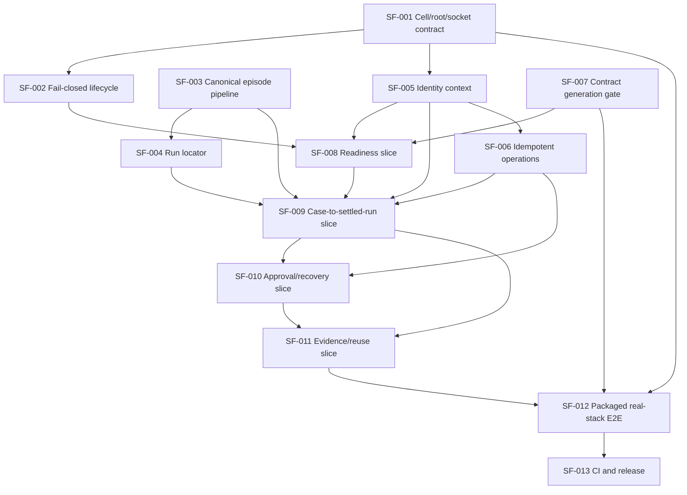

# Master Execution Plan — SEA Forge Completion

## Completion objective

Make SEA Forge a fully working and usable integrated local product: a clean
Linux host installs one versioned distribution, starts the Workbench and its
matching local server, completes the governed representative journey against
real records, restarts without losing committed truth, and inspects failures
with a lawful next action. No required journey uses a preview, mock, or silent
fallback.

## Inspected commit

```
Branch:   frontend
Commit:   8361f25ff0bbfc13c56c96ccb82161f317b4d0e6
Date:     2026-07-27
State:    Working tree clean except .agents/CURRENT_STATUS.md and .jolli/ debug log.
          docs/execution/ artifacts are untracked working-tree evidence (this pass).
```

### Baseline confirmed this pass

| Check | Result |
|---|---|
| `cargo fmt --all -- --check` | clean (exit 0) |
| `cargo check -p sea-forge-core` | clean (exit 0) |
| `devbox run -- just proof` (P1-P4b) | passed (exit 0) |
| `cd workbench && bun run check` | passed (exit 0, 1 known Fast Refresh warning) |

Pass 1 additionally verified: 776 Rust tests, 133 TS tests, `cargo check
--workspace --all-targets`, live SFWP smoke (system_hello, system_describe,
readiness_get). See `VERIFICATION_BASELINE.md`.

## Stage sequence



### Stage 0 — Baseline and guardrails (COMPLETE)

This pass (Pass 3) establishes the truth baseline. The repository is at the
inspected commit; analysis artifacts correspond to current source; baseline
commands pass. Guardrails: preserve `AGENTS.md` invariants, minimum CLI proofs
(P1-P4b), record schemas, ID grammar, async-isolation boundary, and generated
contract ownership.

### Stage 1 — Foundation closure

| Packet | Title | Dependencies |
|---|---|---|
| SF-001 | Distribution and cell contract | — |
| SF-002 | Fail-closed service lifecycle | SF-001 |
| SF-003 | Canonical episode pipeline | — |
| SF-004 | Run locator and migration | SF-003 |
| SF-005 | Identity and authority context | SF-001 |
| SF-006 | Idempotent SFWP operations | SF-005 |
| SF-007 | Contract generation gate | — |

### Stage 2 — Vertical product slices

| Packet | Title | Dependencies |
|---|---|---|
| SF-008 | Readiness, identity, affordance | SF-002, SF-005, SF-007 |
| SF-009 | Case to settled run | SF-003, SF-004, SF-005, SF-006, SF-008 |
| SF-010 | Approval, intervention, recovery | SF-006, SF-009 |
| SF-011 | Evidence, settlement, reuse | SF-009, SF-010 |

### Stage 3 — Integration closure

| Packet | Title | Dependencies |
|---|---|---|
| SF-012 | Packaged real-stack E2E | SF-001, SF-002, SF-007, SF-011 |

### Stage 4/5 — Hardening and acceptance

| Packet | Title | Dependencies |
|---|---|---|
| SF-013 | CI and release artifacts | SF-012 |

## Packet index

| ID | Priority | Scope | Parallelization class |
|---|---|---|---|
| SF-001 | P0 | medium | sequential |
| SF-002 | P0 | medium | sequential |
| SF-003 | P0 | large | sequential (sole file ownership) |
| SF-004 | P0 | medium | sequential |
| SF-005 | P0 | medium | coordinated |
| SF-006 | P0 | medium | sequential |
| SF-007 | P0 | small | independent |
| SF-008 | P0 | medium | coordinated |
| SF-009 | P0 | large | sequential |
| SF-010 | P0 | medium | coordinated |
| SF-011 | P0 | medium | coordinated |
| SF-012 | P0 | large | sequential |
| SF-013 | P0 | medium | sequential |

## Critical path

```
SF-001 → SF-005 → SF-006 → SF-009 → SF-011 → SF-012 → SF-013
```

The longest dependency chain. SF-003 (canonical episode pipeline) is the
highest-risk single packet and gates SF-009, but runs in parallel with the
SF-001→SF-005→SF-006 chain until SF-009 merges them.

## Parallel lanes

After SF-001 lands its contract:

| Lane | Packets | Owned files |
|---|---|---|
| A (backend pipeline) | SF-003 → SF-004 | case_dispatch.rs, run_views.rs |
| B (server lifecycle) | SF-002 | main.rs, config.rs, lib.rs (startup/reload/timeout) |
| C (identity + idempotency) | SF-005 → SF-006 | sfwp/mod.rs, bridge.rs, correlation.rs, router.tsx |
| D (contract gate) | SF-007 | justfile, generator scripts |

Lanes A, B, D can proceed concurrently after SF-001. Lane C follows SF-001
sequentially (SF-005 before SF-006 — both edit the SFWP Request layer).

**High-conflict files (never edit concurrently):**
- `crates/sea-forge-server/src/lib.rs` — SF-002 (reload/timeout) and SF-006
  (dispatch dedupe) both edit; sequence SF-002 before SF-006.
- `crates/sea-forge-server/src/sfwp/mod.rs` — SF-005, SF-006, SF-008, SF-009,
  SF-010, SF-011 all extend the SFWP enum. Merge each slice's contract before
  the next begins.
- `crates/sea-forge-server/src/case_dispatch.rs` — SF-003 SOLE ownership.
- `workbench/apps/desktop/src-tauri/src/bridge.rs` — SF-005 and SF-006;
  sequence SF-005 before SF-006.

## Integration checkpoints

| Checkpoint | After | Evidence |
|---|---|---|
| Cell contract live | SF-001 | Startup matrix: one root, one socket, version handshake |
| Lifecycle fail-closed | SF-002 | Invalid-config blocks; reload atomic; timeout preserves status |
| Episode pipeline real | SF-003 | Denial leaves no side effect; false success rejected; P1-P4b green |
| Run locator unified | SF-004 | Case-linked run resolves before and after restart |
| Identity resolved | SF-005 | Two actors, SoD enforced, UI shows real identity |
| Idempotency proven | SF-006 | Dropped response → one mutation, same terminal outcome |
| Contract gate closed | SF-007 | Drift fails; regeneration zero-diff; boundary holds |
| Readiness slice | SF-008 | First 3 journey steps on real stack |
| Case slice | SF-009 | Journey reaches honest settlement |
| Recovery slice | SF-010 | Safe intervention and recovery |
| Reuse slice | SF-011 | Honest evidence and capability |
| Packaged E2E | SF-012 | Clean-host 12-scenario journey |
| Release | SF-013 | Aggregate CI, checksums, honest docs |

## User-decision checkpoints

| ID | Decision | When | Default if not answered |
|---|---|---|---|
| U-06 | Tauri sidecar vs separately installed server | Before SF-012 packaging | Separately installed server (reversible; SF-001 contract unchanged either way) |
| U-07 | Public SFWP identity/session contract | Before SF-005 public surface | Minimal internal actor context (reversible; additive fields) |

All other U-01 through U-05 triggers do not fire within this completion scope
(no crates.io publication, no signing credentials, no remote auth, no
`working/face/` deletion, no license composition change). Branch merge/push
is a workflow authorization, not an architectural unknown.

**No packet is blocked by an unanswered user decision.** The two checkpoints
above proceed on reversible, evidence-aligned provisional defaults and can be
overridden before SF-012/SF-013 without rework.

## Abort conditions

Abort the run and surface to the owner if:

1. P1-P4b proofs break and cannot be restored without weakening a conformance
   test.
2. A persisted schema change is required that cannot preserve existing record
   IDs or readable history (K-01, K-04).
3. The async-isolation invariant (`just no-async-kernel`) cannot be preserved.
4. A packet's acceptance criteria cannot be met without changing a public
   contract, ID grammar, or policy precedence without owner authorization.
5. The DomainForge exact-pinned version (`domainforge-core = 0.15.0`) must
   change to complete the journey (K-05).
6. A user-decision checkpoint (U-06/U-07) is answered in a way that invalidates
   a prior packet's contract.

## Final acceptance gate

The product is complete when ALL of the following hold:

1. `devbox run -- just check && devbox run -- just test && just workbench-check`
   pass on the integrated tree.
2. `devbox run -- just proof` (P1-P4b) remains green.
3. `just no-async-kernel` confirms 19 kernel crates are async-free.
4. The SF-007 contract gate reports zero drift.
5. The SF-012 packaged E2E passes all 12 representative scenarios on a clean
   Linux host.
6. The SF-013 aggregate CI is green and artifacts are checksummed.
7. No required journey uses a preview, mock, or silent fallback.
8. macOS is either verified or explicitly marked unsupported.

Evidence lives in `VERIFICATION_MATRIX.md`.
