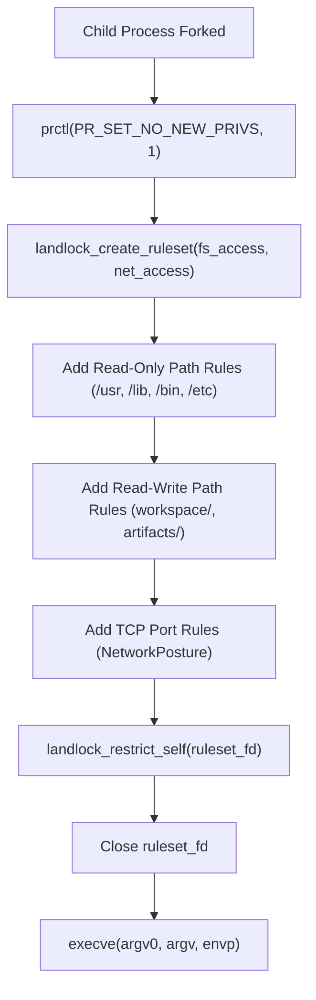

# Explanation: Linux Landlock Jail Security Model

> **Technical security analysis of Linux Landlock LSM (ABI v1–v6) unprivileged sandboxing in `sea-forge-sandbox`.**

---

## 1. Why Landlock?

Executing untrusted child processes or AI-generated commands requires robust operating system isolation. Traditional sandboxing mechanisms suffer from major operational drawbacks:

* **Docker / Containers:** Require a background root daemon (`dockerd`), container image dependencies, substantial startup latency (hundreds of milliseconds), and complex socket mounting.
* **Bubblewrap / Firejail:** Often require `SUID` root binaries or unprivileged user namespaces (`CLONE_NEWUSER`), which are disabled by default on many hardened enterprise Linux distributions.
* **gVisor / Firecracker:** Require virtualization hardware (`/dev/kvm`), nested virtualization support, and significant memory overhead.

**Landlock** (merged in Linux kernel 5.13) provides **unprivileged, in-process, zero-dependency sandboxing**:
1. Any process can sandbox itself and its future children without root permissions or SUID binaries.
2. It has zero startup latency (a few microseconds to configure and enforce rulesets).
3. It requires no external daemons, container runtimes, or guest kernels.

---

## 2. The Enforcement Pipeline

In `sea-forge-sandbox::jail::JailSandbox`, isolation is applied in the child process immediately before calling `execve`:



---

## 3. Filesystem Restrictions

Landlock restricts filesystem operations based on file hierarchy trees.

### System Read-Only Allowlist
To allow standard utilities (`sh`, `cargo`, `python`, `git`, `node`) to execute, the jail grants `LANDLOCK_ACCESS_FS_READ` and `EXECUTE` rights to standard system paths:
* `/usr`, `/lib`, `/lib64`, `/bin`, `/sbin`
* `/etc/ld.so.cache`, `/etc/resolv.conf`, `/etc/ssl/certs`

### Workspace Read-Write Confinement
All write flags (`LANDLOCK_ACCESS_FS_WRITE_FILE`, `MAKE_REG`, `MAKE_DIR`, `REMOVE_DIR`, `REMOVE_FILE`) are granted **strictly and exclusively** to:
* `<run_dir>/workspace`
* `<run_dir>/artifacts`

If a process attempts to execute `echo "hack" > /etc/issue` or `rm -rf /home`, the Linux kernel intercepts the syscall at the VFS layer and returns `EACCES` (Permission Denied).

---

## 4. Network Posture Enforcement

Starting with Landlock ABI v4 (Linux 6.7+), Landlock introduced network port governance:
* `LANDLOCK_ACCESS_NET_BIND_TCP`: Restricts binding TCP sockets to specific ports.
* `LANDLOCK_ACCESS_NET_CONNECT_TCP`: Restricts outbound TCP connections to specific destination ports.

### Fail-Closed Default: `NetworkPosture::Denied`
In SEA Forge, sandboxed tasks default to `NetworkPosture::Denied`:
* Neither `BIND_TCP` nor `CONNECT_TCP` access rights are granted.
* Any attempt by the child process to call `connect()` on a TCP socket immediately fails with `EPERM`.
* Even if the host has active internet access, the sandboxed child cannot reach external servers or exfiltrate data.

### Explicit Port Allowlists
If an authority rule explicitly grants a `network` boundary (e.g. `ports: [443, 8080]`), `NetworkPosture::from_granted_ports` adds explicit Landlock rules allowing TCP connections only to those ports.

### Known Scope Limitations (ADR-002)
As documented in **ADR-002**, through Landlock ABI v6:
* **UDP and Raw Sockets:** Landlock does not yet support UDP or raw socket filtering. Sockets created with `SOCK_DGRAM` are not blocked by Landlock; tasks requiring UDP isolation must be scheduled on future MicroVM sandboxes.

---

## 5. Privilege Dropping (`PR_SET_NO_NEW_PRIVS`)

Before activating the Landlock ruleset, SEA Forge calls:
```c
prctl(PR_SET_NO_NEW_PRIVS, 1, 0, 0, 0);
```
This Linux kernel flag ensures that:
1. The child process and any of its descendants can never acquire additional privileges.
2. SUID binaries (such as `sudo` or `pkexec`) will not grant root privileges if executed.
3. The Landlock ruleset cannot be removed or weakened by any child process.

---

## 6. Source Evidence

* [`crates/sea-forge-sandbox/src/jail.rs`](file:///c:/Users/sprim/projects/sea-rs/crates/sea-forge-sandbox/src/jail.rs) — Complete Linux Landlock syscall implementation and ABI version discovery.
* [`crates/sea-forge-sandbox/src/lib.rs:48-92`](file:///c:/Users/sprim/projects/sea-rs/crates/sea-forge-sandbox/src/lib.rs#L48-L92) — `NetworkPosture` implementation.
* [`docs/decisions/ADR-002-audit-remediation-dependencies.md`](file:///c:/Users/sprim/projects/sea-rs/docs/decisions/ADR-002-audit-remediation-dependencies.md) — Scope analysis of Landlock network limitations.
