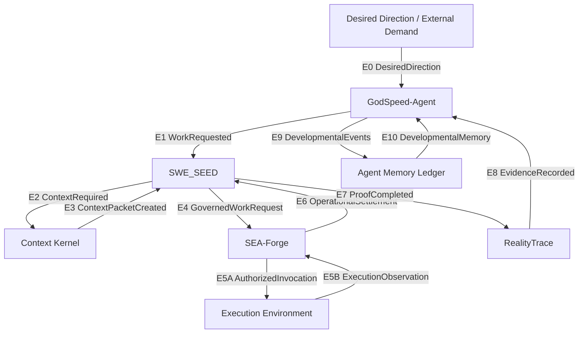
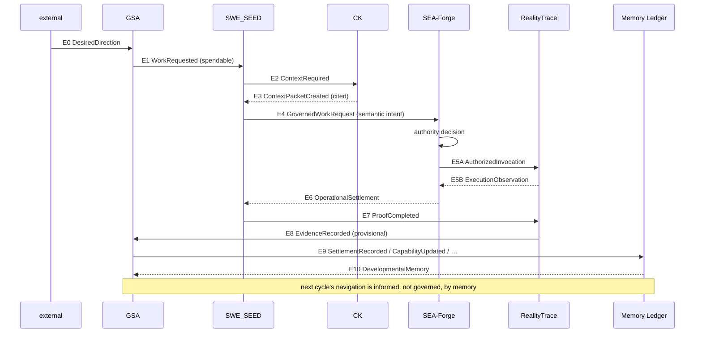

# GodSpeed Canonical Runtime Loop — Onboarding Reference

> Source of truth: `.agents/specs/e2e-preregistration.yml` (frozen) and `.agents/plans/e2e-plan.yml`. This document is a compressed, onboarding-focused projection of those artifacts — if they conflict, trust the code + preregistration.

## 1. What the loop is

One deterministic **work cycle** turns a vague operator wish into settled, reusable capability — without collapsing the five independent facts that must stay distinct: *proof, operational settlement, observation, developmental settlement, capability*.

```
external direction → spendable work → cited context → governed execution
→ settlement → proof → expected-vs-observed evidence → developmental
  consequence → durable memory → better navigation next cycle
```

Identity is carried by two stable identifiers the whole way: a single `work_request_id` and a single resolvable `DomainForge model identity` (`domain_model_hash` → real artifact).

## 2. Components (black boxes)

| Component | Alias | Owns |
|-----------|-------|------|
| `external_environment` | — | Emits `DesiredDirection` |
| `GodSpeed-Agent` | GSA | Navigation, developmental settlement, capability, memory writes |
| `SWE_SEED` | swe_seed | Work-contract, context requirement, proof plane |
| `Context Kernel` | context_kernel / CK | Cited context packets |
| `SEA-Forge` | sea-rs | Authority, execution, operational settlement |
| `Execution Environment` | — | Where authorized action touches reality |
| `RealityTrace` | sxr / realitytrace | Expected-vs-observed binding |
| `Agent Memory Ledger` | memory_ledger | Durable developmental persistence |
| `DomainForge` | — | Canonical semantic-model authority |
| `CEP` | — | Envelope conformance only (never truth) |

## 3. The loop (one diagram is enough)

### 3a. Topology — who talks to whom



### 3b. Sequence — what must happen before the next thing may begin



## 4. Edges — inputs and outputs you will touch

All cross-component messages are canonical `GodSpeedSemanticEnvelope` v1 JSON (`sea.agent.event.v1.json` family): `envelope_id / event_type / occurred_at / producer{component,version} / correlation{work_request_id,…} / domain{namespace,model_version,model_hash} / provenance{parent_envelope_ids,…} / payload`. Helper `make_event_verified` / `*Envelope` types already exist — reuse them.

| Edge | Event | Producer → Consumer | Required payload (abbrev.) | What this edge proves | What it *does not* prove |
|------|-------|---------------------|----------------------------|-----------------------|--------------------------|
| **E0** | `DesiredDirection` | external → GSA | direction_id, direction_type, desired_state | A wish is captured as an observable object, not mistaken for an affordance | That a path exists |
| **E1** | `WorkRequested` | GSA → SWE_SEED | work_request_id, affordance_id, desired_outcome, settlement_criteria, domain_model_ref | An *executable path* (affordance + criteria + identity) entered SWE_SEED | That context exists |
| **E2** | `ContextRequired` | SWE_SEED → CK | work_request_id, context_requirement_id, query, corpus_scope, domain_model_ref | Required context is asked for with full correlation | That CK will find anything |
| **E3** | `ContextPacketCreated` | CK → SWE_SEED | work_request_id, context_requirement_id, context_packet_id, citations, domain_model_ref | Cited evidence returned (or explicit governed no-context) | That CK created authority |
| **E4** | `GovernedWorkRequest` | SWE_SEED → SEA-Forge | work_request_id, affordance_id, actor, intent, context_packet_ref, domain_model_ref, proof_contract, settlement_criteria | Semantically grounded work (intent ≠ opaque command) | That execution is authorized |
| **E5A** | `AuthorizedInvocation` | SEA-Forge → ExecEnv | work_request_id, invocation_id, authority_decision_id, operation, resource, execution_constraints | A decided authority exists before the side effect | That execution succeeded |
| **E5B** | `ExecutionObservation` | ExecEnv → SEA-Forge | work_request_id, invocation_id, execution_status, observed_effects | The effect of *that* authorized invocation | That settlement is favorable |
| **E6** | `OperationalSettlement` | SEA-Forge → SWE_SEED | work_request_id, authority_decision_id, execution_status, observed_effects, operational_settlement_status, evidence_refs, domain_model_ref | Operational consequence decided from SEA-Forge evidence | That proof passes or that capability follows |
| **E7** | `ProofCompleted` | SWE_SEED → RealityTrace | work_request_id, proof_result_id, proof_contract, proof_status, expected_outcome, operational_settlement_ref, domain_model_ref | Proof is bound to real operational evidence, not a rewrite of it | That RealityTrace finds it convincing |
| **E8** | `EvidenceRecorded` | RealityTrace → GSA | event_id, work_request_id, affordance_id, expected_outcome, observed_outcome, difference, proof_result_ref, operational_settlement_ref, domain_model_ref | Expected-vs-observed comparison as *provisional* evidence | That GSA will settle or grant capability |
| **E9** | `SettlementRecorded` et al. | GSA → Ledger | work_request_id, source_evidence_refs, developmental_decision, domain_model_ref | Developmental consequence independently earned and persisted | That a single success makes metabolized capability |
| **E10** | `DevelopmentalMemory` | Ledger → GSA | observer_or_system_id, capability_state, settlement_history_refs | Future navigation is informed by durable history | That history bypasses governance/payment/settlement gates |

### Envelope identity rules that cross every edge (ENV-I1 … ENV-I8)

* `domain.model_hash` resolves to a real DomainForge artifact; fallback/placeholder pseudo-hashes fail closed.
* `work_request_id` stable one cycle; derived envelopes cite causal parents; upstream facts are projected, never silently rewritten; envelope writes are idempotent; evidence refs are immutable/content-addressed when the substrate permits; **conformance ≠ truth**.

## 5. Settlement is five different questions (do not collapse them)

```
Did the declared proof execute and satisfy its criterion?   → SWE_SEED    (proof)
Did the governed execution satisfy authority/evidence/       → SEA-Forge  (operational settlement)
  operational contract?
What was expected vs observed, with evidence binding?        → RealityTrace (observation binding)
What developmental consequence does that justify?             → GSA        (developmental settlement)
What capability state follows from *repeated* settlement      → GSA        (capability, only after
  under declared variation?                                    declared variation — I9)
```

Rule: receiving execution evidence or passing proof **must not itself create** capability.

## 6. Where the code lives

| Concern | Repository / path |
|---------|-------------------|
| Canonical envelope + DomainForge identity | `SWE_SEED/crates/swe-seed-core/src/federation/` (`identity.rs`, `envelope.rs`, `producers.rs`, `consume.rs`) |
| Context Kernel slice | `Context_Kernel/crates/ck-mcp/` (`agentic_capability_loop.rs`, `lib.rs`) + `SWE_SEED/.../context_client.rs` |
| Navigation ingress / work contract | `godspeed_agent/godspeed_nav/canonical_events.py` + `SWE_SEED/.../work_ingress.rs` |
| Governed submission | `SWE_SEED/.../governed_submission.rs` ↔ `sea-rs/crates/sea-forge-server/src/governed_work_ingress.rs` |
| Authority → reality | `sea-rs/crates/sea-forge-server/src/governed_execution_boundary.rs` + `sea-forge-authority` / `sea-forge-runtime` |
| Operational settlement → proof → RealityTrace | `sea-rs/.../governed_settlement_return.rs` ↔ `sxr/sxr-core/src/proof_ingest.rs` + `SWE_SEED/.../operational_settlement.rs`, `proof_completed.rs` |
| Developmental evidence | `sxr/sxr-core/src/evidence_emit.rs` ↔ `godspeed_agent/godspeed_nav/evidence_ingest.py` |
| Developmental memory + capability | `godspeed_agent/godspeed_nav/developmental_events.py` + `developmental_memory.py` |
| Convergence plan & frozen spec | `sea-rs/.agents/specs/e2e-preregistration.yml`, `sea-rs/.agents/plans/e2e-plan.yml` |

## 7. How to work on it

1. **Read the frozen spec first.** Do not infer intent from code alone. Each task (`T00`…`T12`) in the plan is the *only* delta you should close.
2. **Check current delta:** `just e2e-prereg-check && just e2e-delta-check` in `sea-rs` (or `cargo test` in component repos). Status projection lives in `.agents/status/e2e-current-status.yml`; evidence under `.agents/evidence/e2e/<TID>/`.
3. **Implement the smallest delta** that preserves `ENV-I*`/`I*` on every boundary. Reuse the smallest existing wire family (`sea.agent.event.v1.json`); do not create parallel envelope families.
4. **Prove with gates, not comments:** every edge/invariant ships with positive, negative, identity, duplicate, and recovery tests runnable via `just e2e-gate <TID>` (see `sea-rs/justfile`). P3 tasks additionally require a *fresh independent adversarial* confirmation — a different agent must be able to forge each targeted failure only to have it rejected.
5. **Never mark settled on your own say-so** for P3; never generalize from one observation; never manufacture a missing production edge inside a test.
6. **Leave the tree coherent** with all applicable global gates green; preserve unrelated worktree changes.

## 8. Whole-loop acceptance (when the run is *done*)

One `work_request_id` end-to-end with: cited context → explicit authority decision → observed real execution → operational settlement → independent proof → RealityTrace record → provisional evidence → explicit developmental decision → durable memory → changed next navigation. Proof, settlement, observation, developmental settlement, and capability all remain distinct. The loop then repeats under the declared variation classes (success, denial, proof-failure, execution-failure, interruption, replay, wrong identity) without false settlement or provenance loss.

See also: `docs/agentic_loop_boundaries.md` for the Context Kernel / SWE_SEED / SEA-Forge responsibility boundary.
