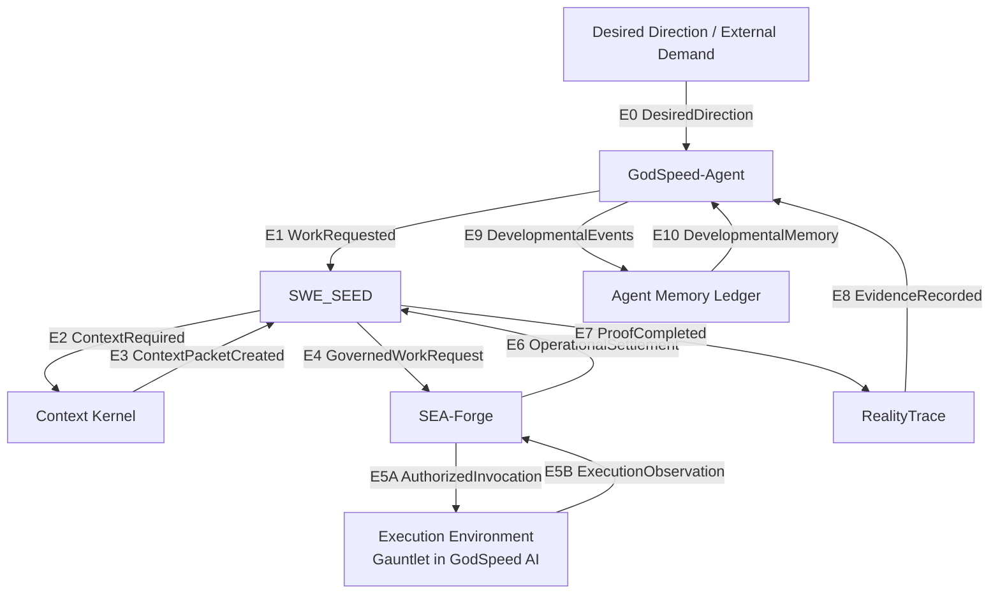

# GodSpeed Canonical Runtime Loop — Onboarding Reference

> Source of truth: `.agents/specs/e2e-preregistration.yml` (frozen) and `.agents/plans/e2e-plan.yml`.
>
> This document is a compressed, onboarding-focused projection of those artifacts and the settled GodSpeed implementation. If this document conflicts with the frozen preregistration, execution plan, or verified production behavior, trust the preregistration + code + settled evidence.

---

## 1. What the loop is

One deterministic **work cycle** turns a vague operator wish into governed action, settled evidence, and developmental memory that can contribute to reusable capability over repeated settlement under declared variation.

It does this without collapsing the five independent facts that must remain distinct:

1. **proof**
2. **operational settlement**
3. **observation binding**
4. **developmental settlement**
5. **capability**

The canonical cycle is:

```text
external direction
→ spendable work
→ cited context
→ governed execution
→ operational settlement
→ proof
→ expected-vs-observed evidence
→ developmental consequence
→ durable memory
→ changed navigation next cycle
````

Identity is carried through the cycle by two stable identities:

* one `work_request_id`
* one resolvable DomainForge semantic-model identity

The `domain_model_hash` must resolve to a real canonical semantic artifact. Placeholder, fallback, namespace-derived, or pseudo-identities do not count as canonical semantic identity.

The output of the loop is not merely an artifact or successful execution.

A completed cycle produces consequence, evidence, developmental state, and memory that can change what becomes visible, reachable, payable, governable, settleable, and therefore spendable on a later cycle.

One successful cycle proves integration and may produce legitimate developmental evidence.

It does **not**, by itself, establish metabolized capability.

---

## 2. Components — black-box responsibilities

For purposes of the canonical runtime contract, components are treated as black boxes.

Their internal languages, storage systems, process boundaries, orchestration strategies, and implementation details may evolve as long as their external contracts and invariants continue to hold.

| Component               | GodSpeed alias / implementation | Owns                                                                                                      |
| ----------------------- | ------------------------------- | --------------------------------------------------------------------------------------------------------- |
| `external_environment`  | —                               | Emits `DesiredDirection`                                                                                  |
| `GodSpeed-Agent`        | GSA                             | Navigation, affordance selection, developmental settlement, capability state, developmental-memory writes |
| `SWE_SEED`              | SWE_SEED                        | Work contract, context requirement, proof plane                                                           |
| `Context Kernel`        | CK / context_kernel             | Evidence-bearing cited context packets                                                                    |
| `SEA-Forge`             | sea-rs                          | Authority, governed execution boundary, operational evidence, operational settlement                      |
| `Execution Environment` | **Gauntlet for GodSpeed AI**    | Agent/tool harness in which an authorized invocation actually attempts the transformation                 |
| `RealityTrace`          | sxr / realitytrace              | Expected-vs-observed evidence binding                                                                     |
| `Agent Memory Ledger`   | memory_ledger                   | Durable developmental persistence and retrieval                                                           |
| `DomainForge`           | DomainForge                     | Canonical semantic-model authority                                                                        |
| `CEP`                   | CEP                             | Envelope/conformance validation only; never truth                                                         |

### Execution Environment is an interface role

`Execution Environment` is intentionally generic in the frozen runtime contract.

It means:

> Any conforming agent, agent harness, tool harness, process, or execution substrate capable of receiving an authorized invocation and returning an execution observation while preserving the frozen authority, identity, provenance, and failure invariants.

For **GodSpeed AI**, that role is implemented by:

```text
Execution Environment
        │
        └── GodSpeed implementation → Gauntlet
```

Therefore:

```text
SEA-Forge
"What is this execution allowed to do?"
        │
        │ E5A AuthorizedInvocation
        ▼
Gauntlet
"How do I actually accomplish the authorized work?"
        │
        │ E5B ExecutionObservation
        ▼
SEA-Forge
"What actually happened, and did the governed
execution operationally settle?"
```

Gauntlet may internally contain substantial orchestration machinery:

```text
Gauntlet
├── orchestrator
├── implementation agents
├── critics
├── independent verifiers
├── deterministic helpers
├── skills
├── tools / MCP servers
├── recovery loops
├── preregistration
├── evidence capture
└── settlement gates
```

Those internals remain behind the E5 boundary.

From the canonical GodSpeed loop's point of view, Gauntlet is one black box:

```text
AuthorizedInvocation
        ↓
     Gauntlet
        ↓
ExecutionObservation
```

Gauntlet does **not** acquire authority merely because it orchestrates execution.

Authority remains owned by SEA-Forge.

A different agent harness could replace Gauntlet in another deployment if it satisfies the same E5A/E5B contract and frozen invariants.

---

## 3. The canonical loop

### 3a. Topology — who talks to whom



Cross-cutting semantic authority:

```text
DomainForge
    └── defines/resolves the semantic model used by the cycle

CEP
    └── validates canonical envelope/conformance properties
        but does not establish truth
```

### 3b. GodSpeed deployment

For GodSpeed AI specifically:

```text
DesiredDirection
        ↓
GodSpeed-Agent
        ↓ E1 WorkRequested
SWE_SEED
        ↕ E2 / E3
Context Kernel
        ↓ E4 GovernedWorkRequest
SEA-Forge
        │
        │ authority decision
        │
        ↓ E5A AuthorizedInvocation
Gauntlet
        │
        │ agent/tool execution and orchestration
        │
        ↑ E5B ExecutionObservation
SEA-Forge
        ↓ E6 OperationalSettlement
SWE_SEED
        ↓ E7 ProofCompleted
RealityTrace
        ↓ E8 EvidenceRecorded
GodSpeed-Agent
        ↓ E9 DevelopmentalEvents
Agent Memory Ledger
        ↓ E10 DevelopmentalMemory
GodSpeed-Agent
        ↺
```

### 3c. Sequence — what must happen before the next thing may begin

```mermaid
sequenceDiagram
    participant Ext as External
    participant GSA as GSA
    participant SWE as SWE_SEED
    participant CK as Context Kernel
    participant SF as SEA-Forge
    participant G as Gauntlet
    participant RT as RealityTrace
    participant ML as Memory Ledger

    Ext->>GSA: E0 DesiredDirection

    GSA->>SWE: E1 WorkRequested
    Note over GSA,SWE: selected spendable path, not merely a destination

    SWE->>CK: E2 ContextRequired
    CK-->>SWE: E3 ContextPacketCreated
    Note over SWE,CK: cited context or explicit governed no-context outcome

    SWE->>SF: E4 GovernedWorkRequest
    Note over SWE,SF: semantic intent + context + proof contract + settlement criteria

    SF->>SF: authority decision

    SF->>G: E5A AuthorizedInvocation
    Note over SF,G: authority exists before governed side effect

    G-->>SF: E5B ExecutionObservation
    Note over G,SF: observation belongs to exactly that authorized invocation

    SF-->>SWE: E6 OperationalSettlement

    SWE->>RT: E7 ProofCompleted

    RT->>GSA: E8 EvidenceRecorded
    Note over RT,GSA: expected-vs-observed evidence is provisional

    GSA->>ML: E9 SettlementRecorded / CapabilityUpdated / RepetitionPlanned / ...

    ML-->>GSA: E10 DevelopmentalMemory

    Note over GSA,ML: memory informs future navigation; it does not govern it
```

---

## 4. Edge contracts — inputs and outputs

All canonical cross-component messages use the `GodSpeedSemanticEnvelope` v1 family.

The canonical envelope carries approximately:

```text
envelope_id
event_type
occurred_at

producer
  component
  version

correlation
  cycle_id
  work_request_id
  parent_envelope_ids
  trace_id?
  case_id?
  run_id?

domain
  namespace
  model_version
  model_hash

actor?
authority?

provenance
  parent_envelope_ids
  artifact_hashes?
  evidence_refs?
  trace_refs?
  source_refs?

payload
```

Existing canonical helper and typed-envelope surfaces should be reused rather than creating parallel message families.

---

### E0 — Desired direction

**Event**

`DesiredDirection`

**Producer → Consumer**

```text
External Environment → GodSpeed-Agent
```

**Required semantic content**

```text
direction_id
direction_type
desired_state
```

Optional context may include:

```text
current_state
constraints
payment constraints
governance context
settlement expectation
```

**This edge proves**

A desired direction has been represented as an observable input.

**It does not prove**

That a path exists.

A destination is not an affordance.

---

### E1 — Spendable work request

**Event**

`WorkRequested`

**Producer → Consumer**

```text
GodSpeed-Agent → SWE_SEED
```

**Required payload**

```text
work_request_id
affordance_id
desired_outcome
settlement_criteria
domain_model_ref
```

Optional:

```text
actor
constraints
payment_budget
capability_requirements
governance_requirements
```

**This edge proves**

An executable path — an affordance with observable settlement criteria and semantic identity — entered SWE_SEED.

**It does not prove**

That required context exists or that execution will be authorized.

---

### E2 — Context requirement

**Event**

`ContextRequired`

**Producer → Consumer**

```text
SWE_SEED → Context Kernel
```

**Required payload**

```text
work_request_id
context_requirement_id
query
corpus_scope
domain_model_ref
```

Optional:

```text
authority_reference
max_results
```

**This edge proves**

Required context has been explicitly requested with causal correlation.

**It does not prove**

That Context Kernel will find qualifying evidence.

---

### E3 — Evidence-bearing context

**Event**

`ContextPacketCreated`

**Producer → Consumer**

```text
Context Kernel → SWE_SEED
```

**Required payload**

```text
work_request_id
context_requirement_id
context_packet_id
citations
domain_model_ref
```

**This edge proves**

Cited context was returned, or the system produced the explicitly governed no-context behavior permitted by the contract.

**It does not prove**

Authority.

Context Kernel provides representation and evidence.

It does not decide whether execution is allowed.

Required context plus zero valid citations must not silently become successful context acquisition.

---

### E4 — Governed work submission

**Event**

`GovernedWorkRequest`

**Producer → Consumer**

```text
SWE_SEED → SEA-Forge
```

**Required payload**

```text
work_request_id
affordance_id
actor
intent
context_packet_ref
domain_model_ref
proof_contract
settlement_criteria
```

Optional:

```text
route_id
artifact_expectations
authority_context
payment_budget
```

**This edge proves**

SEA-Forge received semantically grounded work containing:

* the intended transformation;
* the relevant context;
* the actor;
* the semantic world;
* the proof obligation;
* the operational settlement obligation.

It is not merely:

```text
run this command
```

**It does not prove**

That execution is authorized.

---

### E5A — Authorized invocation

**Event**

`AuthorizedInvocation`

**Producer → Consumer**

Canonical:

```text
SEA-Forge → Execution Environment
```

GodSpeed deployment:

```text
SEA-Forge → Gauntlet
```

**Required payload**

```text
work_request_id
invocation_id
authority_decision_id
operation
resource
execution_constraints
```

Optional:

```text
grant_id
timeout
artifact_expectations
```

**This edge proves**

An applicable authority decision exists before the governed side effect may occur.

**It does not prove**

That execution succeeds.

Gauntlet cannot self-assert this authority.

---

### E5B — Execution observation

**Event**

`ExecutionObservation`

**Producer → Consumer**

Canonical:

```text
Execution Environment → SEA-Forge
```

GodSpeed deployment:

```text
Gauntlet → SEA-Forge
```

**Required payload**

```text
work_request_id
invocation_id
execution_status
observed_effects
```

Optional:

```text
stdout_ref
stderr_ref
artifact_refs
side_effect_refs
failure_details
```

**This edge proves**

What actually happened during the specific invocation SEA-Forge authorized.

The observation must remain bound to the exact authorized invocation identity.

Late, duplicated, stale, or cross-wired observations must not settle against another invocation.

**It does not prove**

That the operational contract was satisfied.

---

### E6 — Operational settlement

**Event**

`OperationalSettlement`

**Producer → Consumer**

```text
SEA-Forge → SWE_SEED
```

**Required payload**

```text
work_request_id
authority_decision_id
execution_status
observed_effects
operational_settlement_status
evidence_refs
domain_model_ref
```

Optional:

```text
case_id
run_id
artifact_refs
transcript_ref
failure_reason
```

**This edge proves**

SEA-Forge independently evaluated the governed execution against its declared authority, evidence, execution, and operational-settlement contract.

Operational settlement is not simply:

```text
process exited 0
```

**It does not prove**

That SWE_SEED proof passes.

It also does not establish developmental settlement or capability.

---

### E7 — Proof bound to operational reality

**Event**

`ProofCompleted`

**Producer → Consumer**

```text
SWE_SEED → RealityTrace
```

**Required payload**

```text
work_request_id
proof_result_id
proof_contract
proof_status
expected_outcome
operational_settlement_ref
domain_model_ref
```

Optional:

```text
artifact_refs
trace_root
output_ref
proof_evidence_refs
```

**This edge proves**

The declared proof has been evaluated and is bound to the real operational evidence path.

SWE_SEED references SEA-Forge's evidence rather than rewriting its observation history.

**It does not prove**

That expected and observed reality agree, or that the result deserves developmental settlement.

---

### E8 — Expected-vs-observed evidence

**Event**

`EvidenceRecorded`

**Producer → Consumer**

```text
RealityTrace → GodSpeed-Agent
```

**Required payload**

```text
event_id
work_request_id
affordance_id

expected_outcome
observed_outcome
difference

proof_result_ref
operational_settlement_ref
domain_model_ref
```

Optional:

```text
authority_decision_ref
artifact_refs
trace_refs
evidence_refs
reliability_inputs
```

**This edge proves**

RealityTrace has bound:

```text
what was declared / expected
          ↕
what was actually observed
```

with sufficient evidence and provenance to inspect the comparison.

**It does not prove**

Developmental settlement.

`EvidenceRecorded` enters GSA as **provisional developmental evidence**.

Receiving it must not itself create:

```text
SettlementRecorded
CapabilityUpdated
metabolized capability
```

---

### E9 — Developmental consequence

**Events**

Examples include:

```text
SettlementRecorded
CapabilityUpdated
RepetitionPlanned
LearningProposalCreated
CoherenceBreakDetected
```

**Producer → Consumer**

```text
GodSpeed-Agent → Agent Memory Ledger
```

**Common required semantic content**

```text
work_request_id
source_evidence_refs
developmental_decision
domain_model_ref
```

**This edge proves**

GodSpeed-Agent independently evaluated what developmental consequence, if any, the available evidence justifies.

That consequence is persisted with provenance.

**It does not prove**

That one success establishes metabolized capability.

Capability requires its own evidence threshold, including repeated settlement under the declared relevant variation.

---

### E10 — Developmental memory

**Event**

`DevelopmentalMemory`

**Producer → Consumer**

```text
Agent Memory Ledger → GodSpeed-Agent
```

**Required payload**

```text
observer_or_system_id
capability_state
settlement_history_refs
```

Optional:

```text
repetitions_due
learning_proposals
prior_failures
recovery_history
horizon_updates
earned_shortcuts
blocked_paths
```

**This edge proves**

Durable developmental history can inform future navigation.

The history can alter:

* search burden;
* orchestration burden;
* confidence;
* repetition requirements;
* capability priors;
* available representations;
* future affordance selection.

**It does not prove**

That a historical affordance is still available now.

Memory cannot bypass current:

* governance;
* payment capacity;
* settlement access;
* irreversible-harm constraints;
* capability-collapse constraints.

Historical capability is evidence.

It is not current authority.

---

## 5. Envelope invariants — ENV-I1 through ENV-I8

The semantic envelope is not just transport formatting.

It carries the causal and semantic spine of the whole runtime.

The following rules cross every canonical edge.

### Canonical model identity

`domain.model_hash` must resolve to a real canonical DomainForge semantic source.

The following are not acceptable substitutes:

```text
fallback hash
namespace-derived pseudo-hash
constant placeholder
all-zero hash
unresolved hash
hash for another semantic artifact
```

Invalid semantic identity fails closed or is explicitly quarantined.

---

### Stable work identity

One canonical work cycle retains the same:

```text
work_request_id
```

from E1 through E10.

A downstream component cannot silently create a different work identity and remain part of the same cycle.

---

### Causal parentage

Derived envelopes identify their causal parent envelope or envelopes.

This allows the system to reconstruct:

```text
what caused this representation?
what evidence preceded it?
which work cycle does it belong to?
```

---

### Upstream facts are not silently rewritten

Downstream components may:

* reference;
* project;
* normalize;
* interpret;
* compare.

They may not silently replace authoritative upstream facts while pretending causal continuity has been preserved.

---

### Idempotency

Durable canonical event writes are idempotent under stable event identity.

Replay must not duplicate:

* side effects;
* settlements;
* capability;
* developmental history.

---

### Evidence provenance

Where the substrate permits, evidence references should resolve to immutable or content-addressed artifacts.

Evidence should remain inspectable rather than becoming an ungrounded textual assertion downstream.

---

### Conformance is not truth

CEP or schema conformance means:

> This envelope satisfies the declared representation contract.

It does **not** mean:

> The enclosed claim is true.

Therefore:

```text
valid envelope
≠ truth

valid envelope
≠ authority

valid envelope
≠ proof success

valid envelope
≠ operational settlement

valid envelope
≠ developmental settlement

valid envelope
≠ capability
```

---

## 6. Settlement is five different questions

Do not collapse these.

```text
SWE_SEED
Did the declared proof execute and satisfy its criterion?
        ↓
PROOF
```

```text
SEA-Forge
Did the governed execution satisfy its authority,
evidence, execution, and operational contract?
        ↓
OPERATIONAL SETTLEMENT
```

```text
RealityTrace
What was expected versus observed, and what evidence
binds that comparison?
        ↓
OBSERVATION BINDING
```

```text
GodSpeed-Agent
What developmental consequence does this evidence justify?
        ↓
DEVELOPMENTAL SETTLEMENT
```

```text
GodSpeed-Agent
What capability state is justified by repeated settlement
under declared relevant variation?
        ↓
CAPABILITY
```

The ordering matters.

```text
proof
    ≠ operational settlement

operational settlement
    ≠ observation binding

observation binding
    ≠ developmental settlement

developmental settlement
    ≠ metabolized capability
```

A successful tool call is not settlement.

A passing proof is not capability.

One successful cycle is not metabolization.

---

## 7. Responsibility boundaries

A useful shorthand is:

```text
DomainForge
defines the semantic world
```

```text
GodSpeed-Agent
selects what path is currently spendable
```

```text
SWE_SEED
defines and evaluates what must be proven
```

```text
Context Kernel
supplies cited context
```

```text
SEA-Forge
decides what execution may occur
and evaluates its operational settlement
```

```text
Gauntlet
attempts the authorized transformation
using agents, tools, skills, and recovery machinery
```

```text
RealityTrace
binds expected reality to observed reality
```

```text
GodSpeed-Agent
decides what developmental consequence follows
```

```text
Agent Memory Ledger
preserves what survived
```

```text
CEP
checks representation conformance
without asserting truth
```

Another compact representation:

```text
SWE_SEED
"What must be proven?"

SEA-Forge
"What may happen?"

Gauntlet
"How can the authorized transformation actually be accomplished?"

RealityTrace
"What did we expect, and what actually happened?"

GodSpeed-Agent
"What does that consequence justify changing next?"
```

---

## 8. Where the code lives

| Concern                                   | Repository / path                                                                                            |
| ----------------------------------------- | ------------------------------------------------------------------------------------------------------------ |
| Canonical envelope + DomainForge identity | `SWE_SEED/crates/swe-seed-core/src/federation/` — `identity.rs`, `envelope.rs`, `producers.rs`, `consume.rs` |
| Context Kernel slice                      | `Context_Kernel/crates/ck-mcp/` — `agentic_capability_loop.rs`, `lib.rs` + SWE_SEED `context_client.rs`      |
| Navigation ingress / work contract        | `godspeed_agent/godspeed_nav/canonical_events.py` + SWE_SEED `work_ingress.rs`                               |
| Governed submission                       | SWE_SEED `governed_submission.rs` ↔ `sea-rs/crates/sea-forge-server/src/governed_work_ingress.rs`            |
| Authority boundary                        | `sea-rs/crates/sea-forge-server/src/governed_execution_boundary.rs` + `sea-forge-authority`                  |
| GodSpeed execution environment            | `gauntlet/` — concrete GodSpeed implementation of the canonical Execution Environment role                   |
| Runtime / execution substrate             | SEA-Forge runtime surfaces plus Gauntlet's authorized agent/tool execution                                   |
| Operational settlement return             | SEA-Forge `governed_settlement_return.rs` ↔ SWE_SEED `operational_settlement.rs`                             |
| Proof                                     | SWE_SEED `proof_completed.rs` and associated proof/trace surfaces                                            |
| RealityTrace proof ingest                 | `sxr/sxr-core/src/proof_ingest.rs`                                                                           |
| Developmental evidence                    | `sxr/sxr-core/src/evidence_emit.rs` ↔ `godspeed_agent/godspeed_nav/evidence_ingest.py`                       |
| Developmental memory + capability         | `godspeed_agent/godspeed_nav/developmental_events.py` + `developmental_memory.py`                            |
| Convergence spec + plan                   | `sea-rs/.agents/specs/e2e-preregistration.yml`, `sea-rs/.agents/plans/e2e-plan.yml`                          |

Where this onboarding projection does not identify an exact Gauntlet internal path, inspect the current Gauntlet implementation rather than inventing one from this document.

The canonical contract is the E5A/E5B boundary, not a frozen internal Gauntlet file layout.

---

## 9. How to work on the loop

### Read the frozen contract first

Start with:

```text
.agents/specs/e2e-preregistration.yml
```

Then inspect:

```text
.agents/plans/e2e-plan.yml
```

Do not infer desired architecture solely from whatever implementation happens to exist today.

---

### Verify the target has not moved

From the SEA-Forge / convergence root:

```bash
just e2e-prereg-check
```

A mismatch means stop.

Do not silently rebind the frozen target.

---

### Inspect current convergence state

Use:

```bash
just e2e-delta-check
```

Operational status is projected under:

```text
.agents/status/e2e-current-status.yml
```

Evidence is stored under:

```text
.agents/evidence/e2e/<TASK_ID>/
```

Operational status is a mutable projection.

It is not normative authority.

---

### Work the smallest delta

Implement only the smallest currently open discrepancy against the frozen edge or invariant.

Do not redesign unrelated settled surfaces.

Once an edge is independently confirmed, treat it as fixed substrate unless a later falsifier demonstrates that it cannot compose.

---

### Reuse the canonical representation

Prefer the existing `sea.agent.event.v1.json` / canonical typed-envelope family.

Do not invent parallel envelope families simply because another local representation would be convenient.

---

### Prove behavior through gates

Use:

```bash
just e2e-gate <TASK_ID>
```

Applicable edge/invariant work should include, where relevant:

* positive-path proof;
* negative-path proof;
* semantic-identity proof;
* causal/cross-wire proof;
* duplicate/replay proof;
* interruption/recovery proof;
* targeted adversarial falsifier.

P3 work additionally requires fresh independent adversarial confirmation.

A builder does not settle its own P3 claim.

---

### Never manufacture a missing production path in a test

A test-only semantic bridge may help diagnose an architectural delta.

It does not prove the production edge exists.

The whole-loop acceptance path must traverse real production integrations.

---

### Preserve the black-box boundaries

In particular:

```text
Context Kernel
must not become execution authority
```

```text
Gauntlet
must not self-authorize
```

```text
RealityTrace
must not become developmental-settlement authority
```

```text
Memory Ledger
must not become navigation/governance authority
```

```text
CEP
must not become truth authority
```

---

## 10. Whole-loop acceptance

The canonical runtime is settled only when one deterministic production-path work cycle can traverse the complete topology using:

```text
one work_request_id
+
one resolvable DomainForge semantic identity
```

and produce, in causal order:

```text
DesiredDirection

→ selected affordance

→ WorkRequested

→ cited ContextPacketCreated

→ GovernedWorkRequest

→ explicit SEA-Forge authority decision

→ E5A AuthorizedInvocation

→ real Gauntlet execution

→ E5B ExecutionObservation

→ OperationalSettlement

→ independent ProofCompleted

→ RealityTrace expected-vs-observed record

→ provisional EvidenceRecorded

→ explicit developmental settlement decision

→ durable developmental memory

→ changed next-navigation state
```

No step may obtain its semantics from a test-only substitute.

The system must preserve the distinction among:

```text
proof
operational settlement
observation
developmental settlement
capability
```

---

## 11. Variation and recovery

One successful end-to-end cycle proves the integration path.

It does not establish durable capability.

The loop must also survive declared relevant variation.

At minimum the canonical convergence work exercises:

```text
successful execution

authority denial / escalation

execution failure

execution timeout

proof failure after successful execution

interruption and recovery

duplicate delivery

event replay

out-of-order delivery

late callback

cross-wired work identity

cross-wired invocation identity

wrong DomainForge identity

missing DomainForge identity

invalid semantic envelope
```

The expected behavior is not that every run succeeds.

The expected behavior is that the system remains **truthful** about what happened.

Failure must remain visible.

Recovery must preserve provenance.

Replay must not duplicate consequence.

Authority must not be bypassed.

Semantic identity must not silently drift.

Developmental capability must not be falsely promoted.

---

## 12. The cybernetic interpretation

The loop can be read as:

```text
representation
    ↓
affordance selection
    ↓
governed transformation attempt
    ↓
contact with reality
    ↓
settlement
    ↓
evidence
    ↓
developmental update
    ↓
changed future affordance field
    ↺
```

More explicitly:

```text
Representation changes visibility.

Navigation chooses among visible,
reachable, payable, governable,
and settleable paths.

SEA-Forge governs the attempted transformation.

Gauntlet executes the authorized attempt.

Reality determines what actually happened.

SEA-Forge determines operational settlement.

SWE_SEED determines proof.

RealityTrace binds expected to observed.

GodSpeed-Agent determines developmental consequence.

Memory preserves what survives.

That developmental history changes what becomes
spendable next.
```

The loop therefore does not end at execution.

It closes only when consequence feeds back into future navigation.

---

## 13. Capability interpretation

The system must never infer capability from:

```text
access

explanation

imitation

tool availability

one execution

one passing proof

one favorable operational settlement

one EvidenceRecorded event

one developmental settlement
```

Capability requires evidence that survives the declared relevant variation.

That includes, where applicable:

```text
repeated settlement

reduced orchestration burden

transfer

recovery

variation

retention of the useful representation
```

The developmental question is not:

> Did this work once?

It is:

> What has now become reliably spendable that was not reliably spendable before?

---

## 14. The GodSpeed execution-harness contract

For GodSpeed AI, Gauntlet should be understood as an interchangeable implementation behind the canonical Execution Environment interface.

Its external obligation is intentionally narrow:

### Input

```text
E5A AuthorizedInvocation
```

including:

```text
work_request_id
invocation_id
authority_decision_id
operation
resource
execution_constraints
```

### Internal freedom

Gauntlet may decide how to achieve the authorized transformation using:

```text
agents
sub-agents
tools
skills
deterministic helpers
intermediate representations
critics
reviewers
recovery
iteration
search
parallelism
```

provided it remains within the authority and execution constraints supplied by SEA-Forge.

### Output

```text
E5B ExecutionObservation
```

including what actually happened and sufficient evidence/provenance to bind the observation back to the authorized invocation.

### Hard invariants

```text
Gauntlet does not grant itself authority.

Gauntlet does not widen the authorized operation.

Gauntlet does not rewrite the work identity.

Gauntlet does not claim operational settlement.

Gauntlet does not claim proof.

Gauntlet does not claim developmental settlement.

Gauntlet reports what happened.
```

SEA-Forge decides whether that observed execution operationally settled.

SWE_SEED decides whether the declared proof passed.

RealityTrace binds expected and observed.

GodSpeed-Agent decides developmental consequence.

That separation allows Gauntlet to become increasingly autonomous internally without collapsing human/system steering, governance, evidence, or settlement authority.

---

## 15. Compact mental model

When onboarding to the stack, remember this:

```text
GodSpeed-Agent
chooses the next spendable path.

SWE_SEED
turns that path into provable work.

Context Kernel
provides cited context.

SEA-Forge
governs the attempt.

Gauntlet
executes the authorized attempt.

SEA-Forge
settles the operational consequence.

SWE_SEED
proves the declared criterion.

RealityTrace
compares expectation with reality.

GodSpeed-Agent
decides what was developmentally earned.

Memory Ledger
preserves it.

The next loop starts from a changed observer.
```

And the most important anti-collapse rule is:

```text
possible
≠ affordable

affordable
≠ authorized

authorized
≠ executed

executed
≠ operationally settled

operationally settled
≠ proven

proven
≠ developmentally settled

developmentally settled
≠ capability

capability
≠ current affordance
```

---

## 16. Related references

Primary runtime authority:

```text
.agents/specs/e2e-preregistration.yml
.agents/plans/e2e-plan.yml
```

Operational convergence state:

```text
.agents/status/e2e-current-status.yml
```

Evidence:

```text
.agents/evidence/e2e/
```

Additional boundary documentation:

```text
docs/agentic_loop_boundaries.md
```

Use the frozen preregistration and verified production behavior to resolve any ambiguity in this onboarding projection.

```
```
