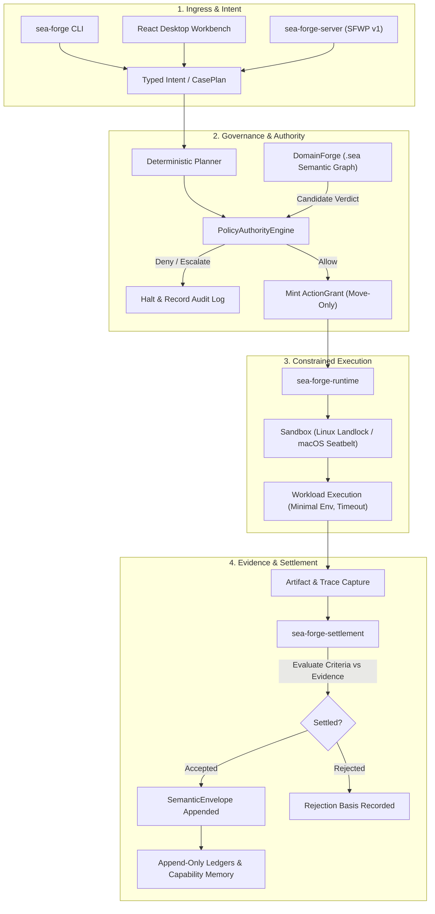

# SEA Forge Documentation Home

> **Governed capability-execution kernel organized around cases.**  
> Pre-execution authority · Sandboxed isolation · Cryptographic evidence · Independent settlement

---

## 1. What This Project Is

**SEA Forge** is a local, governed execution engine for commands, workflows, and autonomous agents.

Unlike traditional orchestration engines or task runners that execute commands and evaluate success purely by whether a process returns exit code zero (`exit 0`), SEA Forge treats every side effect as a governed operation:

1. **Authorize before action:** No process may be spawned and no file may be created until a deterministic policy engine evaluates identity, context, and policy rules, minting an explicit, move-only grant.
2. **Isolate during execution:** Work runs inside operating system jails (Linux Landlock or macOS Seatbelt) with strict workspace boundaries, blocked network by default, minimal environment variables (`PATH`, `HOME`), and enforced timeouts.
3. **Capture immutable evidence:** All actions, file writes, stdout/stderr captures, and state transitions are appended to tamper-evident, hash-chained ledgers and JSON Lines (`.jsonl`) logs.
4. **Settle from evidence, not exit code:** Process termination is merely evidence. Outcome acceptance requires fulfilling pre-declared criteria (such as required file artifacts with content SHA-256 hashes, stdout pattern matches, and domain evaluator scores).
5. **Metabolize into capability:** Accepted outcomes append to semantic capability memory, enabling future intent to discover and reuse proven execution patterns.

---

## 2. What Problem It Solves

Modern AI coding agents and automated workflows suffer from the **"False Success" crisis** and **ambient privilege leakage**:

* **False Success:** An agent or script runs a command, exits 0, and reports success even though it hallucinated an output file, wrote to the wrong location, or silently failed an internal assertion.
* **Ambient Privilege:** Child processes inherit parent environment variables, unredacted API keys, open network sockets, and unrestricted filesystem access, risking data exfiltration or unintended mutations.
* **Rewritten History:** Orchestrators frequently overwrite mutable database rows or drop log streams, making post-incident auditing and non-repudiation impossible.
* **Untyped Intent:** Systems interpolate arbitrary user text into shell commands (`sh -c "$USER_INPUT"`), creating catastrophic injection vulnerabilities.

SEA Forge solves these by enforcing a **fail-closed, single-authority fabric** across all interfaces (CLI, server, desktop Workbench, AI agents). Intent is always typed data; permissions are verified before side effects; and settlement is an independent, evidenced claim check.

---

## 3. The System in One Picture



---

## 4. The 8 Concepts You Need First

To navigate this codebase confidently, understand these eight core concepts:

1. **Cell (`SeaCell`)**: The self-contained unit of deployment. A single root directory (`SEA_FORGE_ROOT`) that owns one socket (`server.sock`), one socket lock, cases, ledgers, and capability records. See [Cell Contract](file:///c:/Users/sprim/projects/sea-rs/docs/CELL_CONTRACT.md).
2. **Intent**: The raw, unverified statement of desired action (`intent_id`, `summary`, `actor_id`). Raw intent is never executed; it is deterministic input to the planner.
3. **Case & Plan (`CasePlan`)**: A CMMN-subset workflow orchestrating multiple `PlanItem`s across stages, milestones, and tasks using event-driven `Sentry` triggers.
4. **Episode / Run**: A single, concrete execution instance (`run_<timestamp>_<hex>`). Every sandboxed execution is an episode that generates a complete suite of governance records.
5. **ActionGrant**: A non-cloneable, non-serializable move-only Rust struct minted by the authority engine upon an `Allow` decision. It is consumed by `sea-forge-runtime::execute()`. No process can spawn without holding this grant.
6. **Settlement (`SettlementEvent`)**: The independent evaluation of run evidence against pre-committed `SettlementCriteria`. Acceptance produces a non-empty, machine-readable `basis` (e.g. `["authority_allow", "exit_zero", "required_artifact_present:model.sea"]`).
7. **Integrity Ledger (`LedgerStream`)**: An append-only binary/JSONL journal indexed by ULID, secured by hash chains, Merkle Mountain Ranges (MMR), and optional multi-witness cryptographic signatures.
8. **SFWP (SEA Forge Wire Protocol)**: The versioned (v1) NDJSON protocol over a Unix domain socket connecting the Tauri desktop host to `sea-forge-server`.

---

## 5. A Representative Journey

Here is what happens when an operator runs a governed workload:

```text
1. Operator types: sea-forge run --intent "generate demo model"
2. sea-forge-domain interprets "generate demo model" as IntentPattern::Demo.
3. sea-forge-planner deterministically creates a CasePlan with PlanItem "generate_and_validate_sea_model".
   Settlement criteria require: exit code 0, file "model.sea" present, and stdout containing "sea-forge: model valid".
4. sea-forge-authority evaluates the operations against active policy rules:
   - Operation 1: WriteFile "model.sea" -> Verdict: Allow.
   - Operation 2: ExecuteCommand "sea-forge validate model.sea" -> Verdict: Allow.
5. An AuthorityRequest and AuthorityDecision are committed to the integrity ledger.
6. Because all verdicts are Allow, ActionGrants are minted. Run scratch workspace/ and artifacts/ directories are created.
7. Operation 1 materializes the file into workspace/model.sea.
8. Operation 2 spawns the validator process within the configured SandboxClass (Landlock jail on Linux).
   Parent secrets are omitted; only PATH and HOME are forwarded; timeout is 60s.
9. Child exits 0; stdout is captured to artifacts/stdout.txt; model.sea is captured to artifacts/model.sea.
   Pre-mint identity ifl:hash:<sha256> is computed for all work products.
10. sea-forge-settlement evaluates:
    - Did child exit 0? Yes (basis: exit_zero).
    - Is model.sea present? Yes (basis: required_artifact_present:model.sea).
    - Did stdout match expected string? Yes (basis: stdout_match).
    -> Settlement status: Accepted.
11. SettlementEvent is committed to the ledger; settlement.json and semantic-envelope.json are written.
12. The capability is appended to capabilities.jsonl, and the command exits 0.
```

---

## 6. Where to Go Next

Choose your entry path based on your current need:

| Your Goal | Recommended Starting Point |
|---|---|
| **I want to understand the conceptual model** | [Mental Model](file:///c:/Users/sprim/projects/sea-rs/docs/mental-model.md) |
| **I want to inspect the system architecture** | [Architecture Overview](file:///c:/Users/sprim/projects/sea-rs/docs/architecture.md) |
| **I want to explore a specific subsystem** | [Subsystem Guides Index](file:///c:/Users/sprim/projects/sea-rs/docs/documentation-map.md#3-subsystems-layer-3) |
| **I want to trace execution end-to-end** | [CLI Run Lifecycle Trace](file:///c:/Users/sprim/projects/sea-rs/docs/workflows/cli-run-lifecycle.md) |
| **I want to understand design trade-offs** | [Explanation & Design Rationale](file:///c:/Users/sprim/projects/sea-rs/docs/documentation-map.md#5-explanation--design-rationale-layer-5) |
| **I want to run it myself step-by-step** | [Tutorial: First Governed Run](file:///c:/Users/sprim/projects/sea-rs/docs/tutorials/01-first-governed-run.md) |
| **I want to author policies or configure endpoints** | [How-To Guides](file:///c:/Users/sprim/projects/sea-rs/docs/documentation-map.md#7-how-to-guides-layer-7) |
| **I need exact CLI flags or SFWP wire APIs** | [Technical Reference](file:///c:/Users/sprim/projects/sea-rs/docs/documentation-map.md#8-technical-reference-layer-8) |
| **I need to find where a concept lives in code** | [Source Map](file:///c:/Users/sprim/projects/sea-rs/docs/source-map.md) |
