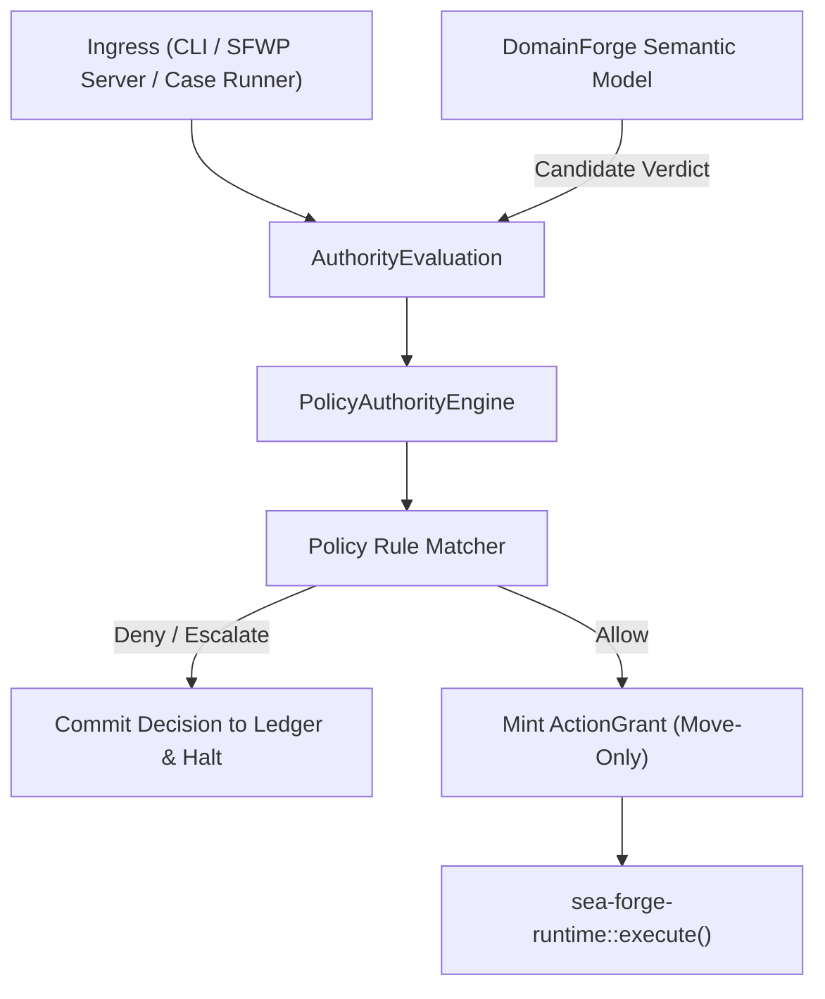

# Subsystem: Authority Fabric & Policy Engine

> **Deterministic pre-execution authorization, unified policy resolution, and move-only ActionGrants.**  
> Governed crate: `sea-forge-authority`

---

## 1. Purpose

The **Authority Fabric** is SEA Forge's central decision engine. It enforces that every side effect (file modification, child process execution, network request, agent delegation) must be authorized against explicit policy rules before execution. It provides a single, unified authority mediator across all ingress points (CLI, SFWP server, desktop Workbench, and external agents), eliminating parallel or secondary permission systems.

---

## 2. Responsibilities

* **Deterministic Decision Making:** Evaluates an `AuthorityAction`, `Actor`, and execution context against an `AuthorityPolicyBundle`, outputting a deterministic `Verdict` (`Allow`, `Deny`, `Escalate`).
* **Candidate Verdict Integration:** Incorporates candidate evaluations from external semantic engines (specifically `sea-forge-domainforge`) into final governance verdicts.
* **Move-Only ActionGrants:** Mints non-cloneable, non-serializable `ActionGrant` tokens upon an `Allow` verdict, binding executable identity, workspace roots, granted network ports, and timeouts.
* **Cryptographic Hash Linking:** Links decisions to exact canonical hashes of the policy bundle, action request, and identity binding.
* **Opaque Constraints & Approvals:** Detects escalation requirements and generates `ApprovalRequest` records when policy demands human review.
* **Boundary & Compensating Controls:** Enforces fine-grained path boundaries, network port allowlists, and required logging controls.

---

## 3. Non-Responsibilities

* **Execution Enforcement:** Does not spawn processes or enforce OS jails (delegated to `sea-forge-runtime` and `sea-forge-sandbox`).
* **Outcome Settlement:** Does not evaluate whether execution results met task goals (delegated to `sea-forge-settlement`).
* **Identity Provider Integration:** Does not authenticate external SSO tokens; operates on resolved `IdentityBinding` structures.

---

## 4. Position in the System



---

## 5. Core Abstractions

### `ActionGrant` (`crates/sea-forge-authority/src/lib.rs:69-87`)
The physical proof that an operation is authorized to execute:
```rust
pub struct ActionGrant {
    action: AuthorityAction,
    run_id: String,
    plan_item_id: String,
    workspace_root: PathBuf,
    artifacts_root: Option<PathBuf>,
    timeout_secs: Option<u64>,
    env_keys: BTreeSet<String>,
    _assurance_ref: Option<String>,
    sandbox_class: String,
    boundaries: BTreeMap<String, Vec<String>>,
    compensating_controls: Vec<String>,
    expires_at: chrono::DateTime<Utc>,
    memory_scope: Option<String>,
    _resolved_executable: Option<PathBuf>,
}
```
**Critical Invariant:** `ActionGrant` intentionally does **not** derive `Clone`, `Copy`, `Serialize`, or `Deserialize`. It can only be consumed once by value by `sea_forge_runtime::execute()`.

### `GovernanceDisposition` & `Verdict`
* `Allow`: Operation is permitted. An `ActionGrant` is minted.
* `Deny`: Operation is forbidden. Execution halts immediately; no workspace is created.
* `Escalate`: Operation requires human approval. An `ApprovalRequest` is created; execution halts until an approver resolves it.
* `Boundary`: Operation permitted only within constrained resource subsets (e.g. specific directory or port list).
* `Degraded`: Operation permitted under emergency fallback rules with mandatory compensating controls.

### `AuthorityEvaluation`
The complete input context submitted to the engine:
* `actor`: Identity of the calling entity.
* `binding`: `IdentityBinding` containing verified principal, roles, and sponsor.
* `action`: Normalized `AuthorityAction` (`WriteFile`, `ExecuteCommand`, `AgentTask`, etc.).
* `workspace_root` & `artifacts_root`: Intended filesystem boundaries.
* `domainforge_candidate`: Optional candidate verdict produced by DomainForge.

---

## 6. Internal Operation

### Rule Matching Precedence
When an action is evaluated, rules in the active policy bundle are evaluated in order:
1. **Explicit Deny Rules:** Any rule matching the action that specifies `disposition: deny` triggers an immediate `Deny`.
2. **Escalation Rules:** Any rule requiring human intervention triggers `Escalate`.
3. **Allow Rules:** A rule matching the actor role, action kind, and path glob triggers `Allow`.
4. **Default Deny:** If no rule matches, the engine fails closed with `Verdict::Deny` and reason code `no_matching_rule`.

### Pre-Spawn Executable Binding
To prevent time-of-check-to-time-of-use (TOCTOU) binary hijacking, `PolicyAuthorityEngine` resolves the canonical path and SHA-256 hash of `argv[0]` during evaluation and embeds it into `ActionGrant`. When `sea-forge-runtime` executes, it re-verifies that the target binary has not been modified or replaced since the decision was made.

---

## 7. State & Ledger Commitments

Every authority evaluation commits two records to the integrity ledger before any execution may begin:
1. `authority_request`: Captures the actor, timestamp, action parameters, and context.
2. `authority_decision`: Captures the verdict, matched rule ID, reason codes, policy bundle hash, action request hash, and identity binding hash.

These records are materialized into `.sea-forge/runs/<run_id>/authority.json` and mirrored in `.sea-forge/authority/decisions.jsonl`.

---

## 8. Failure Modes & Invariants

* **Invariant AUTH-01 (Authority Precedes Side Effects):** If an evaluation returns `Deny` or `Escalate`, execution halts. No child process is created, and the `workspace/` directory remains unmaterialized.
* **Invariant AUTH-02 (Single Authority Fabric):** CLI, server, and Workbench use the exact same `PolicyAuthorityEngine` implementation. There is no client-side bypass or webview permission shortcut.
* **Missing Key Directory:** If policy requires signed pre-action assurance (`required_for_side_effects: true`) but no signing key is configured, the engine fails closed with `ledger_integrity_error`.

---

## 9. Source Trail

* [`crates/sea-forge-authority/src/lib.rs`](file:///c:/Users/sprim/projects/sea-rs/crates/sea-forge-authority/src/lib.rs) — `PolicyAuthorityEngine`, `ActionGrant`, evaluation pipeline, and grant minting.
* [`crates/sea-forge-authority/src/rules.rs`](file:///c:/Users/sprim/projects/sea-rs/crates/sea-forge-authority/src/lib.rs) — Policy rule evaluation and pattern matching.
* [`crates/sea-forge-core/src/types.rs`](file:///c:/Users/sprim/projects/sea-rs/crates/sea-forge-core/src/types.rs#L428-L466) — `AuthorityDecision` and `AuthorityRequest` schema definitions.
* [`tests/conformance_authority.rs`](file:///c:/Users/sprim/projects/sea-rs/crates/sea-forge-server/tests/conformance_approvals.rs) — Authority conformance test suite.
