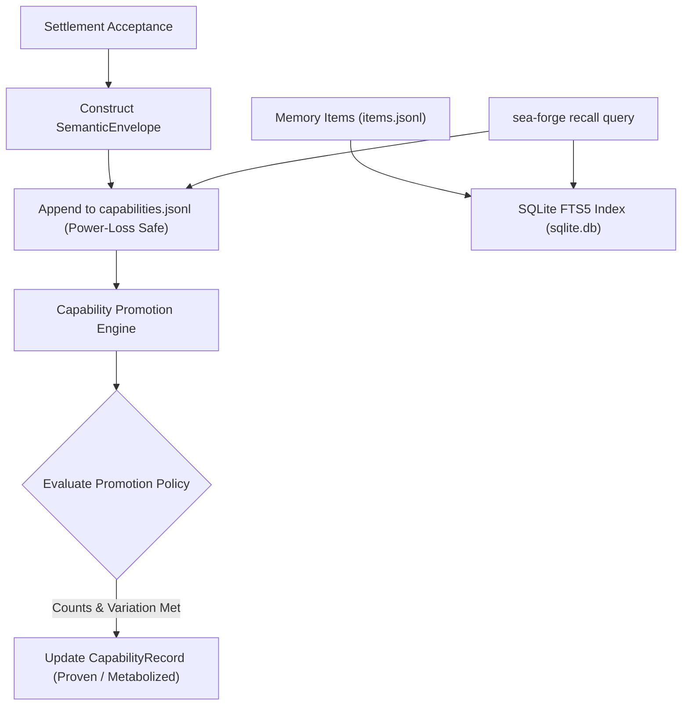

# Subsystem: Capability & Semantic Memory

> **Semantic capability envelopes, SQLite full-text search, and multi-stage capability promotion.**  
> Governed crate: `sea-forge-capability`

---

## 1. Purpose

The **Capability & Semantic Memory** subsystem metabolizes verified execution outcomes into durable, searchable institutional knowledge. It ensures that when a workload settles successfully, its parameters, evidence references, and artifacts are sealed into a `SemanticEnvelope`. It powers capability recall across runs and implements a rigorous, evidence-weighted promotion pipeline from single demonstrations to proven, metabolized capabilities.

---

## 2. Responsibilities

* **Envelope Serialization & Durability:** Appends `SemanticEnvelope` records to `.sea-forge/capabilities.jsonl` using power-loss-safe `sync_data()` flushes.
* **Resilient Capability Recall (`recall()`):** Scans capability records using byte-oriented streams to prevent a single malformed or non-UTF-8 line from corrupting an entire recall query.
* **SQLite Full-Text Search (FTS5):** Maintains `.sea-forge/memory/sqlite.db` as a derived full-text search index over discrete `MemoryItem`s (`Fact`, `Decision`, `Outcome`, `Preference`).
* **Capability Promotion Lifecycle:** Evaluates settlement declarations against `CapabilityPromotionPolicy` rules to advance capabilities across maturity tiers (`Attempted` → `Demonstrated` → `Proven` → `Metabolized`).
* **Deterministic Projection Rebuilding:** Reconstructs SQLite indexes and capability summaries directly from append-only source records via `sea-forge recall --rebuild`.

---

## 3. Non-Responsibilities

* **Settlement Evaluation:** Does not determine whether an outcome is accepted (owned by `sea-forge-settlement`).
* **Cryptographic Signatures:** Does not sign ledgers (owned by `sea-forge-ledger`).

---

## 4. Position in the System



---

## 5. Core Abstractions

### `SemanticEnvelope` (`sea-forge-core::types::SemanticEnvelope`)
The comprehensive summary of a completed run:
```rust
pub struct SemanticEnvelope {
    pub version: String,
    pub run_id: String,
    pub case_ref: String,
    pub intent: Intent,
    pub plan_ref: String,
    pub template_ref: Option<String>,
    pub authority_decisions: Vec<String>,
    pub evidence_refs: Vec<String>,
    pub settlement_ref: String,
    pub capability_delta: CapabilityDelta,
    pub attribution: Attribution,
    pub artifact_refs: Vec<ArtifactRef>,
    pub extension_refs: Vec<String>,
    pub projection_refs: Vec<ProjectionRef>,
    pub cell_id: Option<String>,
}
```

### `CapabilityStatus` & Promotion Tiers
* `Attempted`: Initiated but lacks sufficient settlement declarations.
* `Demonstrated`: Succeeded once with verified evidence in a specific context.
* `Proven`: Repeatedly accepted across declared variation dimensions with minimum reliability weight.
* `Metabolized`: Consistently proven with reduced orchestration burden and proven recovery across required disruptions.

### `MemoryItem` (`sea-forge-core::types::MemoryItem`)
Discrete units of knowledge indexed for semantic search:
* `kind`: `Fact`, `Decision`, `Outcome`, or `Preference`.
* `statement`: Clear, human-readable natural language statement.
* `provenance`: Links to exact `run_ids` and `evidence_refs`.
* `dedup_key`: Hash key preventing duplicate insertions during re-indexing.

---

## 6. Internal Operation

### Safe Byte-Oriented Recall Scan
`capability::recall()` avoids unbounded line buffering:
1. Opens `capabilities.jsonl`.
2. Reads bytes until `\n` into a reusable buffer.
3. Attempts JSON parsing. If a line is corrupted (e.g. from an unclean shutdown), it increments a `malformed` counter and continues to the next line rather than aborting the scan (F-25.r).
4. Matches query filters: actor entity, process ID, settlement status, and query text.

### Capability Promotion Logic
To achieve `Proven` status under `CapabilityPromotionPolicy`:
* Must satisfy minimum declaration count (`min_declarations`).
* Total evidence weight must meet `min_total_weight`.
* Regression weight must not exceed `max_regression_weight`.
* Must span required variation dimensions (e.g., testing multiple platforms or inputs).
* Must demonstrate recovery across required disruptions.

---

## 7. State & Persistence

* `.sea-forge/capabilities.jsonl`: The append-only journal of all completed semantic envelopes.
* `.sea-forge/memory/items.jsonl`: Append-only journal of discrete memory statements.
* `.sea-forge/memory/sqlite.db`: Rebuildable SQLite FTS5 database indexing `items.jsonl`.
* `.sea-forge/capabilities/<name>.json`: Materialized summary of a capability's current status.

---

## 8. Failure Modes & Invariants

* **Invariant DATA-01 (Projections Are Not Truth):** The SQLite database (`sqlite.db`) is strictly a disposable cache. If deleted or corrupted, executing `sea-forge recall --rebuild` reads `items.jsonl` and regenerates the database without data loss.
* **Corrupted Lines in Capabilities Journal:** Single non-UTF-8 or truncated lines are safely skipped during recall scans and logged as malformed lines in the query result.

---

## 9. Source Trail

* [`crates/sea-forge-capability/src/lib.rs`](file:///c:/Users/sprim/projects/sea-rs/crates/sea-forge-capability/src/lib.rs) — `append()`, `recall()`, and extension descriptor validation.
* [`crates/sea-forge-capability/src/promotion.rs`](file:///c:/Users/sprim/projects/sea-rs/crates/sea-forge-capability/src/promotion.rs) — Capability promotion rules and `rebuild_capability()`.
* [`crates/sea-forge-capability/src/memory.rs`](file:///c:/Users/sprim/projects/sea-rs/crates/sea-forge-capability/src/memory.rs) — SQLite FTS5 semantic memory indexing and search.
* [`crates/sea-forge-core/src/types.rs`](file:///c:/Users/sprim/projects/sea-rs/crates/sea-forge-core/src/types.rs#L1012-L1174) — Schemas for capabilities, envelopes, and memory items.
