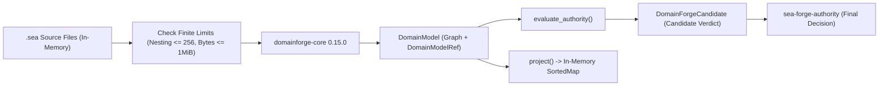

# Subsystem: DomainForge Semantic Boundary

> **First-party integration with `domainforge-core`, side-effect-free `.sea` parsing, and candidate authority evaluation.**  
> Governed crate: `sea-forge-domainforge` · Governing ADR: `ADR-001`

---

## 1. Purpose

The **DomainForge Semantic Boundary** integrates SEA Forge with the canonical Domain Specific Language for Software Engineering Automation (`.sea`). Governed by **ADR-001**, it establishes a strict separation of concerns: **DomainForge owns semantic meaning** (grammar, AST parsing, semantic graphs, concept identity, and in-memory projections), while **SEA Forge owns governed execution and final authority**.

---

## 2. Responsibilities

* **Side-Effect-Free `.sea` Parsing:** Loads and validates `.sea` source files using `domainforge-core 0.15.0` without invoking external binaries or accessing the filesystem directly.
* **Finite Resource Protection:** Enforces strict limits on source count, aggregate byte size, import depth, AST node counts, and expression nesting depth before parsing, preventing denial-of-service (DoS) or stack overflow attacks.
* **Candidate Authority Evaluation:** Evaluates candidate policy verdicts from the semantic model, translating DomainForge traces into candidate governance records for `sea-forge-authority`.
* **In-Memory Projections:** Generates in-memory representations of external projections (such as CALM architecture models or RDF ontologies) through pure library APIs.
* **Hash-Pinned Model Tracking (`DomainModelRef`):** Records cryptographic hashes of all parsed sources, concept references, and validation diagnostics.

---

## 3. Non-Responsibilities

* **Final Authority Decisions:** DomainForge results are strictly candidate evaluations; final allow/deny/escalate decisions belong exclusively to `sea-forge-authority`.
* **Direct Filesystem Writes:** The adapter never writes projected files to disk; returned byte buffers are materialized exclusively through SEA Forge's governed runtime pipeline.
* **CLI Invocation:** Does not shell out to the `domainforge` CLI binary.

---

## 4. Position in the System



---

## 5. Core Abstractions

### Finite Resource Limits (`crates/sea-forge-domainforge/src/lib.rs:89-98`)
To shield the kernel from maliciously crafted or infinite `.sea` inputs, the adapter enforces five finite limits:
* `MAX_SOURCE_COUNT = 64`: Maximum number of source files in a single source set.
* `MAX_AGGREGATE_BYTES = 1_048_576` (1 MiB): Maximum aggregate size of all `.sea` files.
* `MAX_IMPORT_DEPTH = 16`: Maximum transitive import depth.
* `MAX_AST_NODES = 10_000`: Maximum parsed abstract syntax tree nodes.
* `MAX_NESTING_DEPTH = 256`: Maximum bracket or unary operator nesting depth, preventing the external Pest parser from overflowing the call stack (SUP-01).

### `DomainModelRef` (`sea-forge-domainforge::DomainModelRef`)
The immutable certificate identifying a validated semantic model:
```rust
pub struct DomainModelRef {
    pub source_refs: Vec<SourceRef>,
    pub domainforge_version: String,
    pub adapter_descriptor_sha256: String,
    pub parse_options_sha256: String,
    pub semantic_model_sha256: String,
    pub concept_refs: Vec<String>,
    pub class_refs: Vec<String>,
    pub validation_evidence_refs: Vec<String>,
}
```

### `DomainForgeCandidate`
The candidate evaluation passed into `PolicyAuthorityEngine`:
* `raw_decision`: Original DomainForge decision string.
* `normalized_disposition`: `CandidateDisposition::Allow | Deny | Escalate`.
* `reason`: Explanatory text.
* `evidence_refs`: Trace references from the semantic validator.

---

## 6. Internal Operation

### Safe Parsing Pipeline
1. `SeaSourceSet` is validated against finite bounds (`MAX_AGGREGATE_BYTES`, `MAX_SOURCE_COUNT`).
2. Source text is scanned for bracket/expression nesting depth. If nesting exceeds 256, it fails closed with `ForgeError::Input` before reaching the Pest parser.
3. `domainforge_core::parser::parse_source()` constructs the raw AST.
4. `domainforge_core::application::resolve_semantic_envelope()` validates module imports and circular dependency constraints.
5. `resolve_application_graph()` constructs the typed semantic graph.
6. The resulting `DomainModel` is wrapped with a canonical `DomainModelRef` containing the aggregate `semantic_model_sha256`.

---

## 7. Failure Modes & Invariants

* **Invariant DOM-03 (Semantic Anchoring):** When a case plan specifies a domain model reference, execution cannot proceed if the on-disk `.sea` files have drifted from the pinned `semantic_model_sha256`.
* **Pest Stack Overflow Defense:** Inputs with 300+ nested brackets are rejected before parser entry, preventing segmentation faults.
* **Pure Memory Boundary:** Any attempt by the adapter to open a file or write to disk is forbidden by design and denied by compilation structure.

---

## 8. Source Trail

* [`crates/sea-forge-domainforge/src/lib.rs`](file:///c:/Users/sprim/projects/sea-rs/crates/sea-forge-domainforge/src/lib.rs) — `load_validate()`, `evaluate()`, `project()`, and finite limits.
* [`docs/decisions/ADR-001-domainforge-semantic-boundary.md`](file:///c:/Users/sprim/projects/sea-rs/docs/decisions/ADR-001-domainforge-semantic-boundary.md) — Architectural decision record defining the boundary.
* [`crates/sea-forge-authority/src/lib.rs`](file:///c:/Users/sprim/projects/sea-rs/crates/sea-forge-authority/src/lib.rs) — Integration of `DomainForgeCandidate` into final policy decisions.
