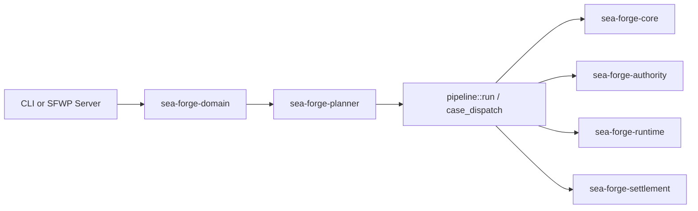

# Subsystem: Kernel & Synchronous Pipeline

> **The foundational domain models, typed identifier grammar, canonical JSON hashing, path safety, and synchronous execution pipeline.**  
> Governed crates: `sea-forge-core`, `sea-forge-domain`, `sea-forge-planner`

---

## 1. Purpose

The Kernel & Synchronous Pipeline provides the foundational domain types, deterministic planning, and execution coordination for SEA Forge. It ensures that intent is translated into strongly typed operations, that identifier grammar and path normalization are strictly enforced, and that the 19 core kernel crates remain completely free of asynchronous runtimes.

---

## 2. Responsibilities

* **Domain & Intent Interpretation (`sea-forge-domain`):** Parses raw operator input strings into recognized `IntentPattern` variants (`Demo`, `GeneratedZone`, `FalseSuccess`, `Nonzero`, `Timeout`).
* **Deterministic Planning (`sea-forge-planner`):** Translates an `Intent` into an immutable `CasePlan` with concrete `PlanItem`s and `SettlementCriteria`.
* **Identifier Grammar (`sea-forge-core::ids`):** Enforces regex and length constraints across all typed entities (`run_<ts>_<hex>`, `case_<ts>_<hex>`, `cell_<hex>`, `bundle_<hex>`, `smsnap_<ts>_<hex>`).
* **Canonical JSON Profile (`sea-forge-core::canonical`):** Implements the `jcs-nfc-v1` canonical JSON profile (lexicographically sorted UTF-8 keys, NFC-normalized string values) to guarantee byte-stable hashes across platforms.
* **Workspace-Relative Path Safety (`sea-forge-core::path`):** Validates that all file paths are lexical, relative, free of `..` or root components, and contain only allowed ASCII characters (`[A-Za-z0-9._/-@]`).
* **Approvals Journal (`sea-forge-core::approvals`):** Manages `<root>/approvals.jsonl` with an immutable latest-line-wins per `(case_id, approval_id)` fold rule.

---

## 3. Non-Responsibilities

* **Policy Decisions:** Does not decide whether an operation is allowed (owned by `sea-forge-authority`).
* **Process Sandboxing:** Does not spawn child processes or configure Landlock rules (owned by `sea-forge-sandbox` and `sea-forge-runtime`).
* **Outcome Settlement:** Does not evaluate whether execution results satisfy criteria (owned by `sea-forge-settlement`).
* **Network or Async I/O:** The kernel is strictly synchronous; all async or socket logic belongs in `sea-forge-server`.

---

## 4. Position in the System



---

## 5. Core Abstractions

### `ForgeError` (`sea-forge-core::errors`)
A typed enum covering all failure classes in SEA Forge:
* `Input(String)`: Unrecognized input or malformed intent.
* `UnknownIntent(String)`: Fails closed when intent does not map to a recognized pattern (exit code 2).
* `Config { class, path, message }`: Missing or invalid configuration.
* `UnsafePath(String)`: Path traversal attempts or invalid characters.
* `Io { context, source }`: Filesystem read/write errors.
* `Serialization(String)`: JSON parsing/encoding failures.
* `Plan { class, message }`: Inconsistent plan items or cyclic dependencies.
* `SelfModel(String)`: Genesis self-model validation or drift failure.
* `Run { run_id, source }`: Nested error bound to a specific execution run.

### `CasePlan` & `PlanItem` (`sea-forge-core::types`)
The declarative structure of work:
```rust
pub struct CasePlan {
    pub version: String,
    pub plan_id: String,
    pub case_id: String,
    pub run_id: String,
    pub intent_id: String,
    pub items: Vec<PlanItem>,
    pub template_ref: Option<String>,
    pub job_contract_ref: Option<String>,
}

pub struct PlanItem {
    pub plan_item_id: String,
    pub name: String,
    pub operations: Vec<Operation>,
    pub entry_criteria: Vec<Sentry>,
    pub entry_criteria_mode: EntryCriteriaMode,
    pub exit_criteria: Vec<Sentry>,
    pub settlement_criteria: SettlementCriteria,
    pub item_kind: ItemKind,
    pub sandbox_class: Option<String>,
    pub markers: ItemMarkers,
    pub max_instances: u32,
    pub depends_on: Vec<String>,
    pub environment: Option<String>,
    pub proposed_by: Option<String>,
}
```

### `Operation` (`sea-forge-core::types`)
The typed unit of execution:
* `WriteFile { path, content_hint }`
* `ExecuteCommand { argv, cwd }`
* `AgentProbe { endpoint_ref, model, prompt_sha256 }`
* `AgentTask { endpoint_ref, instruction, max_turns, token_budget, ... }`

---

## 6. Internal Operation: The `jcs-nfc-v1` Profile

To guarantee that hash chains and signatures remain identical across operating systems, `sea-forge-core::canonical` enforces profile `jcs-nfc-v1`:

1. **Object Keys:** Sorted lexicographically by raw UTF-8 bytes. Object keys are **not** NFC-normalized (a conservative asymmetry preventing key collision).
2. **String Values:** Deeply traversed at all levels and normalized to Unicode Normalization Form C (NFC).
3. **Arrays:** Preserve declared element order.
4. **Numbers:** Serialized using standard JSON representation without ECMAScript float rounding discrepancies.

```rust
// Verified test vector: A + combining diaeresis composes to U+00C4 at all depths
let value = json!({
    "b": 2,
    "a": format!("A{}ngstrom", '\u{0308}'),
    "z": {"m": format!("A{}", '\u{0308}')}
});
// Canonical output: {"a":"\u00c4ngstrom","b":2,"z":{"m":"\u00c4"}}
```

---

## 7. State & Persistence

The kernel directly formats the root governance directories:
* `.sea-forge/cases/<case_id>.json`: The top-level case record.
* `.sea-forge/runs/<run_id>/plan.json`: The exact case plan committed for the run.
* `.sea-forge/approvals.jsonl`: The append-only human approval journal.

---

## 8. Failure Modes & Invariants

* **Unknown Intent:** If `sea_forge_domain::interpret()` cannot match the intent string, it returns `ForgeError::UnknownIntent`. The CLI halts immediately and exits with code 2 without creating a run directory.
* **Unsafe Paths:** If any operation specifies a path containing `..`, leading `/`, or characters outside `[A-Za-z0-9._/-@]`, `validate_relative_path` rejects it immediately with `ForgeError::UnsafePath`.
* **Torn Approval Writes:** `approvals::append` writes the serialized record plus newline in a single atomic `write_all` on an `O_APPEND` file handle, preventing concurrent readers from parsing corrupted partial lines.

---

## 9. Source Trail

* [`crates/sea-forge-core/src/types.rs`](file:///c:/Users/sprim/projects/sea-rs/crates/sea-forge-core/src/types.rs) — Persisted domain records and operation enums.
* [`crates/sea-forge-core/src/ids.rs`](file:///c:/Users/sprim/projects/sea-rs/crates/sea-forge-core/src/ids.rs) — Typed identifier generators and validators.
* [`crates/sea-forge-core/src/canonical.rs`](file:///c:/Users/sprim/projects/sea-rs/crates/sea-forge-core/src/canonical.rs) — `jcs-nfc-v1` canonical JSON implementation.
* [`crates/sea-forge-core/src/path.rs`](file:///c:/Users/sprim/projects/sea-rs/crates/sea-forge-core/src/path.rs) — Workspace-relative path validation.
* [`crates/sea-forge-core/src/approvals.rs`](file:///c:/Users/sprim/projects/sea-rs/crates/sea-forge-core/src/approvals.rs) — Approvals journal fold and expiry checks.
* [`crates/sea-forge-domain/src/lib.rs`](file:///c:/Users/sprim/projects/sea-rs/crates/sea-forge-domain/src/lib.rs) — Intent pattern interpreter.
* [`crates/sea-forge-planner/src/lib.rs`](file:///c:/Users/sprim/projects/sea-rs/crates/sea-forge-planner/src/lib.rs) — Deterministic planning engine.
* [`crates/sea-forge-planner/src/case_engine.rs`](file:///c:/Users/sprim/projects/sea-rs/crates/sea-forge-planner/src/case_engine.rs) — CMMN sentry evaluation logic.
