# Subsystem: Sandboxing & Runtime Execution

> **OS-level jail isolation, NetworkPosture enforcement, and argv execution consuming ActionGrants.**  
> Governed crates: `sea-forge-sandbox`, `sea-forge-runtime`

---

## 1. Purpose

The **Sandboxing & Runtime Execution** subsystem is the physical execution boundary of SEA Forge. It ensures that once work is authorized by the authority engine, it executes within strictly constrained, isolated environments. It guarantees that child processes cannot traverse the host filesystem, cannot inherit ambient parent secrets, cannot open unauthorized network connections, and cannot exceed declared execution timeouts.

---

## 2. Responsibilities

* **Sandbox Selection & Materialization (`sea-forge-sandbox`):** Selects and configures the appropriate isolation backend based on `SandboxClass` (`Local`, `Jail`, `Microvm`).
* **Linux Landlock Jails (`JailSandbox`):** Applies Linux Landlock (ABI v1–v6) security rulesets via `landlock_create_ruleset` and `prctl(PR_SET_NO_NEW_PRIVS)`, restricting filesystem access strictly to the run workspace and artifacts directories.
* **Network Posture Enforcement:** Enforces TCP bind and connect restrictions via Landlock network access flags (`NetworkPosture::Denied` by default, or explicit `AllowTcpPorts`).
* **macOS Seatbelt Isolation:** Generates dynamic Scheme profiles for macOS `sandbox-exec` restricting read/write access to approved directory trees.
* **Argv Child Execution (`sea-forge-runtime`):** Spawns child processes using explicit `argv` vectors—never interpolating commands into shell interpreters (`sh -c`).
* **Pre-Spawn Executable Hash Verification:** Validates that `argv[0]` on disk matches the exact cryptographic hash certified by the `ActionGrant`.
* **Environment Sanitization & Timeouts:** Strips ambient parent environment variables (forwarding only declared keys such as `PATH` and `HOME`) and kills hanging children upon wall-clock timeout expiry.

---

## 3. Non-Responsibilities

* **Policy Decisions:** Does not determine whether a command or file write is permitted (owned by `sea-forge-authority`).
* **Outcome Settlement:** Does not evaluate whether execution was successful based on stdout or created files (owned by `sea-forge-settlement`).

---

## 4. Position in the System

```mermaid
flowchart LR
    AUTH["sea-forge-authority"] -->|Mints move-only ActionGrant| RUNTIME["sea-forge-runtime::execute()"]
    RUNTIME --> VERIFY["Verify Executable SHA-256 vs Grant"]
    VERIFY --> SELECT["select_sandbox(grant.sandbox_class())"]
    SELECT --> JAIL["JailSandbox (Landlock / Seatbelt)"]
    JAIL --> SPAWN["Spawn Child Process (Argv, Minimal Env, Timeout)"]
    SPAWN --> RESULT["ExecutionResult (Status, Exit Code, Stdout/Stderr)"]
    RESULT --> SETTLE["sea-forge-settlement"]
```



---

## 5. Core Abstractions

### `SandboxClass` (`sea-forge-sandbox::SandboxClass`)
```rust
pub enum SandboxClass {
    Local,   // Process-level isolation; trusted-argv0 only
    Jail,    // OS jail: Linux Landlock ABI v1–v6 or macOS Seatbelt
    Microvm, // Virtual machine boundary (reserved seam)
}
```

### `NetworkPosture` (`sea-forge-sandbox::NetworkPosture`)
Governs network capabilities for a sandboxed child:
```rust
pub enum NetworkPosture {
    Denied,                     // Fail-closed default: zero outbound TCP connect, zero TCP listen
    AllowTcpPorts(Vec<u16>),   // Explicit grant: only listed TCP ports may be bound or connected
}
```
*Note on Network Scope:* Landlock enforcement is TCP-only (`LANDLOCK_ACCESS_NET_BIND_TCP`, `CONNECT_TCP`). UDP and raw sockets are fail-closed by Landlock limitations and documented as out of scope in ADR-002.

### `ExecutionStatus` (`sea-forge-core::types::ExecutionStatus`)
* `Completed`: Child executed and terminated normally (exit code captured).
* `SpawnFailed`: Process could not be launched (missing executable, permission error).
* `TimedOut`: Execution exceeded `timeout_secs`; process was terminated.
* `SandboxViolation`: Explicit kernel sandbox violation observed.
* `SuspectedSandboxViolation`: Jail violation inferred from child stderr heuristic (F-20).

---

## 6. Internal Operation: The Linux Landlock Jail

On Linux hosts with kernel 5.13+, `JailSandbox` uses the unprivileged Linux Landlock LSM:

1. **Pre-Exec Configuration:**
   * Ruleset created via `landlock_create_ruleset`.
   * Filesystem read access granted to system libraries (`/usr`, `/lib`, `/bin`) and the run `workspace/`.
   * Filesystem write access granted **exclusively** to `workspace/` and `artifacts/`.
   * If `NetworkPosture::Denied`, all TCP bind and connect access is omitted from the ruleset.
2. **Privilege Dropping:**
   * Invokes `prctl(PR_SET_NO_NEW_PRIVS, 1)` to prevent child processes from acquiring new credentials via setuid binaries.
3. **Ruleset Enforcement:**
   * Invokes `landlock_restrict_self` before calling `execve`.
   * Any attempt by the child to open files outside `workspace/` or initiate unauthorized TCP connections returns `EACCES` or `EPERM`.

---

## 7. The Runtime Execution Seam

`sea_forge_runtime::execute()` requires taking ownership of an `ActionGrant`:

```rust
pub fn execute(
    grant: sea_forge_authority::ActionGrant,
    request: &ExecutionRequest,
    run_id: &str,
    workspace: &Path,
    artifacts: &Path,
) -> Result<ExecutionResult, ForgeError>
```

1. **Grant Re-Check:** Calls `grant.authorize_execution()`, ensuring that the plan item ID, workspace root, artifacts root, and timeout match the grant exactly.
2. **TOCTOU Executable Validation:** Re-resolves `argv[0]` via `fs::canonicalize` and confirms it matches the binary path verified at decision time.
3. **Environment Scrubbing:** Strips all ambient environment variables. Passes only explicitly granted variables (`PATH`, `HOME`).
4. **Child Spawning & Output Capture:** Spawns child redirecting stdout to `artifacts/stdout.txt` and stderr to `artifacts/stderr.txt`.
5. **Enforced Timeout:** Monitors child using `wait-timeout`. If `timeout_secs` expires, sends `SIGKILL` and returns `ExecutionStatus::TimedOut`.
6. **Sandbox Teardown:** Invokes `sandbox.destroy(handle)`, ensuring temporary mounts or ephemeral jail structures are cleaned up.

---

## 8. Failure Modes & Invariants

* **Invariant AUTH-03 (Exact Grant Binding):** If an `ActionGrant` was minted for `run_001` or `item_01`, passing it to execute `run_002` causes `grant.authorize_execution()` to return an immediate error.
* **Invariant AUTH-05 (Least Secret Exposure):** Parent process credentials (such as GitHub tokens or SOPS keys) are stripped from the environment before spawning. Children never inherit ambient development secrets.
* **Executable Replacement (TOCTOU):** If an executable binary is modified or replaced on disk between the authority decision and runtime execution, execution aborts before spawn with `"authority grant executable identity changed since the decision"`.

---

## 9. Source Trail

* [`crates/sea-forge-sandbox/src/lib.rs`](file:///c:/Users/sprim/projects/sea-rs/crates/sea-forge-sandbox/src/lib.rs) — `SandboxClass`, `NetworkPosture`, and `ExecutionSandbox` trait.
* [`crates/sea-forge-sandbox/src/jail.rs`](file:///c:/Users/sprim/projects/sea-rs/crates/sea-forge-sandbox/src/jail.rs) — Linux Landlock ABI ruleset integration and macOS Seatbelt profiles.
* [`crates/sea-forge-sandbox/src/local.rs`](file:///c:/Users/sprim/projects/sea-rs/crates/sea-forge-sandbox/src/local.rs) — Process-level sandbox implementation.
* [`crates/sea-forge-runtime/src/lib.rs`](file:///c:/Users/sprim/projects/sea-rs/crates/sea-forge-runtime/src/lib.rs) — `execute()`, grant consumption, TOCTOU check, and timeout enforcement.
* [`tests/conformance_sandbox.rs`](file:///c:/Users/sprim/projects/sea-rs/crates/sea-forge-server/tests/conformance_sfwp.rs) — Sandbox boundary and escape rejection tests.
