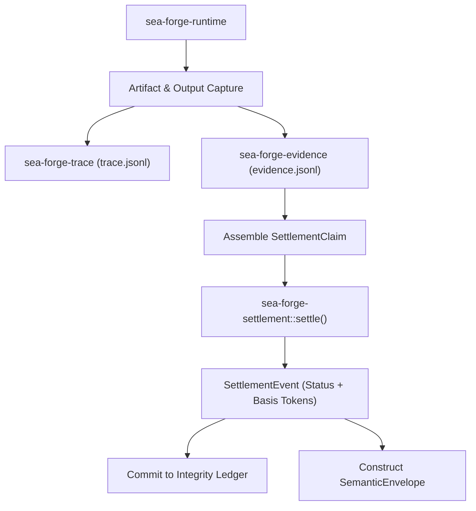

# Subsystem: Settlement, Evidence & Artifact Hashing

> **Independent outcome qualification, machine-readable basis proofs, and cryptographic artifact identity.**  
> Governed crates: `sea-forge-settlement`, `sea-forge-evidence`, `sea-forge-trace`

---

## 1. Purpose

The **Settlement, Evidence & Artifact Hashing** subsystem evaluates whether execution outcomes actually satisfy declared goals. It enforces the foundational invariant **DOM-01**: process exit status (`exit 0`) is merely one piece of evidence, not acceptance. Settlement provides an independent, objective evaluation of all work products, stdout streams, and evaluator metrics, emitting an immutable `SettlementEvent` with an explicit, machine-readable `basis`.

---

## 2. Responsibilities

* **Independent Outcome Evaluation (`sea-forge-settlement::settle`):** Evaluates a `SettlementClaim` against declared criteria without rereading execution policies or trusting process exit codes alone.
* **Settlement Basis Formulation:** Formulates explicit, auditable string tokens (e.g., `authority_allow`, `exit_zero`, `required_artifact_present:model.sea`, `stdout_match`) that justify acceptance or rejection.
* **Batch Evaluation:** Evaluates multi-record JSONL datasets against per-record evaluators and minimum pass ratios (`min_pass_ratio`).
* **Artifact Hashing & Pre-Mint Identity (`sea-forge-evidence`):** Computes SHA-256 digests of all output files and mints canonical pre-mint identities (`ifl:hash:<sha256>`).
* **Lifecycle Event Tracing (`sea-forge-trace`):** Appends discrete lifecycle state transitions to `.sea-forge/runs/<run_id>/trace.jsonl`.
* **SWE_SEED Declarations:** Reconciles external work contracts and independent verification attestations.

---

## 3. Non-Responsibilities

* **Policy Decisions:** Does not decide whether work should run (owned by `sea-forge-authority`).
* **Process Execution:** Does not run commands or capture stdout directly (owned by `sea-forge-runtime`).
* **Capability Storage:** Does not manage SQLite memory indexes (owned by `sea-forge-capability`).

---

## 4. Position in the System



---

## 5. Core Abstractions

### `SettlementCriteria` (`sea-forge-core::types::SettlementCriteria`)
The declarative acceptance contract:
```rust
pub struct SettlementCriteria {
    pub require_exit_zero: bool,
    pub required_artifacts: Vec<String>,
    pub stdout_must_contain: Option<String>,
    pub agent_output_must_contain: Option<String>,
    pub require_approval: bool,
    pub evaluator: Option<String>,
    pub records: Option<String>,
    pub per_record_evaluator: Option<String>,
    pub min_pass_ratio: Option<f64>,
}
```

### `SettlementEvent` (`sea-forge-core::types::SettlementEvent`)
The immutable settlement record:
```rust
pub struct SettlementEvent {
    pub version: String,
    pub settlement_id: String,
    pub run_id: String,
    pub status: SettlementStatus,     // Accepted, Rejected, Escalated
    pub basis: Vec<String>,           // Non-empty factual foundation
    pub review_required: bool,
    pub settled_at: String,
    pub criteria_ref: Option<String>,
}
```

### `EvidenceRecord` & `ArtifactDescriptor` (`sea-forge-core::types`)
* `EvidenceRecord`: An append-only evidence envelope (`kind: Artifact | AuthorityDecision | ExecutionResult | Recall`).
* `ArtifactDescriptor`: Metadata describing a generated file:
  * `artifact_id`: Unique identifier (`art_<ts>_<hex>`).
  * `content_sha256`: SHA-256 hash of file content.
  * `pre_mint_identity`: Cryptographic pre-mint identity formatted as `ifl:hash:<sha256>`.
  * `producer`: Binds entity, process, run, and plan item.

---

## 6. Internal Operation: The `settle()` Algorithm

The settlement evaluator executes the following deterministic logic:

```rust
// 1. Authority evaluation checks
if claim.authority_verdicts.contains(&Verdict::Escalate) {
    basis.push("authority_escalate");
    return (SettlementStatus::Escalated, review_required: true);
}
if claim.authority_verdicts.contains(&Verdict::Deny) {
    basis.push("authority_deny");
    return (SettlementStatus::Rejected, review_required: false);
}

// 2. Write-only task handling (F-10)
if claim.write_only {
    basis.push("write_only");
    // Verify file presence on disk; never invent exit 0
    let mut accepted = true;
    for path in &claim.criteria.required_artifacts {
        let present = safe_existing(workspace, path).is_ok_and(|c| c.is_file());
        basis.push(format!("required_artifact_{}:{path}", if present { "present" } else { "missing" }));
        accepted &= present;
    }
    return (if accepted { SettlementStatus::Accepted } else { SettlementStatus::Rejected }, false);
}

// 3. Process execution evaluation
match execution.status {
    ExecutionStatus::SpawnFailed => { basis.push("spawn_failed"); Rejected }
    ExecutionStatus::TimedOut => { basis.push("timed_out"); Rejected }
    ExecutionStatus::SandboxViolation => { basis.push("jail_violation"); Rejected }
    ExecutionStatus::SuspectedSandboxViolation => { basis.push("suspected_jail_violation"); Rejected }
    ExecutionStatus::Completed => {
        let mut accepted = true;
        if claim.criteria.require_exit_zero {
            let zero = execution.exit_code == Some(0);
            basis.push(if zero { "exit_zero" } else { "exit_nonzero" });
            accepted &= zero;
        }
        for path in &claim.criteria.required_artifacts {
            let present = safe_existing(workspace, path).is_ok_and(|c| c.is_file());
            basis.push(format!("required_artifact_{}:{path}", if present { "present" } else { "missing" }));
            accepted &= present;
        }
        if let Some(needle) = &claim.criteria.stdout_must_contain {
            let matches = file_contains(stdout_path, needle)?;
            basis.push(if matches { "stdout_match" } else { "stdout_mismatch" });
            accepted &= matches;
        }
        // Evaluators & batch ratio checks...
        (if accepted { SettlementStatus::Accepted } else { SettlementStatus::Rejected }, false)
    }
}
```

---

## 7. State & Persistence

Settlement writes directly to the run record directory:
* `.sea-forge/runs/<run_id>/trace.jsonl`: Appends `SettlementRecorded` event.
* `.sea-forge/runs/<run_id>/evidence.jsonl`: Appends `ExecutionResult` and `Artifact` evidence records.
* `.sea-forge/runs/<run_id>/settlement.json`: The serialized `SettlementEvent`.
* `.sea-forge/ledgers/`: Commits `settlement_event` record into the integrity stream.

---

## 8. Failure Modes & Invariants

* **Invariant DOM-01 (Settlement vs. Exit Code):** A command exiting with code 0 that fails to create a required artifact is settled as `Rejected` with basis `["authority_allow", "exit_zero", "required_artifact_missing:<path>"]`.
* **Invariant DOM-02 (Every Activation Is an Episode):** Case stage tasks cannot bypass settlement. Every activation produces complete trace and evidence records.
* **Missing Basis Proof:** An accepted settlement with an empty `basis` array is illegal and fails conformance proof P1.

---

## 9. Source Trail

* [`crates/sea-forge-settlement/src/lib.rs`](file:///c:/Users/sprim/projects/sea-rs/crates/sea-forge-settlement/src/lib.rs) — Core `settle()` evaluation engine.
* [`crates/sea-forge-settlement/src/declaration.rs`](file:///c:/Users/sprim/projects/sea-rs/crates/sea-forge-settlement/src/declaration.rs) — SWE_SEED declarations and settlement authorities.
* [`crates/sea-forge-evidence/src/lib.rs`](file:///c:/Users/sprim/projects/sea-rs/crates/sea-forge-evidence/src/lib.rs) — `JsonlEvidenceWriter`, file capture, SHA-256 calculation, and pre-mint ID formatting.
* [`crates/sea-forge-trace/src/lib.rs`](file:///c:/Users/sprim/projects/sea-rs/crates/sea-forge-trace/src/lib.rs) — `JsonlTraceRecorder` append-only logger.
* [`crates/sea-forge-core/src/types.rs`](file:///c:/Users/sprim/projects/sea-rs/crates/sea-forge-core/src/types.rs#L610-L635) — `SettlementCriteria` and `SettlementClaim` structures.
