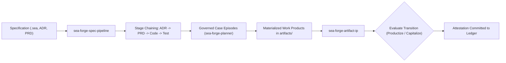

# Subsystem: Spec Pipelines & IP Transitions

> **Deterministic spec-to-code pipelines, generated-zone protection, and artifact-to-IP recognition.**  
> Governed crates: `sea-forge-spec-pipeline`, `sea-forge-artifact-ip`

---

## 1. Purpose

The **Spec Pipelines & IP Transitions** subsystem governs the software engineering transformation lifecycle. It enables specifications (ADRs, PRDs, and `.sea` domain models) to progress deterministically into generated code and verified tests via chained pipeline stages. Furthermore, it oversees the legal and structural lifecycle of digital artifacts, managing transitions from raw cognitive drafts into attested, productized intellectual property (IP).

---

## 2. Responsibilities

* **Deterministic Stage Chaining (`sea-forge-spec-pipeline`):** Chains transformation stages in canonical order (`Adr` → `Prd` → `Code` → `Test`), executing each stage as an ordinary, governed case episode.
* **Cryptographic Pipeline Chain Hashing:** Computes content hashes (`compute_stage_hash`) and cumulative chain hashes (`compute_chain_hash`), ensuring that any modification to an upstream spec invalidates downstream stages.
* **Generated-Zone Protection (Invariant GEN-01):** Enforces that generated code zones (e.g., `src/gen/`) are never hand-edited. Modifications must occur in specification sources and propagate via generator runs.
* **DomainForge Projections:** Projects validated DomainForge models into CALM architecture models and RDF ontologies via pure in-memory adapters.
* **Artifact-to-IP Lifecycle (`sea-forge-artifact-ip`):** Governs artifact maturity transitions:
  $$\text{Cognitive} \longrightarrow \text{Intellectual} \longrightarrow \text{Product} \longrightarrow \text{Capital}$$
* **Transition Gating & Ledger Attestation:** Authorizes transitions (`Synthesize`, `Productize`, `Capitalize`, `Attest`) using move-only `ActionGrant`s and records cryptographic attestations in the integrity ledger.

---

## 3. Non-Responsibilities

* **Direct Sandbox Execution:** Pipeline stages execute through standard `sea-forge-runtime` and `sea-forge-sandbox` facilities.
* **External IP Registration:** Does not interface with external patent or copyright registries; maintains cryptographic cell attestations.

---

## 4. Position in the System



---

## 5. Core Abstractions

### `SpecPipelineStage` (`sea-forge-core::types::SpecPipelineStage`)
```rust
pub struct SpecPipelineStage {
    pub stage_id: String,
    pub kind: StageKind,              // Adr, Prd, Code, Test
    pub inputs: Vec<StageFile>,
    pub outputs: Vec<StageFile>,
    pub command: Option<Vec<String>>,
    pub status: StageStatus,          // Pending, Running, Passed, Failed
    pub stage_hash: String,
}
```

### Artifact Lifecycle Stages (`sea-forge-core::types::ArtifactStage`)
* `Cognitive`: Raw drafts, sketches, and speculative agent transcripts.
* `Intellectual`: Formally structured models, specifications, and algorithms.
* `Product`: Tested, production-ready software artifacts bound to verified cases.
* `Capital`: Fully attested, review-approved intellectual property assets recognized for institutional reuse.

---

## 6. Internal Operation

### Chaining Stages via CMMN Sentries
When executing a spec pipeline via `stage_case_plan()`:
1. Each stage is mapped to a `SandboxedTask` `PlanItem` configured with `sandbox_class: "jail"`.
2. Stage 0 activates immediately.
3. Each subsequent stage $n$ declares an entry sentry triggering on:
   $$\text{on: } \text{stage}_{n-1}, \quad \text{if: settlement\_status == "accepted"}$$
4. If an upstream stage fails settlement, execution halts, routing the failure back to the operator or specification author.

### Generated-Zone Verification (GEN-01)
* Planner rules inspect all `WriteFile` and `ExecuteCommand` targets.
* Any operation attempting to write directly to `src/gen/` without an authorizing generator descriptor triggers an immediate fail-closed denial (tested in conformance proof P4, which exits 3).

---

## 7. Failure Modes & Invariants

* **Invariant GEN-01 (Protection of Generated Zones):** Direct manual writes to generated zones are rejected before workspace creation.
* **Broken Pipeline Chain Hash:** If an input spec is altered after execution, `compute_chain_hash()` detects the mismatch, marking downstream projections as invalid.

---

## 8. Source Trail

* [`crates/sea-forge-spec-pipeline/src/lib.rs`](file:///c:/Users/sprim/projects/sea-rs/crates/sea-forge-spec-pipeline/src/lib.rs) — Pipeline stage hashing, ordering, and execution logic.
* [`crates/sea-forge-artifact-ip/src/lib.rs`](file:///c:/Users/sprim/projects/sea-rs/crates/sea-forge-artifact-ip/src/lib.rs) — Artifact-to-IP transition engine and lifecycle management.
* [`crates/sea-forge-planner/src/lib.rs#L85-L155`](file:///c:/Users/sprim/projects/sea-rs/crates/sea-forge-planner/src/lib.rs#L85-L155) — `stage_case_plan()` implementation converting pipeline stages to CMMN plan items.
