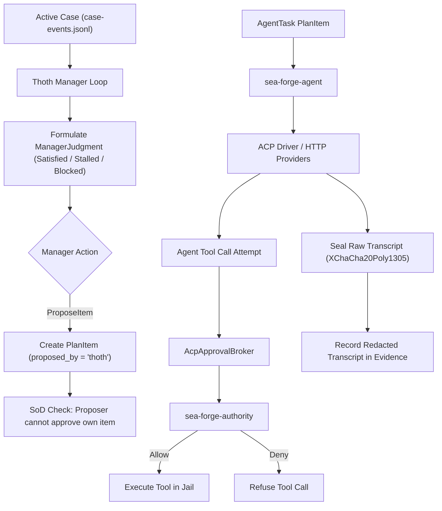

# Subsystem: Thoth & Agent Orchestration

> **Autonomous Development Life Cycle (ADLC) management, Agent Client Protocol (ACP) driver, and encrypted transcript sealing.**  
> Governed crates: `sea-forge-thoth`, `sea-forge-agent`

---

## 1. Purpose

The **Thoth & Agent Orchestration** subsystem enables governed autonomy within SEA Forge. It encompasses **Thoth** (an automated ADLC manager that inspects case execution progress, makes structured judgments, and proposes plan items under strict Separation of Duties) and **Governed Agent Adapters** (which connect external LLM providers and local coding agents via the Agent Client Protocol [ACP], intercepting and gating all tool calls through SEA Forge authority).

---

## 2. Responsibilities

* **Thoth Manager Iteration Loop (`sea-forge-thoth::manager`):** Periodically evaluates case progress against ledger events, forming auditable `ManagerJudgment`s (`Satisfied`, `Progressing`, `Stalled`, `Blocked`) grounded in verifiable claim references.
* **Separation of Duties (SoD) Enforcement:** Immutably records `proposed_by` metadata on any plan item proposed by an agent or Thoth, programmatically forbidding the proposer from approving its own tasks or resolving escalations.
* **Thoth Domain Q&A (`thoth.ask`):** Serves structured queries about the Genesis self-model, active capabilities, and architectural rules.
* **Agent Client Protocol (ACP) Driver (`sea-forge-agent::acp`):** Drives CLI-resident coding agents over JSON-RPC stdio pipes with session lifecycle tracking.
* **Tool Call Permission Brokering:** Intercepts agent tool calls (`write_file`, `execute_command`) and gates them through SEA Forge's central authority engine before execution.
* **Encrypted Transcript Sealing (`transcript_seal`):** Encrypts complete, raw conversation transcripts using XChaCha20Poly1305, preserving only redacted summaries in plaintext audit evidence.

---

## 3. Non-Responsibilities

* **Direct Execution Sandboxing:** Sandboxing is enforced by `sea-forge-sandbox`.
* **Prompt Engineering or Reasoning:** Does not dictate how the LLM reasons; governs only its inputs, outputs, tool permissions, and budgets.

---

## 4. Position in the System



---

## 5. Core Abstractions

### `ManagerIteration` (`sea-forge-core::types::ManagerIteration`)
An auditable step of the Thoth management loop:
```rust
pub struct ManagerIteration {
    pub version: String,
    pub case_id: String,
    pub iteration: u32,
    pub snapshot_case_version: String,
    pub snapshot_ledger_head: u64,
    pub settlement_events_observed: u32,
    pub proposal_source_ref: String,
    pub proposal_source_sha256: String,
    pub judgment: ManagerJudgment,
    pub rationale_claim_refs: Vec<String>, // Must be verifiable item/case IDs
    pub action: ManagerAction,             // Noop | ProposeItem | Escalate
    pub proposed_item_ref: Option<String>,
    pub granted: Option<bool>,
    pub recorded_at: String,
}
```

### `AcpSession` (`sea-forge-agent::acp::AcpSession`)
Manages an active Agent Client Protocol connection:
* Spawns agent subprocess over stdio pipes.
* Enforces `max_turns` and `token_budget` bounds.
* Intercepts `session/request_permission` calls.
* Maps tool requests to `AuthorityAction`s.

---

## 6. Internal Operation

### Separation of Duties (SoD) Protocol
1. When Thoth proposes a discretionary plan item, `proposed_by` is set to `"thoth:<iteration_id>"`.
2. This attribute forms part of the item's canonical hash; it cannot be altered after creation.
3. If this item requires an approval, `approvals.jsonl` verification enforces:
   $$\text{resolver.actor\_id} \ne \text{item.proposed\_by}$$
4. An automated agent can never approve its own actions.

### Encrypted Transcript Sealing
Raw agent transcripts often contain sensitive context or proprietary prompts. To balance security with auditability:
1. Complete conversation JSON is encrypted using a cell-specific XChaCha20Poly1305 key.
2. The ciphertext is saved to `.sea-forge/runs/<run_id>/artifacts/transcript.sealed`.
3. A redacted summary containing token usage, turn counts, tool call invocations, and sanitized outputs is generated.
4. The redacted summary is committed to `evidence.jsonl` with an SHA-256 hash reference to the sealed file.

---

## 7. Failure Modes & Invariants

* **Invariant AUTH-04 (Host-Resolved Actor & SoD):** Missing actor identity or self-approval attempts result in immediate fail-closed denial.
* **Turn Budget Exceeded:** If an agent exceeds `max_turns` without producing an acceptable result, the delegation terminates and settlement records basis `turn_cap_exceeded`.
* **ACP Disconnection:** If the agent process terminates prematurely, the session records basis `acp_disconnect` and settles as `Rejected`.

---

## 8. Source Trail

* [`crates/sea-forge-thoth/src/manager.rs`](file:///c:/Users/sprim/projects/sea-rs/crates/sea-forge-thoth/src/manager.rs) — Thoth manager loop, iteration logic, and SoD enforcement.
* [`crates/sea-forge-thoth/src/service.rs`](file:///c:/Users/sprim/projects/sea-rs/crates/sea-forge-thoth/src/service.rs) — `thoth.ask` Q&A implementation.
* [`crates/sea-forge-agent/src/acp.rs`](file:///c:/Users/sprim/projects/sea-rs/crates/sea-forge-agent/src/acp.rs) — Agent Client Protocol driver and session state.
* [`crates/sea-forge-agent/src/delegation.rs`](file:///c:/Users/sprim/projects/sea-rs/crates/sea-forge-agent/src/delegation.rs) — Delegation execution, transcript redaction, and hashing.
* [`crates/sea-forge-server/src/transcript_seal.rs`](file:///c:/Users/sprim/projects/sea-rs/crates/sea-forge-server/src/transcript_seal.rs) — XChaCha20Poly1305 transcript encryption.
