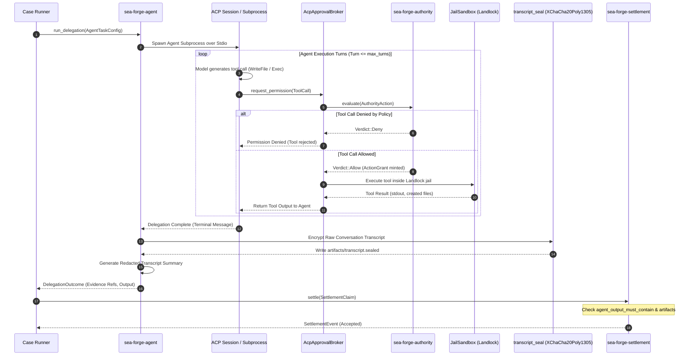

# Workflow: Autonomous Agent Delegation Flow (`agent.delegate`)

> **Governed agent execution, ACP tool permission brokering, and ChaCha20Poly1305 encrypted transcript sealing.**

---

## 1. Summary

When a case plan activates an `AgentTask` item, SEA Forge delegates autonomous problem-solving to an AI model or local coding agent. The agent runs under the Agent Client Protocol (ACP) or an HTTP adapter. Every tool call attempted by the agent is intercepted and submitted to SEA Forge's central authority engine. Execution is strictly bound by turn caps and token budgets. When the task finishes, the raw conversation transcript is encrypted with XChaCha20Poly1305, a sanitized summary is committed to audit evidence, and settlement evaluates the agent's deliverables against declared criteria.

---

## 2. Sequence Diagram

---

## 3. Detailed Execution Path

1. **Task Activation & Configuration (`case-runner` / `agent`):**
   * Case engine activates an `AgentTask` plan item specifying:
     * `endpoint_ref`: Pinned agent endpoint configuration.
     * `instruction`: Task goal and constraints.
     * `max_turns`: Hard upper bound on interaction turns (e.g. 20).
     * `token_budget`: Maximum token consumption limit.
2. **Session Launch (`agent/src/acp.rs`):**
   * Spawns the agent binary over stdio pipes using the Agent Client Protocol (ACP).
   * Passes the initial prompt and instructions.
3. **Tool Call Interception & Governance:**
   * When the agent decides to invoke a tool (e.g. editing a file or compiling code), the ACP session intercepts the request.
   * `AcpApprovalBroker` converts the tool call into an `AuthorityAction::WriteFile` or `ExecuteCommand`.
   * Evaluates the action against `PolicyAuthorityEngine`:
     * If denied, ACP returns a permission refusal to the agent, forcing it to try another approach.
     * If allowed, an `ActionGrant` is minted, and the tool is executed inside an isolated `JailSandbox`. The result is returned to the agent.
4. **Budget & Turn Tracking:**
   * Each round-trip increments turn count. If `max_turns` is reached without task completion, the session is forcibly terminated.
5. **Sealed Transcript Encryption (`server/src/transcript_seal.rs`):**
   * To prevent credential leakage while maintaining auditability:
     * Complete raw transcript JSON is encrypted using XChaCha20Poly1305.
     * Ciphertext is written to `.sea-forge/runs/<run_id>/artifacts/transcript.sealed`.
     * File SHA-256 hash is computed.
6. **Redacted Evidence Generation (`agent/src/delegation.rs`):**
   * Generates a sanitized `TranscriptSummary`:
     * Total turns, token usage, tool invocations, and redacted final output.
   * Commits summary to `.sea-forge/runs/<run_id>/evidence.jsonl`.
7. **Settlement Evaluation:**
   * `sea_forge_settlement::settle()` evaluates:
     * Did the agent output contain required strings (`agent_output_must_contain`)?
     * Were declared artifacts created in `artifacts/`?
   * If valid, returns `SettlementStatus::Accepted`.

---

## 4. Failure Branches

* **Turn Cap Exceeded:** If the agent reaches `max_turns` without completing the job, the session terminates. Settlement evaluates to `Rejected` with basis token `turn_cap_exceeded`.
* **ACP Disconnect:** If the agent process crashes or closes its stdio pipe, the session terminates with basis token `acp_disconnect`.
* **Tool Denial Loops:** If an agent repeatedly attempts actions forbidden by policy (e.g. accessing `/etc/shadow` or connecting to the internet), all attempts are rejected, and the agent exhausts its turns.

---

## 5. Source Trail

* [`crates/sea-forge-agent/src/delegation.rs`](file:///c:/Users/sprim/projects/sea-rs/crates/sea-forge-agent/src/delegation.rs) — `run_delegation()` and transcript summarization.
* [`crates/sea-forge-agent/src/acp.rs`](file:///c:/Users/sprim/projects/sea-rs/crates/sea-forge-agent/src/acp.rs) — Agent Client Protocol session and tool permission interception.
* [`crates/sea-forge-server/src/transcript_seal.rs`](file:///c:/Users/sprim/projects/sea-rs/crates/sea-forge-server/src/transcript_seal.rs) — XChaCha20Poly1305 cryptographic transcript sealing.
* [`crates/sea-forge-server/src/swe_seed_reconciliation.rs`](file:///c:/Users/sprim/projects/sea-rs/crates/sea-forge-server/src/swe_seed_reconciliation.rs) — SWE_SEED work contract reconciliation.
