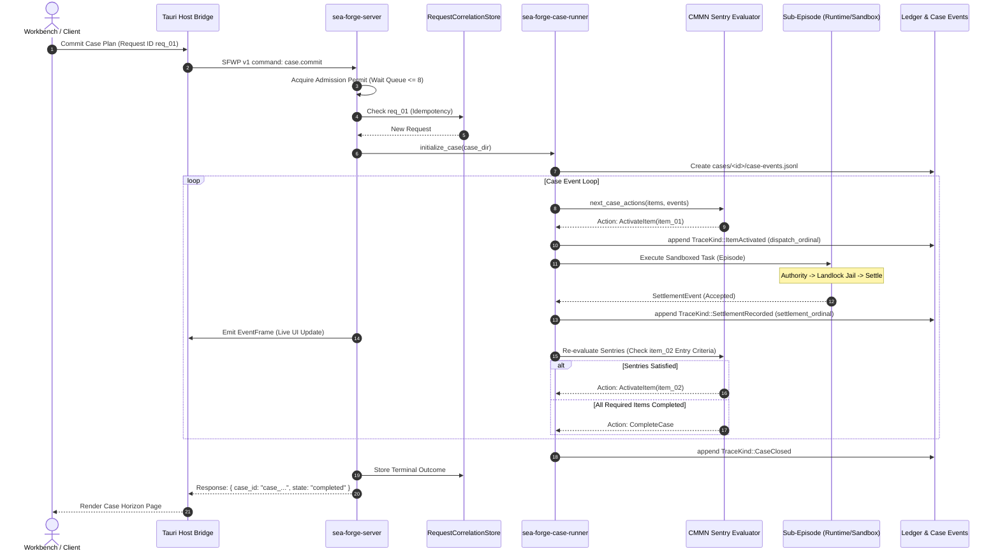

# Workflow: Case Orchestration Lifecycle (`case.commit`)

> **Multi-stage CMMN case execution, entry/exit sentries, sub-episode dispatch, and reactive event streaming.**

---

## 1. Summary

A client (such as the Workbench desktop UI or an automation script) submits a `CasePlan` via the SFWP socket command `case.commit`. The server admits the request through its bounded concurrency queue, verifies the idempotency key, initializes the case directory and journal, and activates the initial ready tasks. Each task runs as a governed sub-episode with full authority, sandbox isolation, and settlement. As trace events append to the case journal, CMMN sentries evaluate dependencies, automatically triggering downstream tasks until all required items settle and the case closes.

---

## 2. Sequence Diagram



---

## 3. Detailed Execution Path

1. **Request Ingress & Admission (`server/src/sfwp/case.rs`):**
   * The client sends `case.commit { request_id: "req_...", plan: {...} }`.
   * Acquires permit from `request_admission_waiters` (max 8 waiting, 10s deadline).
   * Acquires active execution permit from `request_admission` semaphore.
2. **Idempotency Gate (`server/src/sfwp/correlation.rs`):**
   * Checks `RequestCorrelationStore` inside `correlation_admission` lock.
   * If `req_...` already succeeded, immediately returns the stored `CaseCommitResult`.
3. **Case Initialization (`case-runner/src/lib.rs`):**
   * Creates directory `.sea-forge/cases/<case_id>/`.
   * Creates subdirectories: `runs/` and `case-events.jsonl`.
   * Writes initial case descriptor `.sea-forge/cases/<case_id>.json`.
4. **Sentry Activation Loop (`planner/src/case_engine.rs`):**
   * `next_case_actions()` scans all `PlanItem`s against current events in `case-events.jsonl`:
     * An item with empty `entry_criteria` activates immediately.
     * An item with sentries evaluates predicates (e.g. `SettlementStatus { status: "accepted" }` on upstream item).
5. **Sub-Episode Execution:**
   * Each active task runs an isolated sub-episode:
     * Generates a sub-run ID (`run_<ts>_<hex>`).
     * Commits `ItemActivated` with a monotonic `dispatch_ordinal`.
     * Runs full kernel pipeline: Authority evaluation → Landlock sandbox execution → Criteria settlement.
     * Records sub-run files under `.sea-forge/cases/<case_id>/runs/<run_id>/`.
6. **Reactive Progression:**
   * When the sub-episode completes, appends `SettlementRecorded` with a monotonic `settlement_ordinal`.
   * Downstream sentries observe the settlement event and enable dependent tasks.
7. **Event Broadcasting:**
   * Each event appended to `case-events.jsonl` is pushed to SFWP subscription channels. The desktop host receives live `EventFrame` updates over the local socket.
8. **Case Closure:**
   * When all required plan items reach `Completed` status, `can_auto_complete()` returns true.
   * Appends `CaseClosed` event; marks case record state as `Completed`.

---

## 4. State Transitions

```text
CaseState::Active (Created)
  ├── PlanItem 01: Enabled ──> Activated ──> Completed (Settled Accepted)
  ├── Sentries Triggered: PlanItem 02 Enabled
  ├── PlanItem 02: Activated ──> Completed (Settled Accepted)
CaseState::Completed (All Required Items Satisfied)
```

---

## 5. Failure Branches

* **Admission Overflow:** If more than 8 requests are waiting for permits, the server immediately rejects the request with error code `server_busy`. No disk state is created.
* **Sentry Rejection:** If an upstream item settles as `Rejected`, downstream items requiring `settlement_status == "accepted"` remain unactivated. The case stalls, emitting an event to notify the operator or triggering the Thoth manager loop for corrective planning.
* **Human Task Barrier:** If an item is an uncompleted `HumanTask`, execution pauses until an operator commits a resolution.

---

## 6. Source Trail

* [`crates/sea-forge-server/src/sfwp/case.rs`](file:///c:/Users/sprim/projects/sea-rs/crates/sea-forge-server/src/sfwp/case.rs) — `case.commit` endpoint and validation.
* [`crates/sea-forge-server/src/case_dispatch.rs`](file:///c:/Users/sprim/projects/sea-rs/crates/sea-forge-server/src/case_dispatch.rs) — Subprocess and internal episode dispatching.
* [`crates/sea-forge-case-runner/src/lib.rs`](file:///c:/Users/sprim/projects/sea-rs/crates/sea-forge-case-runner/src/lib.rs) — Synchronous case lifecycle coordination.
* [`crates/sea-forge-planner/src/case_engine.rs`](file:///c:/Users/sprim/projects/sea-rs/crates/sea-forge-planner/src/case_engine.rs) — CMMN sentry evaluation and transition logic.
