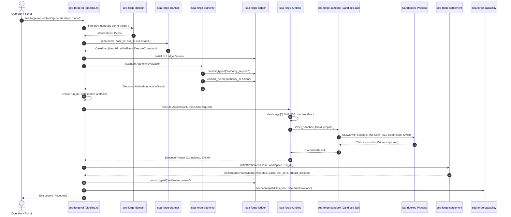

# Workflow: CLI Run Lifecycle (`sea-forge run`)

> **The end-to-end execution trace of a single-episode governed run from operator intent to settled capability.**

---

## 1. Summary

A developer or script executes `sea-forge run --intent "..."` or `--plan <path>`. The CLI parses the input, deterministically formulates a plan, validates workspace paths, evaluates authority rules before any side effect, commits decisions to the integrity ledger, spawns an isolated child process within an OS jail sandbox, captures all outputs and artifacts with SHA-256 pre-mint identities, settles the outcome against declared criteria, and appends the resulting capability envelope to durable memory.

---

## 2. Sequence Diagram

---

## 3. Step-by-Step Execution Path

1. **Ingress & Preflight (`cli/src/main.rs:26-41`):**
   * CLI receives CLI flags: `--intent`, `--policy`, `--root`, `--timeout`, `--entity`.
   * Invokes `pipeline::run(options)`.
2. **Intent Parsing (`domain/src/lib.rs`):**
   * `domain::interpret(&intent.summary)` maps raw string to an `IntentPattern`. Unrecognized patterns abort with exit code 2 (`ForgeError::UnknownIntent`).
3. **Deterministic Planning (`planner/src/lib.rs`):**
   * Translates intent into a single-episode `CasePlan`.
   * For `IntentPattern::Demo`, generates:
     * Operation 1: `WriteFile` (`model.sea`).
     * Operation 2: `ExecuteCommand` (`["sea-forge", "validate", "model.sea"]`).
     * Criteria: `require_exit_zero: true`, `required_artifacts: ["model.sea"]`, `stdout_must_contain: "sea-forge: model valid"`.
4. **Authority Pre-Evaluation (`authority/src/lib.rs`):**
   * Evaluates operations against active policy rules.
   * If DomainForge model exists, runs `DomainForgeCandidate::evaluate()`.
   * Evaluates actor roles and path boundaries.
   * Commits `authority_request` and `authority_decision` to the ledger stream.
5. **Grant Minting & Workspace Creation:**
   * If all decisions are `Allow`, mints move-only `ActionGrant`.
   * Creates physical directories: `<root>/runs/<run_id>/workspace` and `<root>/runs/<run_id>/artifacts`.
6. **Sandboxed Child Execution (`runtime/src/lib.rs`):**
   * Consumes `ActionGrant`.
   * Re-verifies `argv[0]` executable hash on disk.
   * Configures Landlock ruleset: read-only access to `/usr`, `/lib`; write access exclusively to `workspace/` and `artifacts/`.
   * Strips ambient environment variables, forwarding only `PATH` and `HOME`.
   * Spawns child and captures stdout/stderr with a 60-second timeout.
7. **Artifact Capture & Pre-Mint Identity (`evidence/src/lib.rs`):**
   * Reads generated `model.sea`.
   * Computes SHA-256 digest and formats pre-mint identity `ifl:hash:<sha256>`.
   * Records artifact descriptor in `evidence.jsonl`.
8. **Independent Settlement (`settlement/src/lib.rs`):**
   * `settlement::settle()` evaluates evidence against declared criteria.
   * Confirms child exited 0, `model.sea` exists on disk, and stdout matched.
   * Emits `SettlementEvent` with status `Accepted` and explicit basis tokens.
9. **Persistence & Capability Memory (`capability/src/lib.rs`):**
   * Writes `settlement.json` and `semantic-envelope.json`.
   * Commits `settlement_event` to the ledger.
   * Appends envelope to `.sea-forge/capabilities.jsonl` with `sync_data()`.
   * Returns exit code 0.

---

## 4. State Transitions

| Step | State Before | State After |
|---|---|---|
| Ingress | Only `.sea-forge/` exists | In-memory `Intent` created |
| Planning | In-memory `Intent` | In-memory `CasePlan` created |
| Authority | Uncommitted decisions | Ledger entries `authority_request` & `authority_decision` committed |
| Directory Setup | Empty run directory | `workspace/` and `artifacts/` created on disk |
| Execution | Empty workspace | `model.sea` written, child stdout captured |
| Evidence | Unindexed files | `evidence.jsonl` contains SHA-256 descriptors |
| Settlement | Unsettled run | `settlement.json` written, `SettlementStatus::Accepted` |
| Capability | Unmetabolized run | `capabilities.jsonl` appended with `SemanticEnvelope` |

---

## 5. Failure Branches

* **Branch A: Unrecognized Intent**
  * `domain::interpret()` fails → Returns `ForgeError::UnknownIntent`. Run terminates immediately with exit code 2. No directories or ledger entries are created.
* **Branch B: Authority Denial**
  * `authority::evaluate()` returns `Verdict::Deny` → Trace records `RunHalted`. Execution stops. `workspace/` is never created. Run exits with code 3 (if generated zone) or 1.
* **Branch C: Child Nonzero Exit or Timeout**
  * Child crashes or exceeds 60s → `ExecutionResult` captures `ExitCode(1)` or `TimedOut`. Settlement evaluates to `Rejected`. Basis records `exit_nonzero` or `timed_out`.
* **Branch D: False Success**
  * Child exits 0 but forgets to write `model.sea` → Settlement inspects workspace, discovers missing file, and evaluates to `Rejected` with basis `required_artifact_missing:model.sea`. Run exits with code 1.

---

## 6. Source Trail

* [`crates/sea-forge-cli/src/pipeline.rs:350-800`](file:///c:/Users/sprim/projects/sea-rs/crates/sea-forge-cli/src/pipeline.rs#L350-L800) — Main execution pipeline.
* [`crates/sea-forge-domain/src/lib.rs`](file:///c:/Users/sprim/projects/sea-rs/crates/sea-forge-domain/src/lib.rs) — Intent parsing.
* [`crates/sea-forge-planner/src/lib.rs`](file:///c:/Users/sprim/projects/sea-rs/crates/sea-forge-planner/src/lib.rs) — Plan generation.
* [`crates/sea-forge-authority/src/lib.rs`](file:///c:/Users/sprim/projects/sea-rs/crates/sea-forge-authority/src/lib.rs) — Authority evaluation and grant minting.
* [`crates/sea-forge-runtime/src/lib.rs`](file:///c:/Users/sprim/projects/sea-rs/crates/sea-forge-runtime/src/lib.rs) — Sandboxed child execution.
* [`crates/sea-forge-settlement/src/lib.rs`](file:///c:/Users/sprim/projects/sea-rs/crates/sea-forge-settlement/src/lib.rs) — Settlement claim evaluation.
