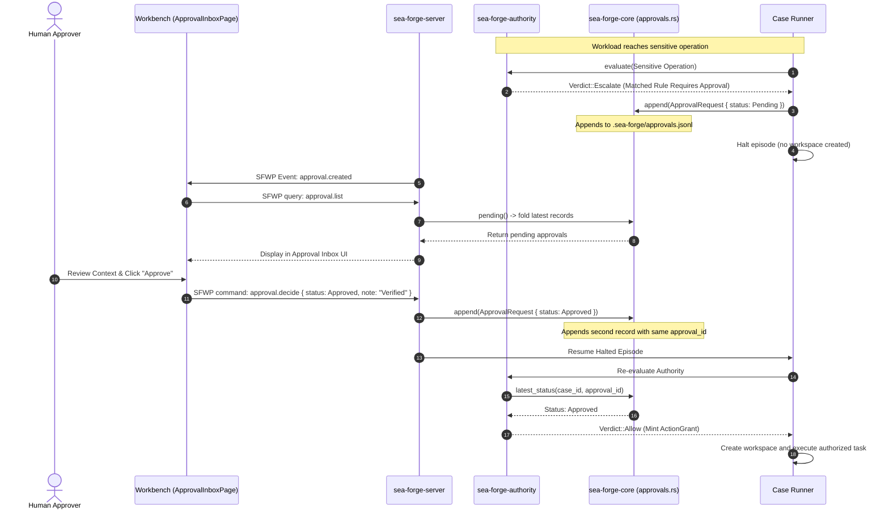

# Workflow: Human Approval Cycle (`approval.decide`)

> **Policy escalation, append-only approvals journal fold, Workbench inbox, and case resumption.**

---

## 1. Summary

When an operation requires human intervention according to active policy rules, the authority engine returns `Verdict::Escalate`. Execution halts immediately without creating a workspace. An `ApprovalRequest` is committed to the append-only approvals journal (`approvals.jsonl`). The event streams to the Workbench desktop client, where an authorized operator reviews the context and resolves the request via `approval.decide`. The decision is appended to the journal, and the case resumes execution using the approved standing.

---

## 2. Sequence Diagram



---

## 3. Detailed Execution Path

1. **Escalation Detection (`authority/src/lib.rs`):**
   * During authority evaluation, a rule matching the action declares `disposition: escalate` or `require_approval: true`.
   * The engine emits an `AuthorityDecision` with `verdict: Verdict::Escalate` and `outcome: Verdict::Escalate`.
2. **Journal Append (`core/src/approvals.rs:31-50`):**
   * Formulates an `ApprovalRequest` struct:
     * `approval_id`: Sequential case-scoped ID (`apr_0001`).
     * `case_id`, `run_id`, `plan_item_id`.
     * `requested_at` and `expires_at` (RFC3339 timestamps).
     * `status: ApprovalStatus::Pending`.
   * Appends the JSON record plus newline to `.sea-forge/approvals.jsonl` on an `O_APPEND` file descriptor.
3. **Execution Halting:**
   * The active run halts. A `RunHalted` event is logged to `trace.jsonl`.
   * Invariant **AUTH-01** holds: no workspace is created, and no child process is spawned.
4. **Workbench Notification & Inbox Display:**
   * SFWP emits a live `EventFrame` over the active subscription.
   * Workbench's `useApprovals()` query refetches `approval.list`.
   * The server executes `approvals::pending(root)`, which folds all lines in `approvals.jsonl` taking the **latest record for each `(case_id, approval_id)` key**.
   * The pending item appears in the desktop's `ApprovalInboxPage`.
5. **Human Decision Ingress (`server/src/sfwp/approvals.rs`):**
   * The operator clicks "Approve" (or "Reject"), adding an optional audit note.
   * Workbench submits `approval.decide { request_id: "req_...", case_id: "case_...", approval_id: "apr_0001", decision: "approved", note: "..." }`.
   * Server validates that the calling actor has approval rights and is not the proposer (SoD check).
   * Appends an updated `ApprovalRequest` with `status: ApprovalStatus::Approved`, `resolved_by: actor`, and `resolved_at: now` to `approvals.jsonl`.
6. **Case Resumption:**
   * Case runner resumes the halted item.
   * `PolicyAuthorityEngine` re-evaluates the operation, observes the committed approval in `approvals.jsonl`, produces `Verdict::Allow`, mints the `ActionGrant`, and proceeds to sandboxed execution.

---

## 4. The Latest-Wins Fold Rule

The approvals journal is **strictly append-only**: a resolution never edits an existing line in `approvals.jsonl`.

Instead, `sea_forge_core::approvals::latest_by_id` applies a deterministic fold:
```rust
pub fn latest_by_id(root: &Path) -> Result<Vec<ApprovalRequest>, ForgeError> {
    let all = load_all(root)?;
    let mut seen: BTreeMap<(String, String), ApprovalRequest> = BTreeMap::new();
    for request in all {
        seen.insert((request.case_id.clone(), request.approval_id.clone()), request);
    }
    Ok(seen.into_values().collect())
}
```
**Critical Discovery & Fix:** Folding is keyed by `(case_id, approval_id)` rather than `approval_id` alone. Because approval IDs are per-case ordinals (`apr_0001`), folding on the ID alone caused resolving an approval in Case A to overwrite and strand the pending `apr_0001` in Case B.

---

## 5. Failure Branches

* **Window Expiry:** If current time exceeds `expires_at`, `check_expiry()` returns `Some(true)`. The approval is marked as `Expired`. Attempts to approve return an error, and the episode settles as `Rejected`.
* **Rejection by Operator:** If the approver clicks "Reject", an `ApprovedStatus::Rejected` record is appended. The episode settles as `Rejected` with basis `authority_escalate` and `approval_rejected`.
* **Separation of Duties (SoD) Violation:** If an automated agent or Thoth attempts to resolve an approval for an item it proposed (`proposed_by == actor`), the server rejects the command with `sod_violation`.

---

## 6. Source Trail

* [`crates/sea-forge-core/src/approvals.rs`](file:///c:/Users/sprim/projects/sea-rs/crates/sea-forge-core/src/approvals.rs) — Journal append, load, fold, and expiry logic.
* [`crates/sea-forge-server/src/sfwp/approvals.rs`](file:///c:/Users/sprim/projects/sea-rs/crates/sea-forge-server/src/sfwp/approvals.rs) — SFWP `approval.list` and `approval.decide` endpoints.
* [`workbench/apps/desktop/src/pages/ApprovalInboxPage.tsx`](file:///c:/Users/sprim/projects/sea-rs/workbench/apps/desktop/src/pages/ApprovalInboxPage.tsx) — Desktop UI approval inbox.
* [`crates/sea-forge-cli/src/main.rs#L148-L171`](file:///c:/Users/sprim/projects/sea-rs/crates/sea-forge-cli/src/main.rs#L148-L171) — CLI `sea-forge approve` and `sea-forge reject` commands.
