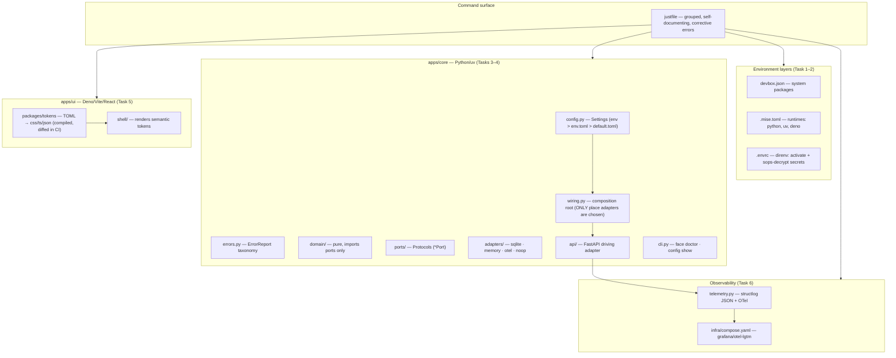

# ARCHITECTURE.md — FACE Workbench

<!--
WHAT THIS FILE IS FOR
The living map of the system: where things live, why they're shaped that way, and how to
extend them without breaking the invariants. SPEC.md is the contract (normative, versioned);
this file is the tour guide (descriptive, updated as code lands). When they disagree, SPEC.md
wins — and the disagreement is a bug in one of them.

HOW TO MAINTAIN IT
- Update the ADR table in the same PR as any decision that future-you would ask "why?" about.
- The extension recipes (§6) are the DX payoff — keep them accurate or delete them.
- Placeholders marked [UNDECIDED] are real open decisions; resolve them via an ADR row.
-->

Status: reflects SPEC.md v0.1 (pre-implementation). Sections describing code are the *intended* shape until DEV_PLAN.md tasks land; each notes its task.

---

## 1. System at a glance

FACE is a hexagonal (ports & adapters) polyglot monorepo with one command surface (`just`):



Authoritative details: file tree → SPEC.md Appendix B · dependencies → Appendix C · error taxonomy & blast radius → SPEC.md §8.3.

## 2. The load-bearing invariants

<!-- These are the rules the linters enforce. An agent that internalizes these five needs
     almost nothing else from this file. -->

1. **Adapters are chosen in exactly one place.** `wiring.py` maps `Settings` adapter keys → factories. Domain/services import ports only; `import-linter` fails the build otherwise.
2. **Every dependency lives in exactly one pin file** (devbox.json / .mise.toml / pyproject+uv.lock / deno.json+lock). Nothing installs globally; nothing floats.
3. **Every failure ends with a `next move:`** — the `ErrorReport` shape (`code`, `what_happened`, `next_move`, `layer`) is the only error surface, in the CLI, the API, and the justfile.
4. **Generated files are compiled, committed, and diffed.** `packages/tokens/dist/` changes only via `just tokens`; a dirty diff fails `just check`. Hand edits are structurally impossible to merge.
5. **Telemetry degrades, never blocks.** Infra down = warn-and-drop, app keeps serving (`infra_unavailable_error` is the only degrade-class error).

## 3. Runtime & data flow

### Request path (walking skeleton)

```text
just dev
  → uvicorn (127.0.0.1:8300, reload) + vite dev server
  → GET /health → api/ → services → PersistencePort + ClockPort (via wiring)
  → structlog JSON line {event, level, trace_id, face_env}
  → OTel span → OTLP → otel-lgtm container (if up) → Grafana
```

### Configuration resolution (every process start)

```text
FACE_ENV (default dev)
  → sops -d secrets/${FACE_ENV}.enc.env  (via direnv → FACE_* env vars)
  → Settings: env vars  >  config/${FACE_ENV}.toml  >  config/default.toml
  → validate (typed errors §8.3) → wiring.py builds AdapterBindings → app starts
```

Failure at any arrow = typed error + next move, exit non-zero, nothing partial.

### Environments

| Env | Persistence | Telemetry | Needs Docker | Used by |
| --- | --- | --- | --- | --- |
| `dev` | sqlite | otel | optional (degrade) | local dev |
| `test` | memory or sqlite (matrix) | noop | never | pytest |
| `ci` | matrix legs | noop | never | GitHub Actions |
| `prod` | [UNDECIDED — post-v1 ADR] | otel | — | roadmap |

## 4. Ports & adapters catalog

<!-- Add a row per port as it lands. Contract tests are the source of truth for a port's
     semantics — link them, don't restate them. -->

| Port | Real adapter | Test adapter | Contract test | Notes |
| --- | --- | --- | --- | --- |
| `PersistencePort` | `adapters/sqlite` (stdlib sqlite3, db in `var/`) | `adapters/memory` | `tests/contract/test_ports.py` | swap = config change only (proven in CI matrix) |
| `ClockPort` | system clock | fixed/frozen clock | same | exists so time is testable from day one |
| `TelemetryPort` | `adapters/otel` | `adapters/noop` | same | never in the request's failure path |
| {{NEXT_PORT e.g. `AgentEventPort` — the semantic state bus ingress}} | [UNDECIDED] | [UNDECIDED] | — | first feature-driven port; needs PRODUCT.md §6 answered |

## 5. Decision log (ADRs)

<!-- One row per decision. "Revisit when" is the most useful column — it turns decisions
     from dogma into tripwires. Add rows in the same PR as the decision. -->

| # | Decision | Why | Rejected | Revisit when |
| --- | --- | --- | --- | --- |
| 1 | devbox + mise + uv/deno layering | each tool pins exactly one layer; fully committed, no global installs | Nix flakes raw (steeper), asdf (mise supersedes), Docker dev containers (heavier inner loop) | devbox+direnv+mise activation conflicts (DEV_PLAN Task 1 trigger) |
| 2 | Hexagonal w/ single composition root | "swap parts easily" is a stated requirement; config-driven binding makes it a test, not a hope | layered monolith (boundaries erode without enforcement) | a port accumulates >3 adapters or wiring.py grows branching logic |
| 3 | sops/age + direnv for secrets | encrypted secrets are committable + auditable; recipients list = access control | vault (infra tax), .env.example (drift, leak-prone) | team grows beyond individual age keys |
| 4 | `just` as sole command surface | one discoverable, self-documenting entry point; CI runs identical recipes | make (worse UX), npm scripts (wrong layer), custom CLI for dev tasks (build later, on top) | recipe count pressure exceeds 20 (SPEC §10.3) |
| 5 | `grafana/otel-lgtm` single container | full LGTM stack, one pinned image, one compose file | 4-service compose (maintenance), vendor SaaS (lock-in, needs network) | too heavy on WSL2 (DEV_PLAN Task 6 trigger → console exporter default) |
| 6 | Token TOML compiled to committed dist/ | UI builds without compiler step; diff-check keeps outputs honest; DESIGN.md's one-source-many-projections | runtime token loading (CLI + Tailwind can't consume), uncommitted dist (breaks clean clone) | a fourth projection target appears (TUI theme) |
| 7 | FastAPI + Deno/Vite/React stack | inferred from dump.md (React/CopilotKit direction, Python/TS bindings) | — | **[NEEDS CONFIRMATION — see SPEC §6 note; cheapest to change before Task 4]** |
| {{N}} | {{DECISION}} | {{WHY}} | {{REJECTED}} | {{TRIPWIRE}} |

## 6. Extension recipes (how to add things)

<!-- The DX heart of this file. Each recipe: exact files, exact gates. Keep in lockstep
     with reality — a wrong recipe is worse than none. -->

### Add a new port + adapter

1. Define the Protocol in `apps/core/src/face_core/ports/<name>.py` — PascalCase, `Port` suffix (lint-enforced).
2. Add ≥2 adapters under `adapters/<key>/` — one real, one memory/noop. Constructed from `Settings` only.
3. Register factories in `wiring.py`; add the key to the `Settings` validation enum.
4. Add the port to the parametrized suite in `tests/contract/test_ports.py`.
5. Gate: `just check && just test` — the contract tests run against every registered adapter automatically.

### Add a dependency

Follow SPEC.md Appendix C.3 verbatim: rung-by-rung justification in the PR, correct layer, lock file in the same commit, behind a port if swappable. No exceptions — the ladder is the review checklist.

### Add a `just` recipe

1. Verb-first, ≤2 words, under the right group header, one-line `#` doc comment (renders in `just --list`).
2. Failure paths end with `next move: <runnable command>`.
3. If it takes the surface past 20 recipes, merge into a subcommand group instead (`just obs up` pattern).

### Add a config field

1. Field + validation in `config.py` `Settings`; default in `config/default.toml`; env override uses `FACE_` prefix.
2. Secret values go in `secrets/<env>.enc.env` via `just secrets edit`, never in TOML.
3. Test the precedence + failure mode in `tests/unit/test_config.py`. Update SPEC §8.2's table.

### Add a UI component

Every component maps to a semantic primitive and consumes tokens only (DESIGN.md §6 — no raw hex, no appearance-named values). Build order for the spine: SituationHeader → AffordanceCard → PolicyGate → EvidenceChecklist → SettlementPanel.

### Add an app to the monorepo (e.g. TUI)

1. New dir under `apps/<name>/` with its own pin/lock file in the correct runtime layer.
2. It consumes `packages/tokens/dist/` for theming and talks to core only through the API (or a new port — never imports core internals).
3. Wire its check/test into the existing `just check` / `just test` recipes; add a doctor row.

## 7. Testing strategy map

| Layer | Lives in | Proves | Runs without Docker |
| --- | --- | --- | --- |
| Unit | `tests/unit/` | config precedence, error taxonomy, domain logic | yes |
| Contract | `tests/contract/` | every adapter honors its port identically | yes |
| Integration | `tests/integration/` | walking skeleton end-to-end (in-process httpx), telemetry span/log shape (in-memory exporter) | yes |
| Real infra | Task 6 gate only | trace reaches actual LGTM stack | no — skipped (reported as skipped) when Docker absent |
| Foundation | `just doctor` + CI fresh-clone job | the environment itself | yes |

## 8. Known tensions & open questions

<!-- Honest list. Agents: check here before "fixing" something that looks odd. -->

- **Stack confirmation (ADR 7)** — FastAPI/React inferred, not chosen by the user. Confirm before Task 4; cost of change grows steeply after wiring lands.
- **Committed generated dist/** trades repo purity for clone-and-build simplicity — deliberate (invariant 4); do not "clean up" by gitignoring it.
- **direnv hard dependency** — recipes see empty `FACE_*` in non-direnv shells; the guard in each secret-dependent recipe is load-bearing, not paranoia (SPEC §9.5).
- **`prod` environment** is a named enum value with no infrastructure behind it — placeholder for the post-v1 deployment ADR, kept so config code doesn't churn later.
- {{OPEN_QUESTION}}
